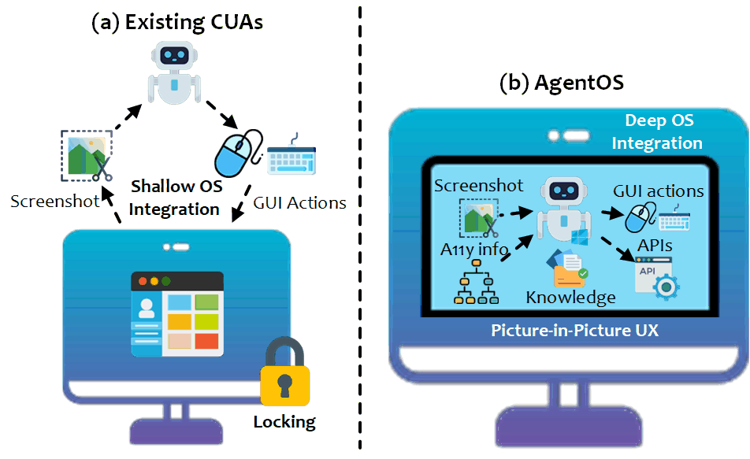
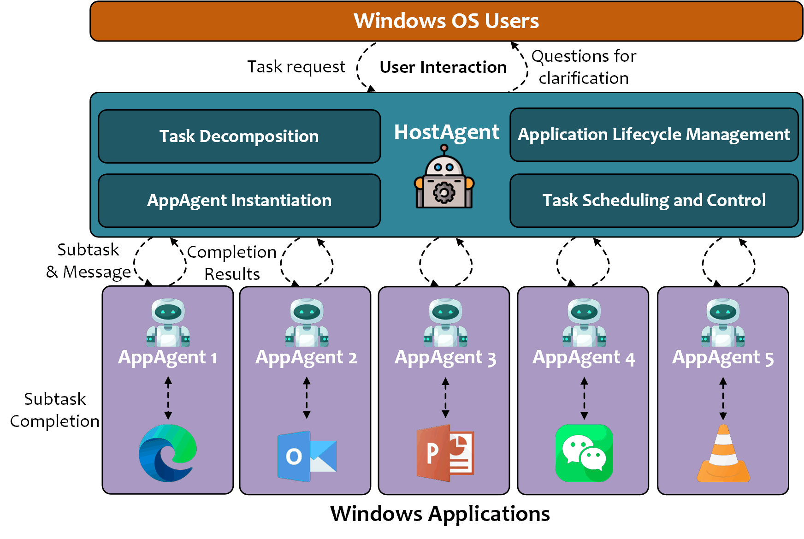

<!-- markdownlint-disable MD033 MD041 -->
<h1 align="center">
  <b>UFO²</b>  :&nbsp;The&nbsp;Desktop&nbsp;AgentOS
</h1>
<p align="center">
  <em>Turn natural‑language requests into automatic, reliable, multi‑application workflows on Windows, beyond UI-Focused.</em>
</p>


<div align="center">

[](https://arxiv.org/abs/2504.14603)&ensp;
&ensp;
[](https://opensource.org/licenses/MIT)&ensp;
[](https://microsoft.github.io/UFO/)&ensp;
[](https://www.youtube.com/watch?v=QT_OhygMVXU)&ensp;
<!-- [](https://twitter.com/intent/follow?screen_name=UFO_Agent) -->
<!-- &ensp; -->

</div>

<!-- **UFO** is a **UI-Focused** multi-agent framework to fulfill user requests on **Windows OS** by seamlessly navigating and operating within individual or spanning multiple applications. -->

<h1 align="center">
     
</h1>

---

## ✨ Key Capabilities
<div align="center">

| [Deep OS Integration](https://microsoft.github.io/UFO)  | Picture‑in‑Picture Desktop *(coming soon)* | [Hybrid GUI + API Actions](https://microsoft.github.io/UFO/automator/overview) |
|---------------------|-------------------------------------------|---------------------------|
| Combines Windows UIA, Win32 and WinCOM for first‑class control detection and native commands. | Automation runs in a sandboxed virtual desktop so you can keep using your main screen. | Chooses native APIs when available, falls back to clicks/keystrokes when not—fast *and* robust. |

| [Speculative Multi‑Action](https://microsoft.github.io/UFO/advanced_usage/multi_action) | [Continuous Knowledge Substrate](https://microsoft.github.io/UFO/advanced_usage/reinforce_appagent/overview/) | [UIA + Visual Control Detection](https://microsoft.github.io/UFO/advanced_usage/control_detection/hybrid_detection) |
|--------------------------|--------------------------------|--------------------------------|
| Bundles several predicted steps into one LLM call, validated live—up to **51 % fewer** queries. | Mixes docs, Bing search, user demos and execution traces via RAG for agents that learn over time. | Detects standard *and* custom controls with a hybrid UIA + vision pipeline. |

</div>

*See the [documentation](https://microsoft.github.io/UFO/) for full details.*

---

## 📢 News
- 📅 2025-04-19: Version **v2.0.0** Released! We’re excited to announce the release the **UFO²**! UFO² is a major upgrade to the original UFO, featuring with enhanced capabilities. It introduces the **AgentOS** concept, enabling seamless integration of multiple agents for complex tasks. Please check our [new technical report](https://arxiv.org/pdf/2504.14603) for more details.
- 📅 ...
- 📅 2024-02-14: Our [technical report](https://arxiv.org/abs/2402.07939) for UFO is online!
- 📅 2024-02-10: The first version of UFO is released on GitHub🎈. Happy Chinese New year🐉!

---

## 🏗️ Architecture overview
<p align="center">
  
</p>


UFO² operates as a **Desktop AgentOS**, encompassing a multi-agent framework that includes:

1. **HostAgent** – Parses the natural‑language goal, launches the necessary applications, spins up / coordinates AppAgents, and steers a global finite‑state machine (FSM).  
2. **AppAgents** – One per application; each runs a ReAct loop with multimodal perception, hybrid control detection, retrieval‑augmented knowledge, and the **Puppeteer** executor that chooses between GUI actions and native APIs.  
3. **Knowledge Substrate** – Blends offline documentation, online search, demonstrations, and execution traces into a vector store that is retrieved on‑the‑fly at inference.  
4. **Speculative Executor** – Slashes LLM latency by predicting batches of likely actions and validating them against live UIA state in a single shot.  
5. **Picture‑in‑Picture Desktop** *(coming soon)* – Runs the agent in an isolated virtual desktop so your main workspace and input devices remain untouched.

For a deep dive see our [technical report](https://arxiv.org/pdf/2504.14603) or the [docs site](https://microsoft.github.io/UFO).

---

## 🌐 Media Coverage 

UFO sightings have garnered attention from various media outlets, including:
- [微软正式开源UFO²，Windows桌面迈入「AgentOS 时代」](https://www.jiqizhixin.com/articles/2025-05-06-13)
- [Microsoft's UFO abducts traditional user interfaces for a smarter Windows experience](https://the-decoder.com/microsofts-ufo-abducts-traditional-user-interfaces-for-a-smarter-windows-experience/)
- [🚀 UFO & GPT-4-V: Sit back and relax, mientras GPT lo hace todo🌌](https://www.linkedin.com/posts/gutierrezfrancois_ai-ufo-microsoft-activity-7176819900399652865-pLoo?utm_source=share&utm_medium=member_desktop)
- [The AI PC - The Future of Computers? - Microsoft UFO](https://www.youtube.com/watch?v=1k4LcffCq3E)
- [下一代Windows系统曝光：基于GPT-4V，Agent跨应用调度，代号UFO](https://baijiahao.baidu.com/s?id=1790938358152188625&wfr=spider&for=pc)
- [下一代智能版 Windows 要来了？微软推出首个 Windows Agent，命名为 UFO！](https://blog.csdn.net/csdnnews/article/details/136161570)
- [Microsoft発のオープンソース版「UFO」登場！　Windowsを自動操縦するAIエージェントを試す](https://internet.watch.impress.co.jp/docs/column/shimizu/1570581.html)
- ...

These sources provide insights into the evolving landscape of technology and the implications of UFO phenomena on various platforms.

---

## 🚀 Three‑minute Quickstart


### 🛠️ Step 1: Installation
UFO requires **Python >= 3.10** running on **Windows OS >= 10**. It can be installed by running the following command:
```powershell
# [optional to create conda environment]
# conda create -n ufo python=3.10
# conda activate ufo

# clone the repository
git clone https://github.com/microsoft/UFO.git
cd UFO
# install the requirements
pip install -r requirements.txt
# If you want to use the Qwen as your LLMs, uncomment the related libs.
```

### ⚙️ Step 2: Configure the LLMs
Before running UFO, you need to provide your LLM configurations **individually for HostAgent and AppAgent**. You can create your own config file `ufo/config/config.yaml`, by copying the `ufo/config/config.yaml.template` and editing config for **HOST_AGENT** and **APP_AGENT** as follows: 

```powershell
copy ufo\config\config.yaml.template ufo\config\config.yaml
notepad ufo\config\config.yaml   # paste your key & endpoint
```

#### OpenAI
```yaml
VISUAL_MODE: True, # Whether to use the visual mode
API_TYPE: "openai" , # The API type, "openai" for the OpenAI API.  
API_BASE: "https://api.openai.com/v1/chat/completions", # The the OpenAI API endpoint.
API_KEY: "sk-",  # The OpenAI API key, begin with sk-
API_VERSION: "2024-02-15-preview", # "2024-02-15-preview" by default
API_MODEL: "gpt-4o",  # The only OpenAI model
```

#### Azure OpenAI (AOAI)
```yaml
VISUAL_MODE: True, # Whether to use the visual mode
API_TYPE: "aoai" , # The API type, "aoai" for the Azure OpenAI.  
API_BASE: "YOUR_ENDPOINT", #  The AOAI API address. Format: https://{your-resource-name}.openai.azure.com
API_KEY: "YOUR_KEY",  # The aoai API key
API_VERSION: "2024-02-15-preview", # "2024-02-15-preview" by default
API_MODEL: "gpt-4o",  # The only OpenAI model
API_DEPLOYMENT_ID: "YOUR_AOAI_DEPLOYMENT", # The deployment id for the AOAI API
```

> Need Qwen, Gemini, non‑visual GPT‑4, or even **OpenAI CUA Operator** as a AppAgent? See the [model guide](https://microsoft.github.io/UFO/supported_models/overview/).

### 📔 Step 3: Additional Setting for RAG (optional).
If you want to enhance UFO's ability with external knowledge, you can optionally configure it with an external database for retrieval augmented generation (RAG) in the `ufo/config/config.yaml` file. 

We provide the following options for RAG to enhance UFO's capabilities:
- [Offline Help Document](https://microsoft.github.io/UFO/advanced_usage/reinforce_appagent/learning_from_help_document/) Enable UFO to retrieve information from offline help documents.
- [Online Bing Search Engine](https://microsoft.github.io/UFO/advanced_usage/reinforce_appagent/learning_from_bing_search/): Enhance UFO's capabilities by utilizing the most up-to-date online search results.
- [Self-Experience](https://microsoft.github.io/UFO/advanced_usage/reinforce_appagent/experience_learning/): Save task completion trajectories into UFO's memory for future reference.
- [User-Demonstration](https://microsoft.github.io/UFO/advanced_usage/reinforce_appagent/learning_from_demonstration/): Boost UFO's capabilities through user demonstration.

Consult their respective documentation for more information on how to configure these settings.


### 🎉 Step 4: Start UFO

#### ⌨️ You can execute the following on your Windows command Line (CLI):

```powershell
# assume you are in the cloned UFO folder
python -m ufo --task <your_task_name>
```

This will start the UFO process and you can interact with it through the command line interface. 
If everything goes well, you will see the following message:

```powershell
Welcome to use UFO🛸, A UI-focused Agent for Windows OS Interaction. 
 _   _  _____   ___
| | | ||  ___| / _ \
| | | || |_   | | | |
| |_| ||  _|  | |_| |
 \___/ |_|     \___/
Please enter your request to be completed🛸:
```

Alternatively, you can also directly invoke UFO with a specific task and request by using the following command:

```powershell
python -m ufo --task <your_task_name> -r "<your_request>"
```


###  Step 5 🎥: Execution Logs 

You can find the screenshots taken and request & response logs in the following folder:
```
./ufo/logs/<your_task_name>/
```
You may use them to debug, replay, or analyze the agent output.


## ❓Get help 
* Please first check our our documentation [here](https://microsoft.github.io/UFO/).
* ❔GitHub Issues (prefered)
* For other communications, please contact [ufo-agent@microsoft.com](mailto:ufo-agent@microsoft.com).
---


## 📊 Evaluation

UFO² is rigorously benchmarked on two publicly‑available live‑task suites:

| Benchmark | Scope | Documents |
|-----------|-------|-------|
| [**Windows Agent Arena (WAA)**](https://github.com/nice-mee/WindowsAgentArena) | 154 real Windows tasks across 15 applications (Office, Edge, File Explorer, VS Code, …) | <https://microsoft.github.io/UFO/benchmark/windows_agent_arena/> |
| [**OSWorld (Windows)**](https://github.com/nice-mee/WindowsAgentArena/tree/2020-qqtcg/osworld) | 49 cross‑application tasks that mix Office 365, browser and system utilities | <https://microsoft.github.io/UFO/benchmark/osworld> |

The integration of these benchmarks into UFO² is in separate repositories. Please follow the above documents for more details.

---


## 📚 Citation

If you build on this work, please cite our the AgentOS framework:

**UFO² – The Desktop AgentOS (2025)**  
<https://arxiv.org/abs/2504.14603>
```bibtex
@article{zhang2025ufo2,
  title   = {{UFO2: The Desktop AgentOS}},
  author  = {Zhang, Chaoyun and Huang, He and Ni, Chiming and Mu, Jian and Qin, Si and He, Shilin and Wang, Lu and Yang, Fangkai and Zhao, Pu and Du, Chao and Li, Liqun and Kang, Yu and Jiang, Zhao and Zheng, Suzhen and Wang, Rujia and Qian, Jiaxu and Ma, Minghua and Lou, Jian-Guang and Lin, Qingwei and Rajmohan, Saravan and Zhang, Dongmei},
  journal = {arXiv preprint arXiv:2504.14603},
  year    = {2025}
}
```

**UFO – A UI‑Focused Agent for Windows OS Interaction (2024)**  
<https://arxiv.org/abs/2402.07939>
```bibtex
@article{zhang2024ufo,
  title   = {{UFO: A UI-Focused Agent for Windows OS Interaction}},
  author  = {Zhang, Chaoyun and Li, Liqun and He, Shilin and Zhang, Xu and Qiao, Bo and Qin, Si and Ma, Minghua and Kang, Yu and Lin, Qingwei and Rajmohan, Saravan and Zhang, Dongmei and Zhang, Qi},
  journal = {arXiv preprint arXiv:2402.07939},
  year    = {2024}
}
```


---

## 📝 Roadmap

The UFO² team is actively working on the following features and improvements:

- [ ] **Picture‑in‑Picture Mode** – Completed and will be available in the next release  
- [ ] **AgentOS‑as‑a‑Service** – Completed and will be available in the next release  
- [ ] **Auto‑Debugging Toolkit** – Completed and will be available in the next release  
- [ ] **Integration with MCP and Agent2Agent Communication** – Planned; under implementation  


---

## 🎨 Related Projects
- **TaskWeaver** — a code‑first LLM agent for data analytics: <https://github.com/microsoft/TaskWeaver>  
- **LLM‑Brained GUI Agents: A Survey**: <https://arxiv.org/abs/2411.18279> • [GitHub](https://github.com/vyokky/LLM-Brained-GUI-Agents-Survey) • [Interactive site](https://vyokky.github.io/LLM-Brained-GUI-Agents-Survey/)

---


## ⚠️ Disclaimer
By choosing to run the provided code, you acknowledge and agree to the following terms and conditions regarding the functionality and data handling practices in [DISCLAIMER.md](./DISCLAIMER.md)


##  Trademarks

This project may contain trademarks or logos for projects, products, or services. Authorized use of Microsoft 
trademarks or logos is subject to and must follow 
[Microsoft's Trademark & Brand Guidelines](https://www.microsoft.com/en-us/legal/intellectualproperty/trademarks/usage/general).
Use of Microsoft trademarks or logos in modified versions of this project must not cause confusion or imply Microsoft sponsorship.
Any use of third-party trademarks or logos are subject to those third-party's policies.


---

## ⚖️ License
This repository is released under the [MIT License](LICENSE) (SPDX‑Identifier: MIT).  
See [DISCLAIMER.md](DISCLAIMER.md) for privacy & safety notices.

---

<p align="center"><sub>© Microsoft 2025 • UFO² is an open‑source project, not an official Windows feature.</sub></p>

