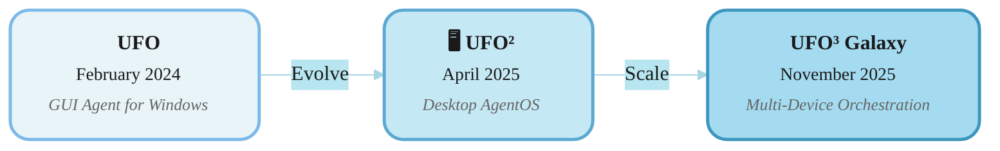

<!-- markdownlint-disable MD033 MD041 -->

<h1 align="center">
  <b>UFO³</b>  : Weaving the Digital Agent Galaxy
</h1>
<p align="center">
  <em>From Single Device Agent to Multi-Device Galaxy</em>
</p>

<p align="center">
  <strong>📖 Language / 语言:</strong>
  <a href="README.md"><strong>English</strong></a> | 
  <a href="README_ZH.md">中文</a>
</p>

<div align="center">
<a href="https://trendshift.io/repositories/7874" target="_blank"></a>

<br/>

[](https://arxiv.org/abs/2511.11332)&ensp;
[](https://arxiv.org/abs/2504.14603)&ensp;
&ensp;
[](https://opensource.org/licenses/MIT)&ensp;
[](https://microsoft.github.io/UFO/)&ensp;
[](https://www.youtube.com/watch?v=NGrVWGcJL8o)&ensp;


</div>

<p align="center">
  <strong>📚 Quick Links:</strong>
  <a href="./galaxy/README.md">🌌 UFO³ README</a> •
  <a href="./ufo/README.md">🖥️ UFO² README</a> •
  <a href="https://microsoft.github.io/UFO/">📖 Full Documentation</a>
</p>

---

## 🎯 Choose Your Path

<table align="center" width="95%">
<tr>
<td width="50%" valign="top">

###  **UFO³ Multi-Device Agent Galaxy**
<sub>**✨ NEW & RECOMMENDED**</sub>

**Perfect for:**
- 🔗 Cross-device collaboration workflows
- 📊 Complex multi-step automation  
- 🎯 DAG-based task orchestration
- 🌍 Heterogeneous platform integration

**Key Features:**
- **Constellation**: Task decomposition into executable DAGs
- **Dynamic DAG editing** for adaptive workflow evolution
- **Asynchronous execution** with parallel task coordination
- **Unified AIP protocol** for secure agent communication


**📖 [Galaxy Documentation →](./galaxy/README.md)**  
**📖 [Galaxy Quick Start →](https://microsoft.github.io/UFO/getting_started/quick_start_galaxy/)** ⭐ **Online Docs**

</td>
<td width="50%" valign="top">

###  **UFO² Desktop AgentOS**
<sub>**STABLE & BATTLE-TESTED**</sub>

**Perfect for:**
- 💻 Single Windows automation
- ⚡ Quick task execution
- 🎓 Learning agent basics
- 🛠️ Simple workflows

**Key Features:**
- Deep Windows OS integration
- Hybrid GUI + API actions
- Proven reliability
- Easy setup
- Can serve as Galaxy device agent


**📖 [UFO² Documentation →](./ufo/README.md)**

</td>
</tr>
</table>

---

## 🎬 See UFO³ Galaxy in Action

Watch how UFO³ Galaxy orchestrates complex workflows across multiple devices:

<div align="center">
  <a href="https://www.youtube.com/watch?v=NGrVWGcJL8o">
    
  </a>
  <p><em>🎥 Click to watch: Cross-device task orchestration with UFO³ Galaxy</em></p>
</div>

---

## 🌟 What's New in UFO³?

### Evolution Timeline



### 🚀 UFO³ = **Galaxy** (Multi-Device Orchestration) + **UFO²** (Device Agent)

UFO³ introduces **Galaxy**, a revolutionary multi-device orchestration framework that coordinates intelligent agents across heterogeneous platforms. Built on five tightly integrated design principles:

1. **🌟 Declarative Decomposition into Dynamic DAG** - Requests decomposed into structured DAG with TaskStars and dependencies for automated scheduling and runtime rewriting

2. **🔄 Continuous Result-Driven Graph Evolution** - Living constellation that adapts to execution feedback through controlled rewrites and dynamic adjustments

3. **⚡ Heterogeneous, Asynchronous & Safe Orchestration** - Capability-based device matching with async execution, safe locking, and formally verified correctness

4. **🔌 Unified Agent Interaction Protocol (AIP)** - WebSocket-based secure coordination layer with fault tolerance and automatic reconnection

5. **🛠️ Template-Driven MCP-Empowered Device Agents** - Lightweight toolkit for rapid agent development with MCP integration for tool augmentation

| Aspect | UFO² | UFO³ Galaxy |
|--------|------|-------------|
| **Architecture** | Single Windows Agent | Multi-Device Orchestration |
| **Task Model** | Sequential ReAct Loop | DAG-based Constellation Workflows |
| **Scope** | Single device, multi-app | Multi-device, cross-platform |
| **Coordination** | HostAgent + AppAgents | ConstellationAgent + TaskOrchestrator |
| **Device Support** | Windows Desktop | Windows, Linux, Android (more coming) |
| **Task Planning** | Application-level | Device-level with dependencies |
| **Execution** | Sequential | Parallel DAG execution |
| **Device Agent Role** | Standalone | Can serve as Galaxy device agent |
| **Complexity** | Simple to Moderate | Simple to Very Complex |
| **Learning Curve** | Low | Moderate |
| **Cross-Device Collaboration** | ❌ Not Supported | ✅ Core Feature |
| **Setup Difficulty** | ✅ Easy | ⚠️ Moderate |
| **Status** | ✅ LTS (Long-Term Support) | ⚡ Active Development |

### 🎓 Migration Path

**For UFO² Users:**
1. ✅ **Keep using UFO²** – Fully supported, actively maintained
2. 🔄 **Gradual adoption** – Galaxy can use UFO² as Windows device agent
3. 📈 **Scale up** – Move to Galaxy when you need multi-device capabilities
4. 📚 **Learning resources** – [Migration Guide](./documents/docs/getting_started/migration_ufo2_to_galaxy.md)

---

## ✨ Capabilities at a Glance

### 🌌 Galaxy Framework – What's Different?

<table>
<tr>
<td width="33%" valign="top">

#### 🌟 Constellation Planning

```
User Request
     ↓
ConstellationAgent
     ↓
  [Task DAG]
   /   |   \
Task1 Task2 Task3
(Win) (Linux)(Mac)
```

**Benefits:**
- Cross-device dependency tracking
- Parallel execution optimization
- Cross-device dataflow management

</td>
<td width="33%" valign="top">

#### 🎯 Device Assignment

```
Selection Criteria
  • Platform
  • Resource
  • Task requirements
  • Performance history
        ↓
  Auto-Assignment
        ↓
  Optimal Devices
```

**Smart Matching:**
- Capability-based selection
- Real-time resource monitoring
- Dynamic reallocation

</td>
<td width="33%" valign="top">

#### 📊 Orchestration

```
Task1 → Running  ✅
Task2 → Pending  ⏸️
Task3 → Running  🔄
        ↓
   Completion
        ↓
   Final Report
```

**Orchestration:**
- Real-time status updates
- Automatic error recovery
- Progress tracking with feedback

</td>
</tr>
</table>

---

### 🪟 UFO² Desktop AgentOS – Core Strengths

UFO² serves dual roles: **standalone Windows automation** and **Galaxy device agent** for Windows platforms.

<div align="center">

| Feature | Description | Documentation |
|---------|-------------|---------------|
| **Deep OS Integration** | Windows UIA, Win32, WinCOM native control | [Learn More](https://microsoft.github.io/UFO) |
| **Hybrid Actions** | GUI clicks + API calls for optimal performance | [Learn More](https://microsoft.github.io/UFO/automator/overview) |
| **Speculative Multi-Action** | Batch predictions → **51% fewer LLM calls** | [Learn More](https://microsoft.github.io/UFO/advanced_usage/multi_action) |
| **Visual + UIA Detection** | Hybrid control detection for robustness | [Learn More](https://microsoft.github.io/UFO/advanced_usage/control_detection/hybrid_detection) |
| **Knowledge Substrate** | RAG with docs, demos, execution traces | [Learn More](https://microsoft.github.io/UFO/advanced_usage/reinforce_appagent/overview/) |
| **Device Agent Role** | Can serve as Windows executor in Galaxy orchestration | [Learn More](./galaxy/README.md) |

</div>

**As Galaxy Device Agent:**
- Receives tasks from ConstellationAgent via Galaxy orchestration layer
- Executes Windows-specific operations using proven UFO² capabilities
- Reports status and results back to TaskOrchestrator
- Participates in cross-device workflows seamlessly

---

## 🚀 Quick Start Guide

Choose your path and follow the detailed setup guide:

<table align="center">
<tr>
<td width="50%" valign="top">

### 🌌 Galaxy Quick Start

**For cross-device orchestration**

```powershell
# 1. Install
pip install -r requirements.txt

# 2. Configure ConstellationAgent
copy config\galaxy\agent.yaml.template config\galaxy\agent.yaml
# Edit and add your API keys

# 3. Configure devices
# Edit config\galaxy\devices.yaml to register your devices

# 4. Start device agents (with platform flags)
# Windows: Start server + client
# Linux: Start server + MCP servers + client  
# Mobile (Android): Start server + MCP servers + client
# See platform-specific guides for detailed setup

# 5. Launch Galaxy
python -m galaxy --interactive
```

**📖 Complete Guide:**
- [Galaxy README](./galaxy/README.md) – Architecture & concepts
- [Online Quick Start](https://microsoft.github.io/UFO/getting_started/quick_start_galaxy/) – Step-by-step tutorial
- [Windows Device Setup](https://microsoft.github.io/UFO/getting_started/quick_start_ufo2/)
- [Linux Device Setup](https://microsoft.github.io/UFO/getting_started/quick_start_linux/)
- [Mobile Device Setup](https://microsoft.github.io/UFO/getting_started/quick_start_mobile/) – Android agent setup
- [Configuration](https://microsoft.github.io/UFO/configuration/system/galaxy_devices/) – Device pool configuration

</td>
<td width="50%" valign="top">

### 🪟 UFO² Quick Start

**For Windows automation**

```powershell
# 1. Install
pip install -r requirements.txt

# 2. Configure
copy config\ufo\agents.yaml.template config\ufo\agents.yaml
# Edit and add your API keys

# 3. Run
python -m ufo --task <task_name>
```

**📖 Complete Guide:**
- [UFO² README](./ufo/README.md) – Full documentation
- [Configuration Guide](./ufo/README.md#️-step-2-configure-the-llms) – LLM setup
- [Advanced Features](https://microsoft.github.io/UFO/advanced_usage/overview/) – Multi-action, RAG

</td>
</tr>
</table>

### 📋 Common Configuration

Both frameworks require LLM API configuration. Choose your provider:

<details>
<summary><strong>OpenAI Configuration</strong></summary>

**For Galaxy (`config/galaxy/agent.yaml`):**
```yaml
CONSTELLATION_AGENT:
  REASONING_MODEL: false
  API_TYPE: "openai"
  API_BASE: "https://api.openai.com/v1/chat/completions"
  API_KEY: "sk-your-key-here"
  API_MODEL: "gpt-4o"
```

**For UFO² (`config/ufo/agents.yaml`):**
```yaml
VISUAL_MODE: True
API_TYPE: "openai"
API_BASE: "https://api.openai.com/v1/chat/completions"
API_KEY: "sk-your-key-here"
API_MODEL: "gpt-4o"
```

</details>

<details>
<summary><strong>Azure OpenAI Configuration</strong></summary>

**For Galaxy (`config/galaxy/agent.yaml`):**
```yaml
CONSTELLATION_AGENT:
  REASONING_MODEL: false
  API_TYPE: "aoai"
  API_BASE: "https://YOUR-RESOURCE.openai.azure.com"
  API_KEY: "your-azure-key"
  API_MODEL: "gpt-4o"
  API_DEPLOYMENT_ID: "your-deployment-id"
```

**For UFO² (`config/ufo/agents.yaml`):**
```yaml
VISUAL_MODE: True
API_TYPE: "aoai"
API_BASE: "https://YOUR-RESOURCE.openai.azure.com"
API_KEY: "your-azure-key"
API_MODEL: "gpt-4o"
API_DEPLOYMENT_ID: "your-deployment-id"
```

</details>

> 💡 **More LLM Options:** See [Model Configuration Guide](https://microsoft.github.io/UFO/supported_models/overview/) for Qwen, Gemini, Claude, and more.

---

## 📚 Documentation Structure

<table>
<tr>
<td width="50%" valign="top">

### 🌌 Galaxy Documentation

- **[Galaxy Framework Overview](./galaxy/README.md)** ⭐ **Start Here** – Architecture & technical concepts
- **[Quick Start Tutorial](https://microsoft.github.io/UFO/getting_started/quick_start_galaxy/)** – Get running in minutes
- **[Galaxy Client](https://microsoft.github.io/UFO/galaxy/client/overview/)** – Device coordination and API
- **[Constellation Agent](https://microsoft.github.io/UFO/galaxy/constellation_agent/overview/)** – Task decomposition and planning
- **[Task Orchestrator](https://microsoft.github.io/UFO/galaxy/constellation_orchestrator/overview/)** – Execution engine
- **[Task Constellation](https://microsoft.github.io/UFO/galaxy/constellation/overview/)** – DAG structure
- **[Agent Registration](https://microsoft.github.io/UFO/galaxy/agent_registration/overview/)** – Device registry
- **[Configuration Guide](https://microsoft.github.io/UFO/configuration/system/galaxy_devices/)** – Setup and device pools

**📖 Technical Documentation:**
- [AIP Protocol](https://microsoft.github.io/UFO/aip/overview/) – WebSocket messaging
- [Session Management](https://microsoft.github.io/UFO/galaxy/session/overview/) – Session lifecycle
- [Visualization](https://microsoft.github.io/UFO/galaxy/visualization/overview/) – Real-time monitoring
- [Events & Observers](https://microsoft.github.io/UFO/galaxy/core/overview/) – Event system

</td>
<td width="50%" valign="top">

### 🪟 UFO² Documentation

- **[UFO² Overview](./ufo/README.md)** – Desktop AgentOS architecture
- **[Installation](./ufo/README.md#️-step-1-installation)** – Setup & dependencies
- **[Configuration](./ufo/README.md#️-step-2-configure-the-llms)** – LLM & RAG setup
- **[Usage Guide](./ufo/README.md#-step-4-start-ufo)** – Running UFO²
- **[Advanced Features](https://microsoft.github.io/UFO/advanced_usage/overview/)** – Multi-action, RAG, etc.
- **[Automator Guide](https://microsoft.github.io/UFO/automator/overview)** – Hybrid GUI + API
- **[Benchmarks](./ufo/README.md#-evaluation)** – WAA & OSWorld results

**📖 Online Docs:**
- [Complete Documentation](https://microsoft.github.io/UFO/)
- [Model Support](https://microsoft.github.io/UFO/supported_models/overview/)
- [RAG Configuration](https://microsoft.github.io/UFO/advanced_usage/reinforce_appagent/overview/)

</td>
</tr>
</table>


---

## 📢 Latest Updates

### 2025-11 – UFO³ Galaxy Framework Released 🌌
**Major Research Breakthrough:** Multi-Device Orchestration System

- 🌟 **Declarative DAG Decomposition**: TaskConstellation structure for workflow logic and dependencies
- 🔄 **Dynamic Graph Evolution**: Living constellation that adapts through controlled rewrites
- 🎯 **Heterogeneous Orchestration**: Safe, asynchronous execution with capability-based device matching
- 🔌 **Unified AIP Protocol**: WebSocket-based secure agent coordination with fault tolerance
- 🛠️ **MCP-Empowered Agent Framework**: Template-driven toolkit for rapid device agent development
- 📄 **Research Paper**: [UFO³: Weaving the Digital Agent Galaxy](https://arxiv.org/abs/2511.11332)

**Key Features:**
- First multi-device orchestration framework for GUI agents
- Result-driven adaptive execution instead of rigid workflows
- Model Context Protocol (MCP) integration for tool augmentation
- Formally verified correctness and concurrency safety guarantees

### 2025-04 – UFO² v2.0.0
- 📅 UFO² Desktop AgentOS released
- 🏗️ Enhanced architecture with AgentOS concept
- 📄 [Technical Report](https://arxiv.org/pdf/2504.14603) published
- ✅ Entered Long-Term Support (LTS) status

### 2024-02 – Original UFO
- 🎈 First UFO release - UI-Focused agent for Windows
- 📄 [Original Paper](https://arxiv.org/abs/2402.07939)
- 🌍 Wide media coverage and adoption

---

## 📚 Citation

If you use UFO³ Galaxy or UFO² in your research, please cite the relevant papers:

### UFO³ Galaxy Framework (2025)
```bibtex
@article{zhang2025ufo3,
  title={UFO$^3$: Weaving the Digital Agent Galaxy}, 
  author = {Zhang, Chaoyun and Li, Liqun and Huang, He and Ni, Chiming and Qiao, Bo and Qin, Si and Kang, Yu and Ma, Minghua and Lin, Qingwei and Rajmohan, Saravan and Zhang, Dongmei},
  journal = {arXiv preprint arXiv:2511.11332},
  year    = {2025},
}
```

### UFO² Desktop AgentOS (2025)
```bibtex
@article{zhang2025ufo2,
  title   = {{UFO2: The Desktop AgentOS}},
  author  = {Zhang, Chaoyun and Huang, He and Ni, Chiming and Mu, Jian and Qin, Si and He, Shilin and Wang, Lu and Yang, Fangkai and Zhao, Pu and Du, Chao and Li, Liqun and Kang, Yu and Jiang, Zhao and Zheng, Suzhen and Wang, Rujia and Qian, Jiaxu and Ma, Minghua and Lou, Jian-Guang and Lin, Qingwei and Rajmohan, Saravan and Zhang, Dongmei},
  journal = {arXiv preprint arXiv:2504.14603},
  year    = {2025}
}
```

### Original UFO (2024)
```bibtex
@article{zhang2024ufo,
  title   = {{UFO: A UI-Focused Agent for Windows OS Interaction}},
  author  = {Zhang, Chaoyun and Li, Liqun and He, Shilin and Zhang, Xu and Qiao, Bo and Qin, Si and Ma, Minghua and Kang, Yu and Lin, Qingwei and Rajmohan, Saravan and Zhang, Dongmei and Zhang, Qi},
  journal = {arXiv preprint arXiv:2402.07939},
  year    = {2024}
}
```

---

## 🌐 Media & Community

**Media Coverage:**
- [微软正式开源UFO²，Windows桌面迈入「AgentOS 时代」](https://www.jiqizhixin.com/articles/2025-05-06-13)
- [Microsoft's UFO: Smarter Windows Experience](https://the-decoder.com/microsofts-ufo-abducts-traditional-user-interfaces-for-a-smarter-windows-experience/)
- [下一代Windows系统曝光](https://baijiahao.baidu.com/s?id=1790938358152188625)
- **[More coverage →](./ufo/README.md#-tracing-the-stars)**

**Community:**
- 💬 [GitHub Discussions](https://github.com/microsoft/UFO/discussions)
- 🐛 [Issue Tracker](https://github.com/microsoft/UFO/issues)
- 📧 Email: [ufo-agent@microsoft.com](mailto:ufo-agent@microsoft.com)
- 📺 [YouTube Channel](https://www.youtube.com/watch?v=QT_OhygMVXU)

---

## 🎨 Related Projects & Research

**Microsoft Research:**
- **[TaskWeaver](https://github.com/microsoft/TaskWeaver)** – Code-first LLM agent framework for data analytics and task automation

**GUI Agent Research:**
- **[LLM-Brained GUI Agents Survey](https://github.com/vyokky/LLM-Brained-GUI-Agents-Survey)** – Comprehensive survey of GUI automation agents
- **[Interactive Survey Site](https://vyokky.github.io/LLM-Brained-GUI-Agents-Survey/)** – Explore latest GUI agent research and developments

**Multi-Agent Systems:**
- **UFO³ Galaxy** represents a novel approach to multi-device orchestration, introducing the Constellation framework for coordinating heterogeneous agents across platforms
- Builds on multi-agent coordination research while addressing unique challenges of cross-device GUI automation

**Benchmarks:**
- **[Windows Agent Arena (WAA)](https://github.com/nice-mee/WindowsAgentArena)** – Evaluation benchmark for Windows automation agents
- **[OSWorld](https://github.com/nice-mee/WindowsAgentArena/tree/2020-qqtcg/osworld)** – Cross-application task evaluation suite

---

## 💡 FAQ

<details>
<summary><strong>🤔 Should I use Galaxy or UFO²?</strong></summary>

**Start with UFO²** if:
- You only need Windows automation
- You want quick setup and learning
- Tasks are relatively simple

**Choose Galaxy** if:
- You need cross-device coordination
- Tasks are complex and multi-step
- You want advanced orchestration
- You're comfortable with active development

**Hybrid approach** if:
- You want best of both worlds
- Some tasks are simple (UFO²), some complex (Galaxy)
- You're gradually migrating

</details>

<details>
<summary><strong>⚠️ Will UFO² be deprecated?</strong></summary>

**No!** UFO² has entered **Long-Term Support (LTS)** status:
- ✅ Actively maintained
- ✅ Bug fixes and security updates
- ✅ Performance improvements
- ✅ Full community support
- ✅ No plans for deprecation

UFO² is the stable, proven solution for Windows automation.

</details>

<details>
<summary><strong>🔄 How do I migrate from UFO² to Galaxy?</strong></summary>

Migration is **gradual and optional**:

1. **Phase 1: Learn** – Understand Galaxy concepts
2. **Phase 2: Experiment** – Try Galaxy with non-critical tasks
3. **Phase 3: Hybrid** – Use both frameworks
4. **Phase 4: Migrate** – Gradually move complex tasks to Galaxy

**No forced migration!** Continue using UFO² as long as it meets your needs.

See [Migration Guide](./documents/docs/getting_started/migration_ufo2_to_galaxy.md) for details.

</details>

<details>
<summary><strong>🎯 Can Galaxy do everything UFO² does?</strong></summary>

**Functionally: Yes.** Galaxy can use UFO² as a Windows device agent.

**Practically: It depends.**
- For **simple Windows tasks**: UFO² standalone is easier and more streamlined
- For **complex workflows**: Galaxy orchestrates UFO² with other device agents

**Recommendation:** Use the right tool for the job. UFO² can work standalone or as Galaxy's Windows device agent.

</details>

<details>
<summary><strong>📊 How mature is Galaxy?</strong></summary>

**Status: Active Development** 🚧

**Stable:**
- ✅ Core architecture
- ✅ DAG orchestration
- ✅ Basic multi-device support
- ✅ Event system

**In Development:**
- 🔨 Advanced device types
- 🔨 Enhanced monitoring
- 🔨 Performance optimization
- 🔨 Extended documentation

**Recommendation:** Great for experimentation and non-critical workflows.

</details>

<details>
<summary><strong>🔧 Can I extend or customize?</strong></summary>

**Both frameworks are highly extensible:**

**UFO²:**
- Custom actions and automators
- Custom knowledge sources (RAG)
- Custom control detectors
- Custom evaluation metrics

**Galaxy:**
- Custom agents
- Custom device types
- Custom orchestration strategies
- Custom visualization components

See respective documentation for extension guides.

</details>

<details>
<summary><strong>🤝 How can I contribute?</strong></summary>

We welcome contributions to both UFO² and Galaxy!

**Ways to contribute:**
- 🐛 Report bugs and issues
- 💡 Suggest features and improvements
- 📝 Improve documentation
- 🧪 Add tests and examples
- 🔧 Submit pull requests

See [CONTRIBUTING.md](./CONTRIBUTING.md) for guidelines.

</details>


---

## ⚠️ Disclaimer & License

**Disclaimer:** By using this software, you acknowledge and agree to the terms in [DISCLAIMER.md](./DISCLAIMER.md).

**License:** This project is licensed under the [MIT License](LICENSE).

**Trademarks:** Use of Microsoft trademarks follows [Microsoft's Trademark Guidelines](https://www.microsoft.com/en-us/legal/intellectualproperty/trademarks/usage/general).

---

<div align="center">

## 🚀 Ready to Get Started?

<table>
<tr>
<td align="center" width="50%">

### 🌌 Explore Galaxy
**Multi-Device Orchestration**

[](./galaxy/README.md)

</td>
<td align="center" width="50%">

### 🪟 Try UFO²
**Windows Desktop Agent**

[](./ufo/README.md)

</td>
</tr>
</table>

---

<sub>© Microsoft 2025 | UFO³ is an open-source research project</sub>

<sub>⭐ Star us on GitHub | 🤝 Contribute | 📖 Read the docs | 💬 Join discussions</sub>

</div>

---

<p align="center">
  
  <br>
  <em>From Single Agent to Digital Galaxy</em>
  <br>
  <strong>UFO³ - Weaving the Future of Intelligent Automation</strong>
</p>
