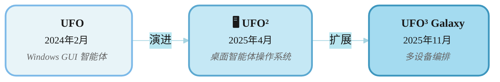
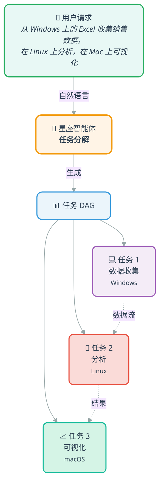
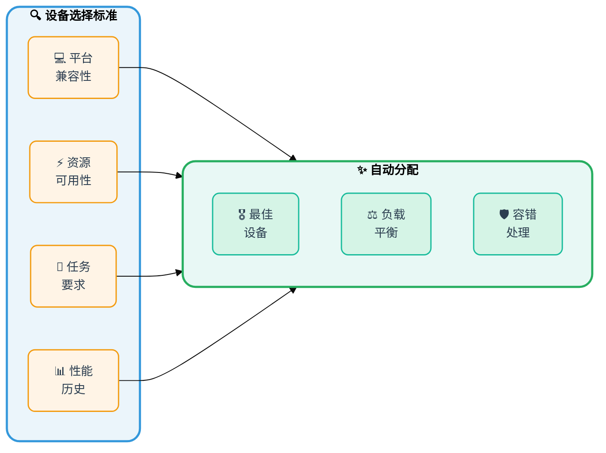
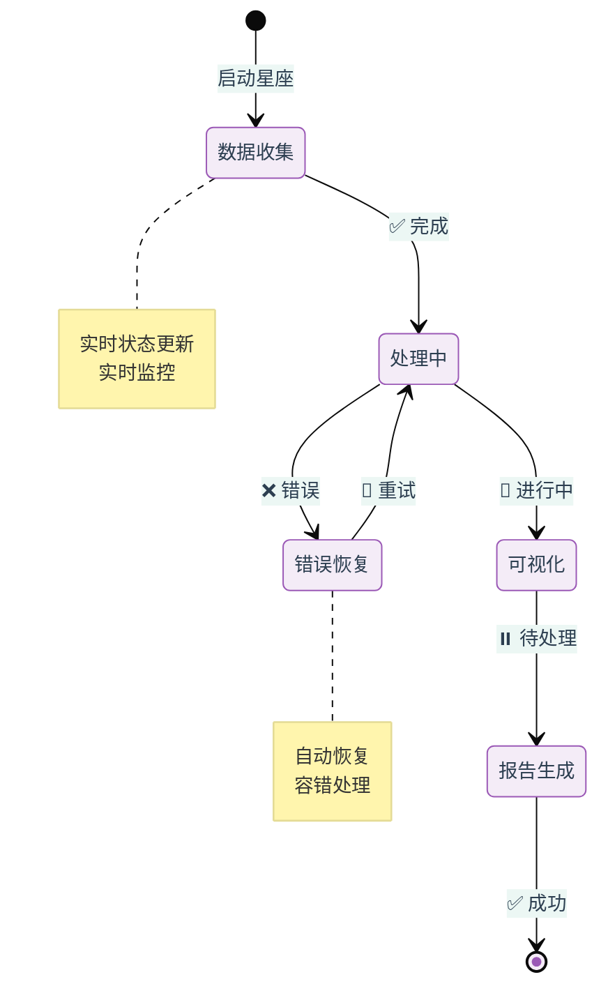

<!-- markdownlint-disable MD033 MD041 -->

<h1 align="center">
  <b>UFO³</b>  : 编织数字智能体星系
</h1>
<p align="center">
  <em>从单设备智能体到多设备星系</em>
</p>

<p align="center">
  <strong>📖 Language / 语言:</strong>
  <a href="README.md">English</a> | 
  <strong>中文</strong>
</p>

<p align="center">
  <strong>📚 快速链接：</strong>
  <a href="#-选择您的路径">🌌 UFO³ 概述</a> •
  <a href="./ufo/README_ZH.md">🖥️ UFO² 中文文档</a> •
  <a href="https://microsoft.github.io/UFO/">📖 完整文档</a>
</p>

<div align="center">

[](https://arxiv.org/abs/2504.14603)&ensp;
&ensp;
[](https://opensource.org/licenses/MIT)&ensp;
[](https://microsoft.github.io/UFO/)&ensp;
[](https://www.youtube.com/watch?v=QT_OhygMVXU)&ensp;

</div>

---

## 🎯 选择您的路径

<table align="center">
<tr>
<td width="50%" valign="top">

###  **UFO³ 多设备智能体星系**
<sub>**✨ 新功能 & 推荐**</sub>

**适用于：**
- 🔗 跨设备协作工作流
- 📊 复杂的多步骤自动化  
- 🎯 基于 DAG 的任务编排
- 🌍 异构平台集成

**关键功能：**
- **星座（Constellation）**：任务分解为可执行 DAG
- **动态设备分配**，通过能力匹配
- **实时工作流监控**和适应
- **事件驱动协调**跨设备
- **容错性**，自动恢复

**📖 [Galaxy 中文文档 →](./galaxy/README_ZH.md)**  
**📖 [Galaxy 快速入门 →](https://microsoft.github.io/UFO/getting_started/quick_start_galaxy/)** ⭐ **在线文档**

</td>
<td width="50%" valign="top">

###  **UFO² 桌面智能体操作系统**
<sub>**稳定 & 经过实战检验**</sub>

**适用于：**
- 💻 单个 Windows 自动化
- ⚡ 快速任务执行
- 🎓 学习智能体基础知识
- 🛠️ 简单工作流

**关键功能：**
- 深度 Windows 操作系统集成
- 混合 GUI + API 操作
- 经过验证的可靠性
- 易于设置
- 可作为 Galaxy 设备智能体

**📖 [UFO² 中文文档 →](./ufo/README_ZH.md)**

</td>
</tr>
</table>

<div align="center">

### 🤔 不确定选择哪个？

| 问题 | Galaxy | UFO² |
|----------|:------:|:----:|
| 需要跨设备协作？ | ✅ | ❌ |
| 复杂的多步骤工作流？ | ✅ | ⚠️ 有限 |
| 仅 Windows 自动化？ | ✅ | ✅ 优化 |
| 快速设置和学习？ | ⚠️ 中等 | ✅ 简单 |
| 生产就绪的稳定性？ | 🚧 积极开发 | ✅ LTS |

</div>

---

## 🎬 观看 UFO³ Galaxy 实际操作

观看 UFO³ Galaxy 如何跨多个设备编排复杂工作流：

<div align="center">
  <a href="https://www.youtube.com/watch?v=NGrVWGcJL8o">
    
  </a>
  <p><em>🎥 点击观看：使用 UFO³ Galaxy 进行跨设备任务编排</em></p>
</div>

---

## 🌟 UFO³ 有什么新功能？

### 演化时间线



### 🚀 UFO³ = **Galaxy**（多设备编排）+ **UFO²**（设备智能体）

UFO³ 引入了 **Galaxy**，这是一个新颖的多设备编排框架，可在异构平台上协调智能智能体。建立在五个核心创新之上：

1. **🌟 声明式任务分解** - 自然语言请求分解为动态 DAG（TaskConstellation），具有结构化工作流逻辑和依赖关系
2. **🔄 结果驱动的图演化** - 基于中间结果、失败和观察，通过受控重写持续适应的活态星座
3. **🎯 异构编排** - 通过丰富的 AgentProfiles 进行基于能力的设备匹配，确保正确性和并发性的异步安全执行
4. **🔌 统一智能体交互协议（AIP）** - 基于 WebSocket 的协议，提供安全、容错的智能体注册、会话管理和协调
5. **🛠️ 模板驱动的智能体框架** - 用于快速构建支持 MCP 的设备智能体的轻量级工具包，具有模块化能力声明

| 方面 | UFO² | UFO³ Galaxy |
|--------|------|-------------|
| **架构** | 单个 Windows 智能体 | 多设备编排 |
| **任务模型** | 顺序 ReAct 循环 | 基于 DAG 的星座工作流 |
| **范围** | 单设备，多应用 | 多设备，跨平台 |
| **协调** | HostAgent + AppAgents | ConstellationAgent + TaskOrchestrator |
| **设备支持** | Windows 桌面 | Windows、Linux、macOS、Android、Web |
| **任务规划** | 应用程序级别 | 设备级别，带依赖关系 |
| **执行** | 顺序 | 并行 DAG 执行 |
| **设备智能体角色** | 独立 | 可作为 Galaxy 设备智能体 |
| **复杂性** | 简单到中等 | 简单到非常复杂 |
| **学习曲线** | 低 | 中等 |
| **状态** | ✅ LTS（长期支持） | ⚡ 积极开发 |

### 🎓 迁移路径

**对于 UFO² 用户：**
1. ✅ **继续使用 UFO²** – 完全支持，积极维护
2. 🔄 **渐进式采用** – Galaxy 可以使用 UFO² 作为 Windows 设备智能体
3. 📈 **扩展** – 当您需要多设备功能时迁移到 Galaxy
4. 📚 **学习资源** – [迁移指南](./documents/docs/getting_started/migration_ufo2_to_galaxy.md)

---

## ✨ 功能概览

### 🌌 Galaxy 框架 – 有什么不同？

#### 🌟 星座规划



**核心优势：**
- ✓ 跨设备依赖关系跟踪
- ✓ 并行执行优化
- ✓ 跨设备数据流管理

---

#### 🎯 动态设备分配



**智能匹配：**
- 🎯 基于能力的选择
- 📈 实时资源监控
- 🔄 动态重新分配

---

#### 📊 实时编排



**编排功能：**
- ✓ 所有任务的实时状态更新
- ✓ 自动错误检测和恢复
- ✓ 带有视觉反馈的进度跟踪

---

### 🪟 UFO² 桌面智能体操作系统 – 核心优势

UFO² 扮演双重角色：**独立 Windows 自动化**和 Windows 平台的 **Galaxy 设备智能体**。

<div align="center">

| 功能 | 描述 | 文档 |
|---------|-------------|---------------|
| **深度操作系统集成** | Windows UIA、Win32、WinCOM 原生控件 | [了解更多](https://microsoft.github.io/UFO) |
| **混合操作** | GUI 点击 + API 调用以获得最佳性能 | [了解更多](https://microsoft.github.io/UFO/automator/overview) |
| **推测性多操作** | 批量预测 → **减少 51% 的 LLM 调用** | [了解更多](https://microsoft.github.io/UFO/advanced_usage/multi_action) |
| **视觉 + UIA 检测** | 用于稳健性的混合控件检测 | [了解更多](https://microsoft.github.io/UFO/advanced_usage/control_detection/hybrid_detection) |
| **知识基底** | 带有文档、演示、执行轨迹的 RAG | [了解更多](https://microsoft.github.io/UFO/advanced_usage/reinforce_appagent/overview/) |
| **设备智能体角色** | 可作为 Galaxy 编排中的 Windows 执行器 | [了解更多](./galaxy/README_ZH.md) |

</div>

**作为 Galaxy 设备智能体：**
- 通过 Galaxy 编排层从 ConstellationAgent 接收任务
- 使用经过验证的 UFO² 功能执行 Windows 特定的操作
- 向 TaskOrchestrator 报告状态和结果
- 无缝参与跨设备工作流

---

## 🚀 快速入门指南

选择您的路径并遵循详细的设置指南：

<table align="center">
<tr>
<td width="50%" valign="top">

### 🌌 Galaxy 快速入门

**用于跨设备编排**

```powershell
# 1. 安装
pip install -r requirements.txt

# 2. 配置 ConstellationAgent
copy config\galaxy\agent.yaml.template config\galaxy\agent.yaml
# 编辑并添加您的 API 密钥

# 3. 启动设备智能体（带平台标志）
# Windows:
python -m ufo.server.app --port 5000
python -m ufo.client.client --ws --ws-server ws://localhost:5000/ws --client-id windows_device_1 --platform windows

# Linux:
python -m ufo.server.app --port 5001
python -m ufo.client.client --ws --ws-server ws://localhost:5001/ws --client-id linux_device_1 --platform linux

# 4. 启动 Galaxy
python -m galaxy --interactive
```

**📖 完整指南：**
- [Galaxy 中文文档](./galaxy/README_ZH.md) – 架构和概念
- [在线快速入门](https://microsoft.github.io/UFO/getting_started/quick_start_galaxy/) – 分步教程
- [配置](https://microsoft.github.io/UFO/configuration/system/galaxy_devices/) – 设备设置

</td>
<td width="50%" valign="top">

### 🪟 UFO² 快速入门

**用于 Windows 自动化**

```powershell
# 1. 安装
pip install -r requirements.txt

# 2. 配置
copy config\ufo\agents.yaml.template config\ufo\agents.yaml
# 编辑并添加您的 API 密钥

# 3. 运行
python -m ufo --task <task_name>
```

**📖 完整指南：**
- [UFO² 中文文档](./ufo/README_ZH.md) – 完整文档
- [配置指南](./ufo/README_ZH.md#️-步骤-2配置-llm) – LLM 设置
- [高级功能](https://microsoft.github.io/UFO/advanced_usage/overview/) – 多操作、RAG

</td>
</tr>
</table>

### 📋 常见配置

两个框架都需要 LLM API 配置。选择您的提供商：

<details>
<summary><strong>OpenAI 配置</strong></summary>

**对于 Galaxy (`config/galaxy/agent.yaml`)：**
```yaml
CONSTELLATION_AGENT:
  REASONING_MODEL: false
  API_TYPE: "openai"
  API_BASE: "https://api.openai.com/v1/chat/completions"
  API_KEY: "sk-your-key-here"
  API_MODEL: "gpt-4o"
```

**对于 UFO² (`config/ufo/agents.yaml`)：**
```yaml
VISUAL_MODE: True
API_TYPE: "openai"
API_BASE: "https://api.openai.com/v1/chat/completions"
API_KEY: "sk-your-key-here"
API_MODEL: "gpt-4o"
```

</details>

<details>
<summary><strong>Azure OpenAI 配置</strong></summary>

**对于 Galaxy (`config/galaxy/agent.yaml`)：**
```yaml
CONSTELLATION_AGENT:
  REASONING_MODEL: false
  API_TYPE: "aoai"
  API_BASE: "https://YOUR-RESOURCE.openai.azure.com"
  API_KEY: "your-azure-key"
  API_MODEL: "gpt-4o"
  API_DEPLOYMENT_ID: "your-deployment-id"
```

**对于 UFO² (`config/ufo/agents.yaml`)：**
```yaml
VISUAL_MODE: True
API_TYPE: "aoai"
API_BASE: "https://YOUR-RESOURCE.openai.azure.com"
API_KEY: "your-azure-key"
API_MODEL: "gpt-4o"
API_DEPLOYMENT_ID: "your-deployment-id"
```

</details>

> 💡 **更多 LLM 选项：** 有关 Qwen、Gemini、Claude 等的信息，请参阅[模型配置指南](https://microsoft.github.io/UFO/supported_models/overview/)。

---

## 📚 文档结构

<table>
<tr>
<td width="50%" valign="top">

### 🌌 Galaxy 文档

- **[Galaxy 框架概述](./galaxy/README_ZH.md)** ⭐ **从这里开始** – 架构和技术概念
- **[快速入门教程](https://microsoft.github.io/UFO/getting_started/quick_start_galaxy/)** – 几分钟内开始运行
- **[Galaxy 客户端](https://microsoft.github.io/UFO/galaxy/client/overview/)** – 设备协调和 API
- **[星座智能体](https://microsoft.github.io/UFO/galaxy/constellation_agent/overview/)** – 任务分解和规划
- **[任务编排器](https://microsoft.github.io/UFO/galaxy/constellation_orchestrator/overview/)** – 执行引擎
- **[任务星座](https://microsoft.github.io/UFO/galaxy/constellation/overview/)** – DAG 结构
- **[智能体注册](https://microsoft.github.io/UFO/galaxy/agent_registration/overview/)** – 设备注册表
- **[配置指南](https://microsoft.github.io/UFO/configuration/system/galaxy_devices/)** – 设置和设备池

**📖 技术文档：**
- [AIP 协议](https://microsoft.github.io/UFO/aip/overview/) – WebSocket 消息传递
- [会话管理](https://microsoft.github.io/UFO/galaxy/session/overview/) – 会话生命周期
- [可视化](https://microsoft.github.io/UFO/galaxy/visualization/overview/) – 实时监控
- [事件和观察者](https://microsoft.github.io/UFO/galaxy/core/overview/) – 事件系统

</td>
<td width="50%" valign="top">

### 🪟 UFO² 文档

- **[UFO² 概述](./ufo/README_ZH.md)** – 桌面智能体操作系统架构
- **[安装](./ufo/README_ZH.md#️-步骤-1安装)** – 设置和依赖
- **[配置](./ufo/README_ZH.md#️-步骤-2配置-llm)** – LLM 和 RAG 设置
- **[使用指南](./ufo/README_ZH.md#-步骤-4启动-ufo)** – 运行 UFO²
- **[高级功能](https://microsoft.github.io/UFO/advanced_usage/overview/)** – 多操作、RAG 等
- **[自动化器指南](https://microsoft.github.io/UFO/automator/overview)** – 混合 GUI + API
- **[基准测试](./ufo/README_ZH.md#-评估)** – WAA 和 OSWorld 结果

**📖 在线文档：**
- [完整文档](https://microsoft.github.io/UFO/)
- [模型支持](https://microsoft.github.io/UFO/supported_models/overview/)
- [RAG 配置](https://microsoft.github.io/UFO/advanced_usage/reinforce_appagent/overview/)

</td>
</tr>
</table>

---

## 📢 最新更新

### 2025-11 – UFO³ Galaxy 框架发布 🌌
**重大研究突破：** 多设备编排系统

- 🌟 **声明式 DAG 分解**：TaskConstellation 结构实现工作流逻辑和依赖关系
- � **动态图演化**：通过受控重写适应的活态星座
- 🎯 **异构编排**：基于能力的设备匹配实现安全的异步执行
- � **统一 AIP 协议**：基于 WebSocket 的安全智能体协调，具有容错能力
- �️ **支持 MCP 的智能体框架**：用于快速设备智能体开发的模板驱动工具包
- 📄 **研究论文**：[UFO³: Weaving the Digital Agent Galaxy](https://arxiv.org/abs/[TBD])

**核心特性：**
- 首个用于 GUI 智能体的多设备编排框架
- 结果驱动的自适应执行，而非僵化的工作流
- 模型上下文协议（MCP）集成用于工具增强
- 经过形式化验证的正确性和并发安全保证

### 2025-04 – UFO² v2.0.0
- 📅 UFO² 桌面智能体操作系统发布
- 🏗️ 具有 AgentOS 概念的增强架构
- 📄 [技术报告](https://arxiv.org/pdf/2504.14603)发布
- ✅ 进入长期支持（LTS）状态

### 2024-02 – 原始 UFO
- 🎈 第一个 UFO 版本 - Windows 的以 UI 为中心的智能体
- 📄 [原始论文](https://arxiv.org/abs/2402.07939)
- 🌍 广泛的媒体报道和采用

---

## 📚 引用

如果您在研究中使用 UFO³ Galaxy 或 UFO²，请引用相关论文：

### UFO³ Galaxy 框架（2025）
```bibtex
@article{zhang2025ufo3,
  title   = {{UFO³: Weaving the Digital Agent Galaxy}},
  author  = {Zhang, Chaoyun and [Authors TBD]},
  journal = {arXiv preprint arXiv:[TBD]},
  year    = {2025},
  note    = {Multi-device orchestration framework with Constellation-based planning}
}
```

### UFO² 桌面智能体操作系统（2025）
```bibtex
@article{zhang2025ufo2,
  title   = {{UFO2: The Desktop AgentOS}},
  author  = {Zhang, Chaoyun and Huang, He and Ni, Chiming and Mu, Jian and Qin, Si and He, Shilin and Wang, Lu and Yang, Fangkai and Zhao, Pu and Du, Chao and Li, Liqun and Kang, Yu and Jiang, Zhao and Zheng, Suzhen and Wang, Rujia and Qian, Jiaxu and Ma, Minghua and Lou, Jian-Guang and Lin, Qingwei and Rajmohan, Saravan and Zhang, Dongmei},
  journal = {arXiv preprint arXiv:2504.14603},
  year    = {2025}
}
```

### 原始 UFO（2024）
```bibtex
@article{zhang2024ufo,
  title   = {{UFO: A UI-Focused Agent for Windows OS Interaction}},
  author  = {Zhang, Chaoyun and Li, Liqun and He, Shilin and Zhang, Xu and Qiao, Bo and Qin, Si and Ma, Minghua and Kang, Yu and Lin, Qingwei and Rajmohan, Saravan and Zhang, Dongmei and Zhang, Qi},
  journal = {arXiv preprint arXiv:2402.07939},
  year    = {2024}
}
```

---

## 🌐 媒体和社区

**媒体报道：**
- [微软正式开源UFO²，Windows桌面迈入「AgentOS 时代」](https://www.jiqizhixin.com/articles/2025-05-06-13)
- [Microsoft's UFO: Smarter Windows Experience](https://the-decoder.com/microsofts-ufo-abducts-traditional-user-interfaces-for-a-smarter-windows-experience/)
- [下一代Windows系统曝光](https://baijiahao.baidu.com/s?id=1790938358152188625)
- **[更多报道 →](./ufo/README_ZH.md#-媒体报道)**

**社区：**
- 💬 [GitHub 讨论](https://github.com/microsoft/UFO/discussions)
- 🐛 [问题跟踪器](https://github.com/microsoft/UFO/issues)
- 📧 电子邮件：[ufo-agent@microsoft.com](mailto:ufo-agent@microsoft.com)
- 📺 [YouTube 频道](https://www.youtube.com/watch?v=QT_OhygMVXU)

---

## 🎨 相关项目和研究

**Microsoft Research：**
- **[TaskWeaver](https://github.com/microsoft/TaskWeaver)** – 用于数据分析和任务自动化的代码优先 LLM 智能体框架
- **[AutoGen](https://github.com/microsoft/autogen)** – 用于构建 LLM 应用程序的多智能体对话框架

**GUI 智能体研究：**
- **[基于 LLM 的 GUI 智能体综述](https://github.com/vyokky/LLM-Brained-GUI-Agents-Survey)** – GUI 自动化智能体的全面综述
- **[交互式综述网站](https://vyokky.github.io/LLM-Brained-GUI-Agents-Survey/)** – 探索最新的 GUI 智能体研究和发展

**多智能体系统：**
- **UFO³ Galaxy** 代表了多设备编排的新方法，引入了星座框架，用于跨平台协调异构智能体
- 基于多智能体协调研究，同时解决跨设备 GUI 自动化的独特挑战

**基准测试：**
- **[Windows Agent Arena (WAA)](https://github.com/nice-mee/WindowsAgentArena)** – Windows 自动化智能体的评估基准
- **[OSWorld](https://github.com/nice-mee/WindowsAgentArena/tree/2020-qqtcg/osworld)** – 跨应用程序任务评估套件

---

## 💡 常见问题

<details>
<summary><strong>🤔 我应该使用 Galaxy 还是 UFO²？</strong></summary>

**从 UFO² 开始**，如果：
- 您只需要 Windows 自动化
- 您想要快速设置和学习
- 您需要生产稳定性
- 任务相对简单

**选择 Galaxy**，如果：
- 您需要跨设备协调
- 任务复杂且多步骤
- 您想要高级编排
- 您对积极开发感到满意

**混合方法**，如果：
- 您想要两全其美
- 一些任务简单（UFO²），一些复杂（Galaxy）
- 您正在逐步迁移

</details>

<details>
<summary><strong>⚠️ UFO² 会被弃用吗？</strong></summary>

**不会！** UFO² 已进入**长期支持（LTS）**状态：
- ✅ 积极维护
- ✅ 错误修复和安全更新
- ✅ 性能改进
- ✅ 完整的社区支持
- ✅ 没有弃用计划

UFO² 是 Windows 自动化的稳定、经过验证的解决方案。

</details>

<details>
<summary><strong>🔄 如何从 UFO² 迁移到 Galaxy？</strong></summary>

迁移是**渐进的和可选的**：

1. **阶段 1：学习** – 了解 Galaxy 概念
2. **阶段 2：实验** – 尝试使用 Galaxy 进行非关键任务
3. **阶段 3：混合** – 同时使用两个框架
4. **阶段 4：迁移** – 逐步将复杂任务移至 Galaxy

**无强制迁移！** 只要满足您的需求，就继续使用 UFO²。

有关详细信息，请参阅[迁移指南](./documents/docs/getting_started/migration_ufo2_to_galaxy.md)。

</details>

<details>
<summary><strong>🎯 Galaxy 能做 UFO² 做的所有事情吗？</strong></summary>

**功能上：是的。** Galaxy 可以使用 UFO² 作为 Windows 设备智能体。

**实际上：这取决于。**
- 对于**简单的 Windows 任务**：UFO² 独立更简单、更精简
- 对于**复杂工作流**：Galaxy 编排 UFO² 与其他设备智能体
- 对于**生产**：UFO² 提供经过验证的稳定性

**建议：** 使用正确的工具来完成工作。UFO² 可以独立工作或作为 Galaxy 的 Windows 设备智能体。

</details>

<details>
<summary><strong>📊 Galaxy 有多成熟？</strong></summary>

**状态：积极开发** 🚧

**稳定：**
- ✅ 核心架构
- ✅ DAG 编排
- ✅ 基本多设备支持
- ✅ 事件系统

**开发中：**
- 🔨 高级设备类型
- 🔨 增强监控
- 🔨 性能优化
- 🔨 扩展文档

**建议：** 非常适合实验和非关键工作流。对于生产，请考虑 UFO² 或混合方法。

</details>

<details>
<summary><strong>🔧 我可以扩展或自定义吗？</strong></summary>

**两个框架都是高度可扩展的：**

**UFO²：**
- 自定义操作和自动化器
- 自定义知识源（RAG）
- 自定义控件检测器
- 自定义评估指标

**Galaxy：**
- 自定义智能体
- 自定义设备类型
- 自定义编排策略
- 自定义可视化组件

有关扩展指南，请参阅各自的文档。

</details>

<details>
<summary><strong>🤝 我如何贡献？</strong></summary>

我们欢迎对 UFO² 和 Galaxy 的贡献！

**贡献方式：**
- 🐛 报告错误和问题
- 💡 建议功能和改进
- 📝 改进文档
- 🧪 添加测试和示例
- 🔧 提交拉取请求

有关指南，请参阅 [CONTRIBUTING.md](./CONTRIBUTING.md)。

</details>


---

## ⚠️ 免责声明和许可证

**免责声明：** 使用本软件即表示您承认并同意 [DISCLAIMER.md](./DISCLAIMER.md) 中的条款。

**许可证：** 本项目根据 [MIT 许可证](LICENSE) 授权。

**商标：** Microsoft 商标的使用遵循 [Microsoft 商标指南](https://www.microsoft.com/en-us/legal/intellectualproperty/trademarks/usage/general)。

---

<div align="center">

## 🚀 准备开始了吗？

<table>
<tr>
<td align="center" width="50%">

### 🌌 探索 Galaxy
**多设备编排**

[](./galaxy/README_ZH.md)

</td>
<td align="center" width="50%">

### 🪟 试试 UFO²
**Windows 桌面智能体**

[](./ufo/README_ZH.md)

</td>
</tr>
</table>

---

<sub>© Microsoft 2025 | UFO³ 是一个开源研究项目</sub>

<sub>⭐ 在 GitHub 上给我们加星 | 🤝 贡献 | 📖 阅读文档 | 💬 加入讨论</sub>

</div>

---

<p align="center">
  
  <br>
  <em>从单智能体到数字星系</em>
  <br>
  <strong>UFO³ - 编织智能自动化的未来</strong>
</p>
