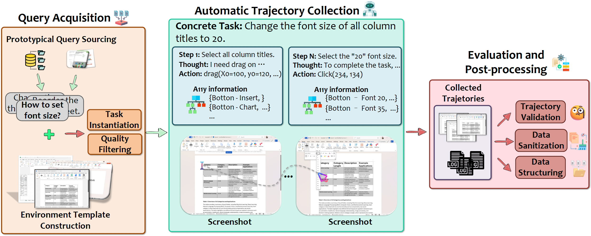

# Dataflow - Task Instantiation Pipeline

Dataflow is a task instantiation pipeline that prepares GUI automation tasks through template selection, prefilling, and filtering. The instantiated tasks can then be executed using UFO. It supports both single-file and batch processing modes.

<h1 align="center">
     
</h1>

## Overview

**Instantiation** prepares tasks for execution through three key phases:

1. **Template Selection**: Choose the most appropriate template file based on the app and task description
2. **Prefilling**: Generate detailed action steps based on the template environment
3. **Filtering**: Evaluate and validate the generated tasks to ensure quality

After instantiation, the tasks are saved in a format compatible with UFO for automated execution.

---

## Quick Start

We provide two sample tasks in `dataflow/tasks/prefill` to help you get started quickly.

### 1. Install Dependencies

Install required packages from the UFO root folder:

```bash
pip install -r requirements.txt
```

### 2. Configure LLMs

Create your configuration file:

```bash
cp dataflow/config/config.yaml.template dataflow/config/config.yaml
```

Edit `dataflow/config/config.yaml` and configure **PREFILL_AGENT** and **FILTER_AGENT** with your LLM credentials (see [Configuration Guide](#configuration-guide) below).

### 3. Run Instantiation

Execute the sample tasks:

```bash
python -m dataflow --instantiation --task_path ./dataflow/tasks/prefill
```

The instantiated results will be saved in `./dataflow/outputs/`.

### 4. Execute with UFO (Optional)

After instantiation completes, execute the instantiated tasks with UFO:

```bash
python -m ufo -m batch_normal -p ./dataflow/datasUFO/tasks
```

UFO execution logs will be generated under `./logs/`.

---

## Workflow

### Instantiation Process

The instantiation workflow consists of three phases:

<h1 align="center">
     
</h1>

#### Phase 1: Choose Template

Select the most appropriate template file based on the app and task description. The system uses either:
- **LLM-based selection**: Analyzes template screenshots and descriptions
- **Semantic similarity**: Matches task description with template descriptions

#### Phase 2: Prefill Task

1. Open the selected template file
2. Capture a screenshot of the current environment
3. Use the **PrefillAgent** to generate detailed, context-aware action steps
4. Output a refined task with specific actions

#### Phase 3: Filter Task

Evaluate the generated task using the **FilterAgent** to:
- Verify action feasibility
- Check for logical consistency
- Ensure quality standards
- Provide feedback and validation

---

## Configuration Guide

### LLM Configuration

Configure your LLM settings in `dataflow/config/config.yaml` for both **PREFILL_AGENT** and **FILTER_AGENT**.

#### Option 1: OpenAI

```yaml
VISUAL_MODE: True  # Whether to use vision-enabled models
API_TYPE: "openai"
API_BASE: "https://api.openai.com/v1/chat/completions"
API_KEY: "sk-your-key-here"
API_VERSION: "2024-02-15-preview"
API_MODEL: "gpt-4-vision-preview"
```

#### Option 2: Azure OpenAI (AOAI)

```yaml
VISUAL_MODE: True
API_TYPE: "aoai"
API_BASE: "https://{your-resource-name}.openai.azure.com"
API_KEY: "your-aoai-key"
API_VERSION: "2024-02-15-preview"
API_MODEL: "gpt-4-vision-preview"
API_DEPLOYMENT_ID: "your-deployment-id"
```

#### Non-Visual Models

To use non-visual models (e.g., GPT-4):

- Set `VISUAL_MODE: False`
- Specify appropriate `API_MODEL` (OpenAI) or `API_DEPLOYMENT_ID` (AOAI)

### Additional Configuration

The `config_dev.yaml` file contains:

- **File paths**: Locations for tasks, templates, and outputs
- **Match strategy**: Options include `'contains'`, `'fuzzy'`, and `'regex'` for window/control matching
- **TEMPLATE_METHOD**: Choose `LLM` or `SemanticSimilarity` for template selection
  - If using `LLM`: Manually generate screenshots in `templates/{app}/images/` directory (PNG format, matching template names)

#### ⚠️ Security Warning

**Do not expose your `config.yaml` file** in public repositories as it contains private API keys!

---

## Detailed Usage

### Task File Format

Tasks should be organized as JSON files. Default location: `dataflow/tasks/` (configurable in `config_dev.yaml`).

**Example task file** (`dataflow/tasks/prefill/example.json`):

```json
{
    "app": "word",
    "unique_id": "1",
    "task": "Type 'hello' and set the font type to Arial",
    "refined_steps": [
        "Type 'hello'",
        "Set the font to Arial"
    ]
}
```

**Fields:**
- `app`: Target application (e.g., "word", "excel", "powerpoint")
- `unique_id`: Unique identifier for the task
- `task`: Overall task description
- `refined_steps`: Initial step-by-step breakdown

### Template Files

Download template files from [GUI-360 Dataset](https://huggingface.co/datasets/vyokky/GUI-360/tree/main).

**Directory Structure:**

```
dataflow/
├── templates/
│   └── word/
│       ├── description.json
│       ├── template1.docx
│       ├── template2.docx
│       └── ...
└── tasks/
    └── prefill/
        ├── task1.json
        ├── task2.json
        └── ...
```

**Example `description.json`:**

```json
{
    "template1.docx": "A document with a rectangle shape",
    "template2.docx": "A document with a line of text",
    "template3.docx": "A document with a bulleted list"
}
```

If `description.json` is missing, a template will be selected randomly.

### Running Commands

Choose between single-file or batch processing by specifying a file path or folder path.

#### Single Task

```bash
python -m dataflow --instantiation --task_path ./dataflow/tasks/prefill/task1.json
```

#### Batch Processing

```bash
python -m dataflow --instantiation --task_path ./dataflow/tasks/prefill
```

The system will automatically detect whether the path points to a file or folder and process accordingly.

---

## Output Structure

After running instantiation, the output directory structure will be:

```
./dataflow/outputs/
├── datasUFO/
│   ├── files/           # Template files for UFO execution
│   └── tasks/           # Instantiated tasks in UFO format
├── logs/
│   └── <task_name>_<uuid>/
│       ├── template/    # Template selection logs
│       ├── prefill/     # Prefill agent logs
│       └── filter/      # Filter agent logs
└── results/
    ├── instantiation/
    │   ├── instantiation_pass/  # Successfully instantiated tasks
    │   └── instantiation_fail/  # Failed instantiation tasks
    └── saved_document/          # Saved template documents
```

**Directory Descriptions:**

- **datasUFO/**: Contains instantiated task files and templates ready for UFO execution
- **logs/**: Detailed logs for each processing phase (template selection, prefill, filter)
- **results/instantiation/**: Tasks categorized by instantiation success/failure
- **results/saved_document/**: Template files used during instantiation

---

## Complete Workflow Example

Here's a complete example from instantiation to execution using the provided sample tasks:

### Step 1: Run Instantiation

```bash
python -m dataflow --instantiation --task_path ./dataflow/tasks/prefill
```

**Output structure:**

```
./dataflow/outputs/
├── datasUFO/
│   ├── files/
│   └── tasks/           # ← Instantiated tasks ready for UFO
├── logs/
│   ├── bulleted/
│   │   ├── prefill/
│   │   └── template/
│   └── watermark/
│       ├── filter/
│       ├── prefill/
│       └── template/
└── results/
    ├── instantiation/
    │   ├── instantiation_fail/
    │   └── instantiation_pass/
    └── saved_document/
```

### Step 2: Execute with UFO

Execute the instantiated tasks using UFO:

```bash
python -m ufo -m batch_normal -p ./dataflow/datasUFO/tasks
```

UFO will:
- Read the instantiated tasks from `datasUFO/tasks/`
- Execute each task automatically in the specified application
- Generate execution logs in `./logs/`

### Step 3: Check Results

- **Instantiation results**: Located in `outputs/results/instantiation/instantiation_pass/`
- **Instantiation failures**: Located in `outputs/results/instantiation/instantiation_fail/`
- **Instantiation logs**: Check `outputs/logs/<task_name>_<uuid>/` for detailed processing logs
- **UFO execution logs**: Check `./logs/` for UFO execution logs

---

## Important Notes

1. **File Safety**: Save your original files before running tasks. Template files may be closed when the app shuts down.
2. **App Window**: Do not close the application window while the program is taking screenshots during instantiation.
3. **Template Availability**: Ensure templates are not in use by other processes when running instantiation.
4. **API Keys**: Keep your `config.yaml` file secure and never commit it to public repositories.
5. **Template Screenshots**: If using LLM-based template selection, ensure screenshots are available in `templates/{app}/images/`.
6. **UFO Execution**: Instantiated tasks in `datasUFO/tasks/` are automatically formatted for UFO batch execution.

---

## Advanced Topics

### Template Selection Methods

You can configure the template selection method in `config_dev.yaml`:

```yaml
TEMPLATE_METHOD: "LLM"  # or "SemanticSimilarity"
```

- **LLM**: Uses vision models to analyze template screenshots and select the best match
  - Requires screenshots in `templates/{app}/images/`
  - More accurate but requires additional setup
  
- **SemanticSimilarity**: Uses text-based semantic matching between task and template descriptions
  - Faster and simpler
  - Only requires `description.json`

### Custom Applications

To add support for new applications:

1. Create a folder: `dataflow/templates/{your_app}/`
2. Add template files to the folder
3. Create a `description.json` with template descriptions
4. (Optional) Add screenshots to `templates/{your_app}/images/` for LLM-based selection

### Integration with UFO

The instantiation pipeline automatically generates UFO-compatible task files in `datasUFO/tasks/`. These files include:

- Detailed action steps from the prefill phase
- Reference template files copied to `datasUFO/files/`
- Properly formatted task structure for UFO batch execution

You can customize the UFO execution by modifying UFO's configuration file or using different execution modes. Refer to the [main UFO documentation](../README.md) for more details.

---

For more information about UFO and its capabilities, please refer to the [main UFO documentation](../README.md).
