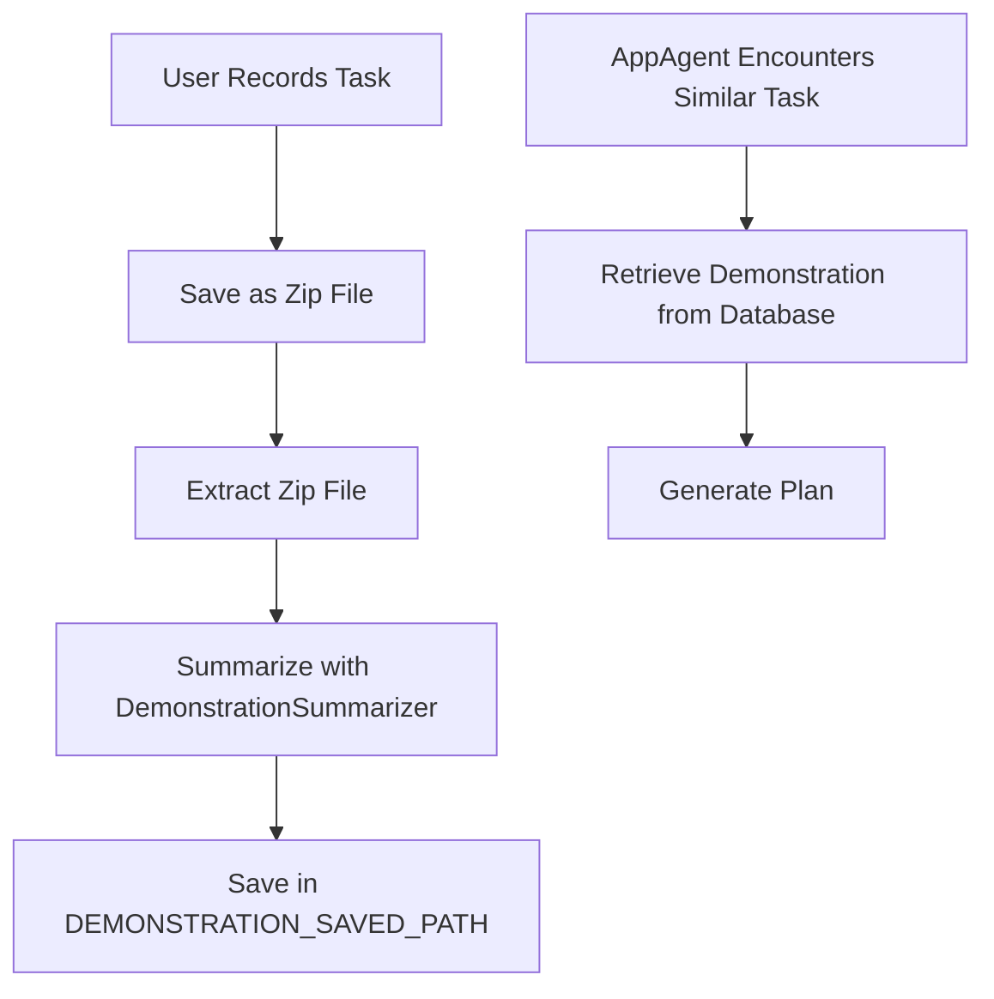

Here is the polished document for your Python code project:

# Learning from User Demonstration

For complex tasks, users can demonstrate the task using [Step Recorder](https://support.microsoft.com/en-us/windows/record-steps-to-reproduce-a-problem-46582a9b-620f-2e36-00c9-04e25d784e47) to record the action trajectories. UFO can learn from these user demonstrations to improve the AppAgent's performance.

## Mechanism

### Step 1: Record the Task
- **Tool**: [Step Recorder](https://support.microsoft.com/en-us/windows/record-steps-to-reproduce-a-problem-46582a9b-620f-2e36-00c9-04e25d784e47)
- **Output**: Zip file containing the task description and action trajectories

### Step 2: Save the Demonstration
- **Action**: Save the recorded demonstration as a zip file

### Step 3: Extract and Summarize the Demonstration
- **Tool**: `DemonstrationSummarizer`
- **Process**:
  1. Extract the zip file
  2. Summarize the demonstration
- **Configuration**: Save the summarized demonstration in the `DEMONSTRATION_SAVED_PATH` as specified in the `config_dev.yaml` file

### Step 4: Retrieve and Utilize the Demonstration
- **When**: AppAgent encounters a similar task
- **Action**: Retrieve the saved demonstration from the demonstration database
- **Tool**: `DemonstrationRetriever`
- **Outcome**: Generate a plan based on the retrieved demonstration

### Demonstration Workflow Diagram

You can find a demo video of learning from user demonstrations:

<iframe width="560" height="315" src="https://github.com/yunhao0204/UFO/assets/59384816/0146f83e-1b5e-4933-8985-fe3f24ec4777" frameborder="0" allowfullscreen></iframe>

 

 

## Activating Learning from User Demonstrations

### Step 1: User Demonstration
Please follow the steps in the [User Demonstration Provision](../../creating_app_agent/demonstration_provision.md) document to provide help documents to the AppAgent.

### Step 2: Configure the AppAgent
Configure the following parameters to allow UFO to use RAG from user demonstrations:

| Configuration Option | Description | Type | Default Value |
|----------------------|-------------|------|---------------|
| `RAG_DEMONSTRATION` | Whether to use RAG from user demonstrations | Boolean | False |
| `RAG_DEMONSTRATION_RETRIEVED_TOPK` | The top K documents to retrieve offline | Integer | 5 |
| `RAG_DEMONSTRATION_COMPLETION_N` | The number of completion choices for the demonstration result | Integer | 3 |

## Reference

### Demonstration Summarizer
The `DemonstrationSummarizer` class is located in the `record_processor/summarizer/summarizer.py` file. The `DemonstrationSummarizer` class provides methods to summarize the demonstration:

:::summarizer.summarizer.DemonstrationSummarizer

 

### Demonstration Retriever
The `DemonstrationRetriever` class is located in the `rag/retriever.py` file. The `DemonstrationRetriever` class provides methods to retrieve the demonstration:

:::rag.retriever.DemonstrationRetriever