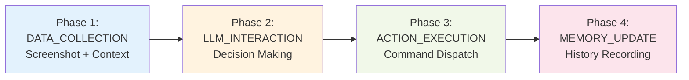
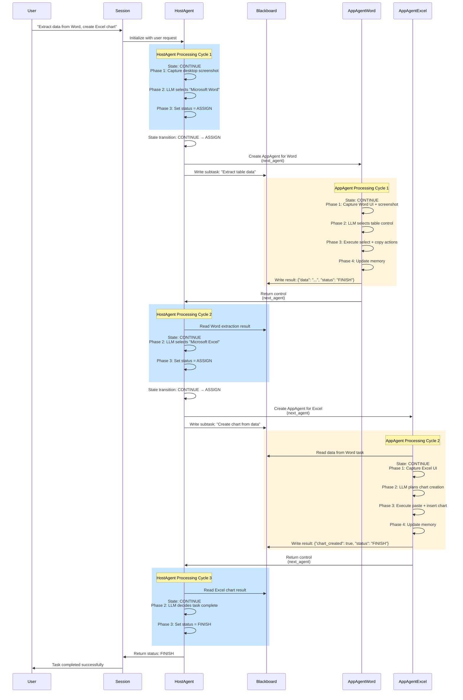
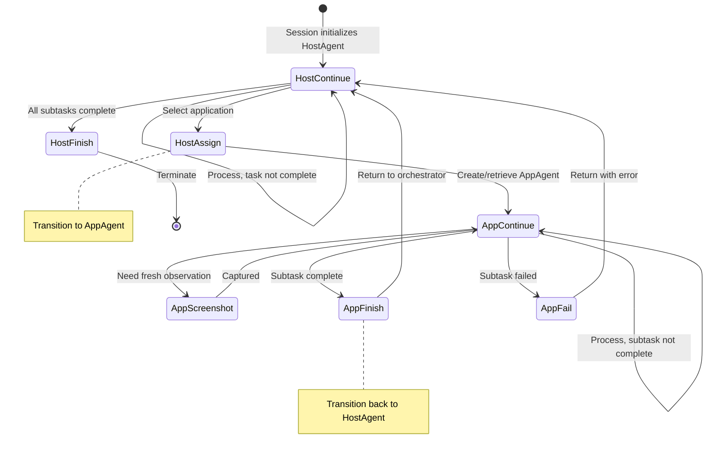

# Windows Agent Module Overview

!!!quote "Windows Desktop Automation Framework"
    The **Windows Agent Module** provides intelligent automation for Windows desktop applications through a hierarchical multi-agent system. Originally part of UFO², it now functions as a standalone device agent module that orchestrates complex multi-application workflows using UI Automation, state machines, and LLM-powered decision making.

---

## Module Architecture

The Windows Agent Module implements a **two-tier hierarchical agent architecture** optimized for Windows desktop automation:

```mermaid
graph TB
    subgraph "User Layer"
        User[User Request<br/>"Extract Word data, create Excel chart"]
    end
    
    subgraph "Orchestration Layer - HostAgent"
        HA[HostAgent<br/>Task Decomposer & Orchestrator]
        HAFSM[State Machine<br/>7 States]
        HAProc[Processor<br/>4 Strategies]
        HACmd[Desktop Commands<br/>Screenshot, App List]
    end
    
    subgraph "Execution Layer - AppAgents"
        AA1[AppAgent: Word<br/>Document Interaction]
        AA2[AppAgent: Excel<br/>Spreadsheet Automation]
        AAFSM[State Machine<br/>6 States]
        AAProc[Processor<br/>4 Strategies]
        AACmd[UI Commands<br/>Click, Type, Select]
    end
    
    subgraph "Coordination Layer"
        BB[Blackboard<br/>Inter-Agent Communication]
        Mem[Memory<br/>Execution History]
    end
    
    User -->|Natural Language| HA
    HA -->|Decompose Task| HAFSM
    HAFSM -->|Execute| HAProc
    HAProc -->|Desktop Control| HACmd
    
    HA -->|Delegate Subtask 1| AA1
    HA -->|Delegate Subtask 2| AA2
    
    AA1 & AA2 -->|Manage Execution| AAFSM
    AAFSM -->|Process| AAProc
    AAProc -->|UI Automation| AACmd
    
    HA & AA1 & AA2 -->|Share Data| BB
    HA & AA1 & AA2 -->|Record Steps| Mem
    
    style HA fill:#e1f5ff
    style AA1 fill:#fff4e6
    style AA2 fill:#fff4e6
    style BB fill:#f3e5f5
    style Mem fill:#e8f5e9
```

###  Agent Hierarchy

| Agent Type | Role | Scope | Key Responsibilities |
|------------|------|-------|---------------------|
| **HostAgent** | Orchestrator | Desktop-wide | Task decomposition, application selection, AppAgent lifecycle management, cross-app coordination |
| **AppAgent** | Executor | Single application | UI element interaction, action execution, application-specific automation, result reporting |

!!!info "Design Philosophy"
    The hierarchical architecture follows the **Chain of Responsibility** and **Delegation** patterns:
    
    - **HostAgent** handles **WHAT** (which application) and **WHEN** (task sequencing)
    - **AppAgent** handles **HOW** (UI interaction) and **WHERE** (control targeting)
    - **Blackboard** facilitates **inter-agent communication** without tight coupling
    - **State Machines** ensure **deterministic execution flow** and error recovery

---

## Core Components

### 1. State Machines (Level-1: Control Flow)

Each agent uses a **Finite State Machine (FSM)** to manage execution lifecycle:

=== "HostAgent States (7)"

    | State | Purpose | Processor Executed | Next Possible States |
    |-------|---------|-------------------|---------------------|
    | **CONTINUE** | Normal orchestration | ✅ Yes | CONTINUE, ASSIGN, FINISH, ERROR |
    | **ASSIGN** | Delegate to AppAgent | ❌ No | AppAgent.CONTINUE |
    | **FINISH** | Task completed | ❌ No | (terminal) |
    | **FAIL** | Task failed | ❌ No | (terminal) |
    | **ERROR** | Critical error | ❌ No | (terminal) |
    | **PENDING** | Awaiting external input | ❌ No | CONTINUE, FAIL |
    | **CONFIRM** | User confirmation needed | ✅ Yes | CONTINUE, FAIL |

=== "AppAgent States (6)"

    | State | Purpose | Processor Executed | Next Possible States |
    |-------|---------|-------------------|---------------------|
    | **CONTINUE** | Normal execution | ✅ Yes | CONTINUE, SCREENSHOT, FINISH, ERROR |
    | **SCREENSHOT** | Capture observation | ✅ Yes | CONTINUE |
    | **FINISH** | Subtask completed | ❌ No | HostAgent.CONTINUE |
    | **FAIL** | Subtask failed | ❌ No | HostAgent.CONTINUE |
    | **ERROR** | Critical error | ❌ No | HostAgent.ERROR |
    | **PENDING** | Awaiting callback | ❌ No | CONTINUE |
    | **CONFIRM** | User confirmation | ✅ Yes | CONTINUE, FAIL |

!!!tip "State Transition Rules"
    **HostAgent → AppAgent**: When HostAgent enters **ASSIGN** state, it creates/retrieves an AppAgent and transitions to **AppAgent.CONTINUE** state via `next_agent()` method.
    
    **AppAgent → HostAgent**: When AppAgent enters **FINISH** or **FAIL** state, it returns control to HostAgent via `next_agent()` method, transitioning HostAgent to **CONTINUE** state.

### 2. Processing Strategies (Level-2: Execution Logic)

Both agents use a **4-phase processing pipeline** orchestrated by their Processor:



=== "HostAgent Strategies"

    | Phase | Strategy | Provides | Purpose |
    |-------|----------|----------|---------|
    | **DATA_COLLECTION** | `DesktopDataCollectionStrategy` | Desktop screenshot, application list, target registry | Gather desktop environment state |
    | **LLM_INTERACTION** | `HostLLMInteractionStrategy` | Selected application, action plan | Decide which app to use and what subtask to assign |
    | **ACTION_EXECUTION** | `HostActionExecutionStrategy` | Application launch result, AppAgent instance | Launch app, create/retrieve AppAgent, update blackboard |
    | **MEMORY_UPDATE** | `HostMemoryUpdateStrategy` | Memory item, blackboard update | Record orchestration step, update coordination data |

=== "AppAgent Strategies"

    | Phase | Strategy | Provides | Purpose |
    |-------|----------|----------|---------|
    | **DATA_COLLECTION** | `AppScreenshotCaptureStrategy` + `AppControlInfoStrategy` | App screenshot, UI tree, control annotations | Capture application UI state |
    | **LLM_INTERACTION** | `AppLLMInteractionStrategy` | Selected control, action sequence | Decide which UI element to interact with and how |
    | **ACTION_EXECUTION** | `AppActionExecutionStrategy` | Action execution result, control state | Execute UI automation commands (click, type, etc.) |
    | **MEMORY_UPDATE** | `AppMemoryUpdateStrategy` | Memory item, blackboard result | Record interaction step, save subtask results |

!!!example "Strategy Dependency Chain"
    Each strategy declares **dependencies** (what data it needs) and **provides** (what data it produces):
    
    ```python
    # DATA_COLLECTION provides screenshot
    @provides("screenshot_url", "ui_tree")
    class AppScreenshotCaptureStrategy: ...
    
    # LLM_INTERACTION depends on screenshot, provides actions
    @depends_on("screenshot_url", "ui_tree")
    @provides("selected_control", "action_sequence")
    class AppLLMInteractionStrategy: ...
    
    # ACTION_EXECUTION depends on actions, provides result
    @depends_on("selected_control", "action_sequence")
    @provides("execution_result")
    class AppActionExecutionStrategy: ...
    ```

### 3. Command System (Level-3: System Interface)

Commands are dispatched through the **MCP (Model Context Protocol)** system:

=== "HostAgent Commands"

    | Command Group | Examples | Purpose |
    |--------------|----------|---------|
    | **Desktop Capture** | `capture_desktop_screenshot` | Capture full desktop view |
    | **Window Management** | `get_desktop_app_info`, `get_app_window` | Enumerate running applications |
    | **Process Control** | `launch_application`, `close_application` | Manage application lifecycle |

=== "AppAgent Commands"

    | Command Group | Examples | Purpose |
    |--------------|----------|---------|
    | **Screenshot** | `capture_screenshot`, `annotate_screenshot` | Capture application window |
    | **UI Inspection** | `get_control_info`, `get_ui_tree` | Extract UI Automation tree |
    | **UI Interaction** | `click`, `set_edit_text`, `wheel_mouse_input` | Automate UI controls |
    | **Control Selection** | `select_control_by_index`, `select_control_by_name` | Target specific UI elements |

!!!info "Command Architecture"
    Commands follow the **Command Pattern**:
    
    1. **Strategy** constructs a `Command` object with parameters
    2. **CommandDispatcher** validates and routes the command to appropriate MCP server
    3. **MCP Server** executes the command using platform APIs (UI Automation, Win32)
    4. **Result** is returned to strategy for processing

---

## Agent Lifecycle

### Complete Workflow



### State Transition Details



---

## Inter-Agent Communication

### Blackboard Pattern

The **Blackboard** serves as a shared memory space for agent coordination:

```python
# HostAgent writes subtask for AppAgent
blackboard = agent.blackboard
blackboard["current_subtask"] = {
    "application": "Microsoft Word",
    "task": "Extract table data from document",
    "context": {"document_name": "report.docx"}
}

# AppAgent reads subtask
subtask = blackboard.get("current_subtask")

# AppAgent writes result
blackboard["subtask_result"] = {
    "status": "FINISH",
    "data": [...],  # Extracted table data
    "message": "Successfully extracted 50 rows"
}

# HostAgent reads result
result = blackboard.get("subtask_result")
```

!!!tip "Blackboard Design Principles"
    - **Decoupling**: Agents don't directly reference each other
    - **Persistence**: Data survives agent state transitions
    - **Shared Context**: All agents access same blackboard instance
    - **Key-Value Store**: Simple dictionary-based interface

### Memory vs Blackboard

| Aspect | Memory (per-agent) | Blackboard (shared) |
|--------|-------------------|---------------------|
| **Scope** | Single agent's execution history | All agents in session |
| **Purpose** | LLM context, step replay, debugging | Inter-agent data transfer |
| **Lifetime** | Agent lifecycle | Session lifecycle |
| **Content** | MemoryItem list (screenshots, actions, results) | Key-value pairs (subtasks, results, state) |
| **Access** | Read by same agent | Read/write by all agents |

---

## Configuration Integration

The Windows Agent Module integrates with the configuration system defined in [Configuration Guide](../../../config/README.md):

### HostAgent Configuration

```yaml
# config/ufo/host_agent_config.yaml
host_agent:
  visual_mode: true                  # Enable screenshot-based reasoning
  max_subtasks: 10                   # Maximum subtasks per session
  application_timeout: 30            # Seconds to wait for app launch
  llm_config:
    model: "gpt-4o"
    temperature: 0.0
    max_tokens: 2000
```

### AppAgent Configuration

```yaml
# config/ufo/app_agent_config.yaml
app_agent:
  visual_mode: true                  # Enable UI screenshot analysis
  control_backend: "uia"             # UI Automation (uia) or Win32 (win32)
  max_steps: 20                      # Maximum steps per subtask
  annotation_overlay: true           # Annotate controls in screenshots
  llm_config:
    model: "gpt-4o"
    temperature: 0.0
    max_tokens: 3000
```

!!!example "Configuration Usage"
    ```python
    from config.config_loader import get_ufo_config
    
    ufo_config = get_ufo_config()
    
    # Access HostAgent settings
    visual_mode = ufo_config.host_agent.visual_mode
    max_subtasks = ufo_config.host_agent.max_subtasks
    
    # Access AppAgent settings
    control_backend = ufo_config.app_agent.control_backend
    max_steps = ufo_config.app_agent.max_steps
    ```

---

## Platform Requirements

### Windows Version Support

| Windows Version | UI Automation | Win32 API | Support Status |
|----------------|---------------|-----------|----------------|
| Windows 11 | ✅ Full | ✅ Full | ✅ Fully Supported |
| Windows 10 (1909+) | ✅ Full | ✅ Full | ✅ Fully Supported |
| Windows Server 2019+ | ✅ Full | ✅ Full | ✅ Fully Supported |
| Windows 8.1 | ⚠️ Limited | ✅ Full | ⚠️ Partial Support |

### Application Compatibility

The module supports automation for:

- **Microsoft Office**: Word, Excel, PowerPoint, Outlook
- **Web Browsers**: Chrome, Edge, Firefox (via UI Automation)
- **Native Windows Apps**: File Explorer, Notepad, Paint, Calculator
- **Electron Apps**: VS Code, Slack, Discord
- **Custom Apps**: Any application with UI Automation support

!!!warning "Limitations"
    - **Admin-elevated apps**: Require agent to run with admin privileges
    - **Legacy apps**: Win32-only apps may require `control_backend: "win32"` setting
    - **Graphics-heavy apps**: May require visual mode disabled for performance
    - **Virtualized apps**: UWP sandboxed apps may have limited automation support

---

## Module Integration

### Session Integration

The Windows Agent Module integrates with the UFO² session system:

```python
from ufo.module.sessions.session import Session
from ufo.agents.agent.host_agent import HostAgent

# Create session
session = Session(
    task="Create a presentation from Excel data",
    mode="normal",
    plan=[]
)

# Session creates HostAgent
host_agent = session.create_host_agent()

# Execute through round manager
await session.run()
```

### Round Management

Each processing cycle is managed by a Round:

```python
from ufo.module.round import Round

# Round manages single agent execution cycle
round_manager = Round(
    agent=current_agent,
    context=session_context
)

# Execute agent state machine
result = await round_manager.run()
```

See [Module System Documentation](../../modules/overview.md) for details.

---

## Documentation Structure

Explore detailed documentation for each component:

!!!info "Agent Documentation"
    - **[HostAgent](host_agent.md)**: Desktop orchestrator agent
    - **[AppAgent](app_agent.md)**: Application automation agent

!!!info "State Machine Documentation"
    - **[States Overview](states/overview.md)**: FSM principles and design
    - **[HostAgent States](states/host_agent_states.md)**: 7 orchestration states
    - **[AppAgent States](states/app_agent_states.md)**: 6 execution states

!!!info "Strategy Documentation"
    - **[Strategies Overview](strategies/overview.md)**: Processing strategy pattern
    - **[HostAgent Strategies](strategies/host_agent_strategies.md)**: 4-phase orchestration
    - **[AppAgent Strategies](strategies/app_agent_strategies.md)**: 4-phase UI automation

!!!info "Command Documentation"
    - **[Commands Overview](commands/overview.md)**: MCP command system
    - **[Desktop Commands](commands/desktop_commands.md)**: Desktop-level operations
    - **[UI Commands](commands/ui_commands.md)**: UI Automation operations

!!!info "Architecture Documentation"
    - **[Device Agent Overview](../overview.md)**: Three-layer architecture
    - **[State Layer](../design/state.md)**: FSM design principles
    - **[Strategy Layer](../design/processor.md)**: Processor framework
    - **[Command Layer](../design/command.md)**: Command dispatch system

---

## Quick Start Example

Here's a complete example of using the Windows Agent Module:

```python
from ufo.module.sessions.session import Session
from config.config_loader import get_ufo_config

# Initialize configuration
config = get_ufo_config()

# Create session with user request
session = Session(
    task="Open Excel, create a chart from the data in Sheet1",
    mode="normal",
    plan=[]
)

# Run automation workflow
result = await session.run()

# Check result
if result.status == "FINISH":
    print("Task completed successfully!")
    print(f"Steps taken: {len(session.host_agent.memory.memory_items)}")
else:
    print(f"Task failed: {result.message}")
```

**What happens internally:**

1. **Session** creates **HostAgent** with user request
2. **HostAgent** enters **CONTINUE** state, executes processor:
   - Phase 1: Captures desktop screenshot
   - Phase 2: LLM selects "Microsoft Excel"
   - Phase 3: Launches Excel, sets status = **ASSIGN**
3. **HostAgent** transitions to **ASSIGN** state, creates **AppAgent** for Excel
4. **AppAgent** enters **CONTINUE** state, executes processor:
   - Phase 1: Captures Excel UI screenshot + tree
   - Phase 2: LLM identifies chart insertion control
   - Phase 3: Executes click + insert chart commands
   - Phase 4: Updates memory, sets status = **FINISH**
5. **AppAgent** returns to **HostAgent** via **FINISH** state
6. **HostAgent** verifies task completion, sets status = **FINISH**
7. **Session** returns result to user

---

## Next Steps

1. **Understand Agent Types**: Read [HostAgent](host_agent.md) and [AppAgent](app_agent.md) documentation
2. **Learn State Machines**: Study [States Overview](states/overview.md) for FSM principles
3. **Explore Strategies**: Review [Strategies Overview](strategies/overview.md) for processing logic
4. **Command System**: Check [Commands Overview](commands/overview.md) for MCP integration
5. **Configuration**: See [Configuration Guide](../../../config/README.md) for customization

!!!success "Ready to Dive Deeper?"
    Choose your learning path:
    
    - **New to UFO²?** Start with [Device Agent Overview](../overview.md)
    - **Want to extend agents?** Read [Processor](../design/processor.md) and [Strategy](../design/strategy.md) docs
    - **Building custom automation?** Check [Command Layer](../design/command.md) and [MCP Integration](../../mcp/overview.md)
