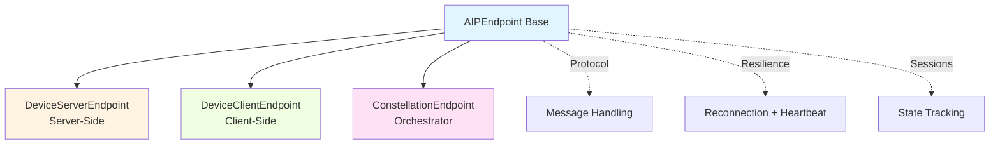
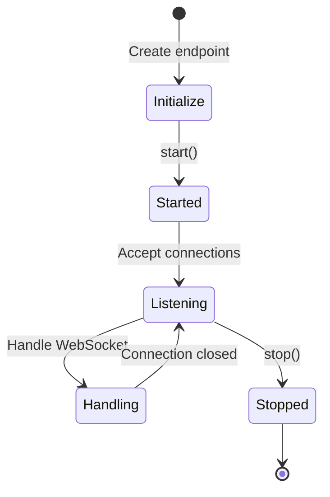
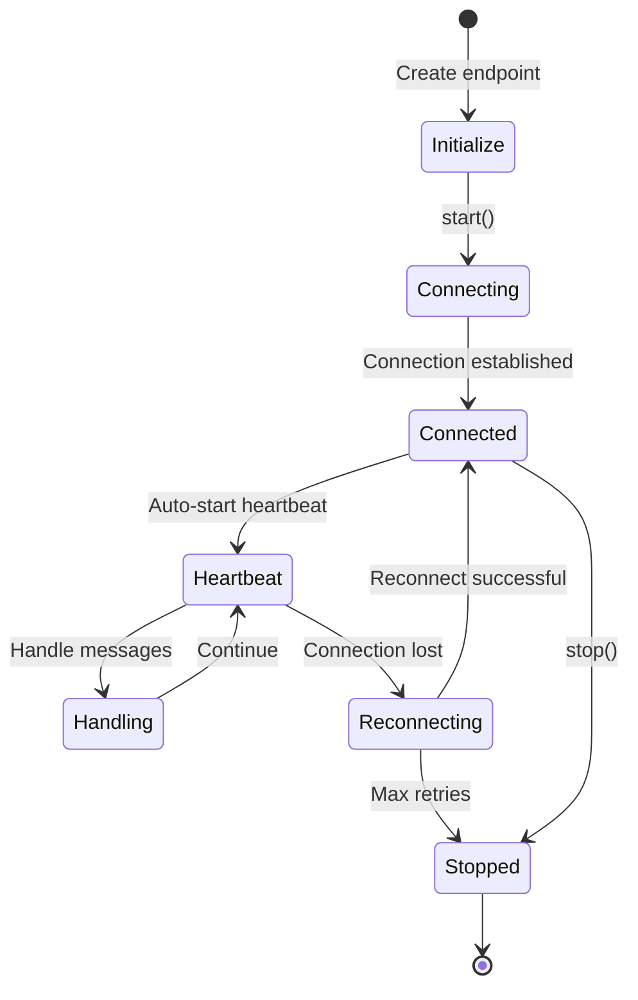

# AIP Endpoints

Endpoints combine protocol, transport, and resilience components to provide production-ready AIP communication for servers, clients, and orchestrators.

## Endpoint Types at a Glance

| Endpoint Type | Role | Used By | Key Features |
|---------------|------|---------|--------------|
| **DeviceServerEndpoint** | Server | Device Agent Service | ✅ Multiplexed connections<br>✅ Session management<br>✅ Task dispatching<br>✅ Result aggregation |
| **DeviceClientEndpoint** | Client | Device Agent Client | ✅ Auto-reconnection<br>✅ Heartbeat management<br>✅ Command execution<br>✅ Telemetry reporting |
| **ConstellationEndpoint** | Orchestrator | ConstellationClient | ✅ Multi-device coordination<br>✅ Task distribution<br>✅ Device info querying<br>✅ Connection pooling |

---

## Endpoint Architecture

**Endpoint Inheritance Hierarchy:**

AIP provides three specialized endpoint implementations that all inherit common functionality from a shared base class:



The dashed arrows indicate capabilities that the base class provides to all subclasses. This inheritance design ensures consistent behavior across all endpoint types while allowing specialization for server, client, and orchestrator roles.

**Base Endpoint Components:**

All endpoints inherit from `AIPEndpoint`, which provides:

- **Protocol**: Message serialization and handling
- **Reconnection Strategy**: Automatic reconnection with backoff
- **Timeout Manager**: Operation timeout management
- **Session Handlers**: Per-session state tracking

## Base Endpoint: AIPEndpoint

### Common Methods

| Method | Purpose | Example Usage |
|--------|---------|---------------|
| `start()` | Start endpoint | `await endpoint.start()` |
| `stop()` | Stop endpoint | `await endpoint.stop()` |
| `is_connected()` | Check connection | `if endpoint.is_connected(): ...` |
| `send_with_timeout()` | Send with timeout | `await endpoint.send_with_timeout(msg, 30.0)` |
| `receive_with_timeout()` | Receive with timeout | `msg = await endpoint.receive_with_timeout(ServerMessage, 60.0)` |

**Basic Usage Pattern:**

```python
from aip.endpoints.base import AIPEndpoint

# Start endpoint
await endpoint.start()

# Check connection
if endpoint.is_connected():
    await endpoint.handle_message(msg)

# Send with timeout
await endpoint.send_with_timeout(msg, timeout=30.0)

# Clean shutdown
await endpoint.stop()
```

---

## DeviceServerEndpoint

Wraps UFO's server-side WebSocket handler with AIP protocol support for managing multiple device connections simultaneously.

### Configuration

```python
from aip.endpoints import DeviceServerEndpoint

endpoint = DeviceServerEndpoint(
    ws_manager=ws_manager,              # WebSocket connection manager
    session_manager=session_manager,    # Session state manager
    local=False                         # Local vs remote deployment
)
```

### Integration with FastAPI

```python
from fastapi import FastAPI, WebSocket
from aip.endpoints import DeviceServerEndpoint

app = FastAPI()
endpoint = DeviceServerEndpoint(ws_manager, session_manager)

@app.websocket("/ws")
async def websocket_route(websocket: WebSocket):
    await endpoint.handle_websocket(websocket)
```

### Key Features

| Feature | Description | Benefit |
|---------|-------------|---------|
| **Multiplexed Connections** | Handle multiple clients simultaneously | Scale to many devices |
| **Session Management** | Track active sessions per device | Maintain conversation context |
| **Task Dispatching** | Route tasks to appropriate clients | Targeted execution |
| **Result Aggregation** | Collect and format execution results | Unified response handling |
| **Auto Task Cancellation** | Cancel tasks on disconnect | Prevent orphaned tasks |

**Backward Compatibility:**

The Device Server Endpoint maintains full compatibility with UFO's existing WebSocket handler.

### Task Cancellation on Disconnection

```python
# Automatically called when device disconnects
await endpoint.cancel_device_tasks(
    device_id="device_001",
    reason="device_disconnected"
)
```

---

## DeviceClientEndpoint

Wraps UFO's client-side WebSocket client with AIP protocol support, automatic reconnection, and heartbeat management.

### Configuration

```python
from aip.endpoints import DeviceClientEndpoint

endpoint = DeviceClientEndpoint(
    ws_url="ws://localhost:8000/ws",
    ufo_client=ufo_client,
    max_retries=3,
    timeout=120.0
)
```

### Automatic Features

| Feature | Default Behavior | Configuration |
|---------|------------------|---------------|
| **Heartbeat** | Starts on connection | 20s interval (fixed) |
| **Reconnection** | Exponential backoff | `max_retries=3`, `initial_backoff=2.0` |
| **Message Routing** | Auto-routes to UFO client | Handled internally |
| **Connection Management** | Auto-connect on start | Transparent to user |

**Lifecycle Management Example:**

```python
# Start and connect
await endpoint.start()

# Handle messages automatically
# (routed to underlying UFO client)

# Stop heartbeat and close
await endpoint.stop()
```

### Reconnection Strategy

```python
from aip.resilience import ReconnectionStrategy

reconnection_strategy = ReconnectionStrategy(
    max_retries=3,
    initial_backoff=2.0,
    max_backoff=60.0
)

endpoint = DeviceClientEndpoint(
    ws_url=url,
    ufo_client=client,
    reconnection_strategy=reconnection_strategy
)
```

---

## ConstellationEndpoint

Enables the ConstellationClient to communicate with multiple devices simultaneously, managing connections, tasks, and queries.

### Configuration

```python
from aip.endpoints import ConstellationEndpoint

endpoint = ConstellationEndpoint(
    task_name="multi_device_task",
    message_processor=processor  # Optional custom processor
)
```

### Multi-Device Operations

| Operation | Method | Description |
|-----------|--------|-------------|
| **Connect** | `connect_to_device()` | Establish connection to device |
| **Send Task** | `send_task_to_device()` | Dispatch task to specific device |
| **Query Info** | `request_device_info()` | Get device telemetry |
| **Check Status** | `is_device_connected()` | Verify connection health |
| **Disconnect** | `disconnect_device()` | Close device connection |
| **Disconnect All** | `stop()` | Shutdown all connections |

### Connecting to Devices

```python
# Connect using AgentProfile
connection = await endpoint.connect_to_device(
    device_info=agent_profile,  # AgentProfile object
    message_processor=processor
)
```

Learn more about [AgentProfile configuration](../galaxy/client/device_manager.md) in the Galaxy documentation.

### Sending Tasks

```python
# Dispatch task to specific device
result = await endpoint.send_task_to_device(
    device_id="device_001",
    task_request={
        "request": "Open Notepad",
        "task_name": "open_notepad",
        "session_id": "session_123"
    }
)
```

### Querying Device Info

```python
# Request telemetry update
device_info = await endpoint.request_device_info("device_001")

if device_info:
    print(f"OS: {device_info['os']}")
    print(f"CPU: {device_info['cpu']}")
    print(f"GPU: {device_info.get('gpu', 'N/A')}")
```

### Connection Management

**Managing Multiple Devices:**

```python
# Check connection before sending
if endpoint.is_device_connected("device_001"):
    await endpoint.send_task_to_device(...)

# Disconnect specific device
await endpoint.disconnect_device("device_001")

# Disconnect all devices
await endpoint.stop()
```

### Disconnection Handling

```python
# Automatically triggered on device disconnect
await endpoint.on_device_disconnected("device_001")

# Cancels pending tasks
await endpoint.cancel_device_tasks(
    device_id="device_001",
    reason="device_disconnected"
)

# Attempts reconnection (if enabled)
success = await endpoint.reconnect_device("device_001")
```

---

## Endpoint Lifecycle Patterns

### Server Lifecycle

**Server Endpoint State Transitions:**

This state diagram shows the lifecycle of a server endpoint from initialization through connection handling to shutdown:



The `Listening → Handling` loop represents the server accepting multiple client connections. Each connection is handled independently while the server remains in the listening state.

**Server Lifecycle Code:**

```python
# 1. Initialize
endpoint = DeviceServerEndpoint(client_manager, session_manager)

# 2. Start
await endpoint.start()

# 3. Handle connections
@app.websocket("/ws")
async def handle_ws(websocket: WebSocket):
    await endpoint.handle_websocket(websocket)

# 4. Stop (on shutdown)
await endpoint.stop()
```

### Client Lifecycle

**Client Endpoint State Transitions with Auto-Reconnection:**

This diagram shows the client lifecycle including automatic reconnection attempts when the connection is lost:



The `Heartbeat → Handling` loop represents normal operation with periodic heartbeats. The `Reconnecting → Connected` transition shows automatic recovery from network failures.

**Client Lifecycle Code:**

```python
# 1. Initialize
endpoint = DeviceClientEndpoint(ws_url, ufo_client)

# 2. Connect
await endpoint.start()

# 3. Handle messages (automatic)
# UFO client receives and processes messages

# 4. Disconnect
await endpoint.stop()
```

### Constellation Lifecycle

**Constellation Lifecycle Code:**

```python
# 1. Initialize
endpoint = ConstellationEndpoint(task_name)

# 2. Start
await endpoint.start()

# 3. Connect to devices
await endpoint.connect_to_device(device_info1)
await endpoint.connect_to_device(device_info2)

# 4. Send tasks
await endpoint.send_task_to_device(device_id, task_request)

# 5. Cleanup (disconnects all devices)
await endpoint.stop()
```

---

## Resilience Features

!!!warning "Built-In Resilience"
    All endpoints include automatic reconnection, timeout management, and heartbeat monitoring for production reliability.

### Resilience Configuration

| Component | Configuration | Purpose |
|-----------|---------------|---------|
| **Reconnection** | `ReconnectionStrategy` | Auto-reconnect with backoff |
| **Timeout** | `TimeoutManager` | Enforce operation timeouts |
| **Heartbeat** | `HeartbeatManager` | Monitor connection health |

**Configuring Resilience:**

```python
from aip.resilience import ReconnectionStrategy, ReconnectionPolicy

strategy = ReconnectionStrategy(
    max_retries=5,
    initial_backoff=1.0,
    max_backoff=60.0,
    backoff_multiplier=2.0,
    policy=ReconnectionPolicy.EXPONENTIAL_BACKOFF
)

endpoint = DeviceClientEndpoint(
    ws_url=url,
    ufo_client=client,
    reconnection_strategy=strategy
)
```

### Timeout Operations

```python
# Send with custom timeout
await endpoint.send_with_timeout(msg, timeout=30.0)

# Receive with custom timeout
msg = await endpoint.receive_with_timeout(ServerMessage, timeout=60.0)
```

[→ See detailed resilience documentation](./resilience.md)

---

## Error Handling Patterns

### Connection Errors

```python
try:
    await endpoint.start()
except ConnectionError as e:
    logger.error(f"Failed to connect: {e}")
    # Reconnection handled automatically if enabled
```

### Task Execution Errors

```python
try:
    result = await endpoint.send_task_to_device(device_id, task)
except TimeoutError:
    logger.error("Task execution timeout")
except Exception as e:
    logger.error(f"Task failed: {e}")
```

### Custom Disconnection Handling

```python
class CustomEndpoint(DeviceClientEndpoint):
    async def on_device_disconnected(self, device_id: str) -> None:
        logger.warning(f"Device {device_id} disconnected")
        
        # Custom cleanup logic
        await self.custom_cleanup(device_id)
        
        # Call parent implementation
        await super().on_device_disconnected(device_id)
```

---

## Best Practices

**Endpoint Selection:**

| Use Case | Endpoint Type |
|----------|---------------|
| Device agent server | `DeviceServerEndpoint` |
| Device agent client | `DeviceClientEndpoint` |
| Multi-device orchestrator | `ConstellationEndpoint` |

!!!warning "Configuration Guidelines"
    - **Set appropriate timeouts** based on deployment environment
    - **Configure reconnection** based on network reliability
    - **Monitor connection health** with `is_connected()` checks
    - **Implement custom handlers** for application-specific cleanup

!!!success "Resource Management"
    - **Always call `stop()`** during shutdown to prevent leaks
    - **Use message processors** for custom message handling
    - **Handle disconnections** with `on_device_disconnected` overrides

**Custom Message Processor:**

```python
class MyProcessor:
    async def process_message(self, msg):
        # Custom processing
        logger.info(f"Processing: {msg.type}")
        # ...

endpoint = ConstellationEndpoint(
    task_name="task",
    message_processor=MyProcessor()
)
```

---

## Quick Reference

### Import Endpoints

```python
from aip.endpoints import (
    AIPEndpoint,           # Base class
    DeviceServerEndpoint,  # Server-side
    DeviceClientEndpoint,  # Client-side
    ConstellationEndpoint, # Orchestrator-side
)
```

### Related Documentation

- [Protocol Reference](./protocols.md) - Protocol implementations used by endpoints
- [Transport Layer](./transport.md) - Transport configuration and options
- [Resilience](./resilience.md) - Reconnection and heartbeat management
- [Messages](./messages.md) - Message types and validation
- [Overview](./overview.md) - System architecture and design
- [Galaxy Client](../galaxy/client/overview.md) - Multi-device orchestration with ConstellationClient
- [UFO Server](../server/websocket_handler.md) - WebSocket server implementation
- [UFO Client](../client/websocket_client.md) - WebSocket client implementation

