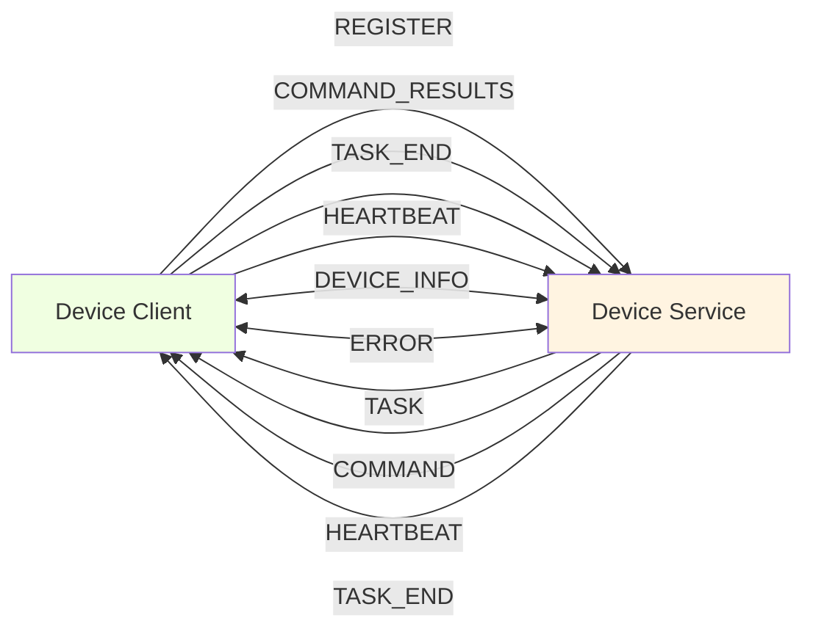
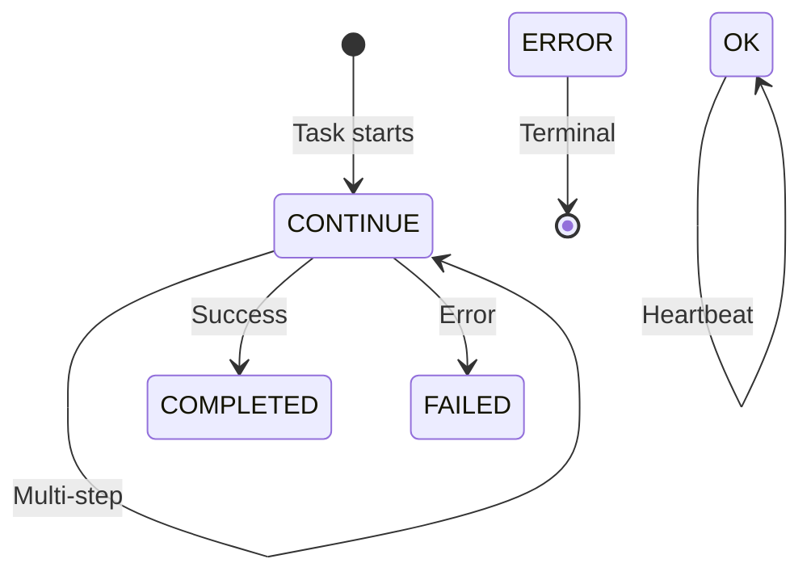
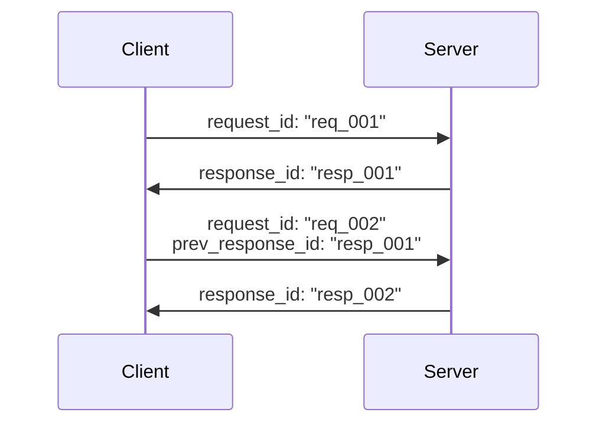

# AIP Message Reference

AIP uses **Pydantic-based messages** for automatic validation, serialization, and type safety. All messages transmit as JSON over WebSocket.

## Message Overview

### Bidirectional Communication

**Message Flow Overview:**

This diagram illustrates all message types and their directions in the AIP protocol, showing how clients and servers communicate bidirectionally:



Unidirectional arrows indicate request-response patterns, while bidirectional arrows (`<-->`) indicate messages that can be initiated by either party. Note that both `HEARTBEAT` and `TASK_END` can flow in both directions depending on the scenario.

### Message Types Quick Reference

| Direction | Message Type | Purpose | Key Fields |
|-----------|--------------|---------|------------|
| **Client → Server** | | | |
| | `REGISTER` | Initial capability advertisement | `client_id`, `metadata` |
| | `COMMAND_RESULTS` | Return command execution results | `action_results`, `prev_response_id` |
| | `TASK_END` | Notify task completion | `status`, `session_id` |
| | `HEARTBEAT` | Keepalive signal | `client_id` |
| **Server → Client** | | | |
| | `TASK` | Task assignment | `user_request`, `task_name` |
| | `COMMAND` | Command execution request | `actions`, `response_id` |
| | `HEARTBEAT` | Keepalive acknowledgment | `response_id` |
| | `TASK_END` | Task completion notification | `status`, `result` |
| **Bidirectional** | | | |
| | `DEVICE_INFO_REQUEST` | Request device telemetry | `request_id` |
| | `DEVICE_INFO_RESPONSE` | Device information | Device specs |
| | `ERROR` | Error condition | `error` message |

--- 
---

## Core Data Structures

These Pydantic models form the building blocks for all AIP messages.

### Essential Types Summary

| Type | Purpose | Key Fields | Usage |
|------|---------|------------|-------|
| **Rect** | UI element coordinates | `x`, `y`, `width`, `height` | UI automation |
| **ControlInfo** | UI control metadata | `annotation_id`, `name`, `rectangle` | Control discovery |
| **WindowInfo** | Window metadata | `process_id`, `is_active` (extends ControlInfo) | Window management |
| **MCPToolInfo** | Tool definition | `tool_key`, `namespace`, `input_schema` | Capability advertisement |
| **Command** | Execution request | `tool_name`, `parameters`, `call_id` | Action dispatch |
| **Result** | Execution outcome | `status`, `result`, `error` | Result reporting |

### Rect (Rectangle)

Represents UI element bounding box.

```python
rect = Rect(x=100, y=200, width=300, height=150)
```

| Field | Type | Description |
|-------|------|-------------|
| `x` | int | X-coordinate (top-left) |
| `y` | int | Y-coordinate (top-left) |
| `width` | int | Width in pixels |
| `height` | int | Height in pixels |

### ControlInfo

UI control element metadata.

**ControlInfo Example:**

```python
control = ControlInfo(
    annotation_id="ctrl_001",
    name="Submit Button",
    class_name="Button",
    rectangle=Rect(x=100, y=200, width=80, height=30),
    is_enabled=True,
    is_visible=True
)
```

**Complete Field List:**

| Field | Type | Description |
|-------|------|-------------|
| `annotation_id` | str? | Unique annotation identifier |
| `name` | str? | Control name |
| `title` | str? | Control title |
| `handle` | int? | Windows handle (HWND) |
| `class_name` | str? | UI class name |
| `rectangle` | Rect? | Bounding rectangle |
| `control_type` | str? | Type (Button, TextBox, etc.) |
| `automation_id` | str? | UI Automation ID |
| `is_enabled` | bool? | Enabled state |
| `is_visible` | bool? | Visibility state |
| `source` | str? | Data source identifier |
| `text_content` | str? | Text content |

### WindowInfo

Window metadata (extends ControlInfo).

**Additional Fields:**

| Field | Type | Description |
|-------|------|-------------|
| `process_id` | int? | Process ID (PID) |
| `process_name` | str? | Process name (e.g., "notepad.exe") |
| `is_minimized` | bool? | Minimized state |
| `is_maximized` | bool? | Maximized state |
| `is_active` | bool? | Has focus |

### MCPToolInfo

MCP tool capability definition.

**Tool Advertisement:**

Device agents use `MCPToolInfo` to advertise their capabilities during registration.

```python
tool_info = MCPToolInfo(
    tool_key="ui_automation.click_button",
    tool_name="click_button",
    namespace="ui_automation",
    tool_type="action",
    description="Click a button by its ID",
    input_schema={
        "type": "object",
        "properties": {
            "button_id": {"type": "string"}
        }
    }
)
```

| Field | Type | Description |
|-------|------|-------------|
| `tool_key` | str | Unique key (`namespace.tool_name`) |
| `tool_name` | str | Tool name |
| `namespace` | str | MCP namespace |
| `tool_type` | str | `"action"` or `"data_collection"` |
| `description` | str? | Tool description |
| `input_schema` | dict? | JSON schema for inputs |
| `output_schema` | dict? | JSON schema for outputs |
| `meta` | dict? | Metadata |
| `annotations` | dict? | Additional annotations |

Learn more about [MCP tools and capabilities](../mcp/overview.md).

---

## Command and Result Structures

### Command

Execution request sent to device agents.

**Command Structure:**

```python
cmd = Command(
    tool_name="click_element",
    parameters={"control_id": "btn_submit"},
    tool_type="action",
    call_id="cmd_12345"
)
```

| Field | Type | Required | Description |
|-------|------|----------|-------------|
| `tool_name` | str | ✅ | Name of tool to execute |
| `parameters` | dict | | Tool parameters |
| `tool_type` | str | ✅ | `"data_collection"` or `"action"` |
| `call_id` | str | | Unique identifier for correlation |

**Call ID Correlation:**

Use `call_id` to match commands with their results in the `Result` object.

### ResultStatus

Execution outcome enumeration.

| Status | Meaning | When to Use |
|--------|---------|-------------|
| `SUCCESS` | ✅ Completed successfully | Command executed without errors |
| `FAILURE` | ❌ Failed with error | Execution encountered an error |
| `SKIPPED` | ⏭️ Skipped execution | Conditional execution, not run |
| `NONE` | ⚪ No status | Initial/unknown state |

### Result

Command execution outcome.

!!!warning "Always Check Status"
    Check `status` before accessing `result`. If `FAILURE`, use `error` field for diagnostics.

```python
# Success result
result = Result(
    status=ResultStatus.SUCCESS,
    result={"element_found": True, "clicked": True},
    namespace="ui_automation",
    call_id="cmd_12345"
)

# Failure result
result = Result(
    status=ResultStatus.FAILURE,
    error="Element not found: btn_submit",
    namespace="ui_automation",
    call_id="cmd_12345"
)
```

| Field | Type | Description |
|-------|------|-------------|
| `status` | ResultStatus | Execution status |
| `error` | str? | Error message (if FAILURE) |
| `result` | Any | Result payload (type varies by tool) |
| `namespace` | str? | Namespace of executed tool |
| `call_id` | str? | Matches Command.call_id |

---

## Status Enumerations

### TaskStatus

Task lifecycle states.

**State Transitions:**

**Task Lifecycle State Machine:**

This diagram shows the possible state transitions during task execution, including the multi-turn loop and terminal states:



The `CONTINUE → CONTINUE` self-loop represents multi-turn execution where tasks request additional commands before completion. `COMPLETED` and `FAILED` are terminal success/failure states.

| Status | Meaning | Usage |
|--------|---------|-------|
| `CONTINUE` | 🔄 Task ongoing | Multi-turn execution, more steps needed |
| `COMPLETED` | ✅ Task done | Successful completion |
| `FAILED` | ❌ Task failed | Error encountered |
| `OK` | ✓ Acknowledgment | Heartbeat, health check passed |
| `ERROR` | ⚠️ Protocol error | Protocol-level error |

**Multi-Turn Execution:**

`CONTINUE` enables agents to request additional commands before marking a task as complete, supporting complex multi-step workflows.

---

## Client Types

### ClientType

Identifies the type of client connecting to the server.

| Type | Role | Characteristics |
|------|------|----------------|
| `DEVICE` | Device agent executor | • Executes tasks locally<br>• Reports telemetry<br>• Single-device focus |
| `CONSTELLATION` | Multi-device orchestrator | • Manages multiple devices<br>• Coordinates tasks<br>• Requires `target_id` |

**Registration by Type:**

```python
# Device client
device_msg = ClientMessage(
    type=ClientMessageType.REGISTER,
    client_type=ClientType.DEVICE,
    client_id="device_001"
)

# Constellation client
constellation_msg = ClientMessage(
    type=ClientMessageType.REGISTER,
    client_type=ClientType.CONSTELLATION,
    client_id="orchestrator_001",
    target_id="device_001"  # Target device
)
```

---

## ClientMessage (Client → Server)

Devices and constellation clients use `ClientMessage` to communicate with the server.

### Message Types

| Type | Purpose | Required Fields |
|------|---------|----------------|
| **REGISTER** | Initial registration | `client_id`, `client_type` |
| **HEARTBEAT** | Keepalive | `client_id`, `status=OK` |
| **TASK** | Request task execution | `request`, `client_id` |
| **TASK_END** | Notify completion | `session_id`, `status` |
| **COMMAND_RESULTS** | Return results | `action_results`, `prev_response_id` |
| **DEVICE_INFO_REQUEST** | Request telemetry | `request_id` |
| **DEVICE_INFO_RESPONSE** | Provide telemetry | Device data |
| **ERROR** | Report error | `error` |

### Common Fields

| Field | Type | Description |
|-------|------|-------------|
| `type` | ClientMessageType | Message type |
| `status` | TaskStatus | Current task status |
| `client_type` | ClientType | DEVICE or CONSTELLATION |
| `session_id` | str? | Session identifier |
| `task_name` | str? | Human-readable task name |
| `client_id` | str? | Unique client identifier |
| `target_id` | str? | Target device (for constellation) |
| `request` | str? | Request text (for TASK) |
| `action_results` | List[Result]? | Command results |
| `timestamp` | str? | ISO 8601 timestamp |
| `request_id` | str? | Unique request identifier |
| `prev_response_id` | str? | Previous response ID |
| `error` | str? | Error message |
| `metadata` | dict? | Additional metadata |

### Example: REGISTER

```python
register_msg = ClientMessage(
    type=ClientMessageType.REGISTER,
    client_type=ClientType.DEVICE,
    client_id="windows_agent_001",
    status=TaskStatus.OK,
    timestamp="2024-11-04T10:30:00Z",
    metadata={
        "platform": "windows",
        "os_version": "Windows 11",
        "capabilities": ["ui_automation", "file_operations"]
    }
)
```

### Example: COMMAND_RESULTS

```python
results_msg = ClientMessage(
    type=ClientMessageType.COMMAND_RESULTS,
    client_id="windows_agent_001",
    session_id="session_123",
    prev_response_id="resp_456",  # Links to server's COMMAND message
    status=TaskStatus.CONTINUE,
    action_results=[
        Result(status=ResultStatus.SUCCESS, result={"clicked": True}),
        Result(status=ResultStatus.SUCCESS, result={"text_entered": True})
    ],
    timestamp="2024-11-04T10:31:00Z",
    request_id="req_789"
)
```

---

## ServerMessage (Server → Client)

Device services use `ServerMessage` to assign tasks and send commands to clients.

### Message Types

| Type | Purpose | Required Fields |
|------|---------|----------------|
| **TASK** | Assign task | `user_request`, `task_name`, `session_id` |
| **COMMAND** | Execute commands | `actions`, `response_id`, `session_id` |
| **TASK_END** | Notify completion | `status`, `session_id` |
| **HEARTBEAT** | Keepalive ack | `response_id` |
| **DEVICE_INFO_REQUEST** | Request telemetry | `request_id` |
| **DEVICE_INFO_RESPONSE** | Telemetry data | Device info |
| **ERROR** | Error notification | `error` |

### Common Fields

| Field | Type | Description |
|-------|------|-------------|
| `type` | ServerMessageType | Message type |
| `status` | TaskStatus | Current task status |
| `user_request` | str? | Original user request |
| `agent_name` | str? | Agent handling task |
| `process_name` | str? | Process for execution context |
| `root_name` | str? | Root application name |
| `actions` | List[Command]? | Commands to execute |
| `messages` | List[str]? | Log messages |
| `error` | str? | Error description |
| `session_id` | str? | Session identifier |
| `task_name` | str? | Task name |
| `timestamp` | str? | ISO 8601 timestamp |
| `response_id` | str? | Response identifier |
| `result` | Any? | Result payload |

### Example: TASK Assignment

```python
task_msg = ServerMessage(
    type=ServerMessageType.TASK,
    status=TaskStatus.CONTINUE,
    user_request="Open Notepad and create a new file",
    task_name="create_notepad_file",
    session_id="session_123",
    response_id="resp_001",
    agent_name="AppAgent",
    process_name="notepad.exe",
    timestamp="2024-11-04T10:30:00Z"
)
```

### Example: COMMAND Execution

```python
command_msg = ServerMessage(
    type=ServerMessageType.COMMAND,
    status=TaskStatus.CONTINUE,
    session_id="session_123",
    response_id="resp_456",
    actions=[
        Command(
            tool_name="launch_application",
            parameters={"app_name": "notepad"},
            tool_type="action",
            call_id="cmd_001"
        ),
        Command(
            tool_name="type_text",
            parameters={"text": "Hello World"},
            tool_type="action",
            call_id="cmd_002"
        )
    ],
    timestamp="2024-11-04T10:30:30Z"
)
```

### Example: TASK_END

```python
task_end_msg = ServerMessage(
    type=ServerMessageType.TASK_END,
    status=TaskStatus.COMPLETED,
    session_id="session_123",
    response_id="resp_999",
    result={
        "file_created": True,
        "path": "C:\\Users\\user\\document.txt"
    },
    timestamp="2024-11-04T10:35:00Z"
)
```

---

## Message Validation

!!!warning "Built-In Validation"
    AIP provides `MessageValidator` class for ensuring message integrity. Always validate messages before processing to prevent protocol errors.

### Validation Methods

| Method | Purpose | Requirements |
|--------|---------|-------------|
| `validate_registration()` | Check registration | `type=REGISTER`, `client_id` present |
| `validate_task_request()` | Check task request | `type=TASK`, `request` and `client_id` present |
| `validate_command_results()` | Check results | `type=COMMAND_RESULTS`, `prev_response_id` present |
| `validate_server_message()` | Check server msg | `type` and `status` present |

**Validation Usage:**

```python
from aip.messages import MessageValidator

# Validate registration
if MessageValidator.validate_registration(client_message):
    await process_registration(client_message)

# Validate task request
if MessageValidator.validate_task_request(client_message):
    await dispatch_task(client_message)

# Validate command results
if MessageValidator.validate_command_results(client_message):
    await process_results(client_message)
```

---

## Message Correlation

AIP uses identifier chains to maintain conversation context across multiple message exchanges.

### Correlation Pattern

**Message Identifier Chaining:**

This sequence diagram demonstrates how messages are linked together using correlation IDs to maintain conversation context:



Each new request includes `prev_response_id` pointing to the previous server response, forming a traceable conversation chain. This pattern enables audit trails, debugging, and request-response correlation in multi-turn conversations.

### Correlation Fields

| Field | Purpose | Example |
|-------|---------|---------|
| `request_id` | Unique request identifier | `"req_abc123"` |
| `response_id` | Unique response identifier | `"resp_def456"` |
| `prev_response_id` | Links to previous response | `"resp_def456"` |
| `session_id` | Groups related messages | `"session_xyz"` |
| `call_id` | Correlates commands/results | `"cmd_001"` |

### Session Tracking

**Session-Based Grouping:**

All messages within a task execution share the same `session_id` for traceability.

```python
# All messages use same session_id
SESSION_ID = "session_abc123"

task_msg.session_id = SESSION_ID
command_msg.session_id = SESSION_ID
results_msg.session_id = SESSION_ID
task_end_msg.session_id = SESSION_ID
```

---

## Best Practices

!!!success "Message Construction"
    **Timestamps**: Always use ISO 8601 format
    ```python
    from datetime import datetime, timezone
    timestamp = datetime.now(timezone.utc).isoformat()
    ```
    
    **Unique IDs**: Generate UUIDs for correlation
    ```python
    import uuid
    request_id = str(uuid.uuid4())
    ```

!!!warning "Error Handling"
    - Check `Result.status` before accessing result data
    - Always provide meaningful error messages
    - Use `ResultStatus.FAILURE` with descriptive `error` field

**Extensibility:**

- Use `metadata` field for custom data without breaking protocol
- Leverage Pydantic's validation for type safety
- Always correlate messages with `prev_response_id`

---

## Quick Reference

### Import Messages

```python
from aip.messages import (
    ClientMessage,
    ServerMessage,
    ClientMessageType,
    ServerMessageType,
    ClientType,
    TaskStatus,
    Command,
    Result,
    ResultStatus,
    MessageValidator,
)
```

### Related Documentation

- [Protocol Guide](./protocols.md) - How protocols construct and use messages
- [Endpoints](./endpoints.md) - How endpoints handle messages
- [Overview](./overview.md) - High-level message flow in system architecture
- [Transport Layer](./transport.md) - WebSocket transport for message delivery
- [Resilience](./resilience.md) - Message retry and timeout handling
- [MCP Integration](../mcp/overview.md) - How MCP tools integrate with AIP messages
