# Agent Interaction Protocol (AIP)

!!!quote "The Nervous System of UFO²"
    AIP is the communication backbone that enables seamless coordination between distributed agents across devices, functioning as UFO²'s **nervous system** by unifying registration, task dispatch, command execution, and result reporting into a single, persistent protocol.

## Why AIP Matters

Traditional HTTP-based coordination (e.g., A2A, ACP) uses short-lived, stateless interactions—unsuitable for UFO²'s dynamic orchestration needs.

| Legacy HTTP Coordination | AIP WebSocket-Based Design |
|--------------------------|----------------------------|
| ❌ Short-lived requests | ✅ Long-lived sessions |
| ❌ Stateless interactions | ✅ Session-aware task management |
| ❌ High latency overhead | ✅ Low-latency event streaming |
| ❌ Poor reconnection support | ✅ Seamless recovery from disconnections |
| ❌ Manual state synchronization | ✅ Automatic DAG state propagation |

!!!success "Key Design Goals"
    - **Continuous DAG Evolution**: Task graphs dynamically modified during execution
    - **Dynamic Agent Participation**: Agents join, leave, and reconnect unpredictably  
    - **Fine-Grained Event Propagation**: Real-time updates on tasks, commands, and system state

## Core Design Principles

| Principle | Description |
|-----------|-------------|
| **🎯 Minimalism with Extensibility** | Stable protocol core + custom extensions via capability descriptors |
| **🔌 Transport Agnostic** | WebSocket primary, supports future HTTP/3, gRPC, etc. |
| **💾 Session-Aware** | Long-lived sessions span multiple task executions |
| **🛡️ Resilient by Design** | Auto-reconnection, heartbeat monitoring, timeout management |
| **👨‍💻 Developer Friendly** | Strongly-typed Pydantic messages, clear errors, comprehensive logging |

!!!info "Protocol Characteristics"
    AIP is both **human-readable** (JSON-based messages) and **machine-verifiable** (Pydantic schema validation), making debugging intuitive while maintaining type safety.


## Three-Layer Architecture

!!!tip "High-Level View"
    AIP connects three layers: **ConstellationClient** (orchestrator) → **Device Agent Service** (server) → **Device Agent Client** (executor). Each layer has clear responsibilities.

| Layer | Role | Key Responsibilities |
|-------|------|---------------------|
| **🌟 ConstellationClient** | Orchestrator | • Global agent registry (`AgentProfile` management)<br>• Task assignment & DAG coordination<br>• Multi-device scheduling decisions |
| **🖥️ Device Agent Service** | Server | • WebSocket connection management<br>• Task dispatch to device clients<br>• Command execution coordination<br>• Result aggregation & reporting |
| **📱 Device Agent Client** | Executor | • Local task execution<br>• MCP tool/action invocation<br>• System telemetry reporting<br>• Result streaming |

**Architecture Diagram:**

The following diagram illustrates the three-layer architecture and bidirectional communication flows between components:


This architecture enables persistent WebSocket connections that span multiple task executions, reducing connection overhead while maintaining bidirectional communication for task dispatch (top-down) and result reporting (bottom-up).

!!!example "Communication Flow Example"
    1. ConstellationClient assigns `TASK` to GPU agent  
    2. Device Service receives task, routes to connected GPU client  
    3. GPU Client executes commands via MCP tools  
    4. Results stream back through Service to ConstellationClient  
    5. ConstellationClient updates DAG, may spawn new subtasks

---

## Core Capabilities

### 1️⃣ Agent Registration & Profiling

!!!info "Multi-Source Agent Profiles"
    Each agent is represented by an **AgentProfile** combining data from three sources for comprehensive capability discovery.

| Source | Provider | Information |
|--------|----------|-------------|
| **User Config** | ConstellationClient | Endpoint URLs, user preferences, device identity |
| **Service Manifest** | Device Agent Service | Supported tools, capabilities, operational metadata |
| **Client Telemetry** | Device Agent Client | OS, hardware specs, GPU status, runtime metrics |

**Benefits of Multi-Level Profiling:**

- ✅ Accurate task allocation based on real-time capabilities  
- ✅ Transparent adaptation to environmental changes (e.g., GPU availability)  
- ✅ No manual updates needed when device state changes  
- ✅ Informed scheduling decisions at scale

!!!tip "Dynamic Profile Updates"
    Client telemetry continuously refreshes, so the orchestrator always sees current device state—critical for GPU-aware scheduling or cross-device load balancing.

[→ See detailed registration flow](./protocols.md)

---

### 2️⃣ Task Dispatch & Result Delivery

!!!success "Persistent Sessions"
    AIP uses **long-lived WebSocket sessions** that span multiple task executions, eliminating connection overhead and preserving context.

**Task Execution Sequence:**

The following sequence diagram shows the complete lifecycle of a task from assignment to completion, including intermediate execution steps and state updates:


Each arrow represents a message exchange, with vertical lifelines showing the temporal ordering of events. Note how logs stream back during execution, enabling real-time monitoring.

| Stage | Message Type | Content |
|-------|-------------|---------|
| Assignment | `TASK` | Task★ definition, target device, commands |
| Execution | (internal) | MCP tool invocations, local computation |
| Reporting | `TASK_END` | Status, logs, evaluator outputs, results |

!!!warning "Asynchronous Execution"
    Tasks execute asynchronously. The orchestrator may assign multiple tasks to different devices simultaneously, with results arriving in non-deterministic order.

[→ See message format details](./messages.md)

---

### 3️⃣ Command Execution

!!!info "Fine-Grained Control"
    Within each task, AIP executes **individual commands** deterministically, enabling precise control and error handling.

**Command Structure:**

| Field | Purpose | Example |
|-------|---------|---------|
| `id` | Unique identifier | `"cmd_001"` |
| `function` | Tool/action name | `"click_input"` |
| `args` | Typed arguments | `["Save Button", "left"]` |
| `tool_type` | Category | `"action"` or `"data_collection"` |

**Execution Guarantees:**

- ✅ **Sequential execution** within a session (deterministic order)  
- ✅ **Command batching** supported (reduces network overhead)  
- ✅ **Structured results** with status codes and error details  
- ✅ **Timeout propagation** for precise recovery strategies

**Command Batching Example:**

```json
{
  "commands": [
    {"id": "1", "function": "click", "args": ["File"]},
    {"id": "2", "function": "click", "args": ["Save As"]},
    {"id": "3", "function": "type", "args": ["document.pdf"]}
  ]
}
```

All three commands sent in one message, executed sequentially.

[→ See command execution protocol](./protocols.md)

---

## Message Protocol Overview

!!!tip "Strongly-Typed Messages"
    All AIP messages use **Pydantic models** for automatic validation, serialization, and type safety.

### Bidirectional Message Types

| Direction | Message Type | Purpose |
|-----------|--------------|---------|
| **Client → Server** | `REGISTER` | Initial capability advertisement |
| | `COMMAND_RESULTS` | Return command execution results |
| | `TASK_END` | Notify task completion |
| | `HEARTBEAT` | Keepalive signal |
| | `DEVICE_INFO_RESPONSE` | Device telemetry update |
| **Server → Client** | `TASK` | Task assignment |
| | `COMMAND` | Command execution request |
| | `DEVICE_INFO_REQUEST` | Request telemetry refresh |
| | `HEARTBEAT` | Keepalive acknowledgment |
| **Bidirectional** | `ERROR` | Error condition reporting |

!!!info "Message Correlation"
    Every message includes:
    
    - `timestamp`: ISO 8601 formatted  
    - `request_id` / `response_id`: Unique identifier  
    - `prev_response_id`: Links responses to requests  
    - `session_id`: Session context

[→ Complete message reference](./messages.md)

---

## Resilient Connection Protocol

!!!warning "Network Instability Handling"
    AIP ensures **continuous orchestration** even under transient network failures or device disconnections.

### Device Disconnection Flow

**Connection State Transitions:**

This state diagram illustrates how devices transition between connection states and the actions triggered at each transition:

```mermaid
stateDiagram-v2
    [*] --> CONNECTED
    CONNECTED --> DISCONNECTED: Connection lost
    DISCONNECTED --> CONNECTED: Reconnection succeeds
    DISCONNECTED --> [*]: Timeout / Manual removal
    
    note right of DISCONNECTED
        • Excluded from scheduling
        • Tasks marked FAILED
        • Auto-reconnect triggered
    end note
```



The `DISCONNECTED` state acts as a quarantine zone where the device is temporarily removed from the scheduling pool while auto-reconnection attempts are made. If reconnection fails after timeout, the device is permanently removed.

| Event | Orchestrator Action | Device Action |
|-------|---------------------|---------------|
| **Device disconnects** | Mark as `DISCONNECTED`<br>Exclude from scheduling<br>Trigger auto-reconnect | N/A |
| **Reconnection succeeds** | Mark as `CONNECTED`<br>Resume scheduling | Session restored |
| **Disconnect during task** | Mark tasks as `TASK_FAILED`<br>Propagate to ConstellationAgent<br>Trigger DAG edit | N/A |

### ConstellationClient Disconnection

!!!danger "Bidirectional Fault Handling"
    When the **ConstellationClient** disconnects, all Device Agent Services:
    
    1. Receive termination signal  
    2. **Abort all ongoing tasks** tied to that client  
    3. Prevent resource leakage and zombie processes  
    4. Maintain end-to-end consistency

**Guarantees:**

- ✅ No orphaned tasks  
- ✅ Synchronized state across client-server boundary  
- ✅ Rapid recovery when connection restored  
- ✅ Consistent TaskConstellation state

[→ See resilience implementation](./resilience.md)

---

## Extensibility Mechanisms

!!!tip "Customization Points"
    AIP provides multiple extension points for domain-specific needs without modifying the core protocol.

### 1. Protocol Middleware

Add custom processing to message pipeline:

```python
from aip.protocol.base import ProtocolMiddleware

class AuditMiddleware(ProtocolMiddleware):
    async def process_outgoing(self, msg):
        log_to_audit_trail(msg)
        return msg
```

### 2. Custom Message Handlers

Register handlers for new message types:

```python
protocol.register_handler("custom_type", handle_custom_message)
```

### 3. Transport Layer

Pluggable transport (default: WebSocket):

```python
from aip.transport import CustomTransport
protocol.set_transport(CustomTransport(config))
```

[→ See extensibility guide](./protocols.md)

---

## Integration with UFO² Ecosystem

| Component | Integration Point | Benefit |
|-----------|-------------------|---------|
| **MCP Servers** | Command execution model aligns with MCP message formats | Unified interface for system actions and LLM tool calls |
| **TaskConstellation** | Real-time state synchronization via AIP messages | Planning DAG always reflects distributed execution state |
| **Configuration System** | Agent endpoints, capabilities managed via UFO² config | Centralized management, type-safe validation |
| **Logging & Monitoring** | Comprehensive logging at all protocol layers | Debugging, performance monitoring, audit trails |

!!!success "Seamless Ecosystem Integration"
    AIP abstracts network/device heterogeneity, allowing the orchestrator to treat all agents as **first-class citizens** in a single event-driven control plane.

---

## Quick Start

!!!example "Getting Started with AIP"
    
    **1. Device Server Setup**
    ```python
    from aip.endpoints import DeviceServerEndpoint
    
    server = DeviceServerEndpoint(host="0.0.0.0", port=8080)
    await server.start()
    ```
    
    **2. Device Client Connection**
    ```python
    from aip.endpoints import DeviceClientEndpoint
    
    client = DeviceClientEndpoint(server_url="ws://localhost:8080")
    await client.connect()
    ```
    
    **3. Constellation Orchestration**
    ```python
    from aip.endpoints import ConstellationEndpoint
    
    orchestrator = ConstellationEndpoint(config)
    await orchestrator.register_device("gpu-agent-1", "ws://gpu-server:8080")
    ```

**Next Steps:**

- 📖 [Message Reference](./messages.md) - Complete message type documentation  
- 🔧 [Protocol Guide](./protocols.md) - Implementation details and best practices  
- 🌐 [Transport Layer](./transport.md) - WebSocket configuration and optimization  
- 🔌 [Endpoints](./endpoints.md) - Endpoint setup and usage patterns  
- 🛡️ [Resilience](./resilience.md) - Connection management and fault tolerance

---

## Summary

!!!quote "AIP's Value Proposition"
    AIP transforms distributed workflow execution into a **coherent, safe, and adaptive system** where reasoning and execution converge seamlessly across diverse agents and environments.

**Key Takeaways:**

| Aspect | Impact |
|--------|--------|
| **Persistence** | Long-lived connections reduce overhead, maintain context |
| **Low Latency** | WebSocket enables real-time event propagation |
| **Standardization** | Any service implementing TASK/TASK_END can join constellation |
| **Reliability** | Auto-reconnection and fault handling ensure graceful degradation |
| **Scalability** | Multiplexed connections support large multi-agent deployments |
| **Developer UX** | Strongly-typed messages, clear errors reduce integration effort |

By abstracting network complexity and providing a stable protocol core with flexible extensions, AIP enables UFO² to orchestrate heterogeneous agents as a **unified, event-driven control plane**.
