# Agent Interaction Protocol (AIP)

The orchestration model requires a communication substrate that remains **correct under continuous DAG evolution**, **dynamic agent participation**, and **fine-grained event propagation**. Legacy HTTP-based coordination approaches (e.g., A2A, ACP) assume short-lived, stateless interactions, incurring handshake overhead, stale capability views, and fragile recovery when partial failures occur mid-task. These assumptions make them unsuitable for the continuously evolving workflows and long-running reasoning loops characteristic of UFO².

## Design Overview

AIP serves as the **nervous system** of UFO², connecting the ConstellationClient, device agent services, and device clients under a unified, event-driven control plane. It is designed as a lightweight yet evolution-tolerant protocol to satisfy six goals:

**Design Goals:**

- **(G1)** Maintain persistent bidirectional sessions to eliminate per-request overhead
- **(G2)** Unify heterogeneous capability discovery via multi-source profiling
- **(G3)** Ensure fine-grained reliability through heartbeats and timeout managers for disconnection and failure detection
- **(G4)** Preserve deterministic command ordering within sessions
- **(G5)** Support composable extensibility for new message types and resilience strategies
- **(G6)** Provide transparent reconnection and task continuity under transient failures

| Legacy HTTP Coordination | AIP WebSocket-Based Design |
|--------------------------|----------------------------|
| ❌ Short-lived requests | ✅ Persistent sessions (G1) |
| ❌ Stateless interactions | ✅ Session-aware task management |
| ❌ High latency overhead | ✅ Low-latency event streaming |
| ❌ Poor reconnection support | ✅ Seamless recovery from disconnections (G6) |
| ❌ Manual state synchronization | ✅ Automatic DAG state propagation |
| ❌ Fragile partial failures | ✅ Fine-grained reliability (G3) |

## Five-Layer Architecture

To meet these requirements, AIP adopts a persistent, bidirectional WebSocket transport and decomposes the orchestration substrate into **five** logical strata, each responsible for a distinct aspect of reliability and adaptability. The architecture establishes a complete substrate where **L1** defines semantic contracts, **L2** provides transport flexibility, **L3** implements protocol logic, **L4** ensures operational resilience, and **L5** delivers deployment-ready orchestration primitives.

**Architecture Diagram:**

The following diagram illustrates the five-layer architecture and the roles of each component:


### Layer 1: Message Schema Layer

Defines strongly-typed, Pydantic-validated contracts (`ClientMessage`, `ServerMessage`) for message direction, purpose, and task transitions. All messages are validated at schema level, preventing malformed messages from entering the protocol pipeline, enabling early error detection and simplifying debugging.

| Responsibility | Implementation | Supports |
|----------------|----------------|----------|
| Message contracts | Pydantic models with validation | Human-readable + machine-verifiable |
| Structured metadata | System info, capabilities | Unified capability discovery (G2) |
| ID correlation | Explicit request/response linking | Deterministic ordering (G4) |

### Layer 2: Transport Abstraction Layer

Provides protocol-agnostic `Transport` interface with production-grade WebSocket implementation. The abstraction layer allows swapping transports without changing protocol logic, supporting future protocol evolution.

| Feature | Benefit | Goals |
|---------|---------|-------|
| Configurable pings/timeouts | Connection health monitoring | G3 |
| Large payload support | Handles complex task definitions | G1 |
| Decoupled transport logic | Future extensibility (HTTP/3, gRPC) | G5 |
| Low-latency persistent sessions | Eliminates per-request overhead | G1 |

### Layer 3: Protocol Orchestration Layer

Implements modular handlers for registration, task execution, heartbeat, and command dispatch. Each handler is independently testable and replaceable, supporting composable extensibility (G5) while maintaining ordered state transitions (G4).

| Component | Purpose | Design |
|-----------|---------|--------|
| `AIPProtocol` base | Common handler infrastructure | Extensible base class |
| Handler modules | Registration, tasks, heartbeat, commands | Pluggable handlers |
| Middleware hooks | Logging, metrics, authentication | Composable extensions (G5) |
| State transitions | Ordered message processing | Deterministic ordering (G4) |

**Related Documentation:**
- [Complete message reference](./messages.md)
- [Protocol implementation details](./protocols.md)

### Layer 4: Resilience and Health Management Layer

!!!warning "Fault Tolerance"
    This layer guarantees fine-grained reliability (G3) and seamless task continuity under transient disconnections (G6), preventing cascade failures.

Encapsulates reliability mechanisms ensuring operational continuity under failures:

| Component | Mechanism | Goals |
|-----------|-----------|-------|
| `HeartbeatManager` | Periodic keepalive signals | G3 |
| `TimeoutManager` | Configurable timeout policies | G3 |
| `ReconnectionStrategy` | Exponential backoff with jitter | G6 |
| Session recovery | Automatic state restoration | G6 |

[→ Resilience implementation details](./resilience.md)

### Layer 5: Endpoint Orchestration Layer

Provides role-specific facades integrating lower layers into deployable components. These endpoints unify connection lifecycle, task routing, and health monitoring across roles, reinforcing G1–G6 through consistent implementation of lower-layer capabilities.

| Endpoint | Role | Responsibilities |
|----------|------|------------------|
| `ConstellationEndpoint` | Orchestrator | Global agent registry, task assignment, DAG coordination |
| `DeviceServerEndpoint` | Server | WebSocket connection management, task dispatch, result aggregation |
| `DeviceClientEndpoint` | Executor | Local task execution, MCP tool invocation, telemetry reporting |

**Endpoint Integration Benefits:**

- ✅ Connection lifecycle management (G1, G6)
- ✅ Role-specific protocol variants (G5)
- ✅ Health monitoring integration (G3)
- ✅ Task routing and session management (G4)

[→ Endpoint setup guide](./endpoints.md)

## Architecture Benefits

Together, these layers form a vertically integrated stack that enables UFO² to maintain **correctness and availability** under challenging conditions:

| Challenge | How AIP Addresses It | Layers Involved |
|-----------|----------------------|-----------------|
| **DAG Evolution** | Deterministic ordering, extensible message types | L1, L3, L4, L5 (G4, G5) |
| **Agent Churn** | Heartbeats, reconnection, session recovery | L4, L5 (G3, G6) |
| **Heterogeneous Environments** | Persistent sessions, multi-source profiling | L1, L2, L5 (G1, G2) |
| **Transient Failures** | Timeout management, automatic recovery | L4 (G3, G6) |
| **Protocol Evolution** | Transport abstraction, middleware hooks | L2, L3 (G5) |

AIP transforms distributed workflow execution into a **coherent, safe, and adaptive system** where reasoning and execution converge seamlessly across diverse agents and environments.

## Core Capabilities

### Agent Registration & Profiling

Each agent is represented by an **AgentProfile** combining data from three sources for comprehensive capability discovery, supporting heterogeneous capability unification (G2):

| Source | Provider | Information |
|--------|----------|-------------|
| **User Config** | ConstellationClient | Endpoint URLs, user preferences, device identity |
| **Service Manifest** | Device Agent Service | Supported tools, capabilities, operational metadata |
| **Client Telemetry** | Device Agent Client | OS, hardware specs, GPU status, runtime metrics |

**Benefits of Multi-Level Profiling:**

- ✅ Accurate task allocation based on real-time capabilities (G2)
- ✅ Transparent adaptation to environmental changes (e.g., GPU availability)  
- ✅ No manual updates needed when device state changes  
- ✅ Informed scheduling decisions at scale

!!!tip "Dynamic Profile Updates"
    Client telemetry continuously refreshes, so the orchestrator always sees current device state—critical for GPU-aware scheduling or cross-device load balancing (G2).

[→ See detailed registration flow](./protocols.md)

### Task Dispatch & Result Delivery

AIP uses **long-lived WebSocket sessions** that span multiple task executions, eliminating per-request connection overhead and preserving context (G1).

**Task Execution Sequence:**

The following sequence diagram shows the complete lifecycle of a task from assignment to completion, including intermediate execution steps and state updates:


Each arrow represents a message exchange, with vertical lifelines showing the temporal ordering of events. Note how logs stream back during execution, enabling real-time monitoring.

| Stage | Message Type | Content |
|-------|-------------|---------|
| Assignment | `TASK` | TaskStar definition, target device, commands |
| Execution | (internal) | MCP tool invocations, local computation |
| Reporting | `TASK_END` | Status, logs, evaluator outputs, results |

!!!warning "Asynchronous Execution"
    Tasks execute asynchronously. The orchestrator may assign multiple tasks to different devices simultaneously, with results arriving in non-deterministic order.

**Related Documentation:**
- [Message format details](./messages.md)
- [TaskConstellation documentation](../galaxy/constellation/task_constellation.md)
- [TaskStar (task nodes) documentation](../galaxy/constellation/task_star.md)

### Command Execution

Within each task, AIP executes **individual commands** deterministically with preserved ordering, enabling precise control and error handling (G4).

**Command Structure:**

| Field | Purpose | Example |
|-------|---------|---------|
| `tool_name` | Tool/action name | `"click_input"` |
| `parameters` | Typed arguments | `{"target": "Save Button", "button": "left"}` |
| `tool_type` | Category | `"action"` or `"data_collection"` |
| `call_id` | Unique identifier | `"cmd_001"` |

**Execution Guarantees:**

- ✅ **Sequential execution** within a session (deterministic order) (G4)
- ✅ **Command batching** supported (reduces network overhead)  
- ✅ **Structured results** with status codes and error details  
- ✅ **Timeout propagation** for precise recovery strategies (G3)

**Command Batching Example:**

```json
{
  "actions": [
    {"tool_name": "click", "parameters": {"target": "File"}, "call_id": "1"},
    {"tool_name": "click", "parameters": {"target": "Save As"}, "call_id": "2"},
    {"tool_name": "type", "parameters": {"text": "document.pdf"}, "call_id": "3"}
  ]
}
```

All three commands sent in one message, executed sequentially.

[→ See command execution protocol](./protocols.md)

## Message Protocol Overview

All AIP messages use **Pydantic models** for automatic validation, serialization, and type safety.

### Bidirectional Message Types

| Direction | Message Type | Purpose |
|-----------|--------------|---------|
| **Client → Server** | `REGISTER` | Initial capability advertisement |
| | `COMMAND_RESULTS` | Return command execution results |
| | `TASK_END` | Notify task completion |
| | `HEARTBEAT` | Keepalive signal |
| | `DEVICE_INFO_RESPONSE` | Device telemetry update |
| **Server → Client** | `TASK` | Task assignment |
| | `COMMAND` | Command execution request |
| | `DEVICE_INFO_REQUEST` | Request telemetry refresh |
| | `HEARTBEAT` | Keepalive acknowledgment |
| **Bidirectional** | `ERROR` | Error condition reporting |

**Message Correlation:**

Every message includes:

- `timestamp`: ISO 8601 formatted  
- `request_id` / `response_id`: Unique identifier  
- `prev_response_id`: Links responses to requests  
- `session_id`: Session context

[→ Complete message reference](./messages.md)

## Resilient Connection Protocol

!!!warning "Network Instability Handling (G3, G6)"
    AIP ensures **continuous orchestration** even under transient network failures or device disconnections through fine-grained reliability mechanisms and transparent reconnection.

### Device Disconnection Flow

**Connection State Transitions:**

This state diagram illustrates how devices transition between connection states and the actions triggered at each transition:

```mermaid
stateDiagram-v2
    [*] --> CONNECTED
    CONNECTED --> DISCONNECTED: Connection lost
    DISCONNECTED --> CONNECTED: Reconnection succeeds
    DISCONNECTED --> [*]: Timeout / Manual removal
    
    note right of DISCONNECTED
        • Excluded from scheduling
        • Tasks marked FAILED
        • Auto-reconnect triggered
    end note
```



The `DISCONNECTED` state acts as a quarantine zone where the device is temporarily removed from the scheduling pool while auto-reconnection attempts are made. If reconnection fails after timeout, the device is permanently removed.

| Event | Orchestrator Action | Device Action |
|-------|---------------------|---------------|
| **Device disconnects** | Mark as `DISCONNECTED`<br>Exclude from scheduling<br>Trigger auto-reconnect (G6) | N/A |
| **Reconnection succeeds** | Mark as `CONNECTED`<br>Resume scheduling | Session restored (G6) |
| **Disconnect during task** | Mark tasks as `FAILED`<br>Propagate to ConstellationAgent<br>Trigger DAG edit | N/A |

### ConstellationClient Disconnection

!!!danger "Bidirectional Fault Handling"
    When the **ConstellationClient** disconnects, all Device Agent Services:
    
    1. Receive termination signal  
    2. **Abort all ongoing tasks** tied to that client  
    3. Prevent resource leakage and zombie processes  
    4. Maintain end-to-end consistency

**Guarantees:**

- ✅ No orphaned tasks  
- ✅ Synchronized state across client-server boundary  
- ✅ Rapid recovery when connection restored (G6)
- ✅ Consistent TaskConstellation state (G4)

[→ See resilience implementation](./resilience.md)

## Extensibility Mechanisms

AIP provides multiple extension points for domain-specific needs without modifying the core protocol, supporting composable extensibility (G5).

### 1. Protocol Middleware

Add custom processing to message pipeline:

```python
from aip.protocol.base import ProtocolMiddleware

class AuditMiddleware(ProtocolMiddleware):
    async def process_outgoing(self, msg):
        log_to_audit_trail(msg)
        return msg
    
    async def process_incoming(self, msg):
        log_to_audit_trail(msg)
        return msg
```

### 2. Custom Message Handlers

Register handlers for new message types:

```python
protocol.register_handler("custom_type", handle_custom_message)
```

### 3. Transport Layer

Pluggable transport (default: WebSocket) (G5):

```python
from aip.transport import CustomTransport
protocol.transport = CustomTransport(config)
```

[→ See extensibility guide](./protocols.md)

## Integration with UFO² Ecosystem

| Component | Integration Point | Benefit |
|-----------|-------------------|---------|
| **MCP Servers** | Command execution model aligns with MCP message formats | Unified interface for system actions and LLM tool calls |
| **TaskConstellation** | Real-time state synchronization via AIP messages | Planning DAG always reflects distributed execution state |
| **Configuration System** | Agent endpoints, capabilities managed via UFO² config | Centralized management, type-safe validation |
| **Logging & Monitoring** | Comprehensive logging at all protocol layers | Debugging, performance monitoring, audit trails |

AIP abstracts network/device heterogeneity, allowing the orchestrator to treat all agents as **first-class citizens** in a single event-driven control plane.

**Related Documentation:**

- [TaskConstellation (DAG orchestrator)](../galaxy/constellation/task_constellation.md)
- [ConstellationAgent (orchestration agent)](../galaxy/constellation_agent/overview.md)
- [MCP Integration Guide](../mcp/overview.md)
- [Configuration System](../configuration/system/system_config.md)
**Next Steps:**

- 📖 [Message Reference](./messages.md) - Complete message type documentation  
- 🔧 [Protocol Guide](./protocols.md) - Implementation details and best practices  
- 🌐 [Transport Layer](./transport.md) - WebSocket configuration and optimization  
- 🔌 [Endpoints](./endpoints.md) - Endpoint setup and usage patterns  
- 🛡️ [Resilience](./resilience.md) - Connection management and fault tolerance

## Summary

AIP transforms distributed workflow execution into a **coherent, safe, and adaptive system** where reasoning and execution converge seamlessly across diverse agents and environments.

**Key Takeaways:**

| Aspect | Impact | Goals |
|--------|--------|-------|
| **Persistence** | Long-lived connections reduce overhead, maintain context | G1 |
| **Low Latency** | WebSocket enables real-time event propagation | G1 |
| **Capability Discovery** | Multi-source profiling unifies heterogeneous agents | G2 |
| **Reliability** | Heartbeats, timeouts, auto-reconnection ensure graceful degradation | G3, G6 |
| **Determinism** | Sequential command execution, explicit ID correlation | G4 |
| **Extensibility** | Middleware hooks, pluggable transports, custom handlers | G5 |
| **Developer UX** | Strongly-typed messages, clear errors reduce integration effort | G5 |

By decomposing orchestration into five logical layers—each addressing specific reliability and adaptability concerns—AIP enables UFO² to maintain **correctness and availability** under DAG evolution (G4, G5), agent churn (G3, G6), and heterogeneous execution environments (G1, G2).
