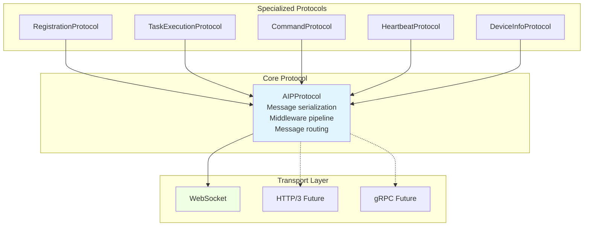
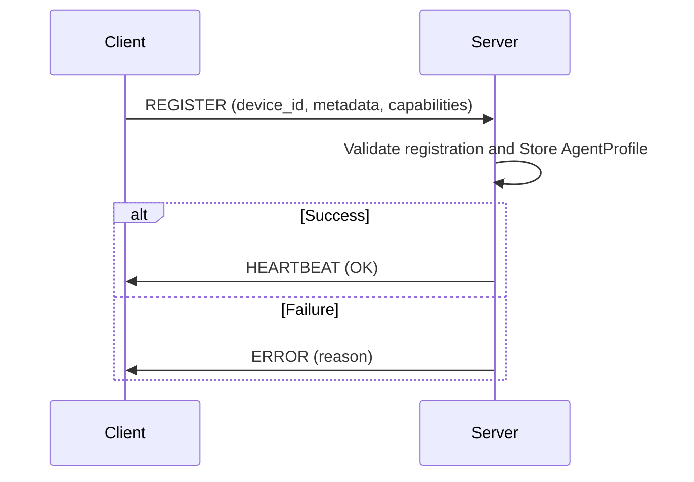
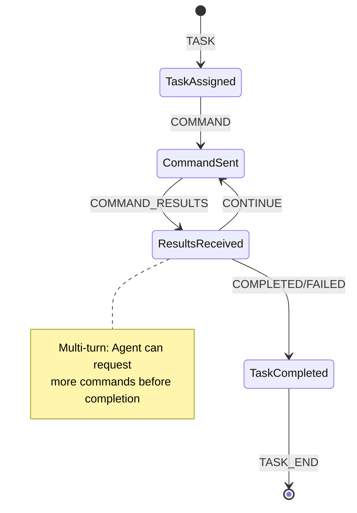
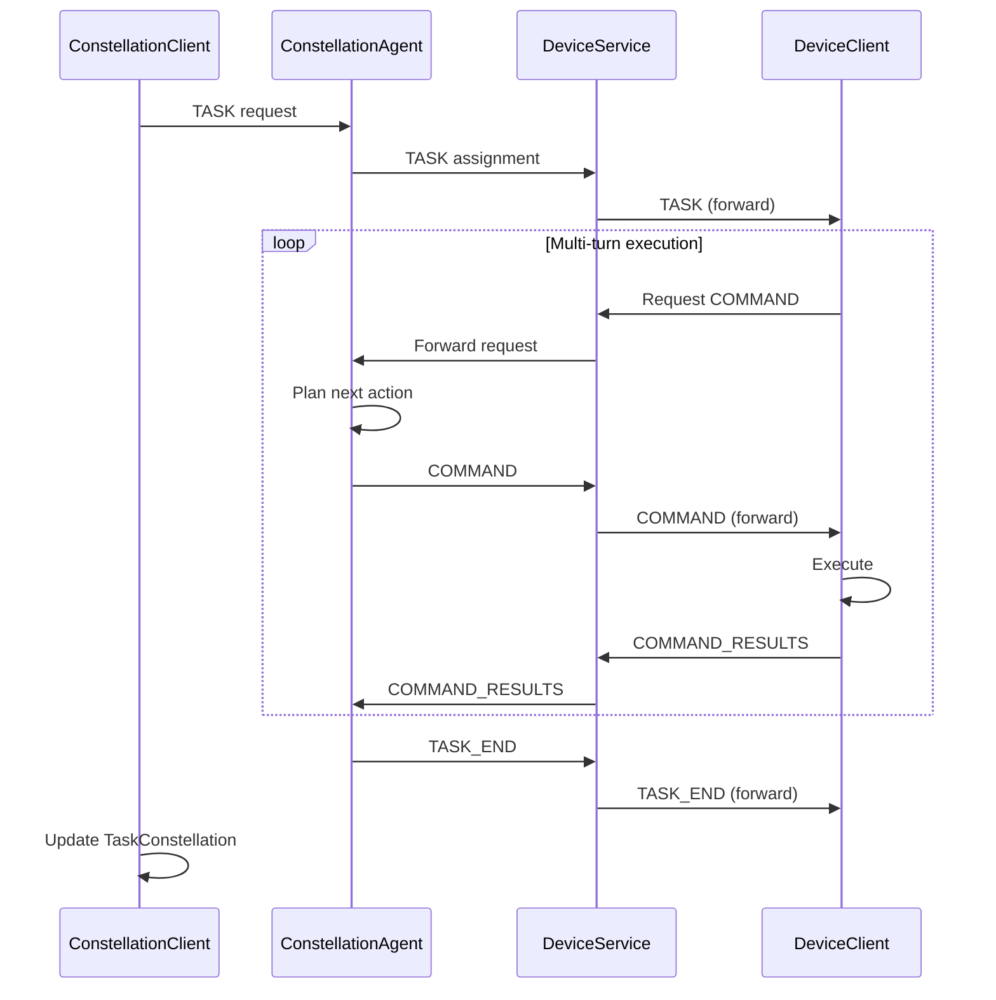
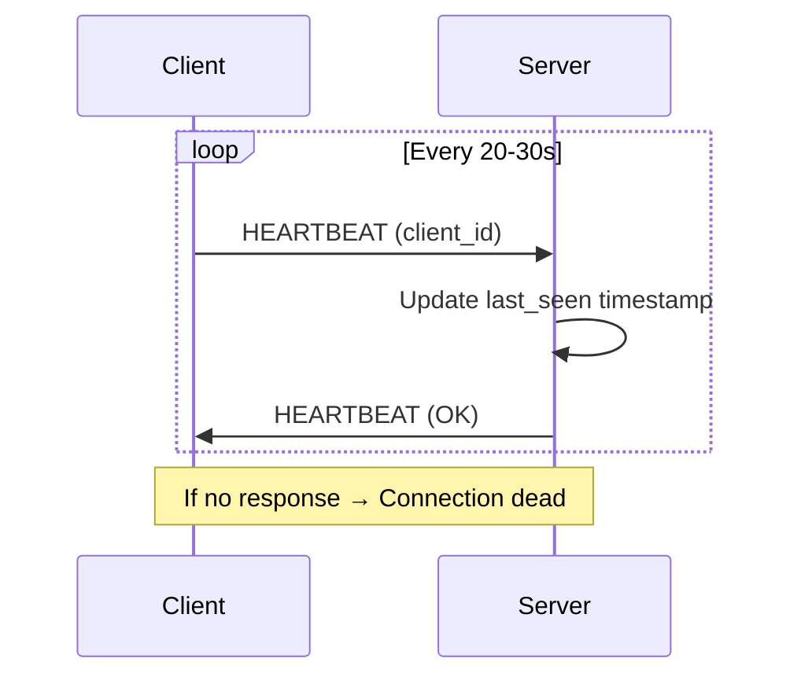
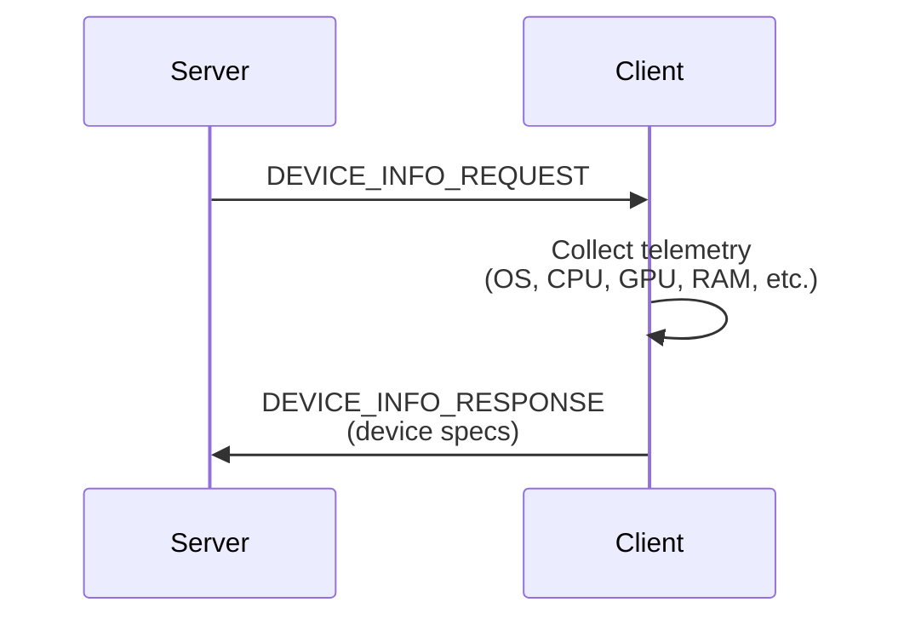
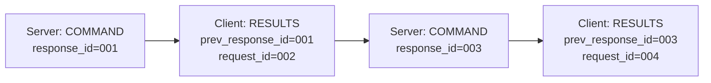

# AIP Protocol Reference

## Protocol Stack Overview

AIP uses a three-layer architecture where specialized protocols handle domain-specific concerns, the core protocol manages message processing, and the transport layer provides network communication.



This layered design enables clean separation of concerns: specialized protocols implement domain logic, the core protocol handles serialization and routing, and the transport layer abstracts network details. Dashed arrows indicate future transport options.

### Protocol Comparison

| Protocol | Purpose | Key Messages | Use When |
|----------|---------|--------------|----------|
| **RegistrationProtocol** | Agent capability advertisement | `REGISTER`, `HEARTBEAT(OK)` | Device joins constellation |
| **TaskExecutionProtocol** | Task lifecycle management | `TASK`, `COMMAND`, `TASK_END` | Executing multi-step tasks |
| **CommandProtocol** | Command validation | Validation utilities | Before sending/receiving commands |
| **HeartbeatProtocol** | Connection health monitoring | `HEARTBEAT` | Periodic keepalive |
| **DeviceInfoProtocol** | Telemetry exchange | `DEVICE_INFO_REQUEST/RESPONSE` | Querying device state |

---

## Core Protocol: AIPProtocol

`AIPProtocol` provides transport-agnostic message handling with middleware support and automatic serialization.

### Quick Start

```python
from aip.protocol import AIPProtocol
from aip.transport import WebSocketTransport

transport = WebSocketTransport()
protocol = AIPProtocol(transport)
```

### Core Operations

| Operation | Method | Description |
|-----------|--------|-------------|
| **Send** | `send_message(msg)` | Serialize and send Pydantic message |
| **Receive** | `receive_message(MsgType)` | Receive and deserialize to type |
| **Dispatch** | `dispatch_message(msg)` | Route to registered handler |
| **Error** | `send_error(error, id)` | Send error notification |
| **Status** | `is_connected()` | Check connection state |

### Middleware Pipeline

Add middleware for logging, authentication, metrics, or custom transformations.

```python
from aip.protocol.base import ProtocolMiddleware

class LoggingMiddleware(ProtocolMiddleware):
    async def process_outgoing(self, msg):
        logger.info(f"→ {msg.type}")
        return msg
    
    async def process_incoming(self, msg):
        logger.info(f"← {msg.type}")
        return msg

protocol.add_middleware(LoggingMiddleware())
```

**Execution Order:**

- **Outgoing**: First added → First executed
- **Incoming**: Last added → First executed (reverse)

### Message Handler Registration

```python
async def handle_task(msg):
    logger.info(f"Handling task: {msg.task_name}")
    # Process task...

protocol.register_handler("task", handle_task)

# Auto-dispatch to handler
await protocol.dispatch_message(server_msg)
```

[→ See transport configuration](./transport.md)

---

## RegistrationProtocol {#registration-protocol}

Handles initial registration and capability advertisement when agents join the constellation.

### Registration Flow

The following diagram shows the two-way handshake for device registration, including validation and acknowledgment:



Upon successful registration, the server stores the `AgentProfile` and responds with a `HEARTBEAT` acknowledgment. Failed registrations (e.g., duplicate device_id) return an `ERROR` message with diagnostic details.

### Device Registration

**Client-Side Registration:**

```python
from aip.protocol import RegistrationProtocol

reg_protocol = RegistrationProtocol(transport)

success = await reg_protocol.register_as_device(
    device_id="windows_agent_001",
    metadata={
        "platform": "windows",
        "os_version": "Windows 11",
        "cpu": "Intel i7",
        "ram_gb": 16,
        "capabilities": ["ui_automation", "file_operations"]
    },
    platform="windows"
)
```

**Auto-Added Fields:**

- `timestamp`: Registration time (ISO 8601)
- `client_type`: Set to `ClientType.DEVICE`

[→ See ClientType and ClientMessage in Message Reference](./messages.md)

### Constellation Registration

**Orchestrator Registration:**

```python
success = await reg_protocol.register_as_constellation(
    constellation_id="orchestrator_001",
    target_device="windows_agent_001",  # Required
    metadata={
        "orchestrator_version": "2.0.0",
        "max_concurrent_tasks": 10
    }
)
```

!!!warning "Target Device Required"
    Constellation clients **must** specify `target_device` to indicate which device they coordinate.

### Server-Side Handlers

| Method | Purpose | When to Use |
|--------|---------|-------------|
| `send_registration_confirmation()` | Acknowledge successful registration | After validating and storing profile |
| `send_registration_error()` | Report registration failure | Invalid ID, duplicate, or validation error |

---

## TaskExecutionProtocol {#task-execution-protocol}

Manages the complete task lifecycle: assignment → command execution → result reporting → completion.

### Task Lifecycle

This state diagram shows the complete task execution lifecycle, including the multi-turn command loop where agents can request additional commands before completion:



The `CONTINUE` loop (ResultsReceived → CommandSent) enables iterative task refinement where the agent can execute commands, evaluate results, and request follow-up commands before declaring completion.

### Client → Server: Task Request

```python
from aip.protocol import TaskExecutionProtocol

task_protocol = TaskExecutionProtocol(transport)

await task_protocol.send_task_request(
    request="Open Notepad and create test.txt",
    task_name="create_notepad_file",
    session_id="session_123",
    client_id="windows_agent_001",
    client_type=ClientType.DEVICE,
    metadata={"priority": "high"}
)
```

### Server → Client: Task Assignment

```python
await task_protocol.send_task_assignment(
    user_request="Open Notepad and create a file",
    task_name="create_notepad_file",
    session_id="session_123",
    response_id="resp_001",
    agent_name="AppAgent",
    process_name="notepad.exe"
)
```

### Server → Client: Command Dispatch

Send multiple commands in one message to reduce network overhead.

**Method 1: Using ServerMessage**

```python
from aip.messages import ServerMessage, Command, TaskStatus

server_msg = ServerMessage(
    type=ServerMessageType.COMMAND,
    status=TaskStatus.CONTINUE,
    session_id="session_123",
    response_id="resp_002",
    actions=[
        Command(tool_name="launch_application", 
                parameters={"app_name": "notepad"}, 
                tool_type="action", call_id="cmd_001"),
        Command(tool_name="type_text", 
                parameters={"text": "Hello"}, 
                tool_type="action", call_id="cmd_002")
    ]
)

await task_protocol.send_command(server_msg)
```

**Method 2: Using send_commands**

```python
await task_protocol.send_commands(
    actions=[Command(...)],
    session_id="session_123",
    response_id="resp_003",
    status=TaskStatus.CONTINUE,
    agent_name="AppAgent"
)
```

### Client → Server: Command Results

```python
from aip.messages import Result, ResultStatus

await task_protocol.send_command_results(
    action_results=[
        Result(status=ResultStatus.SUCCESS, 
               result={"app_launched": True}, 
               call_id="cmd_001"),
        Result(status=ResultStatus.SUCCESS, 
               result={"text_entered": True}, 
               call_id="cmd_002")
    ],
    session_id="session_123",
    client_id="windows_agent_001",
    prev_response_id="resp_002",  # Links to COMMAND message
    status=TaskStatus.CONTINUE
)
```

[→ See Result and ResultStatus definitions in Message Reference](./messages.md)

### Task Completion

**Server → Client: Success**

```python
await task_protocol.send_task_end(
    session_id="session_123",
    status=TaskStatus.COMPLETED,
    result={
        "file_created": True,
        "path": "C:\\Users\\user\\test.txt"
    },
    response_id="resp_999"
)
```

**Server → Client: Failure**

```python
await task_protocol.send_task_end(
    session_id="session_123",
    status=TaskStatus.FAILED,
    error="Notepad failed to launch: Access denied",
    response_id="resp_999"
)
```

### Complete Task Flow

This comprehensive sequence diagram shows the complete flow from task request to completion, including the multi-turn command loop where the agent iteratively executes commands and requests follow-up actions:



The loop in the middle represents iterative task execution where the agent can perform multiple command cycles before determining the task is complete. Each cycle involves planning, execution, and result evaluation.

---

## CommandProtocol

Provides validation utilities for commands and results before transmission.

### Validation Methods

| Method | Validates | Returns |
|--------|-----------|---------|
| `validate_command(cmd)` | Single command structure | `bool` |
| `validate_commands(cmds)` | List of commands | `bool` |
| `validate_result(result)` | Single result structure | `bool` |
| `validate_results(results)` | List of results | `bool` |

### Usage Pattern

```python
from aip.protocol import CommandProtocol

cmd_protocol = CommandProtocol(transport)

# Validate before sending
cmd = Command(tool_name="click", parameters={"id": "btn"}, tool_type="action")

if cmd_protocol.validate_command(cmd):
    await task_protocol.send_commands([cmd], ...)
else:
    logger.error("Invalid command structure")

# Validate results before transmission
results = [Result(...), Result(...)]

if cmd_protocol.validate_results(results):
    await task_protocol.send_command_results(results, ...)
```

!!!warning "Validation Best Practice"
    Always validate commands and results before transmission to catch protocol errors early and prevent runtime failures.

---

## HeartbeatProtocol {#heartbeat-protocol}

Periodic keepalive messages detect broken connections and network issues.

### Heartbeat Flow

The heartbeat protocol uses a simple ping-pong pattern to verify connection health at regular intervals:



If the server fails to receive a heartbeat within the timeout window, it marks the connection as dead and triggers disconnection handling. This prevents silent connection failures from going undetected.

### Client-Side Heartbeat

```python
from aip.protocol import HeartbeatProtocol

heartbeat_protocol = HeartbeatProtocol(transport)

await heartbeat_protocol.send_heartbeat(
    client_id="windows_agent_001",
    metadata={"custom_info": "value"}  # Optional
)
```

### Server-Side Response

```python
await heartbeat_protocol.send_heartbeat_ack(
    response_id="resp_hb_001"
)
```

!!!tip "Automatic Management"
    The `HeartbeatManager` automates heartbeat sending—you rarely need to call these methods directly.

[→ See HeartbeatManager](./resilience.md#heartbeat-manager)

---

## DeviceInfoProtocol

Request and report device hardware/software information for informed scheduling.

### Info Request Flow

The server can request fresh device information at any time to make informed scheduling decisions:



This pull-based telemetry model allows the orchestrator to query device capabilities on-demand (e.g., before assigning a GPU-intensive task) rather than relying on stale registration data.

### Constellation → Server: Request Info

```python
from aip.protocol import DeviceInfoProtocol

info_protocol = DeviceInfoProtocol(transport)

await info_protocol.request_device_info(
    constellation_id="orchestrator_001",
    target_device="windows_agent_001",
    request_id="req_info_001"
)
```

### Server → Client: Provide Info

The server responds with device information (or an error if collection failed):

```python
device_info = {
    "os": "Windows 11",
    "cpu": "Intel i7-12700K",
    "ram_gb": 32,
    "gpu": "NVIDIA RTX 3080",
    "disk_free_gb": 500,
    "active_processes": 145,
    "network_status": "connected"
}

await info_protocol.send_device_info_response(
    device_info=device_info,
    request_id="req_info_001",
    error=None  # Set to error message string if info collection failed
)
```

### Use Cases

!!!success "Device-Aware Task Scheduling"
    - **GPU-aware scheduling**: Check GPU availability before assigning vision tasks
    - **Load balancing**: Distribute tasks based on CPU/RAM usage
    - **Health monitoring**: Track device status over time

---

## Protocol Patterns

### Multi-Turn Conversations

Use `prev_response_id` to maintain conversation context across multiple exchanges.

This diagram shows how messages are chained together using `prev_response_id` to maintain conversation context:



Each response references the previous message's `response_id` in its `prev_response_id` field, forming a traceable conversation chain. This enables debugging, audit trails, and request-response correlation.

```python
# Turn 1: Server sends command
await protocol.send_message(ServerMessage(
    type=ServerMessageType.COMMAND,
    response_id="resp_001",
    ...
))

# Turn 2: Client sends results
await protocol.send_message(ClientMessage(
    type=ClientMessageType.COMMAND_RESULTS,
    request_id="req_001",
    prev_response_id="resp_001",  # Links to previous
    ...
))
```

### Session-Based Communication

All messages in a task share the same `session_id` for traceability.

```python
SESSION_ID = "session_abc123"

# All use same session_id
task_msg.session_id = SESSION_ID
command_msg.session_id = SESSION_ID
results_msg.session_id = SESSION_ID
task_end_msg.session_id = SESSION_ID
```

### Error Recovery

**Protocol-Level Errors (Connection Issues):**

```python
try:
    await protocol.send_message(msg)
except ConnectionError:
    await reconnect()
except IOError as e:
    logger.error(f"I/O error: {e}")
```

**Application-Level Errors (Task Failures):**

```python
# Send error through protocol
await protocol.send_error(
    error_msg="Invalid command: tool_name missing",
    response_id=msg.response_id
)
```

---

## Best Practices

### Protocol Selection

Use specialized protocols instead of manually constructing messages with `AIPProtocol`.

| Task | Protocol |
|------|----------|
| Agent registration | `RegistrationProtocol` |
| Task execution | `TaskExecutionProtocol` |
| Command validation | `CommandProtocol` |
| Keepalive | `HeartbeatProtocol` |
| Device telemetry | `DeviceInfoProtocol` |

### Validation

- Always validate commands/results before transmission
- Use `MessageValidator` for message integrity checks
- Catch validation errors early

### Session Management

- **Always set `session_id`** for task-related messages
- Use **correlation IDs** (`prev_response_id`) for multi-turn conversations
- **Generate unique IDs** with `uuid.uuid4()`

### Error Handling

- **Distinguish** protocol errors (connection) from application errors (task failure)
- **Propagate errors** explicitly through error messages
- **Leverage middleware** for cross-cutting concerns (logging, metrics, auth)

!!!danger "Resource Cleanup"
    Always close protocols when done to release transport resources.

---

## Quick Reference

### Import Protocols

```python
from aip.protocol import (
    AIPProtocol,
    RegistrationProtocol,
    TaskExecutionProtocol,
    CommandProtocol,
    HeartbeatProtocol,
    DeviceInfoProtocol,
)
```

### Related Documentation

- [Message Reference](./messages.md) - Message types and structures
- [Transport Layer](./transport.md) - WebSocket implementation  
- [Endpoints](./endpoints.md) - Protocol usage in endpoints
- [Resilience](./resilience.md) - Connection management and recovery
- [Overview](./overview.md) - System architecture
