# AIP Resilience

AIP's resilience layer ensures stable communication and consistent orchestration across distributed agent constellations through automatic reconnection, heartbeat monitoring, and timeout management.

## Resilience Components

| Component | Purpose | Key Features |
|-----------|---------|--------------|
| **ReconnectionStrategy** | Auto-reconnect on disconnect | Exponential backoff, max retries, policies |
| **HeartbeatManager** | Connection health monitoring | Periodic keepalive, failure detection |
| **TimeoutManager** | Operation timeout enforcement | Configurable timeouts, async cancellation |
| **ConnectionProtocol** | State management | Bidirectional fault handling, task cleanup |

---

## Resilient Connection Protocol

The Resilient Connection Protocol governs how connection disruptions are detected, handled, and recovered between ConstellationClient and Device Agents.

### Connection State Diagram

This state diagram shows how devices transition between connection states and the internal sub-states during disconnection recovery:

```mermaid
stateDiagram-v2
    [*] --> CONNECTED: Initial connection
    CONNECTED --> DISCONNECTED: Connection lost
    DISCONNECTED --> CONNECTED: Reconnect succeeds
    DISCONNECTED --> [*]: Max retries / Manual removal
    
    state DISCONNECTED {
        [*] --> DetectFailure
        DetectFailure --> CancelTasks
        CancelTasks --> NotifyOrchestrator
        NotifyOrchestrator --> AttemptReconnect
        AttemptReconnect --> [*]: Success
    }
    
    note right of DISCONNECTED
        • Invisible to scheduler
        • Tasks marked FAILED
        • Auto-reconnect triggered
    end note
```



The nested states within `DISCONNECTED` show the cleanup and recovery sequence: detect the failure, cancel running tasks, notify the orchestrator, then attempt reconnection with exponential backoff.

### Device Disconnection Workflow

!!!danger "Impact on Running Tasks"
    All tasks running on a disconnected device are **immediately marked as FAILED** to maintain TaskConstellation consistency.

| Phase | Action | Trigger |
|-------|--------|---------|
| **1. Detection** | Connection failure detected | WebSocket close, heartbeat timeout, network error |
| **2. State Transition** | `CONNECTED` → `DISCONNECTED` | Agent excluded from scheduler |
| **3. Task Failure** | Mark tasks as `TASK_FAILED` | Propagate to ConstellationAgent |
| **4. Auto-Reconnect** | Background routine triggered | Exponential backoff |
| **5. Recovery** | `DISCONNECTED` → `CONNECTED` | Resume scheduling |

**Task Cancellation:**

```python
# Automatically called on disconnection
await device_server.cancel_device_tasks(client_id, reason="device_disconnected")
```

### ConstellationClient Disconnection

When ConstellationClient disconnects, Device Agent Servers proactively clean up to prevent orphaned tasks.

This sequence diagram shows the proactive cleanup sequence when the orchestrator disconnects, ensuring all running tasks are properly aborted:


The `x` marker on the connection arrow indicates an abnormal termination. The server immediately detects this and cascades the cleanup signal to all associated tasks, preventing resource leaks.

**Guarantees:**

- ✅ No orphaned tasks or zombie processes
- ✅ End-to-end consistency across client-server boundary  
- ✅ Automatic resource cleanup
- ✅ Synchronized task state reflection

---

## ReconnectionStrategy

Manages reconnection attempts with configurable backoff policies to handle transient network failures.

### Configuration

```python
from aip.resilience import ReconnectionStrategy, ReconnectionPolicy

strategy = ReconnectionStrategy(
    max_retries=5,                    # Maximum attempts
    initial_backoff=1.0,              # Initial delay (seconds)
    max_backoff=60.0,                 # Maximum delay (seconds)
    backoff_multiplier=2.0,           # Exponential multiplier
    policy=ReconnectionPolicy.EXPONENTIAL_BACKOFF
)
```

[→ See how ReconnectionStrategy is used in endpoints](./endpoints.md)

### Backoff Policies

Select the policy that matches your deployment environment's network characteristics.

| Policy | Backoff Pattern | Best For | Example Sequence |
|--------|----------------|----------|------------------|
| **EXPONENTIAL_BACKOFF** | Doubles each attempt | Internet, unreliable networks | 1s → 2s → 4s → 8s → 16s |
| **LINEAR_BACKOFF** | Linear increase | Local networks, testing | 1s → 2s → 3s → 4s → 5s |
| **IMMEDIATE** | No delay | ⚠️ Testing only | 0s → 0s → 0s → 0s → 0s |
| **NONE** | No reconnection | Manual control | Disabled |

!!!danger "IMMEDIATE Policy Warning"
    `IMMEDIATE` policy can overwhelm servers with rapid retry attempts. **Use only for testing.**

### Reconnection Workflow

This flowchart shows the complete reconnection logic from failure detection through recovery or permanent failure:


The loop between "Attempt Reconnect" and "Increment Retry Count" continues until either reconnection succeeds (green path) or max retries are exhausted (red path). Backoff duration increases with each failed attempt.

### Reconnection Example

```python
async def handle_disconnection(
    endpoint: AIPEndpoint,
    device_id: str,
    on_reconnect: Optional[Callable] = None
):
    # Step 1: Cancel pending tasks
    await strategy._cancel_pending_tasks(endpoint, device_id)
    
    # Step 2: Notify upper layers
    await strategy._notify_disconnection(endpoint, device_id)
    
    # Step 3: Attempt reconnection
    reconnected = await strategy.attempt_reconnection(endpoint, device_id)
    
    # Step 4: Call reconnection callback
    if reconnected and on_reconnect:
        await on_reconnect()
```

### Custom Reconnection Callback

```python
async def on_reconnected():
    logger.info("Device reconnected, resuming tasks")
    await restore_task_queue()
    await sync_device_state()

await strategy.handle_disconnection(
    endpoint=endpoint,
    device_id="device_001",
    on_reconnect=on_reconnected
)
```

---

## HeartbeatManager {#heartbeat-manager}

Sends periodic keepalive messages to detect broken connections before they cause failures.

### Configuration

```python
from aip.resilience import HeartbeatManager
from aip.protocol import HeartbeatProtocol

heartbeat_protocol = HeartbeatProtocol(transport)
heartbeat_manager = HeartbeatManager(
    protocol=heartbeat_protocol,
    default_interval=30.0  # 30 seconds
)
```

[→ See HeartbeatProtocol reference](./protocols.md#heartbeat-protocol)

### Lifecycle Management

| Operation | Method | Description |
|-----------|--------|-------------|
| **Start** | `start_heartbeat(client_id, interval)` | Begin periodic heartbeat for client |
| **Stop** | `stop_heartbeat(client_id)` | Stop heartbeat for specific client |
| **Stop All** | `stop_all()` | Stop all active heartbeats |
| **Check Status** | `is_running(client_id)` | Verify if heartbeat is active |
| **Get Interval** | `get_interval(client_id)` | Retrieve current interval |

### Usage Example

```python
# Start heartbeat for a client
await heartbeat_manager.start_heartbeat(
    client_id="device_001",
    interval=20.0  # Override default
)

# Check if running
if heartbeat_manager.is_running("device_001"):
    logger.info("Heartbeat active")

# Stop for specific client
await heartbeat_manager.stop_heartbeat("device_001")

# Stop all heartbeats (cleanup)
await heartbeat_manager.stop_all()
```

### Heartbeat Loop Internals

The heartbeat manager automatically sends periodic heartbeats. If the protocol is not connected, it logs a warning and continues the loop:

```python
async def _heartbeat_loop(client_id: str, interval: float):
    """Internal heartbeat loop (automatic)"""
    try:
        while True:
            await asyncio.sleep(interval)
            
            if protocol.is_connected():
                try:
                    await protocol.send_heartbeat(client_id)
                except Exception as e:
                    logger.error(f"Error sending heartbeat: {e}")
                    # Continue loop, connection manager handles disconnection
            else:
                logger.warning("Protocol not connected, skipping heartbeat")
                
    except asyncio.CancelledError:
        logger.debug("Heartbeat loop cancelled")
```

### Failure Detection

When the transport layer fails to send a heartbeat (connection closed), errors are logged but the loop continues running. The connection manager is responsible for detecting the disconnection through transport-level errors and triggering the reconnection strategy.

This sequence diagram shows how heartbeat errors are handled:


The `x` markers indicate error paths. When the transport layer fails to send a heartbeat, the error is caught and logged. The heartbeat loop continues, while the connection manager detects the disconnection at the transport level and initiates recovery.

### Interval Guidelines

| Environment | Recommended Interval | Rationale |
|-------------|---------------------|-----------|
| **Local network** | 10-20s | Quick failure detection, low latency |
| **Internet** | 30-60s | Balance overhead vs detection speed |
| **Mobile/Unreliable** | 60-120s | Reduce battery/bandwidth usage |
| **Critical systems** | 5-10s | Fastest failure detection |

---

## TimeoutManager

Prevents operations from hanging indefinitely by enforcing configurable timeouts with automatic cancellation.

### Configuration

```python
from aip.resilience import TimeoutManager

timeout_manager = TimeoutManager(
    default_timeout=120.0  # 120 seconds
)
```

[→ See how timeouts are used in protocol operations](./protocols.md)

### Usage Patterns

**Default Timeout:**

```python
result = await timeout_manager.with_timeout(
    protocol.send_message(msg),
    operation_name="send_message"
)
```

**Custom Timeout:**

```python
result = await timeout_manager.with_timeout(
    protocol.receive_message(ServerMessage),
    timeout=60.0,
    operation_name="receive_message"
)
```

### Error Handling

```python
from asyncio import TimeoutError

try:
    result = await timeout_manager.with_timeout(
        long_running_operation(),
        timeout=30.0
    )
except TimeoutError:
    logger.error("Operation timed out after 30 seconds")
    # Handle timeout: retry, fail task, notify user
```

### Recommended Timeouts

| Operation | Timeout | Rationale |
|-----------|---------|-----------|
| **Registration** | 10-30s | Simple message exchange |
| **Task Dispatch** | 30-60s | May involve scheduling logic |
| **Command Execution** | 60-300s | Depends on command complexity |
| **Heartbeat** | 5-10s | Fast failure detection needed |
| **Disconnection** | 5-15s | Clean shutdown |
| **Device Info Query** | 15-30s | Telemetry collection |

---

## Integration with Endpoints

Endpoints automatically integrate all resilience components—no manual wiring needed.

### Example: DeviceClientEndpoint

```python
from aip.endpoints import DeviceClientEndpoint

endpoint = DeviceClientEndpoint(
    ws_url="ws://localhost:8000/ws",
    ufo_client=client,
    max_retries=3,     # Reconnection retries
    timeout=120.0      # Connection timeout
)

# Resilience handled automatically on start
await endpoint.start()
```

**Note**: The endpoint creates its own `ReconnectionStrategy` internally with the specified `max_retries`.

### Built-In Features

| Feature | Behavior | Configuration |
|---------|----------|---------------|
| **Auto-Reconnection** | Triggered on disconnect | Via `ReconnectionStrategy` |
| **Heartbeat** | Starts on connection | Managed by `HeartbeatManager` |
| **Timeout Enforcement** | Applied to all operations | Via `TimeoutManager` |
| **Task Cancellation** | Auto-cancel on disconnect | Built-in to endpoint |

[→ See endpoint documentation](./endpoints.md)
[→ See WebSocket transport details](./transport.md)

---

## Best Practices by Environment

### Local Network (Low Latency, High Reliability)

```python
strategy = ReconnectionStrategy(
    max_retries=3,
    initial_backoff=1.0,
    max_backoff=10.0,
    policy=ReconnectionPolicy.LINEAR_BACKOFF
)
heartbeat_interval = 20.0  # Quick detection
timeout_default = 60.0
```

### Internet (Variable Latency, Moderate Reliability)

```python
strategy = ReconnectionStrategy(
    max_retries=5,
    initial_backoff=2.0,
    max_backoff=60.0,
    policy=ReconnectionPolicy.EXPONENTIAL_BACKOFF
)
heartbeat_interval = 30.0  # Balance overhead and detection
timeout_default = 120.0
```

### Unreliable Network (High Latency, Low Reliability)

```python
strategy = ReconnectionStrategy(
    max_retries=10,
    initial_backoff=5.0,
    max_backoff=300.0,  # Up to 5 minutes
    policy=ReconnectionPolicy.EXPONENTIAL_BACKOFF
)
heartbeat_interval = 60.0  # Reduce overhead
timeout_default = 180.0
```

---

## Error Scenarios

### Scenario 1: Transient Network Failure

**Problem**: Network glitch disconnects client for 3 seconds.

**Resolution**:
1. ✅ Disconnection detected via heartbeat timeout
2. ✅ Automatic reconnection triggered (1st attempt after 2s)
3. ✅ Connection restored successfully
4. ✅ Heartbeat resumes
5. ✅ Tasks continue

### Scenario 2: Prolonged Outage

**Problem**: Device offline for 10 minutes.

**Resolution**:
1. ❌ Initial disconnection detected
2. ⏳ Multiple reconnection attempts (exponential backoff: 2s, 4s, 8s, 16s, 32s)
3. ❌ All attempts fail (max retries reached)
4. ⚠️ Tasks marked as FAILED
5. 📢 ConstellationAgent notified
6. ♻️ Tasks reassigned to other devices

### Scenario 3: Server Restart

**Problem**: Server restarts, causing all clients to disconnect at once.

**Resolution**:
1. ⚠️ All clients detect disconnection
2. ⏳ Each client begins reconnection (with jitter to avoid thundering herd)
3. ✅ Server restarts and accepts connections
4. ✅ Clients reconnect and re-register
5. ✅ Task execution resumes

### Scenario 4: Heartbeat Timeout

**Problem**: Heartbeat not received within timeout period.

**Resolution**:
    1. ⏰ HeartbeatManager detects missing pong
    2. ⚠️ Connection marked as potentially dead
    3. 🔄 Disconnection handling triggered
    4. ⏳ Reconnection attempted
    5. ✅ If successful, heartbeat resumes

---

## Monitoring and Observability

### Enable Resilience Logging

```python
import logging

# Enable detailed resilience logs
logging.getLogger("aip.resilience").setLevel(logging.INFO)
```

### Custom Event Handlers

```python
class CustomEndpoint(DeviceClientEndpoint):
    async def on_device_disconnected(self, device_id: str) -> None:
        # Custom cleanup
        await self.cleanup_resources(device_id)
        logger.warning(f"Device {device_id} disconnected")
        
        # Call parent implementation
        await super().on_device_disconnected(device_id)
    
    async def reconnect_device(self, device_id: str) -> bool:
        # Custom reconnection logic
        success = await self.custom_reconnect(device_id)
        
        if success:
            await self.restore_state(device_id)
            logger.info(f"Device {device_id} reconnected")
        
        return success
```

### Graceful Degradation

```python
if not await strategy.attempt_reconnection(endpoint, device_id):
    logger.error(f"Failed to reconnect {device_id} after max retries")
    
    # Graceful degradation
    await notify_operator(f"Device {device_id} offline")
    await reassign_tasks_to_other_devices(device_id)
    await update_monitoring_dashboard(device_id, "offline")
```

---

## Testing Resilience

Test resilience by simulating network failures and verifying recovery.

```python
# Simulate disconnection
await transport.close()

# Verify reconnection
assert await endpoint.reconnect_device(device_id)

# Verify heartbeat resumes
await asyncio.sleep(1)
assert heartbeat_manager.is_running(device_id)

# Verify task state
assert all(task.status == TaskStatus.FAILED for task in orphaned_tasks)
```

---

## Quick Reference

### Import Resilience Components

```python
from aip.resilience import (
    ReconnectionStrategy,
    ReconnectionPolicy,
    HeartbeatManager,
    TimeoutManager,
)
```

### Related Documentation

- [Endpoints](./endpoints.md) - How endpoints use resilience
- [Transport Layer](./transport.md) - Transport-level connection management  
- [Protocol Reference](./protocols.md) - Protocol-level error handling
- [Overview](./overview.md) - System architecture and design
