# AIP Transport Layer

The transport layer provides a pluggable abstraction for AIP's network communication, decoupling protocol logic from underlying network implementations through a unified Transport interface.

## Transport Architecture

AIP uses a transport abstraction pattern that allows different network protocols to be swapped without changing higher-level protocol logic. The current implementation focuses on WebSocket, with future support planned for HTTP/3 and gRPC:


The unified adapter bridges client and server WebSocket libraries, providing a consistent interface regardless of which side of the connection you're on. This design pattern enables protocol code to be transport-agnostic.

---

## Transport Interface

All transport implementations must implement the `Transport` interface for interoperability.

### Core Operations

| Method | Purpose | Return Type |
|--------|---------|-------------|
| `connect(url, **kwargs)` | Establish connection to remote endpoint | `None` |
| `send(data)` | Send raw bytes | `None` |
| `receive()` | Receive raw bytes | `bytes` |
| `close()` | Close connection gracefully | `None` |
| `wait_closed()` | Wait for connection to fully close | `None` |
| `is_connected` (property) | Check connection status | `bool` |

### Interface Definition

```python
from aip.transport import Transport

class Transport(ABC):
    @abstractmethod
    async def connect(self, url: str, **kwargs) -> None:
        """Connect to remote endpoint"""
        
    @abstractmethod
    async def send(self, data: bytes) -> None:
        """Send data"""
        
    @abstractmethod
    async def receive(self) -> bytes:
        """Receive data"""
        
    @abstractmethod
    async def close(self) -> None:
        """Close connection"""
        
    @abstractmethod
    async def wait_closed(self) -> None:
        """Wait for connection to fully close"""
    
    @property
    @abstractmethod
    def is_connected(self) -> bool:
        """Check connection status"""
```

---

## WebSocket Transport

`WebSocketTransport` provides persistent, full-duplex, bidirectional communication over WebSocket protocol (RFC 6455).

### Quick Start

**Client-Side:**

```python
from aip.transport import WebSocketTransport

# Create and configure
transport = WebSocketTransport(
    ping_interval=30.0,
    ping_timeout=180.0,
    close_timeout=10.0,
    max_size=100 * 1024 * 1024  # 100MB
)

# Connect
await transport.connect("ws://localhost:8000/ws")

# Communicate
await transport.send(b"Hello Server")
data = await transport.receive()

# Cleanup
await transport.close()
```

**Server-Side (FastAPI):**

```python
from fastapi import WebSocket
from aip.transport import WebSocketTransport

async def websocket_endpoint(websocket: WebSocket):
    await websocket.accept()
    
    # Wrap existing WebSocket
    transport = WebSocketTransport(websocket=websocket)
    
    # Use unified interface
    data = await transport.receive()
    await transport.send(b"Response")
```

**Note**: WebSocketTransport automatically detects whether it's wrapping a FastAPI WebSocket or a client connection and selects the appropriate adapter.

[→ See how endpoints use WebSocketTransport](./endpoints.md)

### Configuration Parameters

<details>
<summary><strong>🔧 Configuration Options (Click to expand)</strong></summary>

| Parameter | Type | Default | Description |
|-----------|------|---------|-------------|
| **ping_interval** | `float` | `30.0` | Time between ping messages (seconds). Keepalive mechanism. |
| **ping_timeout** | `float` | `180.0` | Max wait for pong response (seconds). Connection marked dead if exceeded. |
| **close_timeout** | `float` | `10.0` | Timeout for graceful close handshake (seconds). |
| **max_size** | `int` | `104857600` | Max message size in bytes (100MB). Messages exceeding this are rejected. |

</details>

**Usage Guidelines:**

!!!warning "max_size for Large Payloads"
    Set `max_size` based on application needs. Large screenshots, models, or binary data may require higher limits. Consider compression for payloads approaching this limit.

### Connection States

WebSocket connections transition through multiple states during their lifecycle. This diagram shows all possible states and transitions:

```mermaid
stateDiagram-v2
    [*] --> DISCONNECTED
    DISCONNECTED --> CONNECTING: connect()
    CONNECTING --> CONNECTED: Success
    CONNECTING --> ERROR: Failure
    CONNECTED --> DISCONNECTING: close()
    DISCONNECTING --> DISCONNECTED: Complete
    CONNECTED --> ERROR: Network failure
    ERROR --> DISCONNECTED: Reset
    
    note right of CONNECTED
        • is_connected = True
        • send/receive active
        • Ping/pong running
    end note
```



Only the `CONNECTED` state allows data transmission. The `ERROR` state is a terminal state that requires reset before attempting reconnection.

**State Definitions:**

| State | Meaning | Actions Allowed |
|-------|---------|-----------------|
| `DISCONNECTED` | No active connection | `connect()` |
| `CONNECTING` | Connection in progress | Wait for result |
| `CONNECTED` | Active connection | `send()`, `receive()`, `close()` |
| `DISCONNECTING` | Closing in progress | Wait for completion |
| `ERROR` | Error occurred | Investigate, reset |

**Check State:**

```python
from aip.transport import TransportState

if transport.state == TransportState.CONNECTED:
    await transport.send(data)
else:
    logger.warning("Transport not connected")
```

### Ping/Pong Keepalive

WebSocket automatically sends ping frames at `ping_interval` to detect broken connections.

This sequence diagram shows the automatic ping/pong mechanism for detecting broken connections:


The `x` marker indicates a failed pong response. After `ping_timeout` expires without receiving a pong, the connection is automatically marked dead and closed, triggering reconnection logic.

**Timeout Behavior:**

- ✅ **Pong received within `ping_timeout`**: Connection healthy, continue
- ❌ **No pong within `ping_timeout`**: Connection marked dead, automatic close triggered

### Error Handling

!!!danger "Always Handle ConnectionError"
    Connection failures can occur at any time due to network issues. Wrap send/receive in try-except blocks.

**Connection Errors:**

```python
try:
    await transport.connect("ws://localhost:8000/ws")
except ConnectionError as e:
    logger.error(f"Failed to connect: {e}")
    await handle_connection_failure()
```

**Send/Receive Errors:**

```python
try:
    await transport.send(data)
    response = await transport.receive()
except ConnectionError:
    logger.warning("Connection closed during operation")
    await reconnect()
except IOError as e:
    logger.error(f"I/O error: {e}")
    await handle_io_error(e)
```

**Graceful Shutdown:**

```python
try:
    # Close with timeout
    await transport.close()
    
    # Wait for complete shutdown
    await transport.wait_closed()
except Exception as e:
    logger.error(f"Error during shutdown: {e}")
```

**Note**: The transport sends a WebSocket close frame and waits for the peer's close frame within `close_timeout` before terminating the connection.

### Adapter Pattern

AIP uses adapters to provide a unified interface across different WebSocket libraries without exposing implementation details.

**Supported WebSocket Implementations:**

| Implementation | Use Case | Adapter |
|----------------|----------|---------|
| **websockets library** | Client-side connections | `WebSocketsLibAdapter` |
| **FastAPI WebSocket** | Server-side endpoints | `FastAPIWebSocketAdapter` |

**Automatic Detection:**

```python
# Server-side: Automatically uses FastAPIWebSocketAdapter
transport = WebSocketTransport(websocket=fastapi_websocket)

# Client-side: Automatically uses WebSocketsLibAdapter
transport = WebSocketTransport()
await transport.connect("ws://server:8000/ws")
```

**Benefits:**

- ✅ Protocol-level code remains unchanged across client/server
- ✅ API differences abstracted by adapters
- ✅ Easy to add new WebSocket implementations
- ✅ Testability through adapter mocking

---

## Message Encoding

AIP uses UTF-8 encoded JSON for all messages, leveraging Pydantic for serialization/deserialization.

### Encoding Flow

This diagram shows the transformation steps from Pydantic model to network bytes:


Pydantic handles type validation and JSON serialization, UTF-8 encoding converts to bytes, then the transport layer sends over the network. Decoding follows the reverse path.

**Send Example:**

```python
from aip.messages import ClientMessage

# 1. Create Pydantic model
msg = ClientMessage(
    message_type="TASK_RESULT",
    task_id="task_123",
    result={"status": "success"}
)

# 2. Serialize to JSON string
json_str = msg.model_dump_json()

# 3. Encode to bytes
bytes_data = json_str.encode('utf-8')

# 4. Send via transport
await transport.send(bytes_data)
```

### Decoding Flow


**Receive Example:**

```python
from aip.messages import ServerMessage

# 1. Receive bytes
bytes_data = await transport.receive()

# 2. Decode to JSON string
json_str = bytes_data.decode('utf-8')

# 3. Deserialize to Pydantic model
msg = ServerMessage.model_validate_json(json_str)

# 4. Use typed data
print(f"Task ID: {msg.task_id}")
```

---

## Performance Optimization

### Performance Comparison

| Scenario | Recommended Configuration | Rationale |
|----------|---------------------------|-----------|
| **Large Messages** | `max_size=500MB`, compression | Screenshots, binary data |
| **High Throughput** | Batch messages, `ping_interval=60s` | Reduce overhead per message |
| **Low Latency** | Dedicated connections, `ping_interval=10s` | Fast failure detection |
| **Mobile Networks** | `ping_interval=60s`, compression | Reduce battery/bandwidth usage |

### Optimization Strategies

**Large Messages Strategy:**

For messages approaching `max_size`:

**Option 1: Compression**
```python
    import gzip
    
    compressed = gzip.compress(large_data)
    await transport.send(compressed)
    ```

**Option 2: Chunking**
```python
    chunk_size = 1024 * 1024  # 1MB chunks
    for i in range(0, len(large_data), chunk_size):
        chunk = large_data[i:i+chunk_size]
        await transport.send(chunk)
    ```

**Option 3: Streaming Protocol**

Consider implementing a custom streaming protocol for very large payloads.

[→ See message encoding details in Protocol Reference](./protocols.md)

**High Throughput Strategy:**

For high message rates:

**Batch Messages:**
```python
    batch = [msg1, msg2, msg3, msg4]
    batch_json = json.dumps([msg.model_dump() for msg in batch])
    await transport.send(batch_json.encode('utf-8'))
    ```

**Reduce Ping Frequency:**
```python
transport = WebSocketTransport(
    ping_interval=60.0  # Less overhead
)
```

**Low Latency Strategy:**

For real-time applications:

**Fast Failure Detection:**
```python
    transport = WebSocketTransport(
        ping_interval=10.0,  # Quick detection
        ping_timeout=30.0
    )
    ```

**Dedicated Connections:**
```python
# One transport per device (no sharing)
device_transports = {
    device_id: WebSocketTransport()
    for device_id in devices
}
```

---

## Transport Extensions

!!!warning "Future Implementations"
    AIP's architecture supports multiple transport implementations. The following are planned but not yet implemented.

### HTTP/3 Transport (Planned)

**Benefits:**

- ✅ Multiplexing without head-of-line blocking (QUIC protocol)
- ✅ 0-RTT connection resumption (faster reconnection)
- ✅ Better mobile network performance (connection migration)
- ✅ Built-in encryption (TLS 1.3)

**Use Cases:**

- High-latency networks (satellite, mobile)
- Frequent reconnections (mobile roaming)
- Multiple concurrent streams per connection

### gRPC Transport (Planned)

**Benefits:**

- ✅ Strong typing with Protocol Buffers
- ✅ Built-in load balancing
- ✅ Bidirectional streaming RPCs
- ✅ Code generation for multiple languages

**Use Cases:**

- Cross-language interoperability
- Microservices communication
- Performance-critical paths

### Custom Transport Implementation

Implement custom transports for specialized protocols:

```python
from aip.transport.base import Transport

class CustomTransport(Transport):
    async def connect(self, url: str, **kwargs) -> None:
        # Custom connection logic
        self._connection = await custom_protocol.connect(url)
    
    async def send(self, data: bytes) -> None:
        await self._connection.write(data)
    
    async def receive(self) -> bytes:
        return await self._connection.read()
    
    async def close(self) -> None:
        await self._connection.shutdown()
    
    @property
    def is_connected(self) -> bool:
        return self._connection is not None and self._connection.is_open
```

**Integration:**

Custom transports can be used directly with protocols:

```python
from aip.protocol import AIPProtocol

# Use custom transport with protocol
transport = CustomTransport()
await transport.connect("custom://server:port")

protocol = AIPProtocol(transport)
await protocol.send_message(message)
```

[→ See Transport interface specification above](#transport-interface)
[→ See Protocol usage examples](./protocols.md)

---

## Best Practices

### Environment-Specific Configuration

Adapt transport settings to your deployment environment's characteristics.

| Environment | ping_interval | ping_timeout | max_size | close_timeout |
|-------------|--------------|--------------|----------|---------------|
| **Local Network** | 10-20s | 30-60s | 100MB | 5s |
| **Internet** | 30-60s | 120-180s | 100MB | 10s |
| **Unreliable Network** | 60-120s | 180-300s | 50MB | 15s |
| **Mobile** | 60s | 180s | 10MB | 10s |

**Local Network Example:**

```python
transport = WebSocketTransport(
    ping_interval=15.0,   # Quick failure detection
    ping_timeout=45.0,
    close_timeout=5.0
)
```

**Internet Example:**

```python
transport = WebSocketTransport(
    ping_interval=30.0,   # Balance overhead and detection
    ping_timeout=180.0,
    close_timeout=10.0
)
```

**Mobile Network Example:**

```python
transport = WebSocketTransport(
    ping_interval=60.0,   # Reduce battery usage
    ping_timeout=180.0,
    max_size=10 * 1024 * 1024  # 10MB for mobile
)
```

### Connection Health Monitoring

Always verify connection status before critical operations:

```python
# Check before sending
if not transport.is_connected:
    logger.warning("Transport not connected, attempting reconnection")
    await reconnect_transport()

# Proceed with send
await transport.send(data)
```

### Resilience Integration

Transport alone provides low-level communication. Combine with resilience components for production readiness:

```python
from aip.resilience import ReconnectionStrategy

strategy = ReconnectionStrategy(max_retries=5)

try:
    await transport.send(data)
except ConnectionError:
    # Trigger reconnection
    await strategy.handle_disconnection(endpoint, device_id)
```

[→ See Resilience documentation](./resilience.md)
[→ See HeartbeatManager for connection health monitoring](./resilience.md#heartbeat-manager)

### Logging and Observability

```python
import logging

# Enable transport debug logs
logging.getLogger("aip.transport").setLevel(logging.DEBUG)

# Custom transport event logging
class LoggedTransport(WebSocketTransport):
    async def send(self, data: bytes) -> None:
        logger.debug(f"Sending {len(data)} bytes")
        await super().send(data)
    
    async def receive(self) -> bytes:
        data = await super().receive()
        logger.debug(f"Received {len(data)} bytes")
        return data
```

### Resource Cleanup

!!!danger "Prevent Resource Leaks"
    Always close transports to prevent socket/memory leaks:

**Context Manager Pattern (Recommended):**

```python
async with WebSocketTransport() as transport:
    await transport.connect("ws://localhost:8000/ws")
    await transport.send(data)
    # Automatic cleanup on exit
```

**Try-Finally Pattern:**

```python
transport = WebSocketTransport()
try:
    await transport.connect("ws://localhost:8000/ws")
    await transport.send(data)
finally:
    await transport.close()
```

---

## Quick Reference

### Import Transport Components

```python
from aip.transport import (
    Transport,           # Abstract base class
    WebSocketTransport,  # WebSocket implementation
    TransportState,      # Connection states enum
)
```

### Common Patterns

| Pattern | Code |
|---------|------|
| **Create transport** | `transport = WebSocketTransport()` |
| **Connect** | `await transport.connect("ws://host:port/path")` |
| **Send** | `await transport.send(data.encode('utf-8'))` |
| **Receive** | `data = await transport.receive()` |
| **Check status** | `if transport.is_connected: ...` |
| **Close** | `await transport.close()` |

### Related Documentation

- [Protocol Reference](./protocols.md) - How protocols use transports
- [Resilience](./resilience.md) - Connection management and reconnection
- [Endpoints](./endpoints.md) - Transport usage in endpoints
- [Messages](./messages.md) - Message encoding/decoding
