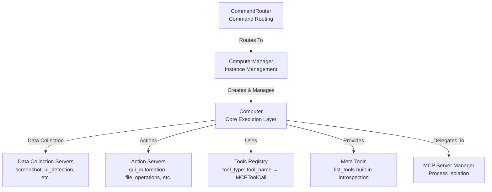

# Computer

The **Computer** class is the core execution layer of the UFO client. It manages MCP (Model Context Protocol) tool execution, maintains tool registries, and provides thread-isolated execution for reliability. Each Computer instance represents a distinct execution context with its own namespace and resource management.

## Architecture Overview

The Computer layer provides the execution engine for MCP tools with three main components:



**Computer** manages MCP tool execution with thread isolation and timeout control (6000-second timeout, 10-worker thread pool).  
**ComputerManager** handles multiple Computer instances with namespace-based routing.  
**CommandRouter** routes and executes commands across Computer instances with early-exit support.

### Key Responsibilities

- **Tool Registration**: Register tools from multiple MCP servers with namespace isolation
- **Command Routing**: Convert high-level commands to MCP tool calls
- **Execution Management**: Execute tools in isolated thread pools with timeout protection
- **Meta Tools**: Provide introspection capabilities (e.g., `list_tools`)

## Table of Contents

## Core Components

### 1. Computer Class

The `Computer` class manages a single logical computer with its own set of MCP servers and tools.

#### Key Attributes

| Attribute | Type | Description |
|-----------|------|-------------|
| `_name` | `str` | Unique identifier for the computer instance |
| `_process_name` | `str` | Associated process name for MCP server isolation |
| `_data_collection_servers` | `Dict[str, BaseMCPServer]` | Servers for data collection (screenshot, UI detection, etc.) |
| `_action_servers` | `Dict[str, BaseMCPServer]` | Servers for actions (GUI automation, file operations, etc.) |
| `_tools_registry` | `Dict[str, MCPToolCall]` | Registry of all available tools (key: `tool_type::tool_name`) |
| `_meta_tools` | `Dict[str, Callable]` | Built-in introspection tools |
| `_executor` | `ThreadPoolExecutor` | Thread pool for isolated tool execution (10 workers) |
| `_tool_timeout` | `int` | Tool execution timeout (6000 seconds = 100 minutes) |

#### Tool Namespaces

Computer supports two types of tool namespaces:

- **`data_collection`**: Tools for gathering information (non-destructive operations)
- **`action`**: Tools for performing actions (state-changing operations)

```python
# Tool key format: "tool_type::tool_name"
"data_collection::screenshot"      # Take screenshot
"data_collection::ui_detection"    # Detect UI elements
"action::click"                    # Click UI element
"action::type_text"                # Type text
```

> **Note:** Different namespaces allow the same tool name to exist in both data collection and action contexts. For example, both `data_collection::get_file_info` and `action::get_file_info` can coexist.

### 2. ComputerManager Class

The `ComputerManager` creates and manages multiple `Computer` instances based on agent configurations.

#### Computer Instance Key

Each computer instance is identified by a unique key:

```python
key = f"{agent_name}::{process_name}::{root_name}"
```

**Example:**
```python
"host_agent::chrome::default"        # Default chrome computer for host_agent
"host_agent::vscode::custom_config"  # Custom VSCode computer for host_agent
```

#### Configuration Structure

```yaml
mcp:
  host_agent:
    default:
      data_collection:
        - namespace: "screenshot"
          server_type: "local"
          module: "ufo.client.mcp.local_servers.screenshot"
          reset: false
        - namespace: "ui_detection"
          server_type: "local"
          module: "ufo.client.mcp.local_servers.ui_detection"
          reset: false
      action:
        - namespace: "gui_automation"
          server_type: "local"
          module: "ufo.client.mcp.local_servers.gui_automation"
          reset: false
```

**Configuration Requirements**

- Each agent must have at least a `default` root configuration
- If `root_name` is not found, the manager falls back to `default`
- Missing configurations will raise a `ValueError`

### 3. CommandRouter Class

The `CommandRouter` executes commands on the appropriate `Computer` instance by routing through the `ComputerManager`.

#### Execution Flow


## Initialization

### Computer Initialization

```python
from ufo.client.computer import Computer
from ufo.client.mcp.mcp_server_manager import MCPServerManager

# Create MCP server manager
mcp_manager = MCPServerManager()

# Initialize computer
computer = Computer(
    name="my_computer",
    process_name="my_process",
    mcp_server_manager=mcp_manager,
    data_collection_servers_config=[
        {
            "namespace": "screenshot",
            "server_type": "local",
            "module": "ufo.client.mcp.local_servers.screenshot"
        }
    ],
    action_servers_config=[
        {
            "namespace": "gui_automation",
            "server_type": "local",
            "module": "ufo.client.mcp.local_servers.gui_automation"
        }
    ]
)

# Async initialization (required)
await computer.async_init()
```

> **⚠️ Important:** You **must** call `await computer.async_init()` after creating a `Computer` instance. This registers all MCP servers and their tools asynchronously.

### ComputerManager Initialization

```python
from ufo.client.computer import ComputerManager

# Load configuration
with open("config.yaml") as f:
    configs = yaml.safe_load(f)

# Create manager
manager = ComputerManager(
    configs=configs,
    mcp_server_manager=mcp_manager
)

# Get or create computer instance
computer = await manager.get_or_create(
    agent_name="host_agent",
    process_name="chrome",
    root_name="default"
)
```

## Tool Execution

### Basic Tool Execution

```python
from aip.messages import MCPToolCall

# Create tool call
tool_call = MCPToolCall(
    tool_key="data_collection::screenshot",
    tool_name="screenshot",
    parameters={"region": "full_screen"}
)

# Execute tool
results = await computer.run_actions([tool_call])

# Check result
if results[0].is_error:
    print(f"Error: {results[0].content}")
else:
    print(f"Success: {results[0].data}")
```

### Command to Tool Conversion

The `command2tool()` method converts high-level `Command` objects to `MCPToolCall` objects:

```python
from aip.messages import Command

# Create command
command = Command(
    tool_name="screenshot",
    tool_type="data_collection",
    parameters={"region": "active_window"}
)

# Convert to tool call
tool_call = computer.command2tool(command)

# Execute
results = await computer.run_actions([tool_call])
```

If `tool_type` is not specified in the command, the `command2tool()` method will automatically detect whether the tool is registered as `data_collection` or `action`.

### Batch Tool Execution

```python
# Execute multiple tools sequentially
tool_calls = [
    MCPToolCall(tool_key="data_collection::screenshot", tool_name="screenshot"),
    MCPToolCall(tool_key="data_collection::ui_detection", tool_name="detect_ui"),
    MCPToolCall(tool_key="action::click", tool_name="click", parameters={"x": 100, "y": 200})
]

results = await computer.run_actions(tool_calls)

for i, result in enumerate(results):
    print(f"Tool {i}: {'Success' if not result.is_error else 'Failed'}")
```

## Thread Isolation & Timeout

### Why Thread Isolation?

MCP tools may contain **blocking operations** (e.g., `time.sleep()`, synchronous I/O) that can block the event loop and cause WebSocket disconnections. To prevent this:

1. Each tool call runs in a **separate thread** with its own event loop
2. The thread pool has **10 concurrent workers**
3. Each tool call has a **timeout of 6000 seconds** (100 minutes)

### Implementation Details

```python
def _call_tool_in_thread():
    """Execute MCP tool call in isolated thread with its own event loop."""
    loop = asyncio.new_event_loop()
    asyncio.set_event_loop(loop)
    try:
        async def _do_call():
            async with Client(server) as client:
                return await client.call_tool(
                    name=tool_name,
                    arguments=params,
                    raise_on_error=False
                )
        return loop.run_until_complete(_do_call())
    finally:
        loop.close()

# Execute in thread pool with timeout
result = await asyncio.wait_for(
    loop.run_in_executor(self._executor, _call_tool_in_thread),
    timeout=self._tool_timeout
)
```

If a tool execution exceeds 6000 seconds, it will be cancelled and return a timeout error:

```python
CallToolResult(
    is_error=True,
    content=[TextContent(text="Tool execution timed out after 6000s")]
)
```

## Meta Tools

Meta tools are **built-in introspection tools** that provide information about the computer's capabilities.

### Registering Meta Tools

Use the `@Computer.meta_tool()` decorator to register a method as a meta tool:

```python
class Computer:
    @meta_tool("list_tools")
    async def list_tools(
        self,
        tool_type: Optional[str] = None,
        namespace: Optional[str] = None,
        remove_meta: bool = True
    ) -> CallToolResult:
        """List all available tools."""
        # Implementation...
```

### Using Meta Tools

```python
# List all action tools
tool_call = MCPToolCall(
    tool_key="action::list_tools",
    tool_name="list_tools",
    parameters={"tool_type": "action"}
)

result = await computer.run_actions([tool_call])
tools = result[0].data  # List of available action tools
```

**Example:**

```python
# List all tools in "screenshot" namespace
result = await computer.run_actions([
    MCPToolCall(
        tool_key="data_collection::list_tools",
        tool_name="list_tools",
        parameters={"namespace": "screenshot", "remove_meta": True}
    )
])

# Returns: [{"tool_name": "take_screenshot", "description": "...", ...}]
```

## Dynamic Server Management

### Adding a Server

```python
from ufo.client.mcp.mcp_server_manager import BaseMCPServer

# Create new MCP server
new_server = mcp_manager.create_or_get_server(
    mcp_config={
        "namespace": "custom_tools",
        "server_type": "local",
        "module": "my_custom_mcp_server"
    },
    reset=False,
    process_name="my_process"
)

# Add to computer
await computer.add_server(
    namespace="custom_tools",
    mcp_server=new_server,
    tool_type="action"
)
```

### Removing a Server

```python
# Remove server and all its tools
await computer.delete_server(
    namespace="custom_tools",
    tool_type="action"
)
```

**Use cases for dynamic server management:**

- Add specialized tools for specific tasks
- Remove servers to reduce memory footprint
- Hot-reload MCP servers during development

## Command Routing

The `CommandRouter` orchestrates command execution across multiple computers.

### Basic Usage

```python
from ufo.client.computer import CommandRouter
from aip.messages import Command, Result

# Create router
router = CommandRouter(computer_manager=manager)

# Execute commands
commands = [
    Command(tool_name="screenshot", tool_type="data_collection"),
    Command(tool_name="click", tool_type="action", parameters={"x": 100, "y": 200})
]

results = await router.execute(
    agent_name="host_agent",
    process_name="chrome",
    root_name="default",
    commands=commands,
    early_exit=True  # Stop on first error
)

for result in results:
    print(f"Status: {result.status}")
    print(f"Data: {result.data}")
```

### Error Handling

```python
# early_exit=True: Stop on first error
results = await router.execute(
    agent_name="host_agent",
    process_name="chrome",
    root_name="default",
    commands=commands,
    early_exit=True
)

# early_exit=False: Execute all commands even if some fail
results = await router.execute(
    agent_name="host_agent",
    process_name="chrome",
    root_name="default",
    commands=commands,
    early_exit=False
)
```

> **⚠️ Warning:** When `early_exit=True`, if a command fails, subsequent commands will **not** be executed, and their results will be set to `ResultStatus.SKIPPED`.

## Tool Registry

The tools registry maintains a mapping of all available tools.

### Tool Key Format

```python
tool_key = f"{tool_type}::{tool_name}"

# Examples:
"data_collection::screenshot"
"action::click"
"data_collection::list_tools"  # Meta tool
```

### Accessing Tools

```python
# Get tool info
tool_info = computer._tools_registry.get("action::click")

# Tool info contains:
print(tool_info.tool_name)      # "click"
print(tool_info.tool_type)      # "action"
print(tool_info.namespace)      # e.g., "gui_automation"
print(tool_info.description)    # Tool description
print(tool_info.input_schema)   # JSON schema for input parameters
print(tool_info.mcp_server)     # Reference to MCP server
```

## Best Practices

### Configuration

1. **Use namespaces wisely**: Group related tools under meaningful namespaces
2. **Separate concerns**: Use `data_collection` for read-only operations, `action` for state changes
3. **Configure timeouts**: Adjust `_tool_timeout` for long-running operations
4. **Use default root**: Always provide a `default` root configuration as fallback

### Performance Optimization

1. **Register servers in parallel**: The `async_init()` method already does this via `asyncio.gather()`
2. **Reuse Computer instances**: Let `ComputerManager` cache instances rather than creating new ones
3. **Limit concurrent tools**: The thread pool has 10 workers; excessive parallel tools may queue
4. **Reset servers carefully**: Setting `reset=True` in server config will restart the MCP server process

### Common Pitfalls

> **⚠️ Important:** Avoid these common mistakes:
> - **Forgetting `async_init()`**: Always call after creating a `Computer` instance
> - **Tool key collisions**: Ensure tool names are unique within each `tool_type`
> - **Timeout too short**: Some operations (e.g., file downloads) may need longer timeouts
> - **Blocking in meta tools**: Meta tools should be fast; avoid I/O operations

## Error Handling

### Tool Execution Errors

```python
try:
    results = await computer.run_actions([tool_call])
    if results[0].is_error:
        error_message = results[0].content[0].text
        print(f"Tool error: {error_message}")
except ValueError as e:
    print(f"Tool not registered: {e}")
except asyncio.TimeoutError:
    print("Tool execution timed out")
except Exception as e:
    print(f"Unexpected error: {e}")
```

### Configuration Errors

```python
try:
    computer = await manager.get_or_create(
        agent_name="host_agent",
        process_name="chrome",
        root_name="invalid_root"
    )
except ValueError as e:
    print(f"Configuration error: {e}")
    # Fallback to default
    computer = await manager.get_or_create(
        agent_name="host_agent",
        process_name="chrome",
        root_name="default"
    )
```

## Integration Points

### With UFO Client

The `Computer` is created and managed by the `UFOClient`:

```python
# In UFOClient
self.command_router = CommandRouter(computer_manager)

# Execute commands from server
results = await self.command_router.execute(
    agent_name=self.agent_name,
    process_name=self.process_name,
    root_name=self.root_name,
    commands=command_list
)
```

### With MCP Server Manager

The `Computer` relies on `MCPServerManager` for server lifecycle management:

```python
# Create or get existing MCP server
mcp_server = self.mcp_server_manager.create_or_get_server(
    mcp_config=server_config,
    reset=False,
    process_name=self._process_name
)
```

See [MCP Integration](mcp_integration.md) for more details on MCP server management.

## Related Documentation

- [UFO Client Overview](overview.md) - High-level client architecture
- [UFO Client](ufo_client.md) - Command execution orchestration
- [Computer Manager](computer_manager.md) - Multi-computer instance management
- [MCP Integration](mcp_integration.md) - MCP server details
- [AIP Messages](../aip/messages.md) - Command and Result message formats
