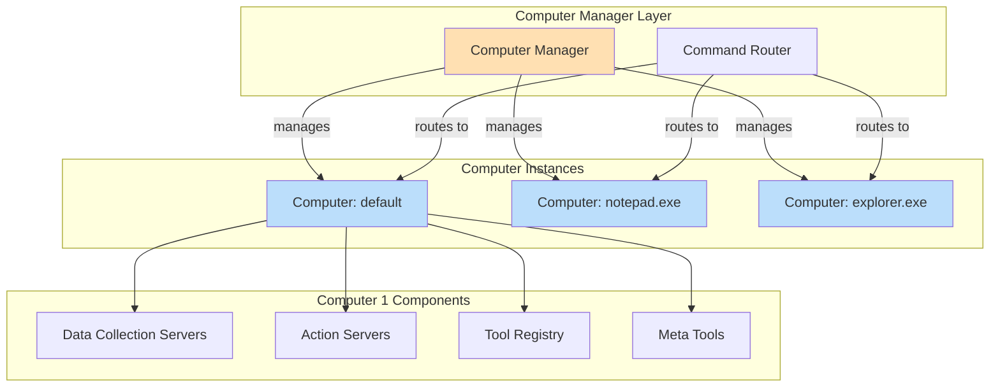
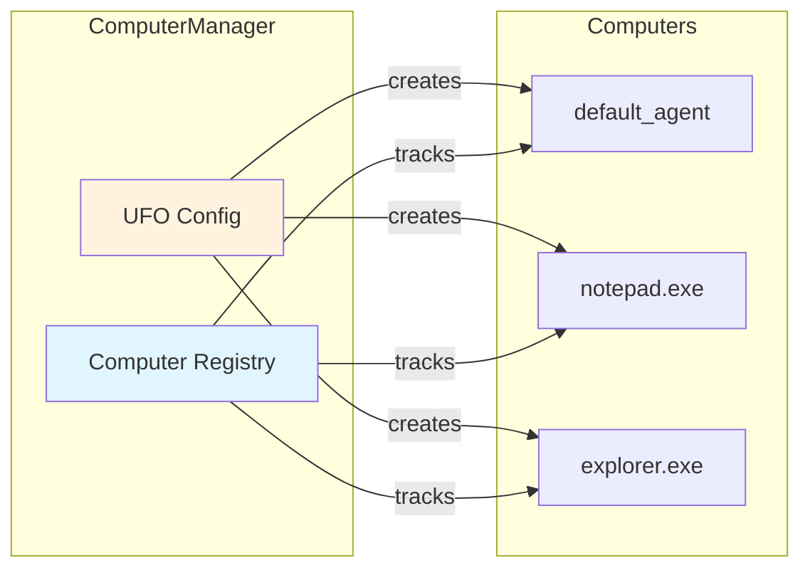
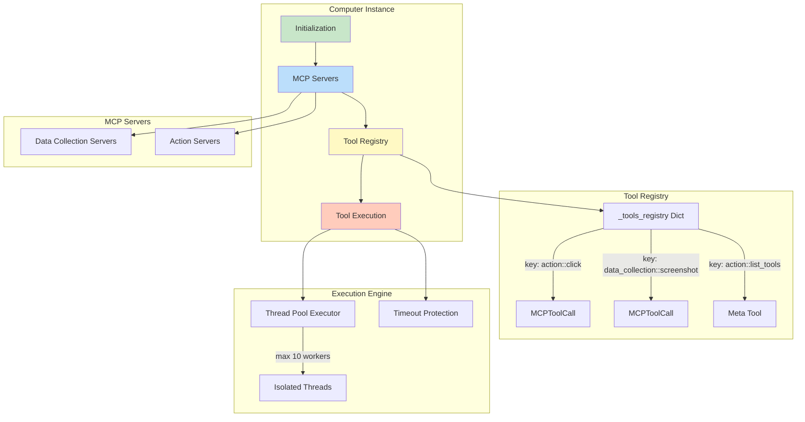
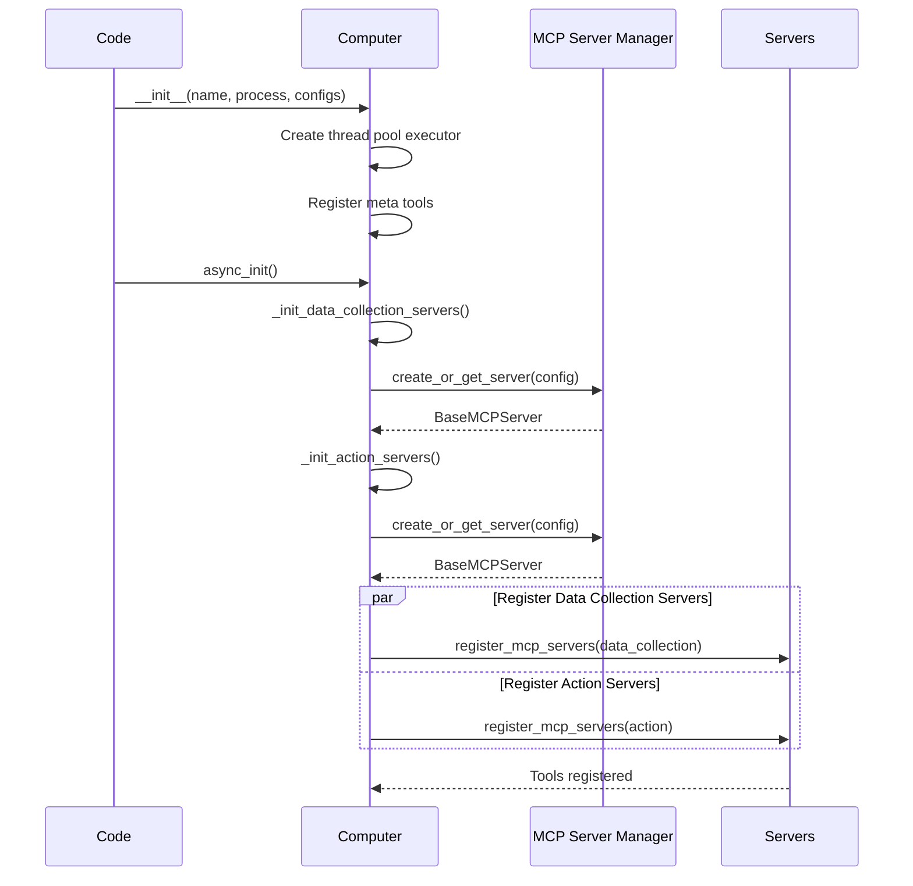

# Computer Manager & Computer

The **Computer Manager** orchestrates multiple **Computer** instances, each representing an isolated execution namespace with dedicated MCP servers and tools. This enables context-specific tool routing and fine-grained control over data collection vs. action execution.

---

## Overview

The Computer layer consists of two components working together:

- **ComputerManager**: High-level orchestrator managing multiple Computer instances
- **Computer**: Individual execution namespace with its own MCP servers and tool registry

### Computer Manager Responsibilities

| Capability | Description | Implementation |
|------------|-------------|----------------|
| **Multi-Computer Management** | Create and manage multiple Computer instances | Per-process, per-agent namespaces |
| **Namespace Isolation** | Separate tool namespaces for different contexts | Independent MCP servers per Computer |
| **Command Routing** | Route commands to appropriate Computer instances | CommandRouter resolves by agent/process/root |
| **MCP Server Configuration** | Configure data collection and action servers | Config-driven server initialization |
| **Lifecycle Management** | Initialize, reset, and tear down Computers | Async initialization, cascading reset |

### Computer (Instance) Responsibilities

| Capability | Description | Implementation |
|------------|-------------|----------------|
| **Tool Registry** | Maintain registry of available MCP tools | `_tools_registry` dict |
| **Tool Execution** | Execute MCP tool calls with timeout protection | Thread pool isolation (max 10 workers) |
| **Server Management** | Manage data collection and action MCP servers | Separate namespaces |
| **Meta Tools** | Provide built-in tools (list_tools, etc.) | Decorated meta tool methods |
| **Async Initialization** | Initialize MCP servers asynchronously | `async_init()` |

**Architectural Relationship:**



---

## 🏗�?Computer Manager Architecture

### Computer Instance Management



**Computer Namespaces:**

| Namespace Type | Purpose | Example |
|----------------|---------|---------|
| **Data Collection** | Gathering information, non-invasive queries | Screenshots, UI element detection, app state |
| **Action** | Performing actions, invasive operations | GUI automation, file operations, app control |

Data collection tools are designed for non-invasive information gathering, while action tools have full control for state-changing operations.

---

## Computer Manager Architecture

## 🖥�?Computer (Instance) Architecture

### Internal Structure



**Key Attributes:**

| Attribute | Type | Purpose |
|-----------|------|---------|
| `_name` | `str` | Computer name (identifier) |
| `_process_name` | `str` | Associated process (e.g., "notepad.exe") |
| `_data_collection_servers` | `Dict[str, BaseMCPServer]` | Namespace �?MCP server mapping (data collection) |
| `_action_servers` | `Dict[str, BaseMCPServer]` | Namespace �?MCP server mapping (actions) |
| `_tools_registry` | `Dict[str, MCPToolCall]` | Tool key �?tool info mapping |
| `_meta_tools` | `Dict[str, Callable]` | Built-in meta tools |
| `_executor` | `ThreadPoolExecutor` | Thread pool for tool execution (10 workers) |
| `_tool_timeout` | `int` | Tool execution timeout: **6000 seconds (100 minutes)** |

> **Note:** The tool execution timeout is 6000 seconds (100 minutes), allowing for very long-running operations while preventing indefinite hangs.

---

## Initialization

### Computer Manager Initialization

**Creating Computer Manager:**

```python
from ufo.client.computer import ComputerManager
from ufo.client.mcp.mcp_server_manager import MCPServerManager
from config.config_loader import get_ufo_config

# 1. Get UFO configuration
ufo_config = get_ufo_config()

# 2. Initialize MCP server manager
mcp_server_manager = MCPServerManager()

# 3. Create computer manager
computer_manager = ComputerManager(
    ufo_config.to_dict(),
    mcp_server_manager
)
```

### Computer Instance Initialization

**Computer Async Initialization:**

```python
computer = Computer(
    name="default_agent",
    process_name="explorer.exe",
    mcp_server_manager=mcp_server_manager,
    data_collection_servers_config=[...],
    action_servers_config=[...]
)

# Async initialization (required)
await computer.async_init()
```

**Initialization Flow:**



**Configuration Example:**

```yaml
data_collection_servers:
  - namespace: screenshot_collector
    type: local
    module: ufo.client.mcp.local_servers.screenshot_server
    reset: false
  - namespace: ui_collector
    type: local
    module: ufo.client.mcp.local_servers.ui_server
    reset: false

action_servers:
  - namespace: gui_automator
    type: local
    module: ufo.client.mcp.local_servers.automation_server
    reset: false
```

---

## 🔀 Command Routing

### CommandRouter

The CommandRouter resolves which Computer instance should handle each command based on agent/process/root context.

**Routing Signature:**

```python
async def execute(
    self,
    agent_name: str,
    process_name: str,
    root_name: str,
    commands: List[Command]
) -> List[Result]
```

**Routing Logic:**

```mermaid
graph TD
    Start[Command List]
    Start --> Resolve[Resolve Computer Instance]
    Resolve -->|agent_name, process_name, root_name| Computer[Get/Create Computer]
    
    Computer --> Loop[For Each Command]
    Loop --> Parse[Parse Command to MCPToolCall]
    Parse --> Lookup[Lookup Tool in Registry]
    
    Lookup -->|Found| Execute[Execute Tool]
    Lookup -->|Not Found| Error[Return Error Result]
    
    Execute --> Timeout[Tool Execution with Timeout]
    Timeout -->|Success| Result[Return Result]
    Timeout -->|Timeout| TimeoutError[Timeout Error Result]
    Timeout -->|Exception| ExecError[Execution Error Result]
    
    Result --> Collect[Collect Results]
    Error --> Collect
    TimeoutError --> Collect
    ExecError --> Collect
    
    Collect --> Return[Return List[Result]]
    
    style Start fill:#e1f5fe
    style Computer fill:#bbdefb
    style Execute fill:#c8e6c9
    style Collect fill:#fff9c4
```

---

## 🔧 Tool Execution

### Tool Execution Pipeline

MCP tools are executed in isolated threads to prevent blocking operations (like `time.sleep`) from blocking the main event loop and causing WebSocket disconnections.

**Execution Flow:**

```mermaid
sequenceDiagram
    participant Computer
    participant TP as Thread Pool
    participant Thread
    participant Loop as New Event Loop
    participant MCP as MCP Server
    
    Computer->>Computer: _run_action(tool_call)
    Computer->>Computer: Lookup tool in registry
    
    alt Meta Tool
        Computer->>Computer: Execute meta tool directly
        Computer-->>Computer: Result
    else MCP Tool
        Computer->>TP: Submit _call_tool_in_thread()
        TP->>Thread: Execute in thread
        Thread->>Loop: Create new event loop
        Loop->>MCP: client.call_tool(name, params)
        
        alt Success (within timeout)
            MCP-->>Loop: Result
            Loop-->>Thread: Result
            Thread-->>TP: Result
            TP-->>Computer: CallToolResult
        else Timeout (> 6000s)
            Note over Computer,MCP: Tool execution timeout
            Computer-->>Computer: TimeoutError Result
        else Exception
            Note over Computer,MCP: Tool execution failed
            Computer-->>Computer: Error Result
        end
    end
```

**Thread Pool Configuration:**

| Parameter | Value | Purpose |
|-----------|-------|---------|
| `max_workers` | **10** | Maximum concurrent tool executions |
| `thread_name_prefix` | `"mcp_tool_"` | Thread naming for debugging |
| Timeout | **6000 seconds (100 minutes)** | Per-tool execution timeout |

**Code Implementation:**

```python
def _call_tool_in_thread():
    """
    Execute MCP tool call in an isolated thread with its own event loop.
    This prevents blocking operations in MCP tools from blocking the main event loop.
    """
    # Create a new event loop for this thread
    loop = asyncio.new_event_loop()
    asyncio.set_event_loop(loop)
    try:
        async def _do_call():
            async with Client(server) as client:
                return await client.call_tool(
                    name=tool_name, arguments=params, raise_on_error=False
                )
        return loop.run_until_complete(_do_call())
    finally:
        loop.close()

# Execute in thread pool with timeout protection
result = await asyncio.wait_for(
    loop.run_in_executor(self._executor, _call_tool_in_thread),
    timeout=self._tool_timeout
)
```

---

## 🛠�?Tool Registry

### Tool Registration

Tools are discovered from MCP servers during initialization and registered with unique keys.

**Tool Key Format:**

```
<tool_type>::<tool_name>

Examples:
- action::click
- action::type_text
- data_collection::screenshot
- data_collection::get_ui_elements
```

**Registration Process:**

```python
async def register_one_mcp_server(
    self, namespace: str, tool_type: str, mcp_server: BaseMCPServer
) -> None:
    async with Client(mcp_server.server) as client:
        tools = await client.list_tools()
        
        for tool in tools:
            tool_key = self.make_tool_key(tool_type, tool.name)
            
            self._register_tool(
                tool_key=tool_key,
                tool_name=tool.name,
                title=tool.title,
                namespace=namespace,
                tool_type=tool_type,
                description=tool.description,
                input_schema=tool.inputSchema,
                output_schema=tool.outputSchema,
                mcp_server=mcp_server
            )
```

**MCPToolCall Structure:**

| Field | Type | Description |
|-------|------|-------------|
| `tool_key` | `str` | Unique key (e.g., "action::click") |
| `tool_name` | `str` | Tool name (e.g., "click") |
| `title` | `str` | Display title |
| `namespace` | `str` | Server namespace |
| `tool_type` | `str` | "action" or "data_collection" |
| `description` | `str` | Tool description |
| `input_schema` | `Dict` | Input parameters schema |
| `output_schema` | `Dict` | Output schema |
| `mcp_server` | `BaseMCPServer` | Reference to server |

---

## Meta Tools

Meta tools are built-in methods decorated with `@meta_tool` that provide computer-level operations.

**Example: list_tools Meta Tool**

```python
@Computer.meta_tool("list_tools")
async def list_tools(
    self,
    tool_type: Optional[str] = None,
    namespace: Optional[str] = None,
    remove_meta: bool = True
) -> CallToolResult:
    """
    Get available tools of a specific type.
    """
    tools = []
    
    for tool in self._tools_registry.values():
        if ((tool_type is None or tool.tool_type == tool_type)
            and (namespace is None or tool.namespace == namespace)
            and (not remove_meta or tool.tool_name not in self._meta_tools)):
            tools.append(tool.tool_info.model_dump())
    
    return CallToolResult(
        content=[TextContent(type="text", text=json.dumps(tools))]
    )
```

**Meta Tool Registration:**

```python
# In __init__:
for attr in dir(self):
    method = getattr(self, attr)
    if callable(method) and hasattr(method, "_meta_tool_name"):
        name = getattr(method, "_meta_tool_name")
        self._meta_tools[name] = method
```

---

## 🔄 Lifecycle Management

### Reset

```python
# Computer Manager reset (cascades to all computers)
computer_manager.reset()

# Computer instance reset
computer.reset()
```

**Reset Operations:**

| Component | Reset Action |
|-----------|--------------|
| Computer Manager | Reset all Computer instances |
| Computer | Clear tool registry, reset MCP servers |
| MCP Servers | Reset server state |

---

## Best Practices

### Monitor Tool Execution Times

```python
import time
start = time.time()
result = await computer._run_action(tool_call)
duration = time.time() - start
if duration > 300:  # 5 minutes
    logger.warning(f"Slow tool: {tool_call.tool_name} took {duration}s")
```

### Handle Timeouts Gracefully

```python
# 100-minute timeout is generous but not infinite
# Design tools to complete within reasonable time
```

### Use Namespace Isolation

```python
# Separate data collection from actions
data_tools = await computer.list_tools(tool_type="data_collection")
action_tools = await computer.list_tools(tool_type="action")
```

---

## 🚀 Next Steps

👉 [Device Info Provider](./device_info.md) - System profiling  
👉 [MCP Integration](./mcp_integration.md) - MCP server details  
👉 [UFO Client](./ufo_client.md) - Execution orchestration  
👉 [Quick Start](./quick_start.md) - Get started with client  
👉 [Configuration](../configuration/system/overview.md) - UFO configuration
