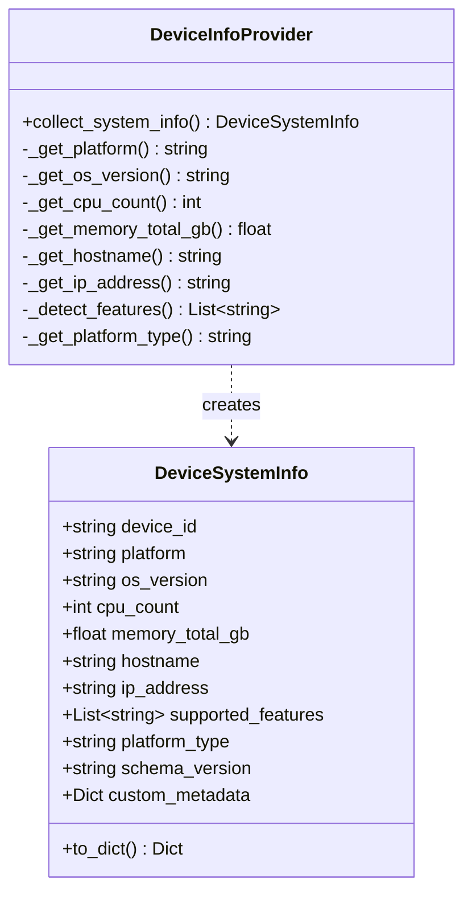
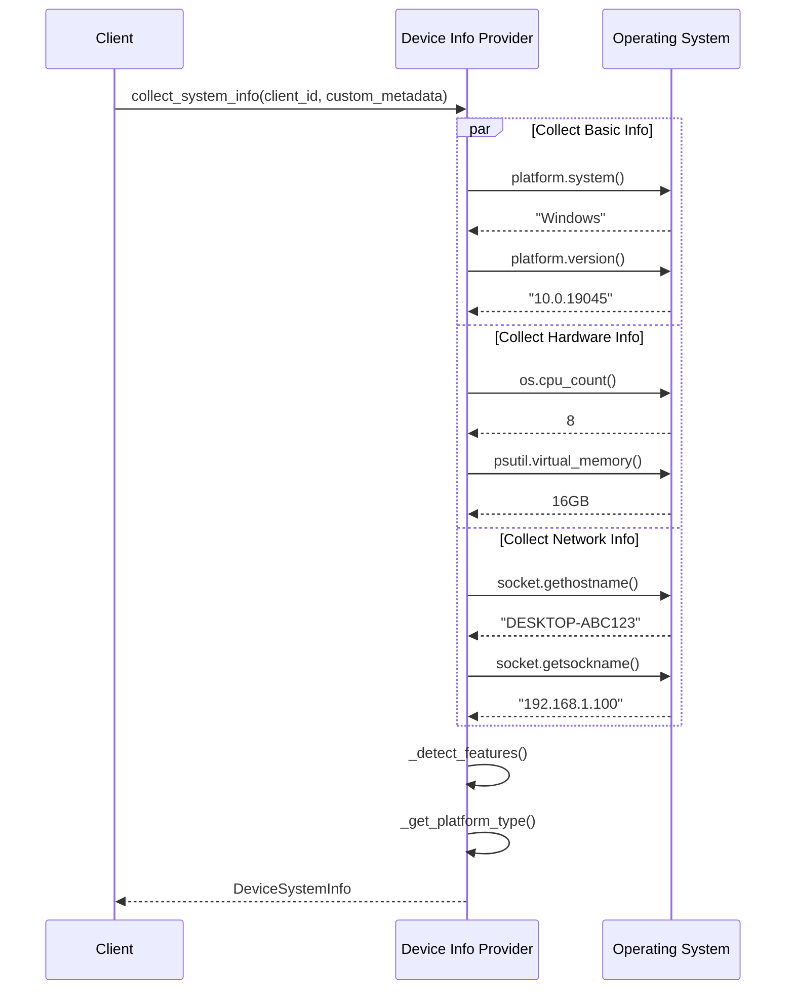

# 📱 Device Info Provider

The **Device Info Provider** collects comprehensive system information from client devices during registration, enabling intelligent task assignment and device selection in constellation (multi-device) scenarios.

Device information is proactively collected during client registration and pushed to the server, reducing latency and enabling immediate task routing decisions.

---

## 📋 Overview

**Core Capabilities:**

| Capability | Description | Use Case |
|------------|-------------|----------|
| **System Detection** | Auto-detect OS, version, architecture | Platform-specific task routing |
| **Hardware Profiling** | CPU count, memory capacity | Resource-aware task assignment |
| **Network Discovery** | Hostname, IP address | Network topology mapping |
| **Feature Detection** | GUI, CLI, browser, office apps | Capability-based device selection |
| **Extensibility** | Custom metadata support | Environment-specific configuration |

**Supported Platforms:**

| Platform | Status | Features Detected |
|----------|--------|-------------------|
| **Windows** | ✅ Full Support | GUI, CLI, browser, file system, office, Windows apps |
| **Linux** | ✅ Full Support | GUI, CLI, browser, file system, office, Linux apps |
| **macOS** | ✅ Full Support | GUI, CLI, browser, file system, office |
| **Mobile** | 🔮 Planned | Touch, mobile apps, sensors |
| **IoT** | 🔮 Planned | Sensors, actuators, limited resources |

---

## 🏗️ Architecture

### DeviceSystemInfo Dataclass

The device info structure captures essential information to minimize registration overhead:



**Field Reference:**

| Field | Type | Description | Example |
|-------|------|-------------|---------|
| `device_id` | `str` | Unique client identifier | `"device_windows_001"` |
| `platform` | `str` | OS platform (lowercase) | `"windows"`, `"linux"`, `"darwin"` |
| `os_version` | `str` | OS version string | `"10.0.19045"` (Windows 10) |
| `cpu_count` | `int` | Number of CPU cores | `8` |
| `memory_total_gb` | `float` | Total RAM in GB (rounded to 2 decimals) | `16.0` |
| `hostname` | `str` | Network hostname | `"DESKTOP-ABC123"` |
| `ip_address` | `str` | Local IP address | `"192.168.1.100"` |
| `supported_features` | `List[str]` | Detected capabilities | `["gui", "cli", "browser", "office"]` |
| `platform_type` | `str` | Device category | `"computer"`, `"mobile"`, `"web"`, `"iot"` |
| `schema_version` | `str` | Schema version for compatibility | `"1.0"` |
| `custom_metadata` | `Dict` | User-defined metadata | `{"environment": "production"}` |

---

## 🔍 Collection Process

### Automatic Collection

```python
from ufo.client.device_info_provider import DeviceInfoProvider

# Collect system information
system_info = DeviceInfoProvider.collect_system_info(
    client_id="device_windows_001",
    custom_metadata=None  # Or load from config
)

# Result: DeviceSystemInfo object
print(system_info.platform)         # "windows"
print(system_info.cpu_count)        # 8
print(system_info.memory_total_gb)  # 16.0
print(system_info.supported_features)  # ["gui", "cli", "browser", ...]

# Convert to dict for transmission
device_dict = system_info.to_dict()
```

**Collection Flow:**



---

## 🎯 Feature Detection

### Platform-Specific Features

Features are automatically detected based on the platform to enable capability-based device selection.

**Windows Features:**

```python
features = [
    "gui",           # Graphical user interface
    "cli",           # Command line interface
    "browser",       # Web browser support
    "file_system",   # File system operations
    "office",        # Office applications (Word, Excel, etc.)
    "windows_apps"   # Windows-specific applications
]
```

**Linux Features:**

```python
features = [
    "gui",           # Graphical user interface (X11/Wayland)
    "cli",           # Bash/shell
    "browser",       # Firefox, Chrome, etc.
    "file_system",   # Linux file system
    "office",        # LibreOffice, etc.
    "linux_apps"     # Linux-specific applications
]
```

**macOS Features:**

```python
features = [
    "gui",           # macOS GUI
    "cli",           # Terminal
    "browser",       # Safari, Chrome, etc.
    "file_system",   # macOS file system
    "office"         # Office for Mac
]
```

**Feature Detection Logic:**

| Platform | Detected Features | Rationale |
|----------|-------------------|-----------|
| `windows`, `linux`, `darwin` | GUI, CLI, browser, file_system, office | Desktop/laptop computers have full capabilities |
| `android`, `ios` (future) | Touch, mobile apps, camera | Mobile-specific features |
| Custom | User-defined | Extensible via custom_metadata |

---

## 💡 Usage Examples

### Basic Collection

```python
from ufo.client.device_info_provider import DeviceInfoProvider

# Collect with auto-detection
info = DeviceInfoProvider.collect_system_info(
    client_id="device_001",
    custom_metadata=None
)

print(f"Platform: {info.platform}")
print(f"CPU Cores: {info.cpu_count}")
print(f"Memory: {info.memory_total_gb} GB")
print(f"Features: {', '.join(info.supported_features)}")
```

### With Custom Metadata

```python
# Add environment-specific metadata
custom_meta = {
    "environment": "production",
    "datacenter": "us-east-1",
    "role": "automation_worker",
    "team": "qa"
}

info = DeviceInfoProvider.collect_system_info(
    client_id="device_prod_001",
    custom_metadata=custom_meta
)

# Custom metadata is preserved
print(info.custom_metadata["environment"])  # "production"
```

### JSON Serialization

```python
# Convert to dictionary for transmission
device_dict = info.to_dict()

# Serialize to JSON
import json
json_str = json.dumps(device_dict, indent=2)

# Example output:
# {
#   "device_id": "device_001",
#   "platform": "windows",
#   "os_version": "10.0.19045",
#   "cpu_count": 8,
#   "memory_total_gb": 16.0,
#   "hostname": "DESKTOP-ABC123",
#   "ip_address": "192.168.1.100",
#   "supported_features": ["gui", "cli", "browser", "file_system", "office", "windows_apps"],
#   "platform_type": "computer",
#   "schema_version": "1.0",
#   "custom_metadata": {}
# }
```

---

## ⚠️ Error Handling

### Graceful Degradation

If any detection method fails, the provider returns minimal info instead of crashing.

**Error Handling Strategy:**

```python
try:
    # Attempt full collection
    return DeviceSystemInfo(...)
except Exception as e:
    logger.error(f"Error collecting system info: {e}", exc_info=True)
    # Return minimal info on error
    return DeviceSystemInfo(
        device_id=client_id,
        platform="unknown",
        os_version="unknown",
        cpu_count=0,
        memory_total_gb=0.0,
        hostname="unknown",
        ip_address="unknown",
        supported_features=[],
        platform_type="unknown",
        custom_metadata=custom_metadata or {}
    )
```

**Individual Method Failures:**

| Method | Failure Behavior | Fallback Value |
|--------|------------------|----------------|
| `_get_platform()` | Catch exception | `"unknown"` |
| `_get_os_version()` | Catch exception | `"unknown"` |
| `_get_cpu_count()` | Catch exception | `0` |
| `_get_memory_total_gb()` | psutil not installed or exception | `0.0` |
| `_get_hostname()` | Catch exception | `"unknown"` |
| `_get_ip_address()` | Primary method fails | Try hostname resolution, then `"unknown"` |

---

## 🔧 Memory Detection Details

### psutil Dependency

!!!warning "Optional Dependency"
    Memory detection requires `psutil`. If not installed, memory will be reported as `0.0`.

**Installation:**

```bash
pip install psutil
```

**Detection Code:**

```python
@staticmethod
def _get_memory_total_gb() -> float:
    """Get total memory in GB"""
    try:
        import psutil
        total_memory = psutil.virtual_memory().total
        return round(total_memory / (1024**3), 2)  # Convert to GB, round to 2 decimals
    except ImportError:
        logger.warning("psutil not installed, memory info unavailable")
        return 0.0
    except Exception:
        return 0.0
```

---

## 🌐 IP Address Detection

### Multi-Method Approach

!!!tip "Robust IP Detection"
    IP detection uses a two-stage approach for reliability.

**Primary Method (Socket Connection):**

```python
# Connect to external address (doesn't actually send data)
s = socket.socket(socket.AF_INET, socket.SOCK_DGRAM)
s.connect(("8.8.8.8", 80))  # Google DNS
ip = s.getsockname()[0]
s.close()
```

**Fallback Method (Hostname Resolution):**

```python
# If primary fails, resolve via hostname
ip = socket.gethostbyname(socket.gethostname())
```

**Final Fallback:**

```python
# If all methods fail
return "unknown"
```

---

## 🚀 Integration Points

### WebSocket Client Registration

The WebSocket client uses the Device Info Provider during registration:

```python
# In websocket client's register_client()
from ufo.client.device_info_provider import DeviceInfoProvider

system_info = DeviceInfoProvider.collect_system_info(
    self.ufo_client.client_id,
    custom_metadata=None
)

metadata = {
    "system_info": system_info.to_dict(),
    "registration_time": datetime.now(timezone.utc).isoformat()
}

await self.registration_protocol.register_as_device(
    device_id=self.ufo_client.client_id,
    metadata=metadata,
    platform=self.ufo_client.platform
)
```

See [WebSocket Client](./websocket_client.md) for complete registration flow details.

### Agent Server

The server receives device info during registration and stores it in the agent profile:

```python
# Server-side AgentProfile integration
device_info = registration_data["metadata"]["system_info"]
agent_profile.add_device(device_id, device_info)
```

See [Server Quick Start](../server/quick_start.md) for server-side processing details.

---

## ✅ Best Practices

**1. Add Custom Metadata for Environment Tracking**

```python
custom_meta = {
    "environment": os.getenv("ENVIRONMENT", "development"),
    "version": "1.0.0",
    "deployment_region": "us-west-2",
    "cost_center": "engineering"
}

system_info = DeviceInfoProvider.collect_system_info(
    client_id="device_001",
    custom_metadata=custom_meta
)
```

**2. Install psutil for Accurate Memory Detection**

```bash
pip install psutil
```

**3. Use Descriptive Client IDs**

```python
# Include environment and location in client_id
client_id = f"device_{platform}_{env}_{location}_{instance_id}"
# Example: "device_windows_prod_us-west_001"
```

**4. Log Collection Results**

```python
system_info = DeviceInfoProvider.collect_system_info(...)

logger.info(
    f"Collected device info: "
    f"platform={system_info.platform}, "
    f"cpu={system_info.cpu_count}, "
    f"memory={system_info.memory_total_gb}GB, "
    f"features={system_info.supported_features}"
)
```

**5. Validate Before Sending**

```python
system_info = DeviceInfoProvider.collect_system_info(...)

# Validate essential fields
assert system_info.device_id, "Device ID required"
assert system_info.platform != "unknown", "Platform detection failed"
assert system_info.cpu_count > 0, "CPU detection failed"
```

---

## 🚀 Next Steps

- [WebSocket Client](./websocket_client.md) - See how device info is used in registration
- [Quick Start](./quick_start.md) - Connect your device to the server
- [MCP Integration](./mcp_integration.md) - Understand client tool capabilities
- [Server Quick Start](../server/quick_start.md) - Learn server-side registration processing
