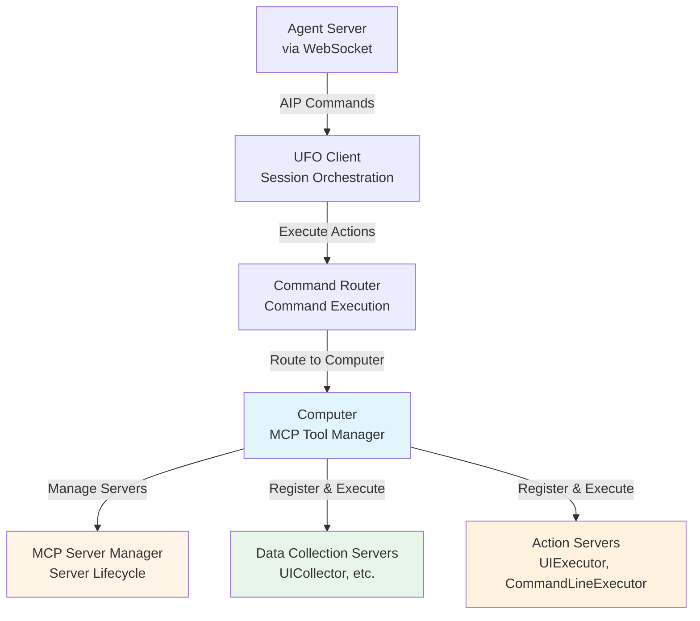
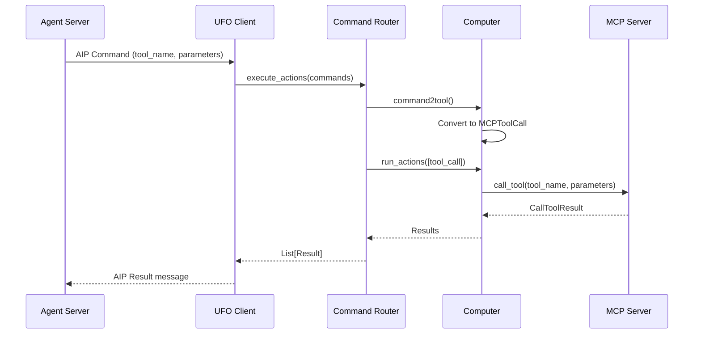

# 🔌 MCP Integration

**MCP (Model Context Protocol)** provides the tool execution layer in UFO clients, enabling agents to collect system state and execute actions through a standardized interface. This page provides a **client-focused overview** of how MCP integrates into the client architecture.

**Related Documentation:**

- [MCP Overview](../mcp/overview.md) - Core MCP concepts and architecture
- [Configuration Guide](../mcp/configuration.md) - Server configuration details
- [Data Collection Servers](../mcp/data_collection.md) - Observation tools
- [Action Servers](../mcp/action.md) - Execution tools
- [Creating MCP Servers](../tutorials/creating_mcp_servers.md) - Build custom tools

---

## 🏗️ MCP in Client Architecture

### Role in the Client Stack



**Key Components:**

| Component | Location | Responsibility |
|-----------|----------|----------------|
| **Computer** | `ufo.client.computer.Computer` | Manages MCP servers, routes tool calls, executes in thread pool |
| **MCP Server Manager** | `ufo.client.mcp.mcp_server_manager.MCPServerManager` | Creates/manages server instances (local/http/stdio) |
| **Command Router** | `ufo.client.computer.CommandRouter` | Routes commands to appropriate Computer instances |
| **Data Collection Servers** | Various MCP servers | Tools for gathering system state (read-only) |
| **Action Servers** | Various MCP servers | Tools for performing state changes |

---

## 🔄 Client-MCP Integration Flow

### End-to-End Execution



**Execution Stages:**

| Stage | Component | Description |
|-------|-----------|-------------|
| **1. Command Reception** | UFO Client | Receives AIP Command from server |
| **2. Command Routing** | Command Router | Routes to appropriate Computer instance |
| **3. Command Conversion** | Computer | AIP Command → MCPToolCall |
| **4. Tool Execution** | Computer | Executes tool via MCP Server |
| **5. Result Return** | UFO Client | Packages result for server |

---

## 💻 Computer: The MCP Manager

### Computer Class Overview

The `Computer` class is the **client-side MCP manager**, handling server registration, tool discovery, and execution.

**Core Responsibilities:**

```python
from ufo.client.computer import Computer
from ufo.client.mcp.mcp_server_manager import MCPServerManager

# Initialize Computer with MCP servers
computer = Computer(
    name="notepad_computer",
    process_name="notepad.exe",
    mcp_server_manager=mcp_manager,
    data_collection_servers_config=[
        {"namespace": "UICollector", "type": "local", "reset": False}
    ],
    action_servers_config=[
        {"namespace": "HostUIExecutor", "type": "local", "reset": False}
    ]
)

# Async initialization registers all tools
await computer.async_init()
```

**Initialization Sequence:**

| Step | Action | Result |
|------|--------|--------|
| 1. Create MCP Server Manager | Initialize server lifecycle manager | Ready to create servers |
| 2. Initialize data_collection servers | Register observation tools | UICollector ready |
| 3. Initialize action servers | Register execution tools | HostUIExecutor, CommandLineExecutor ready |
| 4. Register MCP servers | Query each server for tools | Tool registry populated |

See [Computer](./computer.md) for detailed class documentation.

---

## 🛠️ Two Server Types

### Data Collection vs Action

Understanding the difference between server types is essential for proper MCP usage:

**Comparison:**

| Aspect | Data Collection Servers | Action Servers |
|--------|------------------------|----------------|
| **Purpose** | Observe system state | Modify system state |
| **Examples** | `take_screenshot`, `detect_ui_elements` | `click`, `type_text`, `run_command` |
| **Invocation** | LLM-selected tools | LLM-selected tools |
| **Side Effects** | ❌ None (read-only) | ✅ Yes (state changes) |
| **Namespace** | `"data_collection"` | `"action"` |
| **Tool Key Format** | `data_collection::tool_name` | `action::tool_name` |

**Data Collection Example:**

```python
# Example: Take screenshot for UI analysis
result = await computer.run_actions([
    computer.command2tool(Command(
        tool_name="take_screenshot",
        tool_type="data_collection",
        parameters={"region": "active_window"}
    ))
])
```

**Action Example:**

```python
# Example: Click a button
result = await computer.run_actions([
    computer.command2tool(Command(
        tool_name="click",
        tool_type="action",
        parameters={
            "control_text": "Save",
            "control_type": "Button"
        }
    ))
])
```

See [MCP Overview - Server Types](../mcp/overview.md#1-two-server-types) for detailed comparison.

---

## 📋 Server Configuration

### Configuration File

MCP servers are configured in `config/ufo/mcp.yaml`:

```yaml
HostAgent:
  default:
    data_collection:
      - namespace: UICollector        # Server namespace
        type: local                   # local, http, or stdio
        reset: false                  # Reset on each step?
    
    action:
      - namespace: HostUIExecutor     # Server namespace
        type: local
        reset: false
      
      - namespace: CommandLineExecutor  # Multiple servers allowed
        type: local
        reset: false
```

**Configuration Parameters:**

| Parameter | Type | Description | Example |
|-----------|------|-------------|---------|
| `namespace` | `str` | Server identifier (must match registered name) | `"UICollector"` |
| `type` | `str` | Deployment type: `local`, `http`, `stdio` | `"local"` |
| `reset` | `bool` | Reset server state on each step | `false` |

!!!tip "📖 Full Configuration Guide"
    See [MCP Configuration](../mcp/configuration.md) for advanced configuration including:
    - HTTP server endpoints
    - Stdio server commands
    - Custom server parameters
    - Environment-specific configs

---

## 🔧 Tool Registry & Execution

### Tool Discovery

The Computer automatically discovers and registers tools from all configured MCP servers during initialization:

**Automatic Registration:**

```python
# During computer.async_init()
async def register_mcp_servers(self, servers, tool_type):
    """Register tools from all MCP servers"""
    for namespace, server in servers.items():
        # Connect to MCP server
        async with Client(server.server) as client:
            # List available tools
            tools = await client.list_tools()
            
            # Register each tool with unique key
            for tool in tools:
                tool_key = self.make_tool_key(tool_type, tool.name)
                self._tools_registry[tool_key] = MCPToolCall(
                    tool_key=tool_key,
                    tool_name=tool.name,
                    title=tool.title,
                    namespace=namespace,
                    tool_type=tool_type,
                    description=tool.description,
                    input_schema=tool.inputSchema,
                    output_schema=tool.outputSchema,
                    mcp_server=server
                )
```

**Tool Registry Structure:**

| Field | Type | Description |
|-------|------|-------------|
| `tool_key` | `str` | Unique key: `"tool_type::tool_name"` |
| `tool_name` | `str` | Tool name (e.g., `"take_screenshot"`) |
| `title` | `str` | Display title |
| `namespace` | `str` | Server namespace (e.g., `"UICollector"`) |
| `tool_type` | `str` | `"data_collection"` or `"action"` |
| `description` | `str` | Tool description |
| `input_schema` | `dict` | JSON schema for parameters |
| `output_schema` | `dict` | JSON schema for results |
| `mcp_server` | `BaseMCPServer` | Server instance |

### Tool Execution

Tools execute in isolated threads with timeout protection (default: 6000 seconds = 100 minutes per tool):

```python
# Thread pool configuration
self._executor = concurrent.futures.ThreadPoolExecutor(
    max_workers=10,
    thread_name_prefix="mcp_tool_"
)
self._tool_timeout = 6000  # 100 minutes
```

See [Computer](./computer.md) for execution details.

---

## 🚀 Integration Examples

### Basic Usage

```python
from ufo.client.computer import ComputerManager, CommandRouter
from ufo.client.mcp.mcp_server_manager import MCPServerManager
from aip.messages import Command

# Create MCP server manager
mcp_server_manager = MCPServerManager()

# Create computer manager (manages Computer instances)
computer_manager = ComputerManager(config, mcp_server_manager)

# Create command router
command_router = CommandRouter(computer_manager)

# Execute action through MCP
command = Command(
    tool_name="click",
    tool_type="action",
    parameters={
        "control_text": "Save",
        "control_type": "Button"
    }
)

# Router creates Computer instance and executes
results = await command_router.execute(
    agent_name="HostAgent",
    process_name="notepad.exe",
    root_name="default",
    commands=[command]
)
```

### Custom MCP Server

```python
from fastmcp import FastMCP

# Define custom MCP server
mcp = FastMCP("CustomTools")

@mcp.tool()
async def custom_action(param: str) -> str:
    """Execute custom action"""
    return f"Executed: {param}"

# Register in config/ufo/mcp.yaml:
# action:
#   - namespace: CustomTools
#     type: local
#     reset: false
```

**For step-by-step instructions:**

- [Creating MCP Servers](../tutorials/creating_mcp_servers.md) - Build your own MCP tools

---

## 🔗 Integration Points

### With Other Client Components

**UFO Client:**
- Receives AIP Commands from server
- Delegates to Command Router
- Returns AIP Results

**Command Router:**
- Routes commands to appropriate Computer instance (by agent/process/root name)
- Manages command execution with early-exit support

**Computer:**
- **MCP entry point**: Manages all MCP servers
- Executes tools via MCP Server Manager
- Maintains tool registry

**MCP Server Manager:**
- Creates and manages MCP server instances
- Supports local, HTTP, and stdio deployment types

See [UFO Client](./ufo_client.md) and [Computer](./computer.md) for integration details.

---

## 📚 Related Documentation

### Client Components

| Component | Description | Link |
|-----------|-------------|------|
| **Computer** | Core MCP execution layer | [Computer](./computer.md) |
| **UFO Client** | Session orchestration | [UFO Client](./ufo_client.md) |
| **WebSocket Client** | Server communication | [WebSocket Client](./websocket_client.md) |

### MCP Deep Dive

| Topic | Description | Link |
|-------|-------------|------|
| **MCP Overview** | Architecture, concepts, deployment models | [Overview](../mcp/overview.md) |
| **Data Collection** | Observation tools (UI, screenshots, system) | [Data Collection](../mcp/data_collection.md) |
| **Action Servers** | Execution tools (click, type, run) | [Action](../mcp/action.md) |
| **Configuration** | YAML configuration guide | [Configuration](../mcp/configuration.md) |
| **Local Servers** | Built-in in-process servers | [Local Servers](../mcp/local_servers.md) |
| **Remote Servers** | HTTP/Stdio deployment | [Remote Servers](../mcp/remote_servers.md) |
| **Creating MCP Servers** | Build your own tools | [Creating MCP Servers](../tutorials/creating_mcp_servers.md) |

---

## 🎯 Key Takeaways

**MCP in Client - Summary**

**1. Computer is the MCP Manager**
- Manages all MCP server instances
- Routes tool calls to appropriate servers
- Executes in thread pool for isolation

**2. Two Server Types**
- **Data Collection**: Read-only, observation tools
- **Action**: State-changing, execution tools

**3. Configuration-Driven**
- Servers configured in `config/ufo/mcp.yaml`
- Supports local, HTTP, and stdio deployment

**4. Automatic Registration**
- Tools auto-discovered during initialization
- Tool registry built from server metadata

**5. Detailed Docs Available**
- Full MCP section at [MCP Overview](../mcp/overview.md)
- Custom server guides, examples, troubleshooting

---

## 🚀 Next Steps

- [MCP Overview](../mcp/overview.md) - Understand MCP architecture in depth
- [Computer](./computer.md) - See how MCP servers are managed
- [Creating MCP Servers](../tutorials/creating_mcp_servers.md) - Build your own MCP tools
