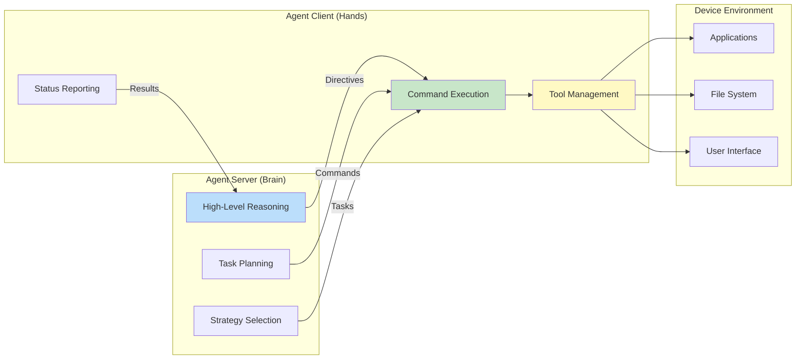
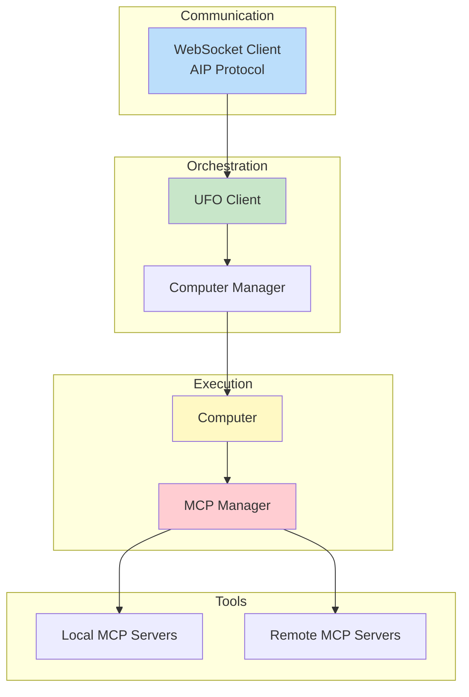
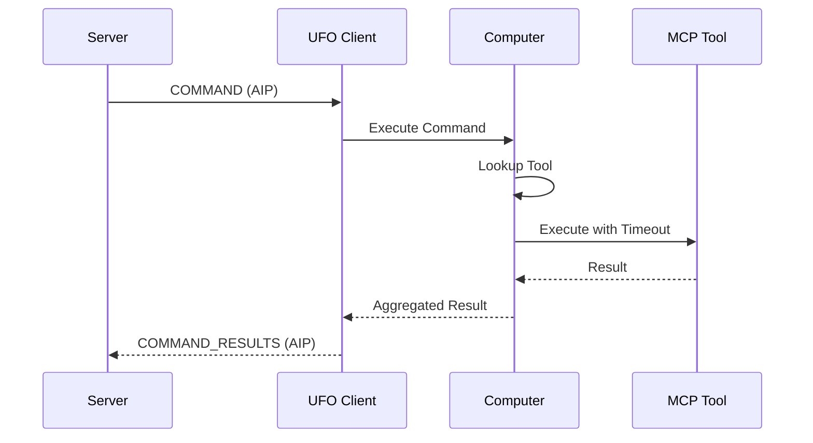
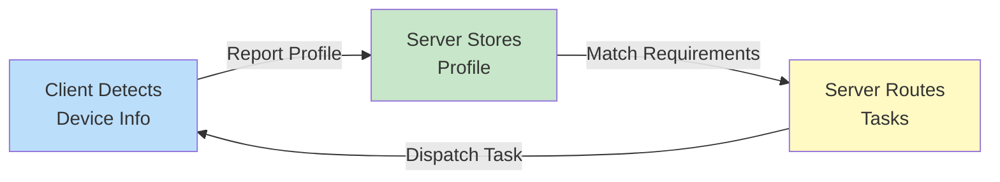
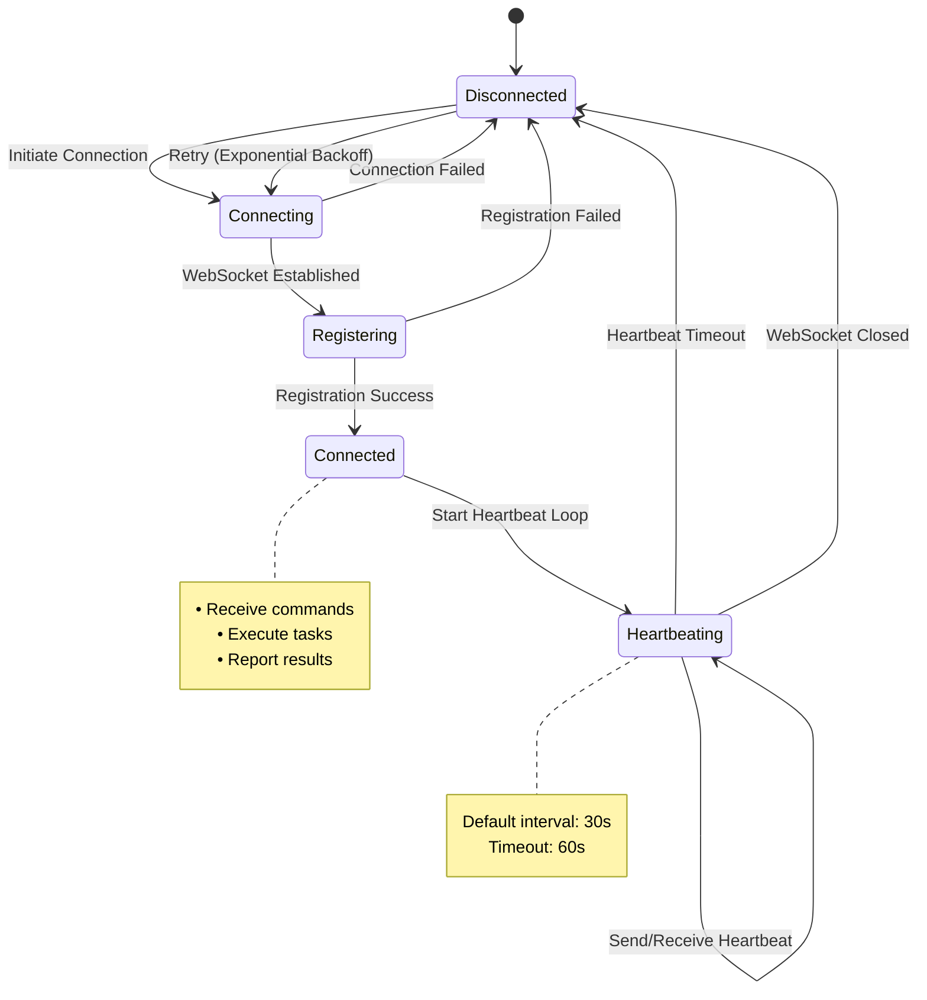
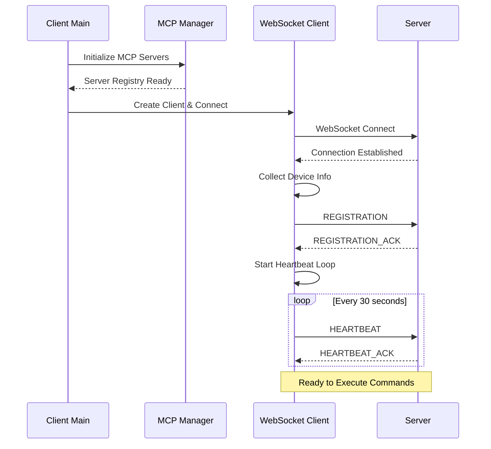
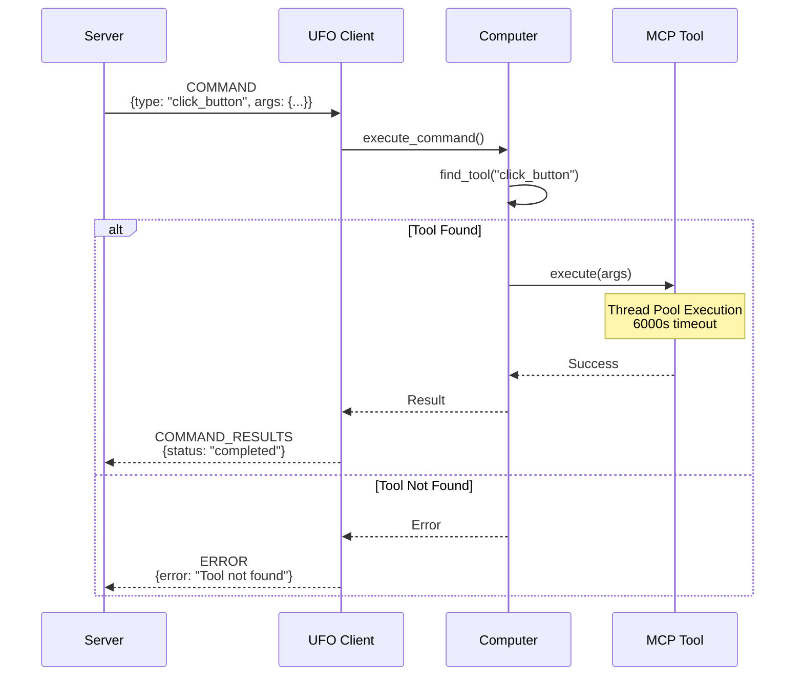
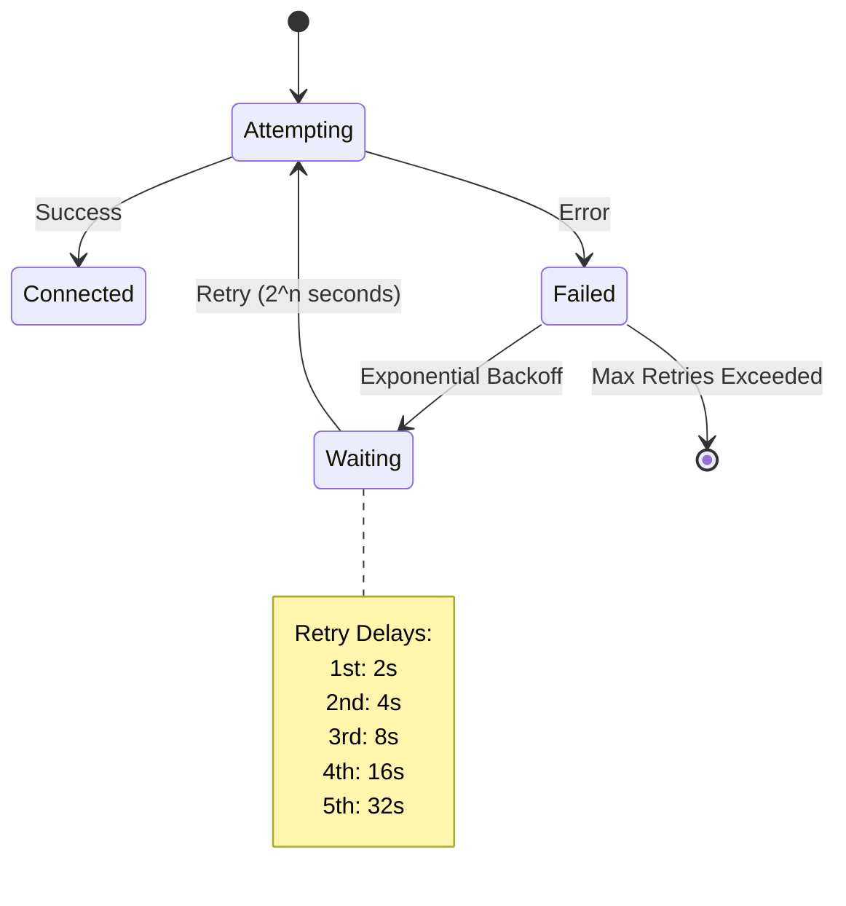
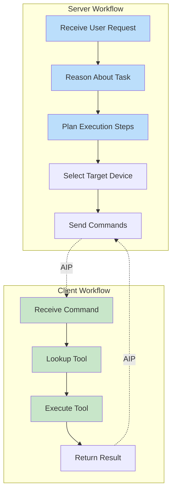

# UFO Client Overview

The **UFO Client** runs on target devices and serves as the **execution layer** of UFO's distributed agent system. It manages MCP (Model Context Protocol) servers, executes commands deterministically, and communicates with the Agent Server through the Agent Interaction Protocol (AIP).

**Quick Start:** Jump to the [Quick Start Guide](./quick_start.md) to connect your device. Make sure the [Agent Server](../server/quick_start.md) is running first.

---

## 🎯 What is the UFO Client?



**The UFO Client is a stateless execution agent that:**

| Capability | Description | Benefit |
|------------|-------------|---------|
| **🔧 Executes Commands** | Translates server directives into concrete actions | Deterministic, reliable execution |
| **🛠️ Manages MCP Servers** | Orchestrates local and remote tool interfaces | Extensible tool ecosystem |
| **📊 Reports Device Info** | Provides hardware and software profile to server | Intelligent task assignment |
| **📡 Communicates via AIP** | Maintains persistent WebSocket connection | Real-time bidirectional communication |
| **🚫 Remains Stateless** | Executes directives without high-level reasoning | Independent updates, simple architecture |

**Stateless Design Philosophy:** The client focuses purely on execution. All reasoning and decision-making happens on the server, allowing independent updates to server logic and client tools, simple client architecture, intelligent orchestration of multiple clients, and resource-efficient operation.

**Architecture:** The UFO Client is part of UFO's distributed **server-client architecture**, where it handles command execution and resource access while the [Agent Server](../server/overview.md) handles orchestration and decision-making. See [Server-Client Architecture](../infrastructure/agents/server_client_architecture.md) for the complete design rationale, communication protocols, and deployment patterns.

---

## 🏗️ Architecture

The client implements a **layered architecture** separating communication, execution, and tool management for maximum flexibility and maintainability.



### Core Components

| Component | Responsibility | Key Features | Documentation |
|-----------|---------------|--------------|---------------|
| **WebSocket Client** | AIP communication | • Connection management<br/>• Registration<br/>• Heartbeat monitoring<br/>• Message routing | [Details →](./websocket_client.md) |
| **UFO Client** | Execution orchestration | • Command execution<br/>• Result aggregation<br/>• Error handling<br/>• Session management | [Details →](./ufo_client.md) |
| **Computer Manager** | Multi-computer abstraction | • Computer instance management<br/>• Namespace routing<br/>• Resource isolation | [Details →](./computer_manager.md) |
| **Computer** | Tool management | • MCP server registration<br/>• Tool registry<br/>• Execution isolation<br/>• Thread pool management | [Details →](./computer.md) |
| **MCP Server Manager** | MCP lifecycle | • Server creation<br/>• Configuration loading<br/>• Connection pooling<br/>• Health monitoring | [MCP Documentation →](../mcp/overview.md) |
| **Device Info Provider** | System profiling | • Hardware detection<br/>• Capability reporting<br/>• Platform identification<br/>• Feature enumeration | [Details →](./device_info.md) |

For detailed component documentation:

- [WebSocket Client](./websocket_client.md) - AIP protocol implementation
- [UFO Client](./ufo_client.md) - Execution orchestration
- [Computer Manager](./computer_manager.md) - Multi-computer management
- [Device Info Provider](./device_info.md) - System profiling
- [MCP Integration](../mcp/overview.md) - MCP server management (comprehensive documentation)

---

## 🚀 Key Capabilities

### 1. Deterministic Command Execution

The client executes commands **exactly as specified** without interpretation or reasoning, ensuring predictable behavior.



**Execution Flow:**

| Step | Action | Purpose |
|------|--------|---------|
| 1️⃣ **Receive** | Get structured command from server via AIP | Ensure well-formed input |
| 2️⃣ **Route** | Dispatch to appropriate computer instance | Support multi-namespace execution |
| 3️⃣ **Lookup** | Find tool in MCP registry | Dynamic tool resolution |
| 4️⃣ **Execute** | Run tool in isolated thread pool | Fault isolation and timeout protection |
| 5️⃣ **Aggregate** | Combine results from multiple tools | Structured response format |
| 6️⃣ **Return** | Send results back to server via AIP | Complete the execution loop |

**Execution Guarantees:**
- **Isolation**: Each tool runs in separate thread pool
- **Timeouts**: Configurable timeout (default: 6000 seconds/100 minutes)
- **Fault Tolerance**: One failed tool doesn't crash entire client
- **Thread Safety**: Concurrent tool execution supported
- **Error Reporting**: Structured errors returned to server

### 2. MCP Server Management

The client manages a collection of **MCP (Model Context Protocol) servers** to provide diverse tool access for automation tasks. The client is responsible for registering, managing, and executing these tools, while the [Agent Server](../server/overview.md) handles command orchestration. See [Server-Client Architecture](../infrastructure/agents/server_client_architecture.md#client-command-execution-and-resource-access) for how MCP integration fits into the overall architecture.

**MCP Server Categories:**

**Data Collection Servers** gather information from the device:
    
| Server Type | Tools Provided | Use Cases |
|-------------|---------------|-----------|
| **System Info** | CPU, memory, disk stats | Resource monitoring |
| **Application State** | Running apps, windows | Context awareness |
| **Screenshot** | Screen capture | Visual verification |
| **UI Element Detection** | Control trees, accessibility | UI automation |
    
Example Tools: `get_system_info()`, `list_running_apps()`, `capture_screenshot()`, `get_ui_tree()`

**Action Servers** perform actions on the device:
    
| Server Type | Tools Provided | Use Cases |
|-------------|---------------|-----------|
| **GUI Automation** | Keyboard, mouse, clicks | UI interaction |
| **Application Control** | Launch, close, focus | App management |
| **File System** | Read, write, delete | File operations |
| **Command Execution** | Shell commands | System automation |
    
Example Tools: `click_button(label)`, `type_text(text)`, `open_application(name)`, `execute_command(cmd)`

**Server Types:**

| Type | Deployment | Pros | Cons |
|------|------------|------|------|
| **Local MCP Servers** | Run in same process via FastMCP | Fast, no network overhead | Limited to local capabilities |
| **Remote MCP Servers** | Connect via HTTP/SSE | Scalable, shared services | Network latency, external dependency |

**Example MCP Server Configuration:**

```yaml
mcp_servers:
  data_collection:
    - name: "system_info"
      type: "local"
      class: "SystemInfoServer"
    - name: "ui_detector"
      type: "local"
      class: "UIDetectionServer"
  
  action:
    - name: "gui_automation"
      type: "local"
      class: "GUIAutomationServer"
    - name: "file_ops"
      type: "remote"
      url: "http://localhost:8080/mcp"
```

See [MCP Integration](../mcp/overview.md) for comprehensive MCP server documentation.

### 3. Device Profiling

The client automatically collects and reports **device information** to enable the server to make intelligent task routing decisions.

**Device Profile Structure:**

```json
{
  "device_id": "device_windows_001",
  "platform": "windows",
  "platform_type": "computer",
  "os_version": "10.0.22631",
  "system_info": {
    "cpu_count": 8,
    "memory_total_gb": 16.0,
    "disk_total_gb": 512.0,
    "hostname": "DESKTOP-ABC123",
    "ip_address": "192.168.1.100"
  },
  "supported_features": [
    "gui_automation",
    "cli_execution",
    "browser_control",
    "office_integration",
    "windows_apps"
  ],
  "installed_applications": [
    "Chrome",
    "Excel",
    "PowerPoint",
    "VSCode"
  ],
  "screen_resolution": "1920x1080",
  "connected_at": "2025-11-05T10:30:00Z"
}
```

**Profile Usage on Server:**



**Server Uses Profile For:**

| Use Case | Example Logic |
|----------|--------------|
| **Platform Matching** | Route Excel task to Windows device |
| **Capability Filtering** | Only send browser tasks to devices with Chrome |
| **Load Balancing** | Distribute tasks based on CPU/memory |
| **Failure Recovery** | Reassign task if device disconnects |

See [Device Info Provider](./device_info.md) for detailed profiling documentation.

### 4. Resilient Communication

Robust, fault-tolerant communication with the server using strongly-typed AIP messages.

**Connection Lifecycle:**



**Connection Features:**

| Feature | Description | Configuration |
|---------|-------------|---------------|
| **Auto Registration** | Registers with server on connect | Device ID, platform, capabilities |
| **Exponential Backoff** | Smart retry on connection failure | Max retries: 5 (default) |
| **Heartbeat Monitoring** | Keep-alive mechanism | Interval: 30s (configurable) |
| **Graceful Reconnection** | Resume operation after disconnect | Auto-reconnect on network recovery |

**Message Types:**

| Message | Direction | Purpose |
|---------|-----------|---------|
| `REGISTRATION` | Client → Server | Register device with capabilities |
| `REGISTRATION_ACK` | Server → Client | Confirm registration |
| `HEARTBEAT` | Client ↔ Server | Keep connection alive |
| `COMMAND` | Server → Client | Execute task command |
| `COMMAND_RESULTS` | Client → Server | Return execution results |
| `ERROR` | Client → Server | Report execution errors |

See [WebSocket Client](./websocket_client.md) and [AIP Protocol](../aip/overview.md) for protocol details.

---

## 📋 Workflow Examples

### Client Initialization & Registration



**Initialization Steps:**

| Step | Action | Details |
|------|--------|---------|
| 1️⃣ **Parse Args** | Process command-line arguments | `--client-id`, `--ws-server`, `--platform` |
| 2️⃣ **Load Config** | Load UFO configuration | MCP servers, tools, settings |
| 3️⃣ **Init MCP** | Initialize MCP server manager | Create local/remote servers |
| 4️⃣ **Create Managers** | Create computer manager | Register MCP servers with computers |
| 5️⃣ **Connect** | Establish WebSocket connection | Connect to server |
| 6️⃣ **Register** | Send device profile | Platform, capabilities, system info |
| 7️⃣ **Heartbeat** | Start keep-alive loop | Default: 30s interval |
| 8️⃣ **Listen** | Wait for commands | Ready for task execution |

### Command Execution Flow



---

## 🖥️ Platform Support

The client supports multiple platforms with platform-specific tool implementations.

| Platform | Status | Features | Native Tools |
|----------|--------|----------|--------------|
| **Windows** | ✅ **Full Support** | • UI Automation (UIAutomation API)<br/>• COM API integration<br/>• Office automation<br/>• Windows-specific apps | PowerShell, Registry, WMI, Win32 API |
| **Linux** | ✅ **Full Support** | • Bash automation<br/>• X11/Wayland GUI tools<br/>• Package managers<br/>• Linux applications | bash, apt/yum, systemd, xdotool |
| **macOS** | 🚧 **In Development** | • macOS applications<br/>• Automator integration<br/>• AppleScript support | osascript, Automator, launchctl |
| **Mobile** | 🔮 **Planned** | • Touch interface<br/>• Mobile apps<br/>• Gesture control | ADB (Android), XCTest (iOS) |

**Platform Detection:**

- **Automatic**: Detected via `platform.system()` on startup
- **Override**: Use `--platform` flag to specify manually
- **Validation**: Server validates platform matches task requirements

**Platform-Specific Example:**

**Windows:**
```python
# Windows-specific tools
tools = [
    "open_windows_app(name='Excel')",
    "execute_powershell(script='Get-Process')",
    "read_registry(key='HKLM\\Software')"
]
```

**Linux:**
```python
# Linux-specific tools
tools = [
    "execute_bash(command='ls -la')",
    "install_package(name='vim')",
    "control_systemd(service='nginx', action='restart')"
]
```

---

## ⚙️ Configuration

### Command-Line Arguments

Start the UFO client with:

```bash
python -m ufo.client.client [OPTIONS]
```

**Available Options:**

| Option | Type | Default | Description | Example |
|--------|------|---------|-------------|---------|
| `--client-id` | `str` | `client_001` | Unique client identifier | `--client-id device_win_001` |
| `--ws-server` | `str` | `ws://localhost:5000/ws` | WebSocket server URL | `--ws-server ws://192.168.1.10:5000/ws` |
| `--ws` | `flag` | `False` | **Enable WebSocket mode** (required) | `--ws` |
| `--max-retries` | `int` | `5` | Connection retry limit | `--max-retries 10` |
| `--platform` | `str` | Auto-detect | Platform override | `--platform windows` |
| `--log-level` | `str` | `WARNING` | Logging verbosity | `--log-level DEBUG` |

**Quick Start Command:**

```bash
# Minimal command (default server)
python -m ufo.client.client --ws --client-id my_device

# Production command (custom server)
python -m ufo.client.client \
  --ws \
  --client-id device_production_01 \
  --ws-server ws://ufo-server.company.com:5000/ws \
  --max-retries 10 \
  --log-level INFO
```

### UFO Configuration

The client inherits settings from `config_dev.yaml`:

**Key Configuration Sections:**

| Section | Purpose | Example |
|---------|---------|---------|
| **MCP Servers** | Define data collection and action servers | `mcp_servers.data_collection`, `mcp_servers.action` |
| **Tool Settings** | Tool-specific parameters | Timeouts, retries, API keys |
| **Logging** | Log levels, formats, destinations | File logging, console output |
| **Platform Settings** | OS-specific configurations | Windows UI automation settings |

**Sample Configuration:**

```yaml
client:
  heartbeat_interval: 30  # seconds
  command_timeout: 6000   # seconds (100 minutes)
  max_concurrent_tools: 10

mcp_servers:
  data_collection:
    - name: system_info
      type: local
      enabled: true
  action:
    - name: gui_automation
      type: local
      enabled: true
      settings:
        click_delay: 0.5
        typing_speed: 100  # chars per minute

logging:
  level: INFO
  format: "%(asctime)s - %(name)s - %(levelname)s - %(message)s"
  file: "logs/client.log"
```

See [Configuration Guide](../configuration/system/overview.md) for comprehensive documentation.

---

## ⚠️ Error Handling

The client is designed to handle various failure scenarios gracefully without crashing.

### Connection Failures



**Connection Error Handling:**

| Scenario | Client Behavior | Configuration |
|----------|----------------|---------------|
| **Initial Connection Failed** | Exponential backoff retry | `--max-retries` (default: 5) |
| **Connection Lost** | Attempt reconnection | Automatic |
| **Max Retries Exceeded** | Exit with error code | Log error, exit |
| **Server Unreachable** | Log error, retry | Backoff between retries |

### Tool Execution Failures

**Protection Mechanisms:**

| Mechanism | Purpose | Default Value |
|-----------|---------|---------------|
| **Thread Pool Isolation** | Prevent one tool from blocking others | Enabled |
| **Execution Timeout** | Kill hung tools | 6000 seconds (100 minutes) |
| **Exception Catching** | Graceful error handling | All tools wrapped |
| **Error Reporting** | Notify server of failures | Structured error messages |

**Error Handling Example:**

```python
# Client automatically handles tool errors
try:
    result = tool.execute(args)
    return {"status": "success", "result": result}
except TimeoutError:
    return {"status": "error", "error": "Tool execution timeout"}
except Exception as e:
    return {"status": "error", "error": str(e)}
```

### Server Disconnection

**Graceful Shutdown Process:**

1. **Detect Disconnection** - WebSocket connection lost
2. **Stop Heartbeat** - Terminate keep-alive loop
3. **Cancel Pending Tasks** - Abort in-progress commands
4. **Attempt Reconnection** - Use exponential backoff
5. **Clean Shutdown** - If max retries exceeded

---

## ✅ Best Practices

### Development Best Practices

**1. Use Unique Client IDs**

```bash
# Bad: Generic ID
--client-id client_001

# Good: Descriptive ID
--client-id device_win_dev_john_laptop
```

**2. Start with INFO Logging**

```bash
# Development: WARNING for normal operation (default)
--log-level WARNING

# Debugging: DEBUG for troubleshooting
--log-level DEBUG
```

**3. Test MCP Connectivity First**

```python
# Verify MCP servers are accessible before running client
from ufo.client.mcp.mcp_server_manager import MCPServerManager

manager = MCPServerManager()
# Test server creation from configuration
```

### Production Best Practices

**1. Use Descriptive Client IDs**

```bash
# Include environment, location, purpose
--client-id device_windows_production_office_01
--client-id device_linux_staging_lab_02
```

**2. Configure Automatic Restart**

**systemd (Linux):**

```ini
[Unit]
Description=UFO Agent Client
After=network.target
    
[Service]
Type=simple
User=ufo
WorkingDirectory=/opt/ufo
ExecStart=/usr/bin/python3 -m ufo.client.client \
  --ws \
  --client-id device_linux_prod_01 \
  --ws-server ws://ufo-server.internal:5000/ws \
  --log-level INFO
Restart=always
RestartSec=10
    
[Install]
WantedBy=multi-user.target
```

**PM2 (Cross-platform):**

```json
{
  "apps": [{
    "name": "ufo-client",
    "script": "python",
    "args": [
      "-m", "ufo.client.client",
      "--ws",
      "--client-id", "device_win_prod_01",
      "--ws-server", "ws://ufo-server.internal:5000/ws",
      "--log-level", "INFO"
    ],
    "cwd": "C:\\ufo",
    "restart_delay": 5000,
    "max_restarts": 10
  }]
}
```

**3. Monitor Connection Health**

```bash
# Check logs for connection status
tail -f logs/client.log | grep -E "Connected|Disconnected|ERROR"
```

### Security Best Practices

!!! warning "Security Considerations"
    
    | Practice | Description | Implementation |
    |----------|-------------|----------------|
    | **Use WSS** | Encrypt WebSocket communication | `wss://server:5000/ws` instead of `ws://` |
    | **Validate Server** | Verify server certificate | Configure SSL/TLS verification |
    | **Restrict Tools** | Limit MCP server access | Only enable necessary tools |
    | **Least Privilege** | Run with minimum permissions | Create dedicated user account |
    | **Network Isolation** | Use firewalls and VPNs | Restrict server access to internal network |

---

## 🎓 Documentation Map

### Getting Started

| Document | Purpose | When to Read |
|----------|---------|--------------|
| [Quick Start](./quick_start.md) | Connect your device quickly | First time setup |
| [Server Quick Start](../server/quick_start.md) | Understand server-side setup | Before running client |

### Component Details

| Document | Component | Topics Covered |
|----------|-----------|----------------|
| [WebSocket Client](./websocket_client.md) | Communication layer | AIP protocol, connection management |
| [UFO Client](./ufo_client.md) | Orchestration | Session tracking, command execution |
| [Computer Manager](./computer_manager.md) | Multi-computer abstraction | Namespace management, routing |
| [Computer](./computer.md) | Tool management | MCP registry, execution |
| [Device Info](./device_info.md) | System profiling | Hardware detection, capabilities |
| [MCP Integration](./mcp_integration.md) | MCP servers | Server types, configuration |

### Related Documentation

| Document | Topic | Relevance |
|----------|-------|-----------|
| [Server Overview](../server/overview.md) | Server architecture | Understand the other half |
| [AIP Protocol](../aip/overview.md) | Communication protocol | Deep dive into messaging |
| [Configuration](../configuration/system/overview.md) | UFO configuration | Customize behavior |

---

## 🔄 Client vs. Server

Understanding the **clear division** between client and server responsibilities is crucial for effective system design.

**Responsibility Matrix:**

| Aspect | Client (Execution) | Server (Orchestration) |
|--------|-------------------|------------------------|
| **Primary Role** | Execute directives deterministically | Reason about tasks, plan actions |
| **State Management** | Stateless (no session memory) | Stateful (maintains sessions) |
| **Reasoning** | None (pure execution) | Full (high-level decision-making) |
| **Tools** | MCP servers (local/remote) | Agent strategies, prompts, LLMs |
| **Communication** | Device ↔ Server (AIP) | Multi-client coordination |
| **Updates** | Tool implementation changes | Strategy and logic updates |
| **Complexity** | Low (simple execution loop) | High (complex orchestration) |
| **Dependencies** | MCP servers, system APIs | LLMs, databases, client registry |

**Workflow Comparison:**



**Decoupled Architecture Benefits:**
- Independent Updates: Modify server logic without touching clients
- Flexible Deployment: Run clients on any platform
- Scalability: Add more clients without server changes
- Maintainability: Simpler client code, easier debugging
- Testability: Test client and server independently

---

## 🚀 Next Steps

**1. Run Your First Client**

```bash
# Follow the quick start guide
python -m ufo.client.client \
  --ws \
  --client-id my_first_device \
  --ws-server ws://localhost:5000/ws
```
👉 [Quick Start Guide](./quick_start.md)

**2. Understand Registration Process**

Learn how clients register with the server, device profile structure, and registration acknowledgment.

👉 [Server Quick Start](../server/quick_start.md) - Start server and connect clients

**3. Explore MCP Integration**

Learn about MCP servers, configure custom tools, and create your own MCP servers.

👉 [MCP Integration](../mcp/overview.md)

**4. Configure for Your Environment**

Customize MCP servers, adjust timeouts and retries, and configure platform-specific settings.

👉 [Configuration Guide](../configuration/system/overview.md)

**5. Master the Protocol**

Deep dive into AIP messages, understand message flow, and error handling patterns.

👉 [AIP Protocol](../aip/overview.md)
