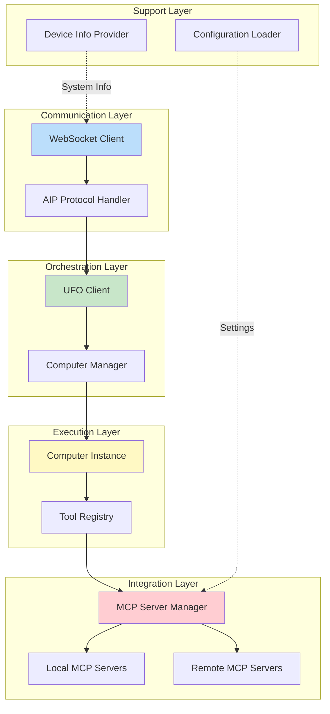
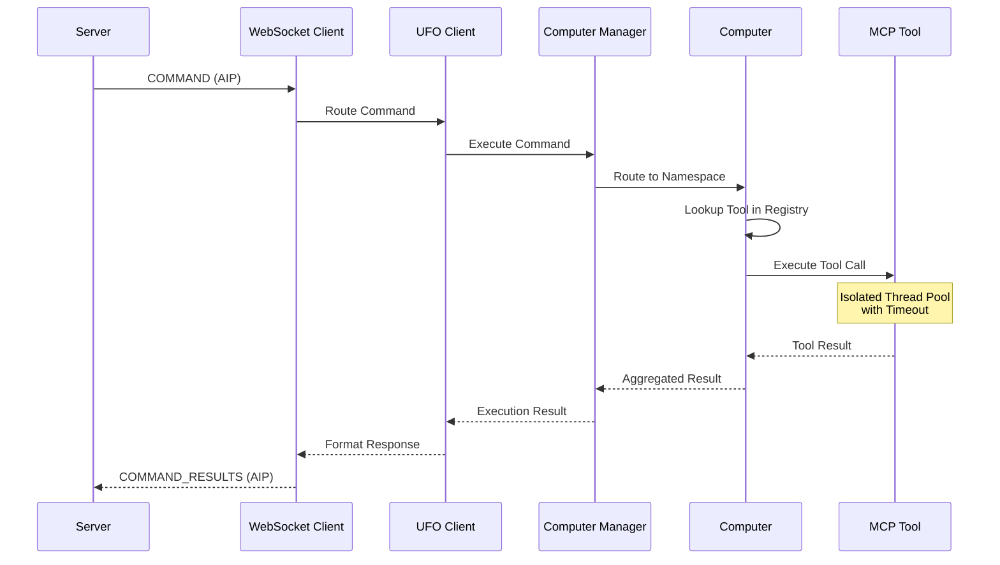
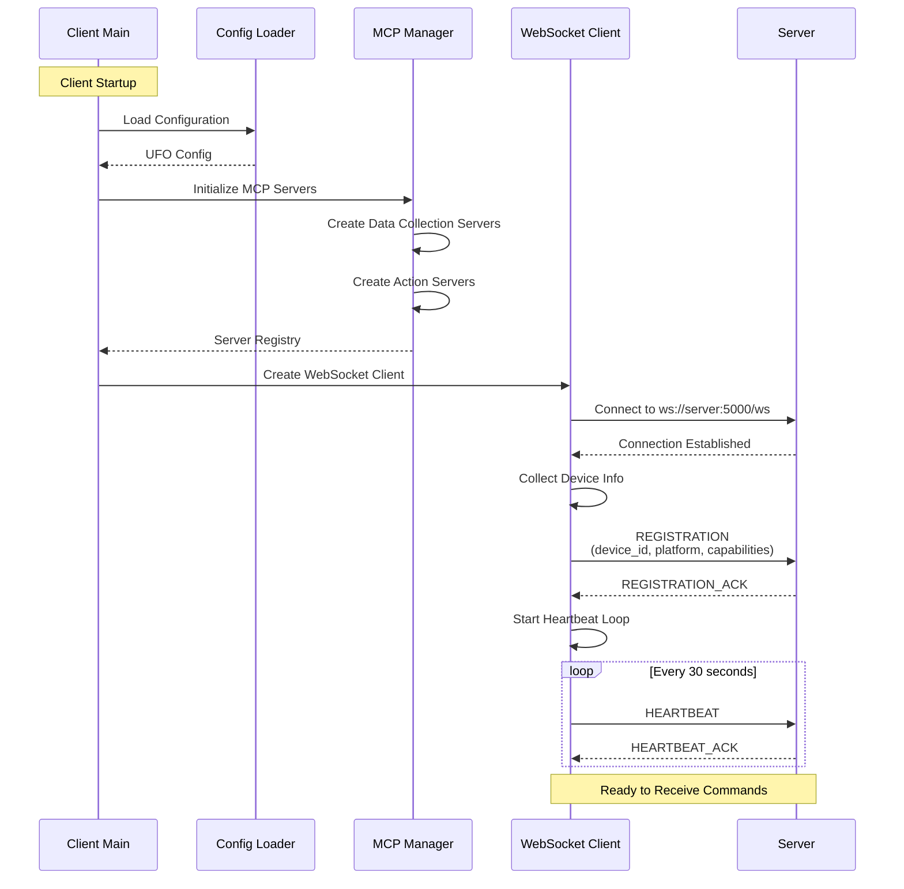
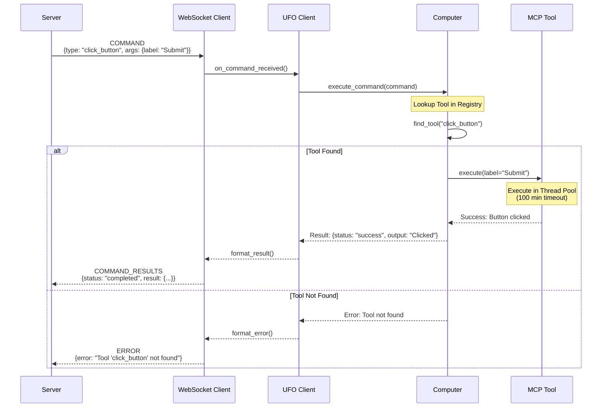

# Agent Client Overview

!!!quote "The Execution Engine"
    The **Agent Client** runs on target devices and serves as the **execution layer** of UFO's distributed agent system. It manages MCP (Model Context Protocol) servers, executes commands deterministically, and communicates with the Agent Server through the Agent Interaction Protocol (AIP).

!!!tip "Quick Start"
    Ready to run a client? Jump to the [Quick Start Guide](./quick_start.md) to connect your device in minutes. Make sure the [Agent Server](../server/quick_start.md) is running first.

---

## 🎯 What is the Agent Client?


**The Agent Client is a stateless execution agent that:**

| Capability | Description | Benefit |
|------------|-------------|---------|
| **🔧 Executes Commands** | Translates server directives into concrete actions | Deterministic, reliable execution |
| **🛠️ Manages MCP Servers** | Orchestrates local and remote tool interfaces | Extensible tool ecosystem |
| **📊 Reports Device Info** | Provides hardware and software profile to server | Intelligent task assignment |
| **📡 Communicates via AIP** | Maintains persistent WebSocket connection | Real-time bidirectional communication |
| **🚫 Remains Stateless** | Executes directives without high-level reasoning | Independent updates, simple architecture |

!!!info "Stateless Design Philosophy"
    The client focuses **purely on execution**. All reasoning and decision-making happens on the server, allowing:
    
    - ✅ Independent updates to server logic and client tools
    - ✅ Simple client architecture (easier to maintain)
    - ✅ Server can orchestrate multiple clients intelligently
    - ✅ Clients can be lightweight and resource-efficient

!!!tip "Server-Client Architecture"
    The Agent Client is part of UFO's distributed **server-client architecture**, where it handles command execution and resource access while the [Agent Server](../server/overview.md) handles orchestration and decision-making. See [Server-Client Architecture](../infrastructure/agents/server_client_architecture.md) for the complete design rationale, communication protocols, and deployment patterns.

---

## 🏗️ Architecture

!!!success "Layered Design"
    The client implements a **layered architecture** separating communication, execution, and tool management for maximum flexibility and maintainability.



### Core Components

| Component | Responsibility | Key Features | Documentation |
|-----------|---------------|--------------|---------------|
| **WebSocket Client** | AIP communication | • Connection management<br/>• Registration<br/>• Heartbeat monitoring<br/>• Message routing | [Details →](./websocket_client.md) |
| **UFO Client** | Execution orchestration | • Session tracking<br/>• Command execution<br/>• Result aggregation<br/>• Error handling | [Details →](./ufo_client.md) |
| **Computer Manager** | Multi-computer abstraction | • Computer instance management<br/>• Namespace routing<br/>• Resource isolation | [Details →](./computer_manager.md) |
| **Computer** | Tool management | • MCP server registration<br/>• Tool registry<br/>• Execution isolation<br/>• Thread pool management | [Details →](./computer.md) |
| **MCP Server Manager** | MCP lifecycle | • Server creation<br/>• Configuration loading<br/>• Connection pooling<br/>• Health monitoring | [Details →](./mcp_integration.md) |
| **Device Info Provider** | System profiling | • Hardware detection<br/>• Capability reporting<br/>• Platform identification<br/>• Feature enumeration | [Details →](./device_info.md) |

For detailed component documentation:

- [WebSocket Client](./websocket_client.md) - AIP protocol implementation
- [UFO Client](./ufo_client.md) - Execution orchestration
- [Computer Manager](./computer_manager.md) - Multi-computer management
- [Device Info Provider](./device_info.md) - System profiling
- [MCP Integration](./mcp_integration.md) - MCP server management (brief overview)

---

## 🚀 Key Capabilities

### 1. Deterministic Command Execution

!!!info "Pure Execution - No Interpretation"
    The client executes commands **exactly as specified** without interpretation or reasoning, ensuring predictable behavior.



**Execution Flow:**

| Step | Action | Purpose |
|------|--------|---------|
| 1️⃣ **Receive** | Get structured command from server via AIP | Ensure well-formed input |
| 2️⃣ **Route** | Dispatch to appropriate computer instance | Support multi-namespace execution |
| 3️⃣ **Lookup** | Find tool in MCP registry | Dynamic tool resolution |
| 4️⃣ **Execute** | Run tool in isolated thread pool | Fault isolation and timeout protection |
| 5️⃣ **Aggregate** | Combine results from multiple tools | Structured response format |
| 6️⃣ **Return** | Send results back to server via AIP | Complete the execution loop |

!!!success "Execution Guarantees"
    - ✅ **Isolation**: Each tool runs in separate thread pool
    - ✅ **Timeouts**: Configurable timeout (default: 100 minutes)
    - ✅ **Fault Tolerance**: One failed tool doesn't crash entire client
    - ✅ **Thread Safety**: Concurrent tool execution supported
    - ✅ **Error Reporting**: Structured errors returned to server

### 2. MCP Server Management

!!!tip "Extensible Tool Ecosystem"
    The client manages a collection of **MCP (Model Context Protocol) servers** to provide diverse tool access for automation tasks. The client is responsible for registering, managing, and executing these tools, while the [Agent Server](../server/overview.md) handles command orchestration. See [Server-Client Architecture](../infrastructure/agents/server_client_architecture.md#client-command-execution-and-resource-access) for how MCP integration fits into the overall architecture.

**MCP Server Categories:**

=== "Data Collection Servers"
    **Purpose**: Gather information from the device
    
    | Server Type | Tools Provided | Use Cases |
    |-------------|---------------|-----------|
    | **System Info** | CPU, memory, disk stats | Resource monitoring |
    | **Application State** | Running apps, windows | Context awareness |
    | **Screenshot** | Screen capture | Visual verification |
    | **UI Element Detection** | Control trees, accessibility | UI automation |
    
    **Example Tools:**
    - `get_system_info()` - System specifications
    - `list_running_apps()` - Active applications
    - `capture_screenshot()` - Screen snapshot
    - `get_ui_tree()` - UI element hierarchy

=== "Action Servers"
    **Purpose**: Perform actions on the device
    
    | Server Type | Tools Provided | Use Cases |
    |-------------|---------------|-----------|
    | **GUI Automation** | Keyboard, mouse, clicks | UI interaction |
    | **Application Control** | Launch, close, focus | App management |
    | **File System** | Read, write, delete | File operations |
    | **Command Execution** | Shell commands | System automation |
    
    **Example Tools:**
    - `click_button(label)` - UI interaction
    - `type_text(text)` - Keyboard input
    - `open_application(name)` - Launch app
    - `execute_command(cmd)` - Shell execution

**Server Types:**

| Type | Deployment | Pros | Cons |
|------|------------|------|------|
| **Local MCP Servers** | Run in same process via FastMCP | Fast, no network overhead | Limited to local capabilities |
| **Remote MCP Servers** | Connect via HTTP/SSE | Scalable, shared services | Network latency, external dependency |

!!!example "MCP Server Configuration"
    ```yaml
    mcp_servers:
      data_collection:
        - name: "system_info"
          type: "local"
          class: "SystemInfoServer"
        - name: "ui_detector"
          type: "local"
          class: "UIDetectionServer"
      
      action:
        - name: "gui_automation"
          type: "local"
          class: "GUIAutomationServer"
        - name: "file_ops"
          type: "remote"
          url: "http://localhost:8080/mcp"
    ```

See [MCP Integration](./mcp_integration.md) for comprehensive MCP server documentation.

### 3. Device Profiling

!!!info "Intelligent Task Assignment"
    The client automatically collects and reports **device information** to enable the server to make intelligent task routing decisions.

**Device Profile Structure:**

```json
{
  "device_id": "device_windows_001",
  "platform": "windows",
  "platform_type": "computer",
  "os_version": "10.0.22631",
  "system_info": {
    "cpu_count": 8,
    "memory_total_gb": 16.0,
    "disk_total_gb": 512.0,
    "hostname": "DESKTOP-ABC123",
    "ip_address": "192.168.1.100"
  },
  "supported_features": [
    "gui_automation",
    "cli_execution",
    "browser_control",
    "office_integration",
    "windows_apps"
  ],
  "installed_applications": [
    "Chrome",
    "Excel",
    "PowerPoint",
    "VSCode"
  ],
  "screen_resolution": "1920x1080",
  "connected_at": "2025-11-05T10:30:00Z"
}
```

**Profile Usage on Server:**

```mermaid
graph LR
    subgraph "Client Side"
        Detect[Device Detection]
        Collect[Info Collection]
        Report[Profile Reporting]
    end
    
    subgraph "Server Side"
        Receive[Receive Profile]
        Store[Store in Registry]
        Route[Task Routing]
    end
    
    subgraph "Task Assignment"
        Match[Match Requirements]
        Select[Select Best Device]
        Dispatch[Dispatch Task]
    end
    
    Detect --> Collect
    Collect --> Report
    Report --> Receive
    Receive --> Store
    Store --> Route
    
    Route --> Match
    Match --> Select
    Select --> Dispatch
    
    style Collect fill:#bbdefb
    style Store fill:#c8e6c9
    style Select fill:#fff9c4
```



**Server Uses Profile For:**

| Use Case | Example Logic |
|----------|--------------|
| **Platform Matching** | Route Excel task to Windows device |
| **Capability Filtering** | Only send browser tasks to devices with Chrome |
| **Load Balancing** | Distribute tasks based on CPU/memory |
| **Failure Recovery** | Reassign task if device disconnects |

See [Device Info Provider](./device_info.md) for detailed profiling documentation.

### 4. Resilient Communication

!!!success "Built on AIP (Agent Interaction Protocol)"
    Robust, fault-tolerant communication with the server using strongly-typed messages.

**Connection Lifecycle:**

```mermaid
stateDiagram-v2
    [*] --> Disconnected
    Disconnected --> Connecting: Initiate Connection
    Connecting --> Registering: WebSocket Established
    Registering --> Connected: Registration Success
    Connecting --> Disconnected: Connection Failed
    Registering --> Disconnected: Registration Failed
    
    Connected --> Heartbeating: Start Heartbeat Loop
    Heartbeating --> Heartbeating: Send/Receive Heartbeat
    Heartbeating --> Disconnected: Heartbeat Timeout
    Heartbeating --> Disconnected: WebSocket Closed
    
    Disconnected --> Connecting: Retry (Exponential Backoff)
    
    note right of Connected
        • Receive commands
        • Execute tasks
        • Report results
    end note
    
    note right of Heartbeating
        Default interval: 30s
        Timeout: 60s
    end note
```



**Connection Features:**

| Feature | Description | Configuration |
|---------|-------------|---------------|
| **Auto Registration** | Registers with server on connect | Device ID, platform, capabilities |
| **Exponential Backoff** | Smart retry on connection failure | Max retries: 5 (default) |
| **Heartbeat Monitoring** | Keep-alive mechanism | Interval: 30s (configurable) |
| **Graceful Reconnection** | Resume operation after disconnect | Auto-reconnect on network recovery |

**Message Types:**

| Message | Direction | Purpose |
|---------|-----------|---------|
| `REGISTRATION` | Client → Server | Register device with capabilities |
| `REGISTRATION_ACK` | Server → Client | Confirm registration |
| `HEARTBEAT` | Client ↔ Server | Keep connection alive |
| `COMMAND` | Server → Client | Execute task command |
| `COMMAND_RESULTS` | Client → Server | Return execution results |
| `ERROR` | Client → Server | Report execution errors |

See [WebSocket Client](./websocket_client.md) and [AIP Protocol](../aip/overview.md) for protocol details.

---

## 📋 Workflow Examples

### Client Initialization & Registration



**Initialization Steps:**

| Step | Action | Details |
|------|--------|---------|
| 1️⃣ **Parse Args** | Process command-line arguments | `--client-id`, `--ws-server`, `--platform` |
| 2️⃣ **Load Config** | Load UFO configuration | MCP servers, tools, settings |
| 3️⃣ **Init MCP** | Initialize MCP server manager | Create local/remote servers |
| 4️⃣ **Create Managers** | Create computer manager | Register MCP servers with computers |
| 5️⃣ **Connect** | Establish WebSocket connection | Connect to server |
| 6️⃣ **Register** | Send device profile | Platform, capabilities, system info |
| 7️⃣ **Heartbeat** | Start keep-alive loop | Default: 30s interval |
| 8️⃣ **Listen** | Wait for commands | Ready for task execution |

### Command Execution Flow



---

## 🖥️ Platform Support

!!!info "Multi-Platform Execution"
    The client supports multiple platforms with platform-specific tool implementations.

| Platform | Status | Features | Native Tools |
|----------|--------|----------|--------------|
| **Windows** | ✅ **Full Support** | • UI Automation (UIAutomation API)<br/>• COM API integration<br/>• Office automation<br/>• Windows-specific apps | PowerShell, Registry, WMI, Win32 API |
| **Linux** | ✅ **Full Support** | • Bash automation<br/>• X11/Wayland GUI tools<br/>• Package managers<br/>• Linux applications | bash, apt/yum, systemd, xdotool |
| **macOS** | 🚧 **In Development** | • macOS applications<br/>• Automator integration<br/>• AppleScript support | osascript, Automator, launchctl |
| **Mobile** | 🔮 **Planned** | • Touch interface<br/>• Mobile apps<br/>• Gesture control | ADB (Android), XCTest (iOS) |

**Platform Detection:**

- **Automatic**: Detected via `platform.system()` on startup
- **Override**: Use `--platform` flag to specify manually
- **Validation**: Server validates platform matches task requirements

!!!example "Platform-Specific Example"
    === "Windows"
        ```python
        # Windows-specific tools
        tools = [
            "open_windows_app(name='Excel')",
            "execute_powershell(script='Get-Process')",
            "read_registry(key='HKLM\\Software')"
        ]
        ```
    
    === "Linux"
        ```python
        # Linux-specific tools
        tools = [
            "execute_bash(command='ls -la')",
            "install_package(name='vim')",
            "control_systemd(service='nginx', action='restart')"
        ]
        ```

---

## ⚙️ Configuration

### Command-Line Arguments

```bash
python -m ufo.client.client [OPTIONS]
```

**Available Options:**

| Option | Type | Default | Description | Example |
|--------|------|---------|-------------|---------|
| `--client-id` | `str` | `client_001` | Unique client identifier | `--client-id device_win_001` |
| `--ws-server` | `str` | `ws://localhost:5000/ws` | WebSocket server URL | `--ws-server ws://192.168.1.10:5000/ws` |
| `--ws` | `flag` | `False` | **Enable WebSocket mode** (required) | `--ws` |
| `--max-retries` | `int` | `5` | Connection retry limit | `--max-retries 10` |
| `--platform` | `str` | Auto-detect | Platform override | `--platform windows` |
| `--log-level` | `str` | `INFO` | Logging verbosity | `--log-level DEBUG` |

!!!tip "Quick Start Command"
    ```bash
    # Minimal command (default server)
    python -m ufo.client.client --ws --client-id my_device
    
    # Production command (custom server)
    python -m ufo.client.client \
      --ws \
      --client-id device_production_01 \
      --ws-server ws://ufo-server.company.com:5000/ws \
      --max-retries 10 \
      --log-level INFO
    ```

### UFO Configuration

The client inherits settings from `config_dev.yaml`:

**Key Configuration Sections:**

| Section | Purpose | Example |
|---------|---------|---------|
| **MCP Servers** | Define data collection and action servers | `mcp_servers.data_collection`, `mcp_servers.action` |
| **Tool Settings** | Tool-specific parameters | Timeouts, retries, API keys |
| **Logging** | Log levels, formats, destinations | File logging, console output |
| **Platform Settings** | OS-specific configurations | Windows UI automation settings |

!!!example "Sample Configuration"
    ```yaml
    client:
      heartbeat_interval: 30  # seconds
      command_timeout: 6000   # seconds (100 minutes)
      max_concurrent_tools: 10
    
    mcp_servers:
      data_collection:
        - name: system_info
          type: local
          enabled: true
      action:
        - name: gui_automation
          type: local
          enabled: true
          settings:
            click_delay: 0.5
            typing_speed: 100  # chars per minute
    
    logging:
      level: INFO
      format: "%(asctime)s - %(name)s - %(levelname)s - %(message)s"
      file: "logs/client.log"
    ```

See [Configuration Guide](../configuration/system/overview.md) for comprehensive documentation.

---

## ⚠️ Error Handling

!!!danger "Robust Fault Tolerance"
    The client is designed to handle various failure scenarios gracefully without crashing.

### Connection Failures


**Connection Error Handling:**

| Scenario | Client Behavior | Configuration |
|----------|----------------|---------------|
| **Initial Connection Failed** | Exponential backoff retry | `--max-retries` (default: 5) |
| **Connection Lost** | Attempt reconnection | Automatic |
| **Max Retries Exceeded** | Exit with error code | Log error, exit |
| **Server Unreachable** | Log error, retry | Backoff between retries |

### Tool Execution Failures

**Protection Mechanisms:**

| Mechanism | Purpose | Default Value |
|-----------|---------|---------------|
| **Thread Pool Isolation** | Prevent one tool from blocking others | Enabled |
| **Execution Timeout** | Kill hung tools | 100 minutes |
| **Exception Catching** | Graceful error handling | All tools wrapped |
| **Error Reporting** | Notify server of failures | Structured error messages |

!!!example "Error Handling Example"
    ```python
    # Client automatically handles tool errors
    try:
        result = tool.execute(args)
        return {"status": "success", "result": result}
    except TimeoutError:
        return {"status": "error", "error": "Tool execution timeout"}
    except Exception as e:
        return {"status": "error", "error": str(e)}
    ```

### Server Disconnection

**Graceful Shutdown Process:**

1. **Detect Disconnection** - WebSocket connection lost
2. **Stop Heartbeat** - Terminate keep-alive loop
3. **Cancel Pending Tasks** - Abort in-progress commands
4. **Attempt Reconnection** - Use exponential backoff
5. **Clean Shutdown** - If max retries exceeded

---

## ✅ Best Practices

### Development Best Practices

!!!tip "Development Tips"
    
    **1. Use Unique Client IDs**
    ```bash
    # Bad: Generic ID
    --client-id client_001
    
    # Good: Descriptive ID
    --client-id device_win_dev_john_laptop
    ```
    
    **2. Start with INFO Logging**
    ```bash
    # Development: INFO for normal operation
    --log-level INFO
    
    # Debugging: DEBUG for troubleshooting
    --log-level DEBUG
    ```
    
    **3. Test MCP Connectivity First**
    ```python
    # Verify MCP servers are accessible before running client
    from ufo.module.mcp_server import MCPServerManager
    
    manager = MCPServerManager()
    servers = manager.create_servers_from_config()
    print(f"Initialized {len(servers)} MCP servers")
    ```

### Production Best Practices

!!!success "Production Deployment"
    
    **1. Use Descriptive Client IDs**
    ```bash
    # Include environment, location, purpose
    --client-id device_windows_production_office_01
    --client-id device_linux_staging_lab_02
    ```
    
    **2. Configure Automatic Restart**
    
    === "systemd (Linux)"
        ```ini
        [Unit]
        Description=UFO Agent Client
        After=network.target
        
        [Service]
        Type=simple
        User=ufo
        WorkingDirectory=/opt/ufo
        ExecStart=/usr/bin/python3 -m ufo.client.client \
          --ws \
          --client-id device_linux_prod_01 \
          --ws-server ws://ufo-server.internal:5000/ws \
          --log-level INFO
        Restart=always
        RestartSec=10
        
        [Install]
        WantedBy=multi-user.target
        ```
    
    === "PM2 (Cross-platform)"
        ```json
        {
          "apps": [{
            "name": "ufo-client",
            "script": "python",
            "args": [
              "-m", "ufo.client.client",
              "--ws",
              "--client-id", "device_win_prod_01",
              "--ws-server", "ws://ufo-server.internal:5000/ws",
              "--log-level", "INFO"
            ],
            "cwd": "C:\\ufo",
            "restart_delay": 5000,
            "max_restarts": 10
          }]
        }
        ```
    
    **3. Monitor Connection Health**
    ```python
    # Check logs for connection status
    tail -f logs/client.log | grep -E "Connected|Disconnected|ERROR"
    ```

### Security Best Practices

!!!warning "Security Considerations"
    
    | Practice | Description | Implementation |
    |----------|-------------|----------------|
    | **Use WSS** | Encrypt WebSocket communication | `wss://server:5000/ws` instead of `ws://` |
    | **Validate Server** | Verify server certificate | Configure SSL/TLS verification |
    | **Restrict Tools** | Limit MCP server access | Only enable necessary tools |
    | **Least Privilege** | Run with minimum permissions | Create dedicated user account |
    | **Network Isolation** | Use firewalls and VPNs | Restrict server access to internal network |

---

## 🎓 Documentation Map

### Getting Started

| Document | Purpose | When to Read |
|----------|---------|--------------|
| [Quick Start](./quick_start.md) | Connect your device quickly | First time setup |
| [Server Quick Start](../server/quick_start.md) | Understand server-side setup | Before running client |

### Component Details

| Document | Component | Topics Covered |
|----------|-----------|----------------|
| [WebSocket Client](./websocket_client.md) | Communication layer | AIP protocol, connection management |
| [UFO Client](./ufo_client.md) | Orchestration | Session tracking, command execution |
| [Computer Manager](./computer_manager.md) | Multi-computer abstraction | Namespace management, routing |
| [Computer](./computer.md) | Tool management | MCP registry, execution |
| [Device Info](./device_info.md) | System profiling | Hardware detection, capabilities |
| [MCP Integration](./mcp_integration.md) | MCP servers | Server types, configuration |

### Related Documentation

| Document | Topic | Relevance |
|----------|-------|-----------|
| [Server Overview](../server/overview.md) | Server architecture | Understand the other half |
| [AIP Protocol](../aip/overview.md) | Communication protocol | Deep dive into messaging |
| [Configuration](../configuration/system/overview.md) | UFO configuration | Customize behavior |

---

## 🔄 Client vs. Server

!!!quote "Separation of Concerns"
    Understanding the **clear division** between client and server responsibilities is crucial for effective system design.

**Responsibility Matrix:**

| Aspect | Client (Execution) | Server (Orchestration) |
|--------|-------------------|------------------------|
| **Primary Role** | Execute directives deterministically | Reason about tasks, plan actions |
| **State Management** | Stateless (no session memory) | Stateful (maintains sessions) |
| **Reasoning** | None (pure execution) | Full (high-level decision-making) |
| **Tools** | MCP servers (local/remote) | Agent strategies, prompts, LLMs |
| **Communication** | Device ↔ Server (AIP) | Multi-client coordination |
| **Updates** | Tool implementation changes | Strategy and logic updates |
| **Complexity** | Low (simple execution loop) | High (complex orchestration) |
| **Dependencies** | MCP servers, system APIs | LLMs, databases, client registry |

**Workflow Comparison:**


!!!info "Decoupled Architecture Benefits"
    - ✅ **Independent Updates**: Modify server logic without touching clients
    - ✅ **Flexible Deployment**: Run clients on any platform
    - ✅ **Scalability**: Add more clients without server changes
    - ✅ **Maintainability**: Simpler client code, easier debugging
    - ✅ **Testability**: Test client and server independently

---

## 🚀 Next Steps

!!!tip "Get Started with UFO Client"
    
    **1. Run Your First Client**
    ```bash
    # Follow the quick start guide
    python -m ufo.client.client \
      --ws \
      --client-id my_first_device \
      --ws-server ws://localhost:5000/ws
    ```
    👉 [Quick Start Guide](./quick_start.md)
    
    **2. Understand Registration Process**
    - How clients register with the server
    - Device profile structure
    - Registration acknowledgment
    
    👉 [Server Quick Start](../server/quick_start.md) - Start server and connect clients
    
    **3. Explore MCP Integration**
    - Learn about MCP servers
    - Configure custom tools
    - Create your own MCP servers
    
    👉 [MCP Integration](./mcp_integration.md)
    
    **4. Configure for Your Environment**
    - Customize MCP servers
    - Adjust timeouts and retries
    - Platform-specific settings
    
    👉 [Configuration Guide](../configuration/system/overview.md)
    
    **5. Master the Protocol**
    - Deep dive into AIP messages
    - Understand message flow
    - Error handling patterns
    
    👉 [AIP Protocol](../aip/overview.md)
