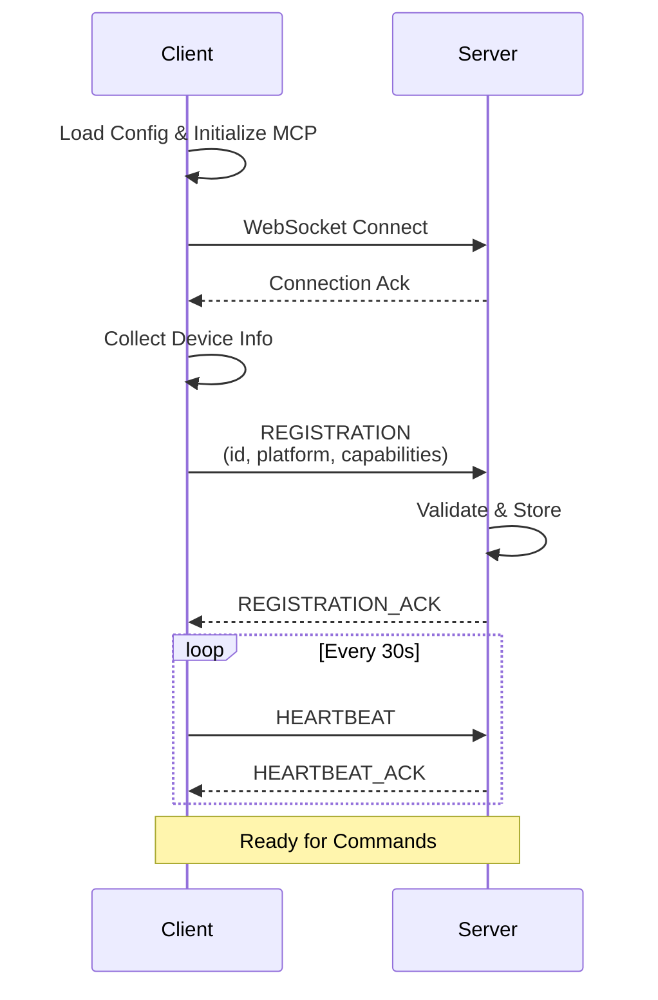
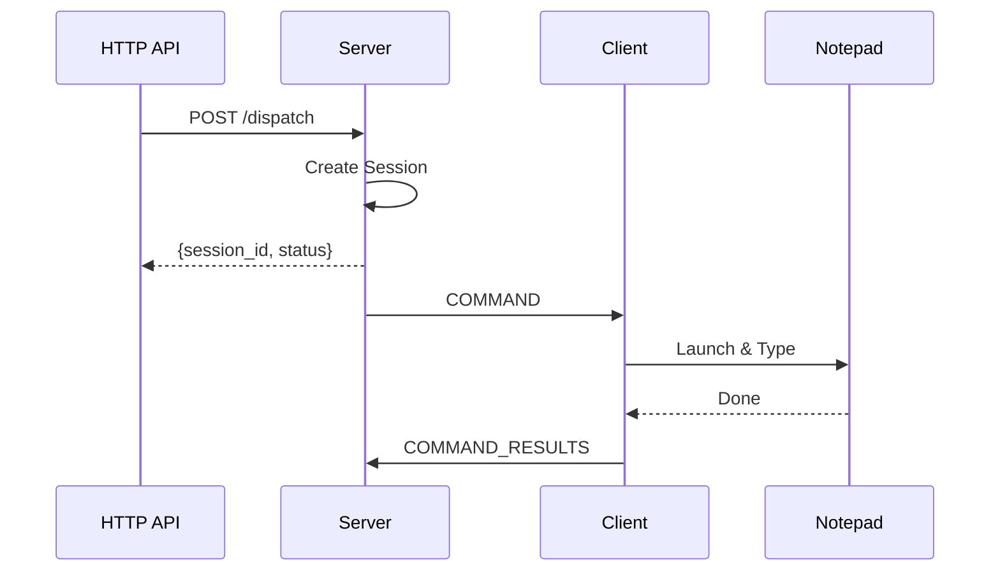

# ⚡ Quick Start

Get your device connected to the UFO Agent Server and start executing tasks in minutes. No complex setup—just run a single command.

---

## 📋 Prerequisites

Before connecting a client device, ensure these requirements are met:

| Requirement | Version/Details | Verification Command |
|-------------|-----------------|----------------------|
| **Python** | 3.10 or higher | `python --version` |
| **UFO Installation** | Latest version with dependencies | `python -c "import ufo; print('✅ Installed')"` |
| **Running Server** | Agent server accessible on network | `curl http://server:5000/api/health` |
| **Network Access** | Client can reach server WebSocket endpoint | Test connectivity to server |

!!! tip "Server First!"
    **Always start the Agent Server before connecting clients.** The server must be running and accessible for clients to register successfully.
    
    👉 [Server Quick Start Guide](../server/quick_start.md)

**Verify Server Status:**

**Windows:**
```powershell
# Test HTTP API
Invoke-WebRequest -Uri http://localhost:5000/api/health
    
# Test WebSocket (requires wscat)
wscat -c ws://localhost:5000/ws
```

**Linux/macOS:**
```bash
# Test HTTP API
curl http://localhost:5000/api/health
    
# Test WebSocket (requires wscat)
wscat -c ws://localhost:5000/ws
```

---

## 🚀 Starting a Device Client

### Minimal Command (Local Server)

Connect to a server running on the same machine with default settings:

```bash
python -m ufo.client.client --ws --client-id my_device
```

**What This Does:**

| Parameter | Default Value | Purpose |
|-----------|---------------|---------|
| `--ws` | N/A (flag) | **Enable WebSocket mode** (required) |
| `--client-id` | `my_device` | Unique identifier for this device |
| `--ws-server` | `ws://localhost:5000/ws` | Connect to local server |
| `--platform` | Auto-detected | Detected from `platform.system()` |
| `--max-retries` | `5` | Connection retry attempts |

### Connect to Remote Server

Connect to a server running on a different machine in your network:

```bash
python -m ufo.client.client \
  --ws \
  --ws-server ws://192.168.1.100:5000/ws \
  --client-id device_windows_001
```

**Network Requirements:**

- ✅ Client can ping the server: `ping 192.168.1.100`
- ✅ Port **5000** is accessible (firewall allows)
- ✅ Server is running and listening on correct port

### Override Platform Detection

!!! tip "When to Override"
    Normally, the client auto-detects the platform (`windows` or `linux`). Override when:
    
    - Running in container/VM with mismatched OS
    - Testing cross-platform behavior
    - Platform detection fails

```bash
python -m ufo.client.client \
  --ws \
  --ws-server ws://127.0.0.1:5000/ws \
  --client-id my_linux_device \
  --platform linux
```

### Complete Command (All Options)

Production-ready configuration with all available options:

```bash
python -m ufo.client.client \
  --ws \
  --ws-server ws://192.168.1.100:5000/ws \
  --client-id device_windows_prod_01 \
  --platform windows \
  --max-retries 10 \
  --log-level WARNING
```

**Enhancements:**

- 🔁 **10 retries**: Resilient to temporary network issues
- 📋 **WARNING logging**: Default level (less verbose than INFO)
- 🏷️ **Descriptive ID**: `device_windows_prod_01` clearly identifies environment

---

## 📝 Connection Parameters Reference

All available command-line options for the UFO client.

### Required Parameters

| Parameter | Description | Example |
|-----------|-------------|---------|
| `--ws` | **Enable WebSocket mode** (flag, no value) | `--ws` |

### Connection Parameters

| Parameter | Type | Default | Description | Example |
|-----------|------|---------|-------------|---------|
| `--ws-server` | `str` | `ws://localhost:5000/ws` | WebSocket server URL | `--ws-server ws://192.168.1.10:5000/ws` |
| `--max-retries` | `int` | `5` | Maximum connection retry attempts | `--max-retries 10` |

### Device Parameters

| Parameter | Type | Default | Description | Example |
|-----------|------|---------|-------------|---------|
| `--client-id` | `str` | `client_001` | **Unique device identifier** | `--client-id device_win_prod_01` |
| `--platform` | `str` | Auto-detect | Platform override: `windows` or `linux` | `--platform linux` |

### Logging Parameters

| Parameter | Type | Default | Description | Example |
|-----------|------|---------|-------------|---------|
| `--log-level` | `str` | `WARNING` | Logging verbosity: `DEBUG`, `INFO`, `WARNING`, `ERROR`, `CRITICAL`, `OFF` | `--log-level DEBUG` |

!!! warning "Unique Client IDs - Critical!"
    **Each device MUST have a unique `--client-id`.** Duplicate IDs will cause:
    
    - ❌ Connection conflicts (devices disconnecting each other)
    - ❌ Task routing failures (tasks sent to wrong device)
    - ❌ Session corruption (server state confusion)
    
    **Best Practice:** Use descriptive IDs:
    ```
    ✅ device_windows_prod_datacenter1_rack3
    ✅ device_linux_staging_jenkins_worker2
    ❌ client_001
    ❌ device1
    ```

---

## ✅ Successful Connection

### Client Logs

When the client connects successfully, you'll see this sequence:

```log
INFO - Platform detected/specified: windows
INFO - UFO Client initialized for platform: windows
INFO - [WS] Connecting to ws://127.0.0.1:5000/ws (attempt 1/5)
INFO - [WS] [AIP] Collected device info: platform=windows, cpu=8, memory=16.0GB
INFO - [WS] [AIP] Attempting to register as device_windows_001
INFO - [WS] [AIP] ✅ Successfully registered as device_windows_001
INFO - [WS] Heartbeat loop started (interval: 30s)
```

**Registration Flow:**



### Server Logs

On the server side, you'll see:

```log
INFO - [WS] ✅ Registered device client: device_windows_001
INFO - [WS] Device device_windows_001 capabilities: {
  "platform": "windows",
  "cpu_count": 8,
  "memory_gb": 16.0,
  "mcp_servers": ["system_info", "gui_automation"]
}
```

---

## 🔍 Verify Connection

### Check Connected Clients (HTTP API)

From the server machine or any network-accessible machine:

**cURL:**
```bash
curl http://localhost:5000/api/clients
```

**PowerShell:**
```powershell
Invoke-RestMethod -Uri http://localhost:5000/api/clients | ConvertTo-Json
```

**Python:**
```python
import requests
response = requests.get("http://localhost:5000/api/clients")
print(response.json())
```

**Expected Response:**

```json
{
  "clients": [
    {
      "client_id": "device_windows_001",
      "type": "device",
      "platform": "windows",
      "connected_at": 1730736000.0,
      "uptime_seconds": 45,
      "capabilities": {
        "cpu_count": 8,
        "memory_gb": 16.0,
        "mcp_servers": ["system_info", "gui_automation"]
      }
    }
  ],
  "total": 1
}
```

**Client Status Indicators:**

| Field | Description | Example |
|-------|-------------|---------|
| `client_id` | Unique device identifier | `device_windows_001` |
| `type` | Client type (always `"device"`) | `device` |
| `platform` | Operating system | `windows`, `linux` |
| `connected_at` | Unix timestamp of connection | `1730736000.0` |
| `uptime_seconds` | Seconds since connection | `45` |
| `capabilities` | Device hardware/software profile | CPU, memory, MCP servers |

### Monitor Heartbeats

The client sends **heartbeat messages every 30 seconds** to prove it's still alive.

**Client Logs (DEBUG level):**

```log
DEBUG - [WS] [AIP] Heartbeat sent
DEBUG - [WS] [AIP] Heartbeat acknowledged
```

**Server Logs (DEBUG level):**

```log
DEBUG - [WS] Heartbeat received from device_windows_001
DEBUG - [WS] Heartbeat acknowledged for device_windows_001
```

---

## 🎯 Running Your First Task

Once the client is connected, dispatch a simple task from the server to verify end-to-end functionality.

### Dispatch Task via HTTP API

**cURL:**
```bash
curl -X POST http://localhost:5000/api/dispatch \
  -H "Content-Type: application/json" \
  -d '{
    "client_id": "device_windows_001",
    "request": "Open Notepad and type Hello from UFO"
  }'
```

**PowerShell:**
```powershell
$body = @{
    client_id = "device_windows_001"
    request   = "Open Notepad and type Hello from UFO"
} | ConvertTo-Json
    
Invoke-RestMethod -Uri http://localhost:5000/api/dispatch `
  -Method POST `
  -ContentType "application/json" `
  -Body $body
```

**Python:**
```python
import requests
    
response = requests.post(
    "http://localhost:5000/api/dispatch",
    json={
        "client_id": "device_windows_001",
        "request": "Open Notepad and type Hello from UFO"
    }
)
print(response.json())
```

### Server Response

```json
{
  "status": "success",
  "session_id": "session_20251104_143022_abc123",
  "message": "Task dispatched to device_windows_001",
  "client_id": "device_windows_001"
}
```

**Response Fields:**

| Field | Description |
|-------|-------------|
| `status` | `"success"` or `"error"` |
| `session_id` | Unique session identifier for tracking |
| `message` | Human-readable status message |
| `client_id` | Target device that received the task |

### Client Execution Logs

```log
INFO - [WS] Starting task: Open Notepad and type Hello from UFO
INFO - [WS] [AIP] Sent task request with platform: windows
INFO - Executing 3 actions in total
INFO - [WS] [AIP] Sent client result for prev_response_id: resp_abc123
INFO - [WS] Task session_20251104_143022_abc123 completed
```

**Execution Flow:**



---

## ⚠️ Common Issues

### 1. Connection Refused

**Symptom:**
```log
ERROR - [WS] Unexpected error: [Errno 10061] Connect call failed
ERROR - [WS] Max retries reached. Exiting.
```

**Root Causes:**

| Cause | Verification | Solution |
|-------|--------------|----------|
| Server not running | `curl http://localhost:5000/api/health` | Start server first |
| Wrong port | Check server startup logs | Use correct port (`--ws-server ws://...`) |
| Firewall blocking | `telnet server 5000` | Allow port 5000 in firewall |
| Server using `--local` flag | Check server CLI args | Connect from localhost only |

**Solutions:**

**Verify Server:**
```bash
# Check if server is running
curl http://localhost:5000/api/health
    
# Expected response:
# {"status": "healthy", "uptime_seconds": 123}
```

**Check Firewall:**
```bash
# Windows: Check if port is listening
netstat -an | findstr ":5000"
    
# Linux: Check if port is listening
netstat -tuln | grep :5000
```

**Fix Connection:**
```bash
# Ensure server and client match:
# Server: --port 5000
# Client: --ws-server ws://localhost:5000/ws
```

### 2. Registration Failed

**Symptom:**
```log
ERROR - [WS] [AIP] ❌ Failed to register as device_windows_001
RuntimeError: Registration failed for device_windows_001
```

**Root Causes:**

| Cause | Explanation | Solution |
|-------|-------------|----------|
| Duplicate client ID | Another device using same ID | Use unique `--client-id` |
| Server rejecting connection | Server validation error | Check server logs for details |
| Network interruption | Connection dropped during registration | Retry connection |
| Device info collection error | Failed to gather system info | Check MCP server initialization |

**Solutions:**

**Check Duplicate IDs:**
```bash
# List all connected clients
curl http://localhost:5000/api/clients | grep client_id
    
# If your ID appears, choose a different one
python -m ufo.client.client --ws --client-id NEW_UNIQUE_ID
```

**Check Server Logs:**
```bash
# Server logs show detailed rejection reasons
# Example: "Client ID already exists"
# Example: "Platform mismatch"
```

### 3. Platform Detection Issues

**Symptom:**
```log
WARNING - Platform not detected correctly
WARNING - Defaulting to platform: unknown
```

**Solution:**

Explicitly set the platform:

```bash
python -m ufo.client.client \
  --ws \
  --ws-server ws://127.0.0.1:5000/ws \
  --client-id my_device \
  --platform windows  # or 'linux'
```

**Platform Values:**

| Value | OS | Auto-Detection |
|-------|----|-|
| `windows` | Windows 10/11, Server 2016+ | `platform.system() == "Windows"` |
| `linux` | Ubuntu, Debian, RHEL, etc. | `platform.system() == "Linux"` |

### 4. Heartbeat Timeout

**Symptom:**
```log
ERROR - [WS] Connection closed: ConnectionClosedError
INFO - [WS] Reconnecting... (attempt 2/5)
```

**Root Causes:**

| Cause | Description | Solution |
|-------|-------------|----------|
| Network instability | Wi-Fi dropouts, packet loss | Use wired connection |
| Server crashed | Server process terminated | Restart server |
| Proxy interference | Corporate proxy blocking WebSocket | Configure proxy bypass |
| Firewall timeout | Idle connection timeout | Reduce heartbeat interval |

**Solutions:**

**Increase Retries:**
```bash
# For unreliable networks
python -m ufo.client.client \
  --ws \
  --ws-server ws://server:5000/ws \
  --client-id my_device \
  --max-retries 20
```

**Check Network:**
```bash
# Test sustained connection
ping -t server  # Windows
ping server     # Linux (Ctrl+C to stop)
```

**Verify Server:**
```bash
# Check if server is still running
curl http://server:5000/api/health
```

---

## 🌐 Multiple Devices

Connect multiple devices to the same server for **fleet management** and **task distribution**.

### Example Configuration

**Device 1 (Windows Desktop):**

```bash
python -m ufo.client.client \
  --ws \
  --ws-server ws://192.168.1.100:5000/ws \
  --client-id device_windows_desktop_001
```

**Device 2 (Linux Server):**

```bash
python -m ufo.client.client \
  --ws \
  --ws-server ws://192.168.1.100:5000/ws \
  --client-id device_linux_server_001 \
  --platform linux
```

**Device 3 (Windows Laptop):**

```bash
python -m ufo.client.client \
  --ws \
  --ws-server ws://192.168.1.100:5000/ws \
  --client-id device_windows_laptop_002
```

### Verify All Connected

```bash
curl http://192.168.1.100:5000/api/clients
```

**Expected Response:**

```json
{
  "clients": [
    {
      "client_id": "device_windows_desktop_001",
      "type": "device",
      "platform": "windows",
      "uptime_seconds": 120
    },
    {
      "client_id": "device_linux_server_001",
      "type": "device",
      "platform": "linux",
      "uptime_seconds": 95
    },
    {
      "client_id": "device_windows_laptop_002",
      "type": "device",
      "platform": "windows",
      "uptime_seconds": 45
    }
  ],
  "total": 3
}
```

**Client ID Naming Convention:**

```
device_<platform>_<environment>_<location>_<number>

Examples:
- device_windows_prod_datacenter1_001
- device_linux_staging_cloud_aws_002
- device_windows_dev_office_laptop_john
```

---

## 🔧 Running as Background Service

!!! tip "Production Deployment"
    For production use, run the client as a **system service** that starts automatically and restarts on failure.

### Linux (systemd)

Create `/etc/systemd/system/ufo-client.service`:

```ini
[Unit]
Description=UFO Device Client - Execution Agent
Documentation=https://github.com/microsoft/UFO
After=network-online.target
Wants=network-online.target

[Service]
Type=simple
User=ufouser
Group=ufouser
WorkingDirectory=/home/ufouser/UFO2

# Environment variables (if needed)
Environment="PYTHONUNBUFFERED=1"

# Main command
ExecStart=/usr/bin/python3 -m ufo.client.client \
  --ws \
  --ws-server ws://192.168.1.100:5000/ws \
  --client-id device_linux_prod_01 \
  --platform linux \
  --log-level INFO

# Restart policy
Restart=always
RestartSec=10
StartLimitBurst=5
StartLimitIntervalSec=300

# Resource limits (optional)
LimitNOFILE=65536
MemoryLimit=2G

# Logging
StandardOutput=journal
StandardError=journal
SyslogIdentifier=ufo-client

[Install]
WantedBy=multi-user.target
```

**Enable and Start:**

```bash
# Reload systemd configuration
sudo systemctl daemon-reload

# Enable service (start on boot)
sudo systemctl enable ufo-client

# Start service now
sudo systemctl start ufo-client

# Check status
sudo systemctl status ufo-client

# View logs
sudo journalctl -u ufo-client -f
```

**Service Management:**

| Command | Purpose |
|---------|---------|
| `systemctl start ufo-client` | Start the service |
| `systemctl stop ufo-client` | Stop the service |
| `systemctl restart ufo-client` | Restart the service |
| `systemctl status ufo-client` | Check service status |
| `journalctl -u ufo-client -f` | Follow logs in real-time |
| `systemctl disable ufo-client` | Disable auto-start |

### Windows (NSSM)

**NSSM** (Non-Sucking Service Manager) wraps any application as a Windows service.

**1. Download NSSM:**

Download from [nssm.cc](https://nssm.cc/download)

**2. Install Service:**

```powershell
# Install as service
nssm install UFOClient "C:\Python310\python.exe" `
  "-m" "ufo.client.client" `
  "--ws" `
  "--ws-server" "ws://192.168.1.100:5000/ws" `
  "--client-id" "device_windows_prod_01" `
  "--log-level" "INFO"

# Set working directory
nssm set UFOClient AppDirectory "C:\UFO2"

# Set restart policy
nssm set UFOClient AppExit Default Restart
nssm set UFOClient AppRestartDelay 10000

# Set logging
nssm set UFOClient AppStdout "C:\UFO2\logs\client-stdout.log"
nssm set UFOClient AppStderr "C:\UFO2\logs\client-stderr.log"
```

**3. Manage Service:**

```powershell
# Start service
nssm start UFOClient

# Check status
nssm status UFOClient

# Stop service
nssm stop UFOClient

# Remove service
nssm remove UFOClient confirm
```

**Alternative: Windows Task Scheduler**

```powershell
# Create scheduled task to run on startup
$action = New-ScheduledTaskAction -Execute "python.exe" `
  -Argument "-m ufo.client.client --ws --ws-server ws://server:5000/ws --client-id device_win_01"
$trigger = New-ScheduledTaskTrigger -AtStartup
$settings = New-ScheduledTaskSettingsSet -RestartCount 3 -RestartInterval (New-TimeSpan -Minutes 1)

Register-ScheduledTask -TaskName "UFOClient" `
  -Action $action `
  -Trigger $trigger `
  -Settings $settings `
  -User "System" `
  -RunLevel Highest
```

### PM2 (Cross-Platform)

**PM2** is a cross-platform process manager with built-in load balancing, monitoring, and auto-restart.

**1. Install PM2:**

```bash
npm install -g pm2
```

**2. Create Ecosystem File (`ecosystem.config.js`):**

```javascript
module.exports = {
  apps: [{
    name: "ufo-client",
    script: "python",
    args: [
      "-m", "ufo.client.client",
      "--ws",
      "--ws-server", "ws://192.168.1.100:5000/ws",
      "--client-id", "device_prod_01",
      "--log-level", "INFO"
    ],
    cwd: "/home/user/UFO2",
    interpreter: "none",
    autorestart: true,
    watch: false,
    max_restarts: 10,
    min_uptime: "10s",
    restart_delay: 5000,
    env: {
      PYTHONUNBUFFERED: "1"
    }
  }]
};
```

**3. Start with PM2:**

```bash
# Start from ecosystem file
pm2 start ecosystem.config.js

# Or start directly
pm2 start "python -m ufo.client.client --ws --ws-server ws://192.168.1.100:5000/ws --client-id device_001" \
  --name ufo-client

# Save PM2 configuration
pm2 save

# Enable startup script (auto-start on boot)
pm2 startup
# Follow the instructions printed by the command

# Monitor
pm2 monit

# View logs
pm2 logs ufo-client
```

**PM2 Management:**

| Command | Purpose |
|---------|---------|
| `pm2 list` | List all processes |
| `pm2 start ufo-client` | Start process |
| `pm2 stop ufo-client` | Stop process |
| `pm2 restart ufo-client` | Restart process |
| `pm2 delete ufo-client` | Remove process |
| `pm2 logs ufo-client` | View logs |
| `pm2 monit` | Real-time monitoring dashboard |

---

## 🏭 Production Deployment Best Practices

Follow these best practices for reliable production deployments.

### 1. Descriptive Client IDs

```bash
# ❌ Bad: Generic, non-unique
--client-id client_001
--client-id device1

# ✅ Good: Descriptive, environment, location
--client-id production_windows_datacenter1_rack3_slot1
--client-id staging_linux_cloud_aws_us-east-1_worker2
--client-id dev_windows_office_john_laptop
```

**ID Structure:**

```
<environment>_<platform>_<location>_<identifier>

- environment: production, staging, development, test
- platform: windows, linux
- location: datacenter1, cloud_aws, office
- identifier: unique number or name
```

### 2. Structured Logging

**File Logging:**
```bash
# Redirect to log file with rotation
python -m ufo.client.client \
  --ws \
  --ws-server ws://server:5000/ws \
  --client-id device_prod_01 \
  --log-level INFO \
  > /var/log/ufo-client.log 2>&1
```

**Systemd Journal:**
```bash
# Already configured in systemd service
# View logs:
journalctl -u ufo-client -f --since "1 hour ago"
```

**Syslog:**
```bash
# Configure Python logging to send to syslog
# Add to config_dev.yaml:
# logging:
#   handlers:
#     syslog:
#       class: logging.handlers.SysLogHandler
#       address: /dev/log
```

### 3. Automatic Restart on Failure

**Service Configuration:**

| Platform | Mechanism | Restart Delay | Max Restarts |
|----------|-----------|---------------|--------------|
| Linux | systemd | 10 seconds | Unlimited (with rate limiting) |
| Windows | NSSM | 10 seconds | Unlimited |
| Cross-platform | PM2 | 5 seconds | 10 attempts, then manual |

### 4. Health Monitoring

**Monitoring Script:**

```bash
#!/bin/bash
# check-ufo-client.sh

CLIENT_ID="device_prod_01"
SERVER_URL="http://192.168.1.100:5000"

# Check if client is connected
response=$(curl -s "${SERVER_URL}/api/clients" | grep -c "${CLIENT_ID}")

if [ "$response" -eq "0" ]; then
    echo "ALERT: Client ${CLIENT_ID} is not connected!"
    # Send alert (email, Slack, PagerDuty, etc.)
    exit 1
else
    echo "OK: Client ${CLIENT_ID} is connected"
    exit 0
fi
```

**Run via cron:**
```cron
# Check every 5 minutes
*/5 * * * * /usr/local/bin/check-ufo-client.sh
```

### 5. Secure Communication

!!! danger "Production Security"
    **Never expose clients to the internet without these security measures:**

**Use WSS (WebSocket Secure):**

```bash
# Production: Encrypted WebSocket
--ws-server wss://ufo-server.company.com/ws

# Development only: Unencrypted
--ws-server ws://localhost:5000/ws
```

**Server-Side TLS Configuration:**

```bash
# Server with TLS
python -m ufo.server.app \
  --port 5000 \
  --ssl-cert /path/to/cert.pem \
  --ssl-key /path/to/key.pem
```

**Network Security:**

| Measure | Implementation |
|---------|----------------|
| **Firewall Rules** | Allow only server IP on port 5000 |
| **VPN/Private Network** | Run server on internal network only |
| **Authentication** | Implement client authentication (future feature) |
| **Certificate Validation** | Verify server TLS certificates |

---

## 🔧 Troubleshooting Commands

Use these commands to diagnose connection and execution issues.

### Test Server Connectivity

**HTTP Health Check:**
```bash
curl http://localhost:5000/api/health
    
# Expected response:
# {"status": "healthy", "uptime_seconds": 3456}
```

**WebSocket Test:**
```bash
# Install wscat
npm install -g wscat
    
# Test WebSocket connection
wscat -c ws://localhost:5000/ws
    
# You should see connection established
# Send a test message (will likely be rejected, but connection works)
```

**Network Connectivity:**
```bash
# Test if server is reachable
ping 192.168.1.100
    
# Test if port is open
telnet 192.168.1.100 5000  # Windows/Linux
nc -zv 192.168.1.100 5000  # Linux/macOS
```

### Check Connected Clients

```bash
# List all connected clients
curl http://localhost:5000/api/clients | python -m json.tool

# Check specific client
curl http://localhost:5000/api/clients | grep "device_windows_001"
```

### Monitor Client Logs

**Increase Verbosity:**
```bash
# Enable DEBUG logging
python -m ufo.client.client \
  --ws \
  --client-id my_device \
  --log-level DEBUG
```

**Filter Logs:**
```bash
# Only show errors
python -m ufo.client.client --ws --client-id my_device 2>&1 | grep ERROR
    
# Only show connection events
python -m ufo.client.client --ws --client-id my_device 2>&1 | grep -E "Connect|Register"
```

### Test Task Dispatch

```bash
# Dispatch simple test task
curl -X POST http://localhost:5000/api/dispatch \
  -H "Content-Type: application/json" \
  -d '{
    "client_id": "device_windows_001",
    "request": "List all files in the current directory"
  }'
```

---

## 🚀 Next Steps

!!! tip "Continue Learning"
    Now that your client is connected and running tasks:

**1. Understand Registration Flow**

Learn how clients register with the server and exchange device profiles:

👉 [UFO Client Overview](./overview.md)

**2. Explore Device Information**

Deep dive into what device information is collected and how it's used for task assignment:

👉 [Device Info Provider](./device_info.md)

**3. Master WebSocket Communication**

Understand the AIP protocol and WebSocket message flow:

👉 [WebSocket Client](./websocket_client.md)

**4. Configure MCP Servers**

Learn how to add custom tools and configure MCP servers:

👉 [MCP Integration](../mcp/overview.md)

**5. Study the AIP Protocol**

Deep dive into message types, flow control, and error handling:

👉 [AIP Protocol](../aip/overview.md)

**6. Production Deployment**

Best practices for running clients in production environments:

👉 [Configuration Guide](../configuration/system/overview.md)
