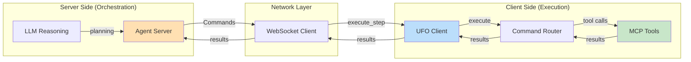
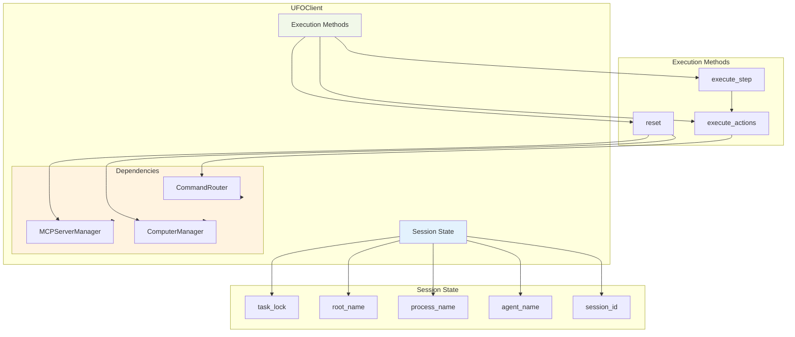
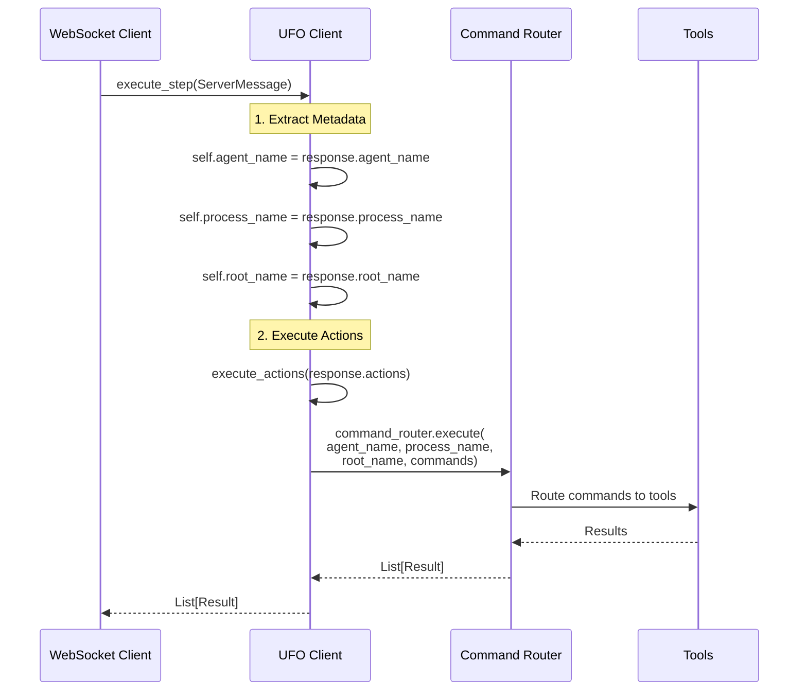
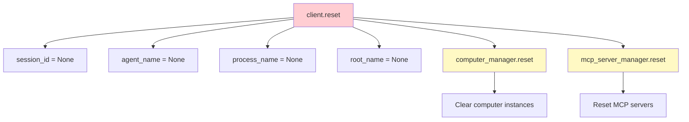
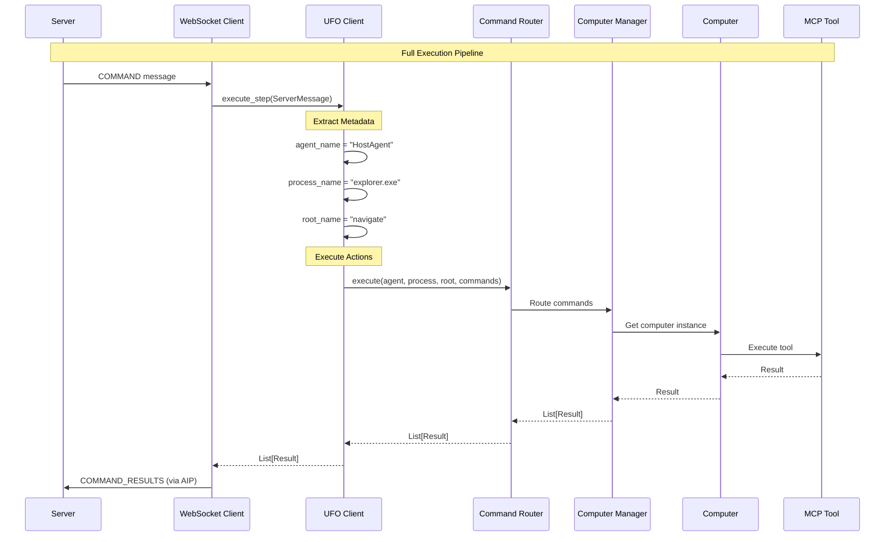

# 🎯 UFO Client

The **UFO Client** is the execution engine that receives commands from the server, routes them to appropriate tools via the CommandRouter, and aggregates results. It focuses on stateless command execution, delegating all decision-making to the server.

## 📋 Overview

The UFO Client bridges network communication and local tool execution.

**Key Capabilities:**

| Capability | Description | Implementation |
|------------|-------------|----------------|
| **Command Execution** | Processes server commands deterministically | `execute_step()`, `execute_actions()` |
| **Session Management** | Tracks session state and metadata | Session ID, agent/process/root names |
| **Result Aggregation** | Collects and structures tool execution results | Returns `List[Result]` |
| **Thread Safety** | Ensures safe concurrent execution | `asyncio.Lock` (`task_lock`) |
| **State Management** | Maintains agent, process, and root names | Property setters with validation |
| **Manager Coordination** | Orchestrates ComputerManager and MCPServerManager | `reset()` cascades to all managers |

The UFO Client follows a stateless execution philosophy:

- Executes commands sent by the server
- Routes commands to the appropriate tools
- Returns execution results
- Does **not** decide which commands to run
- Does **not** interpret user requests
- Does **not** store long-term state

**Architectural Position:**



## 🏗️ Architecture

The UFO Client has a minimal API surface—just initialization, execution, and reset.

### Component Structure



**Class Attributes:**

| Attribute | Type | Purpose |
|-----------|------|---------|
| `mcp_server_manager` | `MCPServerManager` | Manages MCP server lifecycle |
| `computer_manager` | `ComputerManager` | Manages computer instances (tool namespaces) |
| `command_router` | `CommandRouter` | Routes commands to appropriate computers |
| `task_lock` | `asyncio.Lock` | Ensures thread-safe execution |
| `client_id` | `str` | Unique identifier for this client (default: `"client_001"`) |
| `platform` | `str` | Platform type (`"windows"` or `"linux"`) - auto-detected if not provided |
| `session_id` | `Optional[str]` | Current session identifier |
| `agent_name` | `Optional[str]` | Active agent (e.g., `"HostAgent"`, `"AppAgent"`) |
| `process_name` | `Optional[str]` | Process context (e.g., `"notepad.exe"`) |
| `root_name` | `Optional[str]` | Root operation name |

## 🚀 Initialization

Creating a UFO Client requires two manager instances: MCPServerManager and ComputerManager.

```python
from ufo.client.ufo_client import UFOClient
from ufo.client.computer import ComputerManager
from ufo.client.mcp.mcp_server_manager import MCPServerManager

# 1. Initialize MCP Server Manager
mcp_server_manager = MCPServerManager()
mcp_server_manager.create_servers_from_config()  # Load from config_dev.yaml

# 2. Initialize Computer Manager
computer_manager = ComputerManager(
    ufo_config.to_dict(),
    mcp_server_manager
)

# 3. Create UFO Client
client = UFOClient(
    mcp_server_manager=mcp_server_manager,
    computer_manager=computer_manager,
    client_id="device_windows_001",
    platform="windows"
)
```

**Constructor Parameters:**

| Parameter | Type | Required | Default | Description |
|-----------|------|----------|---------|-------------|
| `mcp_server_manager` | `MCPServerManager` | ✅ Yes | - | MCP server lifecycle manager |
| `computer_manager` | `ComputerManager` | ✅ Yes | - | Computer instance manager |
| `client_id` | `str` | No | `"client_001"` | Unique client identifier |
| `platform` | `str` | No | Auto-detected | Platform type: `"windows"` or `"linux"` |

**Initialization Side Effects:**

1. Creates `CommandRouter` instance (delegates to ComputerManager)
2. Initializes `task_lock` (`asyncio.Lock()`)
3. Sets session state to `None` (session_id, agent_name, process_name, root_name)

## 📊 Session State Management

The UFO Client maintains contextual metadata for the current execution session.

### Session ID

**Purpose:** Unique identifier for the current task session

```python
# Set session ID (typically set by server)
client.session_id = "session_20251104_143022_abc123"

# Get session ID
current_session = client.session_id  # "session_20251104_143022_abc123"

# Clear session ID
client.reset()  # Sets session_id to None
```

**Validation:**

```python
# ✅ Valid
client.session_id = "session_123"
client.session_id = None

# ❌ Invalid - raises ValueError
client.session_id = 12345  # Not a string
```

### Agent Name

**Purpose:** Identifies the active agent (HostAgent, AppAgent, etc.)

```python
# Set agent name (from server message)
client.agent_name = "HostAgent"

# Get agent name
agent = client.agent_name  # "HostAgent"
```

**Common Agent Names:**

| Agent Name | Purpose |
|------------|---------|
| `HostAgent` | OS-level operations (start apps, manage files) |
| `AppAgent` | Application-specific operations (UI automation) |
| `FollowerAgent` | Follow predefined workflows |

### Process Name

**Purpose:** Identifies the process context

```python
# Set process name (from server message)
client.process_name = "notepad.exe"

# Get process name
process = client.process_name  # "notepad.exe"
```

**Usage:** Helps route commands to the correct application context

### Root Name

**Purpose:** Identifies the root operation name

```python
# Set root name (from server message)
client.root_name = "open_application"

# Get root name
root = client.root_name  # "open_application"
```

**Property Validation:**

All properties validate their inputs:

```python
try:
    client.agent_name = 123  # Not a string
except ValueError as e:
    print(e)  # "Agent name must be a string or None."
```

**Validation Table:**

| Property | Valid Types | Raises on Invalid |
|----------|-------------|-------------------|
| `session_id` | `str`, `None` | `ValueError` |
| `agent_name` | `str`, `None` | `ValueError` |
| `process_name` | `str`, `None` | `ValueError` |
| `root_name` | `str`, `None` | `ValueError` |

## ⚙️ Command Execution

### Execute Step (Main Entry Point)

`execute_step()` processes one complete server message, extracting metadata and executing all commands.

**Signature:**

```python
async def execute_step(self, response: ServerMessage) -> List[Result]:
    """
    Perform a single step execution.
    :param response: The ServerMessage instance to process.
    :return: A list of Result instances.
    """
```

**Execution Flow:**



**Implementation:**

```python
async def execute_step(self, response: ServerMessage) -> List[Result]:
    """Perform a single step execution."""
    
    # Extract metadata from server response
    self.agent_name = response.agent_name
    self.process_name = response.process_name
    self.root_name = response.root_name
    
    # Execute actions
    action_results = await self.execute_actions(response.actions)
    
    return action_results
```

**Example Usage:**

```python
from aip.messages import ServerMessage

# Receive server message
server_response = ServerMessage.model_validate_json(msg)

# Execute step
action_results = await client.execute_step(server_response)

# action_results is List[Result]
for result in action_results:
    print(f"Action: {result.action}, Status: {result.status}")
```

### Execute Actions

`execute_actions()` executes a list of commands via the CommandRouter.

**Signature:**

```python
async def execute_actions(self, commands: Optional[List[Command]]) -> List[Result]:
    """
    Execute the actions provided by the server.
    :param commands: List of actions to execute.
    :returns: Results of the executed actions.
    """
```

**Implementation:**

```python
async def execute_actions(self, commands: Optional[List[Command]]) -> List[Result]:
    """Execute the actions provided by the server."""
    
    action_results = []
    
    if commands:
        self.logger.info(f"Executing {len(commands)} actions in total")
        
        # Delegate to CommandRouter
        action_results = await self.command_router.execute(
            agent_name=self.agent_name,
            process_name=self.process_name,
            root_name=self.root_name,
            commands=commands
        )
    
    return action_results
```

**Example:**

```python
from aip.messages import Command

commands = [
    Command(
        action="click",
        parameters={"control_label": "Start", "x": 10, "y": 10}
    ),
    Command(
        action="type_text",
        parameters={"text": "notepad"}
    ),
    Command(
        action="press_key",
        parameters={"key": "enter"}
    )
]

# Execute all commands
results = await client.execute_actions(commands)

# results contains Result object for each command
```

**Command Execution Table:**

| Step | Action | Component |
|------|--------|-----------|
| 1 | Receive commands | UFO Client |
| 2 | Log command count | UFO Client |
| 3 | Call CommandRouter | UFO Client |
| 4 | Route to Computer | CommandRouter |
| 5 | Execute via MCP | Computer |
| 6 | Collect results | CommandRouter |
| 7 | Return results | UFO Client |

See [Computer Manager](./computer_manager.md) for command routing details.

## 🔄 State Reset

!!!warning "Critical for Multi-Task Execution"
    Always reset state between tasks to prevent data leakage between sessions.

**Signature:**

```python
def reset(self):
    """Reset session state and dependent managers."""
```

**Implementation:**

```python
def reset(self):
    """Reset session state and dependent managers."""
    
    # Clear session state
    self._session_id = None
    self._agent_name = None
    self._process_name = None
    self._root_name = None
    
    # Reset managers
    self.computer_manager.reset()
    self.mcp_server_manager.reset()
    
    self.logger.info("Client state has been reset.")
```

**Reset Cascade:**



**When to Reset:**

| Scenario | Why Reset |
|----------|-----------|
| **Before starting new task** | Clear previous task state |
| **On task completion** | Prepare for next task |
| **On task failure** | Clean up failed state |
| **On server disconnection** | Reset to known good state |

**Note:** The WebSocket client automatically calls `reset()` before starting new tasks:

```python
async with self.ufo_client.task_lock:
    self.ufo_client.reset()  # Automatic
    await self.task_protocol.send_task_request(...)
```

## 🔒 Thread Safety

The UFO Client uses `asyncio.Lock` to prevent concurrent state modifications.

**Lock Implementation:**

```python
# In UFOClient.__init__
self.task_lock = asyncio.Lock()
```

**Usage in WebSocket Client:**

```python
# In WebSocket client
async with client.task_lock:
    client.reset()
    await client.execute_step(server_response)
```

**Protected Operations:**

| Operation | Protected By | Reason |
|-----------|--------------|--------|
| Session state modifications | `task_lock` | Prevent race conditions |
| Command execution | `task_lock` | Ensure one task at a time |
| State reset | `task_lock` | Atomic reset operation |

!!!warning "Single Task Execution"
    The lock ensures only **one task executes at a time**. Attempting concurrent execution will block until the lock is released.

## 📋 Complete Execution Pipeline



## ⚠️ Error Handling

### Command Execution Errors

Individual command failures are captured in `Result` objects, not thrown as exceptions.

**Error Result Structure:**

```python
from aip.messages import Result, ResultStatus

error_result = Result(
    action="click",
    status=ResultStatus.ERROR,
    error_message="Control not found",
    observation="Failed to locate control with label 'Start'"
)
```

**Handling Execution Errors:**

```python
try:
    results = await client.execute_actions(commands)
    
    # Check each result
    for result in results:
        if result.status == ResultStatus.ERROR:
            logger.error(f"Action {result.action} failed: {result.error_message}")
        else:
            logger.info(f"Action {result.action} succeeded")
            
except Exception as e:
    # Unexpected error (not tool failure)
    logger.error(f"Command execution failed: {e}", exc_info=True)
```

### Property Validation Errors

```python
try:
    client.session_id = 12345  # Invalid type
except ValueError as e:
    logger.error(f"Invalid session ID: {e}")
    # ValueError: Session ID must be a string or None.
```

**Error Handling Table:**

| Error Type | Raised By | Handling |
|------------|-----------|----------|
| Tool execution error | MCP tools | Captured in `Result.error_message` |
| Property validation error | Property setters | `ValueError` exception |
| Unexpected errors | Any component | Logged, may propagate |

## 📝 Logging

The UFO Client logs all major events for debugging and monitoring.

**Log Examples:**

**Initialization:**

```log
INFO - UFO Client initialized for platform: windows
```

**Session State Changes:**

```log
INFO - Session ID set to: session_20251104_143022_abc123
INFO - Agent name set to: HostAgent
INFO - Process name set to: notepad.exe
INFO - Root name set to: open_application
```

**Execution:**

```log
INFO - Executing 5 actions in total
```

**Reset:**

```log
INFO - Client state has been reset.
```

**Log Level Recommendations:**

| Environment | Level | Rationale |
|-------------|-------|-----------|
| Development | `DEBUG` | See all operations |
| Staging | `INFO` | Track execution flow |
| Production | `INFO` | Monitor without spam |
| Troubleshooting | `DEBUG` | Diagnose issues |

## 💡 Usage Example

### Complete Workflow

This example shows how to use the UFO Client in a typical workflow.

```python
import asyncio
from ufo.client.ufo_client import UFOClient
from aip.messages import ServerMessage, Command, ServerMessageType, TaskStatus

async def main():
    # 1. Initialize client
    client = UFOClient(
        mcp_server_manager=mcp_manager,
        computer_manager=computer_manager,
        client_id="device_windows_001",
        platform="windows"
    )
    
    # 2. Simulate server message
    server_msg = ServerMessage(
        type=ServerMessageType.COMMAND,
        session_id="session_123",
        response_id="resp_456",
        agent_name="HostAgent",
        process_name="explorer.exe",
        root_name="navigate_folder",
        actions=[
            Command(action="click", parameters={"label": "File"}),
            Command(action="click", parameters={"label": "New Folder"})
        ],
        status=TaskStatus.PROCESSING
    )
    
    # 3. Execute step
    async with client.task_lock:  # Thread-safe execution
        results = await client.execute_step(server_msg)
    
    # 4. Process results
    for result in results:
        print(f"Action: {result.action}")
        print(f"Status: {result.status}")
        print(f"Observation: {result.observation}")
        if result.status == ResultStatus.ERROR:
            print(f"Error: {result.error_message}")
    
    # 5. Reset for next task
    client.reset()

asyncio.run(main())
```

## ✅ Best Practices

### Development Best Practices

**1. Always Reset Between Tasks**

```python
async with client.task_lock:
    client.reset()  # Clear previous state
    await client.execute_step(new_server_response)
```

**2. Use Property Setters (Not Direct Assignment)**

```python
# ✅ Good - validates input
client.session_id = "session_123"

# ❌ Bad - bypasses validation
client._session_id = "session_123"
```

**3. Log Execution Progress**

```python
self.logger.info(f"Executing {len(commands)} actions for {self.agent_name}")
```

**4. Handle Errors Gracefully**

```python
try:
    results = await client.execute_actions(commands)
except Exception as e:
    self.logger.error(f"Execution failed: {e}", exc_info=True)
    # Error is also captured in results
```

### Production Best Practices

**1. Use Thread Locks Consistently**

```python
# Always use task_lock for state operations
async with client.task_lock:
    client.reset()
    results = await client.execute_step(msg)
```

**2. Monitor Execution Times**

```python
import time

start = time.time()
results = await client.execute_actions(commands)
duration = time.time() - start

if duration > 60:  # Alert if > 1 minute
    logger.warning(f"Slow execution: {duration}s for {len(commands)} commands")
```

**3. Validate Results**

```python
# Check for failures
failed_actions = [r for r in results if r.status == ResultStatus.ERROR]
if failed_actions:
    logger.error(f"{len(failed_actions)} actions failed")
    # Report to monitoring system
```

## 🔗 Integration Points

### WebSocket Client Integration

The WebSocket client uses UFO Client for all command execution.

**Integration:**

```python
# In WebSocket client
action_results = await self.ufo_client.execute_step(server_response)
```

See [WebSocket Client](./websocket_client.md) for communication details.

### Command Router Integration

The UFO Client delegates all execution to the CommandRouter.

**Integration:**

```python
action_results = await self.command_router.execute(
    agent_name=self.agent_name,
    process_name=self.process_name,
    root_name=self.root_name,
    commands=commands
)
```

See [Computer Manager](./computer_manager.md) for routing details.

### Computer Manager Integration

The Computer Manager maintains computer instances for tool execution.

**Integration:**

```python
# Reset cascades to computer manager
self.computer_manager.reset()
```

See [Computer Manager](./computer_manager.md) for management details.

### MCP Server Manager Integration

The MCP Server Manager handles MCP server creation and cleanup.

**Integration:**

```python
# Reset cascades to MCP server manager
self.mcp_server_manager.reset()
```

See [MCP Integration](./mcp_integration.md) for MCP details.

## 🚀 Next Steps

**Continue Learning**

1. **Understand Network Communication** - Learn how the WebSocket client uses UFO Client: [WebSocket Client](./websocket_client.md)

2. **Explore Command Routing** - See how commands are routed to the right tools: [Computer Manager](./computer_manager.md)

3. **Study Device Profiling** - Understand device information collection: [Device Info Provider](./device_info.md)

4. **Learn About MCP Integration** - Deep dive into MCP server management: [MCP Integration](./mcp_integration.md)

5. **Master AIP Messages** - Understand message structures: [AIP Messages](../aip/messages.md)