# 🔌 WebSocket Client

The **WebSocket Client** implements the **AIP (Agent Interaction Protocol)** for reliable, bidirectional communication between device clients and the Agent Server. It provides the low-level communication infrastructure for UFO device clients.

## 📋 Overview

The WebSocket client handles all network communication aspects, allowing the UFO Client to focus on task execution.

**Key Responsibilities:**

| Capability | Description | Implementation |
|------------|-------------|----------------|
| **Connection Management** | Persistent WebSocket connection with automatic retry | Exponential backoff, configurable max retries |
| **AIP Protocol Implementation** | Structured message handling via Registration, Heartbeat, Task Execution | Three protocol handlers |
| **Device Registration** | Automatic registration with device profile on connect | Push model (proactive info collection) |
| **Heartbeat Monitoring** | Regular keepalive messages for connection health | Configurable interval (default: 30s) |
| **Message Routing** | Dispatch incoming messages to appropriate handlers | Type-based routing |
| **Error Handling** | Graceful error recovery and reporting | Retry logic, error propagation via AIP |

**Message Flow Overview:**


## 🏗️ Architecture

The WebSocket client is organized into distinct layers for connection management, protocol handling, and message routing.

### Component Structure


### Class Structure

| Component | Type | Purpose |
|-----------|------|---------|
| **UFOWebSocketClient** | Main Class | Orchestrates all WebSocket communication |
| **WebSocketTransport** | AIP Component | Low-level WebSocket send/receive |
| **RegistrationProtocol** | AIP Protocol | Client registration messages |
| **HeartbeatProtocol** | AIP Protocol | Connection keepalive messages |
| **TaskExecutionProtocol** | AIP Protocol | Task request/result messages |

---

## 🔄 Connection Lifecycle

### Initialization & Connection Flow


### Initialization Code

Creating a WebSocket client:

```python
from ufo.client.websocket import UFOWebSocketClient
from ufo.client.ufo_client import UFOClient

# Create UFO client (execution engine)
ufo_client = UFOClient(
    mcp_server_manager=mcp_manager,
computer_manager=computer_manager,
    client_id="device_windows_001",
    platform="windows"
)

# Create WebSocket client (communication layer)
ws_client = UFOWebSocketClient(
    ws_url="ws://localhost:5000/ws",
    ufo_client=ufo_client,
    max_retries=3,    # Default: 3 attempts
    timeout=120       # Heartbeat interval in seconds (default: 120)
)

# Connect and start listening (blocking call)
await ws_client.connect_and_listen()
```

**Constructor Parameters:**

| Parameter | Type | Default | Description |
|-----------|------|---------|-------------|
| `ws_url` | `str` | Required | WebSocket server URL (e.g., `ws://localhost:5000/ws`) |
| `ufo_client` | `UFOClient` | Required | UFO client instance for command execution |
| `max_retries` | `int` | `3` | Maximum connection retry attempts |
| `timeout` | `float` | `120` | Heartbeat interval in seconds (passed to `heartbeat_loop()`) |

**Note:** The `timeout` parameter is passed to `heartbeat_loop(interval)` to control heartbeat frequency. While `heartbeat_loop()` has a default of 30s in its signature, the client constructor uses 120s which is passed when calling the method.

### Connection Establishment Details

The client uses specific WebSocket parameters optimized for long-running task execution:

**WebSocket Connection Parameters:**

```python
async with websockets.connect(
    self.ws_url,
    ping_interval=20,       # Send WebSocket ping every 20 seconds
    ping_timeout=180,       # Wait up to 3 minutes for pong response
    close_timeout=10,       # 10 second close handshake timeout
    max_size=100 * 1024 * 1024  # 100MB max message size
) as ws:
    # Connection established
```

**Parameter Rationale:**

| Parameter | Value | Reason |
|-----------|-------|--------|
| `ping_interval` | **20 seconds** | Frequent keepalive to detect connection loss quickly |
| `ping_timeout` | **180 seconds** | Tolerates long-running operations (e.g., complex tasks) |
| `close_timeout` | **10 seconds** | Quick cleanup on intentional disconnect |
| `max_size` | **100 MB** | Supports large screenshots, logs, file transfers |

**Note:** The 180-second `ping_timeout` ensures the connection stays alive during lengthy tool executions (up to 100 minutes per tool).

## 📝 Registration Flow

### Device Information Collection

UFO uses a **push model** for device information: clients proactively send their profile during registration, rather than waiting for the server to request it. This reduces latency for constellation (multi-client) scenarios.

**Device Info Collection:**

```python
from ufo.client.device_info_provider import DeviceInfoProvider

# Collect comprehensive system information
system_info = DeviceInfoProvider.collect_system_info(
    client_id=self.ufo_client.client_id,
    custom_metadata=None  # Server adds custom metadata if configured
)

# System info includes:
# - platform (windows/linux/darwin)
# - os_version
# - cpu_count
# - memory_total_gb
# - hostname
# - ip_address
# - supported_features
# - platform_type
```

**Metadata Structure:**

```python
metadata = {
    "system_info": {
        "platform": "windows",
        "os_version": "Windows-10-10.0.19045",
        "cpu_count": 8,
        "memory_total_gb": 16.0,
        "hostname": "DESKTOP-ABC123",
        "ip_address": "192.168.1.100",
        # ... additional fields
    },
    "registration_time": "2025-11-05T14:30:00.123Z"
}
```

See [Device Info Provider](./device_info.md) for complete field descriptions.

### Registration Message Exchange


**Registration Code:**

```python
async def register_client(self):
    """Send client_id and device system information to server."""
    
    # Collect device info
    try:
        system_info = DeviceInfoProvider.collect_system_info(
            self.ufo_client.client_id,
            custom_metadata=None
        )
        metadata = {
            "system_info": system_info.to_dict(),
            "registration_time": datetime.datetime.now(
                datetime.timezone.utc
            ).isoformat(),
        }
        self.logger.info(
            f"[WS] \[AIP] Collected device info: platform={system_info.platform}, "
            f"cpu={system_info.cpu_count}, memory={system_info.memory_total_gb}GB"
        )
    except Exception as e:
        self.logger.error(f"[WS] \[AIP] Error collecting device info: {e}")
        # Continue with minimal metadata
        metadata = {
            "registration_time": datetime.datetime.now(
                datetime.timezone.utc
            ).isoformat(),
        }
    
    # Use AIP RegistrationProtocol
    success = await self.registration_protocol.register_as_device(
        device_id=self.ufo_client.client_id,
        metadata=metadata,
        platform=self.ufo_client.platform
    )
    
    if success:
        self.connected_event.set()  # Signal successful registration
        self.logger.info(f"[WS] \[AIP] ✅ Successfully registered as {self.ufo_client.client_id}")
    else:
        self.logger.error(f"[WS] \[AIP] ❌ Failed to register as {self.ufo_client.client_id}")
        raise RuntimeError(f"Registration failed for {self.ufo_client.client_id}")
```

### Registration Outcomes

**Success Scenario:**

```log
INFO - [WS] \[AIP] Collected device info: platform=windows, cpu=8, memory=16.0GB
INFO - [WS] \[AIP] Attempting to register as device_windows_001
INFO - [WS] \[AIP] ✅ Successfully registered as device_windows_001
```

- `connected_event` is set (allows task requests)
- Client enters message handling loops

**Failure Scenario:**

```log
ERROR - [WS] \[AIP] ❌ Failed to register as device_windows_001
RuntimeError: Registration failed for device_windows_001
```

- Connection is closed
- Retry logic engages (exponential backoff)

**Common Failure Causes:**

| Cause | Server Behavior | Client Action |
|-------|----------------|---------------|
| Duplicate client ID | Reject registration | Change client ID, retry |
| Server capacity limit | Reject registration | Wait and retry later |
| Network interruption | Timeout | Automatic retry with backoff |
| Invalid platform | Reject registration | Fix platform parameter |

---

## 💓 Heartbeat Mechanism

Heartbeats prove the client is still alive and responsive, allowing the server to detect disconnected clients quickly.

### Heartbeat Loop Implementation

**Default Configuration:**

| Parameter | Value | Configurable |
|-----------|-------|--------------|
| **Interval** | 30 seconds | ✅ Yes (function parameter) |
| **Protocol** | AIP HeartbeatProtocol | No |
| **Error Handling** | Break loop on failure | No |

**Heartbeat Code:**

```python
async def heartbeat_loop(self, interval: float = 30) -> None:
    """
    Send periodic heartbeat messages using AIP HeartbeatProtocol.
    :param interval: Interval between heartbeats in seconds (default: 30)
    """
    while True:
        await asyncio.sleep(interval)
        try:
            await self.heartbeat_protocol.send_heartbeat(
                self.ufo_client.client_id
            )
            self.logger.debug("[WS] \[AIP] Heartbeat sent")
        except (ConnectionError, IOError) as e:
            self.logger.debug(
                f"[WS] \[AIP] Heartbeat failed (connection closed): {e}"
            )
            break  # Exit loop if connection is closed
```

**Customizing Heartbeat Interval:**

Adjust the interval when calling the heartbeat loop:

```python
# In handle_messages():
await asyncio.gather(
    self.recv_loop(),
    self.heartbeat_loop(interval=60)  # Custom 60-second interval
)
```

### Heartbeat Message Structure

**Client → Server (Heartbeat):**

```json
{
  "type": "HEARTBEAT",
  "client_id": "device_windows_001",
  "timestamp": "2025-11-05T14:30:22.123Z"
}
```

**Server → Client (Heartbeat Ack - Optional):**

```json
{
  "type": "HEARTBEAT",
  "timestamp": "2025-11-05T14:30:22.456Z"
}
```

### Heartbeat State Diagram


---

## 📨 Message Handling

### Message Router

All incoming messages are validated against the AIP schema and routed based on their `type` field.

**Message Dispatcher Code:**

```python
async def handle_message(self, msg: str):
    """Dispatch messages based on their type."""
    try:
        # Parse and validate message
        data = ServerMessage.model_validate_json(msg)
        msg_type = data.type
        
        self.logger.info(f"[WS] Received message: {data}")
        
        # Route by type
        if msg_type == ServerMessageType.TASK:
            await self.start_task(data.user_request, data.task_name)
        elif msg_type == ServerMessageType.HEARTBEAT:
            self.logger.info("[WS] Heartbeat received")
        elif msg_type == ServerMessageType.TASK_END:
            await self.handle_task_end(data)
        elif msg_type == ServerMessageType.ERROR:
            self.logger.error(f"[WS] Server error: {data.error}")
        elif msg_type == ServerMessageType.COMMAND:
            await self.handle_commands(data)
        else:
            self.logger.warning(f"[WS] Unknown message type: {msg_type}")
            
    except Exception as e:
        self.logger.error(f"[WS] Error handling message: {e}", exc_info=True)
```

**Message Type Routing:**

| Server Message Type | Handler Method | Purpose |
|---------------------|----------------|---------|
| `TASK` | `start_task()` | Begin new task execution |
| `COMMAND` | `handle_commands()` | Execute specific commands |
| `TASK_END` | `handle_task_end()` | Process task completion |
| `HEARTBEAT` | Log only | Acknowledge keepalive |
| `ERROR` | Log error | Handle server-side errors |
| Unknown | Log warning | Ignore unrecognized types |

### Task Start Handler

!!!warning "Single Task Execution"
    The client executes **only one task at a time**. New task requests are ignored if a task is currently running.

**Task Start Flow:**

```mermaid
sequenceDiagram
    participant Server
    participant WSC as WebSocket Client
    participant UFC as UFO Client
    participant Task as Task Coroutine
    
    Server->>WSC: TASK message<br/>{user_request, task_name}
    
    alt Current Task Running
        WSC->>WSC: Check current_task.done()
        WSC->>Server: ⚠️ Ignore (log warning)
    else No Task Running
        WSC->>Task: Create task_loop() coroutine
        Task->>UFC: Reset session state
        Task->>Task: Build metadata (platform)
        Task->>Server: TASK_REQUEST (via AIP)
        Server-->>Task: Acknowledgment
        Task->>WSC: Task coroutine running
    end
```



**Task Start Code:**

```python
async def start_task(self, request_text: str, task_name: str | None):
    """Start a new task based on server request."""
    
    # Check if task is already running
    if self.current_task is not None and not self.current_task.done():
        self.logger.warning(
            f"[WS] Task {self.session_id} is still running, ignoring new task"
        )
        return
    
    self.logger.info(f"[WS] Starting task: {request_text}")
    
    async def task_loop():
        try:
            async with self.ufo_client.task_lock:
                self.ufo_client.reset()  # Clear previous session state
                
                # Build metadata with platform info
                metadata = {}
                if self.ufo_client.platform:
                    metadata["platform"] = self.ufo_client.platform
                
                # Send task request via AIP
                await self.task_protocol.send_task_request(
                    request=request_text,
                    task_name=task_name if task_name else str(uuid4()),
                    session_id=self.ufo_client.session_id,
                    client_id=self.ufo_client.client_id,
                    metadata=metadata if metadata else None
                )
                
                self.logger.info(
                    f"[WS] \[AIP] Sent task request with platform: {self.ufo_client.platform}"
                )
        except Exception as e:
            self.logger.error(f"[WS] \[AIP] Error sending task request: {e}")
            # Send error via AIP
            error_msg = ClientMessage(
                type=ClientMessageType.ERROR,
                error=str(e),
                client_id=self.ufo_client.client_id,
                timestamp=datetime.datetime.now(datetime.timezone.utc).isoformat()
            )
            await self.transport.send(error_msg.model_dump_json().encode())
    
    # Create task coroutine
    self.current_task = asyncio.create_task(task_loop())
```

### Command Execution Handler

The server sends specific commands (tool calls) to execute, and the client returns results.

**Command Execution Flow:**

```python
async def handle_commands(self, server_response: ServerMessage):
    """
    Handle commands received from server.
    Uses AIP TaskExecutionProtocol to send results back.
    """
    response_id = server_response.response_id
    task_status = server_response.status
    self.session_id = server_response.session_id
    
    # Execute commands via UFO Client
    action_results = await self.ufo_client.execute_step(server_response)
    
    # Send results via AIP
    await self.task_protocol.send_task_result(
        session_id=self.session_id,
        prev_response_id=response_id,
        action_results=action_results,
        status=task_status,
        client_id=self.ufo_client.client_id
    )
    
    self.logger.info(
        f"[WS] \[AIP] Sent client result for prev_response_id: {response_id}"
    )
    
    # Check for task completion
    if task_status in [TaskStatus.COMPLETED, TaskStatus.FAILED]:
        await self.handle_task_end(server_response)
```

**Execution Steps:**

1. **Extract Metadata**: Get `response_id`, `task_status`, `session_id`
2. **Execute Commands**: Delegate to `ufo_client.execute_step()`
3. **Send Results**: Use `TaskExecutionProtocol.send_task_result()`
4. **Check Completion**: Handle task end if status is terminal

### Task Completion Handler

```python
async def handle_task_end(self, server_response: ServerMessage):
    """Handle task end messages from server."""
    
    if server_response.status == TaskStatus.COMPLETED:
        self.logger.info(
            f"[WS] Task {self.session_id} completed, result: {server_response.result}"
        )
    elif server_response.status == TaskStatus.FAILED:
        self.logger.info(
            f"[WS] Task {self.session_id} failed, with error: {server_response.error}"
        )
    else:
        self.logger.warning(
            f"[WS] Unknown task status for {self.session_id}: {server_response.status}"
        )
```

---

## ⚠️ Error Handling

### Connection Error Recovery

The client automatically retries failed connections using exponential backoff to avoid overwhelming the server.

**Retry Logic:**

```python
async def connect_and_listen(self):
    """Connect with automatic retry."""
    while self.retry_count < self.max_retries:
        try:
            async with websockets.connect(...) as ws:
                # Initialize protocols
                self.transport = WebSocketTransport(ws)
                self.registration_protocol = RegistrationProtocol(self.transport)
                self.heartbeat_protocol = HeartbeatProtocol(self.transport)
                self.task_protocol = TaskExecutionProtocol(self.transport)
                
                await self.register_client()
                self.retry_count = 0  # Reset on successful connection
                await self.handle_messages()
                
        except (websockets.ConnectionClosedError, websockets.ConnectionClosedOK) as e:
            self.logger.error(f"[WS] Connection closed: {e}")
            self.retry_count += 1
            await self._maybe_retry()
            
        except Exception as e:
            self.logger.error(f"[WS] Unexpected error: {e}", exc_info=True)
            self.retry_count += 1
            await self._maybe_retry()
    
    self.logger.error("[WS] Max retries reached. Exiting.")
```

**Exponential Backoff:**

```python
async def _maybe_retry(self):
    """Exponential backoff before retry."""
    if self.retry_count < self.max_retries:
        wait_time = 2 ** self.retry_count  # 2s, 4s, 8s, 16s...
        self.logger.info(f"[WS] Retrying in {wait_time}s...")
        await asyncio.sleep(wait_time)
```

**Retry Schedule:**

| Attempt | Wait Time | Cumulative Wait |
|---------|-----------|-----------------|
| 1st retry | 2 seconds | 2s |
| 2nd retry | 4 seconds | 6s |
| 3rd retry | 8 seconds | 14s |
| **Max retries reached** | Exit | - |

**Default Max Retries = 3**

Based on source code: `max_retries: int = 3` in constructor. Increase for unreliable networks:

```python
ws_client = UFOWebSocketClient(
    ws_url="ws://...",
    ufo_client=ufo_client,
    max_retries=10  # More resilient
)
```

### Message Parsing Errors

**Graceful Error Handling:**

```python
try:
    data = ServerMessage.model_validate_json(msg)
    # Process message...
except Exception as e:
    self.logger.error(f"[WS] Error handling message: {e}", exc_info=True)
    # Message is dropped, client continues listening
```

Message parsing errors don't crash the client—the error is logged and the receive loop continues.

### Registration Error Handling

**Fallback to Minimal Metadata:**

```python
try:
    system_info = DeviceInfoProvider.collect_system_info(...)
    metadata = {"system_info": system_info.to_dict()}
except Exception as e:
    self.logger.error(f"[WS] \[AIP] Error collecting device info: {e}")
    # Continue with minimal metadata
    metadata = {
        "registration_time": datetime.datetime.now(datetime.timezone.utc).isoformat()
    }
```

If device info collection fails, registration still proceeds with minimal metadata (timestamp only).

---

## 🔌 AIP Protocol Integration

The WebSocket client uses three specialized AIP protocols for different communication patterns.

### 1. Registration Protocol

**Purpose:** Client registration and device profile exchange

```python
from aip.protocol.registration import RegistrationProtocol

self.registration_protocol = RegistrationProtocol(self.transport)

# Register as device
success = await self.registration_protocol.register_as_device(
    device_id="device_windows_001",
    metadata={"system_info": {...}},
    platform="windows"
)
```

**Key Methods:**

| Method | Parameters | Returns | Purpose |
|--------|------------|---------|---------|
| `register_as_device()` | `device_id`, `metadata`, `platform` | `bool` | Register client as device |

See [AIP Registration Protocol](../aip/protocols.md#registration-protocol) for message format details.

### 2. Heartbeat Protocol

**Purpose:** Connection keepalive and health monitoring

```python
from aip.protocol.heartbeat import HeartbeatProtocol

self.heartbeat_protocol = HeartbeatProtocol(self.transport)

# Send heartbeat
await self.heartbeat_protocol.send_heartbeat("device_windows_001")
```

**Key Methods:**

| Method | Parameters | Returns | Purpose |
|--------|------------|---------|---------|
| `send_heartbeat()` | `client_id` | `None` | Send keepalive message |

See [AIP Heartbeat Protocol](../aip/protocols.md#heartbeat-protocol) for message format details.

### 3. Task Execution Protocol

**Purpose:** Task request and result exchange

```python
from aip.protocol.task_execution import TaskExecutionProtocol

self.task_protocol = TaskExecutionProtocol(self.transport)

# Send task request
await self.task_protocol.send_task_request(
    request="Open Notepad",
    task_name="task_001",
    session_id=None,
    client_id="device_windows_001",
    metadata={"platform": "windows"}
)

# Send task result
await self.task_protocol.send_task_result(
    session_id="session_123",
    prev_response_id="resp_456",
    action_results=[...],
    status=TaskStatus.COMPLETED,
    client_id="device_windows_001"
)
```

**Key Methods:**

| Method | Parameters | Returns | Purpose |
|--------|------------|---------|---------|
| `send_task_request()` | `request`, `task_name`, `session_id`, `client_id`, `metadata` | `None` | Request task execution |
| `send_task_result()` | `session_id`, `prev_response_id`, `action_results`, `status`, `client_id` | `None` | Return execution results |

See [AIP Task Execution Protocol](../aip/protocols.md#task-execution-protocol) for message format details.

---

## 🔍 Connection State Management

### State Checking

Use `is_connected()` to check if the client is ready to send messages.

**Implementation:**

```python
def is_connected(self) -> bool:
    """Check if WebSocket is connected and registered."""
    return (
        self.connected_event.is_set()  # Registration succeeded
        and self._ws is not None       # WebSocket exists
        and not self._ws.closed        # WebSocket is open
    )
```

**Usage Example:**

```python
if ws_client.is_connected():
    await ws_client.start_task("Open Calculator", "task_calc")
else:
    logger.error("Not connected to server - cannot send task")
```

### Connected Event

The `connected_event` is an `asyncio.Event` that signals successful registration.

**Usage Pattern:**

```python
# Wait for connection before sending requests
await ws_client.connected_event.wait()

# Now safe to send task requests
await ws_client.start_task("Open Notepad", "task_notepad")
```

**Event Lifecycle:**

| State | Event Status | Meaning |
|-------|--------------|---------|
| Initial | Not set | Client not connected |
| Connecting | Not set | WebSocket connecting, registering |
| Registered | **Set** | ✅ Ready to send/receive messages |
| Disconnected | Cleared | Connection lost, will retry |

## ✅ Best Practices

### Development Best Practices

**1. Enable DEBUG Logging**

```python
import logging
logging.basicConfig(level=logging.DEBUG)
```

**Output:**
```log
DEBUG - [WS] [AIP] Heartbeat sent
DEBUG - [WS] [AIP] Heartbeat failed (connection closed): ...
INFO - [WS] Received message: ServerMessage(type='COMMAND', ...)
```

**2. Test Connection Before Full Integration**

```python
# Test just connection and registration
ws_client = UFOWebSocketClient(ws_url, ufo_client)
await ws_client.connect_and_listen()  # Should register successfully
```

**3. Handle Connection Loss Gracefully**

```python
try:
    await ws_client.connect_and_listen()
except Exception as e:
    logger.error(f"WebSocket client error: {e}")
    # Implement recovery (e.g., alert, restart)
```

### Production Best Practices

**1. Use Appropriate Retry Limits**

For production networks with occasional instability:

```python
ws_client = UFOWebSocketClient(
    ws_url="wss://production-server.com/ws",
    ufo_client=ufo_client,
    max_retries=10  # More retries for resilience
)
```

**2. Monitor Connection Health**

Log heartbeat success/failure for alerting:

```python
# In heartbeat_loop (add custom monitoring):
try:
    await self.heartbeat_protocol.send_heartbeat(...)
    self.logger.debug("[WS] ✅ Heartbeat sent successfully")
    # Update metrics: heartbeat_success_count++
except Exception as e:
    self.logger.error(f"[WS] ❌ Heartbeat failed: {e}")
    # Trigger alert: connection_health_alert()
```

**3. Use Secure WebSocket (WSS)**

```python
# Production: Encrypted WebSocket
ws_client = UFOWebSocketClient(
    ws_url="wss://ufo-server.company.com/ws",  # WSS, not WS
    ufo_client=ufo_client
)
```

**4. Clean State on Reconnection**

The client automatically resets state:

```python
async with self.ufo_client.task_lock:
    self.ufo_client.reset()  # Clears session state
    # Send new task request
```

### Error Handling Best Practices

!!!warning "Defensive Programming"
    
    **1. Expect Transient Failures**
    ```python
    # Increase retries for unreliable networks
    max_retries=10
    
    # Monitor retry count in logs
    self.logger.info(f"[WS] Retry {self.retry_count}/{self.max_retries}")
    ```
    
    **2. Validate Messages Before Processing**
    ```python
    # Already handled by Pydantic in source code:
    data = ServerMessage.model_validate_json(msg)  # Raises on invalid
    ```
    
    **3. Report Errors via AIP**
    ```python
    # Send structured error messages back to server
    error_msg = ClientMessage(
        type=ClientMessageType.ERROR,
        error=str(e),
        client_id=self.ufo_client.client_id,
        timestamp=datetime.datetime.now(datetime.timezone.utc).isoformat()
    )
    await self.transport.send(error_msg.model_dump_json().encode())
    ```

---

## 🔗 Integration Points

### UFO Client Integration

The WebSocket client delegates all command execution to the UFO Client.

**Execution Flow:**

```python
# WebSocket client receives command
action_results = await self.ufo_client.execute_step(server_response)
```

**Integration:**

| WebSocket Client Role | UFO Client Role |
|----------------------|-----------------|
| Receive commands from server | Execute commands via MCP tools |
| Parse server messages | Manage computer/tool registry |
| Send results back | Collect execution results |
| Handle connection errors | Handle execution errors |

See [UFO Client](./ufo_client.md) for execution details.

### Device Info Provider Integration

Device information is collected once during registration.

**Integration:**

```python
from ufo.client.device_info_provider import DeviceInfoProvider

system_info = DeviceInfoProvider.collect_system_info(
    client_id=self.ufo_client.client_id,
    custom_metadata=None
)
```

See [Device Info Provider](./device_info.md) for profiling details.

### AIP Transport Integration

All messages go through the WebSocket transport layer.

**Transport Creation:**

```python
from aip.transport.websocket import WebSocketTransport

self.transport = WebSocketTransport(ws)
```

**Transport Usage:**

- **Protocols use transport** for sending messages
- **Direct transport access** for error messages

See [AIP Transport Layer](../aip/transport.md) for transport details.

## 🚀 Next Steps

**Continue Learning**

1. **Connect Your Client** - Follow the step-by-step guide: [Quick Start Guide](./quick_start.md)

2. **Understand Command Execution** - Learn how the UFO Client executes commands: [UFO Client Documentation](./ufo_client.md)

3. **Explore Device Profiling** - See what device information is collected: [Device Info Provider](./device_info.md)

4. **Master the AIP Protocol** - Deep dive into message formats: [AIP Protocol Guide](../aip/protocols.md)

5. **Study Server-Side Registration** - Understand how the server handles registration: [Server Overview](../server/overview.md)
