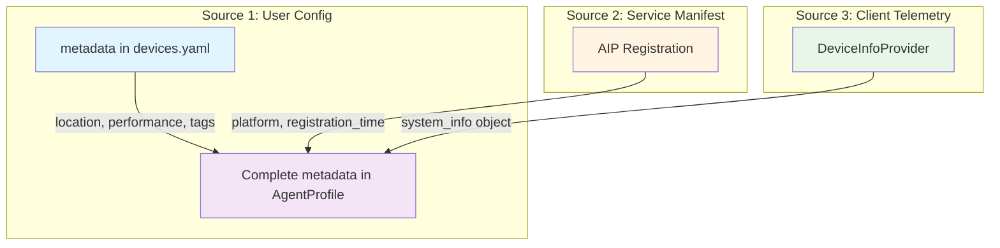

# Galaxy Devices Configuration

Device configuration in **devices.yaml** defines the constellation's device agents, providing device identity, capabilities, metadata, and connection parameters for each agent in the constellation.

---

## Overview

The **devices.yaml** configuration file defines the **devices array** for the Galaxy constellation system. It provides:

- Device identity and endpoint information
- User-specified capabilities
- Custom metadata and preferences
- Connection and retry parameters

**Constellation vs Device Configuration:**

- **devices.yaml** - Defines individual device agents (this document)
- **constellation.yaml** - Defines constellation-wide runtime settings
- See [Galaxy Constellation Configuration](./galaxy_constellation.md) for runtime settings

**Configuration Flow:**


---

## 📁 File Location

**Standard Location:**

```
UFO2/
├── config/
�?  └── galaxy/
�?      ├── devices.yaml           # �?Device definitions (this file)
�?      ├── constellation.yaml     # �?Runtime settings
�?      └── agent.yaml.template    # �?Agent LLM configuration template
```

**Loading in Code:**

```python
from galaxy.client.device_manager import ConstellationDeviceManager
import yaml

# Load device configuration
with open("config/galaxy/devices.yaml", "r", encoding="utf-8") as f:
    devices_config = yaml.safe_load(f)

# Load constellation configuration
with open("config/galaxy/constellation.yaml", "r", encoding="utf-8") as f:
    constellation_config = yaml.safe_load(f)

# Initialize manager with constellation settings
manager = ConstellationDeviceManager(
    task_name=constellation_config.get("CONSTELLATION_ID", "default"),
    heartbeat_interval=constellation_config.get("HEARTBEAT_INTERVAL", 30.0),
    reconnect_delay=constellation_config.get("RECONNECT_DELAY", 5.0)
)

# Register devices from devices.yaml
for device_config in devices_config["devices"]:
    await manager.register_device(
        device_id=device_config["device_id"],
        server_url=device_config["server_url"],
        os=device_config.get("os"),
        capabilities=device_config.get("capabilities", []),
        metadata=device_config.get("metadata", {}),
        max_retries=device_config.get("max_retries", 5),
        auto_connect=device_config.get("auto_connect", True)
    )
```

---

## 📝 Configuration Schema

### File Structure

```yaml
# Device Configuration - YAML Format
# Defines devices for the constellation
# Runtime settings are configured in constellation.yaml

devices:                             # List of device configurations
  - device_id: string                # Unique device identifier
    server_url: string               # WebSocket URL of device agent
    os: string                       # Operating system
    capabilities: list[string]       # Device capabilities
    metadata: dict                   # Custom metadata
    max_retries: int                 # Connection retry limit
    auto_connect: bool               # Auto-connect on registration
```

---

### Device Configuration Fields

#### Required Fields

| Field | Type | Description | Example |
|-------|------|-------------|---------|
| `device_id` | `string` | **Unique device identifier** | `"windowsagent"`, `"linux_server_01"` |
| `server_url` | `string` | **WebSocket endpoint URL** | `"ws://localhost:5005/ws"` |

!!!danger "Required Fields"
    `device_id` and `server_url` are **required** for every device. Registration will fail without them.

#### Optional Fields

| Field | Type | Default | Description | Example |
|-------|------|---------|-------------|---------|
| `os` | `string` | `None` | Operating system type | `"windows"`, `"linux"`, `"darwin"` |
| `capabilities` | `list[string]` | `[]` | Device capabilities | `["web_browsing", "office"]` |
| `metadata` | `dict` | `{}` | Custom metadata | See [Metadata Fields](#metadata-fields) |
| `max_retries` | `int` | `5` | Maximum connection retries | `3`, `10` |
| `auto_connect` | `bool` | `true` | Auto-connect after registration | `true`, `false` |

!!!danger "Required Fields"
    `device_id` and `server_url` are **required** for every device. Registration will fail without them.

---

---

### Metadata Fields

The `metadata` dictionary is **completely flexible** and can contain any custom fields. However, some common patterns are recommended:

**Recommended Metadata Fields:**

| Field | Type | Description | Example |
|-------|------|-------------|---------|
| `location` | `string` | Physical location | `"office_desktop"`, `"datacenter_rack_a42"` |
| `performance` | `string` | Performance tier | `"low"`, `"medium"`, `"high"`, `"very_high"` |
| `description` | `string` | Human-readable description | `"Primary Windows workstation"` |
| `tags` | `list[string]` | Custom tags | `["production", "gpu", "critical"]` |
| `operation_engineer_email` | `string` | Contact email | `"admin@example.com"` |
| `operation_engineer_name` | `string` | Contact name | `"John Doe"` |

**Custom Fields (Application-Specific):**

```yaml
metadata:
  # File paths
  logs_file_path: "/var/log/application.log"
  dev_path: "/home/deploy/projects/"
  app_log_file: "log_detailed.xlsx"
  
  # Excel logging
  sheet_name_for_writing_log_in_excel: "report"
  
  # Email configuration
  sender_name: "Automation Bot"
  
  # Log patterns
  warning_log_pattern: "WARN"
  error_log_pattern: "ERROR or FATAL"
  
  # GPU information
  gpu_type: "NVIDIA RTX 4090"
  gpu_count: 2
  gpu_memory_gb: 48
```

---

## 📚 Complete Example

### Example 1: Multi-Device Constellation

```yaml
# Device Configuration - YAML Format
# Defines devices for the constellation
# Runtime settings (constellation_id, heartbeat_interval, etc.) are configured in constellation.yaml

devices:
  # ===== Windows Desktop Agent =====
  - device_id: "windowsagent"
    server_url: "ws://localhost:5005/ws"
    os: "windows"
    capabilities:
      - "web_browsing"
      - "office_applications"
      - "file_management"
      - "email_sending"
    metadata:
      location: "office_desktop"
      performance: "high"
      description: "Primary Windows workstation for office automation"
      operation_engineer_email: "admin@example.com"
      operation_engineer_name: "John Doe"
      sender_name: "Office Bot"
      app_log_file: "automation_log.xlsx"
      sheet_name_for_writing_log_in_excel: "report"
      tags:
        - "production"
        - "office"
        - "critical"
    max_retries: 5
    auto_connect: true

  # ===== Linux Server 1 =====
  - device_id: "linux_server_01"
    server_url: "ws://10.0.1.50:5001/ws"
    os: "linux"
    capabilities:
      - "server_management"
      - "log_monitoring"
      - "database_operations"
    metadata:
      location: "datacenter_rack_a42"
      performance: "medium"
      description: "Production Linux server for backend services"
      logs_file_path: "/var/log/application.log"
      dev_path: "/home/deploy/projects/"
      warning_log_pattern: "WARN"
      error_log_pattern: "ERROR or FATAL"
      tags:
        - "production"
        - "backend"
        - "monitoring"
    max_retries: 3
    auto_connect: true

  # ===== Linux Server 2 =====
  - device_id: "linux_server_02"
    server_url: "ws://10.0.1.51:5002/ws"
    os: "linux"
    capabilities:
      - "server_management"
      - "log_monitoring"
      - "database_operations"
    metadata:
      location: "datacenter_rack_a43"
      performance: "medium"
      description: "Secondary Linux server for load balancing"
      logs_file_path: "/var/log/application.log"
      dev_path: "/home/deploy/projects/"
      warning_log_pattern: "WARN"
      error_log_pattern: "ERROR or FATAL"
      tags:
        - "production"
        - "backend"
        - "load_balancer"
    max_retries: 3
    auto_connect: true

  # ===== GPU Workstation =====
  - device_id: "gpu_workstation"
    server_url: "ws://192.168.1.100:5005/ws"
    os: "windows"
    capabilities:
      - "gpu_computation"
      - "model_training"
      - "data_processing"
      - "deep_learning"
    metadata:
      location: "ml_lab"
      performance: "very_high"
      description: "High-performance GPU workstation for ML training"
      operation_engineer_email: "ml-team@example.com"
      gpu_type: "NVIDIA RTX 4090"
      gpu_count: 2
      gpu_memory_gb: 48
      cpu_count: 32
      memory_total_gb: 128
      tags:
        - "production"
        - "ml"
        - "gpu"
        - "high_priority"
    max_retries: 10
    auto_connect: true
```

### Example 2: Development Environment

```yaml
# Device Configuration - YAML Format
# Runtime settings are configured in constellation.yaml

devices:
  - device_id: "dev_windows"
    server_url: "ws://localhost:5005/ws"
    os: "windows"
    capabilities:
      - "web_browsing"
      - "office_applications"
    metadata:
      location: "developer_laptop"
      performance: "medium"
      description: "Development Windows machine"
      environment: "development"
    max_retries: 3
    auto_connect: true

  - device_id: "dev_linux"
    server_url: "ws://localhost:5001/ws"
    os: "linux"
    capabilities:
      - "cli"
      - "file_system"
    metadata:
      location: "developer_laptop"
      performance: "medium"
      description: "Development Linux VM"
      environment: "development"
    max_retries: 3
    auto_connect: false  # Manual connection for debugging
```

---

## 🔄 Multi-Source Metadata Merging

The `metadata` field in configuration is **Source 1** in the multi-source profiling architecture. It will be merged with:

- **Source 2**: Service-level manifest (registration data)
- **Source 3**: Client telemetry (DeviceInfoProvider)

### Merging Process



**Before Merging (User Config Only):**

```yaml
metadata:
  location: "office_desktop"
  performance: "high"
  description: "Primary Windows workstation"
```

**After Merging (All Sources):**

```python
metadata = {
    # Source 1: User Config
    "location": "office_desktop",
    "performance": "high",
    "description": "Primary Windows workstation",
    
    # Source 2: Service Manifest
    "platform": "windows",
    "registration_time": "2025-11-06T10:30:00Z",
    
    # Source 3: Client Telemetry
    "system_info": {
        "platform": "windows",
        "os_version": "10.0.22631",
        "cpu_count": 16,
        "memory_total_gb": 32.0,
        "hostname": "DESKTOP-DEV01",
        "ip_address": "192.168.1.100",
        "platform_type": "computer",
        "schema_version": "1.0"
    }
}
```

See [AgentProfile Documentation](../../galaxy/agent_registration/agent_profile.md#multi-source-construction) for merging details.

---

## 🎯 Use Cases and Patterns

### Pattern 1: Office Automation

```yaml
devices:
  - device_id: "office_pc"
    server_url: "ws://localhost:5005/ws"
    os: "windows"
    capabilities:
      - "web_browsing"
      - "office_applications"
      - "email_sending"
      - "file_management"
    metadata:
      location: "office_desktop"
      performance: "medium"
      description: "Office PC for daily automation tasks"
      operation_engineer_email: "it@company.com"
      sender_name: "Office Automation"
      app_log_file: "office_automation.xlsx"
```

**Task Assignment:**

```python
# Find device with office capabilities
devices = manager.get_all_devices(connected=True)
for device_id, profile in devices.items():
    if "office_applications" in profile.capabilities:
        await manager.assign_task_to_device(
            task_id="create_report",
            device_id=device_id,
            task_description="Create monthly report in Excel",
            task_data={"template": "monthly_template.xlsx"}
        )
```

### Pattern 2: Server Monitoring

```yaml
devices:
  - device_id: "prod_server_01"
    server_url: "ws://10.0.1.50:5001/ws"
    os: "linux"
    capabilities:
      - "server_management"
      - "log_monitoring"
    metadata:
      location: "datacenter_us_west"
      performance: "high"
      logs_file_path: "/var/log/app.log"
      warning_log_pattern: "WARN"
      error_log_pattern: "ERROR|FATAL"
```

**Task Assignment:**

```python
# Monitor server logs
await manager.assign_task_to_device(
    task_id="monitor_logs",
    device_id="prod_server_01",
    task_description="Check logs for errors",
    task_data={
        "log_file": profile.metadata["logs_file_path"],
        "error_pattern": profile.metadata["error_log_pattern"]
    }
)
```

### Pattern 3: GPU Computation

```yaml
devices:
  - device_id: "gpu_node_01"
    server_url: "ws://192.168.1.100:5005/ws"
    os: "linux"
    capabilities:
      - "gpu_computation"
      - "model_training"
      - "data_processing"
    metadata:
      location: "ml_lab_rack_01"
      performance: "very_high"
      gpu_type: "NVIDIA A100"
      gpu_count: 4
      gpu_memory_gb: 320  # 4 × 80GB
      cpu_count: 96
      memory_total_gb: 1024
```

**Task Assignment:**

```python
# Select GPU device based on metadata
devices = manager.get_all_devices(connected=True)
for device_id, profile in devices.items():
    metadata = profile.metadata
    if (
        "gpu_computation" in profile.capabilities
        and metadata.get("gpu_count", 0) >= 4
        and metadata.get("gpu_memory_gb", 0) >= 300
    ):
        await manager.assign_task_to_device(
            task_id="train_model",
            device_id=device_id,
            task_description="Train large language model",
            task_data={"model": "llama-70b", "dataset": "training_data.json"}
        )
```

---

## ⚠️ Validation and Best Practices

### Required Field Validation

```python
def validate_device_config(device: dict) -> bool:
    """Validate device configuration."""
    
    # Required fields
    if "device_id" not in device:
        logger.error("Missing required field: device_id")
        return False
    
    if "server_url" not in device:
        logger.error("Missing required field: server_url")
        return False
    
    # Validate server_url format
    if not device["server_url"].startswith("ws://") and \
       not device["server_url"].startswith("wss://"):
        logger.error(f"Invalid server_url: {device['server_url']}")
        return False
    
    return True
```

### Best Practices

!!!tip "Configuration Best Practices"
    
    **1. Use Meaningful device_id**
    ```yaml
    # �?Good: Descriptive and unique
    device_id: "windows_office_pc_01"
    device_id: "linux_prod_server_us_west_01"
    device_id: "gpu_ml_workstation_lab_a"
    
    # �?Bad: Generic or ambiguous
    device_id: "device1"
    device_id: "test"
    device_id: "agent"
    ```
    
    **2. Specify Granular Capabilities**
    ```yaml
    # �?Good: Specific capabilities
    capabilities:
      - "web_browsing_chrome"
      - "office_excel_automation"
      - "email_outlook"
    
    # �?Bad: Vague capabilities
    capabilities:
      - "office"
      - "internet"
    ```
    
    **3. Include Rich Metadata**
    ```yaml
    # �?Good: Comprehensive metadata
    metadata:
      location: "datacenter_us_west_rack_a42"
      performance: "very_high"
      description: "Production GPU server for ML training"
      tags: ["production", "ml", "gpu", "critical"]
      operation_engineer_email: "ml-ops@company.com"
      gpu_type: "NVIDIA A100"
      gpu_count: 4
    
    # �?Bad: Minimal metadata
    metadata:
      location: "server room"
    ```
    
    **4. Set Appropriate max_retries**
    ```yaml
    # Critical production devices
    max_retries: 10
    
    # Development/test devices
    max_retries: 3
    ```
    
    **5. Use auto_connect Wisely**
    ```yaml
    # Production: auto-connect
    auto_connect: true
    
    # Development/debugging: manual connect
    auto_connect: false
    ```

---

## 🔧 Loading and Parsing

### Basic Loading

```python
import yaml

with open("config/galaxy/devices.yaml", "r", encoding="utf-8") as f:
    config = yaml.safe_load(f)

# Access constellation-level settings
constellation_id = config.get("constellation_id", "default")
heartbeat_interval = config.get("heartbeat_interval", 30.0)

# Access devices
devices = config.get("devices", [])
```

### Loading with Validation

```python
import yaml
from typing import Dict, List, Any

def load_and_validate_config(config_path: str) -> Dict[str, Any]:
    """Load and validate devices configuration."""
    
    with open(config_path, "r", encoding="utf-8") as f:
        config = yaml.safe_load(f)
    
    # Validate top-level structure
    if "devices" not in config:
        raise ValueError("Configuration must contain 'devices' list")
    
    if not isinstance(config["devices"], list):
        raise ValueError("'devices' must be a list")
    
    # Validate each device
    for i, device in enumerate(config["devices"]):
        if "device_id" not in device:
            raise ValueError(f"Device {i}: Missing 'device_id'")
        
        if "server_url" not in device:
            raise ValueError(f"Device {i}: Missing 'server_url'")
        
        # Validate URL format
        if not device["server_url"].startswith(("ws://", "wss://")):
            raise ValueError(
                f"Device {device['device_id']}: Invalid server_url format"
            )
    
    return config
```

### Registration from Config

```python
async def register_devices_from_config(
    manager: ConstellationDeviceManager,
    config_path: str
) -> List[str]:
    """Register all devices from configuration file."""
    
    config = load_and_validate_config(config_path)
    
    registered = []
    failed = []
    
    for device_config in config["devices"]:
        try:
            success = await manager.register_device(
                device_id=device_config["device_id"],
                server_url=device_config["server_url"],
                os=device_config.get("os"),
                capabilities=device_config.get("capabilities", []),
                metadata=device_config.get("metadata", {}),
                max_retries=device_config.get("max_retries", 5),
                auto_connect=device_config.get("auto_connect", True)
            )
            
            if success:
                registered.append(device_config["device_id"])
            else:
                failed.append(device_config["device_id"])
        
        except Exception as e:
            logger.error(
                f"Failed to register {device_config['device_id']}: {e}"
            )
            failed.append(device_config["device_id"])
    
    logger.info(f"Registered: {len(registered)} devices")
    if failed:
        logger.warning(f"Failed: {len(failed)} devices - {failed}")
    
    return registered
```

---

## 🔗 Related Documentation

| Topic | Document | Description |
|-------|----------|-------------|
| **Overview** | [Agent Registration Overview](./overview.md) | Registration architecture |
| **AgentProfile** | [AgentProfile](../../galaxy/agent_registration/agent_profile.md) | Profile structure and merging |
| **Registration Flow** | [Registration Flow](../../galaxy/agent_registration/registration_flow.md) | Registration process |
| **Device Registry** | [Device Registry](../../galaxy/agent_registration/device_registry.md) | Registry component |
| **Device Info** | [Device Info Provider](../../client/device_info.md) | Telemetry (Source 3) |

---

## 💡 Tips and Tricks

!!!tip "Advanced Configuration Tips"
    
    **Use YAML Anchors for Reusable Metadata**
    ```yaml
    # Define reusable metadata templates
    _metadata_templates:
      production_server: &prod_server
        environment: "production"
        tags: ["production", "critical"]
        max_retries: 10
      
      dev_server: &dev_server
        environment: "development"
        tags: ["development", "testing"]
        max_retries: 3
    
    devices:
      - device_id: "prod_server_01"
        server_url: "ws://10.0.1.50:5001/ws"
        metadata:
          <<: *prod_server  # Merge production template
          location: "datacenter_us_west"
      
      - device_id: "dev_server_01"
        server_url: "ws://localhost:5001/ws"
        metadata:
          <<: *dev_server  # Merge dev template
          location: "developer_laptop"
    ```
    
    **Environment Variable Substitution**
    ```yaml
    # Use environment variables for sensitive data
    devices:
      - device_id: "prod_server"
        server_url: "${SERVER_URL}"  # From environment
        metadata:
          api_key: "${API_KEY}"
    ```

---

## 🚀 Next Steps

1. **Create Your Configuration**: Copy example and customize
2. **Validate Configuration**: Use validation function
3. **Register Devices**: Load config and register
4. **Monitor Status**: Check device status after registration

---

## 📚 Source Code References

- **Example Config**: `config/galaxy/devices.yaml`
- **Loading Logic**: `galaxy/client/device_manager.py`
- **DeviceRegistry**: `galaxy/client/components/device_registry.py`
- **AgentProfile**: `galaxy/client/components/types.py`
