# 📊 AgentProfile - Comprehensive Agent Representation

The **AgentProfile** is a multi-source data structure that consolidates administrator configuration, service-level capabilities, and real-time client telemetry into a unified, dynamically updated representation of each constellation agent.

---

## 📋 Overview

The **AgentProfile** is the primary data structure representing a registered constellation agent. It aggregates information from **three distinct sources** to provide a comprehensive view of each agent's identity, capabilities, operational status, and hardware characteristics.

For a complete understanding of how agents work in the constellation system, see:

- [Constellation Overview](../constellation/overview.md) - Architecture and multi-device coordination
- [Constellation Agent](../constellation_agent/overview.md) - Agent behavior and lifecycle

| Function | Description |
|----------|-------------|
| **Identity Management** | Unique identification and endpoint tracking |
| **Capability Advertisement** | Declare supported features and tools |
| **Status Monitoring** | Real-time operational state tracking |
| **Resource Profiling** | Hardware and system information |
| **Task Assignment** | Enable intelligent task routing decisions |

---

## 🏗️ Structure Definition

### Core Dataclass

```python
from dataclasses import dataclass, field
from typing import Dict, List, Optional, Any
from datetime import datetime
from enum import Enum

class DeviceStatus(Enum):
    """Device connection status"""
    DISCONNECTED = "disconnected"
    CONNECTING = "connecting"
    CONNECTED = "connected"
    FAILED = "failed"
    REGISTERING = "registering"
    BUSY = "busy"
    IDLE = "idle"

@dataclass
class AgentProfile:
    """
    Device information and capabilities.
    
    Consolidates information from three sources:
    1. User-specified registration (devices.yaml)
    2. Service-level manifest (AIP registration)
    3. Client-side telemetry (DeviceInfoProvider)
    """
    
    # === Identity ===
    device_id: str                          # Unique device identifier
    server_url: str                         # WebSocket endpoint URL
    
    # === Platform & Capabilities ===
    os: Optional[str] = None                # Operating system (windows, linux, darwin)
    capabilities: List[str] = field(default_factory=list)  # Advertised capabilities
    metadata: Dict[str, Any] = field(default_factory=dict) # Multi-source metadata
    
    # === Operational Status ===
    status: DeviceStatus = DeviceStatus.DISCONNECTED  # Current state
    last_heartbeat: Optional[datetime] = None         # Last heartbeat timestamp
    
    # === Connection Management ===
    connection_attempts: int = 0            # Connection retry counter
    max_retries: int = 5                    # Maximum retry attempts
    
    # === Task Execution ===
    current_task_id: Optional[str] = None   # Currently executing task ID
```

---

## 🔍 Field Reference

### Identity Fields

| Field | Type | Source | Description | Example |
|-------|------|--------|-------------|---------|
| `device_id` | `str` | User Config | Unique identifier for the device | `"windowsagent"`, `"linux_gpu_01"` |
| `server_url` | `str` | User Config | WebSocket endpoint of device agent server | `"ws://localhost:5005/ws"` |

The `device_id` must be unique across the entire constellation. Attempting to register a duplicate `device_id` will fail.

### Platform & Capabilities

| Field | Type | Source | Description | Example |
|-------|------|--------|-------------|---------|
| `os` | `Optional[str]` | User Config + Telemetry | Operating system type | `"windows"`, `"linux"`, `"darwin"` |
| `capabilities` | `List[str]` | User Config + Telemetry | Advertised capabilities/features | `["gui", "browser", "office"]` |
| `metadata` | `Dict[str, Any]` | All Sources | Multi-source metadata aggregation | See [Metadata Structure](#metadata-structure) |

**Capabilities Merging:**

```python
# Initial capabilities from user config
capabilities = ["web_browsing", "office_applications"]

# After telemetry collection, auto-detected features are merged
# Result: ["web_browsing", "office_applications", "gui", "cli", "browser", "file_system"]
```

### Operational Status

| Field | Type | Source | Description | Example |
|-------|------|--------|-------------|---------|
| `status` | `DeviceStatus` | Runtime | Current connection/operational state | `DeviceStatus.IDLE` |
| `last_heartbeat` | `Optional[datetime]` | Runtime | Timestamp of last heartbeat | `2025-11-06T10:30:45Z` |

**Status Values:**

```python
DeviceStatus.DISCONNECTED  # Not connected
DeviceStatus.CONNECTING    # Connection in progress
DeviceStatus.CONNECTED     # WebSocket established
DeviceStatus.REGISTERING   # Performing AIP registration
DeviceStatus.IDLE          # Ready for tasks
DeviceStatus.BUSY          # Executing a task
DeviceStatus.FAILED        # Connection or execution failed
```

### Connection Management

| Field | Type | Source | Description | Example |
|-------|------|--------|-------------|---------|
| `connection_attempts` | `int` | Runtime | Number of connection attempts made | `0`, `3` |
| `max_retries` | `int` | User Config | Maximum reconnection attempts before giving up | `5`, `10` |

When a device disconnects, the system automatically retries connection up to `max_retries` times with exponential backoff.

### Task Execution

| Field | Type | Source | Description | Example |
|-------|------|--------|-------------|---------|
| `current_task_id` | `Optional[str]` | Runtime | ID of task currently being executed | `"task_12345"`, `None` |

**Usage in Task Queue:**

```python
# When task is assigned
profile.status = DeviceStatus.BUSY
profile.current_task_id = "task_12345"

# When task completes
profile.status = DeviceStatus.IDLE
profile.current_task_id = None
```

---

## 🗂️ Metadata Structure

The `metadata` dictionary is a flexible container that aggregates information from all three profiling sources:

### Metadata Schema

```python
metadata = {
    # ===== Source 1: User Configuration =====
    "location": str,                    # Physical location
    "performance": str,                 # Performance tier
    "description": str,                 # Human-readable description
    "operation_engineer_email": str,    # Contact information
    "tags": List[str],                  # Custom tags
    # ... any custom user-defined fields
    
    # ===== Source 2: Service Manifest =====
    "platform": str,                    # Platform type (from registration)
    "registration_time": str,           # ISO timestamp of registration
    
    # ===== Source 3: Client Telemetry =====
    "system_info": {
        "platform": str,                # OS platform (windows, linux, darwin)
        "os_version": str,              # OS version string
        "cpu_count": int,               # Number of CPU cores
        "memory_total_gb": float,       # Total RAM in GB
        "hostname": str,                # Device hostname
        "ip_address": str,              # Device IP address
        "platform_type": str,           # Device category (computer, mobile, etc.)
        "schema_version": str           # Telemetry schema version
    },
    "custom_metadata": {                # Optional custom metadata from config
        "datacenter": str,
        "tier": str,
        # ... server-configured metadata
    }
}
```

### Example Metadata

```python
# Complete metadata example from a Windows GPU workstation
metadata = {
    # User Configuration
    "location": "office_desktop",
    "performance": "very_high",
    "description": "Primary Windows workstation with GPU",
    "operation_engineer_email": "admin@example.com",
    "tags": ["production", "gpu-enabled", "high-priority"],
    
    # Service Manifest
    "platform": "windows",
    "registration_time": "2025-11-06T10:30:00.000Z",
    
    # Client Telemetry
    "system_info": {
        "platform": "windows",
        "os_version": "10.0.22631",
        "cpu_count": 16,
        "memory_total_gb": 32.0,
        "hostname": "DESKTOP-GPU01",
        "ip_address": "192.168.1.100",
        "platform_type": "computer",
        "schema_version": "1.0"
    },
    "custom_metadata": {
        "datacenter": "us-west-2",
        "tier": "premium",
        "gpu_type": "NVIDIA RTX 4090",
        "gpu_count": 1
    }
}
```

---

## 🔄 Multi-Source Construction

### Three-Source Architecture


### Construction Timeline


### Merging Strategy

**1. User Configuration (Priority: Baseline)**

```python
# Initial AgentProfile creation
profile = AgentProfile(
    device_id="windowsagent",
    server_url="ws://localhost:5005/ws",
    os="windows",
    capabilities=["web_browsing", "office_applications"],
    metadata={
        "location": "office_desktop",
        "performance": "high"
    }
)
```

**2. Service Manifest (Priority: Override `os`, Add registration data)**

```python
# During AIP registration
profile.metadata.update({
    "platform": "windows",  # From registration message
    "registration_time": "2025-11-06T10:30:00Z"
})
```

**3. Client Telemetry (Priority: Merge capabilities, Add system_info)**

```python
# After DeviceInfoProvider collects data
system_info = {
    "platform": "windows",
    "os_version": "10.0.22631",
    "cpu_count": 16,
    "memory_total_gb": 32.0,
    "hostname": "DESKTOP-GPU01",
    "ip_address": "192.168.1.100",
    "supported_features": ["gui", "cli", "browser", "file_system", "office", "windows_apps"],
    "platform_type": "computer"
}

# Update OS if not already set
if not profile.os:
    profile.os = system_info["platform"]

# Merge capabilities (avoid duplicates)
existing_caps = set(profile.capabilities)
new_caps = set(system_info["supported_features"])
profile.capabilities = list(existing_caps.union(new_caps))
# Result: ["web_browsing", "office_applications", "gui", "cli", "browser", "file_system", "windows_apps"]

# Add system_info to metadata
profile.metadata["system_info"] = system_info
```

---

## 📊 Example Profiles

### Example 1: Windows GPU Workstation

```python
AgentProfile(
    # Identity
    device_id="gpu_workstation_01",
    server_url="ws://192.168.1.100:5005/ws",
    
    # Platform & Capabilities
    os="windows",
    capabilities=[
        # User-configured
        "web_browsing",
        "office_applications",
        "gpu_computation",
        "model_training",
        # Auto-detected
        "gui",
        "cli",
        "browser",
        "file_system",
        "windows_apps"
    ],
    
    # Metadata
    metadata={
        # User Configuration
        "location": "office_desktop",
        "performance": "very_high",
        "description": "Primary GPU workstation for ML training",
        "operation_engineer_email": "ml-team@example.com",
        "tags": ["production", "gpu", "ml"],
        
        # Service Manifest
        "platform": "windows",
        "registration_time": "2025-11-06T10:30:00Z",
        
        # Client Telemetry
        "system_info": {
            "platform": "windows",
            "os_version": "10.0.22631",
            "cpu_count": 16,
            "memory_total_gb": 64.0,
            "hostname": "DESKTOP-GPU01",
            "ip_address": "192.168.1.100",
            "platform_type": "computer",
            "schema_version": "1.0"
        },
        "custom_metadata": {
            "gpu_type": "NVIDIA RTX 4090",
            "gpu_count": 2,
            "gpu_memory_gb": 48
        }
    },
    
    # Status
    status=DeviceStatus.IDLE,
    last_heartbeat=datetime(2025, 11, 6, 10, 45, 30),
    
    # Connection
    connection_attempts=0,
    max_retries=5,
    
    # Task
    current_task_id=None
)
```

### Profile Summary

```mermaid
graph TB
    subgraph "AgentProfile: gpu_workstation_01"
        A["Status: IDLE<br/>Last Heartbeat: 10:45:30"]
        
        B["System<br/>━━━━━<br/>OS: Windows 10.0.22631<br/>CPU: 16 cores<br/>Memory: 64.0 GB<br/>Host: DESKTOP-GPU01<br/>IP: 192.168.1.100"]
        
        C["Capabilities<br/>━━━━━<br/>• web_browsing<br/>• office_applications<br/>• gpu_computation<br/>• model_training<br/>• gui, cli, browser<br/>• file_system"]
        
        D["Metadata<br/>━━━━━<br/>Location: office_desktop<br/>Performance: very_high<br/>Tags: production, gpu, ml<br/>GPU: 2× NVIDIA RTX 4090"]
    end
    
    style A fill:#e3f2fd
    style B fill:#f3e5f5
    style C fill:#e8f5e9
    style D fill:#fff3e0
```



### Example 2: Linux Server

```python
AgentProfile(
    # Identity
    device_id="linux_server_01",
    server_url="ws://10.0.0.50:5001/ws",
    
    # Platform & Capabilities
    os="linux",
    capabilities=[
        # User-configured
        "server_management",
        "log_monitoring",
        "database_operations",
        # Auto-detected
        "cli",
        "file_system",
        "linux_apps"
    ],
    
    # Metadata
    metadata={
        # User Configuration
        "location": "datacenter_rack_a42",
        "performance": "medium",
        "description": "Production Linux server for backend services",
        "logs_file_path": "/var/log/application.log",
        "dev_path": "/home/deploy/",
        
        # Service Manifest
        "platform": "linux",
        "registration_time": "2025-11-06T09:15:00Z",
        
        # Client Telemetry
        "system_info": {
            "platform": "linux",
            "os_version": "#1 SMP PREEMPT_DYNAMIC Wed Nov 1 15:36:23 UTC 2023",
            "cpu_count": 8,
            "memory_total_gb": 16.0,
            "hostname": "prod-server-01",
            "ip_address": "10.0.0.50",
            "platform_type": "computer",
            "schema_version": "1.0"
        }
    },
    
    # Status
    status=DeviceStatus.BUSY,
    last_heartbeat=datetime(2025, 11, 6, 10, 44, 15),
    
    # Connection
    connection_attempts=0,
    max_retries=3,
    
    # Task
    current_task_id="task_monitoring_567"
)
```

---

## 🔄 Lifecycle Operations

### Creation

```python
from galaxy.client.components import DeviceRegistry, AgentProfile, DeviceStatus

registry = DeviceRegistry()

# Create AgentProfile during registration
profile = registry.register_device(
    device_id="windowsagent",
    server_url="ws://localhost:5005/ws",
    os="windows",
    capabilities=["web_browsing", "office"],
    metadata={"location": "office"},
    max_retries=5
)

print(f"Created: {profile.device_id}")
print(f"Status: {profile.status.value}")  # "disconnected"
```

### Status Updates

```python
# Update connection status
registry.update_device_status("windowsagent", DeviceStatus.CONNECTING)
registry.update_device_status("windowsagent", DeviceStatus.CONNECTED)
registry.update_device_status("windowsagent", DeviceStatus.IDLE)

# Set device busy with task
registry.set_device_busy("windowsagent", task_id="task_123")
profile = registry.get_device("windowsagent")
print(f"Status: {profile.status.value}")       # "busy"
print(f"Current Task: {profile.current_task_id}")  # "task_123"

# Set device idle (task complete)
registry.set_device_idle("windowsagent")
profile = registry.get_device("windowsagent")
print(f"Status: {profile.status.value}")       # "idle"
print(f"Current Task: {profile.current_task_id}")  # None
```

### System Info Updates

```python
# Update with telemetry data
system_info = {
    "platform": "windows",
    "os_version": "10.0.22631",
    "cpu_count": 16,
    "memory_total_gb": 32.0,
    "hostname": "DESKTOP-DEV01",
    "ip_address": "192.168.1.100",
    "supported_features": ["gui", "cli", "browser", "file_system", "office"],
    "platform_type": "computer",
    "schema_version": "1.0"
}

registry.update_device_system_info("windowsagent", system_info)

# Verify update
profile = registry.get_device("windowsagent")
print(f"OS: {profile.os}")  # "windows"
print(f"CPU Cores: {profile.metadata['system_info']['cpu_count']}")  # 16
print(f"Memory: {profile.metadata['system_info']['memory_total_gb']} GB")  # 32.0
print(f"Capabilities: {profile.capabilities}")
# ["web_browsing", "office", "gui", "cli", "browser", "file_system"]
```

### Heartbeat Tracking

```python
from datetime import datetime, timezone

# Update heartbeat
registry.update_heartbeat("windowsagent")

profile = registry.get_device("windowsagent")
print(f"Last Heartbeat: {profile.last_heartbeat}")
# 2025-11-06 10:45:30.123456+00:00
```

### Connection Retry Management

```python
# Increment connection attempts
attempts = registry.increment_connection_attempts("windowsagent")
print(f"Attempts: {attempts}/{profile.max_retries}")

# Reset after successful connection
registry.reset_connection_attempts("windowsagent")
profile = registry.get_device("windowsagent")
print(f"Attempts: {profile.connection_attempts}")  # 0
```

---

## 🎯 Usage Patterns

The following patterns demonstrate how AgentProfile is used for intelligent task routing and device management. For more details on task constellation concepts, see [Constellation Overview](../constellation/overview.md).

### Task Assignment Decision

```python
def can_assign_task(profile: AgentProfile, required_capabilities: List[str]) -> bool:
    """
    Check if device can handle a task based on its profile.
    """
    # Check if device is available
    if profile.status != DeviceStatus.IDLE:
        return False
    
    # Check if all required capabilities are supported
    device_caps = set(profile.capabilities)
    required_caps = set(required_capabilities)
    
    if not required_caps.issubset(device_caps):
        return False
    
    # Optional: Check system resources
    system_info = profile.metadata.get("system_info", {})
    if system_info.get("memory_total_gb", 0) < 8:  # Require at least 8GB
        return False
    
    return True

# Usage
profile = registry.get_device("windowsagent")
if can_assign_task(profile, ["browser", "gui"]):
    await manager.assign_task_to_device(
        task_id="task_web_001",
        device_id="windowsagent",
        task_description="Navigate to website and extract data",
        task_data={"url": "https://example.com"}
    )
```

### Device Selection

```python
def select_best_device(
    all_devices: Dict[str, AgentProfile],
    required_capabilities: List[str],
    prefer_high_performance: bool = True
) -> Optional[str]:
    """
    Select the best available device for a task.
    """
    candidates = []
    
    for device_id, profile in all_devices.items():
        # Must be idle
        if profile.status != DeviceStatus.IDLE:
            continue
        
        # Must have required capabilities
        device_caps = set(profile.capabilities)
        if not set(required_capabilities).issubset(device_caps):
            continue
        
        # Calculate score
        score = 0
        if profile.metadata.get("performance") == "very_high":
            score += 10
        elif profile.metadata.get("performance") == "high":
            score += 5
        
        # Prefer devices with more memory
        system_info = profile.metadata.get("system_info", {})
        score += system_info.get("memory_total_gb", 0) / 10
        
        candidates.append((device_id, score))
    
    if not candidates:
        return None
    
    # Sort by score (descending)
    candidates.sort(key=lambda x: x[1], reverse=True)
    return candidates[0][0]

# Usage
all_devices = registry.get_all_devices(connected=True)
best_device = select_best_device(
    all_devices,
    required_capabilities=["gpu_computation", "model_training"],
    prefer_high_performance=True
)
print(f"Selected device: {best_device}")
```

### Health Monitoring

```python
from datetime import datetime, timezone, timedelta

def check_device_health(profile: AgentProfile) -> Dict[str, Any]:
    """
    Check device health based on profile data.
    """
    health = {
        "device_id": profile.device_id,
        "healthy": True,
        "warnings": [],
        "errors": []
    }
    
    # Check heartbeat freshness
    if profile.last_heartbeat:
        age = datetime.now(timezone.utc) - profile.last_heartbeat
        if age > timedelta(minutes=5):
            health["warnings"].append(
                f"No heartbeat for {age.total_seconds():.0f} seconds"
            )
            if age > timedelta(minutes=10):
                health["errors"].append("Heartbeat timeout")
                health["healthy"] = False
    
    # Check connection attempts
    if profile.connection_attempts > profile.max_retries / 2:
        health["warnings"].append(
            f"High connection attempts: {profile.connection_attempts}/{profile.max_retries}"
        )
    
    # Check if device is stuck in BUSY state
    if profile.status == DeviceStatus.BUSY and profile.current_task_id:
        # Would need to check task age here
        health["warnings"].append(f"Device busy with task {profile.current_task_id}")
    
    return health

# Usage
profile = registry.get_device("windowsagent")
health = check_device_health(profile)
print(f"Health: {health['healthy']}")
print(f"Warnings: {health['warnings']}")
print(f"Errors: {health['errors']}")
```

---

## 🔗 Related Documentation

| Topic | Document | Description |
|-------|----------|-------------|
| **Overview** | [Agent Registration Overview](./overview.md) | Registration architecture and process |
| **Registration Flow** | [Registration Flow](./registration_flow.md) | Step-by-step registration process |
| **Device Registry** | [Device Registry](./device_registry.md) | Registry component implementation |
| **Galaxy Devices Config** | [Galaxy Devices Configuration](../../configuration/system/galaxy_devices.md) | YAML configuration reference |
| **Device Info** | [Device Info Provider](../../client/device_info.md) | Telemetry collection details |
| **AIP Protocol** | [AIP Overview](../../aip/overview.md) | Agent Interaction Protocol |
| **Constellation System** | [Constellation Overview](../constellation/overview.md) | Multi-device coordination |
| **WebSocket Client** | [Client AIP Integration](../client/aip_integration.md) | Client-side implementation |

---

## 💡 Best Practices

### 1. Meaningful Capabilities

```python
# ✅ Good: Specific, actionable capabilities
capabilities = ["web_browsing", "office_excel", "file_management", "email_sending"]

# ❌ Bad: Vague capabilities
capabilities = ["desktop", "general"]
```

### 2. Rich Metadata

```python
# ✅ Good: Comprehensive metadata for smart routing
metadata = {
    "location": "datacenter_us_west",
    "performance": "high",
    "description": "GPU workstation for ML training",
    "tags": ["production", "gpu", "ml"],
    "operation_engineer_email": "ml-team@example.com"
}
```

### 3. Monitor Heartbeats

```python
# Regularly check heartbeat freshness
if profile.last_heartbeat:
    age = datetime.now(timezone.utc) - profile.last_heartbeat
    if age > timedelta(minutes=5):
        logger.warning(f"Device {profile.device_id} heartbeat stale")
```

### 4. Use System Info for Resource-Aware Routing

```python
# Check if device has enough resources
system_info = profile.metadata.get("system_info", {})
if system_info.get("memory_total_gb", 0) >= 16:
    # Assign memory-intensive task
    pass
```

---

## 🚀 Next Steps

1. **Learn Registration Process**: Read [Registration Flow](./registration_flow.md)
2. **Configure Devices**: See [Galaxy Devices Configuration](../../configuration/system/galaxy_devices.md)
3. **Understand DeviceRegistry**: Check [Device Registry](./device_registry.md)
4. **Study Telemetry**: Read [Device Info Provider](../../client/device_info.md)

---

## 📚 Source Code References

- **AgentProfile Definition**: `galaxy/client/components/types.py`
- **DeviceRegistry**: `galaxy/client/components/device_registry.py`
- **ConstellationDeviceManager**: `galaxy/client/device_manager.py`
- **DeviceInfoProvider**: `ufo/client/device_info_provider.py`
