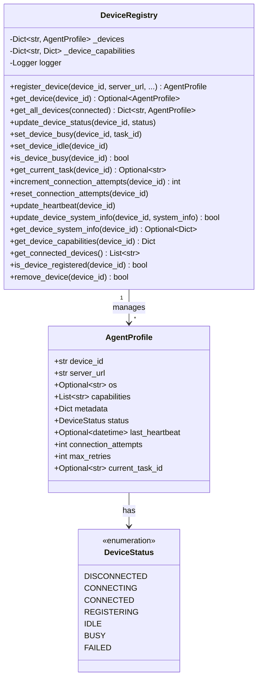
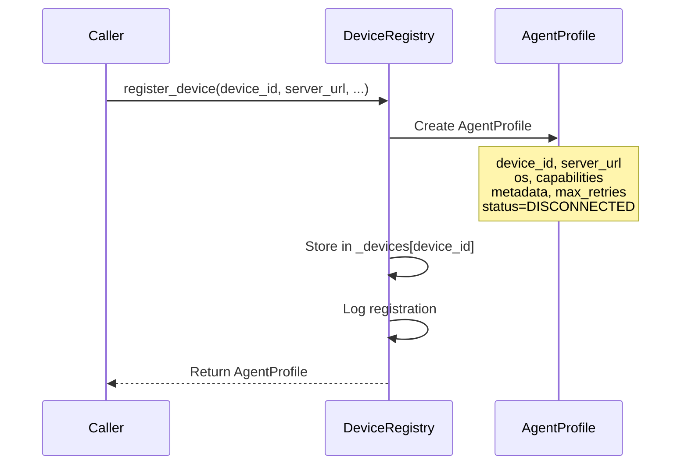
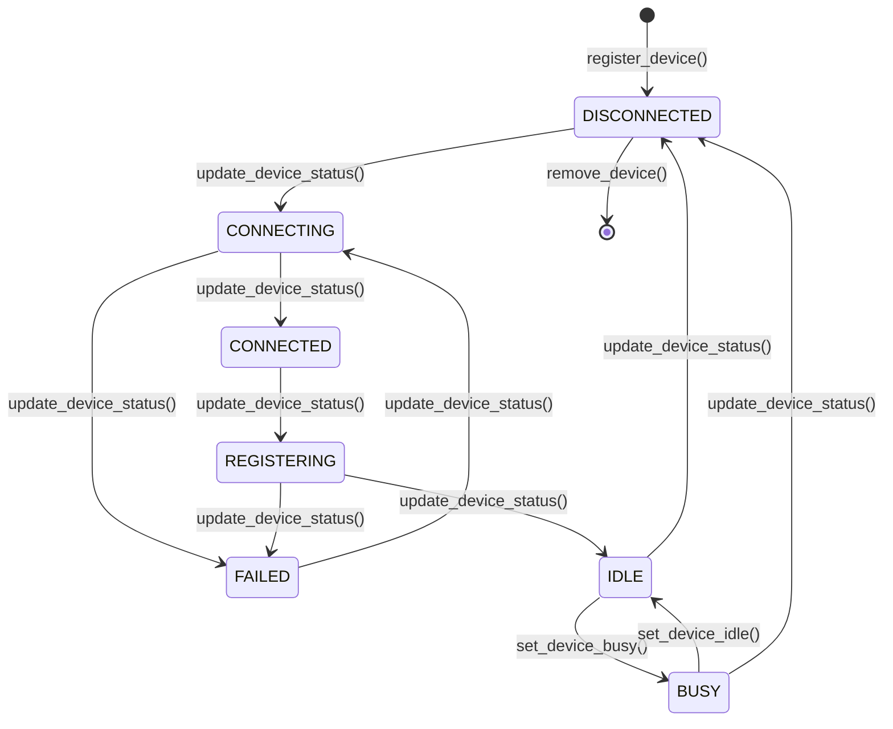
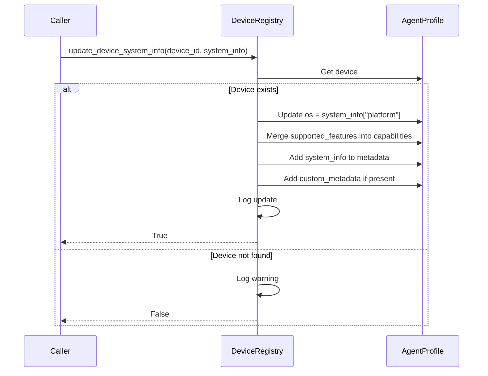

# 🗄️ DeviceRegistry - Device Data Management

## 📋 Overview

The **DeviceRegistry** is a focused component that manages device registration and information storage, providing a clean separation of concerns in the constellation architecture. It is responsible for **device data management only** - storing, retrieving, and updating AgentProfile instances without handling networking, task execution, or protocol logic.

> For details on how devices connect and register using the AIP protocol, see [Registration Flow](./registration_flow.md).

**Core Responsibilities:**

| Responsibility | Description |
|----------------|-------------|
| **Registration** | Create and store AgentProfile instances |
| **Status Tracking** | Update device connection and operational states |
| **Metadata Management** | Store and update device metadata from all sources |
| **Information Retrieval** | Provide device information to other components |
| **Task State Tracking** | Track which device is executing which task |

**Delegation to Other Components:**

- Network communication → [`WebSocketConnectionManager`](../client/components.md#websocketconnectionmanager-network-communication-handler)
- Message processing → [`MessageProcessor`](../client/components.md#messageprocessor-message-router-and-handler)
- Task execution → [`TaskQueueManager`](../client/components.md#taskqueuemanager-task-scheduling-and-queuing)
- Heartbeat monitoring → [`HeartbeatManager`](../client/components.md#heartbeatmanager-connection-health-monitor)

## 🏗️ Architecture

### Class Structure



### Internal Storage

```python
class DeviceRegistry:
    def __init__(self):
        # Primary storage: device_id -> AgentProfile
        self._devices: Dict[str, AgentProfile] = {}
        
        # Secondary storage: device_id -> capabilities dict
        # (Legacy, mostly superseded by AgentProfile.capabilities)
        self._device_capabilities: Dict[str, Dict[str, Any]] = {}
        
        self.logger = logging.getLogger(f"{__name__}.DeviceRegistry")
```

**Storage Structure:**

```python
# Internal state example
_devices = {
    "windowsagent": AgentProfile(
        device_id="windowsagent",
        server_url="ws://localhost:5005/ws",
        os="windows",
        capabilities=["gui", "browser", "office"],
        metadata={...},
        status=DeviceStatus.IDLE,
        ...
    ),
    "linux_server_01": AgentProfile(
        device_id="linux_server_01",
        server_url="ws://10.0.0.50:5001/ws",
        os="linux",
        capabilities=["cli", "server"],
        metadata={...},
        status=DeviceStatus.BUSY,
        current_task_id="task_123"
    )
}
```

---

## 🔧 Core Operations

### 1. Device Registration

#### Method: `register_device()`

```python
def register_device(
    self,
    device_id: str,
    server_url: str,
    os: Optional[str] = None,
    capabilities: Optional[List[str]] = None,
    metadata: Optional[Dict[str, Any]] = None,
    max_retries: int = 5,
) -> AgentProfile:
    """
    Register a new device.

    :param device_id: Unique device identifier
    :param server_url: UFO WebSocket server URL
    :param os: Operating system type
    :param capabilities: Device capabilities
    :param metadata: Additional metadata
    :param max_retries: Maximum connection retry attempts
    :return: Created AgentProfile object
    """
```

**Process:**



**Example:**

```python
registry = DeviceRegistry()

# Register device
profile = registry.register_device(
    device_id="windowsagent",
    server_url="ws://localhost:5005/ws",
    os="windows",
    capabilities=["web_browsing", "office_applications"],
    metadata={
        "location": "office_desktop",
        "performance": "high"
    },
    max_retries=5
)

print(f"Registered: {profile.device_id}")
print(f"Status: {profile.status.value}")  # "disconnected"
```

> **Note:** The `register_device()` method will overwrite an existing device if the same `device_id` is used. Consider adding validation if duplicate prevention is needed.

### 2. Device Retrieval

#### Method: `get_device()`

```python
def get_device(self, device_id: str) -> Optional[AgentProfile]:
    """Get device information by ID"""
    return self._devices.get(device_id)
```

**Example:**

```python
profile = registry.get_device("windowsagent")

if profile:
    print(f"Device: {profile.device_id}")
    print(f"Status: {profile.status.value}")
    print(f"Capabilities: {profile.capabilities}")
else:
    print("Device not found")
```

#### Method: `get_all_devices()`

```python
def get_all_devices(self, connected: bool = False) -> Dict[str, AgentProfile]:
    """
    Get all registered devices
    :param connected: If True, return only connected devices
    :return: Dictionary of device_id to AgentProfile
    """
```

**Example:**

```python
# Get all devices
all_devices = registry.get_all_devices(connected=False)
print(f"Total devices: {len(all_devices)}")

# Get only connected devices
connected_devices = registry.get_all_devices(connected=True)
print(f"Connected devices: {len(connected_devices)}")

for device_id, profile in connected_devices.items():
    print(f"  - {device_id}: {profile.status.value}")
```

**Connected Device Filter:**

```python
# Implementation detail
if connected:
    return {
        device_id: device_info
        for device_id, device_info in self._devices.items()
        if device_info.status in [
            DeviceStatus.CONNECTED,
            DeviceStatus.IDLE,
            DeviceStatus.BUSY
        ]
    }
```

#### Method: `get_connected_devices()`

```python
def get_connected_devices(self) -> List[str]:
    """Get list of connected device IDs"""
    return [
        device_id
        for device_id, device_info in self._devices.items()
        if device_info.status == DeviceStatus.CONNECTED
    ]
```

**Example:**

```python
connected = registry.get_connected_devices()
print(f"Connected: {connected}")
# ['windowsagent', 'linux_server_01']
```

---

### 3. Status Management

#### Method: `update_device_status()`

```python
def update_device_status(self, device_id: str, status: DeviceStatus) -> None:
    """Update device connection status"""
    if device_id in self._devices:
        self._devices[device_id].status = status
```

**Example:**

```python
# Update status progression
registry.update_device_status("windowsagent", DeviceStatus.CONNECTING)
registry.update_device_status("windowsagent", DeviceStatus.CONNECTED)
registry.update_device_status("windowsagent", DeviceStatus.IDLE)
```

**Status Lifecycle:**



---

### 4. Task State Management

#### Method: `set_device_busy()`

```python
def set_device_busy(self, device_id: str, task_id: str) -> None:
    """
    Set device to BUSY status and track current task.

    :param device_id: Device ID
    :param task_id: Task ID being executed
    """
    if device_id in self._devices:
        self._devices[device_id].status = DeviceStatus.BUSY
        self._devices[device_id].current_task_id = task_id
        self.logger.info(f"🔄 Device {device_id} set to BUSY (task: {task_id})")
```

**Example:**

```python
# Assign task to device
registry.set_device_busy("windowsagent", task_id="task_12345")

profile = registry.get_device("windowsagent")
print(f"Status: {profile.status.value}")       # "busy"
print(f"Current Task: {profile.current_task_id}")  # "task_12345"
```

#### Method: `set_device_idle()`

```python
def set_device_idle(self, device_id: str) -> None:
    """
    Set device to IDLE status and clear current task.

    :param device_id: Device ID
    """
    if device_id in self._devices:
        self._devices[device_id].status = DeviceStatus.IDLE
        self._devices[device_id].current_task_id = None
        self.logger.info(f"✅ Device {device_id} set to IDLE")
```

**Example:**

```python
# Task completes
registry.set_device_idle("windowsagent")

profile = registry.get_device("windowsagent")
print(f"Status: {profile.status.value}")       # "idle"
print(f"Current Task: {profile.current_task_id}")  # None
```

#### Method: `is_device_busy()`

```python
def is_device_busy(self, device_id: str) -> bool:
    """
    Check if device is currently busy.

    :param device_id: Device ID
    :return: True if device is busy
    """
    if device_id in self._devices:
        return self._devices[device_id].status == DeviceStatus.BUSY
    return False
```

**Example:**

```python
if registry.is_device_busy("windowsagent"):
    print("Device is busy, task will be queued")
else:
    print("Device is available")
```

#### Method: `get_current_task()`

```python
def get_current_task(self, device_id: str) -> Optional[str]:
    """
    Get the current task ID being executed on device.

    :param device_id: Device ID
    :return: Current task ID or None
    """
    if device_id in self._devices:
        return self._devices[device_id].current_task_id
    return None
```

**Example:**

```python
task_id = registry.get_current_task("windowsagent")
if task_id:
    print(f"Device executing: {task_id}")
else:
    print("Device idle")
```

---

### 5. Connection Management

#### Method: `increment_connection_attempts()`

```python
def increment_connection_attempts(self, device_id: str) -> int:
    """Increment connection attempts counter"""
    if device_id in self._devices:
        self._devices[device_id].connection_attempts += 1
        return self._devices[device_id].connection_attempts
    return 0
```

**Example:**

```python
attempts = registry.increment_connection_attempts("windowsagent")
print(f"Attempts: {attempts}")

profile = registry.get_device("windowsagent")
if profile.connection_attempts >= profile.max_retries:
    print("Max retries reached, giving up")
```

#### Method: `reset_connection_attempts()`

```python
def reset_connection_attempts(self, device_id: str) -> None:
    """Reset connection attempts counter to 0"""
    if device_id in self._devices:
        self._devices[device_id].connection_attempts = 0
        self.logger.info(f"🔄 Reset connection attempts for device {device_id}")
```

**Example:**

```python
# After successful connection
registry.reset_connection_attempts("windowsagent")

profile = registry.get_device("windowsagent")
print(f"Attempts: {profile.connection_attempts}")  # 0
```

---

### 6. Heartbeat Tracking

#### Method: `update_heartbeat()`

```python
def update_heartbeat(self, device_id: str) -> None:
    """Update last heartbeat timestamp"""
    if device_id in self._devices:
        self._devices[device_id].last_heartbeat = datetime.now(timezone.utc)
```

**Example:**

```python
from datetime import datetime, timezone, timedelta

# Update heartbeat
registry.update_heartbeat("windowsagent")

profile = registry.get_device("windowsagent")
print(f"Last heartbeat: {profile.last_heartbeat}")

# Check heartbeat freshness
age = datetime.now(timezone.utc) - profile.last_heartbeat
if age > timedelta(minutes=5):
    print("⚠️ Heartbeat stale!")
```

---

### 7. System Information Management

#### Method: `update_device_system_info()`

```python
def update_device_system_info(
    self, device_id: str, system_info: Dict[str, Any]
) -> bool:
    """
    Update AgentProfile with system information retrieved from server.

    This method updates the device's OS, capabilities, and metadata with
    the system information that was automatically collected by the device
    and stored on the server.

    :param device_id: Device ID
    :param system_info: System information dictionary from server
    :return: True if update successful, False if device not found
    """
```

> **Note:** System information is collected from the device agent and retrieved via the server. See [Client Connection Manager](../../server/client_connection_manager.md) for server-side information management.

**Process:**



**Implementation:**

```python
device_info = self.get_device(device_id)
if not device_info:
    self.logger.warning(f"Cannot update system info: device {device_id} not found")
    return False

# 1. Update OS information
if "platform" in system_info:
    device_info.os = system_info["platform"]

# 2. Merge capabilities with supported features (avoid duplicates)
if "supported_features" in system_info:
    features = system_info["supported_features"]
    existing_caps = set(device_info.capabilities)
    new_caps = existing_caps.union(set(features))
    device_info.capabilities = list(new_caps)

# 3. Update metadata with system information
device_info.metadata.update({
    "system_info": {
        "platform": system_info.get("platform"),
        "os_version": system_info.get("os_version"),
        "cpu_count": system_info.get("cpu_count"),
        "memory_total_gb": system_info.get("memory_total_gb"),
        "hostname": system_info.get("hostname"),
        "ip_address": system_info.get("ip_address"),
        "platform_type": system_info.get("platform_type"),
        "schema_version": system_info.get("schema_version"),
    }
})

# 4. Add custom metadata if present
if "custom_metadata" in system_info:
    device_info.metadata["custom_metadata"] = system_info["custom_metadata"]

# 5. Add tags if present
if "tags" in system_info:
    device_info.metadata["tags"] = system_info["tags"]

return True
```

**Example:**

```python
system_info = {
    "platform": "windows",
    "os_version": "10.0.22631",
    "cpu_count": 16,
    "memory_total_gb": 32.0,
    "hostname": "DESKTOP-DEV01",
    "ip_address": "192.168.1.100",
    "supported_features": ["gui", "cli", "browser", "file_system", "office"],
    "platform_type": "computer",
    "schema_version": "1.0"
}

success = registry.update_device_system_info("windowsagent", system_info)

if success:
    profile = registry.get_device("windowsagent")
    print(f"OS: {profile.os}")  # "windows"
    print(f"CPU: {profile.metadata['system_info']['cpu_count']}")  # 16
    print(f"Memory: {profile.metadata['system_info']['memory_total_gb']} GB")  # 32.0
```

#### Method: `get_device_system_info()`

```python
def get_device_system_info(self, device_id: str) -> Optional[Dict[str, Any]]:
    """
    Get device system information (hardware, OS, features).

    :param device_id: Device ID
    :return: System information dictionary or None if not available
    """
    device_info = self.get_device(device_id)
    if not device_info:
        return None
    
    return device_info.metadata.get("system_info")
```

**Example:**

```python
system_info = registry.get_device_system_info("windowsagent")

if system_info:
    print(f"Platform: {system_info['platform']}")
    print(f"CPU Cores: {system_info['cpu_count']}")
    print(f"Memory: {system_info['memory_total_gb']} GB")
    print(f"Hostname: {system_info['hostname']}")
else:
    print("System info not available")
```

---

### 8. Capabilities Management

#### Method: `set_device_capabilities()`

```python
def set_device_capabilities(
    self, device_id: str, capabilities: Dict[str, Any]
) -> None:
    """Store device capabilities information"""
    self._device_capabilities[device_id] = capabilities

    # Also update device info with capabilities
    if device_id in self._devices:
        device_info = self._devices[device_id]
        if "capabilities" in capabilities:
            device_info.capabilities.extend(capabilities["capabilities"])
        if "metadata" in capabilities:
            device_info.metadata.update(capabilities["metadata"])
```

> **Note:** This method is primarily for backwards compatibility. Modern code should use `update_device_system_info()` instead.

#### Method: `get_device_capabilities()`

```python
def get_device_capabilities(self, device_id: str) -> Dict[str, Any]:
    """Get device capabilities"""
    return self._device_capabilities.get(device_id, {})
```

---

### 9. Utility Methods

#### Method: `is_device_registered()`

```python
def is_device_registered(self, device_id: str) -> bool:
    """Check if device is registered"""
    return device_id in self._devices
```

**Example:**

```python
if registry.is_device_registered("windowsagent"):
    print("Device exists")
else:
    print("Device not registered")
```

#### Method: `remove_device()`

```python
def remove_device(self, device_id: str) -> bool:
    """Remove a device from registry"""
    if device_id in self._devices:
        del self._devices[device_id]
        self._device_capabilities.pop(device_id, None)
        return True
    return False
```

**Example:**

```python
success = registry.remove_device("windowsagent")
if success:
    print("Device removed")
else:
    print("Device not found")
```

---

## 💡 Usage Patterns

### Pattern 1: Complete Registration Flow

```python
from galaxy.client.components import DeviceRegistry, DeviceStatus

registry = DeviceRegistry()

# 1. Register device
profile = registry.register_device(
    device_id="windowsagent",
    server_url="ws://localhost:5005/ws",
    os="windows",
    capabilities=["web_browsing"],
    metadata={"location": "office"},
    max_retries=5
)

# 2. Update status through connection process
registry.update_device_status("windowsagent", DeviceStatus.CONNECTING)
registry.increment_connection_attempts("windowsagent")
registry.update_device_status("windowsagent", DeviceStatus.CONNECTED)
registry.reset_connection_attempts("windowsagent")

# 3. Update with system info
system_info = {
    "platform": "windows",
    "cpu_count": 16,
    "memory_total_gb": 32.0,
    "supported_features": ["gui", "cli", "browser"]
}
registry.update_device_system_info("windowsagent", system_info)

# 4. Set to IDLE (ready for tasks)
registry.set_device_idle("windowsagent")

# 5. Update heartbeat
registry.update_heartbeat("windowsagent")
```

### Pattern 2: Task Assignment

```python
# Check if device can accept task
if not registry.is_device_busy("windowsagent"):
    # Assign task
    registry.set_device_busy("windowsagent", task_id="task_123")
    
    # ... execute task ...
    
    # Task complete
    registry.set_device_idle("windowsagent")
else:
    print("Device busy, task queued")
```

### Pattern 3: Device Selection

```python
def find_available_device_with_capability(
    registry: DeviceRegistry,
    required_capability: str
) -> Optional[str]:
    """Find an idle device with specific capability."""
    
    all_devices = registry.get_all_devices(connected=True)
    
    for device_id, profile in all_devices.items():
        # Check if idle
        if profile.status != DeviceStatus.IDLE:
            continue
        
        # Check capability
        if required_capability in profile.capabilities:
            return device_id
    
    return None

# Usage
device_id = find_available_device_with_capability(registry, "browser")
if device_id:
    print(f"Selected: {device_id}")
```

### Pattern 4: Health Monitoring

```python
from datetime import datetime, timezone, timedelta

def check_all_devices_health(registry: DeviceRegistry):
    """Check health of all registered devices."""
    
    all_devices = registry.get_all_devices()
    
    for device_id, profile in all_devices.items():
        print(f"\n{device_id}:")
        print(f"  Status: {profile.status.value}")
        
        # Check heartbeat
        if profile.last_heartbeat:
            age = datetime.now(timezone.utc) - profile.last_heartbeat
            print(f"  Heartbeat age: {age.total_seconds():.0f}s")
            
            if age > timedelta(minutes=5):
                print(f"  ⚠️ WARNING: Stale heartbeat!")
        else:
            print(f"  ⚠️ WARNING: No heartbeat recorded")
        
        # Check connection attempts
        if profile.connection_attempts > 0:
            print(f"  Connection attempts: {profile.connection_attempts}/{profile.max_retries}")
        
        # Check task status
        if profile.current_task_id:
            print(f"  Current task: {profile.current_task_id}")
```

---

## 🔗 Integration with Other Components

DeviceRegistry is used internally by other components in the constellation system. See [Components Overview](../client/components.md) for details on the component architecture.

### With ConstellationDeviceManager

```python
# ConstellationDeviceManager uses DeviceRegistry internally

class ConstellationDeviceManager:
    def __init__(self, ...):
        self.device_registry = DeviceRegistry()  # Internal registry
    
    async def register_device(self, ...):
        # Delegate to registry
        self.device_registry.register_device(...)
    
    def get_device_info(self, device_id: str):
        # Delegate to registry
        return self.device_registry.get_device(device_id)
```

### With MessageProcessor

```python
# MessageProcessor updates registry when messages arrive

class MessageProcessor:
    def __init__(self, device_registry: DeviceRegistry, ...):
        self.device_registry = device_registry
    
    async def handle_heartbeat(self, device_id: str):
        # Update heartbeat in registry
        self.device_registry.update_heartbeat(device_id)
```

### With TaskQueueManager

```python
# TaskQueueManager checks device status via registry

class TaskQueueManager:
    def can_assign_task(self, device_id: str) -> bool:
        # Check if device is busy
        return not self.device_registry.is_device_busy(device_id)
```

---

## 🔗 Related Documentation

| Topic | Document | Description |
|-------|----------|-------------|
| **Overview** | [Agent Registration Overview](./overview.md) | Registration architecture |
| **AgentProfile** | [AgentProfile](./agent_profile.md) | Profile structure details |
| **Registration Flow** | [Registration Flow](./registration_flow.md) | Step-by-step registration |
| **Galaxy Devices Config** | [Galaxy Devices Configuration](../../configuration/system/galaxy_devices.md) | YAML config reference |
| **Components** | [Client Components](../client/components.md) | Component architecture |

---

## 💡 Best Practices

**1. Always Check Device Exists**

```python
profile = registry.get_device(device_id)
if not profile:
    logger.error(f"Device {device_id} not found")
    return
```

**2. Use Defensive Copies for Lists/Dicts**

```python
# Registry already creates copies, but be aware
capabilities = ["web", "office"]
registry.register_device(..., capabilities=capabilities)
# Modifying original list won't affect registry
capabilities.append("new")  # Safe
```

**3. Monitor Heartbeats Regularly**

```python
# Periodic check
for device_id in registry.get_all_devices():
    profile = registry.get_device(device_id)
    if profile.last_heartbeat:
        age = datetime.now(timezone.utc) - profile.last_heartbeat
        if age > timedelta(minutes=5):
            logger.warning(f"Stale heartbeat: {device_id}")
```

**4. Clear Task State After Completion**

```python
# Always set to IDLE after task completes
registry.set_device_idle(device_id)
# This automatically clears current_task_id
```

---

## 🚀 Next Steps

1. **Understand AgentProfile**: Read [AgentProfile Documentation](./agent_profile.md)
2. **Learn Configuration**: See [Galaxy Devices Configuration](../../configuration/system/galaxy_devices.md)
3. **Study Registration**: Check [Registration Flow](./registration_flow.md)
4. **Explore Components**: See ConstellationDeviceManager implementation

---

## 📚 Source Code Reference

- **DeviceRegistry**: `galaxy/client/components/device_registry.py`
- **AgentProfile**: `galaxy/client/components/types.py`
- **ConstellationDeviceManager**: `galaxy/client/device_manager.py`
