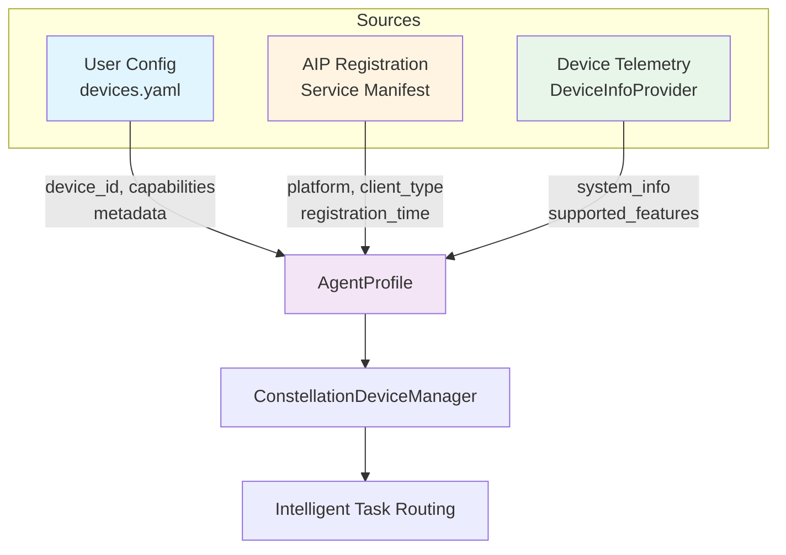
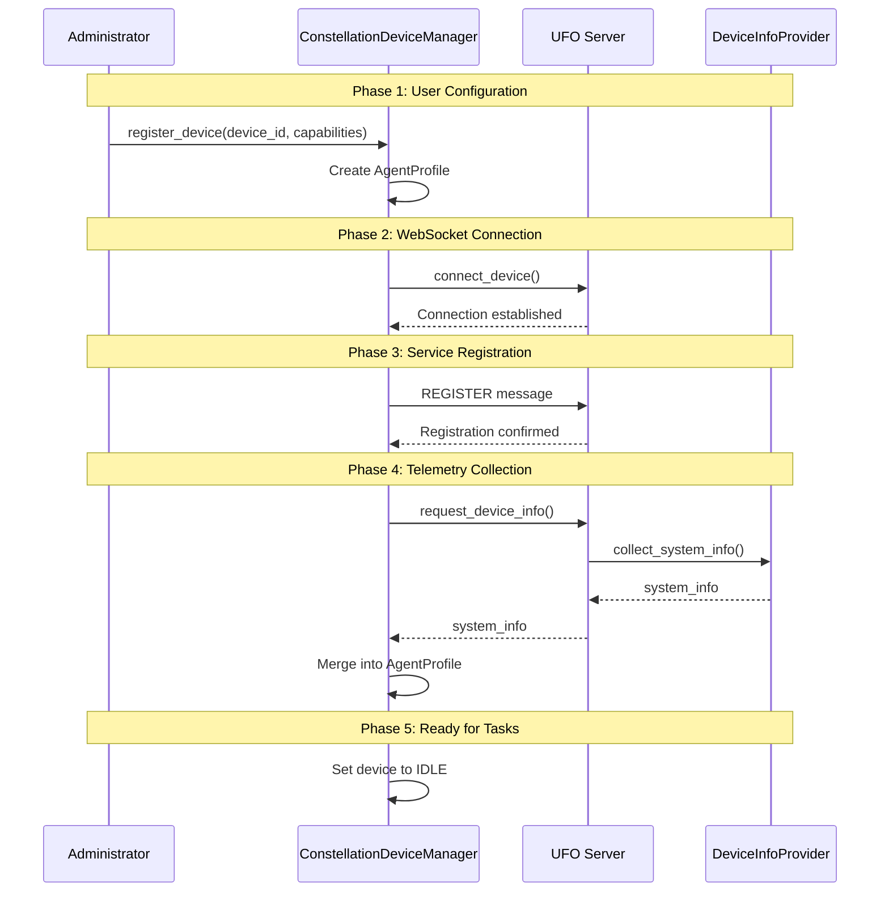
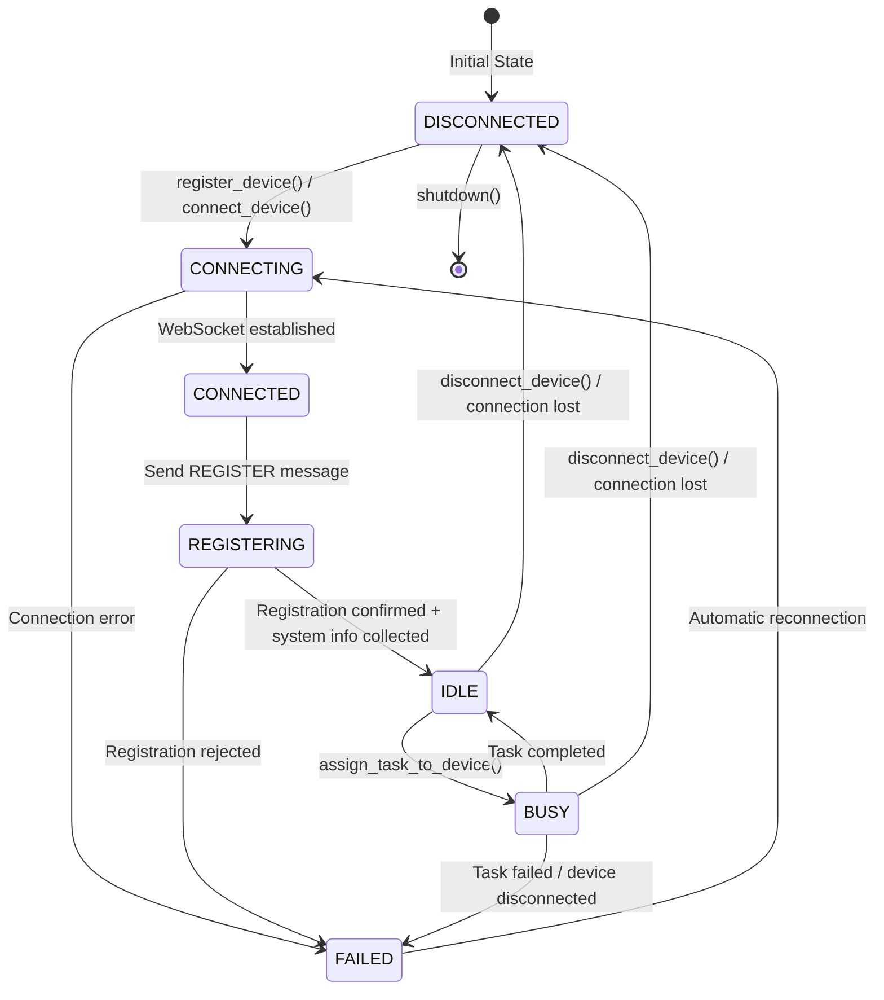

# 🌟 Agent Registration & Profiling - Overview

**Agent Registration** is the cornerstone of the AIP (Agent Interaction Protocol) initialization process. It enables dynamic discovery, capability advertisement, and intelligent task allocation across distributed constellation agents.

---

## 📋 Introduction


*An overview of the Constellation Agent architecture showing the registration and profiling system.*

At the core of AIP's initialization process is the **ConstellationClient** (implemented as `ConstellationDeviceManager`), which maintains a global registry of active agents. Any device agent service that exposes a WebSocket endpoint and implements the AIP task dispatch and result-return protocol can be seamlessly integrated into UFO, providing remarkable **extensibility**.

The multi-source profiling pipeline enables **transparent capability discovery** and **safe adaptation** to environmental drift without direct administrator intervention.

For a complete understanding of the constellation system, see:

- [Constellation Overview](../constellation/overview.md) - Multi-device coordination architecture
- [Constellation Agent Overview](../constellation_agent/overview.md) - Agent behavior and patterns
- [AIP Protocol Overview](../../aip/overview.md) - Message protocol details

---

## 🎯 Core Concepts

### Agent Registry

The agent registry is a centralized store that tracks all active constellation agents. Each registered agent is represented by an **AgentProfile** that consolidates comprehensive information about the agent's capabilities, system resources, and operational status.

| Component | Responsibility | Location |
|-----------|---------------|----------|
| **ConstellationDeviceManager** | Central coordinator for device management | `galaxy/client/device_manager.py` |
| **DeviceRegistry** | Device registration and information storage | `galaxy/client/components/device_registry.py` |
| **AgentProfile** | Multi-source agent metadata representation | `galaxy/client/components/types.py` |
| **ClientConnectionManager** | Server-side client connection tracking | `ufo/server/services/client_connection_manager.py` |

### Multi-Source Profiling

Each **AgentProfile** consolidates information from **three distinct sources**, creating a comprehensive and dynamically updated view of each agent.



**Source Details:**

| Source | Provider | Information Type | Update Frequency |
|--------|----------|------------------|------------------|
| **1. User Configuration** | Administrator (devices.yaml + constellation.yaml) | Endpoint identity, user preferences, capabilities | Static (config load) |
| **2. Service Manifest** | Device Agent Service (AIP) | Client type, platform, registration metadata | On registration |
| **3. Client Telemetry** | Device Client (DeviceInfoProvider) | Hardware specs, OS info, network status | On connection + periodic updates |

**Note:** While constellation.yaml contains runtime settings like heartbeat intervals, the device-specific configuration is in devices.yaml.

---

## 🔄 Registration Flow


*Agent registration flow: multi-source AgentProfile construction and registration.*

### Registration Process Overview

The registration process follows a well-defined sequence that ensures comprehensive profiling and validation:



**Registration Phases:**

| Phase | Description | Components Involved | Result |
|-------|-------------|---------------------|--------|
| **1. User Configuration** | Administrator registers device with endpoint and capabilities | ConstellationDeviceManager, DeviceRegistry | AgentProfile created with user-specified data |
| **2. WebSocket Connection** | Establish persistent connection to device agent server | WebSocketConnectionManager | Active WebSocket channel |
| **3. Service Registration** | AIP registration protocol exchange with capability advertisement | RegistrationProtocol, UFOWebSocketHandler | Client type and platform recorded |
| **4. Telemetry Collection** | Retrieve runtime system information from device | DeviceInfoProvider, DeviceInfoProtocol | Hardware, OS, and feature data merged |
| **5. Activation** | Set device to IDLE state, ready for task assignment | DeviceRegistry | Agent ready for constellation tasks |

Devices can be registered with `auto_connect=True` to automatically establish connection, or `auto_connect=False` to require manual connection via `connect_device()`.

---

## 📊 AgentProfile Structure

The **AgentProfile** is the primary data structure representing a registered constellation agent. For detailed information about the AgentProfile and its lifecycle operations, see [Agent Profile Documentation](./agent_profile.md).

### Core Fields

The **AgentProfile** is the primary data structure representing a registered constellation agent:

```python
@dataclass
class AgentProfile:
    """Device information and capabilities"""
    
    # Identity
    device_id: str                          # Unique device identifier
    server_url: str                         # WebSocket endpoint URL
    
    # Platform & Capabilities
    os: Optional[str] = None                # Operating system (windows, linux, darwin)
    capabilities: List[str]                 # Advertised capabilities/features
    metadata: Dict[str, Any]                # Additional metadata
    
    # Operational Status
    status: DeviceStatus                    # Current connection/operational status
    last_heartbeat: Optional[datetime]      # Last heartbeat timestamp
    
    # Connection Management
    connection_attempts: int = 0            # Connection retry counter
    max_retries: int = 5                    # Maximum retry attempts
    
    # Task Execution
    current_task_id: Optional[str] = None   # Currently executing task ID
```

**Field Categories:**

| Category | Fields | Purpose |
|----------|--------|---------|
| **Identity** | `device_id`, `server_url` | Unique identification and endpoint location |
| **Platform** | `os`, `capabilities`, `metadata` | System type and advertised features |
| **Status** | `status`, `last_heartbeat` | Real-time operational state tracking |
| **Resilience** | `connection_attempts`, `max_retries` | Connection retry management |
| **Execution** | `current_task_id` | Task assignment tracking |

### Metadata Structure

The `metadata` field is a flexible dictionary that aggregates information from all three sources:

```python
metadata = {
    # From User Configuration (Source 1)
    "location": "home_office",
    "performance": "high",
    "description": "Primary development laptop",
    "operation_engineer_email": "admin@example.com",
    
    # From Service Manifest (Source 2)
    "platform": "windows",
    "registration_time": "2025-11-06T10:30:00Z",
    
    # From Client Telemetry (Source 3)
    "system_info": {
        "platform": "windows",
        "os_version": "10.0.22631",
        "cpu_count": 16,
        "memory_total_gb": 32.0,
        "hostname": "DESKTOP-DEV01",
        "ip_address": "192.168.1.100",
        "platform_type": "computer",
        "schema_version": "1.0"
    },
    "custom_metadata": {
        "datacenter": "us-west-2",
        "tier": "production"
    }
}
```

For a complete example, see the [Agent Profile Documentation](./agent_profile.md#example-profiles).

---

## 🔄 Agent Lifecycle States


*Lifecycle state transitions of the Constellation Agent.*

The agent lifecycle is managed through a state machine that tracks connection, registration, and task execution states. For more details on agent behavior and state management, see [Constellation Agent State Management](../constellation_agent/state.md).

### State Definitions

```python
class DeviceStatus(Enum):
    """Device connection status"""
    DISCONNECTED = "disconnected"   # Not connected to server
    CONNECTING = "connecting"       # Attempting to establish connection
    CONNECTED = "connected"         # Connected, initializing
    REGISTERING = "registering"     # Performing registration handshake
    IDLE = "idle"                   # Connected and ready for tasks
    BUSY = "busy"                   # Executing a task
    FAILED = "failed"               # Connection/execution failed
```

### State Transition Diagram



**Transition Events:**

| From State | To State | Trigger | Action |
|------------|----------|---------|--------|
| DISCONNECTED | CONNECTING | `connect_device()` | Initiate WebSocket connection |
| CONNECTING | CONNECTED | WebSocket handshake complete | Update status |
| CONNECTED | REGISTERING | Send REGISTER message | AIP registration protocol |
| REGISTERING | IDLE | Registration confirmed | Collect system info, ready for tasks |
| IDLE | BUSY | `assign_task_to_device()` | Execute task |
| BUSY | IDLE | Task completes | Clear current_task_id |
| Any | DISCONNECTED | Connection lost | Cleanup, schedule reconnection |
| FAILED | CONNECTING | Retry timer | Attempt reconnection (if under max_retries) |

**Important:** When a device disconnects or enters FAILED state, the system automatically schedules reconnection attempts up to `max_retries` times with `reconnect_delay` interval.

---

## 🛠️ Key Components

### 1. ConstellationDeviceManager

**File:** `galaxy/client/device_manager.py`

The central coordinator for all device management operations in the constellation system.

**Responsibilities:**

- Device registration and lifecycle management
- Connection establishment and monitoring
- Task assignment and execution coordination
- Automatic reconnection handling

**Key Methods:**

```python
class ConstellationDeviceManager:
    async def register_device(
        device_id: str,
        server_url: str,
        os: str,
        capabilities: List[str],
        metadata: Dict[str, Any],
        auto_connect: bool = True
    ) -> bool
    
    async def connect_device(device_id: str) -> bool
    
    async def assign_task_to_device(
        task_id: str,
        device_id: str,
        task_description: str,
        task_data: Dict[str, Any]
    ) -> ExecutionResult
    
    def get_device_info(device_id: str) -> Optional[AgentProfile]
```

See [Device Registry Documentation](./device_registry.md) for DeviceRegistry details.

### 2. DeviceRegistry

**File:** `galaxy/client/components/device_registry.py`

Manages device registration and information storage with a focus on data management.

**Responsibilities:**

- Store and retrieve AgentProfile instances
- Update device status and metadata
- Track connection attempts and heartbeats
- Merge multi-source information

**Key Methods:**

```python
class DeviceRegistry:
    def register_device(...) -> AgentProfile
    def update_device_status(device_id: str, status: DeviceStatus)
    def update_device_system_info(device_id: str, system_info: Dict)
    def set_device_busy(device_id: str, task_id: str)
    def set_device_idle(device_id: str)
```

### 3. RegistrationProtocol (AIP)

**File:** `aip/protocol/registration.py`

Handles AIP registration message exchange for both device and constellation clients.

**Responsibilities:**

- Device agent registration
- Constellation client registration
- Capability advertisement
- Registration validation and confirmation

**Key Methods:**

```python
class RegistrationProtocol(AIPProtocol):
    async def register_as_device(
        device_id: str,
        metadata: Dict[str, Any],
        platform: str
    ) -> bool
    
    async def register_as_constellation(
        constellation_id: str,
        target_device: str,
        metadata: Dict[str, Any]
    ) -> bool
    
    async def send_registration_confirmation()
    async def send_registration_error(error: str)
```

See [AIP Protocol Documentation](../../aip/overview.md) for protocol details.

### 4. DeviceInfoProvider

**File:** `ufo/client/device_info_provider.py`

Collects device system information (telemetry source).

**Responsibilities:**

- Auto-detect platform, OS, and hardware
- Collect CPU, memory, network information
- Detect supported features based on platform
- Provide DeviceSystemInfo structure

**Key Methods:**

```python
class DeviceInfoProvider:
    @staticmethod
    def collect_system_info(
        client_id: str,
        custom_metadata: Optional[Dict]
    ) -> DeviceSystemInfo
```

See [Device Info Provider Documentation](../../client/device_info.md) for telemetry details.

### 5. ClientConnectionManager (Server)

**File:** `ufo/server/services/client_connection_manager.py`

Server-side client connection tracking and management. For detailed information about the server-side implementation, see [Client Connection Manager Documentation](../../server/client_connection_manager.md).

**Responsibilities:**

- Track connected clients (devices and constellations)
- Store device system information received during registration
- Manage session-to-client mappings
- Merge server configuration with client telemetry

**Key Methods:**

```python
class ClientConnectionManager:
    def add_client(
        client_id: str,
        platform: str,
        ws: WebSocket,
        client_type: ClientType,
        metadata: Dict
    )
    def get_device_system_info(device_id: str) -> Optional[Dict]
```

---

## 📝 Configuration

Agent registration uses two configuration files:

**1. `config/galaxy/devices.yaml`** - Device definitions:
- Device endpoints and identities
- User-specified capabilities and metadata
- Connection parameters (max retries, auto-connect)

**2. `config/galaxy/constellation.yaml`** - Runtime settings:
- Constellation identification and logging
- Heartbeat interval and reconnection delay
- Task concurrency and step limits

See [Galaxy Devices Configuration](../../configuration/system/galaxy_devices.md) and [Galaxy Constellation Configuration](../../configuration/system/galaxy_constellation.md) for details.

**Example Device Configuration (devices.yaml):**

```yaml
# Device Configuration - YAML Format
# Runtime settings are configured in constellation.yaml

devices:
  - device_id: "windowsagent"
    server_url: "ws://localhost:5005/ws"
    os: "windows"
    capabilities: ["web_browsing", "office_applications"]
    metadata:
      location: "office_desktop"
      performance: "high"
    max_retries: 5
    auto_connect: true
```

For complete configuration schema, examples, and best practices, see:

👉 **[Galaxy Devices Configuration Guide](../../configuration/system/galaxy_devices.md)**

---

## 🚀 Usage Example

### Basic Registration

```python
from galaxy.client.device_manager import ConstellationDeviceManager

# Initialize manager
manager = ConstellationDeviceManager(
    task_name="test_constellation",
    heartbeat_interval=30.0,
    reconnect_delay=5.0
)

# Register and connect device
success = await manager.register_device(
    device_id="windows_workstation",
    server_url="ws://localhost:5005/ws",
    os="windows",
    capabilities=["gui", "browser", "office"],
    metadata={
        "location": "home_office",
        "performance": "medium"
    },
    auto_connect=True  # Automatically connect after registration
)

if success:
    print("✅ Device registered and connected")
    
    # Get device profile
    profile = manager.get_device_info("windows_workstation")
    print(f"Device: {profile.device_id}")
    print(f"Status: {profile.status.value}")
    print(f"Capabilities: {profile.capabilities}")
    print(f"System Info: {profile.metadata.get('system_info')}")
```

### Task Assignment

```python
# Assign task to registered device
result = await manager.assign_task_to_device(
    task_id="task_001",
    device_id="windows_workstation",
    task_description="Open Excel and create a report",
    task_data={"file_path": "C:\\Reports\\monthly.xlsx"},
    timeout=300.0
)

print(f"Task Status: {result.status}")
print(f"Result: {result.result}")
```

For more details on task assignment and execution, see:
- [Registration Flow Documentation](./registration_flow.md) - Detailed examples
- [Constellation Task Distribution](../constellation/overview.md) - Task routing strategies

---

## 🔗 Cross-References

### Related Documentation

| Topic | Document | Description |
|-------|----------|-------------|
| **Device Info Collection** | [Device Info Provider](../../client/device_info.md) | Client-side telemetry collection |
| **AIP Protocol** | [AIP Overview](../../aip/overview.md) | Agent Interaction Protocol fundamentals |
| **AIP Messages** | [AIP Messages](../../aip/messages.md) | Message structure and types |
| **Agent Profile** | [Agent Profile](./agent_profile.md) | Detailed AgentProfile structure |
| **Registration Flow** | [Registration Flow](./registration_flow.md) | Step-by-step registration process |
| **Galaxy Devices Config** | [Galaxy Devices Configuration](../../configuration/system/galaxy_devices.md) | YAML configuration reference |
| **Device Registry** | [Device Registry](./device_registry.md) | Registry component details |
| **Constellation System** | [Constellation Overview](../constellation/overview.md) | Multi-device coordination |
| **Client Connection Manager** | [Server Connection Manager](../../server/client_connection_manager.md) | Server-side connection tracking |

### Architecture Diagrams

- **Constellation Agent Overview**: `documents/docs/img/constellation_agent.png`
- **Agent Registration Flow**: `documents/docs/img/agent_registry.png`
- **Agent Lifecycle States**: `documents/docs/img/agent_state.png`

---

## 💡 Key Benefits

The multi-source profiling approach provides several advantages:

**1. Improved Task Allocation Accuracy**

- Administrators specify high-level capabilities
- Service manifests advertise supported tools
- Telemetry provides real-time hardware status

**2. Transparent Capability Discovery**

- No manual system info entry required
- Automatic feature detection based on platform
- Dynamic updates without configuration changes

**3. Safe Adaptation to Environmental Drift**

- System changes (upgrades, hardware additions) automatically reflected
- No administrator intervention needed for routine updates
- Consistent metadata across distributed agents

**4. Reliable Scheduling Decisions**

- Fresh and accurate information for task routing
- Hardware-aware task assignment (CPU/memory requirements)
- Platform-specific capability matching

---

## 🎯 Next Steps

1. **Understand AgentProfile in Detail**: Read [Agent Profile Documentation](./agent_profile.md)
2. **Learn Registration Process**: Follow [Registration Flow](./registration_flow.md)
3. **Configure Your Devices**: See [Galaxy Devices Configuration](../../configuration/system/galaxy_devices.md)
4. **Explore Device Registry**: Check [Device Registry](./device_registry.md)
5. **Study AIP Protocol**: Read [AIP Documentation](../../aip/overview.md)

---

## 📚 Additional Resources

- **Source Code**: `galaxy/client/device_manager.py`
- **AIP Protocol**: `aip/protocol/registration.py`
- **Device Info**: `ufo/client/device_info_provider.py`
- **Configuration**: `config/galaxy/devices.yaml`

**Best Practice:** Always configure devices with meaningful metadata and capabilities to enable intelligent task routing. The system will automatically enhance this information with telemetry data.
