# 🔄 Registration Flow - Complete Process Guide

## 📋 Overview

The registration flow transforms a device configuration entry into a fully profiled, connected, and task-ready constellation agent through a coordinated **5-phase process**:

1. **Loads user configuration** from YAML
2. **Establishes WebSocket connection** to device agent server  
3. **Performs AIP registration protocol** exchange
4. **Collects client telemetry** data
5. **Activates the agent** as task-ready

See [Agent Registration Overview](./overview.md) for architecture context and [DeviceRegistry](./device_registry.md) for data management details.


*Multi-source AgentProfile construction and registration flow.*

## 🎯 Registration Phases

### Phase Overview


| Phase | Duration | Can Fail? | Retry? | Result |
|-------|----------|-----------|--------|--------|
| **1. User Configuration** | < 1s | Yes | No | AgentProfile created |
| **2. WebSocket Connection** | 1-5s | Yes | Yes (up to max_retries) | Active WebSocket |
| **3. Service Registration** | 1-2s | Yes | No | Client type recorded |
| **4. Telemetry Collection** | 1-3s | No (graceful degradation) | No | System info merged |
| **5. Agent Activation** | < 1s | No | No | Status = IDLE |

## 📝 Phase 1: User Configuration

### Purpose

Load device configuration from YAML file and create initial AgentProfile with user-specified data.

### Input

`config/galaxy/devices.yaml`:

```yaml
devices:
  - device_id: "windowsagent"
    server_url: "ws://localhost:5005/ws"
    os: "windows"
    capabilities:
      - "web_browsing"
      - "office_applications"
      - "file_management"
    metadata:
      location: "office_desktop"
      performance: "high"
      description: "Primary Windows workstation"
      operation_engineer_email: "admin@example.com"
    max_retries: 5
    auto_connect: true
```

### Process


### Code Example

```python
from galaxy.client.device_manager import ConstellationDeviceManager

# Initialize manager
manager = ConstellationDeviceManager(
    task_name="production_constellation",
    heartbeat_interval=30.0,
    reconnect_delay=5.0
)

# Phase 1: Register device from configuration
success = await manager.register_device(
    device_id="windowsagent",
    server_url="ws://localhost:5005/ws",
    os="windows",
    capabilities=["web_browsing", "office_applications", "file_management"],
    metadata={
        "location": "office_desktop",
        "performance": "high",
        "description": "Primary Windows workstation"
    },
    auto_connect=True  # Proceed to Phase 2 automatically
)
```

### Output

**AgentProfile (Version 1):**

```python
AgentProfile(
    device_id="windowsagent",
    server_url="ws://localhost:5005/ws",
    os="windows",
    capabilities=["web_browsing", "office_applications", "file_management"],
    metadata={
        "location": "office_desktop",
        "performance": "high",
        "description": "Primary Windows workstation"
    },
    status=DeviceStatus.DISCONNECTED,
    last_heartbeat=None,
    connection_attempts=0,
    max_retries=5,
    current_task_id=None
)
```

> **Phase 1 Complete:** Device registered in local registry with user-specified configuration. Status: `DISCONNECTED`

## 🌐 Phase 2: WebSocket Connection

### Purpose

Establish a persistent WebSocket connection to the device agent's UFO server. This connection is managed by the `WebSocketConnectionManager` component.

See [Client Components](../client/components.md) for component architecture details.

### Process


### Connection Parameters

| Parameter | Value | Description |
|-----------|-------|-------------|
| **URL** | `ws://host:port/ws` | WebSocket endpoint from configuration |
| **Timeout** | 30 seconds | Connection timeout |
| **Protocols** | WebSocket standard | No special sub-protocols |
| **Headers** | None | Standard WebSocket headers |

### Retry Strategy

```python
async def connect_device(self, device_id: str, is_reconnection: bool = False) -> bool:
    """Connect to a registered device with retry logic."""
    
    device_info = self.device_registry.get_device(device_id)
    
    # Update status
    self.device_registry.update_device_status(device_id, DeviceStatus.CONNECTING)
    
    # Increment attempts (only for initial connection, not reconnections)
    if not is_reconnection:
        self.device_registry.increment_connection_attempts(device_id)
    
    try:
        # Establish WebSocket connection
        await self.connection_manager.connect_to_device(
            device_info,
            message_processor=self.message_processor
        )
        
        # Success: Update status
        self.device_registry.update_device_status(device_id, DeviceStatus.CONNECTED)
        self.device_registry.update_heartbeat(device_id)
        
        # Start heartbeat monitoring
        self.heartbeat_manager.start_heartbeat(device_id)
        
        return True
        
    except (websockets.WebSocketException, OSError, asyncio.TimeoutError) as e:
        self.logger.error(f"Connection failed: {e}")
        self.device_registry.update_device_status(device_id, DeviceStatus.FAILED)
        
        # Schedule reconnection if under retry limit
        if device_info.connection_attempts < device_info.max_retries:
            self._schedule_reconnection(device_id)
        
        return False
```

### Reconnection Logic


**Reconnection Parameters:**

| Parameter | Default | Description |
|-----------|---------|-------------|
| `max_retries` | 5 | Maximum reconnection attempts |
| `reconnect_delay` | 5.0 seconds | Delay between attempts |
| `retry_counter` | Per-device | Tracked in AgentProfile.connection_attempts |

> **Warning:** If a device fails to connect after `max_retries` attempts, it enters `FAILED` status and requires manual intervention (e.g., restarting the device agent server).

### Output

- **WebSocket connection** established and active
- **Message handler** listening for incoming messages
- **Heartbeat monitoring** started
- **Status**: `CONNECTED`

> **Phase 2 Complete:** WebSocket connection established. Message handler and heartbeat monitoring active.

## 📡 Phase 3: Service Registration (AIP)

### Purpose

Perform AIP registration protocol exchange to:

- Identify client type (DEVICE vs CONSTELLATION)
- Advertise platform information
- Validate registration with server

See [AIP Protocol Documentation](../../aip/protocols.md#registration-protocol) for detailed protocol specifications.

### Process


### Registration Message Structure

**Client → Server (REGISTER message):**

```python
ClientMessage(
    type=ClientMessageType.REGISTER,
    client_id="windowsagent",
    client_type=ClientType.DEVICE,
    status=TaskStatus.OK,
    timestamp="2025-11-06T10:30:00.000Z",
    metadata={
        "platform": "windows",
        "registration_time": "2025-11-06T10:30:00.000Z",
        "system_info": {
            "platform": "windows",
            "os_version": "10.0.22631",
            "cpu_count": 16,
            "memory_total_gb": 32.0,
            "hostname": "DESKTOP-DEV01",
            "ip_address": "192.168.1.100",
            "supported_features": ["gui", "cli", "browser", "file_system", "office"],
            "platform_type": "computer",
            "schema_version": "1.0"
        }
    }
)
```

**Server → Client (Confirmation):**

```python
ServerMessage(
    type=ServerMessageType.HEARTBEAT,
    status=TaskStatus.OK,
    timestamp="2025-11-06T10:30:01.000Z",
    response_id="reg_confirmation_12345"
)
```

### Server-Side Processing

```python
# In UFOWebSocketHandler.connect()

async def connect(self, websocket: WebSocket) -> str:
    """Server-side registration handling."""
    
    await websocket.accept()
    
    # Initialize AIP protocols
    self.transport = WebSocketTransport(websocket)
    self.registration_protocol = RegistrationProtocol(self.transport)
    
    # Parse registration message
    reg_info = await self._parse_registration_message()
    
    # Validate client type
    client_type = reg_info.client_type  # DEVICE or CONSTELLATION
    platform = reg_info.metadata.get("platform", "windows")
    
    # Register client
    client_id = reg_info.client_id
    self.client_manager.add_client(
        client_id,
        platform,
        websocket,
        client_type,
        reg_info.metadata  # Contains system_info
    )
    
    # Send confirmation
    await self._send_registration_confirmation()
    
    return client_id
```

### Constellation Client Registration

For constellation clients (not device agents), the registration differs:

```python
# Constellation client registration
ClientMessage(
    type=ClientMessageType.REGISTER,
    client_id="constellation_orchestrator",
    client_type=ClientType.CONSTELLATION,
    target_id="windowsagent",  # Target device for this constellation
    status=TaskStatus.OK,
    timestamp="2025-11-06T10:30:00.000Z",
    metadata={
        "type": "constellation_client",
        "targeted_device_id": "windowsagent"
    }
)
```

> **Note:** Device clients register as `ClientType.DEVICE`, while constellation orchestrators register as `ClientType.CONSTELLATION` with a `target_id` pointing to the device they want to control.

### Output

- Client registered in server's `ClientConnectionManager`
- Client type (DEVICE/CONSTELLATION) recorded
- Platform information stored
- Registration confirmation received

> **Phase 3 Complete:** AIP registration protocol completed. Client type and platform recorded on server.

## 📊 Phase 4: Telemetry Collection

### Purpose

Collect real-time system information from the device client and merge it into the AgentProfile. The system information is collected by the device's `DeviceInfoProvider` during registration and sent to the server as part of the registration metadata.

See [Device Info Provider](../../client/device_info.md) for details on telemetry collection.

### Process


### DeviceInfoProvider (Client-Side)

The device client collects system info **during registration** (before Phase 4):

```python
# In WebSocket client's register_client() method

from ufo.client.device_info_provider import DeviceInfoProvider

# Collect device info
system_info = DeviceInfoProvider.collect_system_info(
    client_id=self.ufo_client.client_id,
    custom_metadata=None
)

# Prepare metadata for registration
metadata = {
    "system_info": system_info.to_dict(),
    "registration_time": datetime.now(timezone.utc).isoformat()
}

# Register with AIP (includes system_info in metadata)
await self.registration_protocol.register_as_device(
    device_id=self.ufo_client.client_id,
    metadata=metadata,
    platform=self.ufo_client.platform
)
```

### System Info Structure

```python
{
    "platform": "windows",
    "os_version": "10.0.22631",
    "cpu_count": 16,
    "memory_total_gb": 32.0,
    "hostname": "DESKTOP-DEV01",
    "ip_address": "192.168.1.100",
    "supported_features": [
        "gui",
        "cli",
        "browser",
        "file_system",
        "office",
        "windows_apps"
    ],
    "platform_type": "computer",
    "schema_version": "1.0"
}
```

See [Device Info Provider](../../client/device_info.md) for telemetry collection details.

### Merging Logic

```python
def update_device_system_info(
    self, device_id: str, system_info: Dict[str, Any]
) -> bool:
    """Update AgentProfile with system information."""
    
    device_info = self.get_device(device_id)
    if not device_info:
        return False
    
    # 1. Update OS information
    if "platform" in system_info:
        device_info.os = system_info["platform"]
    
    # 2. Merge capabilities with supported features (avoid duplicates)
    if "supported_features" in system_info:
        features = system_info["supported_features"]
        existing_caps = set(device_info.capabilities)
        new_caps = existing_caps.union(set(features))
        device_info.capabilities = list(new_caps)
    
    # 3. Update metadata with system information
    device_info.metadata.update({
        "system_info": {
            "platform": system_info.get("platform"),
            "os_version": system_info.get("os_version"),
            "cpu_count": system_info.get("cpu_count"),
            "memory_total_gb": system_info.get("memory_total_gb"),
            "hostname": system_info.get("hostname"),
            "ip_address": system_info.get("ip_address"),
            "platform_type": system_info.get("platform_type"),
            "schema_version": system_info.get("schema_version")
        }
    })
    
    # 4. Add custom metadata if present
    if "custom_metadata" in system_info:
        device_info.metadata["custom_metadata"] = system_info["custom_metadata"]
    
    # 5. Add tags if present
    if "tags" in system_info:
        device_info.metadata["tags"] = system_info["tags"]
    
    return True
```

### Before & After

**Before Telemetry (AgentProfile v2):**

```python
AgentProfile(
    device_id="windowsagent",
    os="windows",  # From user config
    capabilities=["web_browsing", "office_applications", "file_management"],
    metadata={
        "location": "office_desktop",
        "performance": "high"
    }
)
```

**After Telemetry (AgentProfile v3 - Complete):**

```python
AgentProfile(
    device_id="windowsagent",
    os="windows",  # Confirmed by telemetry
    capabilities=[
        "web_browsing", "office_applications", "file_management",  # User config
        "gui", "cli", "browser", "file_system", "office", "windows_apps"  # Auto-detected
    ],
    metadata={
        # User config
        "location": "office_desktop",
        "performance": "high",
        
        # Telemetry
        "system_info": {
            "platform": "windows",
            "os_version": "10.0.22631",
            "cpu_count": 16,
            "memory_total_gb": 32.0,
            "hostname": "DESKTOP-DEV01",
            "ip_address": "192.168.1.100",
            "platform_type": "computer",
            "schema_version": "1.0"
        }
    }
)
```

> **Phase 4 Complete:** System information collected and merged into AgentProfile. Capabilities expanded with auto-detected features.

## ✅ Phase 5: Agent Activation

### Purpose

Finalize agent registration and set it to IDLE status, ready to accept task assignments.

### Process



```mermaid
sequenceDiagram
    participant Manager as DeviceManager
    participant Registry as DeviceRegistry
    participant HB as HeartbeatManager
    
    Manager->>Registry: set_device_idle(device_id)
    
    Registry->>Registry: Update status = IDLE
    Registry->>Registry: Clear current_task_id = None
    Registry-->>Manager: Status updated
    
    Manager->>HB: Verify heartbeat active
    HB-->>Manager: Heartbeat OK
    
    Manager->>Manager: Log successful registration
    Note over Manager: ✅ Device ready for tasks
```

### Code

```python
# Set device to IDLE (ready to accept tasks)
self.device_registry.set_device_idle(device_id)

self.logger.info(f"✅ Successfully connected to device {device_id}")
```

### Final AgentProfile State

```python
AgentProfile(
    # Identity
    device_id="windowsagent",
    server_url="ws://localhost:5005/ws",
    
    # Platform & Capabilities
    os="windows",
    capabilities=[
        "web_browsing", "office_applications", "file_management",
        "gui", "cli", "browser", "file_system", "office", "windows_apps"
    ],
    metadata={
        "location": "office_desktop",
        "performance": "high",
        "platform": "windows",
        "registration_time": "2025-11-06T10:30:00Z",
        "system_info": {
            "platform": "windows",
            "os_version": "10.0.22631",
            "cpu_count": 16,
            "memory_total_gb": 32.0,
            "hostname": "DESKTOP-DEV01",
            "ip_address": "192.168.1.100",
            "platform_type": "computer",
            "schema_version": "1.0"
        }
    },
    
    # Status
    status=DeviceStatus.IDLE,  # ✅ Ready for tasks!
    last_heartbeat=datetime(2025, 11, 6, 10, 30, 45),
    
    # Connection
    connection_attempts=0,  # Reset after successful connection
    max_retries=5,
    
    # Task
    current_task_id=None
)
```

> **Phase 5 Complete:** Agent fully registered, profiled, and activated. Status: `IDLE` - Ready to accept task assignments.

## 🎯 Complete End-to-End Example

### Scenario: Register Windows Workstation

```python
import asyncio
from galaxy.client.device_manager import ConstellationDeviceManager

async def register_windows_workstation():
    """Complete registration flow example."""
    
    # Initialize manager
    manager = ConstellationDeviceManager(
        task_name="office_constellation",
        heartbeat_interval=30.0,
        reconnect_delay=5.0
    )
    
    print("📝 Phase 1: User Configuration")
    # Register device from user config
    success = await manager.register_device(
        device_id="windowsagent",
        server_url="ws://localhost:5005/ws",
        os="windows",
        capabilities=["web_browsing", "office_applications", "file_management"],
        metadata={
            "location": "office_desktop",
            "performance": "high",
            "description": "Primary Windows workstation",
            "operation_engineer_email": "admin@example.com"
        },
        max_retries=5,
        auto_connect=True  # Will proceed to Phase 2-5 automatically
    )
    
    if success:
        print("✅ Registration successful!")
        
        # Get complete profile
        profile = manager.get_device_info("windowsagent")
        
        print(f"\n📊 AgentProfile:")
        print(f"  Device ID: {profile.device_id}")
        print(f"  Status: {profile.status.value}")
        print(f"  OS: {profile.os}")
        print(f"  Capabilities: {profile.capabilities}")
        print(f"  System Info:")
        system_info = profile.metadata.get("system_info", {})
        print(f"    - CPU Cores: {system_info.get('cpu_count')}")
        print(f"    - Memory: {system_info.get('memory_total_gb')} GB")
        print(f"    - Hostname: {system_info.get('hostname')}")
        print(f"    - IP: {system_info.get('ip_address')}")
        
        # Device is now ready for tasks
        print(f"\n🚀 Device is ready to receive tasks!")
        
    else:
        print("❌ Registration failed")

# Run the example
asyncio.run(register_windows_workstation())
```

**Output:**

```
📝 Phase 1: User Configuration
🌐 Phase 2: WebSocket Connection
  Connecting to ws://localhost:5005/ws...
  Connection established
📡 Phase 3: Service Registration
  Sending REGISTER message...
  Registration confirmed
📊 Phase 4: Telemetry Collection
  Collecting system information...
  System info merged
✅ Phase 5: Agent Activation
  Device set to IDLE

✅ Registration successful!

📊 AgentProfile:
  Device ID: windowsagent
  Status: idle
  OS: windows
  Capabilities: ['web_browsing', 'office_applications', 'file_management', 'gui', 'cli', 'browser', 'file_system', 'office', 'windows_apps']
  System Info:
    - CPU Cores: 16
    - Memory: 32.0 GB
    - Hostname: DESKTOP-DEV01
    - IP: 192.168.1.100

🚀 Device is ready to receive tasks!
```

---

## 🔧 Error Handling

### Connection Failures

```python
try:
    success = await manager.register_device(...)
except websockets.WebSocketException as e:
    logger.error(f"WebSocket error: {e}")
    # Will automatically retry if under max_retries
except OSError as e:
    logger.error(f"Network error: {e}")
    # Check network connectivity
except asyncio.TimeoutError:
    logger.error("Connection timeout")
    # Server may be down or unreachable
```

### Registration Rejection

```python
# Server-side validation
if not self.client_manager.is_device_connected(claimed_device_id):
    error_msg = f"Target device '{claimed_device_id}' is not connected"
    await self._send_error_response(error_msg)
    await self.transport.close()
    raise ValueError(error_msg)
```

### Telemetry Collection Failure

```python
# Graceful degradation - always returns valid DeviceSystemInfo
try:
    return DeviceSystemInfo(...)
except Exception as e:
    logger.error(f"Error collecting system info: {e}")
    # Return minimal info instead of failing
    return DeviceSystemInfo(
        device_id=client_id,
        platform="unknown",
        os_version="unknown",
        cpu_count=0,
        memory_total_gb=0.0,
        hostname="unknown",
        ip_address="unknown",
        supported_features=[],
        platform_type="unknown"
    )
```

---

## 🔗 Related Documentation

| Topic | Document | Description |
|-------|----------|-------------|
| **Overview** | [Agent Registration Overview](./overview.md) | Registration architecture |
| **AgentProfile** | [AgentProfile](./agent_profile.md) | Profile structure details |
| **Device Registry** | [Device Registry](./device_registry.md) | Registry component |
| **Galaxy Devices Config** | [Galaxy Devices Configuration](../../configuration/system/galaxy_devices.md) | YAML config reference |
| **Device Info** | [Device Info Provider](../../client/device_info.md) | Telemetry collection |
| **AIP Protocol** | [AIP Overview](../../aip/overview.md) | Protocol fundamentals |

## 💡 Best Practices

**1. Use auto_connect for Production**

```python
await manager.register_device(..., auto_connect=True)
# Automatically completes all 5 phases
```

**2. Configure Appropriate max_retries**

```python
# Critical devices: higher retries
max_retries=10  # For production servers

# Test devices: lower retries
max_retries=3   # For development environments
```

**3. Monitor Registration Status**

```python
profile = manager.get_device_info(device_id)
if profile.status == DeviceStatus.FAILED:
    logger.error(f"Device {device_id} failed to register")
    # Take corrective action
```

**4. Provide Rich Metadata**

```python
metadata={
    "location": "datacenter_us_west",
    "performance": "high",
    "tags": ["production", "critical"],
    "operation_engineer_email": "ops@example.com"
}
```

## 🚀 Next Steps

1. **Configure Devices**: Read [Galaxy Devices Configuration](../../configuration/system/galaxy_devices.md)
2. **Understand DeviceRegistry**: Check [Device Registry](./device_registry.md)
3. **Learn Task Assignment**: See [Task Execution Documentation](../constellation_orchestrator/overview.md)
4. **Study AIP Messages**: Read [AIP Messages](../../aip/messages.md)

## 📚 Source Code References

- **ConstellationDeviceManager**: `galaxy/client/device_manager.py`
- **DeviceRegistry**: `galaxy/client/components/device_registry.py`
- **RegistrationProtocol**: `aip/protocol/registration.py`
- **UFOWebSocketHandler**: `ufo/server/ws/handler.py`
- **DeviceInfoProvider**: `ufo/client/device_info_provider.py`
