# AIP Protocol Integration

The Agent Interaction Protocol (AIP) is the communication protocol used throughout Galaxy Client for device coordination. This document explains how Galaxy Client integrates with AIP, the message flow patterns, and how different components use the protocol.

## Related Documentation

- [Overview](./overview.md) - Overall Galaxy Client architecture
- [DeviceManager](./device_manager.md) - Connection management using AIP
- [Components](./components.md) - Component-level AIP usage
- [AIP Protocol Specification](../../aip/overview.md) - Complete protocol reference
- [AIP Message Reference](../../aip/messages.md) - Detailed message structures

---

## What is AIP?

AIP (Agent Interaction Protocol) is a WebSocket-based message protocol for agent communication. It defines structured message types, status codes, and communication patterns for device registration, task execution, health monitoring, and information exchange.

**Core Principles:**

**Transport Agnostic**: AIP runs over WebSocket in Galaxy Client, but the protocol itself is transport-independent. You could implement AIP over HTTP, gRPC, or any other transport.

**Strongly Typed**: All messages are Pydantic models with strict validation. Invalid messages are rejected immediately, preventing protocol errors from propagating.

**Bidirectional**: Both client and server can initiate messages. Clients send REGISTER, TASK_END, HEARTBEAT responses. Server sends TASK, DEVICE_INFO_REQUEST, HEARTBEAT requests.

**Status-Based**: Every message includes a status field (OK, ERROR, CONTINUE, COMPLETED, FAILED) indicating the message's semantic meaning and guiding response handling.

**Key Message Types:**

```
Registration & Connection:
- REGISTER: Device announces itself to server
- REGISTER_CONFIRMATION: Server acknowledges registration

Health Monitoring:
- HEARTBEAT (client→server): "I'm alive"
- HEARTBEAT (server→client): "Are you alive?"

Task Execution:
- TASK (server→client): "Execute this task"
- COMMAND (server→client): "Execute these commands"
- COMMAND_RESULTS (client→server): "Command execution results"
- TASK_END (client→server): "Task completed"

Device Information:
- DEVICE_INFO_REQUEST (client→server): "What are your system specs?"
- DEVICE_INFO_RESPONSE (server→client): "Here's my system info"

Error Handling:
- ERROR: "Something went wrong"
```

---

## Protocol Architecture in Galaxy Client

Galaxy Client uses AIP at multiple levels:

### Layer 1: Transport (WebSocket)

WebSocketConnectionManager handles raw WebSocket communication:

```python
# Establish WebSocket connection
ws = await websockets.connect(server_url)

# Send raw bytes
await ws.send(message_bytes)

# Receive raw bytes
message_bytes = await ws.recv()
```

WebSocketConnectionManager knows nothing about AIP message structure. It's purely a transport layer.

### Layer 2: Protocol (AIP)

AIPProtocol class (from `aip/protocol/base.py`) handles message serialization and deserialization:

```python
from aip.protocol import AIPProtocol
from aip.transport import WebSocketTransport

# Wrap WebSocket in Transport abstraction
transport = WebSocketTransport(ws)

# Create protocol handler
protocol = AIPProtocol(transport)

# Send structured message
await protocol.send_message(ClientMessage(
    type=ClientMessageType.REGISTER,
    payload={"device_id": "windows_pc"}
))

# Receive structured message
message = await protocol.receive_message(ServerMessage)
```

AIPProtocol converts between Pydantic models and bytes, applies middleware, and handles serialization errors.

### Layer 3: Message Processing (MessageProcessor)

MessageProcessor (from DeviceManager components) routes messages to handlers:

```python
# Register handler for TASK messages
message_processor.register_handler(
    message_type="task",
    handler=handle_task_message
)

# Start listening for messages
await message_processor.start_message_handler(device_id)

# Messages automatically routed to registered handlers
```

MessageProcessor implements the observer pattern, dispatching incoming messages to registered callbacks.

### Layer 4: Application Logic (DeviceManager, ConstellationClient)

Application components use MessageProcessor to send/receive messages without dealing with protocol details:

```python
# Send REGISTER message
await message_processor.send_message(
    device_id=device_id,
    message_type="REGISTER",
    payload={"device_id": device_id, "capabilities": ["office"]}
)

# Wait for REGISTER_CONFIRMATION
confirmation = await message_processor.wait_for_response(
    device_id=device_id,
    message_type="REGISTER_CONFIRMATION",
    timeout=10.0
)
```

This layered architecture separates concerns and makes each layer testable.

---

## Message Flow Patterns

### Device Registration Flow

When DeviceManager connects to a device, it performs AIP registration:


**Message Details:**

**Step 2 - REGISTER Message:**
```json
{
  "type": "register",
  "client_type": "constellation",
  "payload": {
    "device_id": "windows_pc",
    "capabilities": ["office", "web", "email"],
    "metadata": {
      "location": "office",
      "user": "john"
    }
  },
  "status": "ok",
  "timestamp": "2025-11-06T10:30:00Z"
}
```

**Step 3 - REGISTER_CONFIRMATION:**
```json
{
  "type": "heartbeat",
  "status": "ok",
  "timestamp": "2025-11-06T10:30:01Z",
  "response_id": "reg_conf_abc123"
}
```

Note: The server confirms registration by sending a HEARTBEAT message with OK status, which serves as the registration confirmation in the AIP protocol.

**Step 4 - DEVICE_INFO_REQUEST:**
```json
{
  "type": "device_info_request",
  "client_type": "constellation",
  "payload": {
    "request_id": "req_xyz789"
  },
  "status": "ok",
  "timestamp": "2025-11-06T10:30:02Z"
}
```

**Step 4 - DEVICE_INFO_RESPONSE:**
```json
{
  "type": "device_info_response",
  "status": "ok",
  "result": {
    "device_id": "windows_pc",
    "device_info": {
      "os": "Windows 11",
      "cpu_count": 8,
      "memory_gb": 32,
      "screen_resolution": "1920x1080",
      "python_version": "3.11.5",
      "installed_apps": ["Microsoft Office", "Chrome", "VSCode"]
    }
  },
  "timestamp": "2025-11-06T10:30:03Z",
  "response_id": "info_resp_xyz789"
}
```

### Heartbeat Flow

HeartbeatManager sends periodic HEARTBEAT messages to monitor device health:


**HEARTBEAT Message (client→server):**
```json
{
  "type": "heartbeat",
  "client_type": "constellation",
  "client_id": "constellation_client_id",
  "status": "ok",
  "timestamp": "2025-11-06T10:35:00Z"
}
```

**HEARTBEAT Response (server→client):**
```json
{
  "type": "heartbeat",
  "status": "ok",
  "timestamp": "2025-11-06T10:35:00Z",
  "response_id": "hb_resp_123"
}
```

Heartbeat is a simple request-response pattern. If the server doesn't respond within timeout, HeartbeatManager assumes connection failure and triggers reconnection.

### Task Execution Flow

Task execution involves multiple message exchanges:


**TASK Message (server→client):**
```json
{
  "type": "task",
  "status": "continue",
  "user_request": "Open Excel and create a chart",
  "task_name": "galaxy/production/excel_task",
  "session_id": "sess_task_abc123",
  "timestamp": "2025-11-06T10:40:00Z",
  "response_id": "task_req_001"
}
```

**COMMAND Message (server→client):**
```json
{
  "type": "command",
  "status": "continue",
  "actions": [
    {
      "action": "launch_app",
      "parameters": {
        "app_name": "Excel"
      }
    },
    {
      "action": "open_file",
      "parameters": {
        "file_path": "sales_report.xlsx"
      }
    }
  ],
  "session_id": "sess_task_abc123",
  "response_id": "cmd_001"
}
```

**COMMAND_RESULTS Message (client→server):**
```json
{
  "type": "command_results",
  "client_type": "device",
  "client_id": "device_agent_id",
  "status": "continue",
  "action_results": [
    {
      "action": "launch_app",
      "status": "completed",
      "result": "Excel launched successfully"
    },
    {
      "action": "open_file",
      "status": "completed",
      "result": "File opened: sales_report.xlsx"
    }
  ],
  "session_id": "sess_task_abc123",
  "prev_response_id": "cmd_001"
}
```

**TASK_END Message (client→server):**
```json
{
  "type": "task_end",
  "client_type": "device",
  "client_id": "device_agent_id",
  "status": "completed",
  "result": {
    "success": true,
    "output": "Created bar chart showing quarterly sales",
    "artifacts": [
      {
        "type": "file",
        "path": "sales_report_with_chart.xlsx"
      }
    ]
  },
  "session_id": "sess_task_abc123",
  "timestamp": "2025-11-06T10:40:15Z"
}
```

This multi-message pattern allows streaming execution updates and early error detection.

---

## Error Handling

AIP uses ERROR messages for protocol-level errors:

### Error Types

**Connection Errors**: WebSocket closed, network failure
- Handled by: WebSocketConnectionManager
- Recovery: Reconnection with exponential backoff

**Protocol Errors**: Invalid message format, unknown message type
- Handled by: AIPProtocol
- Recovery: Send ERROR message, log warning, continue

**Task Errors**: Command execution failure, task timeout
- Handled by: Device agent
- Recovery: Send TASK_END with status=failed

**Application Errors**: Device not found, capability mismatch
- Handled by: DeviceManager, ConstellationClient
- Recovery: Application-specific (queue task, fail request, etc.)

### ERROR Message Format

```json
{
  "type": "error",
  "status": "error",
  "error": "Task execution exceeded 300 second timeout",
  "session_id": "sess_task_abc123",
  "timestamp": "2025-11-06T10:45:00Z",
  "response_id": "err_001",
  "metadata": {
    "error_code": "TASK_TIMEOUT",
    "elapsed_time": 315.2,
    "last_command": "create_chart"
  }
}
```

**Error Codes:**

- `CONNECTION_FAILED`: WebSocket connection failed
- `REGISTRATION_FAILED`: Device registration rejected
- `TASK_TIMEOUT`: Task execution exceeded timeout
- `COMMAND_FAILED`: Individual command failed
- `PROTOCOL_ERROR`: Invalid message format or type
- `DEVICE_NOT_FOUND`: Target device doesn't exist
- `CAPABILITY_MISMATCH`: Device lacks required capability

### Error Handling Example

```python
try:
    # Send TASK message
    await message_processor.send_message(
        device_id=device_id,
        message_type="TASK",
        payload=task_data
    )
    
    # Wait for TASK_END
    result = await message_processor.wait_for_response(
        device_id=device_id,
        message_type="TASK_END",
        timeout=300.0
    )
    
    if result.status == TaskStatus.FAILED:
        # Task failed on device
        error_info = result.payload.get("error")
        logger.error(f"Task failed: {error_info}")
        # Application-specific recovery
        
except TimeoutError:
    # No response within timeout
    logger.error("Task timeout, marking device as failed")
    await device_manager._handle_device_disconnection(
        device_id,
        reason="task_timeout"
    )
    
except ConnectionError:
    # Connection lost during execution
    logger.error("Connection lost during task")
    await device_manager._handle_device_disconnection(
        device_id,
        reason="connection_lost"
    )
```

---

## Message Processing Implementation

### MessageProcessor Component

MessageProcessor (from DeviceManager components) implements AIP message handling:

**Key Responsibilities:**

1. **Message Sending**: Serialize and send messages via AIPProtocol
2. **Message Receiving**: Deserialize and route incoming messages
3. **Handler Registration**: Allow components to register callbacks for message types
4. **Request-Response Pattern**: Implement synchronous request-response over async WebSocket

**Internal Architecture:**

```python
class MessageProcessor:
    def __init__(self):
        self._protocols: Dict[str, AIPProtocol] = {}  # device_id → protocol
        self._handlers: Dict[str, Dict[str, Callable]] = {}  # device_id → {msg_type → handler}
        self._response_queues: Dict[str, asyncio.Queue] = {}  # (device_id, msg_type) → queue
        
    async def send_message(
        self,
        device_id: str,
        message_type: str,
        payload: Dict[str, Any]
    ):
        """Send message to device."""
        protocol = self._protocols[device_id]
        
        # Create message
        msg = ClientMessage(
            type=message_type,
            payload=payload,
            client_type=ClientType.CONSTELLATION,
            status=TaskStatus.OK
        )
        
        # Send via protocol
        await protocol.send_message(msg)
    
    async def wait_for_response(
        self,
        device_id: str,
        message_type: str,
        timeout: float = 30.0
    ) -> ServerMessage:
        """Wait for specific message type from device."""
        queue_key = (device_id, message_type)
        
        # Create queue if not exists
        if queue_key not in self._response_queues:
            self._response_queues[queue_key] = asyncio.Queue()
        
        # Wait for message with timeout
        try:
            message = await asyncio.wait_for(
                self._response_queues[queue_key].get(),
                timeout=timeout
            )
            return message
        except asyncio.TimeoutError:
            raise TimeoutError(f"No {message_type} received from {device_id} within {timeout}s")
    
    async def start_message_handler(self, device_id: str):
        """Start background loop to receive and route messages."""
        protocol = self._protocols[device_id]
        
        while True:
            try:
                # Receive message
                message = await protocol.receive_message(ServerMessage)
                
                # Route to handler
                msg_type = message.type
                if msg_type in self._handlers.get(device_id, {}):
                    handler = self._handlers[device_id][msg_type]
                    await handler(message)
                
                # Also add to response queue
                queue_key = (device_id, msg_type)
                if queue_key in self._response_queues:
                    await self._response_queues[queue_key].put(message)
                    
            except ConnectionError:
                # Connection closed, exit loop
                break
            except Exception as e:
                logger.error(f"Error processing message: {e}")
```

This implementation supports both callback-based handlers and synchronous request-response patterns.

---

## AIP Extensions and Middleware

### Protocol Middleware

AIPProtocol supports middleware for cross-cutting concerns:

```python
from aip.protocol.base import ProtocolMiddleware

class LoggingMiddleware(ProtocolMiddleware):
    """Log all messages for debugging."""
    
    async def process_outgoing(self, message: Any) -> Any:
        """Called before sending message."""
        logger.debug(f"Sending: {message.type} to {message.device_id}")
        return message
    
    async def process_incoming(self, message: Any) -> Any:
        """Called after receiving message."""
        logger.debug(f"Received: {message.type} from device")
        return message

class MetricsMiddleware(ProtocolMiddleware):
    """Track message statistics."""
    
    def __init__(self):
        self.sent_count = 0
        self.received_count = 0
    
    async def process_outgoing(self, message: Any) -> Any:
        self.sent_count += 1
        metrics.increment("aip.messages.sent", tags={"type": message.type})
        return message
    
    async def process_incoming(self, message: Any) -> Any:
        self.received_count += 1
        metrics.increment("aip.messages.received", tags={"type": message.type})
        return message

# Add middleware to protocol
protocol.middleware_chain.append(LoggingMiddleware())
protocol.middleware_chain.append(MetricsMiddleware())
```

Middleware runs for every message, allowing logging, metrics, validation, transformation, etc.

### Custom Message Types

Extend AIP with custom message types:

```python
from enum import Enum
from pydantic import BaseModel

# Define custom message type
class CustomMessageType(str, Enum):
    DEVICE_SCREENSHOT = "device_screenshot"
    PERFORMANCE_METRICS = "performance_metrics"

# Define message structure
class ScreenshotRequest(BaseModel):
    type: Literal["device_screenshot"]
    payload: Dict[str, Any]

# Register handler
message_processor.register_handler(
    message_type="device_screenshot",
    handler=handle_screenshot_request
)

# Send custom message
await message_processor.send_message(
    device_id=device_id,
    message_type="device_screenshot",
    payload={"region": "full_screen", "format": "png"}
)
```

---

## Complete Message Flow: ConstellationClient to Device Agent

This section shows the complete end-to-end message flow from when a ConstellationClient assigns a task through the Agent Server to the final execution on a Device Agent.

### Architecture Overview

The message routing follows a three-tier architecture:

```
ConstellationClient (Galaxy Client)
        ↓ WebSocket + AIP
UFOWebSocketHandler (Agent Server)
        ↓ WebSocket + AIP  
Device Agent Client
```

**Related Documentation:**

- [AIP Overview](../../aip/overview.md) - Protocol specification

### Task Execution End-to-End Flow

When ConstellationClient assigns a task to a device, the message passes through multiple layers:

```mermaid
sequenceDiagram
    participant CC as ConstellationClient
    participant DM as DeviceManager
    participant MP as MessageProcessor
    participant WS1 as WebSocket(Client→Server)
    participant Server as UFOWebSocketHandler
    participant WS2 as WebSocket(Server→Device)
    participant Device as Device Agent
    
    Note over CC,Device: 1. Task Assignment Request
    CC->>DM: assign_task_to_device(task_id, device_id, ...)
    DM->>DM: Check device status (IDLE/BUSY)
    DM->>MP: send_message(TASK)
    
    Note over CC,Device: 2. Client → Server
    MP->>MP: Create ClientMessage(type=TASK, client_type=CONSTELLATION)
    MP->>WS1: Send TASK via WebSocket
    
    Note over CC,Device: 3. Server Receives & Routes
    WS1->>Server: TASK message arrives
    Server->>Server: handle_message() parses ClientMessage
    Server->>Server: handle_task_request()
    Server->>Server: client_type=CONSTELLATION, extract target_id
    Server->>Server: Create session_id, register constellation session
    Server->>Server: Track device session mapping
    
    Note over CC,Device: 4. Server → Device
    Server->>WS2: Forward TASK to target device via AIP
    WS2->>Device: TASK message
    Device->>Device: Execute task (multiple rounds)
    
    Note over CC,Device: 5. Task Execution on Device
    loop For each action step
        Device->>WS2: Request COMMAND
        WS2->>Server: COMMAND request
        Server->>Server: Generate action commands
        Server->>WS2: COMMAND response
        WS2->>Device: Action commands
        Device->>Device: Execute commands
        Device->>WS2: COMMAND_RESULTS
        WS2->>Server: Command results
    end
    
    Note over CC,Device: 6. Task Completion Device → Server
    Device->>WS2: TASK_END (status=completed)
    WS2->>Server: Task completion
    Server->>Server: Invoke callback send_result()
    
    Note over CC,Device: 7. Server → Client (Dual Send)
    Server->>WS1: TASK_END to ConstellationClient
    Server->>WS2: TASK_END to Device Agent
    WS1->>MP: TASK_END message
    MP->>DM: Task result
    DM->>CC: ExecutionResult
```



### Message Details at Each Layer

#### Layer 1: ConstellationClient to Server

**ConstellationClient sends:**

```json
{
  "type": "task",
  "client_type": "constellation",
  "client_id": "constellation_abc123",
  "target_id": "windows_pc",
  "session_id": "sess_xyz789",
  "task_name": "open_excel_task",
  "request": "Open Excel and create a chart",
  "payload": {
    "task_id": "task_001",
    "description": "Open Excel and create a chart",
    "data": {
      "file_path": "sales_report.xlsx",
      "chart_type": "bar"
    }
  },
  "status": "ok",
  "timestamp": "2025-11-06T10:40:00Z"
}
```

**Key Fields:**

- `client_type: "constellation"`: Identifies this as a constellation client (not device)
- `target_id`: The device that should execute this task (e.g., "windows_pc")
- `session_id`: Constellation session identifier for tracking
- `task_name`: Human-readable task identifier

#### Layer 2: Server Processing

The `UFOWebSocketHandler` receives the message and processes it:

**handle_task_request() Logic:**

```python
async def handle_task_request(self, data: ClientMessage) -> None:
    client_type = data.client_type
    client_id = data.client_id
    target_device_id = None
    
    if client_type == ClientType.CONSTELLATION:
        # Extract target device from constellation request
        target_device_id = data.target_id
        self.logger.info(f"🌟 Constellation task for device {target_device_id}")
        
        # Track session mapping
        self.client_manager.add_constellation_session(client_id, session_id)
        self.client_manager.add_device_session(target_device_id, session_id)
        
        # Get target device's task protocol
        target_protocol = self.client_manager.get_task_protocol(target_device_id)
        
    else:
        # Direct device request
        target_protocol = self.client_manager.get_task_protocol(client_id)
    
    # Start task in background (non-blocking)
    await self.session_manager.execute_task_async(
        session_id=session_id,
        task_protocol=target_protocol,  # Send to target device
        callback=send_result  # Called when task completes
    )
```

**Session Tracking:**

The server maintains two mappings:

1. **Constellation Sessions**: Maps constellation_client_id → [session_ids]
2. **Device Sessions**: Maps device_id → [session_ids]

This allows the server to:

- Cancel all sessions when a constellation client disconnects
- Cancel all sessions when a device disconnects
- Send results to both constellation client AND device

#### Layer 3: Server to Device

The server forwards the task to the target device via its WebSocket connection:

**Message sent to device:**

```json
{
  "type": "task",
  "session_id": "sess_xyz789",
  "payload": {
    "request": "Open Excel and create a chart",
    "task_data": {
      "file_path": "sales_report.xlsx",
      "chart_type": "bar"
    }
  },
  "status": "ok",
  "timestamp": "2025-11-06T10:40:01Z"
}
```

The device receives this via its own WebSocket connection and begins execution.

#### Layer 4: Task Execution and Results

During execution, the device exchanges multiple messages with the server:

**Device requests commands:**
```json
{
  "type": "command_request",
  "session_id": "sess_xyz789",
  "round": 1
}
```

**Server responds with commands:**
```json
{
  "type": "command",
  "payload": {
    "commands": [
      {"action": "launch_app", "parameters": {"app_name": "Excel"}},
      {"action": "open_file", "parameters": {"file_path": "sales_report.xlsx"}}
    ]
  }
}
```

**Device sends results:**
```json
{
  "type": "command_results",
  "client_type": "device",
  "client_id": "windows_pc",
  "session_id": "sess_xyz789",
  "payload": {
    "results": [
      {"action": "launch_app", "status": "completed"},
      {"action": "open_file", "status": "completed"}
    ]
  }
}
```

**Device signals completion:**
```json
{
  "type": "task_end",
  "client_type": "device",
  "client_id": "windows_pc",
  "session_id": "sess_xyz789",
  "status": "completed",
  "payload": {
    "result": {
      "success": true,
      "output": "Created bar chart in sales_report.xlsx"
    }
  }
}
```

#### Layer 5: Dual Result Delivery

When the task completes, the server's callback `send_result()` sends TASK_END to **both**:

1. **ConstellationClient** (the requester):
```python
requester_protocol = self.client_manager.get_task_protocol(client_id)
await requester_protocol.send_task_end(
    session_id=session_id,
    status=result_msg.status,
    result=result_msg.result
)
```

2. **Device Agent** (the executor):
```python
if client_type == ClientType.CONSTELLATION and target_device_id:
    target_protocol = self.client_manager.get_task_protocol(target_device_id)
    await target_protocol.send_task_end(
        session_id=session_id,
        status=result_msg.status,
        result=result_msg.result
    )
```

This ensures both parties know the task completed.

### Disconnection Handling

The server handles disconnections at multiple levels:

**Constellation Client Disconnects:**

```python
# Cancel all sessions started by this constellation
session_ids = self.client_manager.get_constellation_sessions(client_id)
for session_id in session_ids:
    await self.session_manager.cancel_task(
        session_id, 
        reason="constellation_disconnected"
    )
```

**Device Disconnects:**

```python
# Cancel all sessions running on this device
session_ids = self.client_manager.get_device_sessions(device_id)
for session_id in session_ids:
    await self.session_manager.cancel_task(
        session_id,
        reason="device_disconnected"
    )
```

On the ConstellationClient side, DeviceManager detects disconnection via:

- Heartbeat timeout (no response to HEARTBEAT within 10s)
- WebSocket connection closed
- Message send failure

And triggers automatic reconnection with exponential backoff.

### Client Type Distinction

The server handles two client types differently:

| Aspect | CONSTELLATION Client | DEVICE Client |
|--------|---------------------|---------------|
| Task Request | Includes `target_id` field | No `target_id`, executes locally |
| Session Tracking | Tracked in constellation_sessions | Tracked in device_sessions |
| Result Delivery | Receives TASK_END | Receives TASK_END |
| Disconnection | Cancels all its sessions | Cancels sessions on this device |

This allows the same server to support both direct device connections and constellation-mediated connections.

---

## Summary

AIP integration in Galaxy Client follows a layered architecture:

1. **Transport**: WebSocketConnectionManager handles raw WebSocket I/O via AIP WebSocketTransport
2. **Protocol**: AIP protocol classes (RegistrationProtocol, TaskExecutionProtocol, HeartbeatProtocol, DeviceInfoProtocol) handle message serialization and protocol logic
3. **Message Processing**: MessageProcessor routes messages to handlers
4. **Application**: DeviceManager and ConstellationClient use messages for coordination
5. **Server Routing**: UFOWebSocketHandler routes messages between constellation clients and devices
6. **Device Execution**: Device agents execute tasks and return results

**Key Message Flows:**

- **Registration**: REGISTER → HEARTBEAT (OK) → DEVICE_INFO_REQUEST → DEVICE_INFO_RESPONSE
- **Heartbeat**: HEARTBEAT (request) → HEARTBEAT (response), every 30 seconds
- **Task Execution (Constellation)**: ConstellationClient TASK → Server routes → Device executes → Server routes → ConstellationClient TASK_END
- **Task Execution (Direct)**: Device TASK → Server orchestrates → Device TASK_END

**Error Handling:**

- Connection errors trigger reconnection
- Protocol errors send ERROR messages
- Task errors return TASK_END with status=failed
- Application errors use application-specific recovery
- Disconnections cancel all associated sessions

**Complete Architecture:**

```
User Request
    ↓
GalaxyClient (session management)
    ↓
ConstellationClient (device coordination)
    ↓
DeviceManager (connection orchestration)
    ↓
MessageProcessor (AIP messaging)
    ↓
WebSocket → UFOWebSocketHandler (server routing)
    ↓
WebSocket → Device Agent (task execution)
```

AIP provides a robust, extensible protocol for agent communication with strong typing, clear message flows, comprehensive error handling, and intelligent routing between constellation clients and devices.

## Next Steps

- See [DeviceManager](./device_manager.md) for connection management details
- See [Components](./components.md) for MessageProcessor and WebSocketConnectionManager implementation
- See [ConstellationClient](./constellation_client.md) for device coordination API
- See [AIP Protocol Specification](../../aip/overview.md) for complete protocol reference
- See [AIP Message Reference](../../aip/messages.md) for detailed message structures and examples
- See [Server Documentation](../../server/websocket_handler.md) for server-side routing details
