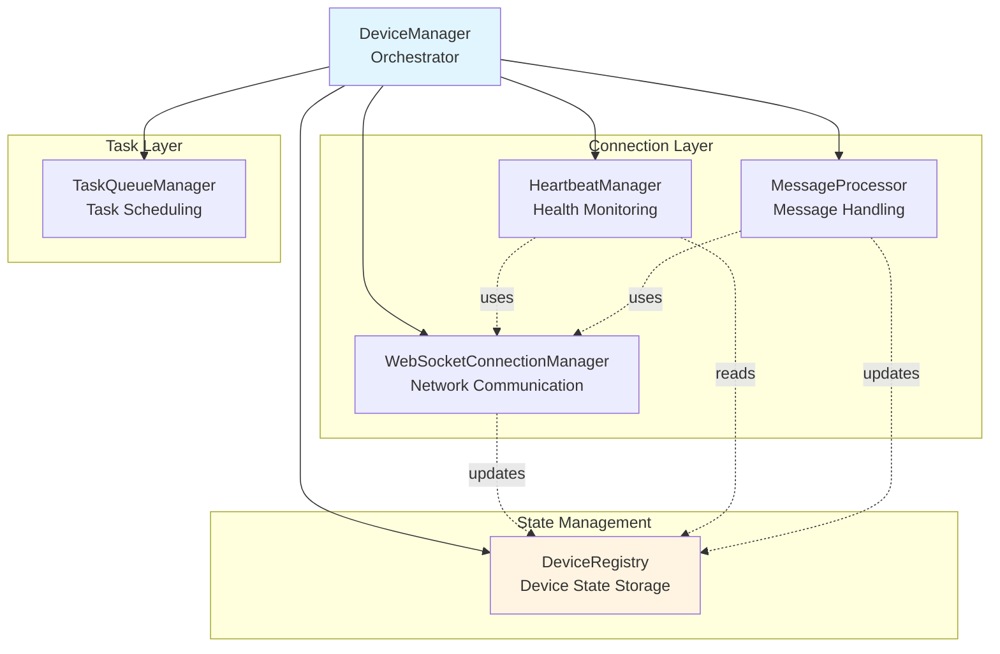

# Galaxy Client Components

Galaxy Client is built from focused, single-responsibility components that work together to provide device management capabilities. This document explains how these components interact and what each one does.

## Related Documentation

- [Overview](./overview.md) - Overall Galaxy Client architecture
- [DeviceManager](./device_manager.md) - How DeviceManager orchestrates these components
- [ConstellationClient](./constellation_client.md) - How components are used in the coordination layer
- [AIP Integration](./aip_integration.md) - Message protocol used by components

---

## Component Architecture Overview

Galaxy Client uses 8 modular components divided into three categories: **Device Management**, **Display & UI**, and **Support Components**. Understanding how these components work together is key to understanding Galaxy Client's design.

### The Big Picture: How Components Collaborate

When DeviceManager needs to manage a device connection, it doesn't do everything itself. Instead, it delegates specific responsibilities to specialized components:



This diagram shows the component relationships. DeviceManager acts as the orchestrator, creating and coordinating all other components. DeviceRegistry serves as the single source of truth for device state. WebSocketConnectionManager, HeartbeatManager, and MessageProcessor all depend on both DeviceRegistry (for state) and each other (for operations). TaskQueueManager works independently, managing task queues.

**Key Design Principles:**

1. **Single Source of Truth**: DeviceRegistry is the only component that stores device state. All other components read from or write to DeviceRegistry, never maintaining their own state.

2. **Dependency Injection**: DeviceManager creates all components and injects dependencies. For example, HeartbeatManager receives references to both WebSocketConnectionManager (to send heartbeats) and DeviceRegistry (to update timestamps).

3. **Background Services**: HeartbeatManager and MessageProcessor run as independent asyncio tasks. They operate continuously in the background without blocking the main execution flow.

4. **Component Independence**: Each component can be tested and understood in isolation. Changing one component's implementation doesn't affect others as long as the interface remains the same.

---

## Device Management Components

These components handle the core device lifecycle: registration, connection, monitoring, and task execution.

### DeviceRegistry: The Single Source of Truth

**Purpose**: DeviceRegistry is the central repository for all device information. Every component that needs to know about device state queries DeviceRegistry.

**What It Stores**: Each device is represented by an `AgentProfile` object containing:

```python
@dataclass
class AgentProfile:
    device_id: str              # Unique device identifier
    server_url: str             # WebSocket endpoint
    os: str                     # Operating system (windows/linux/mac)
    status: DeviceStatus        # Current state (DISCONNECTED/CONNECTING/CONNECTED/IDLE/BUSY/FAILED)
    capabilities: List[str]     # What the device can do (["office", "web", "email"])
    metadata: Dict[str, Any]    # Custom device properties
    last_heartbeat: datetime    # Last successful heartbeat timestamp
    connection_attempts: int    # Number of connection attempts made
    max_retries: int           # Maximum reconnection attempts allowed
    current_task_id: str       # Task being executed (None if idle)
    system_info: Dict          # Hardware/software details from device
```

The `status` field is particularly important as it drives the system's behavior. When a device is IDLE, it can accept new tasks. When BUSY, tasks are queued. When DISCONNECTED, reconnection is attempted.

**Key Operations**:

```python
# Registration and lookup
registry.register_device(device_id, server_url, os, capabilities, metadata)
profile = registry.get_device(device_id)
all_devices = registry.get_all_devices(connected=True)

# Status management
registry.update_device_status(device_id, DeviceStatus.CONNECTED)
is_busy = registry.is_device_busy(device_id)
registry.set_device_busy(device_id, task_id)
registry.set_device_idle(device_id)

# Health tracking
registry.update_heartbeat(device_id)
registry.increment_connection_attempts(device_id)
registry.reset_connection_attempts(device_id)
```

**Why It Matters**: Having a single registry prevents state inconsistencies. Without DeviceRegistry, each component might have its own view of device state, leading to race conditions and bugs. For example, HeartbeatManager might think a device is connected while MessageProcessor thinks it's disconnected.

### WebSocketConnectionManager: Network Communication Handler

**Purpose**: Manages the low-level WebSocket connections to Agent Server and handles message transmission.

**Connection Lifecycle**:

When `connect_to_device()` is called, WebSocketConnectionManager performs these steps:

1. **Establish WebSocket**: Creates an AIP `WebSocketTransport` and connects to the device's server_url. This is an async operation that may timeout or fail due to network issues.

2. **Start Message Handler BEFORE Registration**: Crucially, this happens *before* sending REGISTER to prevent race conditions. The message handler is started via MessageProcessor to ensure we don't miss the server's response.

3. **Send REGISTER**: Uses `RegistrationProtocol` to send an AIP REGISTER message identifying this client to the server. The server responds with a HEARTBEAT message with OK status to confirm registration.

4. **Store Transport**: Saves the WebSocketTransport object and initializes AIP protocol handlers (`RegistrationProtocol`, `TaskExecutionProtocol`, `DeviceInfoProtocol`) for this connection.

**Task Execution**:

When sending a task to a device, WebSocketConnectionManager:

```python
async def send_task_to_device(device_id, task_request):
    # 1. Get Transport and TaskExecutionProtocol
    transport = self._transports[device_id]
    task_protocol = self._task_protocols[device_id]
    
    # 2. Create AIP ClientMessage for task execution
    task_message = ClientMessage(
        type=ClientMessageType.TASK,
        client_type=ClientType.CONSTELLATION,
        client_id=task_client_id,
        target_id=device_id,
        task_name=f"galaxy/{task_name}/{task_request.task_name}",
        request=task_request.request,
        session_id=constellation_task_id,
        status=TaskStatus.CONTINUE,
        ...
    )
    
    # 3. Send message via AIP transport
    await transport.send(task_message.model_dump_json().encode("utf-8"))
    
    # 4. Wait for response (handled via future)
    result = await self._wait_for_task_response(device_id, constellation_task_id)
    
    return ExecutionResult(...)
```

The `_wait_for_task_completion()` method creates an asyncio.Future that MessageProcessor will complete when it receives the TASK_END message from the device.

**Error Handling**: WebSocketConnectionManager catches connection errors (InvalidURI, WebSocketException, OSError, TimeoutError) and returns False, allowing DeviceManager to trigger reconnection logic.

### HeartbeatManager: Connection Health Monitor

**Purpose**: Continuously monitors device health by sending periodic heartbeat messages. This detects connection failures faster than waiting for a task to timeout.

**How It Works**:

For each connected device, HeartbeatManager starts an independent background task that uses AIP `HeartbeatProtocol` to send HEARTBEAT messages periodically and verify the device is still responsive.

**Timeout Detection**: Uses a timeout mechanism to detect when devices stop responding. If no heartbeat response arrives within the expected timeframe, the device is considered disconnected and HeartbeatManager triggers the disconnection handler.

**Why Not Just Use TCP Keepalive?**: WebSocket runs over TCP, which has its own keepalive mechanism. However, TCP keepalive operates at a much longer timescale (typically 2 hours by default) and only detects network-level failures, not application-level hangs. HeartbeatManager detects if the device agent is responsive, not just if the TCP connection is alive.

### MessageProcessor: Message Router and Handler

**Purpose**: Runs a continuous message receiving loop for each device, dispatching incoming AIP messages to appropriate handlers.

**The Message Loop**:

MessageProcessor runs a background task that receives messages from the AIP transport and routes them based on message type. It handles `TASK_END` messages by completing the corresponding future that WebSocketConnectionManager is waiting on, enabling async task execution patterns.

**Task Completion Handling**: When a TASK_END message arrives, MessageProcessor uses the `complete_task_response()` method in WebSocketConnectionManager to resolve the pending future for that task.

**Why Run in Background**: The message loop runs continuously as an asyncio task. This allows it to receive messages asynchronously while the main execution flow (e.g., sending tasks) continues unblocked. Without this, we'd need to alternate between sending and receiving, making the code much more complex.

### TaskQueueManager: Task Scheduling and Queuing

**Purpose**: Manages per-device task queues, ensuring tasks execute sequentially when devices are busy.

**Queue Behavior**:

When a task is assigned to a device that's already executing another task:

```python
# In DeviceManager.assign_task_to_device()
if self.device_registry.is_device_busy(device_id):
    # Device is BUSY - enqueue task
    future = self.task_queue_manager.enqueue_task(device_id, task_request)
    # Wait for task to complete
    result = await future
    return result
else:
    # Device is IDLE - execute immediately
    return await self._execute_task_on_device(device_id, task_request)
```

**How Queuing Works**:

TaskQueueManager maintains a dictionary of queues: `{device_id: queue}`. Each queue is a list of `(task_request, future)` tuples. When a task is enqueued:

```python
def enqueue_task(device_id, task_request):
    # Create a future for this task
    future = asyncio.Future()
    
    # Add to device's queue
    self.queues[device_id].append((task_request, future))
    
    # Return future so caller can await result
    return future
```

When a device completes a task and becomes IDLE, DeviceManager calls:

```python
async def _process_next_queued_task(device_id):
    if self.task_queue_manager.has_queued_tasks(device_id):
        task_request = self.task_queue_manager.dequeue_task(device_id)
        # Execute next task (don't await to avoid blocking)
        asyncio.create_task(self._execute_task_on_device(device_id, task_request))
```

**Why Futures?**: Using asyncio.Future allows the calling code to await task completion even though the task is queued. The caller doesn't need to know whether the task executed immediately or was queued—it just awaits the future and gets the result when ready.

---

## Display Component

### ClientDisplay: User Interface and Console Output

**Purpose**: Provides Rich-based console output for interactive mode and status reporting. This component is only used by GalaxyClient, not by ConstellationClient or DeviceManager.

**Key Features**:

**Banner and Branding**: Shows ASCII art banner when GalaxyClient starts, creating a visual identity for the framework.

**Progress Indication**: Uses Rich Progress bars for long-running operations like initialization:

```python
with display.show_initialization_progress() as progress:
    task = progress.add_task("[cyan]Initializing...", total=None)
    # ... initialization work ...
    progress.update(task, description="[green]Complete!")
```

**Result Display**: Formats execution results in readable tables:

```python
display.display_result({
    "status": "completed",
    "execution_time": 23.45,
    "rounds": 2,
    "constellation": {"task_count": 5}
})
```

This creates a formatted table showing status, time, rounds, and task count in color-coded output.

**Interactive Input**: Provides user input prompts with styling:

```python
user_input = display.get_user_input("UFO[0]")
```

**Colored Messages**: Semantic color coding for different message types:
- Green (success): Task completed, connection established
- Red (error): Task failed, connection error
- Yellow (warning): Device disconnected, timeout
- Cyan (info): Status updates, progress

**Why Separate Component?**: Keeping display logic separate from business logic makes it easy to replace or disable. For example, a web-based frontend could replace ClientDisplay without touching any other components.

---

## Support Components

These components support higher-level client operations by providing status aggregation and configuration management capabilities.

### StatusManager: System-Wide Status Aggregation

**Purpose**: Provides consolidated views of system health and performance across all devices. While DeviceRegistry stores individual device status, StatusManager aggregates this into system-wide metrics.

**Health Summary Example**:

```python
summary = status_manager.get_device_health_summary()
# Returns:
{
    "total_devices": 5,
    "connected_devices": 3,
    "disconnected_devices": 2,
    "connection_rate": 0.6,  # 60% connected
    "devices_by_status": {
        "CONNECTED": 2,
        "IDLE": 1,
        "DISCONNECTED": 1,
        "FAILED": 1
    },
    "devices_with_issues": [
        {
            "device_id": "device_3",
            "issue": "multiple_connection_attempts",
            "attempts": 4,
            "max_retries": 5
        }
    ]
}
```

**Task Statistics**:

```python
stats = status_manager.get_task_statistics()
# Returns:
{
    "total_tasks_executed": 127,
    "successful_tasks": 120,
    "failed_tasks": 7,
    "success_rate": 0.945,
    "average_execution_time": 15.3,  # seconds
    "tasks_by_device": {
        "windows_pc": 65,
        "linux_server": 62
    }
}
```

**Why This Matters**: In production, you need to monitor system health. StatusManager provides the data needed for dashboards, alerts, and capacity planning. For example, if connection_rate drops below 80%, you might trigger an alert.

---

## How Components Work Together: A Complete Example

Let's trace what happens when you call `device_manager.connect_device("windows_pc")`:

**Step 1: DeviceManager Initiates Connection**

```python
# DeviceManager.connect_device()
device_info = self.device_registry.get_device(device_id)  # Get device details
self.device_registry.update_device_status(device_id, DeviceStatus.CONNECTING)  # Update status
```

**Step 2: WebSocketConnectionManager Establishes Connection**

```python
# WebSocketConnectionManager.connect_to_device()
transport = WebSocketTransport(...)
await transport.connect(device_info.server_url)  # Create AIP transport
self._transports[device_id] = transport  # Store transport

# Initialize AIP protocols for this connection
self._registration_protocols[device_id] = RegistrationProtocol(transport)
self._task_protocols[device_id] = TaskExecutionProtocol(transport)
self._device_info_protocols[device_id] = DeviceInfoProtocol(transport)

# ⚠️ CRITICAL: Start message handler BEFORE sending registration
# This ensures we don't miss the server's registration response
self.message_processor.start_message_handler(device_id, transport)
await asyncio.sleep(0.05)  # Small delay to ensure handler is listening

# Register as constellation client using AIP RegistrationProtocol
await self._register_constellation_client(device_info)
```

**Step 3: MessageProcessor Starts Background Loop**

```python
# MessageProcessor.start_message_handler()
task = asyncio.create_task(self._handle_device_messages(device_id, transport))
self._message_handlers[device_id] = task  # Store task for later cancellation
```

Now MessageProcessor is running in the background, ready to receive messages via the AIP transport.

**Step 4: Device Registration Completes**

The device sends back HEARTBEAT with OK status (which serves as registration confirmation). Then WebSocketConnectionManager requests device info via `DeviceInfoProtocol`.

**Step 5: DeviceRegistry Updated with System Info**

```python
# DeviceManager.connect_device() continues
self.device_registry.update_device_system_info(device_id, device_system_info)
self.device_registry.update_device_status(device_id, DeviceStatus.CONNECTED)
self.device_registry.set_device_idle(device_id)  # Ready for tasks
```

**Step 6: HeartbeatManager Starts Monitoring**

```python
# HeartbeatManager.start_heartbeat()
task = asyncio.create_task(self._send_heartbeat_loop(device_id))
self.heartbeat_tasks[device_id] = task
```

Now HeartbeatManager is running in the background, sending heartbeats every 30 seconds.

**Step 7: Connection Complete**

All components are now working together:
- DeviceRegistry knows the device is IDLE and ready
- WebSocketConnectionManager has an active AIP Transport with initialized protocols
- MessageProcessor is listening for incoming messages via the transport
- HeartbeatManager is monitoring connection health
- TaskQueueManager is ready to queue tasks if device becomes busy

This coordinated setup ensures reliable device communication.

---

## Component Dependencies

Understanding component dependencies helps when debugging or extending the system:

```
DeviceManager (creates all components)
├── DeviceRegistry (no dependencies - foundational)
├── WebSocketConnectionManager (depends on: DeviceRegistry for task name)
├── HeartbeatManager (depends on: WebSocketConnectionManager, DeviceRegistry)
├── MessageProcessor (depends on: DeviceRegistry, HeartbeatManager, WebSocketConnectionManager)
└── TaskQueueManager (no dependencies - independent)
```

**Construction Order**: DeviceManager must create components in dependency order:

```python
def __init__(self, task_name, heartbeat_interval, reconnect_delay):
    # 1. DeviceRegistry first (no dependencies)
    self.device_registry = DeviceRegistry()
    
    # 2. WebSocketConnectionManager (needs task_name only)
    self.connection_manager = WebSocketConnectionManager(task_name)
    
    # 3. HeartbeatManager (depends on connection_manager and device_registry)
    self.heartbeat_manager = HeartbeatManager(
        self.connection_manager,
        self.device_registry,
        heartbeat_interval
    )
    
    # 4. MessageProcessor (depends on all previous components)
    self.message_processor = MessageProcessor(
        self.device_registry,
        self.heartbeat_manager,
        self.connection_manager
    )
    
    # 5. TaskQueueManager (independent)
    self.task_queue_manager = TaskQueueManager()
```

**Why This Order Matters**: If we created MessageProcessor before HeartbeatManager, we'd get an error because MessageProcessor's constructor expects HeartbeatManager to exist. The dependency graph dictates construction order.

---

## Testing Components

The modular design makes components easy to test in isolation:

**Testing DeviceRegistry**:

```python
# No external dependencies needed
registry = DeviceRegistry()
registry.register_device("test_device", "ws://localhost:5000", "windows", ["test"])
assert registry.is_device_registered("test_device")
```

**Testing WebSocketConnectionManager**:

```python
# Mock the WebSocket connection
mock_websocket = AsyncMock()
connection_manager = WebSocketConnectionManager("test")
connection_manager.connections["test_device"] = mock_websocket

# Test message sending
await connection_manager.send_task_to_device("test_device", task_request)
mock_websocket.send.assert_called_once()
```

**Testing HeartbeatManager**:

```python
# Inject mock dependencies
mock_connection_manager = Mock()
mock_registry = Mock()
heartbeat_manager = HeartbeatManager(mock_connection_manager, mock_registry, 30.0)

# Test heartbeat loop
heartbeat_manager.start_heartbeat("test_device")
await asyncio.sleep(0.1)  # Let loop run
assert mock_connection_manager.get_connection.called
```

**Why Testability Matters**: Complex systems are hard to test. By breaking DeviceManager into 5 focused components, we can write targeted unit tests for each component's specific behavior, making bugs easier to find and fix.

---

## Summary

Galaxy Client's component architecture demonstrates several important design principles:

**Single Responsibility**: Each component does one thing well. DeviceRegistry stores state, WebSocketConnectionManager handles networking, HeartbeatManager monitors health, MessageProcessor routes messages, TaskQueueManager manages queues.

**Dependency Injection**: DeviceManager creates components and injects dependencies, making the system flexible and testable. Want to replace WebSocketConnectionManager with a different implementation? Just swap it out while keeping the interface.

**Separation of Concerns**: Business logic (in DeviceManager) is separate from display logic (in ClientDisplay) and orchestration support (in StatusManager). Each layer can evolve independently.

**Asynchronous Background Services**: HeartbeatManager and MessageProcessor run as independent asyncio tasks, enabling concurrent operations without blocking the main execution flow.

This design makes Galaxy Client maintainable, extensible, and testable. When you understand how components collaborate, you can confidently modify or extend the system.

## Related Documentation

- [DeviceManager Reference](./device_manager.md) - See how DeviceManager orchestrates these components
- [ConstellationClient](./constellation_client.md) - Learn how components are used in the coordination layer
- [Overview](./overview.md) - Understand the broader Galaxy Client architecture
- [AIP Integration](./aip_integration.md) - Learn about the message protocol components use
- [DeviceRegistry Details](../agent_registration/device_registry.md) - Deep dive into device state management
