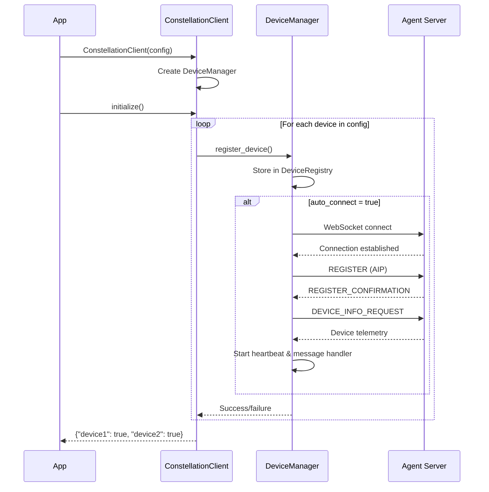

# ConstellationClient Reference

ConstellationClient is the device coordination layer in Galaxy Client. It provides a clean API for registering devices, managing connections, and assigning tasks. Most applications interact with ConstellationClient rather than the lower-level DeviceManager.

## Related Documentation

- [Overview](./overview.md) - Overall architecture and workflow
- [DeviceManager](./device_manager.md) - Internal connection management
- [Components](./components.md) - Modular component details
- [Configuration](../../configuration/system/galaxy_constellation.md) - Device configuration
- [GalaxyClient](./galaxy_client.md) - Session wrapper on top of ConstellationClient

## What ConstellationClient Does

ConstellationClient implements the Facade pattern, providing a simplified interface to the complex device management system underneath. Think of it as the "device management API" for Galaxy.

**Core Responsibilities:**

**Device Lifecycle Management**: ConstellationClient handles the complete lifecycle of device connections. When you register a device, it stores the device information (ID, server URL, capabilities) in DeviceRegistry. When you connect, it coordinates with DeviceManager to establish WebSocket connections, perform AIP registration, and start health monitoring. When you disconnect, it cleanly tears down all resources.

**Task Assignment**: When you have a task to execute, ConstellationClient determines which device should run it (based on capabilities), checks if the device is available, and delegates to DeviceManager for actual execution. It abstracts away details like task queuing when devices are busy or handling connection failures during execution.

**Configuration Management**: ConstellationClient loads device configurations from YAML files or programmatic APIs, validates settings, and maintains the runtime configuration. This centralizes all configuration logic so other components don't need to worry about it.

**Status Reporting**: Applications need to know what's happening with devices. ConstellationClient provides methods to query device status, get health summaries, and retrieve execution statistics. This information is aggregated from multiple components (DeviceRegistry, DeviceManager, TaskQueueManager) and presented in a unified format.

**What ConstellationClient Does NOT Do:**

- **DAG Planning**: Task decomposition is handled by ConstellationAgent
- **DAG Execution**: Coordinating task dependencies is handled by TaskConstellationOrchestrator  
- **Session Management**: Multi-round interactions are handled by GalaxySession
- **Low-Level Connection Management**: WebSocket lifecycle is handled by DeviceManager

This separation of concerns keeps ConstellationClient focused on device-level operations.

## Initialization

### Constructor

```python
def __init__(
    self,
    config: Optional[ConstellationConfig] = None,
    task_name: Optional[str] = None,
):
    """
    Initialize ConstellationClient with configuration.
    
    Args:
        config: Device configuration (creates default if None)
        task_name: Override task name from config
    """
```

When you create a ConstellationClient, it performs these initialization steps:

1. **Load or Create Configuration**: If you provide a `config` parameter, it uses that. Otherwise, it creates a default `ConstellationConfig` object. This config contains device information, heartbeat settings, and other parameters.

2. **Override Task Name**: If you provide `task_name`, it overrides the task name from the configuration. The task name identifies this constellation instance in logs and messages.

3. **Create DeviceManager**: ConstellationClient creates an internal DeviceManager instance, passing the task name and connection settings (heartbeat interval, reconnect delay). DeviceManager is the component that actually manages connections.

**Initialization Examples:**

```python
# Simple: Use default configuration
client = ConstellationClient()

# Load configuration from YAML
config = ConstellationConfig.from_yaml("config/devices.yaml")
client = ConstellationClient(config=config)

# Override task name for this instance
client = ConstellationClient(
    config=config,
    task_name="data_processing_pipeline"
)
```

The task name appears in logs and helps identify which constellation instance generated which messages, which is useful when running multiple constellations simultaneously.

### Async Initialize Method

```python
async def initialize(self) -> Dict[str, bool]:
    """
    Register and optionally connect all devices from configuration.
    
    Returns:
        Dictionary mapping device_id to registration success status
    """
```

After creating a ConstellationClient, you must call `initialize()` before using it. This method processes all devices defined in the configuration:

**Registration Process:**

For each device in the configuration, `initialize()` calls `register_device_from_config()`, which:

1. Extracts device parameters (device_id, server_url, os, capabilities, metadata)
2. Calls DeviceManager to register the device
3. If `auto_connect: true` is set, immediately connects to the device

**Auto-Connect Behavior:**

The `auto_connect` flag in configuration determines whether devices connect during initialization or wait for explicit `connect_device()` calls. Auto-connect is convenient for simple scenarios but may not be suitable if you need fine-grained control over connection timing.

**Return Value:**

The method returns a dictionary showing which devices successfully registered:

```python
results = await client.initialize()
# Example: {"windows_pc": True, "linux_server": True, "failed_device": False}

# Check for failures
failed = [device_id for device_id, success in results.items() if not success]
if failed:
    print(f"Failed to register: {failed}")
```

**Typical Initialization Flow:**



This diagram shows the initialization sequence. For each configured device, ConstellationClient delegates to DeviceManager, which handles the low-level connection setup if auto-connect is enabled.

## Device Management Methods

### Register Device

```python
async def register_device(
    self,
    device_id: str,
    server_url: str,
    capabilities: Optional[List[str]] = None,
    metadata: Optional[Dict[str, Any]] = None,
    auto_connect: bool = True,
) -> bool:
```

This method registers a device programmatically (outside of configuration). It's useful for dynamically adding devices at runtime.

!!! warning "Known Limitation"
    The current implementation does not pass the OS parameter to the underlying `DeviceManager`. For proper device registration with OS information, use configuration-based registration via `register_device_from_config()` or ensure the OS is included in the device metadata.

**Parameters Explained:**

- **device_id**: Unique identifier for the device. Used in all subsequent operations.
- **server_url**: WebSocket endpoint of the Agent Server (e.g., `ws://192.168.1.100:5000/ws`)
- **capabilities**: List of capabilities this device provides (e.g., `["office", "web", "email"]`)
- **metadata**: Additional device properties (e.g., `{"location": "datacenter", "gpu": "RTX 4090"}`)
- **auto_connect**: Whether to immediately connect after registration

**Usage Example:**

```python
# Register a Windows device with Office capabilities
success = await client.register_device(
    device_id="workstation_001",
    server_url="ws://192.168.1.50:5000/ws",
    capabilities=["office", "web", "email"],
    metadata={"location": "office", "user": "john"},
    auto_connect=True
)

if success:
    print("Device registered and connected")
else:
    print("Registration failed")
```

### Connect and Disconnect

```python
async def connect_device(self, device_id: str) -> bool:
    """Connect to a registered device."""

async def disconnect_device(self, device_id: str) -> bool:
    """Disconnect from a device."""
    
async def connect_all_devices(self) -> Dict[str, bool]:
    """Connect to all registered devices."""
    
async def disconnect_all_devices(self) -> None:
    """Disconnect from all devices."""
```

These methods control device connections. You might disconnect devices to save resources or reconnect after configuration changes.

**Connection Example:**

```python
# Connect to specific device
await client.connect_device("windows_pc")

# Connect to all registered devices
results = await client.connect_all_devices()
print(f"Connected to {sum(results.values())} devices")

# Disconnect when done
await client.disconnect_device("windows_pc")
```

Connection establishment involves WebSocket handshake, AIP registration, device info exchange, and starting background monitoring services (heartbeat and message processing).

## Task Execution

### Assign Task to Device

While ConstellationClient doesn't expose a direct `assign_task_to_device()` method in its public API (that's internal to DeviceManager), it's used by higher-level orchestrators like TaskConstellationOrchestrator. Understanding how task assignment works helps you understand the system:

**Task Assignment Process:**

1. **Device Status Check**: DeviceManager checks if the target device is IDLE or BUSY
2. **Immediate Execution**: If IDLE, the task executes immediately
3. **Queuing**: If BUSY, the task enters the device's queue
4. **Task Transmission**: WebSocketConnectionManager sends TASK message via AIP
5. **Result Waiting**: MessageProcessor waits for TASK_END message
6. **Completion**: Device returns to IDLE, next queued task starts

**Why Task Assignment is Internal:**

ConstellationClient focuses on device management, not task orchestration. Task assignment is exposed through higher-level APIs:

- TaskConstellationOrchestrator assigns tasks based on DAG dependencies
- GalaxySession coordinates multi-round task execution
- Direct device-level task assignment is available through DeviceManager if needed

This layering ensures each component has a clear responsibility.

## Status and Information

### Get Device Status

```python
def get_device_status(self, device_id: Optional[str] = None) -> Dict[str, Any]:
    """
    Get device status information.
    
    If device_id is provided, returns status for that device.
    If device_id is None, returns status for all connected devices.
    """
```

Device status includes:

```python
{
    "device_id": "windows_pc",
    "status": "IDLE",  # DISCONNECTED/CONNECTING/CONNECTED/IDLE/BUSY/FAILED
    "server_url": "ws://192.168.1.100:5000/ws",
    "capabilities": ["office", "web"],
    "last_heartbeat": "2025-11-06T10:30:45",
    "connection_attempts": 1,
    "max_retries": 5,
    "current_task_id": None,  # Task ID if device is BUSY
    "queued_tasks": 0,  # Number of queued tasks
    "system_info": {  # From device telemetry
        "cpu_count": 8,
        "memory_gb": 32,
        "os_version": "Windows 11",
        ...
    }
}
```

The status provides a comprehensive view of device health and activity, useful for monitoring dashboards or debugging connection issues.

### Get Connected Devices

```python
def get_connected_devices(self) -> List[str]:
    """Get list of device IDs that are currently connected."""
```

Returns a list of device IDs in CONNECTED, IDLE, or BUSY status. Useful for determining which devices are available for task assignment.

```python
connected = client.get_connected_devices()
print(f"Available devices: {', '.join(connected)}")

# Check if specific device is connected
if "windows_pc" in connected:
    # Assign task to this device
    ...
```

### Get Constellation Info

```python
def get_constellation_info(self) -> Dict[str, Any]:
    """Get overall constellation status and configuration."""
```

Returns constellation-level information:

```python
{
    "constellation_id": "production_constellation",
    "connected_devices": 3,  # Number currently connected
    "total_devices": 5,      # Total registered devices
    "configuration": {
        "heartbeat_interval": 30.0,
        "reconnect_delay": 5.0,
        "max_concurrent_tasks": 10
    }
}
```

This provides a high-level view of the entire constellation, useful for monitoring overall system health.

## Configuration Management

### Validate Configuration

```python
def validate_config(self, config: Optional[ConstellationConfig] = None) -> Dict[str, Any]:
    """
    Validate constellation configuration.
    
    Checks:
    - task_name is provided
    - devices are configured
    - settings are in valid ranges
    """
```

Validation catches configuration errors early:

```python
result = client.validate_config()

if not result["valid"]:
    print("Configuration errors:")
    for error in result["errors"]:
        print(f"  - {error}")
        
if result["warnings"]:
    print("Warnings:")
    for warning in result["warnings"]:
        print(f"  - {warning}")
```

### Get Configuration Summary

```python
def get_config_summary(self) -> Dict[str, Any]:
    """Get summary of current configuration."""
```

Returns a human-readable configuration summary:

```python
{
    "task_name": "production_constellation",
    "devices_count": 3,
    "devices": [
        {
            "device_id": "windows_pc",
            "server_url": "ws://192.168.1.100:5000/ws",
            "capabilities": ["office", "web"],
            "auto_connect": true
        },
        ...
    ],
    "settings": {
        "heartbeat_interval": 30.0,
        "reconnect_delay": 5.0,
        "max_concurrent_tasks": 10
    }
}
```

### Add Device to Configuration

```python
async def add_device_to_config(
    self,
    device_id: str,
    server_url: str,
    capabilities: Optional[List[str]] = None,
    metadata: Optional[Dict[str, Any]] = None,
    auto_connect: bool = True,
    register_immediately: bool = True,
) -> bool:
```

Dynamically adds a device to the configuration and optionally registers it:

```python
# Add device to config and register
await client.add_device_to_config(
    device_id="new_device",
    server_url="ws://192.168.1.200:5000/ws",
    capabilities=["database"],
    register_immediately=True  # Register right away
)

# Add to config only, register later
await client.add_device_to_config(
    device_id="staging_device",
    server_url="ws://staging.example.com:5000/ws",
    register_immediately=False  # Just update config
)
```

This is useful for dynamic device discovery scenarios where devices are added at runtime.

## Lifecycle Management

### Shutdown

```python
async def shutdown(self) -> None:
    """
    Gracefully shutdown the constellation client.
    
    Stops all background services and disconnects all devices.
    """
```

Shutdown performs cleanup in this order:

1. **Stop Task Queues**: Cancel all queued tasks across all devices
2. **Stop Message Handlers**: Stop MessageProcessor loops for all devices
3. **Stop Heartbeats**: Stop HeartbeatManager loops for all devices
4. **Disconnect Devices**: Close WebSocket connections to all devices
5. **Cancel Reconnection Tasks**: Cancel any pending reconnection attempts

**Proper Shutdown Example:**

```python
try:
    client = ConstellationClient(config)
    await client.initialize()
    
    # Use the client
    ...
    
finally:
    # Always shutdown to cleanup resources
    await client.shutdown()
```

Without proper shutdown, background tasks continue running, WebSocket connections remain open, and resources leak.

## Usage Patterns

### Basic Device Management

```python
# Create and initialize client
client = ConstellationClient()
await client.initialize()

# Check which devices connected
connected = client.get_connected_devices()
print(f"Connected: {connected}")

# Get status for specific device
status = client.get_device_status("windows_pc")
print(f"Status: {status['status']}, Tasks queued: {status['queued_tasks']}")

# Shutdown when done
await client.shutdown()
```

### Dynamic Device Addition

```python
# Start with base configuration
client = ConstellationClient(base_config)
await client.initialize()

# Discover new device at runtime
new_device_info = await discover_device()

# Add and connect
await client.add_device_to_config(
    device_id=new_device_info["id"],
    server_url=new_device_info["url"],
    capabilities=new_device_info["capabilities"],
    register_immediately=True
)

# Verify connection
if new_device_info["id"] in client.get_connected_devices():
    print("New device ready")
```

### Health Monitoring

```python
import asyncio

async def monitor_health(client):
    """Continuously monitor device health."""
    while True:
        info = client.get_constellation_info()
        
        # Check connection rate
        connection_rate = info["connected_devices"] / info["total_devices"]
        if connection_rate < 0.8:  # Less than 80% connected
            print(f"Warning: Only {connection_rate:.0%} devices connected")
        
        # Check individual device health
        for device_id in client.get_connected_devices():
            status = client.get_device_status(device_id)
            
            # Check heartbeat freshness
            last_hb = datetime.fromisoformat(status["last_heartbeat"])
            age = datetime.now() - last_hb
            if age.total_seconds() > 60:  # No heartbeat in 60 seconds
                print(f"Warning: {device_id} heartbeat stale")
        
        await asyncio.sleep(30)  # Check every 30 seconds
```

## Integration with Other Components

### Used by GalaxyClient

GalaxyClient wraps ConstellationClient for session management:

```python
class GalaxyClient:
    def __init__(self, ...):
        # Create internal ConstellationClient
        self._client = ConstellationClient(config, task_name)
    
    async def initialize(self):
        # Initialize ConstellationClient
        await self._client.initialize()
        
    async def process_request(self, request):
        # Use ConstellationClient for device coordination
        # while GalaxySession handles task orchestration
        session = GalaxySession(client=self._client, ...)
        await session.run()
```

### Used by TaskConstellationOrchestrator

TaskConstellationOrchestrator uses ConstellationClient's DeviceManager for task assignment:

```python
# Orchestrator assigns tasks to devices based on capabilities
for task in dag.tasks:
    device_id = select_device_for_task(task)
    
    # Assign through DeviceManager (internal to ConstellationClient)
    result = await constellation_client.device_manager.assign_task_to_device(
        task_id=task.id,
        device_id=device_id,
        task_description=task.description,
        task_data=task.data
    )
```

## Summary

ConstellationClient is the primary interface for device management in Galaxy Client. It provides:

- **Simple API**: Clean methods for registration, connection, status queries
- **Configuration Management**: Load from files, validate, modify at runtime
- **Delegation**: Hides complexity of DeviceManager and its components
- **Focused Scope**: Device management only, not DAG planning or session management

For most applications, ConstellationClient (or GalaxyClient which wraps it) is all you need. Only advanced scenarios require working directly with DeviceManager or its components.

**Next Steps:**

- See [DeviceManager](./device_manager.md) for low-level connection management details
- See [Components](./components.md) for modular component architecture
- See [Overview](./overview.md) for overall system architecture
- See [GalaxyClient](./galaxy_client.md) for session-level API
