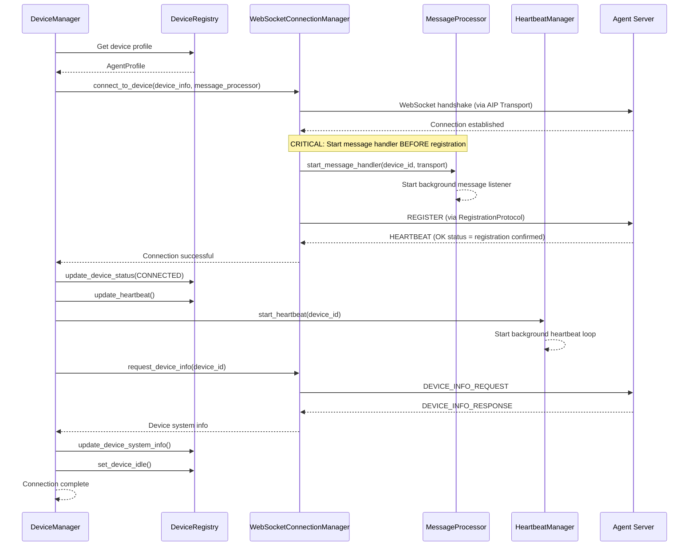
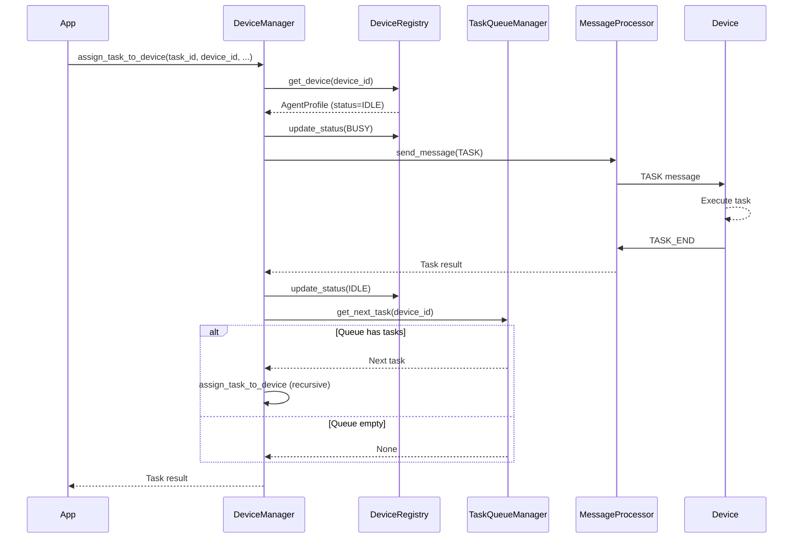
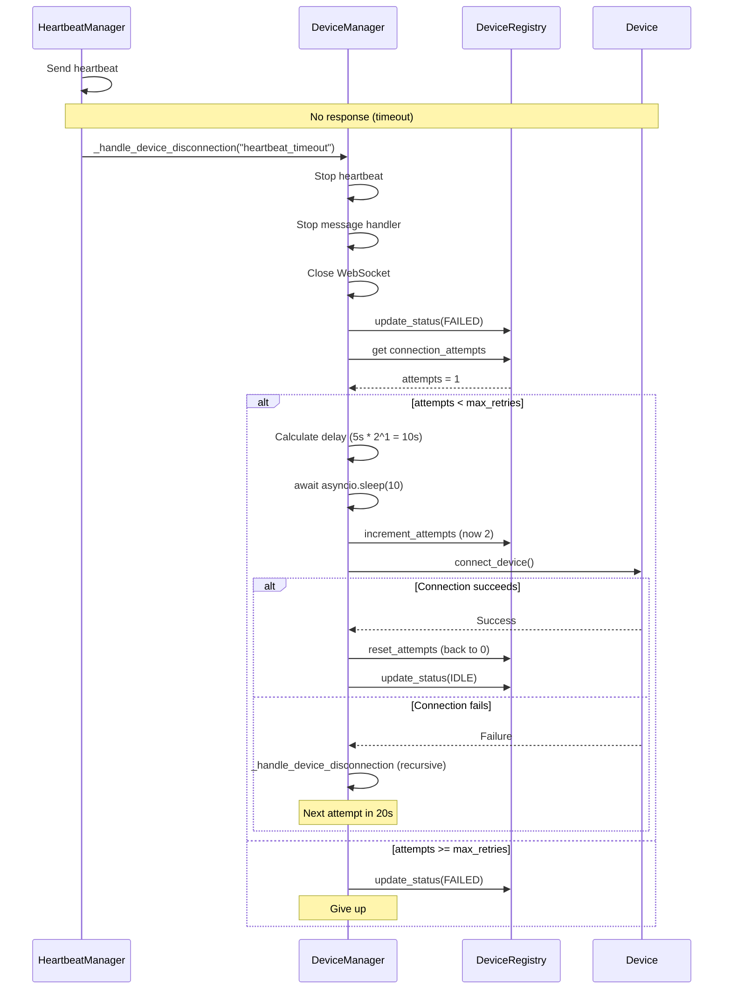

# DeviceManager Reference

DeviceManager is the connection orchestration layer in Galaxy Client. While ConstellationClient provides the high-level device management API, DeviceManager handles the low-level details of WebSocket connections, health monitoring, message routing, and task queuing.

## Related Documentation

- [Overview](./overview.md) - Overall Galaxy Client architecture and workflow
- [ConstellationClient](./constellation_client.md) - High-level device management API
- [Components](./components.md) - Detailed documentation for each DeviceManager component
- [AIP Integration](./aip_integration.md) - Protocol details and message flows

---

## What DeviceManager Does

DeviceManager acts as the orchestration coordinator, managing the lifecycle of device connections from initial registration through task execution to disconnection. It doesn't perform these operations itself; instead, it coordinates five specialized components to handle different aspects of device management.

**Orchestration Philosophy:**

DeviceManager follows the Coordinator pattern. When you call `register_device()`, DeviceManager doesn't directly store device information—it delegates to DeviceRegistry. When you call `connect_device()`, DeviceManager doesn't create WebSocket connections itself—it delegates to WebSocketConnectionManager. When a device sends a message, DeviceManager doesn't process it—MessageProcessor handles that.

This separation of concerns makes each component focused and testable. DeviceManager simply coordinates the flow of operations across components.

**Core Responsibilities:**

**Device Registration**: When a device registers, DeviceManager creates an AgentProfile containing device metadata (ID, server URL, capabilities, OS) and delegates to DeviceRegistry for storage. DeviceRegistry becomes the single source of truth for device state.

**Connection Establishment**: When you connect to a device, DeviceManager coordinates multiple steps: WebSocketConnectionManager establishes the WebSocket connection, MessageProcessor sends the REGISTER message per AIP protocol, DeviceManager requests device telemetry, and HeartbeatManager starts background health monitoring.

**Disconnection Handling**: When a device disconnects (intentionally or due to failure), DeviceManager coordinates cleanup: HeartbeatManager stops health checks, MessageProcessor stops the message handling loop, WebSocketConnectionManager closes the WebSocket, TaskQueueManager clears pending tasks, and DeviceRegistry updates device status.

**Reconnection Logic**: For network failures, DeviceManager implements exponential backoff reconnection. It tracks connection attempts, waits progressively longer between retries (5s, 10s, 20s, ...), and gives up after max retries. Reconnection happens automatically without user intervention.

**Task Assignment Coordination**: When assigning a task, DeviceManager checks device status via DeviceRegistry, queues tasks via TaskQueueManager if the device is busy, and delegates execution to MessageProcessor when the device becomes available.

**What DeviceManager Does NOT Do:**

- **WebSocket I/O**: Handled by WebSocketConnectionManager
- **Health Monitoring**: Handled by HeartbeatManager  
- **Message Processing**: Handled by MessageProcessor
- **Device State Storage**: Handled by DeviceRegistry
- **Task Queuing**: Handled by TaskQueueManager

DeviceManager coordinates these components but doesn't duplicate their functionality.

---

## Component Architecture

DeviceManager uses a modular architecture with five components, each responsible for a specific aspect of device management:

```
DeviceManager (Orchestrator)
    |
    +-- DeviceRegistry (Device State)
    |       Stores AgentProfiles, device status
    |
    +-- WebSocketConnectionManager (Connection Lifecycle)
    |       Establishes/closes WebSocket connections
    |
    +-- HeartbeatManager (Health Monitoring)
    |       Sends periodic heartbeats, detects failures
    |
    +-- MessageProcessor (Message Routing)
    |       Routes AIP messages, handles responses
    |
    +-- TaskQueueManager (Task Queuing)
            Queues tasks when devices busy
```

**Why This Architecture?**

**Single Responsibility**: Each component has one job. DeviceRegistry manages state, WebSocketConnectionManager manages connections, HeartbeatManager monitors health. This makes each component easy to understand, test, and modify.

**Testability**: You can test each component in isolation. Mock DeviceRegistry to test connection logic. Mock WebSocketConnectionManager to test message processing. This simplifies unit testing.

**Extensibility**: Adding new functionality means adding or modifying a single component. Need different health monitoring? Replace HeartbeatManager. Need different queuing strategies? Modify TaskQueueManager. Other components remain unchanged.

**Clarity**: When debugging, you know where to look. Connection failures? Check WebSocketConnectionManager. Missed heartbeats? Check HeartbeatManager. Status inconsistencies? Check DeviceRegistry.

**Component Interactions:**

Components interact through DeviceManager as the coordinator:

1. **Registration Flow**: DeviceManager → DeviceRegistry (store profile)
2. **Connection Flow**: DeviceManager → WebSocketConnectionManager (connect) → MessageProcessor (send REGISTER) → DeviceRegistry (update status) → HeartbeatManager (start monitoring)
3. **Task Assignment Flow**: DeviceManager → DeviceRegistry (check status) → TaskQueueManager (queue if busy) → MessageProcessor (send TASK)
4. **Disconnection Flow**: DeviceManager → HeartbeatManager (stop) → MessageProcessor (stop) → WebSocketConnectionManager (close) → TaskQueueManager (clear) → DeviceRegistry (update status)

The coordinator pattern ensures components don't directly depend on each other, reducing coupling.

---

## Initialization

### Constructor

```python
def __init__(
    self,
    task_name: str = "test_task",
    heartbeat_interval: float = 30.0,
    reconnect_delay: float = 5.0,
):
    """
    Initialize DeviceManager.
    
    Args:
        task_name: Identifier for this constellation instance (default "test_task")
        heartbeat_interval: Seconds between heartbeat checks (default 30s)
        reconnect_delay: Initial delay before reconnection attempt (default 5s)
    """
```

When you create a DeviceManager, it initializes the five components:

1. **Create DeviceRegistry**: Initializes empty device storage
2. **Create WebSocketConnectionManager**: Prepares connection handling infrastructure
3. **Create HeartbeatManager**: Creates heartbeat scheduler with specified interval
4. **Create MessageProcessor**: Creates message routing infrastructure  
5. **Create TaskQueueManager**: Creates per-device task queues
6. **Store Configuration**: Saves task_name, reconnect settings for later use

**Parameter Explanations:**

**task_name**: This identifier appears in log messages and helps distinguish between multiple constellation instances running simultaneously. For example, "production_constellation" vs "test_constellation".

**heartbeat_interval**: How often (in seconds) HeartbeatManager checks device health. Lower values (e.g., 10s) detect failures faster but increase network traffic. Higher values (e.g., 60s) reduce overhead but delay failure detection. Default 30s balances responsiveness and efficiency.

**reconnect_delay**: Initial delay before first reconnection attempt. DeviceManager uses exponential backoff, so subsequent delays double: 5s, 10s, 20s, 40s, 80s. Lower values reconnect faster but may overwhelm unstable networks. Higher values give networks more recovery time.

**max_retries**: The maximum number of reconnection attempts is configured per-device during registration via the `max_retries` parameter (default 5) in `AgentProfile`. This allows different devices to have different retry limits based on their reliability characteristics.

---

## Device Lifecycle Methods

### Register Device

```python
async def register_device(
    self,
    device_id: str,
    server_url: str,
    os: str,
    capabilities: Optional[List[str]] = None,
    metadata: Optional[Dict[str, Any]] = None,
    max_retries: int = 5,
    auto_connect: bool = True,
) -> bool:
    """
    Register a device for management.
    
    Creates an AgentProfile and stores it in DeviceRegistry.
    Does NOT establish connection; use connect_device() for that.
    """
```

Registration stores device information without connecting. This separation allows you to register all devices at startup but connect selectively based on runtime conditions.

**Registration Process:**

1. **Create AgentProfile**: DeviceManager creates an AgentProfile object containing:
   - `device_id`: Unique identifier
   - `server_url`: WebSocket endpoint  
   - `os`: Operating system (Windows, Linux, macOS)
   - `capabilities`: List of capability tags (e.g., ["office", "web", "email"])
   - `metadata`: Arbitrary key-value data (e.g., {"location": "datacenter", "gpu": "RTX 4090"})
   - `status`: Initially set to DISCONNECTED

2. **Store in DeviceRegistry**: DeviceManager delegates to DeviceRegistry, which:
   - Validates device_id is unique
   - Stores the AgentProfile
   - Initializes device status to DISCONNECTED

3. **Return Success**: Returns True if registration succeeds, False if device_id already exists

**When Registration Fails:**

Registration fails if:
- Device ID already registered (must use unique IDs)
- Invalid server URL format
- Validation errors in AgentProfile creation

**Example:**

```python
# Register device without connecting
success = await device_manager.register_device(
    device_id="office_pc",
    server_url="ws://192.168.1.100:5000/ws",
    os="Windows",
    capabilities=["office", "web"],
    metadata={"location": "office_building_a", "user": "john"}
)

if success:
    print("Device registered, ready to connect")
else:
    print("Registration failed (ID already exists?)")
```

### Connect Device

```python
async def connect_device(self, device_id: str, is_reconnection: bool = False) -> bool:
    """
    Establish connection to a registered device.
    
    Performs WebSocket handshake, AIP registration, device info exchange,
    and starts background monitoring services.
    """
```

Connection is a multi-step process involving several components working together:

**Step 1: Verify Registration**

DeviceManager queries DeviceRegistry to verify the device is registered. If not registered, connection fails immediately.

**Step 2: WebSocket Connection**

DeviceManager delegates to WebSocketConnectionManager, passing the MessageProcessor to start message handling before registration (to avoid race conditions):

```python
# Connect and automatically start message handler
await connection_manager.connect_to_device(
    device_info, 
    message_processor=self.message_processor
)
```

WebSocketConnectionManager creates an AIP `WebSocketTransport`, establishes the connection, starts the message handler (via MessageProcessor), and performs AIP registration using `RegistrationProtocol`.

**Step 3: Update Status and Start Heartbeat**

After WebSocket connects successfully:

```python
# Update status to CONNECTED
device_registry.update_device_status(device_id, DeviceStatus.CONNECTED)
device_registry.update_heartbeat(device_id)

# Start heartbeat monitoring
heartbeat_manager.start_heartbeat(device_id)
```

Note: The message handler was already started in `connect_to_device()` to prevent race conditions.

**Step 4: Device Info Exchange**

DeviceManager requests device system information from the server (the device pushes its info during registration, server stores it):

```python
device_system_info = await connection_manager.request_device_info(device_id)
if device_system_info:
    device_registry.update_device_system_info(device_id, device_system_info)
```

Device info includes CPU count, memory, OS version, screen resolution, and other system details stored in the AgentProfile.

**Step 5: Set Device to IDLE**

DeviceManager updates device status to ready for tasks:

```python
device_registry.set_device_idle(device_id)
```

Device is now ready to accept tasks. Note that HeartbeatManager was already started in Step 3, and MessageProcessor's message handler was started automatically during the WebSocket connection in Step 2.

**Connection Sequence Diagram:**



This diagram shows the entire connection flow, from initial WebSocket handshake through AIP registration to background service startup.

**When Connection Fails:**

Connection can fail at multiple points:

- **WebSocket Failure**: Network unreachable, server not running, firewall blocking
- **Registration Failure**: Server rejects device (invalid credentials, server full)
- **Timeout**: Server doesn't respond within timeout period
- **Protocol Error**: Server sends unexpected message format

When connection fails, DeviceManager:

1. Closes WebSocket if partially connected
2. Updates device status to FAILED
3. Schedules reconnection attempt (if retries remain)

### Disconnect Device

```python
async def disconnect_device(self, device_id: str) -> None:
    """
    Disconnect from a device and cleanup resources.
    
    Stops background services, closes WebSocket, and updates status.
    """
```

Disconnection performs cleanup in reverse order of connection:

**Step 1: Stop Heartbeat**

```python
await heartbeat_manager.stop_heartbeat(device_id)
```

This cancels the background heartbeat task, preventing further heartbeat messages.

**Step 2: Stop Message Handler**

```python
await message_processor.stop_message_handler(device_id)
```

This cancels the background message listener task, preventing further message processing.

**Step 3: Clear Task Queue**

```python
task_queue_manager.clear_queue(device_id)
```

Any queued tasks are cancelled. In-progress tasks are allowed to complete (graceful shutdown).

**Step 4: Close WebSocket**

```python
await websocket_connection_manager.disconnect(device_id)
```

This sends WebSocket CLOSE frame and closes the connection.

**Step 5: Update Status**

```python
device_registry.update_status(device_id, DeviceStatus.DISCONNECTED)
```

Device status becomes DISCONNECTED, indicating it's no longer available.

**Graceful vs Forceful Disconnection:**

Current implementation is graceful: it waits for in-progress tasks to complete before closing the connection. For forceful disconnection (immediate shutdown), you would:

1. Cancel in-progress tasks
2. Clear task queue
3. Close WebSocket immediately without waiting

---

## Task Assignment

### Assign Task to Device

```python
async def assign_task_to_device(
    self,
    task_id: str,
    device_id: str,
    task_description: str,
    task_data: Dict[str, Any],
    timeout: float = 1000,
) -> ExecutionResult:
    """
    Assign a task to a device for execution.
    
    If device is IDLE, executes immediately.
    If device is BUSY, queues task for later execution.
    """
```

Task assignment involves checking device status, potentially queuing, and sending the TASK message:

**Step 1: Check Device Status**

```python
profile = device_registry.get_device(device_id)
status = profile.status
```

Device must be CONNECTED, IDLE, or BUSY. If DISCONNECTED or FAILED, task assignment fails immediately.

**Step 2: Queue if Busy**

```python
if status == DeviceStatus.BUSY:
    # Add to queue
    task_queue_manager.add_task(
        device_id=device_id,
        task_id=task_id,
        task_description=task_description,
        task_data=task_data
    )
    return {"status": "queued", "task_id": task_id}
```

TaskQueueManager maintains per-device FIFO queues. When the device completes its current task, TaskQueueManager automatically assigns the next queued task.

**Step 3: Execute Immediately**

```python
if status == DeviceStatus.IDLE:
    # Update status to BUSY
    device_registry.update_status(device_id, DeviceStatus.BUSY)
    
    # Send TASK message
    await message_processor.send_message(
        device_id=device_id,
        message_type="TASK",
        payload={
            "task_id": task_id,
            "description": task_description,
            "data": task_data
        }
    )
    
    # Wait for TASK_END
    result = await message_processor.wait_for_response(
        device_id=device_id,
        message_type="TASK_END",
        timeout=1000.0  # Default timeout
    )
    
    # Update status back to IDLE
    device_registry.update_status(device_id, DeviceStatus.IDLE)
    
    # Execute next queued task if any
    next_task = task_queue_manager.get_next_task(device_id)
    if next_task:
        await self.assign_task_to_device(**next_task)
    
    return result
```

This flow ensures devices never have more than one task executing at a time, preventing resource contention.

**Task Assignment Sequence:**



This diagram shows the complete task assignment flow, including automatic processing of queued tasks after completion.

**Task Timeout Handling:**

If a task doesn't complete within the timeout period (default 1000 seconds):

1. MessageProcessor raises TimeoutError
2. DeviceManager marks device as FAILED
3. DeviceManager attempts reconnection
4. Queued tasks remain in queue and execute after reconnection

---

## Disconnection and Reconnection

### Handle Device Disconnection

```python
async def _handle_device_disconnection(
    self,
    device_id: str,
    reason: str = "unknown",
) -> None:
    """
    Internal handler for unexpected disconnections.
    
    Performs cleanup and initiates reconnection if retries remain.
    """
```

When a device disconnects unexpectedly (network failure, server crash, heartbeat timeout), DeviceManager performs cleanup and attempts reconnection:

**Step 1: Log Disconnection**

```python
logger.warning(f"Device {device_id} disconnected: {reason}")
```

Reason indicates why disconnection occurred: "heartbeat_timeout", "websocket_error", "protocol_error", etc.

**Step 2: Cleanup Resources**

Same as `disconnect_device()`:
- Stop heartbeat
- Stop message handler  
- Close WebSocket
- Update status to FAILED

**Step 3: Check Reconnection Eligibility**

```python
profile = device_registry.get_device(device_id)
attempts = profile.connection_attempts

if attempts < max_retries:
    # Schedule reconnection
    await self._schedule_reconnection(device_id)
else:
    # Give up
    logger.error(f"Device {device_id} exceeded max retries ({max_retries})")
    device_registry.update_status(device_id, DeviceStatus.FAILED)
```

DeviceRegistry tracks connection attempts per device. If max retries exceeded, DeviceManager gives up and marks device as permanently failed.

**Step 4: Schedule Reconnection**

```python
async def _schedule_reconnection(self, device_id: str) -> None:
    """Schedule reconnection with exponential backoff."""
    profile = device_registry.get_device(device_id)
    attempts = profile.connection_attempts
    
    # Calculate delay: 5s, 10s, 20s, 40s, 80s
    delay = reconnect_delay * (2 ** attempts)
    
    logger.info(f"Reconnecting to {device_id} in {delay}s (attempt {attempts+1}/{max_retries})")
    
    # Wait
    await asyncio.sleep(delay)
    
    # Increment attempt counter
    device_registry.increment_attempts(device_id)
    
    # Try to reconnect
    success = await self.connect_device(device_id)
    
    if success:
        # Reset attempt counter on success
        device_registry.reset_attempts(device_id)
        logger.info(f"Device {device_id} reconnected successfully")
    else:
        # Reconnection failed, will retry again
        await self._handle_device_disconnection(device_id, "reconnection_failed")
```

Exponential backoff prevents overwhelming unstable networks with rapid reconnection attempts.

**Reconnection Flow:**



This diagram shows the reconnection loop with exponential backoff.

**Queued Task Handling During Reconnection:**

Tasks queued when a device disconnects remain in the queue. After successful reconnection, TaskQueueManager automatically starts processing queued tasks. This ensures no task loss during temporary network failures.

---

## Component Integration Example

Here's a complete example showing how all components work together during a typical device lifecycle:

```python
# 1. Create DeviceManager
manager = DeviceManager(
    task_name="production_constellation",
    heartbeat_interval=30.0,
    reconnect_delay=5.0
)

# This creates all five components:
# - DeviceRegistry (stores device state)
# - WebSocketConnectionManager (handles connections)
# - HeartbeatManager (monitors health)
# - MessageProcessor (routes messages)
# - TaskQueueManager (manages queues)

# 2. Register device
await manager.register_device(
    device_id="office_pc",
    server_url="ws://192.168.1.100:5000/ws",
    os="Windows",
    capabilities=["office", "web"],
    max_retries=5,
    auto_connect=True  # Will automatically connect after registration
)
# DeviceManager → DeviceRegistry (store AgentProfile)
# If auto_connect=True → DeviceManager → connect_device()

# 3. Connect device (if auto_connect was False)
# await manager.connect_device("office_pc")
# DeviceManager → WebSocketConnectionManager (connect, start message handler)
#              → DeviceRegistry (update status to CONNECTED, then IDLE)
#              → HeartbeatManager (start heartbeat loop)

# 4. Assign first task (device is IDLE)
result1 = await manager.assign_task_to_device(
    task_id="task_1",
    device_id="office_pc",
    task_description="Open Excel",
    task_data={"file": "report.xlsx"},
    timeout=300
)
# DeviceManager → DeviceRegistry (check status: IDLE)
#              → DeviceRegistry (update status to BUSY via set_device_busy)
#              → WebSocketConnectionManager (send TASK via TaskExecutionProtocol)
#              [wait for TASK_END]
#              → DeviceRegistry (update status to IDLE via set_device_idle)

# 5. Assign second task while first is running (device is BUSY)
# Note: This happens concurrently with task_1
asyncio.create_task(
    manager.assign_task_to_device(
        task_id="task_2",
        device_id="office_pc",
        task_description="Send email",
        task_data={"to": "john@example.com"},
        timeout=300
    )
)
# DeviceManager → DeviceRegistry (check status: BUSY)
#              → TaskQueueManager (add to queue)
#              [returns immediately with "queued" status]

# When task_1 completes:
# MessageProcessor → DeviceManager (TASK_END received)
# DeviceManager → DeviceRegistry (update status to IDLE)
#              → TaskQueueManager (get_next_task)
#              → TaskQueueManager (returns task_2)
#              → DeviceManager (assign_task_to_device recursively for task_2)

# 6. Simulate network failure
# HeartbeatManager → [send heartbeat]
#                 → [timeout waiting for response]
#                 → DeviceManager (_handle_device_disconnection)

# DeviceManager → HeartbeatManager (stop)
#              → MessageProcessor (stop)
#              → WebSocketConnectionManager (disconnect)
#              → TaskQueueManager (tasks remain queued)
#              → DeviceRegistry (update status to FAILED)
#              → [schedule reconnection attempt]
#              → [wait reconnect_delay seconds]
#              → connect_device (reconnection attempt with is_reconnection=True)

# 7. Reconnection succeeds
# After reconnection:
# DeviceManager → DeviceRegistry (reset attempts, update status to IDLE)
#              → TaskQueueManager (get_next_task)
#              [if tasks queued, automatically start execution]

# 8. Disconnect device
await manager.disconnect_device("office_pc")
# DeviceManager → HeartbeatManager (stop)
#              → MessageProcessor (stop)
#              → WebSocketConnectionManager (disconnect)
#              → TaskQueueManager (clear queue)
#              → DeviceRegistry (update status to DISCONNECTED)
```

This complete example demonstrates how DeviceManager coordinates all five components throughout the device lifecycle.

---

## Internal Architecture Details

### Component Responsibilities

**DeviceRegistry:**

- Stores AgentProfile objects (one per device)
- Manages device status transitions (DISCONNECTED → CONNECTED → IDLE → BUSY → FAILED)
- Tracks connection attempts for reconnection logic
- Provides thread-safe access to device state

DeviceRegistry is the single source of truth. All other components query DeviceRegistry for device information rather than maintaining their own state copies.

**WebSocketConnectionManager:**

- Establishes WebSocket connections using `websockets` library
- Maintains WebSocket object per device
- Sends messages over WebSocket
- Handles WebSocket-level errors (connection refused, SSL errors, etc.)
- Closes connections gracefully

WebSocketConnectionManager knows nothing about AIP protocol or device status. It's purely a WebSocket I/O layer.

**HeartbeatManager:**

- Runs background loop per device (every `heartbeat_interval` seconds)
- Sends HEARTBEAT message via MessageProcessor
- Waits for HEARTBEAT response
- Calls DeviceManager's disconnection handler on timeout
- Cancellable via `stop_heartbeat()`

HeartbeatManager detects connection failures that WebSocket layer might miss (e.g., server hangs without closing connection).

**MessageProcessor:**

- Routes incoming messages by type (REGISTER_CONFIRMATION, DEVICE_INFO, TASK_END, HEARTBEAT)
- Implements request-response pattern for synchronous messaging
- Runs background message listener loop per device
- Queues responses for `wait_for_response()` calls
- Handles protocol-level errors

MessageProcessor implements the AIP protocol message routing. It's the component that "speaks AIP".

**TaskQueueManager:**

- Maintains FIFO queue per device
- Adds tasks when device is BUSY
- Returns next task when device becomes IDLE  
- Clears queue on disconnection
- Thread-safe for concurrent access

TaskQueueManager ensures tasks execute in order and prevents task loss when devices are busy.

### Component Communication Pattern

Components communicate exclusively through DeviceManager as the coordinator. They do NOT directly call each other:

**Wrong (direct component communication):**
```python
# DON'T do this
websocket_manager.connect(device_id)
message_processor.send_message(device_id, "REGISTER")
device_registry.update_status(device_id, DeviceStatus.IDLE)
```

**Correct (through DeviceManager):**
```python
# DO this
await device_manager.connect_device(device_id)
# DeviceManager internally coordinates:
#   websocket_manager.connect()
#   message_processor.send_message()
#   device_registry.update_status()
```

This pattern enforces proper coordination and ensures all necessary steps happen in the correct order.

---

## Advanced Usage Patterns

### Custom Reconnection Logic

Override disconnection handler for custom reconnection behavior:

```python
class CustomDeviceManager(DeviceManager):
    async def _handle_device_disconnection(self, device_id: str, reason: str):
        # Custom logic: Only reconnect for specific reasons
        if reason == "heartbeat_timeout":
            # Network glitch, reconnect immediately
            await self.connect_device(device_id)
        elif reason == "protocol_error":
            # Protocol mismatch, don't reconnect
            logger.error(f"Protocol error on {device_id}, not reconnecting")
            self.device_registry.update_status(device_id, DeviceStatus.FAILED)
        else:
            # Use default exponential backoff
            await super()._handle_device_disconnection(device_id, reason)
```

### Priority Task Queue

Extend TaskQueueManager for priority queuing:

```python
class PriorityTaskQueueManager(TaskQueueManager):
    def add_task(self, device_id: str, task_id: str, priority: int, **kwargs):
        """Add task with priority (lower number = higher priority)."""
        if device_id not in self._queues:
            self._queues[device_id] = []
        
        # Insert in priority order
        task = {"task_id": task_id, "priority": priority, **kwargs}
        queue = self._queues[device_id]
        
        # Find insertion point
        insert_idx = 0
        for i, queued_task in enumerate(queue):
            if queued_task["priority"] > priority:
                insert_idx = i
                break
        else:
            insert_idx = len(queue)
        
        queue.insert(insert_idx, task)
    
    def get_next_task(self, device_id: str):
        """Get highest priority task."""
        if device_id in self._queues and self._queues[device_id]:
            return self._queues[device_id].pop(0)  # First is highest priority
        return None

# Use custom queue manager
manager = DeviceManager(task_name="production")
manager.task_queue_manager = PriorityTaskQueueManager()
```

### Connection Pool Management

Limit concurrent connections:

```python
class PooledDeviceManager(DeviceManager):
    def __init__(self, *args, max_concurrent_connections: int = 10, **kwargs):
        super().__init__(*args, **kwargs)
        self.max_concurrent = max_concurrent_connections
        self.connection_semaphore = asyncio.Semaphore(max_concurrent_connections)
    
    async def connect_device(self, device_id: str) -> bool:
        async with self.connection_semaphore:
            # Only max_concurrent connections can proceed
            return await super().connect_device(device_id)

# Limit to 5 concurrent connections
manager = PooledDeviceManager(
    task_name="production",
    max_concurrent_connections=5
)
```

---

## Summary

DeviceManager is the orchestration layer that coordinates five specialized components to manage device connections. It doesn't perform low-level operations itself; instead, it delegates to components and ensures they work together correctly.

**Key Concepts:**

- **Orchestrator Pattern**: DeviceManager coordinates components but doesn't duplicate their functionality
- **Modular Architecture**: Five components with single responsibilities (DeviceRegistry, WebSocketConnectionManager, HeartbeatManager, MessageProcessor, TaskQueueManager)
- **Lifecycle Management**: Register → Connect → Execute → Disconnect → Reconnect
- **Automatic Reconnection**: Exponential backoff with configurable retries per device
- **Task Queuing**: Automatic queuing when devices are busy

**When to Use DeviceManager Directly:**

Most applications should use ConstellationClient, which wraps DeviceManager. Use DeviceManager directly only for:

- Custom reconnection strategies
- Custom task queuing logic
- Fine-grained control over component behavior
- Advanced monitoring and debugging

**Next Steps:**

- See [Components](./components.md) for detailed component documentation
- See [ConstellationClient](./constellation_client.md) for high-level API
- See [AIP Integration](./aip_integration.md) for protocol details and message flows
- See [Overview](./overview.md) for overall Galaxy Client architecture
- See [Agent Registration](../agent_registration/overview.md) for device registration details
