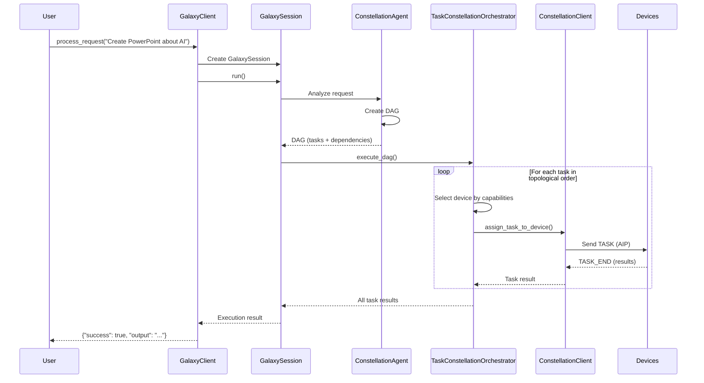

# GalaxyClient Reference

GalaxyClient is an optional session management wrapper on top of ConstellationClient. It provides a convenient high-level API for initializing the system, processing user requests through GalaxySession, and running interactive sessions. Most applications use GalaxyClient as the main entry point.

## Related Documentation

- [Overview](./overview.md) - Overall architecture and workflow
- [ConstellationClient](./constellation_client.md) - Device coordination layer

## What GalaxyClient Does

GalaxyClient is the "easy mode" API for Galaxy. While you can use ConstellationClient directly for device management, GalaxyClient adds session management, request processing, and interactive mode on top.

**Think of it this way:**

- **ConstellationClient**: "I need to register devices and assign tasks"
- **GalaxyClient**: "I have a user request, please execute it across my devices"

GalaxyClient handles the entire request lifecycle: parsing the request, creating a GalaxySession, coordinating with ConstellationAgent for task planning, executing the DAG across devices, and returning results to the user.

**Core Responsibilities:**

**Session Management**: GalaxyClient creates and manages GalaxySession objects. Each session represents one user request and contains the conversation history, task planning, and execution state. Sessions are isolated—failures in one session don't affect others.

**Request Processing**: When you call `process_request()`, GalaxyClient:
1. Creates a GalaxySession with the request
2. Passes the session to ConstellationAgent for DAG planning
3. Uses TaskConstellationOrchestrator to execute the DAG across devices
4. Collects results and returns them to you

**Interactive Mode**: GalaxyClient provides an interactive CLI loop where users can type requests, see execution progress, and view results. This is useful for demos, debugging, and manual testing.

**Configuration Integration**: GalaxyClient loads configurations from YAML files, validates settings, and passes them to ConstellationClient. This centralizes configuration management.

**What GalaxyClient Does NOT Do:**

- **Device Connection Management**: Handled by ConstellationClient → DeviceManager
- **Task Planning**: Handled by ConstellationAgent  
- **DAG Execution**: Handled by TaskConstellationOrchestrator
- **Multi-round Interaction Logic**: Handled by GalaxySession

GalaxyClient is the orchestrator at the highest level, delegating to specialized components for each concern.

## When to Use GalaxyClient

**Use GalaxyClient when:**

- You want a simple API for processing user requests
- You need session management for multi-round interactions
- You want interactive mode for demos or debugging
- You're building a conversational agent or task automation system

**Use ConstellationClient directly when:**

- You only need device management without session/request processing
- You're building a custom orchestrator  
- You need fine-grained control over task assignment
- Sessions are managed by your own higher-level system

**Example Use Cases:**

**GalaxyClient**: Chatbot that processes natural language requests ("Open PowerPoint and create a presentation about AI")

**ConstellationClient**: Monitoring system that assigns health check tasks to devices every 5 minutes

## Initialization

### Constructor

```python
def __init__(
    self,
    session_name: Optional[str] = None,
    task_name: Optional[str] = None,
    max_rounds: int = 10,
    log_level: str = "INFO",
    output_dir: Optional[str] = None,
):
    """
    Initialize GalaxyClient.
    
    Args:
        session_name: Name for the Galaxy session (auto-generated if None)
        task_name: Name for the task (auto-generated if None)
        max_rounds: Maximum number of rounds per session (default: 10)
        log_level: Logging level (default: "INFO")
        output_dir: Output directory for logs and results
    """
```

GalaxyClient initialization automatically loads device configuration from the Galaxy config system:

**Automatic Configuration Loading:**

GalaxyClient loads device configuration from the centralized config system:

```python
# Configuration is loaded automatically
client = GalaxyClient(
    session_name="production_session",
    task_name="email_automation",
    max_rounds=10
)
```

Internally, GalaxyClient:

1. Loads Galaxy configuration using `get_galaxy_config()`
2. Extracts device info path from `galaxy_config.constellation.DEVICE_INFO`
3. Loads ConstellationConfig from the YAML file
4. Creates internal ConstellationClient with this configuration

**Session and Task Names:**

```python
# Use custom names
client = GalaxyClient(
    session_name="production_session",
    task_name="email_task"
)

# Auto-generate names with timestamps
client = GalaxyClient()
# session_name: "galaxy_session_20251106_103045"
# task_name: "request_20251106_103045"
```

Session name identifies the overall session, while task name identifies individual tasks within the session.

**Max Rounds:**

```python
# Limit conversation rounds
client = GalaxyClient(max_rounds=5)
```

Max rounds controls how many back-and-forth exchanges the agent can have during task execution. Higher values allow more complex tasks but take longer.

**Output Directory:**

```python
# Custom output directory
client = GalaxyClient(output_dir="./custom_logs")
```

If not specified, uses the default session log path from configuration.

**Internal ConstellationClient Creation:**

After loading configuration, GalaxyClient creates an internal ConstellationClient:

```python
self._constellation_client = ConstellationClient(
    config=self.config,
    task_name=self.task_name
)
```

All device management operations delegate to this internal client.

### Async Initialize Method

```python
async def initialize(self) -> None:
    """
    Initialize the Galaxy Client and connect to devices.
    
    This calls ConstellationClient.initialize() to register and
    optionally connect to all configured devices.
    """
```

After creating a GalaxyClient, you must call `initialize()`:

```python
client = GalaxyClient(session_name="my_session")
await client.initialize()

# Now ready to process requests
result = await client.process_request("Open Excel and create a chart")
```

Initialization creates and initializes the internal ConstellationClient, which:

1. Registers all devices from configuration
2. Connects to devices with `auto_connect: true`
3. Starts heartbeat monitoring
4. Starts message handlers

**Initialization Failures:**

If some devices fail to connect during initialization, `initialize()` logs warnings but continues. You can check connection status after initialization:

```python
await client.initialize()

# Check which devices connected
connected = client._constellation_client.get_connected_devices()
if len(connected) == 0:
    raise RuntimeError("No devices connected")
```

## Request Processing

### Process Request

```python
async def process_request(
    self,
    request: str,
    context: Optional[Dict[str, Any]] = None,
) -> Dict[str, Any]:
    """
    Process a user request end-to-end.
    
    Args:
        request: Natural language user request
        context: Additional context (previous results, user preferences, etc.)
    
    Returns:
        Dictionary containing execution results, session info, and metadata
    """
```

This is the primary method you'll use. It handles the entire request lifecycle:

**Step 1: Create Session**

```python
session = GalaxySession(
    task=task_name,
    should_evaluate=False,
    id=session_id,
    client=self._constellation_client,
    initial_request=request
)
```

GalaxySession encapsulates one request execution, including conversation history, task planning, and execution state.

**Step 2: Execute Session**

```python
result = await session.run()
```

Session execution involves:

1. **ConstellationAgent Planning**: Agent analyzes the request, determines required capabilities, and creates a DAG (Directed Acyclic Graph) of tasks
2. **Device Selection**: For each task, select a device with matching capabilities
3. **DAG Execution**: TaskConstellationOrchestrator executes tasks respecting dependencies
4. **Result Collection**: Gather results from all tasks

**Step 3: Return Results**

```python
return {
    "success": result.success,
    "output": result.output,
    "session_id": session.session_id,
    "task_count": len(session.dag.tasks),
    "execution_time": result.execution_time,
    "errors": result.errors
}
```

**Complete Request Processing Flow:**



**Example Usage:**

```python
# Simple request
result = await client.process_request(
    request="Open Excel and create a chart showing quarterly sales"
)

if result["success"]:
    print(f"Completed {result['task_count']} tasks in {result['execution_time']:.2f}s")
    print(f"Output: {result['output']}")
else:
    print(f"Errors: {result['errors']}")

# Request with context
result = await client.process_request(
    request="Update the chart with new data",
    context={
        "previous_file": "Q1_sales.xlsx",
        "user_preferences": {"chart_type": "bar"}
    }
)
```

Context is useful for multi-round conversations where later requests reference earlier results.

## Interactive Mode

### Interactive Mode

```python
async def interactive_mode(self) -> None:
    """
    Start an interactive CLI loop for processing user requests.
    
    Users can type requests, see execution progress, and view results.
    Type 'quit' or 'exit' to stop.
    """
```

Interactive mode provides a REPL (Read-Eval-Print Loop) for manual testing:

```python
client = GalaxyClient(config_path="config/devices.yaml")
await client.initialize()

# Start interactive loop
await client.interactive_mode()
```

**Interactive Session Example:**

```
=== Galaxy Client Interactive Mode ===
Connected to 3 devices: windows_pc, linux_server, mac_laptop
Type 'quit' or 'exit' to stop.

> Open PowerPoint and create a presentation about AI

[ConstellationAgent] Analyzing request...
[ConstellationAgent] Created DAG with 3 tasks:
  - Task 1: Open PowerPoint
  - Task 2: Create new presentation  
  - Task 3: Add slides about AI

[TaskOrchestrator] Executing task 1 on windows_pc...
[TaskOrchestrator] Task 1 completed successfully

[TaskOrchestrator] Executing task 2 on windows_pc...
[TaskOrchestrator] Task 2 completed successfully

[TaskOrchestrator] Executing task 3 on windows_pc...
[TaskOrchestrator] Task 3 completed successfully

✓ Request completed successfully (3 tasks, 15.3s)
Output: Created presentation "AI_Overview.pptx" with 5 slides

> Send the presentation via email to john@example.com

[ConstellationAgent] Analyzing request...
[ConstellationAgent] Using context from previous task

[TaskOrchestrator] Executing task 1 on windows_pc...
[TaskOrchestrator] Task 1 completed successfully

✓ Request completed successfully (1 task, 3.2s)
Output: Email sent to john@example.com with attachment AI_Overview.pptx

> quit

Shutting down Galaxy Client...
Disconnected from all devices.
Goodbye!
```

**Interactive Mode Features:**

**Persistent Session Context**: Interactive mode maintains context across requests, so later requests can reference earlier results ("Send the presentation" knows which presentation).

**Real-time Progress**: Shows task execution progress as it happens, useful for understanding what's happening during long-running requests.

**Error Display**: Shows detailed error messages if tasks fail, helpful for debugging.

**Device Status**: Shows which devices are connected at startup.

## Lifecycle Management

### Shutdown

```python
async def shutdown(self) -> None:
    """
    Gracefully shutdown the Galaxy Client.
    
    Stops all sessions, disconnects all devices, and cleans up resources.
    """
```

Always call `shutdown()` to cleanup resources:

```python
try:
    client = GalaxyClient(config_path="config.yaml")
    await client.initialize()
    
    # Use the client
    await client.process_request("...")
    
finally:
    # Always shutdown
    await client.shutdown()
```

Shutdown delegates to ConstellationClient, which:

1. Stops all task queues
2. Stops message handlers  
3. Stops heartbeat monitoring
4. Closes WebSocket connections
5. Cancels background tasks

Without proper shutdown, background tasks continue running, connections stay open, and resources leak.

**Context Manager Pattern** (recommended):

```python
async with GalaxyClient(config_path="config.yaml") as client:
    await client.initialize()
    result = await client.process_request("Open Excel")
    
# Automatically calls shutdown() on exit
```

## Configuration Management

### Get Device Status

```python
def get_device_status(self, device_id: Optional[str] = None) -> Dict[str, Any]:
    """Get device status from underlying ConstellationClient."""
    return self._constellation_client.get_device_status(device_id)
```

GalaxyClient exposes device status from ConstellationClient:

```python
# Get all device statuses
all_status = client.get_device_status()

# Get specific device status
pc_status = client.get_device_status("windows_pc")
print(f"Status: {pc_status['status']}")
print(f"Current task: {pc_status['current_task_id']}")
print(f"Queued tasks: {pc_status['queued_tasks']}")
```

### Get Connected Devices

```python
def get_connected_devices(self) -> List[str]:
    """Get list of connected device IDs."""
    return self._constellation_client.get_connected_devices()
```

Check which devices are available:

```python
connected = client.get_connected_devices()

if "windows_pc" not in connected:
    print("Warning: Windows PC not connected")
```

### Add Device

```python
async def add_device(
    self,
    device_id: str,
    server_url: str,
    capabilities: Optional[List[str]] = None,
    metadata: Optional[Dict[str, Any]] = None,
) -> bool:
    """Add and connect a new device at runtime."""
```

Dynamically add devices:

```python
# Add new device discovered at runtime
success = await client.add_device(
    device_id="new_workstation",
    server_url="ws://192.168.1.200:5000/ws",
    capabilities=["office", "web", "design"],
    metadata={"location": "design_team", "gpu": "RTX 4090"}
)

if success:
    print("New device ready for tasks")
```

This delegates to ConstellationClient, which registers and connects the device.

## Usage Patterns

### Basic Request Processing

```python
async def main():
    # Initialize client
    client = GalaxyClient(session_name="automation_session")
    await client.initialize()
    
    try:
        # Process single request
        result = await client.process_request(
            request="Open Word and create a document about machine learning"
        )
        
        if result["success"]:
            print(f"Completed in {result['execution_time']:.1f}s")
        else:
            print(f"Failed: {result['errors']}")
            
    finally:
        await client.shutdown()

asyncio.run(main())
```

### Multi-Round Conversation

```python
async def multi_round_conversation():
    client = GalaxyClient(session_name="conversation", max_rounds=15)
    await client.initialize()
    
    try:
        # First request
        result1 = await client.process_request(
            request="Create a sales report spreadsheet"
        )
        
        # Second request references first
        result2 = await client.process_request(
            request="Add a pie chart showing regional distribution"
        )
        
        # Third request references both
        result3 = await client.process_request(
            request="Email the report to the team"
        )
        
    finally:
        await client.shutdown()
```

### Error Handling

```python
async def robust_processing():
    client = GalaxyClient(session_name="robust")
    
    try:
        await client.initialize()
    except Exception as e:
        print(f"Initialization failed: {e}")
        return
    
    try:
        result = await client.process_request("Open Excel")
        
        if not result["success"]:
            # Handle execution errors
            for error in result["errors"]:
                print(f"Task {error['task_id']} failed: {error['message']}")
                
                # Retry specific tasks
                if "connection" in error["message"].lower():
                    print("Retrying due to connection error...")
                    result = await client.process_request("Open Excel")
                    
    except Exception as e:
        # Handle unexpected errors
        print(f"Unexpected error: {e}")
        
    finally:
        await client.shutdown()
```

### Dynamic Device Management

```python
async def adaptive_constellation():
    client = GalaxyClient(session_name="adaptive")
    await client.initialize()
    
    try:
        # Monitor device health
        while True:
            connected = client.get_connected_devices()
            
            if len(connected) < 2:
                # Not enough devices, add more
                print("Adding fallback device...")
                await client.add_device(
                    device_id="fallback_device",
                    server_url="ws://backup.example.com:5000/ws",
                    capabilities=["office", "web"]
                )
            
            # Process request
            result = await client.process_request("Create report")
            
            # Sleep before next iteration
            await asyncio.sleep(60)
            
    finally:
        await client.shutdown()
```

## Integration with Other Components

### GalaxyClient vs ConstellationClient

```python
# GalaxyClient: High-level request processing
galaxy_client = GalaxyClient(session_name="production")
await galaxy_client.initialize()

result = await galaxy_client.process_request("Open PowerPoint")
# Internally:
# 1. Creates GalaxySession
# 2. ConstellationAgent plans DAG
# 3. TaskOrchestrator executes DAG
# 4. ConstellationClient assigns tasks to devices

# ConstellationClient: Device management only
constellation_client = ConstellationClient(config)
await constellation_client.initialize()

await constellation_client.connect_device("windows_pc")
# No automatic task planning, you control everything
```

### Using GalaxyClient in Web Applications

```python
from fastapi import FastAPI, HTTPException

app = FastAPI()

# Global GalaxyClient instance
galaxy_client = None

@app.on_event("startup")
async def startup():
    global galaxy_client
    galaxy_client = GalaxyClient(session_name="api_server")
    await galaxy_client.initialize()

@app.on_event("shutdown")
async def shutdown():
    global galaxy_client
    if galaxy_client:
        await galaxy_client.shutdown()

@app.post("/execute")
async def execute_request(request: str):
    """Execute user request via Galaxy."""
    if not galaxy_client:
        raise HTTPException(status_code=500, detail="Galaxy not initialized")
    
    result = await galaxy_client.process_request(request)
    
    if result["success"]:
        return {"status": "completed", "output": result["output"]}
    else:
        raise HTTPException(
            status_code=500,
            detail={"status": "failed", "errors": result["errors"]}
        )

@app.get("/devices")
async def list_devices():
    """Get connected device status."""
    if not galaxy_client:
        raise HTTPException(status_code=500, detail="Galaxy not initialized")
    
    return {
        "connected": galaxy_client.get_connected_devices(),
        "status": galaxy_client.get_device_status()
    }
```

## Summary

GalaxyClient is the high-level entry point for Galaxy Client, providing:

- **Simple API**: Single method (`process_request`) for end-to-end execution
- **Session Management**: Creates and manages GalaxySession objects  
- **Interactive Mode**: CLI loop for demos and debugging
- **Configuration Management**: Loads and validates configurations
- **Delegation**: Wraps ConstellationClient for device management

**When to Use:**

- **GalaxyClient**: Processing natural language requests, multi-round conversations, interactive demos
- **ConstellationClient**: Direct device management, custom orchestration, fine-grained control

For most applications, GalaxyClient provides the right level of abstraction. Use ConstellationClient directly only when you need custom orchestration or don't need session management.

**Next Steps:**

- See [ConstellationClient](./constellation_client.md) for device management details
- See [Overview](./overview.md) for overall architecture
