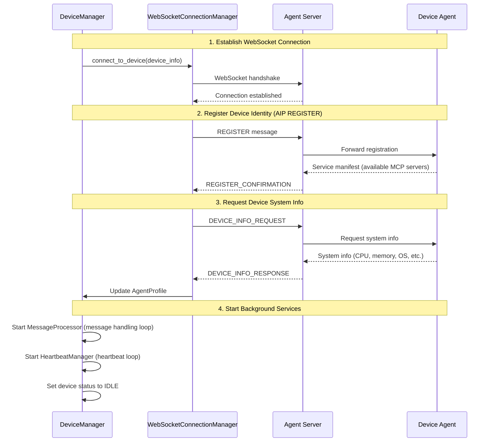

# Galaxy Client Overview

Galaxy Client is the client-side layer responsible for multi-device coordination in the UFO³ framework. At its core is **ConstellationClient**, which manages device registration, connection, and task assignment. **GalaxyClient** provides a lightweight wrapper offering convenient session management interfaces.

## Related Documentation

- [ConstellationClient](./constellation_client.md) - Core device coordination component
- [DeviceManager](./device_manager.md) - Low-level connection management
- [Components](./components.md) - Modular component architecture
- [AIP Integration](./aip_integration.md) - Communication protocol integration
- [GalaxyClient](./galaxy_client.md) - Session wrapper API
- [Configuration](../../configuration/system/galaxy_constellation.md) - Device configuration guide

## The Complete Path: From User Request to Device Execution

To understand Galaxy Client, we first need to see the entire system workflow. When a user submits a task request, the system processes it through several layers:

### 1. User Interaction Layer (Optional)

Users can interact with the Galaxy system in two ways:

**Interactive Mode**: Users input natural language requests through a command-line interface (CLI), which are received and processed by GalaxyClient. This mode is primarily used for rapid prototyping and manual testing.

**Programmatic Mode**: Developers directly call the Python API of ConstellationClient or GalaxyClient, integrating Galaxy into their applications. This is the recommended approach for production environments.

### 2. Session Management Layer (GalaxyClient)

GalaxyClient's role is to manage the lifecycle of task sessions. It doesn't handle specific device operations but instead:

- Initializes and holds a ConstellationClient instance
- Creates a GalaxySession for each user request
- Passes requests to ConstellationAgent for DAG planning (task decomposition)
- Coordinates TaskConstellationOrchestrator to execute the DAG
- Collects and aggregates execution results

**GalaxyClient is optional**. If your application doesn't need session management, you can use ConstellationClient directly.

### 3. Device Coordination Layer (ConstellationClient)

ConstellationClient is the heart of Galaxy Client. It is responsible for:

**Device Management**: Registering devices (each device has a unique ID, server URL, capability list, etc.), connecting to devices (via WebSocket), disconnecting devices, and monitoring device health status.

**Task Assignment**: Receiving task requests from upper layers (TaskConstellationOrchestrator), selecting appropriate devices based on capabilities, sending tasks to devices via the AIP protocol, and waiting for and collecting task execution results.

ConstellationClient doesn't concern itself with how tasks are decomposed (that's ConstellationAgent's responsibility) or how DAGs are executed (that's TaskConstellationOrchestrator's responsibility). It focuses on "device-level matters."

### 4. Connection Management Layer (DeviceManager)

DeviceManager is the core internal component of ConstellationClient, responsible for all low-level connection management:

**WebSocket Connection Establishment**: Establishes WebSocket connections with Agent Server, sends AIP REGISTER messages to register device identity, and requests device system information (DEVICE_INFO_REQUEST).

**Connection Monitoring**: Sends HEARTBEAT messages every 20-30 seconds to check if devices are online. If a timeout occurs with no response, it triggers disconnection handling and automatically attempts reconnection (up to max_retries times).

**Message Routing**: Starts a background message processing loop, receives messages returned by devices (TASK_END, COMMAND_RESULTS, etc.), and dispatches messages to appropriate handlers.

**Task Queuing**: If a device is busy executing another task, new tasks are queued and automatically dequeued when the device becomes idle.

### 5. Protocol Layer (AIP)

All communication with devices goes through the [Agent Interaction Protocol (AIP)](../../aip/overview.md). AIP is a WebSocket-based messaging protocol that defines standard message types and interaction flows. Main message types used by Galaxy Client include:

- `REGISTER`: Register device identity with Agent Server
- `DEVICE_INFO_REQUEST/RESPONSE`: Request and return device system information
- `TASK`: Assign task to device
- `TASK_END`: Device reports task completion
- `HEARTBEAT/HEARTBEAT_ACK`: Heartbeat health check
- `COMMAND_RESULTS`: Device reports intermediate execution results
- `ERROR`: Error reporting

For detailed AIP explanation, see [AIP Integration](./aip_integration.md).

## Component Responsibilities

Having understood the overall flow, let's examine the specific responsibilities of each component:

### ConstellationClient: The Device Coordination Facade

ConstellationClient implements the Facade pattern. It provides simple device management APIs externally while delegating actual work to DeviceManager internally.

**What it does:**

```python
# Register device
await client.register_device(
    device_id="windows_pc",
    server_url="ws://192.168.1.100:5000/ws",
    os="windows",
    capabilities=["office", "web", "email"]
)

# Connect device
success = await client.connect_device("windows_pc")

# Assign task
result = await client.assign_task_to_device(
    device_id="windows_pc",
    task_request=TaskRequest(...)
)

# Query status
status = client.get_device_status("windows_pc")
```

**What it doesn't do:**

- DAG planning (handled by ConstellationAgent)
- DAG execution (handled by TaskConstellationOrchestrator)
- Session management (handled by GalaxySession)

See [ConstellationClient documentation](./constellation_client.md) for detailed API reference.

### DeviceManager: The Connection Management Engine

DeviceManager is the "engine" of ConstellationClient. It uses 5 modular components to accomplish connection management:

**DeviceRegistry**: Stores AgentProfiles for all registered devices (including device ID, URL, status, capabilities, metadata, etc.). This component maintains the single source of truth for device state. When a device connects, disconnects, or changes status, DeviceRegistry is updated. Other components query DeviceRegistry to make decisions.

**WebSocketConnectionManager**: Manages WebSocket connection lifecycle (connect, disconnect, send messages). This component handles the low-level WebSocket operations, including establishing connections, handling connection errors, and sending AIP messages. It maintains a mapping from device_id to WebSocket objects.

**HeartbeatManager**: Background heartbeat loop that periodically sends HEARTBEAT to check device health. This runs as an independent asyncio task for each connected device. If a device fails to respond within the timeout period (2 × heartbeat_interval), HeartbeatManager triggers the disconnection handler, allowing the system to detect and respond to connection failures quickly.

**MessageProcessor**: Background message processing loop that receives and routes AIP messages. This component runs a continuous loop for each device, receiving messages from the WebSocket and dispatching them to appropriate handlers. For example, TASK_END messages are used to complete task futures, COMMAND_RESULTS are logged for progress tracking, and ERROR messages trigger error handling.

**TaskQueueManager**: Manages task queue for each device, queuing tasks when device is busy. When a task is assigned to a busy device, it's placed in that device's queue. When the device completes its current task and becomes IDLE, TaskQueueManager automatically dequeues the next task and executes it. This ensures tasks are never lost even when devices are overloaded.

This modular design ensures each component has a single responsibility, making testing and maintenance easier. See [DeviceManager documentation](./device_manager.md) for details.

### GalaxyClient: Session Management Wrapper

GalaxyClient provides a higher-level abstraction on top of ConstellationClient:

```python
client = GalaxyClient()
await client.initialize()  # Initialize ConstellationClient and connect devices

# Process user request (internally creates GalaxySession, calls ConstellationAgent for DAG planning)
result = await client.process_request("Open Excel and create a sales chart")

await client.shutdown()  # Cleanup resources
```

GalaxyClient's main value lies in:

- Simplifying initialization flow (automatically loads device info from config)
- Providing session management (creates independent GalaxySession for each request)
- Integrating display components (Rich console output, progress bars, etc.)
- Supporting interactive mode (command-line interface)

If your application already has its own session management logic, you can skip GalaxyClient and use ConstellationClient directly. See [GalaxyClient documentation](./galaxy_client.md) for detailed API.

## Typical Workflow Example

Let's walk through a complete example, from user request to device execution:

### Scenario: Processing a Multi-Device Task

Suppose a user submits: "Download sales.xlsx from email, analyze it in Excel on Windows, then generate a report PDF on Linux".

**Step 1: Initialize GalaxyClient**

```python
client = GalaxyClient()
await client.initialize()
```

What happens inside `initialize()`:

1. GalaxyClient loads device information from config file (`device_info.yaml`)
2. Creates ConstellationClient instance and passes configuration
3. ConstellationClient calls `device_manager.register_device()` to register each device
4. If `auto_connect: true` is configured, automatically calls `device_manager.connect_device()`
5. DeviceManager executes connection flow for each device (detailed below)

**Step 2: Device Connection Flow (Inside DeviceManager)**

For each device (e.g., "windows_pc" and "linux_server"), DeviceManager executes:



This sequence diagram shows the connection establishment process. First, a WebSocket connection is established with the Agent Server. Then, the device registers its identity through the AIP REGISTER message, allowing the server to know which device is connecting and what capabilities it offers. Next, the client requests detailed system information from the device to populate the AgentProfile with actual hardware and software details. Finally, background services are started to maintain the connection and handle incoming messages.

**Step 3: User Request Processing**

```python
result = await client.process_request("Download sales.xlsx...")
```

Inside `process_request()`:

1. GalaxyClient creates a GalaxySession
2. GalaxySession calls ConstellationAgent for task planning
3. ConstellationAgent (LLM-powered) decomposes task into DAG:
   - Task 1: Download sales.xlsx from email (requires "email" capability)
   - Task 2: Analyze in Excel (requires "office" capability, depends on Task 1)
   - Task 3: Generate PDF on Linux (requires "pdf_generation" capability, depends on Task 2)
4. TaskConstellationOrchestrator executes DAG:
   - Based on capability matching, Task 1 assigned to device with "email" capability
   - Task 2 assigned to "windows_pc" (has "office" capability)
   - Task 3 assigned to "linux_server" (has "pdf_generation" capability)

The DAG structure ensures tasks execute in the correct order respecting dependencies, while allowing independent tasks to run in parallel across different devices.

**Step 4: Task Assignment and Execution (ConstellationClient/DeviceManager)**

For each task, ConstellationClient calls:

```python
result = await client.assign_task_to_device(
    device_id="windows_pc",
    task_request=TaskRequest(
        task_id="task_2",
        request="Analyze sales.xlsx in Excel",
        ...
    )
)
```

Inside `assign_task_to_device()`:

1. DeviceManager checks device status (via DeviceRegistry)
2. If device is IDLE, execute task immediately
3. If device is BUSY, task enters queue (TaskQueueManager)
4. WebSocketConnectionManager sends TASK message to device via AIP
5. MessageProcessor waits in background for device to return COMMAND_RESULTS and TASK_END
6. When task completes, DeviceManager changes device status back to IDLE
7. If there are queued tasks, automatically dequeue and execute next task

The queuing mechanism ensures no tasks are lost when devices are busy, and tasks are executed in order as devices become available.

**Step 5: Connection Monitoring (Continuous Background Process)**

Throughout task execution, HeartbeatManager continuously monitors each device:

- Sends HEARTBEAT message every 20-30 seconds
- If device responds, updates `last_heartbeat` timestamp
- If timeout with no response (2 × heartbeat_interval), triggers disconnection handling:
  - Stops MessageProcessor and HeartbeatManager
  - Sets device status to DISCONNECTED
  - If device was executing a task, marks task as failed
  - Attempts automatic reconnection (up to max_retries times)

This continuous monitoring ensures the system quickly detects and responds to connection failures, maintaining reliable communication with devices.

**Step 6: Result Collection and Return**

After all tasks complete:

1. TaskConstellationOrchestrator aggregates all task results
2. GalaxySession generates session results (including execution time, rounds, DAG statistics)
3. GalaxyClient returns results to user
4. Results are automatically saved to log directory

The complete execution trace is preserved in logs for debugging and analysis.

## Relationships with Other System Components

Galaxy Client is not an isolated system—it closely collaborates with other UFO³ components:

### Depends on Agent Server for Message Routing

Galaxy Client doesn't connect directly to devices but routes through [Agent Server](../../server/overview.md). Agent Server's role is to:

**Maintain Device Registry**: Tracks which devices are online and their connection details. When a device connects, Agent Server registers it in the central registry.

**Route Messages**: Forwards TASK messages from Galaxy Client to the correct device based on device_id. The server acts as a message broker, decoupling clients from devices.

**Broadcast Device Status**: Notifies clients when devices come online or go offline, enabling clients to maintain accurate device availability information.

**Load Balancing**: If multiple clients connect to the same device, Agent Server can distribute load and prevent conflicts.

### Used by ConstellationAgent for Task Planning

When GalaxyClient receives a user request, it calls [ConstellationAgent](../constellation_agent/overview.md) to decompose the request into a DAG (Directed Acyclic Graph). ConstellationAgent is LLM-powered and can:

**Understand Natural Language**: Parses user requests to identify subtasks and their relationships. For example, "Download file and then analyze it" is recognized as two sequential tasks.

**Identify Task Dependencies**: Determines which tasks must complete before others can start, constructing a proper dependency graph.

**Suggest Device Assignments**: Based on device capabilities, recommends which device should execute each task. If a task requires "office" capability, it's assigned to devices that advertise this capability.

**Dynamically Adjust DAG**: If issues arise during execution (e.g., a device fails), ConstellationAgent can replan and modify the DAG to adapt to the new situation.

For more details, see [ConstellationAgent Documentation](../constellation_agent/overview.md).

### Coordinates with TaskConstellationOrchestrator for DAG Execution

Once ConstellationAgent creates the DAG, [TaskConstellationOrchestrator](../constellation_orchestrator/overview.md) executes it across devices. The orchestrator:

- **Respects Dependencies**: Ensures tasks execute in the correct order based on the DAG structure
- **Selects Devices**: Chooses appropriate devices based on capability matching
- **Parallel Execution**: Runs independent tasks concurrently across different devices
- **Handles Failures**: Manages task failures and triggers replanning if needed

For more details, see [TaskConstellationOrchestrator Documentation](../constellation_orchestrator/overview.md).

### Collaborates with Device Agents for Task Execution

The actual task execution happens on [Device Agents](../../client/overview.md) running on each device (such as UFO² Desktop Agent, Linux Agent, etc.). Device Agents are responsible for:

**Receiving Tasks**: Accepts tasks from Agent Server and parses task requirements. Each task specifies what action to perform and what parameters to use.

**Invoking MCP Servers**: Calls local MCP servers to perform specific operations (such as opening Excel, running commands, etc.). MCP servers provide the actual execution capabilities.

**Reporting Progress**: Sends intermediate execution results through COMMAND_RESULTS messages, allowing clients to track progress in real-time.

**Handling Errors**: Deals with local errors and exceptions, reporting them back to the client through ERROR messages for proper error handling.

### Unified Communication through AIP Protocol

All cross-component communication follows the [AIP protocol](../../aip/overview.md). AIP provides:

**Standardized Message Formats**: Uses Pydantic models to define message structure, ensuring type safety and validation at both ends of communication.

**Type-Safe Message Validation**: Automatically validates message fields using Pydantic, catching errors early before they propagate through the system.

**Request-Response Correlation**: Uses request_id/response_id fields to match requests with their responses, enabling proper async handling.

**Error Handling Mechanism**: Defines standard ERROR message types for reporting and handling failures consistently across all components.

## Configuration and Deployment

### Device Configuration

Device information is defined through configuration files. See [Galaxy Configuration](../../configuration/system/galaxy_constellation.md) for complete configuration options.

A typical configuration example:

```yaml
# config/galaxy/constellation.yaml
task_name: "production_constellation"
heartbeat_interval: 30.0  # Heartbeat interval (seconds)
reconnect_delay: 5.0      # Reconnection delay (seconds)
max_concurrent_tasks: 5   # Max concurrent tasks per device

devices:
  - device_id: "windows_pc"
    server_url: "ws://192.168.1.100:5000/ws"
    os: "windows"
    capabilities: ["office", "email", "web"]
    auto_connect: true
    max_retries: 5  # Maximum reconnection attempts
    
  - device_id: "linux_server"
    server_url: "ws://192.168.1.101:5000/ws"
    os: "linux"
    capabilities: ["database", "api", "pdf_generation"]
    auto_connect: true
    max_retries: 10
```

Configuration fields explained:

- **task_name**: Unique identifier for this constellation, used in logs and debugging
- **heartbeat_interval**: How often to check device health (recommended: 20-30 seconds)
- **reconnect_delay**: Wait time between reconnection attempts (recommended: 3-5 seconds)
- **max_concurrent_tasks**: Maximum tasks a device can execute simultaneously
- **capabilities**: List of capabilities each device provides, used for task assignment
- **auto_connect**: Whether to automatically connect when client initializes
- **max_retries**: Maximum reconnection attempts before giving up

### Development vs Production Environment

**Development Recommendations:**

- Use interactive mode for quick testing: `python -m galaxy --interactive`
- Enable DEBUG log level for detailed information
- Single-device configuration to simplify debugging
- Use local Agent Server (`ws://127.0.0.1:5000/ws`)
- Lower heartbeat_interval (e.g., 10 seconds) for faster failure detection

**Production Recommendations:**

- Use WSS (secure WebSocket) instead of WS for encrypted communication
- Configure reasonable heartbeat_interval (20-30 seconds) to balance responsiveness and network overhead
- Set appropriate max_retries (5-10 attempts) based on network reliability
- Enable automatic reconnection (`auto_connect: true`) for resilience
- Monitor device health status via `get_device_status()` API and set up alerts
- Configure log rotation and archiving to prevent disk space issues
- Use connection pooling if connecting to many devices
- Implement circuit breaker pattern for failing devices

## Detailed Component Documentation

- [ConstellationClient API Reference](./constellation_client.md) - Complete device coordination API
- [DeviceManager Internals](./device_manager.md) - Detailed connection management mechanisms
- [Components Module](./components.md) - Detailed explanation of 5 core components
- [AIP Integration](./aip_integration.md) - How to use the communication protocol
- [GalaxyClient Session Wrapper](./galaxy_client.md) - Session management API

## Summary

Galaxy Client provides the core multi-device coordination capabilities in UFO³. Through layered design, it simplifies complex distributed system management into clear APIs:

- **ConstellationClient** is the core of device management, handling device registration, connection, and task assignment
- **DeviceManager** is the underlying engine, processing WebSocket, heartbeat, message routing, and task queuing
- **GalaxyClient** is an optional session wrapper, providing more convenient high-level APIs

If you're new to Galaxy Client, we recommend reading the documentation in this order:

1. This Overview (understand overall architecture and workflow)
2. [ConstellationClient](./constellation_client.md) (learn core API)
3. [Components](./components.md) (understand modular components)
4. [DeviceManager](./device_manager.md) (dive deep into connection management)
5. [AIP Integration](./aip_integration.md) (master communication protocol)

If you need to get started quickly, jump directly to [GalaxyClient](./galaxy_client.md) example code.
