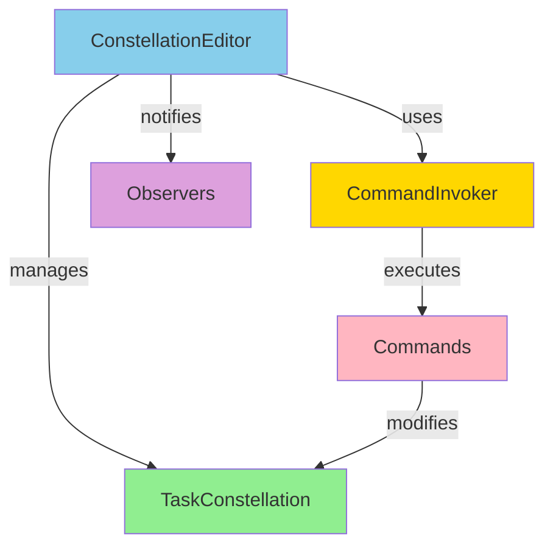

# ConstellationEditor — Interactive DAG Editor

---

## 📋 Overview

**ConstellationEditor** provides a high-level, command pattern-based interface for safe and comprehensive TaskConstellation manipulation. It offers undo/redo capabilities, batch operations, validation, and observer patterns for building, modifying, and managing complex workflow DAGs interactively.

The editor uses the **Command Pattern** to encapsulate all operations as reversible command objects, enabling undo/redo with full command history, transactional safety with atomic operations, complete operation tracking for auditability, and easy extensibility for new command types.

**Usage in Galaxy**: The ConstellationEditor is primarily used by the [Constellation Agent](../constellation_agent/overview.md) to programmatically build task workflows, but can also be used directly for manual constellation creation and debugging.

---

## 🏗️ Architecture

### Core Components



| Component | Purpose |
|-----------|---------|
| **ConstellationEditor** | High-level interface for constellation editing |
| **CommandInvoker** | Manages command execution, history, undo/redo |
| **Commands** | Encapsulated operations (Add, Remove, Update, etc.) |
| **Observers** | Callback functions notified on changes |

---

## 💻 Basic Usage

### Creating an Editor

```python
from galaxy.constellation import TaskConstellation
from galaxy.constellation.editor import ConstellationEditor

# Create editor with new constellation
editor = ConstellationEditor()

# Create editor with existing constellation
existing = TaskConstellation(name="my_workflow")
editor = ConstellationEditor(
    constellation=existing,
    enable_history=True,      # Enable undo/redo
    max_history_size=100      # Keep last 100 commands
)

# Access constellation
print(f"Editing: {editor.constellation.name}")
```

---

## 🎯 Task Operations

### Adding Tasks

```python
from galaxy.constellation import TaskStar

# Method 1: Add existing TaskStar
task = TaskStar(
    task_id="fetch_data",
    description="Download dataset from S3",
    target_device_id="linux_server_1"
)
added_task = editor.add_task(task)

# Method 2: Add from dictionary
task_dict = {
    "task_id": "preprocess",
    "description": "Clean and normalize data",
    "target_device_id": "linux_server_2",
    "timeout": 300.0
}
added_task = editor.add_task(task_dict)

# Method 3: Create and add in one step
task = editor.create_and_add_task(
    task_id="train_model",
    description="Train neural network on preprocessed data",
    name="Model Training",
    target_device_id="gpu_server",
    priority="HIGH",
    timeout=3600.0,
    retry_count=2
)
```

### Updating Tasks

```python
# Update task properties
updated_task = editor.update_task(
    task_id="train_model",
    description="Train BERT model on preprocessed text data",
    timeout=7200.0,
    priority="CRITICAL"
)

# Update with task_data
editor.update_task(
    task_id="train_model",
    task_data={
        "model_type": "BERT",
        "epochs": 10,
        "batch_size": 32
    }
)
```

### Removing Tasks

```python
# Remove task (also removes related dependencies)
removed_id = editor.remove_task("preprocess")

print(f"Removed task: {removed_id}")
```

### Querying Tasks

```python
# Get specific task
task = editor.get_task("fetch_data")

# List all tasks
all_tasks = editor.list_tasks()

for task in all_tasks:
    print(f"{task.name}: {task.status.value}")

# Get ready tasks
ready = editor.get_ready_tasks()
```

---

## 🔗 Dependency Operations

### Adding Dependencies

```python
from galaxy.constellation import TaskStarLine

# Method 1: Add existing TaskStarLine
dep = TaskStarLine.create_success_only(
    from_task_id="fetch_data",
    to_task_id="preprocess",
    description="Preprocess after successful download"
)
added_dep = editor.add_dependency(dep)

# Method 2: Add from dictionary
dep_dict = {
    "from_task_id": "preprocess",
    "to_task_id": "train_model",
    "dependency_type": "SUCCESS_ONLY",
    "condition_description": "Train on preprocessed data"
}
added_dep = editor.add_dependency(dep_dict)

# Method 3: Create and add in one step
dep = editor.create_and_add_dependency(
    from_task_id="train_model",
    to_task_id="evaluate_model",
    dependency_type="UNCONDITIONAL",
    condition_description="Evaluate after training completes"
)
```

### Updating Dependencies

```python
# Update dependency properties
updated_dep = editor.update_dependency(
    dependency_id=dep.line_id,
    dependency_type="CONDITIONAL",
    condition_description="Evaluate only if training accuracy > 90%"
)
```

### Removing Dependencies

```python
# Remove dependency
removed_id = editor.remove_dependency(dep.line_id)
```

### Querying Dependencies

```python
# Get specific dependency
dep = editor.get_dependency(dep_id)

# List all dependencies
all_deps = editor.list_dependencies()

# Get dependencies for specific task
task_deps = editor.get_task_dependencies("train_model")
```

---

## 🔄 Undo/Redo Operations

### Basic Undo/Redo

```python
# Add a task
task = editor.create_and_add_task(
    task_id="test_task",
    description="Run unit tests"
)

# Oops, didn't mean to add that
if editor.can_undo():
    editor.undo()
    print("✅ Task addition undone")

# Actually, let's keep it
if editor.can_redo():
    editor.redo()
    print("✅ Task addition redone")
```

### Checking Undo/Redo Availability

```python
# Check if undo/redo is available
print(f"Can undo: {editor.can_undo()}")
print(f"Can redo: {editor.can_redo()}")

# Get description of what would be undone/redone
if editor.can_undo():
    print(f"Undo: {editor.get_undo_description()}")

if editor.can_redo():
    print(f"Redo: {editor.get_redo_description()}")
```

### Command History

```python
# Get command history
history = editor.get_history()
for i, cmd_desc in enumerate(history):
    print(f"{i+1}. {cmd_desc}")

# Example output:
# 1. Add task: fetch_data
# 2. Add task: preprocess
# 3. Add dependency: fetch_data → preprocess
# 4. Update task: preprocess

# Clear history (cannot undo after this)
editor.clear_history()
```

---

## 🏗️ Bulk Operations

### Building from Configuration

```python
from galaxy.agents.schema import TaskConstellationSchema

# Build constellation from schema
config = TaskConstellationSchema(
    name="ml_pipeline",
    tasks=[
        {
            "task_id": "fetch",
            "description": "Fetch data",
            "target_device_id": "server_1"
        },
        {
            "task_id": "process",
            "description": "Process data",
            "target_device_id": "server_2"
        }
    ],
    dependencies=[
        {
            "from_task_id": "fetch",
            "to_task_id": "process",
            "dependency_type": "SUCCESS_ONLY"
        }
    ]
)

constellation = editor.build_constellation(
    config=config,
    clear_existing=True  # Clear current constellation first
)
```

### Building from Lists

```python
# Build from task and dependency lists
tasks = [
    {
        "task_id": "a",
        "description": "Task A",
        "target_device_id": "device_1"
    },
    {
        "task_id": "b",
        "description": "Task B",
        "target_device_id": "device_2"
    }
]

dependencies = [
    {
        "from_task_id": "a",
        "to_task_id": "b",
        "dependency_type": "UNCONDITIONAL"
    }
]

constellation = editor.build_from_tasks_and_dependencies(
    tasks=tasks,
    dependencies=dependencies,
    clear_existing=True,
    metadata={"version": "1.0", "author": "system"}
)
```

### Clearing Constellation

```python
# Remove all tasks and dependencies
cleared = editor.clear_constellation()

print(f"Constellation cleared: {cleared.task_count == 0}")
```

---

## 💾 File Operations

### Saving Constellation

```python
# Save to JSON file
file_path = editor.save_constellation("my_workflow.json")

print(f"Saved to: {file_path}")
```

### Loading Constellation

```python
# Load from JSON file
loaded = editor.load_constellation("my_workflow.json")

print(f"Loaded: {loaded.name}")
print(f"Tasks: {loaded.task_count}")
print(f"Dependencies: {loaded.dependency_count}")
```

### Loading from Data

```python
# Load from dictionary
data = {
    "name": "test_workflow",
    "tasks": {...},
    "dependencies": {...}
}
constellation = editor.load_from_dict(data)

# Load from JSON string
json_string = '{"name": "workflow", "tasks": {...}}'
constellation = editor.load_from_json_string(json_string)
```

---

## 🔍 Validation and Analysis

### DAG Validation

```python
# Validate constellation structure
is_valid, errors = editor.validate_constellation()

if not is_valid:
    print("❌ Validation errors:")
    for error in errors:
        print(f"  - {error}")
else:
    print("✅ Constellation is valid")

# Check for cycles
if editor.has_cycles():
    print("❌ Constellation contains cycles")
```

### Topological Analysis

```python
# Get topological order
try:
    order = editor.get_topological_order()
    print(f"Execution order: {' → '.join(order)}")
except ValueError as e:
    print(f"Cannot get order: {e}")
```

### Statistics

```python
# Get comprehensive statistics
stats = editor.get_statistics()

print(f"Constellation: {stats['constellation_id']}")
print(f"Tasks: {stats['total_tasks']}")
print(f"Dependencies: {stats['total_dependencies']}")
print(f"Longest path: {stats['longest_path_length']}")
print(f"Max width: {stats['max_width']}")
print(f"Parallelism ratio: {stats['parallelism_ratio']:.2f}")

# Editor-specific stats
print(f"Commands executed: {stats['editor_execution_count']}")
print(f"History size: {stats['editor_history_size']}")
print(f"Can undo: {stats['editor_can_undo']}")
print(f"Can redo: {stats['editor_can_redo']}")
```

---

## 👀 Observer Pattern

### Adding Observers

```python
# Define observer callback
def on_change(editor, command, result):
    print(f"Operation: {command}")
    print(f"Result: {result}")
    print(f"Constellation state: {editor.constellation.state.value}")

# Add observer
editor.add_observer(on_change)

# Now all operations trigger the observer
task = editor.create_and_add_task(
    task_id="observed_task",
    description="This triggers the observer"
)
# Output:
# Operation: add_task
# Result: <TaskStar object>
# Constellation state: ready
```

### Removing Observers

```python
# Remove specific observer
editor.remove_observer(on_change)

# Operations no longer trigger this observer
```

### Multiple Observers

```python
def log_observer(editor, command, result):
    with open("constellation_log.txt", "a") as f:
        f.write(f"{command}: {result}\n")

def metrics_observer(editor, command, result):
    stats = editor.get_statistics()
    print(f"Current metrics: P={stats['parallelism_ratio']:.2f}")

# Add multiple observers
editor.add_observer(log_observer)
editor.add_observer(metrics_observer)

# All observers are notified on each operation
```

---

## 🎨 Advanced Features

### Batch Operations

```python
# Execute multiple operations in sequence
operations = [
    lambda e: e.create_and_add_task("task_a", "Task A"),
    lambda e: e.create_and_add_task("task_b", "Task B"),
    lambda e: e.create_and_add_dependency("task_a", "task_b", "UNCONDITIONAL"),
]

results = editor.batch_operations(operations)

for i, result in enumerate(results):
    if isinstance(result, Exception):
        print(f"Operation {i+1} failed: {result}")
    else:
        print(f"Operation {i+1} succeeded: {result}")
```

### Creating Subgraphs

```python
# Extract subgraph with specific tasks
task_ids = ["fetch_data", "preprocess", "train_model"]
subgraph_editor = editor.create_subgraph(task_ids)

print(f"Subgraph tasks: {subgraph_editor.constellation.task_count}")
print(f"Subgraph deps: {subgraph_editor.constellation.dependency_count}")

# Subgraph includes only dependencies between included tasks
```

### Merging Constellations

```python
# Create two separate workflows
editor1 = ConstellationEditor()
editor1.create_and_add_task("task_a", "Task A from editor1")

editor2 = ConstellationEditor()
editor2.create_and_add_task("task_b", "Task B from editor2")

# Merge editor2 into editor1 with prefix
editor1.merge_constellation(
    other_editor=editor2,
    prefix="imported_"
)

# editor1 now contains: task_a, imported_task_b
```

---

## 🛡️ Error Handling

### Validation Errors

```python
try:
    # Try to add task with duplicate ID
    editor.create_and_add_task("existing_id", "Duplicate task")
except Exception as e:
    print(f"❌ Error: {e}")
    # Can undo to previous valid state
    if editor.can_undo():
        editor.undo()
```

### Cyclic Dependency Detection

```python
# Create cycle: A → B → C → A
editor.create_and_add_task("a", "Task A")
editor.create_and_add_task("b", "Task B")
editor.create_and_add_task("c", "Task C")

editor.create_and_add_dependency("a", "b", "UNCONDITIONAL")
editor.create_and_add_dependency("b", "c", "UNCONDITIONAL")

try:
    # This creates a cycle
    editor.create_and_add_dependency("c", "a", "UNCONDITIONAL")
except Exception as e:
    print(f"❌ Cycle detected: {e}")
    # Undo the failed operation
    # (Actually, the operation fails before execution, so nothing to undo)
```

---

## 📊 Complete Example Workflow

```python
from galaxy.constellation.editor import ConstellationEditor

# Create editor
editor = ConstellationEditor(enable_history=True)

# Build ML training pipeline
# Step 1: Add tasks
fetch = editor.create_and_add_task(
    task_id="fetch_data",
    description="Download dataset from S3",
    target_device_id="linux_server_1",
    timeout=300.0
)

preprocess = editor.create_and_add_task(
    task_id="preprocess",
    description="Clean and normalize data",
    target_device_id="linux_server_2",
    timeout=600.0
)

train = editor.create_and_add_task(
    task_id="train_model",
    description="Train BERT model",
    target_device_id="gpu_server_a100",
    priority="HIGH",
    timeout=7200.0,
    retry_count=2
)

evaluate = editor.create_and_add_task(
    task_id="evaluate",
    description="Evaluate model on test set",
    target_device_id="linux_server_3"
)

# Step 2: Add dependencies
editor.create_and_add_dependency(
    "fetch_data", "preprocess", "SUCCESS_ONLY"
)
editor.create_and_add_dependency(
    "preprocess", "train_model", "SUCCESS_ONLY"
)
editor.create_and_add_dependency(
    "train_model", "evaluate", "UNCONDITIONAL"
)

# Step 3: Validate
is_valid, errors = editor.validate_constellation()
assert is_valid, f"Validation failed: {errors}"

# Step 4: Analyze
stats = editor.get_statistics()
print(f"Pipeline: {stats['total_tasks']} tasks, {stats['total_dependencies']} dependencies")
print(f"Critical path: {stats['longest_path_length']}")
print(f"Parallelism: {stats['parallelism_ratio']:.2f}")

# Step 5: Save
editor.save_constellation("ml_training_pipeline.json")

# Step 6: Execute (via orchestrator)
constellation = editor.constellation
# Pass to ConstellationOrchestrator for distributed execution
# See: ../constellation_orchestrator/overview.md for execution details
```

For details on executing the built constellation, see the [Constellation Orchestrator documentation](../constellation_orchestrator/overview.md).

---

## 🎯 Best Practices

### Editor Usage Guidelines

1. **Enable history**: Always enable undo/redo for interactive editing sessions
2. **Validate frequently**: Run `validate_constellation()` after major structural changes
3. **Use observers**: Add observers for logging, metrics tracking, or UI updates
4. **Batch operations**: Use `batch_operations()` for multiple related changes to improve efficiency
5. **Save incrementally**: Create constellation checkpoints during complex editing workflows

### Command Pattern Benefits

The command pattern architecture provides several key advantages:

- **Undo/Redo**: Full operation history with rollback capabilities
- **Audit trail**: Every change is recorded and traceable
- **Transaction safety**: Operations are atomic and validated
- **Extensibility**: New operation types can be added easily

!!!warning "Common Pitfalls"
    - **Forgetting to validate**: Always validate before passing to orchestrator for execution
    - **Clearing history prematurely**: Cannot undo operations after calling `clear_history()`
    - **Modifying running constellations**: Editor operations will fail if constellation is currently executing
    - **Ignoring observer errors**: Observers should handle their own exceptions to avoid breaking the editor

---

## 📚 Command Registry

### Available Commands

```python
# List all available commands
commands = editor.list_available_commands()

for name, metadata in commands.items():
    print(f"{name}: {metadata['description']}")
    print(f"  Category: {metadata['category']}")

# Get command categories
categories = editor.get_command_categories()
print(f"Categories: {categories}")

# Get metadata for specific command
metadata = editor.get_command_metadata("add_task")
print(metadata)
```

### Executing Commands by Name

```python
# Execute command using registry
result = editor.execute_command_by_name(
    "add_task",
    task_data={"task_id": "new_task", "description": "New task"}
)

# This is equivalent to:
# editor.add_task({"task_id": "new_task", "description": "New task"})
```

---

## 🔗 Related Components

- **[TaskStar](task_star.md)** — Individual tasks that can be edited and managed
- **[TaskStarLine](task_star_line.md)** — Dependencies between tasks that define execution order
- **[TaskConstellation](task_constellation.md)** — The constellation DAG being edited
- **[Overview](overview.md)** — Task Constellation framework overview

### Related Documentation

- **[Constellation Orchestrator](../constellation_orchestrator/overview.md)** — Learn how edited constellations are scheduled and executed
- **[Constellation Agent](../constellation_agent/overview.md)** — Understand how agents use the editor to build constellations
- **[Command Pattern](https://en.wikipedia.org/wiki/Command_pattern)** — More about the command design pattern

---

## 📚 API Reference

### Constructor

```python
ConstellationEditor(
    constellation: Optional[TaskConstellation] = None,
    enable_history: bool = True,
    max_history_size: int = 100
)
```

### Task Operations

| Method | Description |
|--------|-------------|
| `add_task(task)` | Add task (TaskStar or dict), returns TaskStar |
| `create_and_add_task(task_id, description, name, **kwargs)` | Create and add new task, returns TaskStar |
| `update_task(task_id, **updates)` | Update task properties, returns updated TaskStar |
| `remove_task(task_id)` | Remove task and related dependencies, returns removed task ID (str) |
| `get_task(task_id)` | Get task by ID, returns Optional[TaskStar] |
| `list_tasks()` | Get all tasks, returns List[TaskStar] |

### Dependency Operations

| Method | Description |
|--------|-------------|
| `add_dependency(dependency)` | Add dependency (TaskStarLine or dict), returns TaskStarLine |
| `create_and_add_dependency(from_id, to_id, type, **kwargs)` | Create and add dependency, returns TaskStarLine |
| `update_dependency(dependency_id, **updates)` | Update dependency properties, returns updated TaskStarLine |
| `remove_dependency(dependency_id)` | Remove dependency, returns removed dependency ID (str) |
| `get_dependency(dependency_id)` | Get dependency by ID, returns Optional[TaskStarLine] |
| `list_dependencies()` | Get all dependencies, returns List[TaskStarLine] |
| `get_task_dependencies(task_id)` | Get dependencies for specific task, returns List[TaskStarLine] |

### Bulk Operations

| Method | Description |
|--------|-------------|
| `build_constellation(config, clear_existing)` | Build constellation from TaskConstellationSchema |
| `build_from_tasks_and_dependencies(tasks, deps, ...)` | Build constellation from task and dependency lists (returns TaskConstellation) |
| `clear_constellation()` | Remove all tasks and dependencies from constellation |
| `batch_operations(operations)` | Execute multiple operations in sequence, returning list of results |

### File Operations

| Method | Description |
|--------|-------------|
| `save_constellation(file_path)` | Save constellation to JSON file, returns file path |
| `load_constellation(file_path)` | Load constellation from JSON file, returns TaskConstellation |
| `load_from_dict(data)` | Load constellation from dictionary, returns TaskConstellation |
| `load_from_json_string(json_string)` | Load constellation from JSON string, returns TaskConstellation |

### History Operations

| Method | Description |
|--------|-------------|
| `undo()` | Undo last command, returns True if successful, False if no undo available |
| `redo()` | Redo next command, returns True if successful, False if no redo available |
| `can_undo()` | Check if undo is available (returns bool) |
| `can_redo()` | Check if redo is available (returns bool) |
| `get_undo_description()` | Get description of operation that would be undone (returns Optional[str]) |
| `get_redo_description()` | Get description of operation that would be redone (returns Optional[str]) |
| `clear_history()` | Clear command history (no return value) |
| `get_history()` | Get list of command descriptions (returns List[str]) |

### Validation

| Method | Description |
|--------|-------------|
| `validate_constellation()` | Validate DAG structure, returns tuple of (is_valid: bool, errors: List[str]) |
| `has_cycles()` | Check for cycles in the DAG, returns bool |
| `get_topological_order()` | Get topological ordering of tasks, returns List[str] of task IDs |
| `get_ready_tasks()` | Get tasks ready to execute (no pending dependencies), returns List[TaskStar] |
| `get_statistics()` | Get comprehensive constellation and editor statistics, returns Dict[str, Any] |

### Observers

| Method | Description |
|--------|-------------|
| `add_observer(observer)` | Add change observer callable that receives (editor, command, result) |
| `remove_observer(observer)` | Remove previously added observer |

### Advanced

| Method | Description |
|--------|-------------|
| `create_subgraph(task_ids)` | Extract subgraph with specific tasks |
| `merge_constellation(other_editor, prefix)` | Merge another constellation with optional ID prefix |
| `display_constellation(mode)` | Display visualization (modes: 'overview', 'topology', 'details', 'execution') |

For interactive web-based visualization and editing, see the [Galaxy WebUI](../webui.md).

---

**ConstellationEditor** — Safe, interactive, and reversible constellation manipulation
