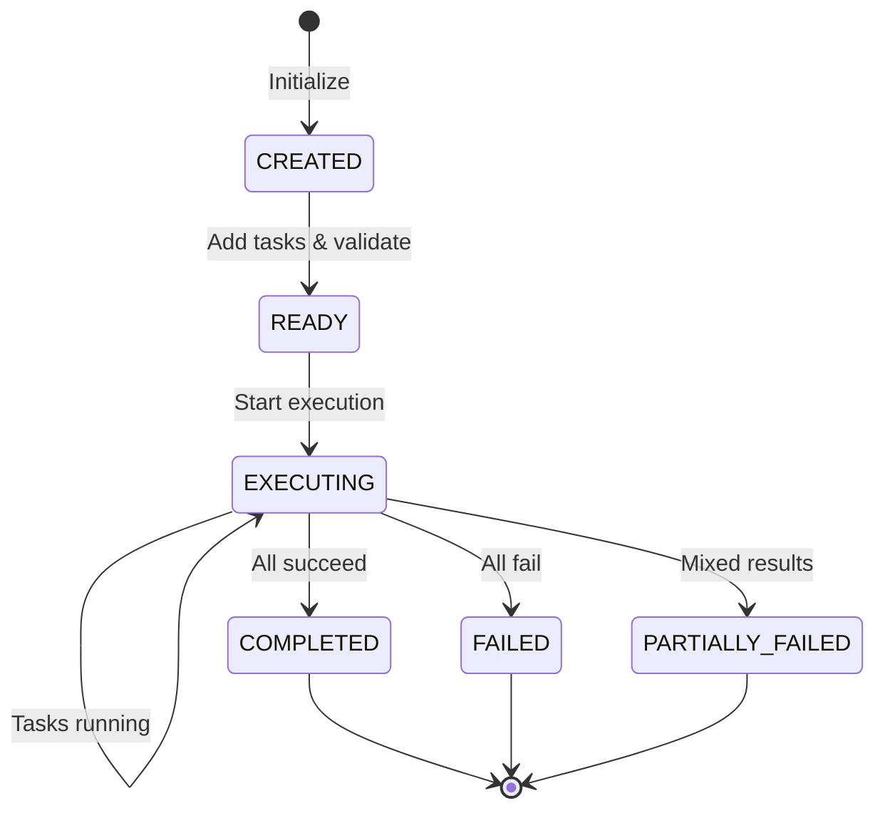
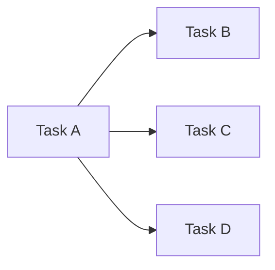
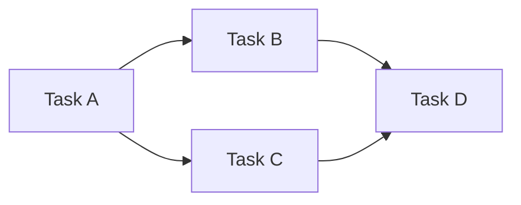
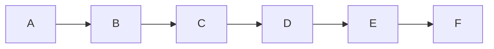
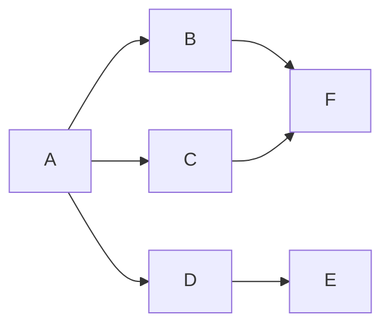

# TaskConstellation — DAG Orchestrator

## Overview

**TaskConstellation** is the complete DAG (Directed Acyclic Graph) orchestration system that manages distributed workflows across heterogeneous devices. It provides comprehensive task management, dependency validation, execution scheduling, and runtime dynamism for complex cross-device orchestration.

**Formal Definition:** A TaskConstellation $\mathcal{C}$ is a DAG defined as:

$$
\mathcal{C} = (\mathcal{T}, \mathcal{E})
$$

where $\mathcal{T}$ is the set of TaskStars and $\mathcal{E}$ is the set of TaskStarLines.

---

## Architecture

### Core Components

| Component | Type | Description |
|-----------|------|-------------|
| **constellation_id** | `str` | Unique identifier for the constellation |
| **name** | `str` | Human-readable constellation name |
| **state** | `ConstellationState` | Current execution state |
| **tasks** | `Dict[str, TaskStar]` | All tasks in the constellation |
| **dependencies** | `Dict[str, TaskStarLine]` | All dependency relationships |
| **metadata** | `Dict[str, Any]` | Additional constellation metadata |

### Execution Tracking

| Property | Type | Description |
|----------|------|-------------|
| **execution_start_time** | `datetime` | When execution started |
| **execution_end_time** | `datetime` | When execution completed |
| **execution_duration** | `float` | Total execution time in seconds |
| **created_at** | `datetime` | Constellation creation timestamp |
| **updated_at** | `datetime` | Last modification timestamp |

---

## Constellation Lifecycle



### State Definitions

| State | Description | Transition Trigger |
|-------|-------------|-------------------|
| **CREATED** | Empty constellation, no tasks added | Initialization |
| **READY** | Tasks added, validated, ready to execute | Tasks added, no running tasks |
| **EXECUTING** | At least one task running or completed | First task starts |
| **COMPLETED** | All tasks completed successfully | Last task succeeds |
| **FAILED** | All tasks failed | Last task fails, no successes |
| **PARTIALLY_FAILED** | Some tasks succeeded, some failed | Mixed terminal states |

---

## Core Operations

### Creating a Constellation

```python
from galaxy.constellation import TaskConstellation

# Create with auto-generated ID
constellation = TaskConstellation()
print(f"ID: {constellation.constellation_id}")
# Output: constellation_20251106_143052_a1b2c3d4

# Create with custom name
constellation = TaskConstellation(
    name="ml_training_pipeline",
    constellation_id="pipeline_001"
)
```

---

### Adding Tasks

```python
from galaxy.constellation import TaskStar

# Create tasks
task_a = TaskStar(
    task_id="fetch_data",
    description="Download training dataset",
    target_device_id="linux_server_1"
)

task_b = TaskStar(
    task_id="preprocess",
    description="Preprocess and normalize data",
    target_device_id="linux_server_2"
)

task_c = TaskStar(
    task_id="train_model",
    description="Train neural network",
    target_device_id="gpu_server_1"
)

# Add to constellation
constellation.add_task(task_a)
constellation.add_task(task_b)
constellation.add_task(task_c)

print(f"Total tasks: {constellation.task_count}")
# Output: Total tasks: 3
```

---

### Adding Dependencies

```python
from galaxy.constellation import TaskStarLine

# Create dependencies
dep1 = TaskStarLine.create_success_only(
    from_task_id="fetch_data",
    to_task_id="preprocess",
    description="Preprocess after successful download"
)

dep2 = TaskStarLine.create_success_only(
    from_task_id="preprocess",
    to_task_id="train_model",
    description="Train on preprocessed data"
)

# Add to constellation
constellation.add_dependency(dep1)
constellation.add_dependency(dep2)

print(f"Total dependencies: {constellation.dependency_count}")
# Output: Total dependencies: 2
```

---

### Removing Tasks and Dependencies

```python
# Remove a task (also removes related dependencies)
constellation.remove_task("preprocess")

# Remove a dependency
constellation.remove_dependency(dep1.line_id)

# Get specific task or dependency
task = constellation.get_task("fetch_data")
dep = constellation.get_dependency(dep1.line_id)
```

---

## DAG Validation

### Cycle Detection

```python
# Check for cycles
has_cycles = constellation.has_cycle()

if has_cycles:
    print("❌ Constellation contains cycles!")
else:
    print("✅ DAG is acyclic")

# Comprehensive validation
is_valid, errors = constellation.validate_dag()

if not is_valid:
    for error in errors:
        print(f"❌ {error}")
else:
    print("✅ Constellation is valid")
```

### Topological Ordering

```python
try:
    # Get topological order (throws if cyclic)
    order = constellation.get_topological_order()
    print(f"Execution order: {' → '.join(order)}")
    # Output: fetch_data → preprocess → train_model
    
except ValueError as e:
    print(f"Cannot get topological order: {e}")
```

---

## Scheduling and Execution

### Getting Ready Tasks

```python
# Get tasks ready to execute (no pending dependencies)
ready_tasks = constellation.get_ready_tasks()

for task in ready_tasks:
    print(f"Ready: {task.name} (priority: {task.priority.value})")
    # Tasks are sorted by priority (highest first)
```

### Execution Flow

```python
# Start constellation execution
constellation.start_execution()

# Start a specific task
constellation.start_task("fetch_data")

# Mark task as completed
newly_ready = constellation.mark_task_completed(
    task_id="fetch_data",
    success=True,
    result={"rows": 10000, "status": "success"}
)

# newly_ready contains tasks that became ready after this completion
for task in newly_ready:
    print(f"Now ready: {task.name}")
```

### Querying Task Status

```python
# Get tasks by status
running = constellation.get_running_tasks()
completed = constellation.get_completed_tasks()
failed = constellation.get_failed_tasks()
pending = constellation.get_pending_tasks()

print(f"Running: {len(running)}")
print(f"Completed: {len(completed)}")
print(f"Failed: {len(failed)}")
print(f"Pending: {len(pending)}")

# Check if entire constellation is complete
if constellation.is_complete():
    constellation.complete_execution()
    print(f"State: {constellation.state}")
```

---

## Parallelism Analysis

### DAG Metrics

```python
# Get longest path (critical path) using node counts
longest_path_length, longest_path = constellation.get_longest_path()

print(f"Critical path length: {longest_path_length}")
print(f"Critical path: {' → '.join(longest_path)}")

# Get maximum width (max concurrent tasks)
max_width = constellation.get_max_width()
print(f"Maximum parallelism: {max_width} tasks")
```

### Parallelism Ratio

```python
# Calculate parallelism metrics (L, W, P)
metrics = constellation.get_parallelism_metrics()

print(f"Critical Path Length (L): {metrics['critical_path_length']}")
print(f"Total Work (W): {metrics['total_work']}")
print(f"Parallelism Ratio (P): {metrics['parallelism_ratio']:.2f}")
print(f"Calculation Mode: {metrics['calculation_mode']}")

# Interpretation:
# P = 1.0  → Completely serial
# P = 2.0  → 2x parallelism on average
# P = 3.5  → 3.5x parallelism on average
```

**Note:** Calculation modes depend on task completion status:
- **node_count**: Used when tasks are incomplete (counts each task as 1 unit)
- **actual_time**: Used when all tasks are terminal (uses real execution durations)

### Time-Based Critical Path

```python
# Get critical path using actual execution times
# Only valid when all tasks are completed or failed
critical_time, critical_path_tasks = constellation.get_critical_path_length_with_time()

print(f"Critical path duration: {critical_time:.2f} seconds")
print(f"Tasks on critical path: {critical_path_tasks}")

# Get total work
total_work = constellation.get_total_work()
print(f"Total work: {total_work:.2f} seconds")

# Calculate speedup
speedup = total_work / critical_time if critical_time > 0 else 0
print(f"Speedup: {speedup:.2f}x")
```

---

## Statistics and Monitoring

### Comprehensive Statistics

```python
stats = constellation.get_statistics()

print(f"Constellation: {stats['name']}")
print(f"State: {stats['state']}")
print(f"Tasks: {stats['total_tasks']}")
print(f"Dependencies: {stats['total_dependencies']}")
print(f"Longest Path: {stats['longest_path_length']}")
print(f"Max Width: {stats['max_width']}")
print(f"Parallelism Ratio: {stats['parallelism_ratio']:.2f}")

# Task status breakdown
status_counts = stats['task_status_counts']
for status, count in status_counts.items():
    print(f"  {status}: {count}")

# Execution duration
if stats['execution_duration']:
    print(f"Duration: {stats['execution_duration']:.2f} seconds")
```

---

## Dynamic Modification

### Modifiable Components

```python
# Get tasks that can be safely modified
modifiable_tasks = constellation.get_modifiable_tasks()
# Only tasks in PENDING or WAITING_DEPENDENCY status

# Get modifiable dependencies
modifiable_deps = constellation.get_modifiable_dependencies()
# Dependencies whose target task hasn't started

# Check specific task/dependency
can_modify_task = constellation.is_task_modifiable("task_a")
can_modify_dep = constellation.is_dependency_modifiable("dep_1")
```

### Runtime Graph Evolution

```python
# Add diagnostic task during execution
diagnostic_task = TaskStar(
    task_id="health_check",
    description="Check server health after failure"
)
constellation.add_task(diagnostic_task)

# Add conditional fallback dependency
fallback_dep = TaskStarLine.create_conditional(
    from_task_id="train_model",
    to_task_id="health_check",
    condition_description="Run health check if training fails",
    condition_evaluator=lambda result: result is None
)
constellation.add_dependency(fallback_dep)

# Update constellation state
constellation.update_state()
```

!!! warning "Modification Safety"
    The constellation enforces safe modification:
    
    - **RUNNING tasks**: Cannot be modified
    - **Completed/Failed tasks**: Cannot be modified
    - **Dependencies to running tasks**: Cannot be modified
    
    This ensures execution consistency and prevents race conditions.

---

## Serialization and Persistence

### JSON Export/Import

```python
# Export to JSON string
json_string = constellation.to_json()

# Save to file
constellation.to_json(save_path="constellation_backup.json")

# Load from JSON string
restored = TaskConstellation.from_json(json_data=json_string)

# Load from file
loaded = TaskConstellation.from_json(file_path="constellation_backup.json")
```

### Dictionary Conversion

```python
# Convert to dictionary
constellation_dict = constellation.to_dict()

# Create from dictionary
new_constellation = TaskConstellation.from_dict(constellation_dict)

# Dictionary structure includes:
# - constellation_id, name, state
# - tasks (dict of task_id -> TaskStar dict)
# - dependencies (dict of line_id -> TaskStarLine dict)
# - metadata, timestamps
```

### Pydantic Schema

```python
# Convert to Pydantic BaseModel
schema = constellation.to_basemodel()

# Create from schema
constellation_from_schema = TaskConstellation.from_basemodel(schema)
```

---

## Visualization

### Display Modes

```python
# Overview mode - high-level structure
constellation.display_dag(mode="overview")

# Topology mode - detailed DAG graph
constellation.display_dag(mode="topology")

# Details mode - task execution details
constellation.display_dag(mode="details")

# Execution mode - real-time flow
constellation.display_dag(mode="execution")
```

---

## Querying Dependencies

### Task-Specific Dependencies

```python
# Get all dependencies for a specific task
task_deps = constellation.get_task_dependencies("train_model")

for dep in task_deps:
    print(f"{dep.from_task_id} → {dep.to_task_id} ({dep.dependency_type.value})")

# Get all dependencies in constellation
all_deps = constellation.get_all_dependencies()
```

---

## Example Workflows

### Simple Linear Pipeline


```python
# Create: A → B → C
constellation = TaskConstellation(name="linear_pipeline")

task_a = TaskStar(task_id="a", description="Task A")
task_b = TaskStar(task_id="b", description="Task B")
task_c = TaskStar(task_id="c", description="Task C")

constellation.add_task(task_a)
constellation.add_task(task_b)
constellation.add_task(task_c)

dep_ab = TaskStarLine.create_unconditional("a", "b")
dep_bc = TaskStarLine.create_unconditional("b", "c")

constellation.add_dependency(dep_ab)
constellation.add_dependency(dep_bc)

# Validate
is_valid, errors = constellation.validate_dag()
assert is_valid

# Get metrics
metrics = constellation.get_parallelism_metrics()
assert metrics['parallelism_ratio'] == 1.0  # Completely serial
```

### Parallel Fan-Out



```python
# Create: A → [B, C, D]
constellation = TaskConstellation(name="fan_out")

task_a = TaskStar(task_id="a", description="Root task")
task_b = TaskStar(task_id="b", description="Parallel task 1")
task_c = TaskStar(task_id="c", description="Parallel task 2")
task_d = TaskStar(task_id="d", description="Parallel task 3")

for task in [task_a, task_b, task_c, task_d]:
    constellation.add_task(task)

# All three tasks depend on A, can run in parallel
for target_id in ["b", "c", "d"]:
    dep = TaskStarLine.create_success_only("a", target_id)
    constellation.add_dependency(dep)

# Get metrics
metrics = constellation.get_parallelism_metrics()
assert metrics['max_width'] >= 3  # Can run 3 tasks in parallel
```

### Complex Diamond Pattern



```python
# Create: A → [B, C] → D
constellation = TaskConstellation(name="diamond")

tasks = {
    "a": TaskStar(task_id="a", description="Start"),
    "b": TaskStar(task_id="b", description="Path 1"),
    "c": TaskStar(task_id="c", description="Path 2"),
    "d": TaskStar(task_id="d", description="Merge")
}

for task in tasks.values():
    constellation.add_task(task)

# Fan-out: A → B, A → C
constellation.add_dependency(TaskStarLine.create_success_only("a", "b"))
constellation.add_dependency(TaskStarLine.create_success_only("a", "c"))

# Fan-in: B → D, C → D
constellation.add_dependency(TaskStarLine.create_success_only("b", "d"))
constellation.add_dependency(TaskStarLine.create_success_only("c", "d"))

# Analyze
order = constellation.get_topological_order()
print(f"Possible order: {order}")  # ['a', 'b', 'c', 'd'] or ['a', 'c', 'b', 'd']

longest_path_length, path = constellation.get_longest_path()
assert longest_path_length == 3  # A → B/C → D
```

---

## Error Handling

### Cycle Detection

```python
# Attempt to create a cycle
try:
    # This would create A → B → C → A
    constellation.add_dependency(
        TaskStarLine.create_unconditional("c", "a")
    )
except ValueError as e:
    print(f"❌ {e}")
    # Output: Adding dependency would create a cycle
```

### Missing Task References

```python
# Try to add dependency with non-existent task
try:
    dep = TaskStarLine.create_unconditional(
        "nonexistent_task",
        "task_b"
    )
    constellation.add_dependency(dep)
except ValueError as e:
    print(f"❌ {e}")
    # Output: Source task nonexistent_task not found
```

### Modifying Running Tasks

```python
# Try to remove a running task
task.start_execution()

try:
    constellation.remove_task(task.task_id)
except ValueError as e:
    print(f"❌ {e}")
    # Output: Cannot remove running task
```

---

## Best Practices

### Constellation Design Guidelines

1. **Validate early**: Run `validate_dag()` before execution
2. **Minimize dependencies**: Reduce unnecessary edges to maximize parallelism
3. **Use appropriate dependency types**: Match dependency type to workflow logic
4. **Monitor metrics**: Track parallelism ratio to optimize design
5. **Handle failures**: Use conditional dependencies for error recovery

### Optimization Patterns

**Before (Serial):**



Parallelism Ratio: 1.0

**After (Optimized):**



Parallelism Ratio: 1.67

!!! warning "Common Pitfalls"
    - **Over-parallelization**: Too many parallel tasks can overwhelm resources
    - **Tight coupling**: Excessive dependencies reduce parallelism
    - **Missing validation**: Always validate before execution
    - **Ignoring state**: Check constellation state before modifications

---

## Formal Properties

### Acyclicity Guarantee

The TaskConstellation enforces **acyclicity** through:

1. **DFS-based cycle detection** before adding dependencies
2. **Topological ordering** validation using Kahn's algorithm
3. **Runtime validation** during DAG modification

### Causal Consistency

Task dependencies ensure **causal consistency**:

- If task $t_j$ depends on $t_i$, then $t_i$ must complete before $t_j$ starts
- Transitive dependencies are preserved
- Concurrent tasks have no causal ordering

### Concurrency Safety

The constellation provides **safe concurrent execution**:

- **Read-only queries** are always safe
- **Modifications** are protected by state checks
- **Assignment locking** prevents race conditions (handled by orchestrator)

---

## Related Components

- **[TaskStar](task_star.md)** — Atomic task execution units
- **[TaskStarLine](task_star_line.md)** — Dependency relationships
- **[ConstellationEditor](constellation_editor.md)** — Safe editing with undo/redo
- **[Overview](overview.md)** — Framework overview

---

## API Reference

### Constructor

```python
TaskConstellation(
    constellation_id: Optional[str] = None,
    name: Optional[str] = None
)
```

### Task Management

| Method | Description |
|--------|-------------|
| `add_task(task)` | Add task to constellation |
| `remove_task(task_id)` | Remove task and related dependencies |
| `get_task(task_id)` | Get task by ID |
| `get_all_tasks()` | Get all tasks |
| `get_ready_tasks()` | Get tasks ready to execute |
| `get_running_tasks()` | Get currently running tasks |
| `get_completed_tasks()` | Get completed tasks |
| `get_failed_tasks()` | Get failed tasks |
| `get_pending_tasks()` | Get pending tasks |
| `get_modifiable_tasks()` | Get tasks safe to modify |

### Dependency Management

| Method | Description |
|--------|-------------|
| `add_dependency(dependency)` | Add dependency edge |
| `remove_dependency(dependency_id)` | Remove dependency |
| `get_dependency(dependency_id)` | Get dependency by ID |
| `get_all_dependencies()` | Get all dependencies |
| `get_task_dependencies(task_id)` | Get dependencies for specific task |
| `get_modifiable_dependencies()` | Get dependencies safe to modify |

### Validation

| Method | Description |
|--------|-------------|
| `validate_dag()` | Validate DAG structure, returns `(bool, List[str])` with validation errors |
| `has_cycle()` | Check for cycles (returns `bool`) |
| `get_topological_order()` | Get topological ordering (returns `List[str]`, raises `ValueError` if cyclic) |

### Execution

| Method | Description |
|--------|-------------|
| `start_execution()` | Mark constellation as started |
| `start_task(task_id)` | Start specific task |
| `mark_task_completed(task_id, success, result, error)` | Mark task done, returns `List[TaskStar]` of newly ready tasks |
| `complete_execution()` | Mark constellation as completed |
| `is_complete()` | Check if all tasks are terminal (returns `bool`) |
| `update_state()` | Update constellation state based on task states |

### Analysis

| Method | Description |
|--------|-------------|
| `get_longest_path()` | Get critical path using node count, returns `(int, List[str])` |
| `get_critical_path_length_with_time()` | Get critical path using actual time, returns `(float, List[str])` |
| `get_max_width()` | Get maximum parallelism (returns `int`) |
| `get_total_work()` | Get sum of execution durations (returns `float`) |
| `get_parallelism_metrics()` | Get comprehensive parallelism metrics (returns `Dict[str, Any]`) |
| `get_statistics()` | Get all constellation statistics (returns `Dict[str, Any]`) |

### Serialization

| Method | Description |
|--------|-------------|
| `to_dict()` | Convert to dictionary |
| `to_json(save_path)` | Export to JSON string or file |
| `from_dict(data)` | Create from dictionary (classmethod) |
| `from_json(json_data, file_path)` | Create from JSON (classmethod) |
| `to_basemodel()` | Convert to Pydantic schema |
| `from_basemodel(schema)` | Create from Pydantic schema (classmethod) |

### Visualization

| Method | Description |
|--------|-------------|
| `display_dag(mode)` | Display constellation (modes: overview, topology, details, execution) |

---

*TaskConstellation — Orchestrating distributed workflows across the digital galaxy*
