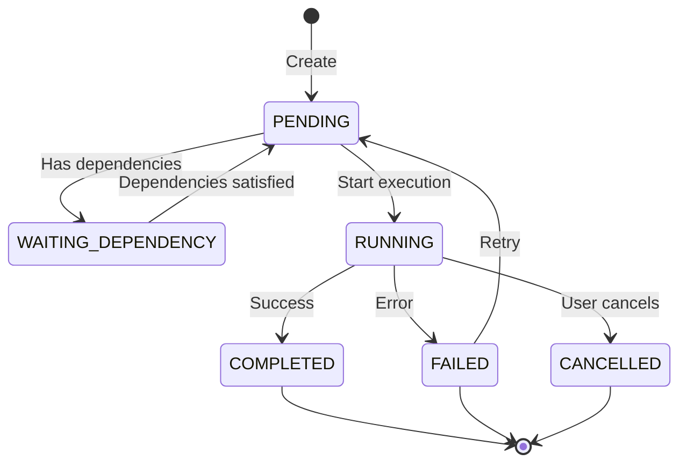

# TaskStar — Atomic Execution Unit

## Overview

**TaskStar** represents the atomic unit of computation in UFO Galaxy—the smallest indivisible task scheduled on a device agent. Each TaskStar encapsulates complete context necessary for autonomous execution, including semantic description, assigned device, execution state, and dependency relationships.

**Formal Definition:** A TaskStar $t_i$ is formally defined as:

$$
t_i = (\text{name}_i, \text{description}_i, \text{device}_i, \text{tips}_i, \text{status}_i, \text{dependencies}_i)
$$

---

## Architecture

### Core Properties

| Property | Type | Description |
|----------|------|-------------|
| **task_id** | `str` | Unique identifier (auto-generated UUID if not provided) |
| **name** | `str` | Short, human-readable task name |
| **description** | `str` | Natural-language specification of what the task should do |
| **tips** | `List[str]` | Guidance list to help device agent complete the task |
| **target_device_id** | `str` | ID of the device agent responsible for execution |
| **device_type** | `DeviceType` | Type of target device (Windows, Linux, Android, etc.) |
| **status** | `TaskStatus` | Current execution state |
| **priority** | `TaskPriority` | Priority level for scheduling (LOW, MEDIUM, HIGH, CRITICAL) |
| **timeout** | `float` | Maximum execution time in seconds |
| **retry_count** | `int` | Number of allowed retries on failure |
| **task_data** | `Dict[str, Any]` | Additional data needed for task execution |
| **expected_output_type** | `str` | Expected type/format of the output |

**Note:** The property `task_description` is available as a backward compatibility alias for `description`.

### Execution Tracking

| Property | Type | Description |
|----------|------|-------------|
| **result** | `Any` | Task execution result (if completed successfully) |
| **error** | `Exception` | Error information (if failed) |
| **execution_start_time** | `datetime` | Timestamp when execution started |
| **execution_end_time** | `datetime` | Timestamp when execution ended |
| **execution_duration** | `float` | Duration in seconds (calculated) |
| **created_at** | `datetime` | Task creation timestamp |
| **updated_at** | `datetime` | Last modification timestamp |

**Note:** All execution tracking properties are read-only and automatically managed by the TaskStar lifecycle methods.

### Computed Properties

| Property | Type | Description |
|----------|------|-------------|
| **is_terminal** | `bool` | True if task is in a terminal state (COMPLETED, FAILED, or CANCELLED) |
| **is_ready_to_execute** | `bool` | True if task is PENDING and has no pending dependencies |

---

## Task Status Lifecycle



### Status Definitions

| Status | Description | Terminal |
|--------|-------------|----------|
| **PENDING** | Task is ready to execute (no pending dependencies) | ❌ |
| **WAITING_DEPENDENCY** | Task is waiting for prerequisite tasks | ❌ |
| **RUNNING** | Task is currently executing on device | ❌ |
| **COMPLETED** | Task finished successfully | ✅ |
| **FAILED** | Task encountered an error | ✅ |
| **CANCELLED** | Task was cancelled by user | ✅ |

**Note:** Terminal states (COMPLETED, FAILED, CANCELLED) are final—tasks in these states cannot transition to other states without explicit retry.

---

## Priority Levels

Tasks are scheduled based on priority when multiple tasks are ready to execute:

| Priority | Value | Use Case |
|----------|-------|----------|
| **LOW** | 1 | Background tasks, cleanup operations |
| **MEDIUM** | 2 | Standard tasks (default) |
| **HIGH** | 3 | Important tasks requiring quick execution |
| **CRITICAL** | 4 | Time-sensitive tasks, system health checks |

---

## Usage Examples

### Creating a TaskStar

```python
from galaxy.constellation import TaskStar
from galaxy.constellation.enums import DeviceType, TaskPriority

# Basic task creation
task = TaskStar(
    task_id="build_docker_image",
    name="Docker Build",
    description="Build the Docker image from Dockerfile in the current directory",
    tips=[
        "Use docker build command",
        "Tag the image as 'myapp:latest'",
        "Check for build errors in output"
    ],
    target_device_id="linux_gpu_server",
    device_type=DeviceType.LINUX,
    priority=TaskPriority.HIGH,
    timeout=300.0,  # 5 minutes
    retry_count=2
)
```

### Task with Additional Data

```python
# Task with custom data payload
task = TaskStar(
    task_id="process_dataset",
    description="Preprocess the dataset and save to output directory",
    task_data={
        "input_path": "/data/raw/dataset.csv",
        "output_path": "/data/processed/dataset_clean.csv",
        "columns_to_drop": ["temp_col1", "temp_col2"],
        "normalization": "min-max"
    },
    target_device_id="linux_cpu_1",
    device_type=DeviceType.LINUX
)
```

### Auto-Generated Task

```python
# Minimal creation with auto-generated ID and defaults
task = TaskStar(
    description="Run unit tests",
    target_device_id="windows_desktop"
)

print(task.task_id)  # Auto-generated UUID
print(task.name)     # Auto-generated: "task_{first 8 chars of UUID}"
print(task.priority) # Default: TaskPriority.MEDIUM
```

---

## Core Operations

### Execution Management

```python
# Start execution
task.start_execution()
print(f"Started at: {task.execution_start_time}")

# Mark as completed (success)
result = {"status": "success", "output": "Tests passed: 45/45"}
task.complete_with_success(result)
print(f"Duration: {task.execution_duration} seconds")

# Mark as failed
try:
    # ... execution code ...
    raise Exception("Docker build failed")
except Exception as e:
    task.complete_with_failure(e)
    print(f"Error: {task.error}")
```

### Retry Logic

```python
# Check if task should retry
if task.should_retry():
    task.retry()
    print(f"Retry attempt {task._current_retry}/{task._retry_count}")
    # Task status is now PENDING again
```

### Validation

```python
# Validate task configuration
if task.validate():
    print("Task configuration is valid")
else:
    errors = task.get_validation_errors()
    print(f"Validation errors: {errors}")
```

---

## State Queries

### Checking Task State

```python
# Check if task is ready to execute
if task.is_ready_to_execute:
    print("Task can be started")

# Check if task is in terminal state
if task.is_terminal:
    print("Task has finished executing")

# Query specific status
if task.status == TaskStatus.RUNNING:
    elapsed = datetime.now(timezone.utc) - task.execution_start_time
    print(f"Running for {elapsed.total_seconds()} seconds")
```

### Accessing Results

```python
# Access execution results
if task.status == TaskStatus.COMPLETED:
    print(f"Result: {task.result}")
    print(f"Duration: {task.execution_duration}s")
    
elif task.status == TaskStatus.FAILED:
    print(f"Error: {task.error}")
    print(f"Failed at: {task.execution_end_time}")
```

---

## Serialization

### JSON Export/Import

```python
# Export to JSON
json_string = task.to_json()
print(json_string)

# Save to file
task.to_json(save_path="task_backup.json")

# Load from JSON string
restored_task = TaskStar.from_json(json_data=json_string)

# Load from file
loaded_task = TaskStar.from_json(file_path="task_backup.json")
```

### Dictionary Conversion

```python
# Convert to dictionary
task_dict = task.to_dict()

# Create from dictionary
new_task = TaskStar.from_dict(task_dict)
```

### Pydantic Schema Conversion

```python
# Convert to Pydantic BaseModel
schema = task.to_basemodel()

# Create from Pydantic schema
task_from_schema = TaskStar.from_basemodel(schema)
```

---

## Advanced Features

### Request String Formatting

The `to_request_string()` method formats the task for device agent consumption:

```python
request = task.to_request_string()

# Output:
# Task Description: Build the Docker image from Dockerfile
# Tips for Completion:
#  - Use docker build command
#  - Tag the image as 'myapp:latest'
#  - Check for build errors in output
```

This formatted string is sent to device agents for execution.

### Dynamic Data Updates

```python
# Update task data
task.update_task_data({
    "additional_flags": ["--no-cache", "--pull"],
    "build_args": {"VERSION": "1.2.3"}
})

# Access task data
data = task.task_data
print(data["additional_flags"])
```

!!! warning "Modification Restrictions"
    Task properties cannot be modified while the task is in `RUNNING` status. This prevents race conditions and ensures execution consistency.

---

## Dependency Management

### Internal Dependency Tracking

TaskStar maintains internal sets of dependencies and dependents:

```python
# Add dependency (internal use by TaskConstellation)
task.add_dependency("prerequisite_task_id")

# Remove dependency
task.remove_dependency("prerequisite_task_id")

# Add dependent task
task.add_dependent("dependent_task_id")

# Check dependencies
print(f"Dependencies: {task._dependencies}")
print(f"Dependents: {task._dependents}")
```

!!! note "Managed by TaskConstellation"
    Dependency management methods are primarily used internally by `TaskConstellation`. Direct manipulation is not recommended—use `ConstellationEditor` for safe editing with undo/redo support.

---

## Integration with Constellation

### Adding to Constellation

```python
from galaxy.constellation import TaskConstellation

constellation = TaskConstellation(name="my_workflow")

# Add task to constellation
constellation.add_task(task)

# Task is now managed by constellation
ready_tasks = constellation.get_ready_tasks()
```

### Execution via Device Manager

```python
from galaxy.client.device_manager import ConstellationDeviceManager

# Execute task using device manager
device_manager = ConstellationDeviceManager()

# Execute returns an ExecutionResult object
execution_result = await task.execute(device_manager)

print(f"Status: {execution_result.status}")
print(f"Result: {execution_result.result}")
print(f"Execution Time: {execution_result.execution_time}s")
```

---

## Error Handling

### Validation Errors

```python
task = TaskStar(
    task_id="",  # Invalid: empty ID
    name="",  # Invalid: empty name
    description="",  # Invalid: empty description
    timeout=-1.0  # Invalid: negative timeout
)

if not task.validate():
    for error in task.get_validation_errors():
        print(f"❌ {error}")

# Output:
# ❌ Task ID must be a non-empty string
# ❌ Task name must be a non-empty string
# ❌ Task description must be a non-empty string
# ❌ Timeout must be a positive number
```

### Execution Errors

```python
try:
    task.start_execution()
except ValueError as e:
    print(f"Cannot start: {e}")
    # Example: "Cannot start task in status RUNNING"

try:
    task.complete_with_success(result)
except ValueError as e:
    print(f"Cannot complete: {e}")
    # Example: "Cannot complete task in status PENDING"
```

---

## Example Workflows

### Simple Task Execution

```python
# Create task
task = TaskStar(
    description="Run Python script",
    target_device_id="linux_server_1",
    timeout=60.0
)

# Execute
task.start_execution()
try:
    # ... actual execution ...
    result = {"output": "Script completed", "exit_code": 0}
    task.complete_with_success(result)
except Exception as e:
    task.complete_with_failure(e)

# Check result
if task.status == TaskStatus.COMPLETED:
    print(f"✅ Success: {task.result}")
else:
    print(f"❌ Failed: {task.error}")
```

### Retry on Failure

```python
max_attempts = 3
attempt = 0

while attempt < max_attempts:
    attempt += 1
    task.start_execution()
    
    try:
        # ... execution code ...
        task.complete_with_success(result)
        break
    except Exception as e:
        task.complete_with_failure(e)
        
        if task.should_retry():
            task.retry()
            print(f"Retry {attempt}/{max_attempts}")
        else:
            print("Max retries exceeded")
            break
```

---

## Best Practices

### Task Design Guidelines

1. **Keep tasks atomic**: Each task should represent a single, well-defined operation
2. **Provide clear descriptions**: Use natural language that device agents can understand
3. **Include helpful tips**: Guide the agent with specific instructions or common pitfalls
4. **Set appropriate timeouts**: Prevent hanging tasks with realistic timeout values
5. **Use retry wisely**: Enable retries for transient failures, not logic errors

### Good vs. Bad Task Descriptions

✅ **Good**: "Build the Docker image from the Dockerfile in /app directory and tag it as 'myapp:v1.2.3'"

❌ **Bad**: "Build stuff"

✅ **Good**: "Run pytest on the test/ directory and generate a coverage report in HTML format"

❌ **Bad**: "Test the code"

!!! warning "Common Pitfalls"
    - **Don't modify running tasks**: Attempting to change properties during execution raises `ValueError`
    - **Don't forget validation**: Always validate tasks before adding to constellation
    - **Don't ignore timeouts**: Set realistic timeouts to prevent resource exhaustion

---

## Related Components

- **[TaskStarLine](task_star_line.md)** — Dependency relationships between tasks
- **[TaskConstellation](task_constellation.md)** — DAG orchestration and execution
- **[ConstellationEditor](constellation_editor.md)** — Safe task editing with undo/redo
- **[ConstellationDeviceManager](../client/device_manager.md)** — Device management and task assignment
- **[Overview](overview.md)** — Task Constellation framework overview

---

## API Reference

### Constructor

```python
TaskStar(
    task_id: Optional[str] = None,
    name: str = "",
    description: str = "",
    tips: List[str] = None,
    target_device_id: Optional[str] = None,
    device_type: Optional[DeviceType] = None,
    priority: TaskPriority = TaskPriority.MEDIUM,
    timeout: Optional[float] = None,
    retry_count: int = 0,
    task_data: Optional[Dict[str, Any]] = None,
    expected_output_type: Optional[str] = None,
    config: Optional[TaskConfiguration] = None
)
```

### Key Methods

| Method | Description |
|--------|-------------|
| `execute(device_manager)` | Execute task using device manager (async, returns `ExecutionResult`) |
| `validate()` | Validate task configuration (returns `bool`) |
| `get_validation_errors()` | Get list of validation errors (returns `List[str]`) |
| `start_execution()` | Mark task as started |
| `complete_with_success(result)` | Mark task as completed successfully |
| `complete_with_failure(error)` | Mark task as failed |
| `retry()` | Reset task for retry attempt |
| `cancel()` | Cancel the task |
| `should_retry()` | Check if task should be retried (returns `bool`) |
| `to_dict()` | Convert to dictionary |
| `to_json(save_path)` | Export to JSON string or file |
| `from_dict(data)` | Create from dictionary (classmethod) |
| `from_json(json_data, file_path)` | Create from JSON (classmethod) |
| `to_basemodel()` | Convert to Pydantic BaseModel schema |
| `from_basemodel(schema)` | Create from Pydantic schema (classmethod) |

---

*TaskStar — The atomic building block of distributed workflows*
