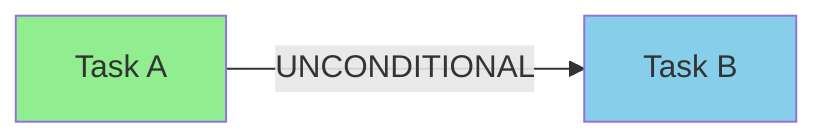
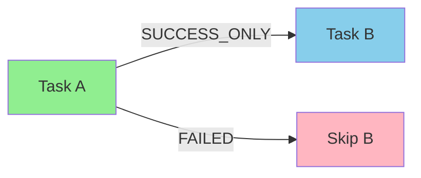
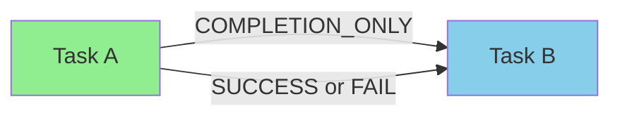
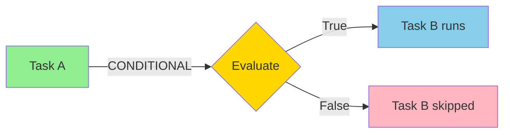
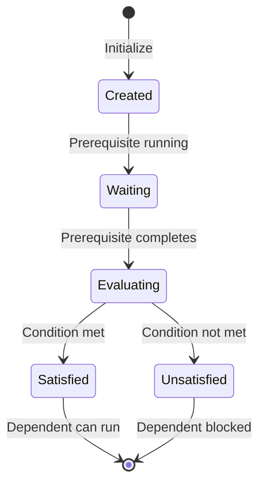

# TaskStarLine — Dependency Relationship

## Overview

**TaskStarLine** represents a directed dependency relationship between two TaskStars, forming an edge in the task constellation DAG. Each TaskStarLine defines how tasks depend on each other, with support for conditional logic, success-only execution, and custom condition evaluation.

**Formal Definition:** A TaskStarLine $e_{i \rightarrow j}$ specifies a dependency from task $t_i$ to task $t_j$:

$$
e_{i \rightarrow j} = (\text{from\_task}_i, \text{to\_task}_j, \text{type}, \text{description})
$$

Task $t_j$ cannot begin until certain conditions on $t_i$ are satisfied, based on the dependency type.

---

## Architecture

### Core Properties

| Property | Type | Description |
|----------|------|-------------|
| **line_id** | `str` | Unique identifier (auto-generated UUID if not provided) |
| **from_task_id** | `str` | ID of the prerequisite task (source) |
| **to_task_id** | `str` | ID of the dependent task (target) |
| **dependency_type** | `DependencyType` | Type of dependency relationship |
| **condition_description** | `str` | Natural language description of the condition |
| **condition_evaluator** | `Callable` | Function to evaluate if condition is met |
| **metadata** | `Dict[str, Any]` | Additional metadata for the dependency |

**Note:** The properties `source_task_id` and `target_task_id` are available as aliases for `from_task_id` and `to_task_id` respectively (for IDependency interface compatibility).

### State Tracking

| Property | Type | Description |
|----------|------|-------------|
| **is_satisfied** | `bool` | Whether the dependency condition is currently satisfied |
| **last_evaluation_result** | `bool` | Result of the most recent condition evaluation |
| **last_evaluation_time** | `datetime` | Timestamp of last condition evaluation |
| **created_at** | `datetime` | Dependency creation timestamp |
| **updated_at** | `datetime` | Last modification timestamp |

**Note:** All state tracking properties are read-only and automatically managed by TaskStarLine methods.

---

## Dependency Types

TaskStarLine supports four types of dependency relationships:

### 1. Unconditional (`UNCONDITIONAL`)

Task $t_j$ **always** waits for $t_i$ to complete, regardless of success or failure.



**Use Cases:**
- Sequential pipeline stages
- Resource cleanup after any task completion
- Logging or notification tasks

**Example:**
```python
# Task B always runs after Task A completes
dep = TaskStarLine.create_unconditional(
    from_task_id="task_a",
    to_task_id="task_b",
    description="B runs after A regardless of outcome"
)
```

---

### 2. Success-Only (`SUCCESS_ONLY`)

Task $t_j$ proceeds **only if** $t_i$ completes successfully (result is not `None`).



**Use Cases:**
- Build pipeline (deploy only if build succeeds)
- Multi-step data processing
- Conditional workflow branches

**Example:**
```python
# Task B only runs if Task A succeeds
dep = TaskStarLine.create_success_only(
    from_task_id="build_task",
    to_task_id="deploy_task",
    description="Deploy only if build succeeds"
)
```

**Note:** Success is determined by the prerequisite task returning a non-`None` result.

---

### 3. Completion-Only (`COMPLETION_ONLY`)

Task $t_j$ proceeds when $t_i$ completes, **regardless of success or failure**.



**Use Cases:**
- Cleanup tasks
- Notification tasks
- Audit logging

**Example:**
```python
# Task B runs after Task A finishes, regardless of outcome
dep = TaskStarLine(
    from_task_id="main_task",
    to_task_id="cleanup_task",
    dependency_type=DependencyType.COMPLETION_ONLY,
    condition_description="Cleanup runs regardless of main task outcome"
)
```

---

### 4. Conditional (`CONDITIONAL`)

Task $t_j$ proceeds based on a **user-defined condition** evaluated on $t_i$'s result.



**Use Cases:**
- Error handling branches
- Result-based routing
- Performance-based optimization

**Example:**
```python
# Define custom condition evaluator
def check_coverage_threshold(result):
    """Run next task only if test coverage > 80%"""
    if result and isinstance(result, dict):
        coverage = result.get("coverage_percent", 0)
        return coverage > 80
    return False

# Create conditional dependency
dep = TaskStarLine.create_conditional(
    from_task_id="test_task",
    to_task_id="quality_gate_task",
    condition_description="Proceed if test coverage > 80%",
    condition_evaluator=check_coverage_threshold
)
```

**Note:** If no `condition_evaluator` is provided for a CONDITIONAL dependency, it defaults to SUCCESS_ONLY behavior (checks if result is not `None`).

---

## Dependency Lifecycle



---

## Usage Examples

### Creating Dependencies

```python
from galaxy.constellation import TaskStarLine
from galaxy.constellation.enums import DependencyType

# 1. Unconditional dependency
dep1 = TaskStarLine.create_unconditional(
    from_task_id="checkout_code",
    to_task_id="build_project",
    description="Build after checkout"
)

# 2. Success-only dependency
dep2 = TaskStarLine.create_success_only(
    from_task_id="build_project",
    to_task_id="deploy_staging",
    description="Deploy only if build succeeds"
)

# 3. Conditional dependency with custom logic
def check_test_results(result):
    return result.get("tests_passed", 0) == result.get("total_tests", 0)

dep3 = TaskStarLine.create_conditional(
    from_task_id="run_tests",
    to_task_id="deploy_production",
    condition_description="Deploy to production only if all tests pass",
    condition_evaluator=check_test_results
)

# 4. Manual construction
dep4 = TaskStarLine(
    from_task_id="task_a",
    to_task_id="task_b",
    dependency_type=DependencyType.COMPLETION_ONLY,
    condition_description="Task B runs after Task A completes",
    metadata={"priority": "high", "category": "cleanup"}
)
```

---

## Core Operations

### Condition Evaluation

```python
# Evaluate condition with prerequisite result
prerequisite_result = {
    "status": "success",
    "coverage_percent": 85,
    "tests_passed": 120,
    "total_tests": 120
}

is_satisfied = dep.evaluate_condition(prerequisite_result)

if is_satisfied:
    print("✅ Dependency satisfied, dependent task can run")
    print(f"Evaluated at: {dep.last_evaluation_time}")
else:
    print("❌ Dependency not satisfied, dependent task blocked")

# Check evaluation history
print(f"Last result: {dep.last_evaluation_result}")
```

### Manual Satisfaction Control

```python
# Manually mark dependency as satisfied (override)
dep.mark_satisfied()

# Reset satisfaction status
dep.reset_satisfaction()

# Check satisfaction
if dep.is_satisfied():
    print("Dependency is satisfied")
```

---

## State Queries

### Checking Dependency State

```python
# Method 1: Check using completed tasks list (for IDependency interface)
# Returns True if from_task_id is in the completed_tasks list
completed_tasks = ["task_a", "task_b", "task_c"]
if dep.is_satisfied(completed_tasks):
    print("Prerequisite task is completed")

# Method 2: Check internal satisfaction state (without parameter)
# Returns the internal _is_satisfied flag set by evaluate_condition
if dep.is_satisfied():
    print("Dependency condition is satisfied")

# Get last evaluation details
print(f"Last evaluated: {dep.last_evaluation_time}")
print(f"Result: {dep.last_evaluation_result}")

# Access metadata
print(f"Metadata: {dep.metadata}")
```

---

## Modification

### Updating Dependency Properties

```python
# Change dependency type
dep.dependency_type = DependencyType.SUCCESS_ONLY

# Update condition description
dep.condition_description = "Updated: Deploy only after successful validation"

# Set new condition evaluator
def new_evaluator(result):
    return result.get("validation_score", 0) > 0.95

dep.set_condition_evaluator(new_evaluator)

# Update metadata
dep.update_metadata({
    "updated_by": "admin",
    "reason": "Stricter validation threshold"
})
```

!!! warning "Modification During Execution"
    Changing `dependency_type` or `condition_evaluator` resets the satisfaction status. Be cautious when modifying dependencies during active constellation execution.

---

## Serialization

### JSON Export/Import

```python
# Export to JSON
json_string = dep.to_json()
print(json_string)

# Save to file
dep.to_json(save_path="dependency_backup.json")

# Load from JSON string
restored_dep = TaskStarLine.from_json(json_data=json_string)

# Load from file
loaded_dep = TaskStarLine.from_json(file_path="dependency_backup.json")
```

### Dictionary Conversion

```python
# Convert to dictionary
dep_dict = dep.to_dict()

# Create from dictionary
new_dep = TaskStarLine.from_dict(dep_dict)

# Dictionary structure
print(dep_dict)
# {
#     "line_id": "uuid-string",
#     "from_task_id": "task_a",
#     "to_task_id": "task_b",
#     "dependency_type": "success_only",
#     "condition_description": "...",
#     "metadata": {...},
#     "is_satisfied": false,
#     "last_evaluation_result": null,
#     "created_at": "2025-11-06T...",
#     "updated_at": "2025-11-06T..."
# }
```

### Pydantic Schema Conversion

```python
# Convert to Pydantic BaseModel
schema = dep.to_basemodel()

# Create from Pydantic schema
dep_from_schema = TaskStarLine.from_basemodel(schema)
```

---

## Integration with Constellation

### Adding to Constellation

```python
from galaxy.constellation import TaskConstellation

constellation = TaskConstellation(name="my_workflow")

# Add tasks first
constellation.add_task(task_a)
constellation.add_task(task_b)

# Add dependency
try:
    constellation.add_dependency(dep)
    print("✅ Dependency added successfully")
except ValueError as e:
    print(f"❌ Failed to add dependency: {e}")
```

### Dependency Validation

```python
# TaskConstellation validates dependencies automatically
try:
    # This would fail if it creates a cycle
    constellation.add_dependency(cyclic_dep)
except ValueError as e:
    print(f"Validation error: {e}")
    # Output: "Adding dependency would create a cycle"

# Check DAG validity
is_valid, errors = constellation.validate_dag()
if not is_valid:
    for error in errors:
        print(f"❌ {error}")
```

---

## Advanced Patterns

### Conditional Error Handling

```python
# Main task
main_task = TaskStar(
    task_id="main_process",
    description="Process data"
)

# Success path
success_task = TaskStar(
    task_id="success_notification",
    description="Send success notification"
)

# Error path
error_task = TaskStar(
    task_id="error_recovery",
    description="Attempt recovery"
)

# Success-only dependency
success_dep = TaskStarLine.create_success_only(
    from_task_id="main_process",
    to_task_id="success_notification"
)

# Failure-only dependency (using conditional)
def on_failure(result):
    return result is None  # Task failed if result is None

failure_dep = TaskStarLine.create_conditional(
    from_task_id="main_process",
    to_task_id="error_recovery",
    condition_description="Run recovery if main task fails",
    condition_evaluator=on_failure
)
```

### Performance-Based Routing

```python
# Route to different processing paths based on data size
def route_large_dataset(result):
    data_size = result.get("row_count", 0)
    return data_size > 1_000_000  # Route to GPU if > 1M rows

# Route to GPU for large datasets
gpu_dep = TaskStarLine.create_conditional(
    from_task_id="analyze_dataset",
    to_task_id="process_on_gpu",
    condition_description="Use GPU for datasets > 1M rows",
    condition_evaluator=route_large_dataset
)

# Route to CPU for small datasets
def route_small_dataset(result):
    data_size = result.get("row_count", 0)
    return data_size <= 1_000_000

cpu_dep = TaskStarLine.create_conditional(
    from_task_id="analyze_dataset",
    to_task_id="process_on_cpu",
    condition_description="Use CPU for datasets <= 1M rows",
    condition_evaluator=route_small_dataset
)
```

---

## Error Handling

### Validation

```python
# TaskStarLine validates on creation
try:
    invalid_dep = TaskStarLine(
        from_task_id="task_a",
        to_task_id="task_a",  # Self-loop!
        dependency_type=DependencyType.UNCONDITIONAL
    )
    constellation.add_dependency(invalid_dep)
except ValueError as e:
    print(f"Validation error: {e}")
    # TaskConstellation will detect cycle
```

### Evaluation Errors

```python
def risky_evaluator(result):
    # This might raise an exception
    return result["complex_calculation"] / result["divisor"]

dep = TaskStarLine.create_conditional(
    from_task_id="task_a",
    to_task_id="task_b",
    condition_description="Conditional with potential error",
    condition_evaluator=risky_evaluator
)

# evaluate_condition catches exceptions and returns False
result = {"complex_calculation": 100}  # Missing "divisor"
is_satisfied = dep.evaluate_condition(result)
print(is_satisfied)  # False (evaluator raised KeyError, caught internally)
print(dep.last_evaluation_result)  # False
```

---

## Example Workflows

### Build Pipeline

```python
# checkout → build → test → deploy
checkout = TaskStar(task_id="checkout", description="Checkout code")
build = TaskStar(task_id="build", description="Build project")
test = TaskStar(task_id="test", description="Run tests")
deploy = TaskStar(task_id="deploy", description="Deploy to production")

# Sequential success-only dependencies
dep1 = TaskStarLine.create_success_only("checkout", "build")
dep2 = TaskStarLine.create_success_only("build", "test")
dep3 = TaskStarLine.create_success_only("test", "deploy")
```

### Fan-Out Pattern

```python
# analyze → [process_gpu, process_cpu, process_edge]
analyze = TaskStar(task_id="analyze", description="Analyze data")
process_gpu = TaskStar(task_id="gpu", description="Process on GPU")
process_cpu = TaskStar(task_id="cpu", description="Process on CPU")
process_edge = TaskStar(task_id="edge", description="Process on edge device")

# All three can start after analyze completes
dep1 = TaskStarLine.create_unconditional("analyze", "gpu")
dep2 = TaskStarLine.create_unconditional("analyze", "cpu")
dep3 = TaskStarLine.create_unconditional("analyze", "edge")
```

### Fan-In Pattern

```python
# [task_a, task_b, task_c] → aggregate
task_a = TaskStar(task_id="task_a", description="Process batch A")
task_b = TaskStar(task_id="task_b", description="Process batch B")
task_c = TaskStar(task_id="task_c", description="Process batch C")
aggregate = TaskStar(task_id="aggregate", description="Aggregate results")

# Aggregate waits for all three to complete
dep1 = TaskStarLine.create_success_only("task_a", "aggregate")
dep2 = TaskStarLine.create_success_only("task_b", "aggregate")
dep3 = TaskStarLine.create_success_only("task_c", "aggregate")
```

---

## Best Practices

### Dependency Design Guidelines

1. **Use the right type**: Choose the dependency type that matches your workflow logic
2. **Keep conditions simple**: Condition evaluators should be fast and deterministic
3. **Handle evaluator errors**: Ensure evaluators don't raise uncaught exceptions (they're caught internally but logged)
4. **Document conditions**: Use clear `condition_description` for debugging
5. **Avoid cycles**: TaskConstellation validates, but design carefully to avoid attempts

### Good vs. Bad Condition Evaluators

✅ **Good**: Simple, fast, defensive

```python
def check_success(result):
    return result is not None and result.get("status") == "success"
```

❌ **Bad**: Complex, slow, error-prone

```python
def check_success(result):
    # Slow database query
    db_status = query_database(result["task_id"])
    # Complex logic with potential errors
    return eval(result["complex_expression"]) and db_status
```

!!! warning "Common Pitfalls"
    - **Cyclic dependencies**: Always validate DAG before execution
    - **Missing tasks**: Ensure both `from_task_id` and `to_task_id` exist in constellation
    - **Stateful evaluators**: Avoid evaluators that depend on external state
    - **Slow evaluators**: Keep evaluation fast; avoid I/O or expensive computation

---

## Related Components

- **[TaskStar](task_star.md)** — Atomic execution units that TaskStarLines connect
- **[TaskConstellation](task_constellation.md)** — DAG manager that validates and executes dependencies
- **[ConstellationEditor](constellation_editor.md)** — Safe dependency editing with undo/redo
- **[Overview](overview.md)** — Task Constellation framework overview

---

## API Reference

### Constructor

```python
TaskStarLine(
    from_task_id: str,
    to_task_id: str,
    dependency_type: DependencyType = DependencyType.UNCONDITIONAL,
    condition_description: Optional[str] = None,
    condition_evaluator: Optional[Callable[[Any], bool]] = None,
    line_id: Optional[str] = None,
    metadata: Optional[Dict[str, Any]] = None
)
```

### Factory Methods

| Method | Description |
|--------|-------------|
| `create_unconditional(from_id, to_id, desc)` | Create unconditional dependency (classmethod) |
| `create_success_only(from_id, to_id, desc)` | Create success-only dependency (classmethod) |
| `create_conditional(from_id, to_id, desc, evaluator)` | Create conditional dependency (classmethod) |

### Key Methods

| Method | Description |
|--------|-------------|
| `evaluate_condition(result)` | Evaluate if condition is satisfied (returns `bool`) |
| `mark_satisfied()` | Manually mark as satisfied |
| `reset_satisfaction()` | Reset satisfaction status |
| `is_satisfied(completed_tasks=None)` | Check if dependency is satisfied (returns `bool`); with parameter checks if from_task is completed, without checks internal state |
| `set_condition_evaluator(evaluator)` | Set new condition evaluator |
| `update_metadata(metadata)` | Update metadata |
| `to_dict()` | Convert to dictionary |
| `to_json(save_path)` | Export to JSON |
| `from_dict(data)` | Create from dictionary (classmethod) |
| `from_json(json_data, file_path)` | Create from JSON (classmethod) |
| `to_basemodel()` | Convert to Pydantic BaseModel schema |
| `from_basemodel(schema)` | Create from Pydantic schema (classmethod) |

---

*TaskStarLine — Connecting tasks with intelligent dependency logic*
