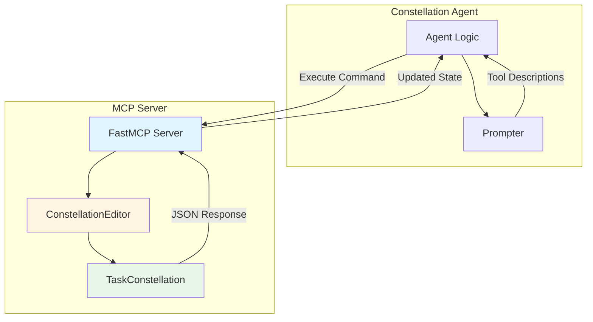
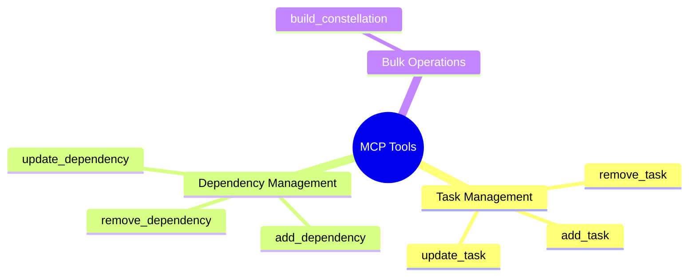

# Constellation MCP Server — Structured Task Management

## Overview

The **Constellation MCP Server** provides a standardized, idempotent interface for manipulating Task Constellations. Through Model Context Protocol (MCP), it exposes task and dependency management primitives that bridge LLM-level reasoning and concrete execution state, ensuring reproducibility and auditability.

The Constellation MCP Server is a lightweight component that operationalizes dynamic graph construction for the Constellation Agent. It serves as the **structured manipulation layer** between LLM reasoning and the Task Constellation data structure.

### Design Principles

| Principle | Description |
|-----------|-------------|
| **Idempotency** | Each operation can be safely retried without side effects |
| **Atomicity** | Single operation per tool call with clear success/failure |
| **Consistency** | Returns globally valid constellation snapshots after each operation |
| **Auditability** | All operations are logged and traceable |
| **Type Safety** | Pydantic schema validation for all inputs/outputs |

### Architecture



---

## 🛠️ Core Tools

The MCP server exposes **7 core tools** organized into three categories:

### Tool Categories



---

## 📦 Task Management Tools

### add_task

Add a new atomic task (TaskStar) to the constellation.

#### Parameters

| Parameter | Type | Required | Description |
|-----------|------|----------|-------------|
| `task_id` | `str` | ✅ Yes | Unique identifier for the task (e.g., `"open_browser"`, `"login_system"`) |
| `name` | `str` | ✅ Yes | Human-readable name (e.g., `"Open Browser"`, `"Login to System"`) |
| `description` | `str` | ✅ Yes | Detailed task specification including steps and expected outcomes |
| `target_device_id` | `str` | ❌ No (default: `None`) | Device where task executes (e.g., `"DESKTOP-ABC123"`, `"iPhone-001"`) |
| `tips` | `List[str]` | ❌ No (default: `None`) | Critical hints for successful execution |

#### Return Value

```json
{
  "type": "string",
  "description": "JSON string of complete updated TaskConstellation after adding task"
}
```

#### Example Usage

```python
# Add a task to download data
result = await mcp_client.call_tool(
    tool_name="add_task",
    parameters={
        "task_id": "download_dataset",
        "name": "Download MNIST Dataset",
        "description": "Download MNIST dataset from official source, verify checksums, extract to data/ directory",
        "target_device_id": "laptop_001",
        "tips": [
            "Ensure stable internet connection",
            "Verify disk space > 500MB",
            "Resume download if interrupted"
        ]
    }
)

# Returns complete constellation JSON
constellation = json.loads(result)
```

#### Validation

- **Unique task_id**: Must not conflict with existing tasks
- **Auto-timestamps**: `created_at` and `updated_at` are automatically set
- **Default values**: `status=PENDING`, `priority=MEDIUM` if not specified

**Task ID Naming Best Practice**: Use descriptive, action-oriented identifiers:

✅ Good: `"fetch_user_data"`, `"train_model"`, `"send_notification"`  
❌ Avoid: `"task1"`, `"t"`, `"temp"`

---

### remove_task

Remove a task and all associated dependencies from the constellation.

#### Parameters

| Parameter | Type | Required | Description |
|-----------|------|----------|-------------|
| `task_id` | `str` | ✅ Yes | Unique identifier of task to remove |

#### Return Value

```json
{
  "type": "string",
  "description": "JSON string of complete updated TaskConstellation after removing task"
}
```

#### Example Usage

```python
# Remove a task
result = await mcp_client.call_tool(
    tool_name="remove_task",
    parameters={"task_id": "download_dataset"}
)

# Returns updated constellation without the task
constellation = json.loads(result)
```

#### Side Effects

**Cascade Deletion**: Removing a task automatically removes:

- All **incoming dependencies** (edges pointing to this task)
- All **outgoing dependencies** (edges from this task)

This maintains DAG integrity by preventing dangling references.

#### Validation

- **Task exists**: `task_id` must exist in constellation
- **Modifiable status**: Task must not be in `RUNNING`, `COMPLETED`, or `FAILED` states

---

### update_task

Modify specific fields of an existing task.

#### Parameters

| Parameter | Type | Required | Description |
|-----------|------|----------|-------------|
| `task_id` | `str` | ✅ Yes | Task identifier |
| `name` | `str` | ❌ No (default: `None`) | New human-readable name |
| `description` | `str` | ❌ No (default: `None`) | New detailed description |
| `target_device_id` | `str` | ❌ No (default: `None`) | New target device |
| `tips` | `List[str]` | ❌ No (default: `None`) | New tips list |

#### Return Value

```json
{
  "type": "string",
  "description": "JSON string of complete updated TaskConstellation after updating task"
}
```

#### Example Usage

```python
# Update task device assignment
result = await mcp_client.call_tool(
    tool_name="update_task",
    parameters={
        "task_id": "train_model",
        "target_device_id": "gpu_server_002",  # Switch to different GPU
        "tips": [
            "Use mixed precision training",
            "Monitor GPU memory usage",
            "Save checkpoints every 1000 steps"
        ]
    }
)
```

#### Partial Updates

Only provided fields are modified — others remain unchanged:

```python
# Update only description
result = await mcp_client.call_tool(
    tool_name="update_task",
    parameters={
        "task_id": "process_data",
        "description": "Process data with enhanced validation and error handling"
        # name, target_device_id, tips remain unchanged
    }
)
```

#### Validation

- **At least one field**: Must provide at least one field to update
- **Modifiable status**: Task must be in modifiable state
- **Auto-update timestamp**: `updated_at` is automatically refreshed

---

## 🔗 Dependency Management Tools

### add_dependency

Create a dependency relationship (TaskStarLine) between two tasks.

#### Parameters

| Parameter | Type | Required | Description |
|-----------|------|----------|-------------|
| `dependency_id` | `str` | ✅ Yes | Unique line identifier (e.g., `"task_a->task_b"`, `"line_001"`) |
| `from_task_id` | `str` | ✅ Yes | Source/prerequisite task that must complete first |
| `to_task_id` | `str` | ✅ Yes | Target/dependent task that waits for source |
| `condition_description` | `str` | ❌ No (default: `None`) | Human-readable explanation of dependency logic |

#### Return Value

```json
{
  "type": "string",
  "description": "JSON string of complete updated TaskConstellation after adding dependency"
}
```

#### Example Usage

```python
# Add unconditional dependency
result = await mcp_client.call_tool(
    tool_name="add_dependency",
    parameters={
        "dependency_id": "download->process",
        "from_task_id": "download_dataset",
        "to_task_id": "process_data",
        "condition_description": "Processing requires dataset to be fully downloaded and verified"
    }
)
```

#### Dependency Types

Currently defaults to **UNCONDITIONAL** dependency:

```python
{
    "dependency_type": "unconditional"  # Always wait for source to complete
}
```

Future extensions may support:
- `SUCCESS_ONLY`: Wait only if source succeeds
- `CONDITIONAL`: Evaluate custom condition
- `COMPLETION_ONLY`: Wait regardless of success/failure

#### Validation

- **Both tasks exist**: `from_task_id` and `to_task_id` must exist in constellation
- **No cycles**: Adding dependency cannot create cycles in the DAG
- **Unique line_id**: `dependency_id` must be unique
- **No self-loops**: `from_task_id != to_task_id`

**Cycle Detection**: The server validates DAG acyclicity after adding each dependency:

```
A → B → C
      ↓
      A  ❌ Creates cycle!
```

---

### remove_dependency

Remove a specific dependency relationship.

#### Parameters

| Parameter | Type | Required | Description |
|-----------|------|----------|-------------|
| `dependency_id` | `str` | ✅ Yes | Line identifier to remove |

#### Return Value

```json
{
  "type": "string",
  "description": "JSON string of complete updated TaskConstellation after removing dependency"
}
```

#### Example Usage

```python
# Remove a dependency
result = await mcp_client.call_tool(
    tool_name="remove_dependency",
    parameters={"dependency_id": "download->process"}
)

# Now process_data can run independently of download_dataset
```

#### Side Effects

- Removing dependency does **NOT** affect the tasks themselves
- Target task may become immediately ready if no other dependencies remain

---

### update_dependency

Modify the condition description of an existing dependency.

#### Parameters

| Parameter | Type | Required | Description |
|-----------|------|----------|-------------|
| `dependency_id` | `str` | ✅ Yes | Line identifier |
| `condition_description` | `str` | ✅ Yes | New explanation of dependency logic |

#### Return Value

```json
{
  "type": "string",
  "description": "JSON string of complete updated TaskConstellation after updating dependency"
}
```

#### Example Usage

```python
# Update dependency description
result = await mcp_client.call_tool(
    tool_name="update_dependency",
    parameters={
        "dependency_id": "train->evaluate",
        "condition_description": "Evaluation requires model training to complete successfully with validation loss < 0.5"
    }
)
```

---

## 🏗️ Bulk Operations

### build_constellation

Batch-create a complete constellation from structured configuration.

#### Parameters

| Parameter | Type | Required | Description |
|-----------|------|----------|-------------|
| `config` | `TaskConstellationSchema` | ✅ Yes | Constellation configuration with tasks and dependencies |
| `clear_existing` | `bool` | ❌ No (default: `True`) | Clear existing constellation before building |

#### Configuration Schema

```python
{
    "tasks": [
        {
            "task_id": "string (required)",
            "name": "string (optional)",
            "description": "string (required)",
            "target_device_id": "string (optional)",
            "tips": ["string", ...] (optional),
            "priority": int (1-4, optional),
            "status": "string (optional)",
            "task_data": dict (optional)
        }
    ],
    "dependencies": [
        {
            "from_task_id": "string (required)",
            "to_task_id": "string (required)",
            "dependency_type": "string (optional)",
            "condition_description": "string (optional)"
        }
    ],
    "metadata": dict (optional)
}
```

#### Return Value

```json
{
  "type": "string",
  "description": "JSON string of built TaskConstellation with all tasks, dependencies, and metadata"
}
```

#### Example Usage

```python
# Build complete ML training pipeline
config = {
    "tasks": [
        {
            "task_id": "fetch_data",
            "name": "Fetch Training Data",
            "description": "Download CIFAR-10 dataset from S3",
            "target_device_id": "laptop_001"
        },
        {
            "task_id": "preprocess",
            "name": "Preprocess Data",
            "description": "Normalize images, augment with rotations",
            "target_device_id": "server_001"
        },
        {
            "task_id": "train",
            "name": "Train Model",
            "description": "Train ResNet-50 for 100 epochs",
            "target_device_id": "gpu_server_001",
            "tips": ["Use mixed precision", "Save checkpoints every 10 epochs"]
        },
        {
            "task_id": "evaluate",
            "name": "Evaluate Model",
            "description": "Run inference on test set, compute metrics",
            "target_device_id": "test_server_001"
        }
    ],
    "dependencies": [
        {
            "from_task_id": "fetch_data",
            "to_task_id": "preprocess",
            "condition_description": "Preprocessing requires raw data"
        },
        {
            "from_task_id": "preprocess",
            "to_task_id": "train",
            "condition_description": "Training requires preprocessed data"
        },
        {
            "from_task_id": "train",
            "to_task_id": "evaluate",
            "condition_description": "Evaluation requires trained model"
        }
    ],
    "metadata": {
        "project": "image_classification",
        "version": "1.0"
    }
}

result = await mcp_client.call_tool(
    tool_name="build_constellation",
    parameters={
        "config": config,
        "clear_existing": True
    }
)
```

#### Execution Order

1. **Clear existing** (if `clear_existing=True`)
2. **Create all tasks** sequentially
3. **Create all dependencies** sequentially
4. **Validate DAG** structure (acyclicity, task references)
5. **Return constellation** snapshot

#### Validation

- **Task references**: All `from_task_id` and `to_task_id` in dependencies must exist in tasks
- **DAG acyclicity**: Final graph must have no cycles
- **Schema compliance**: Pydantic validation ensures type correctness

**Creation Mode Usage**: In creation mode, the Constellation Agent uses `build_constellation` to generate the initial constellation in a single operation, which is more efficient than incremental `add_task` calls.

---

## 📊 Tool Comparison Table

| Tool | Category | Granularity | Creates | Modifies | Deletes | Returns |
|------|----------|-------------|---------|----------|---------|---------|
| `add_task` | Task | Single | ✅ Task | ❌ | ❌ | Full constellation |
| `remove_task` | Task | Single | ❌ | ❌ | ✅ Task + deps | Full constellation |
| `update_task` | Task | Single | ❌ | ✅ Task | ❌ | Full constellation |
| `add_dependency` | Dependency | Single | ✅ Dependency | ❌ | ❌ | Full constellation |
| `remove_dependency` | Dependency | Single | ❌ | ❌ | ✅ Dependency | Full constellation |
| `update_dependency` | Dependency | Single | ❌ | ✅ Dependency | ❌ | Full constellation |
| `build_constellation` | Bulk | Batch | ✅ Many | ✅ Full | ✅ All (if clear) | Full constellation |

---

## 🔄 Usage Patterns

### Creation Mode Pattern

```python
# Agent creates initial constellation via build_constellation
config = {
    "tasks": [...],
    "dependencies": [...]
}

constellation_json = await mcp_client.call_tool(
    "build_constellation",
    {"config": config, "clear_existing": True}
)

# Parse and start orchestration
constellation = TaskConstellation.from_json(constellation_json)
```

### Editing Mode Pattern

```python
# Agent edits constellation incrementally based on events

# Scenario: Training failed, add diagnostic task
diagnostic_json = await mcp_client.call_tool(
    "add_task",
    {
        "task_id": "diagnose_failure",
        "name": "Diagnose Training Failure",
        "description": "Check logs, GPU memory, data integrity",
        "target_device_id": "gpu_server_001"
    }
)

# Add dependency from failed task to diagnostic
dep_json = await mcp_client.call_tool(
    "add_dependency",
    {
        "dependency_id": "train->diagnose",
        "from_task_id": "train",
        "to_task_id": "diagnose_failure",
        "condition_description": "Run diagnostics after training failure"
    }
)

# Remove original deployment task (no longer needed)
final_json = await mcp_client.call_tool(
    "remove_task",
    {"task_id": "deploy_model"}
)
```

### Modification Constraints

```python
# Check if task is modifiable before editing
modifiable_tasks = constellation.get_modifiable_tasks()
modifiable_task_ids = {t.task_id for t in modifiable_tasks}

if "train_model" in modifiable_task_ids:
    # Safe to modify
    await mcp_client.call_tool("update_task", {...})
else:
    # Task is RUNNING, COMPLETED, or FAILED - read-only
    print("Task cannot be modified in current state")
```

---

## 🛡️ Error Handling

### Common Errors

| Error | Cause | Solution |
|-------|-------|----------|
| `Task not found` | Invalid `task_id` | Verify task exists in constellation |
| `Dependency creates cycle` | Adding edge violates DAG | Remove conflicting dependencies |
| `Task not modifiable` | Task is running/completed | Wait or skip modification |
| `Duplicate task_id` | ID already exists | Use unique identifier |
| `Invalid device` | `target_device_id` not in registry | Choose from available devices |
| `At least one field required` | Empty `update_task` call | Provide fields to update |

### Exception Handling

```python
from fastmcp.exceptions import ToolError

try:
    result = await mcp_client.call_tool(
        "add_dependency",
        {
            "dependency_id": "c->a",
            "from_task_id": "task_c",
            "to_task_id": "task_a"
        }
    )
except ToolError as e:
    print(f"Operation failed: {e}")
    # Output: "Failed to add dependency: Adding edge would create cycle"
```

---

## 📈 Performance Characteristics

### Operation Complexity

| Tool | Time Complexity | Space Complexity | Notes |
|------|----------------|------------------|-------|
| `add_task` | $O(1)$ | $O(1)$ | Constant time insertion |
| `remove_task` | $O(e)$ | $O(1)$ | Must remove $e$ dependencies |
| `update_task` | $O(1)$ | $O(1)$ | In-place field update |
| `add_dependency` | $O(n + e)$ | $O(n)$ | Cycle detection via DFS |
| `remove_dependency` | $O(1)$ | $O(1)$ | Direct deletion |
| `update_dependency` | $O(1)$ | $O(1)$ | In-place update |
| `build_constellation` | $O(n + e)$ | $O(n + e)$ | Full constellation rebuild |

Where:
- $n$ = number of tasks
- $e$ = number of dependencies

### Scalability

| Metric | Typical | Maximum Tested |
|--------|---------|----------------|
| Tasks per constellation | 5-20 | 100+ |
| Dependencies per constellation | 4-30 | 200+ |
| build_constellation latency | 50-200ms | 1s |
| add_task latency | 10-50ms | 100ms |
| Constellation JSON size | 5-50 KB | 500 KB |

---

## 💡 Best Practices

### Tool Selection

**Creation Mode:** Use `build_constellation` for initial synthesis

**Editing Mode:** Use granular tools (`add_task`, `update_task`, etc.)

**Bulk Edits:** Accumulate changes and apply via `build_constellation` with `clear_existing=False`

### Modification Safety

Always check task/dependency modifiability before calling update/remove tools:

```python
modifiable = constellation.get_modifiable_tasks()
if task in modifiable:
    await mcp_client.call_tool("update_task", ...)
```

### Idempotent Operations

Design agent logic to be idempotent:

```python
# Safe to retry - will fail gracefully if task exists
try:
    await mcp_client.call_tool("add_task", {...})
except ToolError:
    # Task already exists, continue
    pass
```

---

## 🔗 Related Documentation

- [Constellation Agent Overview](overview.md) — Architecture and weaving modes
- [Constellation Agent State Machine](state.md) — FSM lifecycle and transitions
- [Constellation Agent Strategy Pattern](strategy.md) — Processing strategies and prompters
- [Constellation Editor MCP Server](../../mcp/servers/constellation_editor.md) — Detailed MCP server reference
- [Task Constellation Overview](../constellation/overview.md) — DAG model and data structures
- [Processor Framework](../../infrastructure/agents/design/processor.md) — Agent processing architecture

---

## 📋 API Reference

### Tool Signatures

```python
# Task Management
def add_task(
    task_id: str,
    name: str,
    description: str,
    target_device_id: Optional[str] = None,
    tips: Optional[List[str]] = None
) -> str  # JSON string

def remove_task(task_id: str) -> str  # JSON string

def update_task(
    task_id: str,
    name: Optional[str] = None,
    description: Optional[str] = None,
    target_device_id: Optional[str] = None,
    tips: Optional[List[str]] = None
) -> str  # JSON string

# Dependency Management
def add_dependency(
    dependency_id: str,
    from_task_id: str,
    to_task_id: str,
    condition_description: Optional[str] = None
) -> str  # JSON string

def remove_dependency(dependency_id: str) -> str  # JSON string

def update_dependency(
    dependency_id: str,
    condition_description: str
) -> str  # JSON string

# Bulk Operations
def build_constellation(
    config: TaskConstellationSchema,
    clear_existing: bool = True
) -> str  # JSON string
```

---

**Constellation MCP Server — Structured, idempotent task manipulation for adaptive orchestration**
