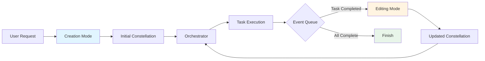
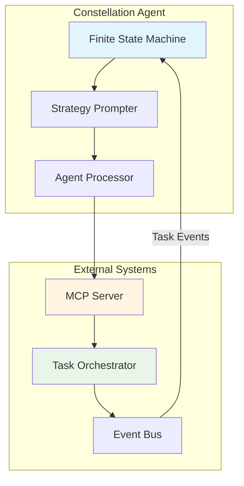
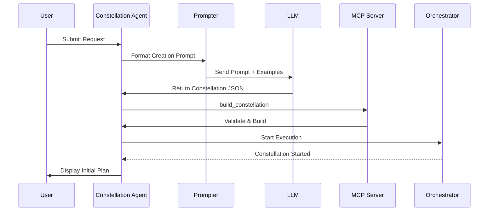
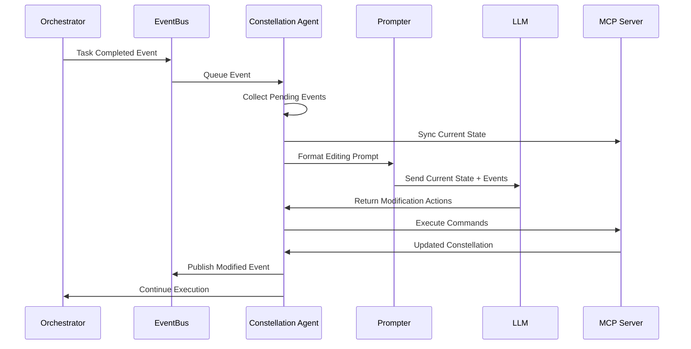
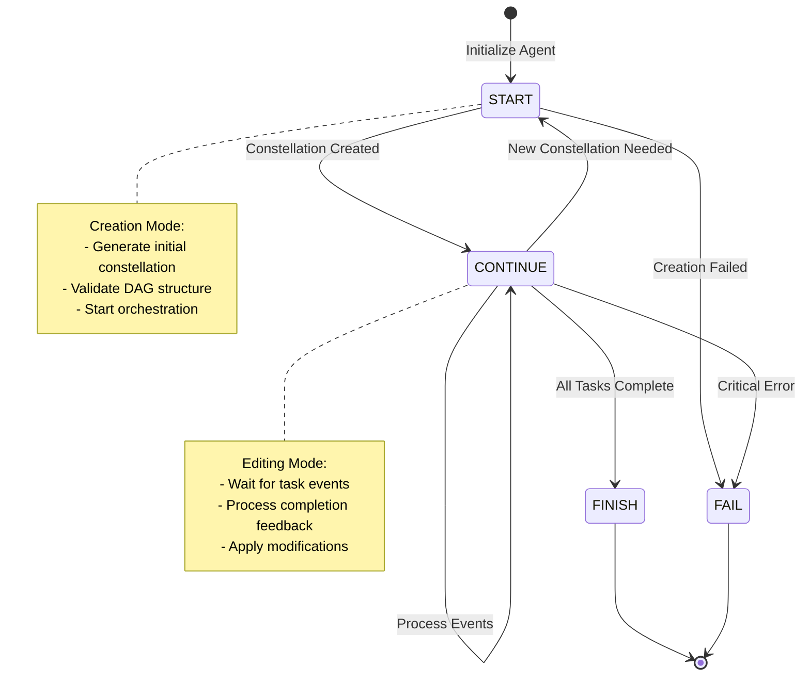
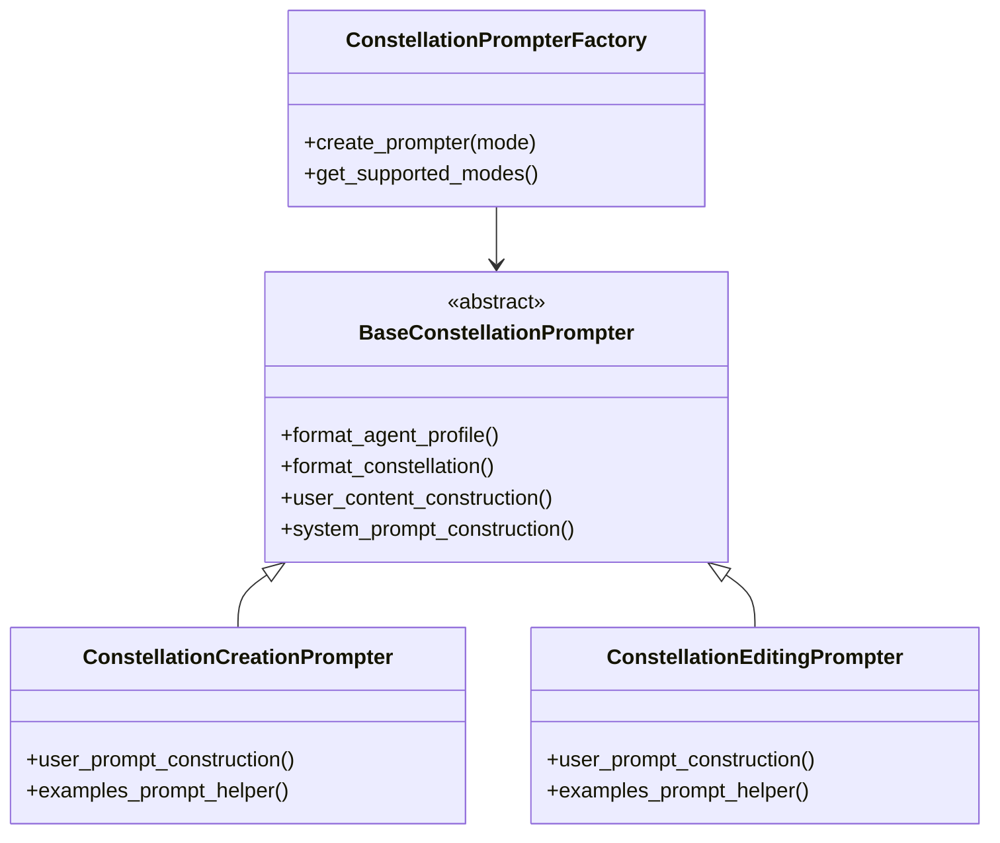

# Constellation Agent — The Centralized Constellation Weaver

!!!quote "The Central Intelligence of UFO³"
    The **Constellation Agent** serves as the central intelligence of UFO³ Galaxy, acting as both a planner and replanner. It interprets user intent, constructs executable Task Constellations, and dynamically steers their evolution across heterogeneous devices. By bridging high-level natural-language goals and concrete multi-agent execution, the Constellation Agent provides unified orchestration through a feedback-driven control loop.

---

## 🌟 Introduction

<figure markdown>
  
  <figcaption><b>Figure:</b> An overview of the Constellation Agent showing the dual-mode control cycle between creation and editing phases.</figcaption>
</figure>

The Constellation Agent extends the abstract [Task Constellation](../constellation/overview.md) model into runtime execution. Residing within the **ConstellationClient**, it transforms user requests into structured DAG workflows and continuously refines them as distributed agents provide feedback.

Unlike traditional static DAG schedulers, the Constellation Agent operates as a **dynamic orchestrator** powered by an LLM-driven ReAct architecture and governed by a finite-state machine (FSM). This design enables it to alternate between two complementary operating modes:

- **Creation Mode**: Synthesizes initial Task Constellations from user instructions
- **Editing Mode**: Incrementally refines constellations based on runtime feedback

This feedback-driven control loop achieves tight coupling between symbolic reasoning and distributed execution, maintaining global consistency while adapting to changing device conditions.

---

## 🎯 Core Responsibilities

The Constellation Agent orchestrates distributed workflows through structured feedback loops, alternating between creation and editing phases with explicit operational boundaries.

### Primary Functions

| Function | Description | Mode |
|----------|-------------|------|
| **Request Interpretation** | Parse user goals and context into actionable requirements | Creation |
| **DAG Synthesis** | Decompose requests into structured Task Constellations with dependencies | Creation |
| **Device Assignment** | Map tasks to appropriate devices based on AgentProfile capabilities | Creation |
| **Runtime Monitoring** | Track task completion events and constellation state | Editing |
| **Dynamic Adaptation** | Add, remove, or modify tasks/dependencies based on feedback | Editing |
| **Consistency Maintenance** | Ensure DAG validity and execution correctness throughout lifecycle | Both |

---

## 🏗️ Architecture

### Dual-Mode Control System

The Constellation Agent implements a **dual-mode control pattern** that separates planning from replanning:



!!!info "Mode Separation Benefits"
    - **Creation Mode**: Focuses on semantic reasoning without runtime constraints
    - **Editing Mode**: Processes feedback incrementally without full re-planning
    - **Clean Boundaries**: Explicit state transitions prevent uncontrolled modifications

### Component Integration



---

## 🔄 Creation Mode

In creation mode, the Constellation Agent receives a user request and generates the initial Task Constellation.

### Inputs

| Input | Type | Description |
|-------|------|-------------|
| **User Request** | `str` | Natural language goal or structured command |
| **AgentProfile Registry** | `Dict[str, AgentProfile]` | Available device agents with capabilities and metadata |
| **Demonstration Examples** | `List[Example]` | In-context learning examples for task decomposition |

### Processing Flow



### Outputs

| Output | Type | Description |
|--------|------|-------------|
| **Task Constellation** | `TaskConstellation` | Structured DAG with tasks and dependencies |
| **Observation** | `str` | Analysis of input context and device profiles |
| **Thought** | `str` | Reasoning trace explaining decomposition logic |
| **State** | `ConstellationAgentStatus` | Next FSM state (typically `CONTINUE`) |
| **Result** | `Any` | Summary for user or error message |

!!!example "Creation Mode Example"
    **User Request:** "Download dataset on laptop, preprocess on server, train model on GPU"
    
    **Generated Constellation:**
    
    - Task 1: `fetch_data` → Device: laptop
    - Task 2: `preprocess` → Device: linux_server (depends on Task 1)
    - Task 3: `train_model` → Device: gpu_server (depends on Task 2)
    
    **Thought:** "Decomposed into 3 sequential tasks based on computational requirements. Laptop handles download, server preprocesses data, GPU server trains model."

---

## ✏️ Editing Mode

During execution, the Constellation Agent enters editing mode to process task completion events and adapt the constellation.

### Inputs

| Input | Type | Description |
|-------|------|-------------|
| **Original Request** | `str` | The initial user request for context |
| **AgentProfile Registry** | `Dict[str, AgentProfile]` | Current device availability |
| **Current Constellation** | `TaskConstellation` | Serialized constellation snapshot |
| **Task Events** | `List[TaskEvent]` | Completion/failure events from orchestrator |
| **Demonstration Examples** | `List[Example]` | In-context learning examples for editing |

### Processing Flow



### Editing Operations

The agent can perform the following modifications through MCP tools:

| Operation | Use Case | Example |
|-----------|----------|---------|
| **Add Task** | Introduce follow-up or diagnostic tasks | Add health check after training fails |
| **Remove Task** | Prune redundant or obsolete tasks | Remove preprocessing if data is pre-processed |
| **Update Task** | Modify description, device, or tips | Switch training to different GPU |
| **Add Dependency** | Establish new task relationships | Make validation depend on training |
| **Remove Dependency** | Decouple independent tasks | Remove unnecessary sequential constraint |
| **Update Dependency** | Change conditional logic | Update success criteria for task trigger |

!!!warning "Modification Constraints"
    Only tasks in `PENDING` or `WAITING_DEPENDENCY` status can be modified. Running or completed tasks are **read-only** to ensure execution consistency.

### Outputs

| Output | Type | Description |
|--------|------|-------------|
| **Updated Constellation** | `TaskConstellation` | Modified DAG with new tasks/dependencies |
| **Thought** | `str` | Reasoning explaining modifications or no-op |
| **State** | `ConstellationAgentStatus` | Next FSM state (`CONTINUE`, `FINISH`, or `FAIL`) |
| **Result** | `Any` | Summary of changes or completion status |

---

## 🔁 Finite-State Machine Lifecycle

<figure markdown>
  
  <figcaption><b>Figure:</b> Lifecycle state transitions of the Constellation Agent FSM.</figcaption>
</figure>

The Constellation Agent's behavior is governed by a **4-state finite-state machine**:

| State | Description | Triggers |
|-------|-------------|----------|
| **START** | Initialize constellation, begin orchestration | Agent instantiation, restart after completion |
| **CONTINUE** | Monitor events, process feedback, update constellation | Task completion/failure events |
| **FINISH** | Successful termination, aggregate results | All tasks completed successfully |
| **FAIL** | Terminal error state, abort execution | Irrecoverable errors, validation failures |

### State Transition Rules



For detailed state machine documentation, see **[State Machine Details](state.md)**.

---

## 🛠️ Constellation MCP Server

The Constellation Agent interacts with a lightweight **Model Context Protocol (MCP) Server** that exposes structured task management primitives. This server acts as the manipulation layer between LLM reasoning and execution state.

### Core Tools

| Tool | Purpose | Inputs | Output |
|------|---------|--------|--------|
| `build_constellation` | Batch-create constellation from config | Configuration dict, clear flag | Built constellation |
| `add_task` | Add atomic task node | Task ID, name, description, device, tips | Updated constellation |
| `remove_task` | Remove task and dependencies | Task ID | Updated constellation |
| `update_task` | Modify task fields | Task ID + updated fields | Updated constellation |
| `add_dependency` | Create dependency edge | From/to task IDs, type, condition | Updated constellation |
| `remove_dependency` | Delete dependency | Dependency ID | Updated constellation |
| `update_dependency` | Update dependency logic | Dependency ID, condition | Updated constellation |

!!!tip "Tool Design Principles"
    - **Idempotent**: Each operation can be safely retried
    - **Atomic**: Single operation per tool call
    - **Consistent**: Returns globally valid constellation snapshots
    - **Auditable**: All operations are logged and traceable

For complete MCP tool documentation, see **[MCP Command Reference](command.md)**.

---

## 📋 Processing Pipeline

The Constellation Agent follows a **4-phase processing pipeline** for both creation and editing modes:

### Phase 1: Context Provision

```python
# Load available MCP tools
await agent.context_provision(context=context)
# Agent queries MCP server for tool list
# Formats tools into LLM-compatible prompt
```

### Phase 2: LLM Interaction

```python
# Construct prompt based on mode
prompt = agent.message_constructor(
    request=user_request,
    device_info=agent_profiles,
    constellation=current_constellation
)

# Get LLM response
response = await llm.query(prompt)
# Returns: ConstellationAgentResponse with thought, status, actions
```

### Phase 3: Action Execution

```python
# Execute MCP commands
for command in response.actions:
    result = await mcp_server.execute(command)
    
# Validate constellation
is_valid, errors = constellation.validate_dag()
```

### Phase 4: Memory Update

```python
# Update global context
context.set(ContextNames.CONSTELLATION, updated_constellation)
context.set(ContextNames.ROUND_RESULT, results)

# Log to memory
memory.add_round_log(
    step=step,
    weaving_mode=mode,
    request=request,
    constellation=constellation,
    response=response
)
```

---

## 🎭 Strategy Pattern for Prompters

The Constellation Agent uses the **Strategy Pattern** to separate prompt construction logic for different weaving modes.

### Prompter Hierarchy



### Factory Pattern Benefits

| Benefit | Description |
|---------|-------------|
| **Mode Isolation** | Creation and editing prompts remain independent |
| **Extensibility** | New modes can be added without modifying existing code |
| **Type Safety** | Compile-time checking for prompter selection |
| **Testability** | Each prompter can be unit tested independently |

For complete strategy pattern documentation, see **[Strategy Pattern Details](strategy.md)**.

---

## 💡 Key Design Benefits

### 1. Unified Reasoning and Control

High-level task synthesis and low-level execution coordination are decoupled yet tightly synchronized through the Task Constellation abstraction. The agent focuses on semantic reasoning while the orchestrator handles distributed execution.

### 2. Dynamic Adaptability

The editable constellation enables:
- **Failure Recovery**: Add diagnostic tasks after failures
- **Resource Reallocation**: Switch tasks to available devices
- **Opportunistic Execution**: Insert new tasks as conditions permit

### 3. End-to-End Observability

Complete lineage tracking of:
- **State Transitions**: FSM state changes logged with timestamps
- **Modifications**: All edits tracked with before/after snapshots
- **Events**: Task completion events queued and processed
- **Reasoning Traces**: LLM thought processes captured in memory

### 4. Safe Modification Guarantees

The FSM + MCP Server architecture ensures:
- **Acyclicity**: DAG validation prevents circular dependencies
- **Consistency**: Only modifiable tasks can be edited
- **Atomicity**: Each MCP operation is atomic and idempotent
- **Auditability**: Full modification history maintained

---

## 🔍 Example Workflow

### User Request
```
"Download MNIST dataset on laptop, train CNN on GPU server, 
evaluate on test server, deploy to production if accuracy > 95%"
```

### Creation Mode Output

```json
{
  "thought": "Decomposed into 4 tasks: (1) download on laptop, (2) train on GPU, (3) evaluate on test server, (4) conditional deploy based on accuracy",
  "status": "CONTINUE",
  "constellation": {
    "tasks": [
      {"task_id": "task_001", "name": "download_mnist", "device": "laptop"},
      {"task_id": "task_002", "name": "train_cnn", "device": "gpu_server"},
      {"task_id": "task_003", "name": "evaluate", "device": "test_server"},
      {"task_id": "task_004", "name": "deploy", "device": "prod_server"}
    ],
    "dependencies": [
      {"from": "task_001", "to": "task_002", "type": "SUCCESS_ONLY"},
      {"from": "task_002", "to": "task_003", "type": "SUCCESS_ONLY"},
      {"from": "task_003", "to": "task_004", "type": "CONDITIONAL", 
       "condition": "accuracy > 0.95"}
    ]
  }
}
```

### Editing Mode Event

```
Task task_003 (evaluate) completed with result: {"accuracy": 0.92}
```

### Editing Mode Output

```json
{
  "thought": "Evaluation accuracy (92%) did not meet deployment threshold (95%). Adding retraining task with adjusted hyperparameters. Removing original deployment task.",
  "status": "CONTINUE",
  "actions": [
    {"tool": "add_task", "parameters": {
      "task_id": "task_005", 
      "name": "retrain_with_tuning",
      "device": "gpu_server",
      "description": "Retrain with learning rate decay and data augmentation"
    }},
    {"tool": "add_dependency", "parameters": {
      "from": "task_003", "to": "task_005", "type": "SUCCESS_ONLY"
    }},
    {"tool": "remove_task", "parameters": {"task_id": "task_004"}}
  ]
}
```

---

## 📊 Performance Characteristics

### Creation Complexity

- **Time**: $O(n \cdot m)$ where $n$ is task count, $m$ is LLM inference time
- **Space**: $O(n + e)$ for $n$ tasks and $e$ edges
- **Validation**: $O(n + e)$ for DAG cycle detection (DFS)

### Editing Complexity

- **Event Processing**: $O(k)$ for $k$ queued events (batched)
- **Modification**: $O(1)$ per MCP operation (constant time)
- **Re-validation**: $O(n + e)$ for modified constellation

### Scalability

| Metric | Typical | Maximum Tested |
|--------|---------|----------------|
| Tasks per Constellation | 5-20 | 100+ |
| Dependencies per Constellation | 4-30 | 200+ |
| Editing Events per Session | 1-10 | 50+ |
| LLM Response Time | 2-5s | 15s |

---

## 🔗 Related Components

- **[Task Constellation](../constellation/overview.md)** — Abstract DAG model
- **[TaskStar](../constellation/task_star.md)** — Atomic execution units
- **[TaskStarLine](../constellation/task_star_line.md)** — Dependency relationships
- **[Constellation Orchestrator](../constellation_orchestrator/overview.md)** — Distributed executor
- **[State Machine](state.md)** — FSM lifecycle details
- **[Strategy Pattern](strategy.md)** — Prompter architecture
- **[MCP Commands](command.md)** — Tool specifications

---

## 🎯 Summary

The Constellation Agent serves as the **"central weaver"** of distributed intelligence in UFO³ Galaxy. Through its dual-mode control loop, finite-state machine governance, and structured MCP interface, it transforms abstract user goals into live, evolving constellations—maintaining both rigor and adaptability across the complete lifecycle of multi-device orchestration.

**Key Capabilities:**

✅ **Semantic Decomposition**: Natural language → structured DAG  
✅ **Dynamic Adaptation**: Runtime graph evolution based on feedback  
✅ **Formal Guarantees**: DAG validity + safe concurrent modification  
✅ **Complete Observability**: Full lineage tracking and reasoning traces  
✅ **Modular Design**: Clean separation between reasoning and execution  

---

<div align="center">
  <p><em>Constellation Agent — Weaving distributed workflows across the digital galaxy</em></p>
</div>
