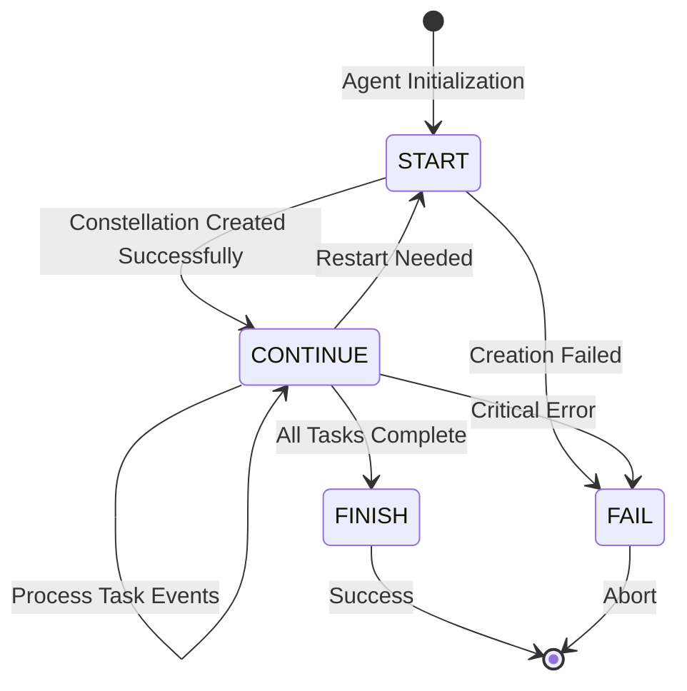
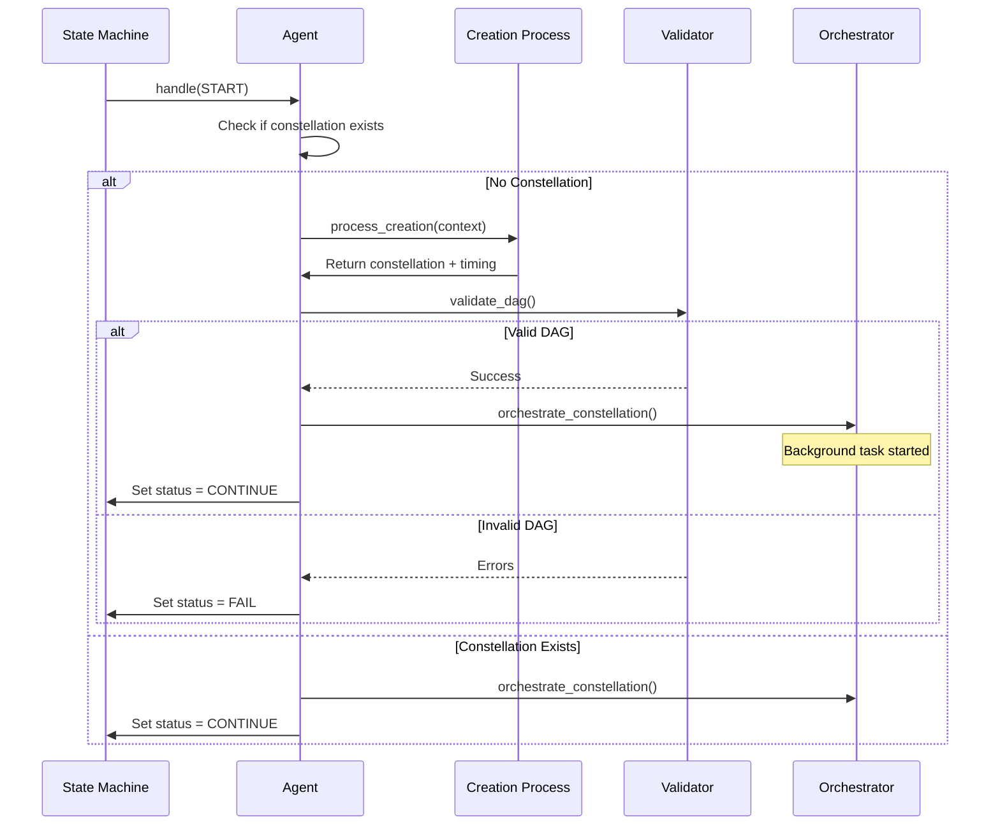
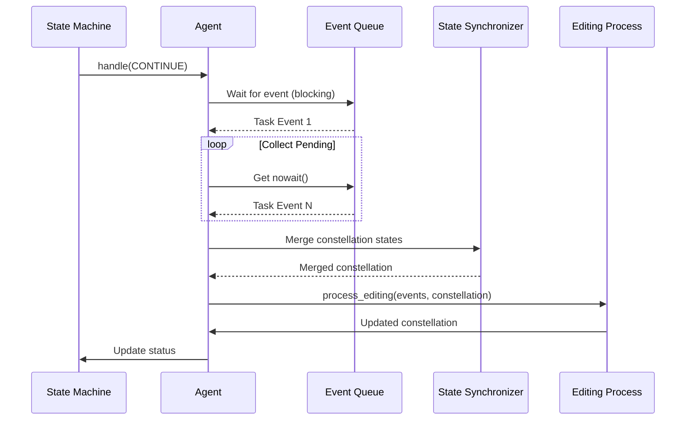
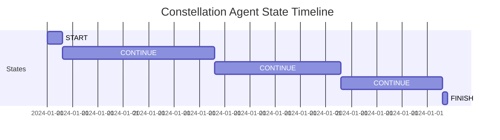

# Constellation Agent State Machine

The Constellation Agent's finite-state machine provides deterministic lifecycle management while enabling dynamic constellation evolution. This FSM governs how the agent transitions between creation, monitoring, success, and failure states—ensuring predictable behavior in complex distributed workflows.

For an overview of the Constellation Agent architecture, see [Overview](overview.md).

## 📐 State Machine Overview


**Figure:** Lifecycle state transitions of the Constellation Agent showing the 4-state FSM.

The Constellation Agent implements a **4-state finite-state machine (FSM)** that provides clear, enforceable structure for task lifecycle management. This design separates LLM reasoning from deterministic control logic, improving safety and debuggability.

### State Space



## 🎯 State Definitions

### State Enumeration

```python
class ConstellationAgentStatus(Enum):
    """Constellation Agent states"""
    START = "START"
    CONTINUE = "CONTINUE"
    FINISH = "FINISH"
    FAIL = "FAIL"
```

| State | Type | Description | Entry Conditions |
|-------|------|-------------|------------------|
| **START** | Initial | Initialize and create constellation | Agent instantiation, restart after completion |
| **CONTINUE** | Steady-State | Monitor events and process feedback | Constellation created successfully |
| **FINISH** | Terminal | Successful termination | All tasks completed, no edits needed |
| **FAIL** | Terminal | Error termination | Irrecoverable errors, validation failures |

## 🚀 START State

### Purpose

The START state is the **initialization and creation phase** where the agent:
1. Generates the initial Task Constellation from user request
2. Validates DAG structure for correctness
3. Launches background orchestration
4. Transitions to monitoring mode

### State Handler Implementation

```python
@ConstellationAgentStateManager.register
class StartConstellationAgentState(ConstellationAgentState):
    """Start state - create and execute constellation"""
    
    async def handle(self, agent: "ConstellationAgent", context: Context) -> None:
        # Skip if already in terminal state
        if agent.status in [
            ConstellationAgentStatus.FINISH.value,
            ConstellationAgentStatus.FAIL.value,
        ]:
            return
        
        # Initialize timing_info
        timing_info = {}
        
        # Create constellation if not exists
        if not agent.current_constellation:
            context.set(ContextNames.WEAVING_MODE, WeavingMode.CREATION)
            
            agent._current_constellation, timing_info = (
                await agent.process_creation(context)
            )
        
        # Start orchestration in background
        if agent.current_constellation:
            asyncio.create_task(
                agent.orchestrator.orchestrate_constellation(
                    agent.current_constellation, 
                    metadata=timing_info
                )
            )
            agent.status = ConstellationAgentStatus.CONTINUE.value
        elif agent.status == ConstellationAgentStatus.CONTINUE.value:
            agent.status = ConstellationAgentStatus.FAIL.value
```

### Execution Flow



### Behaviors

| Scenario | Action | Next State |
|----------|--------|------------|
| **First Execution** | Generate constellation via LLM | `CONTINUE` (success) / `FAIL` (error) |
| **Restart Trigger** | Use existing constellation | `CONTINUE` |
| **Creation Failure** | Log error, no constellation created | `FAIL` |
| **Validation Failure** | DAG contains cycles or invalid structure | `FAIL` |
| **Already Terminal** | No-op, return immediately | Same state |

> **Tip:** Orchestration is launched as a **non-blocking** background task using `asyncio.create_task()`. This allows the agent to transition to CONTINUE state immediately and begin monitoring for events.

### Error Handling

```python
try:
    # Creation logic
    agent._current_constellation, timing_info = (
        await agent.process_creation(context)
    )
except AttributeError as e:
    agent.logger.error(f"Attribute error: {traceback.format_exc()}")
    agent.status = ConstellationAgentStatus.FAIL.value
except KeyError as e:
    agent.logger.error(f"Missing key: {traceback.format_exc()}")
    agent.status = ConstellationAgentStatus.FAIL.value
except Exception as e:
    agent.logger.error(f"Unexpected error: {traceback.format_exc()}")
    agent.status = ConstellationAgentStatus.FAIL.value
```

## 🔄 CONTINUE State

### Purpose

The CONTINUE state is the **steady-state monitoring and editing phase** where the agent:
1. Waits for task completion/failure events from orchestrator
2. Collects batched events from the queue
3. Merges constellation state with latest modifications
4. Processes events and applies edits
5. Loops until all tasks complete or critical error occurs

### State Handler Implementation

```python
@ConstellationAgentStateManager.register
class ContinueConstellationAgentState(ConstellationAgentState):
    """Continue state - wait for task completion events"""
    
    async def handle(self, agent: "ConstellationAgent", context=None) -> None:
        # Set editing mode
        context.set(ContextNames.WEAVING_MODE, WeavingMode.EDITING)
        
        # Collect task completion events (batched)
        completed_task_events = []
        
        # Wait for at least one event (blocking)
        first_event = await agent.task_completion_queue.get()
        completed_task_events.append(first_event)
        
        # Collect other pending events (non-blocking)
        while not agent.task_completion_queue.empty():
            try:
                event = agent.task_completion_queue.get_nowait()
                completed_task_events.append(event)
            except asyncio.QueueEmpty:
                break
        
        # Get latest constellation and merge states
        latest_constellation = completed_task_events[-1].data.get("constellation")
        merged_constellation = await self._get_merged_constellation(
            agent, latest_constellation
        )
        
        # Process editing with all collected events
        await agent.process_editing(
            context=context,
            task_ids=[e.task_id for e in completed_task_events],
            before_constellation=merged_constellation
        )
```

### Execution Flow



### Event Batching

**Why Batch Events?**

If multiple tasks complete simultaneously (e.g., parallel execution), the agent collects **all pending events** before processing. This enables:

- **Single LLM call** instead of multiple sequential calls
- **Atomic modifications** reflecting multiple completions
- **Reduced latency** and lower API costs

```python
# Example: 3 tasks complete in quick succession
# Without batching: 3 LLM calls, 3 editing sessions
# With batching: 1 LLM call, 1 editing session processing all 3 events
```

### State Merging

The **state synchronizer** merges the orchestrator's constellation with agent modifications:

```python
async def _get_merged_constellation(
    self, agent: "ConstellationAgent", orchestrator_constellation
):
    """
    Get real-time merged constellation from synchronizer.
    
    Ensures agent processes with most up-to-date state, including
    structural modifications from previous editing sessions.
    """
    synchronizer = agent.orchestrator._modification_synchronizer
    
    if not synchronizer:
        return orchestrator_constellation
    
    merged_constellation = synchronizer.merge_and_sync_constellation_states(
        orchestrator_constellation=orchestrator_constellation
    )
    
    agent.logger.info(
        f"Merged constellation for editing. "
        f"Tasks before: {len(orchestrator_constellation.tasks)}, "
        f"Tasks after merge: {len(merged_constellation.tasks)}"
    )
    
    return merged_constellation
```

> **Warning:** State synchronization is critical. Consider this scenario:
> 
> 1. Task A completes → Agent edits constellation (adds Task C)
> 2. Task B completes **while editing is happening**
> 3. Without merging: Task B editing sees **old state** (no Task C)
> 4. With merging: Task B editing sees **merged state** (includes Task C)

### Behaviors

| Scenario | Action | Next State |
|----------|--------|------------|
| **Task Completed** | Process event, apply edits | `CONTINUE` |
| **Multiple Tasks Completed** | Batch process, single edit session | `CONTINUE` |
| **All Tasks Done** | Agent decides to finish | `FINISH` |
| **Critical Error** | Exception during processing | `FAIL` |
| **Restart Needed** | New constellation required | `START` |

### Transition Logic

```python
# Agent's editing process sets status based on analysis:

if constellation.is_complete() and no_more_edits_needed:
    agent.status = ConstellationAgentStatus.FINISH.value
elif critical_error_occurred:
    agent.status = ConstellationAgentStatus.FAIL.value
elif new_constellation_needed:
    agent.status = ConstellationAgentStatus.START.value
else:
    agent.status = ConstellationAgentStatus.CONTINUE.value  # Keep monitoring
```

## ✅ FINISH State

### Purpose

The FINISH state represents **successful termination** when:
- All tasks in the constellation have completed successfully
- No further edits are necessary
- User goal has been achieved

### State Handler Implementation

```python
@ConstellationAgentStateManager.register
class FinishConstellationAgentState(ConstellationAgentState):
    """Finish state - task completed successfully"""
    
    async def handle(self, agent: "ConstellationAgent", context=None) -> None:
        agent.logger.info("Galaxy task completed successfully")
        agent._status = ConstellationAgentStatus.FINISH.value
    
    def next_state(self, agent: "ConstellationAgent") -> AgentState:
        return self  # Terminal state - no transitions
    
    def is_round_end(self) -> bool:
        return True
    
    def is_subtask_end(self) -> bool:
        return True
```

### Characteristics

| Property | Value | Description |
|----------|-------|-------------|
| **Terminal** | Yes | No outgoing transitions |
| **Round End** | Yes | Marks execution round complete |
| **Subtask End** | Yes | Marks all subtasks complete |

### Entry Conditions

```python
# LLM decides to finish based on constellation state
{
    "thought": "All tasks completed successfully. No further actions needed.",
    "status": "FINISH",
    "result": {
        "summary": "Dataset downloaded, model trained, deployed to production",
        "total_tasks": 5,
        "completed": 5,
        "failed": 0
    }
}
```

**Clean Termination:**

The FINISH state ensures graceful shutdown with:

- All resources released
- Final results aggregated
- Memory logs persisted
- Success metrics recorded

## ❌ FAIL State

### Purpose

The FAIL state represents **error termination** when:
- Irrecoverable errors occur during creation or editing
- DAG validation fails
- Critical system failures prevent continuation

### State Handler Implementation

```python
@ConstellationAgentStateManager.register
class FailConstellationAgentState(ConstellationAgentState):
    """Fail state - task failed"""
    
    async def handle(self, agent: "ConstellationAgent", context=None) -> None:
        agent.logger.error("Galaxy task failed")
        agent._status = ConstellationAgentStatus.FAIL.value
    
    def next_state(self, agent: "ConstellationAgent") -> AgentState:
        return self  # Terminal state - no transitions
    
    def is_round_end(self) -> bool:
        return True
    
    def is_subtask_end(self) -> bool:
        return True
```

### Failure Scenarios

| Scenario | Trigger | Recovery |
|----------|---------|----------|
| **Creation Failure** | LLM cannot decompose request | User reformulates request |
| **Validation Failure** | Generated DAG has cycles | Agent retries or manual fix |
| **Critical Exception** | Unexpected system error | Check logs, restart agent |
| **Timeout** | Processing exceeds limits | Increase timeout or simplify task |

### Error Propagation

```python
# Example error chain:
try:
    constellation = await agent.process_creation(context)
except Exception as e:
    agent.logger.error(f"Creation failed: {e}")
    agent.status = ConstellationAgentStatus.FAIL.value
    # State machine handles transition to FAIL state
```

> **Important:** Both FINISH and FAIL states are **terminal** — they have no outgoing transitions. This ensures the agent cannot accidentally resume execution after completion or failure.

## 🔀 State Transitions

### Transition Matrix

| From ↓ / To → | START | CONTINUE | FINISH | FAIL |
|---------------|-------|----------|--------|------|
| **START** | ❌ | ✅ (success) | ❌ | ✅ (error) |
| **CONTINUE** | ✅ (restart) | ✅ (loop) | ✅ (done) | ✅ (error) |
| **FINISH** | ❌ | ❌ | ✅ (stay) | ❌ |
| **FAIL** | ❌ | ❌ | ❌ | ✅ (stay) |

### Transition Rules

```python
class ConstellationAgentState(AgentState):
    """Base state for Constellation Agent"""
    
    def next_state(self, agent: "ConstellationAgent") -> AgentState:
        """Determine next state based on agent status"""
        status = agent.status
        state = ConstellationAgentStateManager().get_state(status)
        return state
```

### State Manager

```python
class ConstellationAgentStateManager(AgentStateManager):
    """State manager for Constellation Agent"""
    
    _state_mapping: Dict[str, Type[AgentState]] = {}
    
    @property
    def none_state(self) -> AgentState:
        return StartConstellationAgentState()
```

The state manager uses the **@register decorator** pattern to automatically register state classes. For more details on the overall agent architecture, see [Constellation Agent Overview](overview.md).

```python
@ConstellationAgentStateManager.register
class StartConstellationAgentState(ConstellationAgentState):
    @classmethod
    def name(cls) -> str:
        return ConstellationAgentStatus.START.value
```

## 📊 State Metrics

### Execution Timeline



### Typical Duration

| State | Typical Duration | Factors |
|-------|------------------|---------|
| **START** | 2-5 seconds | LLM response time, validation complexity |
| **CONTINUE** | Variable (10s - 10min) | Task execution time, parallelism |
| **FINISH** | < 1 second | Logging and cleanup |
| **FAIL** | < 1 second | Error logging |

## 🛡️ Error Handling

### Exception Hierarchy

```python
# START State Error Handling
try:
    constellation, timing = await agent.process_creation(context)
except AttributeError as e:
    # Missing attribute (e.g., context field)
    agent.logger.error(f"Attribute error: {e}")
    agent.status = ConstellationAgentStatus.FAIL.value
except KeyError as e:
    # Missing key in dictionary
    agent.logger.error(f"Missing key: {e}")
    agent.status = ConstellationAgentStatus.FAIL.value
except Exception as e:
    # Catch-all for unexpected errors
    agent.logger.error(f"Unexpected error: {e}")
    agent.status = ConstellationAgentStatus.FAIL.value
```

### Recovery Strategies

| Error Type | State | Recovery Action |
|------------|-------|-----------------|
| **Temporary Network Failure** | CONTINUE | Retry with backoff |
| **Invalid LLM Response** | CONTINUE | Re-prompt with examples |
| **DAG Cycle Detected** | START | Fail fast, require user intervention |
| **Task Execution Timeout** | CONTINUE | Mark task failed, continue constellation |
| **Critical System Error** | Any | Transition to FAIL immediately |

## 🔍 State Inspection

### Agent State Query

```python
# Check current state
current_state = agent.current_state
print(f"State: {current_state.name()}")

# Check if terminal
if current_state.is_round_end():
    print("Agent execution completed")

# Get status
status = agent.status
print(f"Status: {status}")  # "START", "CONTINUE", "FINISH", or "FAIL"
```

### State History

The agent maintains state transition history in memory logs:

```python
{
    "step": 1,
    "state": "START",
    "timestamp": "2024-01-01T10:00:00",
    "constellation_id": "constellation_abc123"
}
```

## 💡 Best Practices

**State Machine Design:**

1. **Keep states focused**: Each state should have a single, clear responsibility
2. **Minimize transitions**: Fewer transitions = simpler debugging
3. **Log all transitions**: Record state changes with context
4. **Handle errors explicitly**: Don't rely on implicit error propagation
5. **Use terminal states**: Ensure execution cannot resume accidentally

**Common Pitfalls to Avoid:**

- **Infinite loops in CONTINUE**: Always check termination conditions
- **Missing error handling**: Unhandled exceptions → unpredictable state
- **Blocking operations**: Use async/await to prevent deadlocks
- **State pollution**: Don't modify agent state outside state handlers

**Example: State Transition Logging**

```python
agent.logger.info(
    f"State transition: {old_state.name()} → {new_state.name()}"
)
```

## 🔗 Related Documentation

- **[Overview](overview.md)** — Constellation Agent architecture
- **[Prompter Details](strategy.md)** — Prompter implementation
- **[Command Reference](command.md)** — MCP tool specifications
- **[Task Constellation](../constellation/overview.md)** — DAG model
- **[Constellation Orchestrator](../constellation_orchestrator/overview.md)** — Task execution engine

## 📋 State Interface Reference

### AgentState Base Class

```python
class AgentState(ABC):
    """Base interface for agent states"""
    
    @abstractmethod
    async def handle(self, agent, context) -> None:
        """Execute state-specific logic"""
        pass
    
    def next_state(self, agent) -> AgentState:
        """Determine next state based on agent status"""
        pass
    
    def next_agent(self, agent):
        """Get next agent (for multi-agent systems)"""
        return agent
    
    @abstractmethod
    def is_round_end(self) -> bool:
        """Check if this state marks round end"""
        pass
    
    @abstractmethod
    def is_subtask_end(self) -> bool:
        """Check if this state marks subtask end"""
        pass
    
    @classmethod
    @abstractmethod
    def name(cls) -> str:
        """State identifier"""
        pass
```
