# Batched Constellation Editing

## Overview

Frequent LLM-driven edits can introduce significant overhead if processed individually. Each modification requires:

- LLM invocation (100-1000ms latency)
- Lock acquisition and release
- Validation of invariants I1-I3
- Constellation state synchronization
- Event publishing and notification

To balance **responsiveness** with **efficiency**, the orchestrator supports **batched constellation editing**: during a reasoning round, multiple task completion events are aggregated and their resulting modifications applied atomically in a single cycle.

For more on the synchronization mechanism, see [Safe Assignment Locking](safe_assignment_locking.md).

## The Batching Problem

### Without Batching

Consider three tasks completing nearly simultaneously:

```mermaid
gantt
    title Sequential Editing (No Batching)
    dateFormat X
    axisFormat %L
    
    section Events
    Task A completes    :e1, 0, 5
    Task B completes    :e2, 10, 15
    Task C completes    :e3, 20, 25
    
    section Editing
    Lock + Edit A       :l1, 5, 155
    Lock + Edit B       :l2, 155, 305
    Lock + Edit C       :l3, 305, 455
    
    section Overhead
    Total overhead      :o1, 5, 455
```



**Overhead**: 3 × 150ms = **450ms total**

- 3 lock acquisitions
- 3 LLM invocations
- 3 validations
- 3 synchronizations

### With Batching

Same scenario with batched editing:

```mermaid
gantt
    title Batched Editing
    dateFormat X
    axisFormat %L
    
    section Events
    Task A completes    :e1, 0, 5
    Task B completes    :e2, 10, 15
    Task C completes    :e3, 20, 25
    
    section Editing
    Lock + Edit A,B,C   :l1, 25, 175
    
    section Overhead
    Total overhead      :o1, 25, 175
```



**Overhead**: 1 × 150ms = **150ms total**

- 1 lock acquisition
- 1 LLM invocation (potentially processing multiple tasks)
- 1 validation
- 1 synchronization

**Improvement**: **3× reduction** in overhead!

Batching reduces orchestration overhead from O(N) to O(1) per reasoning round, where N = number of completed tasks.

## Batching Mechanism

### Event Queuing

When tasks complete, their IDs are queued for batch processing:

```python
# In safe assignment lock algorithm
while system is running:
    foreach event e ∈ E do
        if e is TASK_COMPLETED or TASK_FAILED then
            async enqueue(e)  # ← Queue instead of immediate processing
        end
    end
    
    acquire(assign_lock)
    
    # Process ALL queued events in one batch
    while queue not empty do
        e ← dequeue()
        Δ ← invoke(ConstellationAgent, edit(C, e))
        C ← apply(C, Δ)
    end
    
    validate(C)  # ← Single validation for entire batch
    publish(CONSTELLATION_MODIFIED, all_task_ids)
    C ← synchronize(C, T_C)
    
    release(assign_lock)
```

### Implementation in Synchronizer

The `ConstellationModificationSynchronizer` batches pending modifications:

```python
async def wait_for_pending_modifications(
    self, timeout: Optional[float] = None
) -> bool:
    """Wait for all pending modifications to complete."""
    
    if not self._pending_modifications:
        return True
    
    try:
        while self._pending_modifications:
            # Get current pending tasks (snapshot)
            pending_tasks = list(self._pending_modifications.keys())
            pending_futures = list(self._pending_modifications.values())
            
            self.logger.info(
                f"⏳ Waiting for {len(pending_tasks)} pending modification(s): "
                f"{pending_tasks}"
            )
            
            # Wait for ALL current pending modifications (batching)
            await asyncio.wait_for(
                asyncio.gather(*pending_futures, return_exceptions=True),
                timeout=remaining_timeout,
            )
            
            # Check if new modifications were added during wait
            if not self._pending_modifications:
                break
            
            # Small delay to allow new registrations to settle
            await asyncio.sleep(0.01)
        
        self.logger.info("✅ All pending modifications completed")
        return True
        
    except asyncio.TimeoutError:
        ...
```

**Key aspects:**

1. **Snapshot pending modifications** - Capture current batch
2. **Wait for all in batch** - Use `asyncio.gather()` for parallel completion
3. **Check for new arrivals** - Handle dynamic additions during wait
4. **Iterate until empty** - Process all batches

### Agent-Side Batching

The Constellation Agent receives multiple task IDs and processes them together:

```python
async def process_editing(
    self,
    context: Context = None,
    task_ids: Optional[List[str]] = None,  # ← Multiple task IDs
    before_constellation: Optional[TaskConstellation] = None,
) -> TaskConstellation:
    """Process task completion events and update constellation."""
    
    task_ids = task_ids or []
    
    # Agent can see multiple completed tasks at once
    self.logger.debug(
        f"Tasks {task_ids} marked as completed, processing modifications..."
    )
    
    # Potentially make decisions based on multiple task outcomes
    # e.g., "Task A and B both succeeded, skip Task C"
    after_constellation = await self._create_and_process(context)
    
    # Publish single CONSTELLATION_MODIFIED event for entire batch
    await self._publish_constellation_modified_event(
        before_constellation,
        after_constellation,
        task_ids,  # ← All modified tasks
        self._create_timing_info(start_time, end_time, duration),
    )
    
    return after_constellation
```

## Batching Timeline Example

Here's a detailed timeline showing how batching works:

```
t=100ms: Task A completes
    → Synchronizer registers pending modification for A
    → Task A's event added to queue

t=150ms: Task B completes (during A's queueing)
    → Synchronizer registers pending modification for B
    → Task B's event added to queue

t=200ms: Task C completes
    → Synchronizer registers pending modification for C
    → Task C's event added to queue

t=205ms: Orchestrator reaches synchronization point
    → Calls wait_for_pending_modifications()
    → Sees pending: [A, B, C]
    → Waits for all three futures

t=210ms: Agent starts processing (lock acquired)
    → Receives task_ids = ['A', 'B', 'C']
    → Makes unified editing decision

t=350ms: Agent completes editing
    → Publishes CONSTELLATION_MODIFIED with on_task_id = ['A', 'B', 'C']

t=355ms: Synchronizer receives event
    → Completes futures for A, B, C
    → wait_for_pending_modifications() returns

t=360ms: Orchestrator merges states and continues
    → Single validation
    → Single synchronization
    → Resume scheduling
```

**Total overhead**: 360ms - 100ms = **260ms** for 3 tasks

Compare to sequential: 3 × 150ms = **450ms** (ignoring event queueing)

## Efficiency Analysis

### Overhead Breakdown

Per-task overhead without batching:

| Operation | Cost (ms) | Frequency |
|-----------|-----------|-----------|
| Lock acquisition | 1-2 | Per task |
| LLM invocation | 100-1000 | Per task |
| Validation (I1-I3) | 5-10 | Per task |
| State synchronization | 10-20 | Per task |
| Event publishing | 1-2 | Per task |
| **Total** | **117-1034** | **Per task** |

Per-batch overhead with batching:

| Operation | Cost (ms) | Frequency |
|-----------|-----------|-----------|
| Lock acquisition | 1-2 | Per batch |
| LLM invocation | 100-1000 | Per batch |
| Validation (I1-I3) | 5-10 | Per batch |
| State synchronization | 10-20 | Per batch |
| Event publishing | 1-2 | Per batch |
| **Total** | **117-1034** | **Per batch** |

**Savings with batch size N**: (N - 1) × overhead

!!!example "Concrete Example"
    With N=5 tasks completing simultaneously and 200ms average overhead:
    
    - **Without batching**: 5 × 200ms = 1000ms
    - **With batching**: 1 × 200ms = 200ms
    - **Savings**: 800ms (80% reduction)

### Throughput Improvement

Batching improves task throughput:

$$\text{Throughput}_{\text{batched}} = \frac{N \times \text{Throughput}_{\text{unbatched}}}{1 + (N-1) \times \frac{\text{overhead}}{\text{task\_duration}}}$$

For tasks averaging 5 seconds with 200ms overhead:

- N=1: 0.20 tasks/sec
- N=3: 0.55 tasks/sec (**2.75× improvement**)
- N=5: 0.83 tasks/sec (**4.15× improvement**)
- N=10: 1.35 tasks/sec (**6.75× improvement**)

### Latency Trade-Off

Batching may slightly increase latency for individual tasks:

- **Best case**: Task completes, is first in batch → minimal additional latency
- **Average case**: Task waits for 1-2 other tasks to complete → ~50-200ms additional latency
- **Worst case**: Task waits for full batch to accumulate → ~500ms additional latency

**Acceptable trade-off** for significantly improved overall throughput.

## Dynamic Batch Size

The orchestrator uses **dynamic batching** - batch size adapts to task completion patterns:

### Natural Batching

Tasks completing within a short window are naturally batched:

```python
# In wait_for_pending_modifications()
while self._pending_modifications:
    # Snapshot current pending tasks
    pending_tasks = list(self._pending_modifications.keys())
    
    # Wait for all of them
    await asyncio.gather(*pending_futures)
    
    # Check for new arrivals during processing
    if not self._pending_modifications:
        break
    
    # If new tasks arrived, include them in next iteration
```

**Batch size**: Determined by task completion timing, not fixed parameter

### Adaptive Grouping

The synchronizer automatically groups tasks:

- **Slow periods**: Small batches (1-2 tasks)
- **Burst periods**: Large batches (5-10+ tasks)
- **Mixed patterns**: Variable batch sizes

This provides **optimal efficiency** without manual tuning.

## Atomicity of Batched Edits

### Single Edit Cycle

All modifications in a batch are applied in a single atomic edit cycle:

```python
acquire(assign_lock)

# Apply all modifications together
foreach event in batch:
    Δ ← invoke(ConstellationAgent, edit(C, event))
    C ← apply(C, Δ)
end

validate(C)  # ← Validates combined result
publish(CONSTELLATION_MODIFIED, batch_task_ids)

release(assign_lock)
```

**Atomicity guarantee**: Either all modifications in the batch are applied, or none are.

### Confluence Property

The paper proves an **Edit-Sync Confluence Lemma**:

**Lemma**: Folding runtime events commutes with lock-bounded edits within the same window.

**Formally**: Given events $e_1, e_2, \ldots, e_n$ arriving within a lock window:

$$\text{apply}(C, \Delta_{e_1} \circ \Delta_{e_2} \circ \cdots \circ \Delta_{e_n}) \equiv \text{apply}(\cdots\text{apply}(\text{apply}(C, \Delta_{e_1}), \Delta_{e_2})\cdots, \Delta_{e_n})$$

Batched application produces the same result as sequential application.

**Proof sketch**: 

1. Each $\Delta_i$ is a pure function of $C$ and $e_i$
2. Lock ensures no intermediate states are visible
3. Validation enforces invariants on final state
4. Synchronization merges all runtime progress atomically

[See Appendix A.4 in paper for complete proof]

Batching is a pure **performance optimization** - it doesn't change the semantics of constellation evolution.

## Implementation Patterns

### Enabling Batching

Batching is enabled automatically when using the synchronizer:

```python
from galaxy.session.observers.constellation_sync_observer import (
    ConstellationModificationSynchronizer
)

# Create and attach synchronizer
synchronizer = ConstellationModificationSynchronizer(orchestrator)
orchestrator.set_modification_synchronizer(synchronizer)

# Subscribe to events
event_bus.subscribe(synchronizer)

# Batching happens automatically
results = await orchestrator.orchestrate_constellation(constellation)
```

### Monitoring Batch Sizes

Track batching statistics:

```python
# After orchestration
stats = synchronizer.get_statistics()

print(f"Total modifications: {stats['total_modifications']}")
print(f"Completed: {stats['completed_modifications']}")

# Infer average batch size
avg_batch_size = stats['total_modifications'] / number_of_edit_cycles
print(f"Average batch size: {avg_batch_size:.2f}")
```

### Tuning Batch Timeout

Adjust timeout for slower LLM responses:

```python
# Increase timeout for complex reasoning
synchronizer.set_modification_timeout(1800.0)  # 30 minutes

# Or decrease for simple tasks
synchronizer.set_modification_timeout(120.0)  # 2 minutes
```

## Performance Best Practices

### 1. Group Related Tasks

Design constellations with tasks that complete around the same time:

```python
# Good: Tasks with similar durations
Task A: 5 seconds
Task B: 6 seconds  # ← Likely completes near Task A
Task C: 5 seconds  # ← Likely completes near Task A

# Bad: Widely varying durations
Task X: 1 second
Task Y: 30 seconds  # ← Won't batch with X
Task Z: 2 seconds   # ← Won't batch with Y
```

### 2. Minimize LLM Overhead

Reduce individual modification latency:

- Use efficient prompts
- Cache common editing patterns
- Pre-compute possible modifications

### 3. Balance Batch Size

Too small: Frequent overhead
Too large: Increased latency

**Sweet spot**: 3-7 tasks per batch for most workloads

### 4. Monitor and Adjust

Track metrics:

```python
class BatchMetricsObserver(IEventObserver):
    def __init__(self):
        self.batch_sizes = []
    
    async def on_event(self, event: Event):
        if event.event_type == EventType.CONSTELLATION_MODIFIED:
            task_ids = event.data.get("on_task_id", [])
            batch_size = len(task_ids)
            self.batch_sizes.append(batch_size)
            
            if batch_size > 1:
                print(f"✓ Batched {batch_size} modifications")
```

## Comparison with Alternatives

### Micro-Batching

**Alternative**: Fixed small batches (e.g., always wait for 2-3 tasks)

**Drawback**: 
- Adds artificial delay even when single task completes
- May miss larger natural batches

**UFO's approach**: Dynamic batching with no artificial delays

### Window-Based Batching

**Alternative**: Fixed time window (e.g., batch every 1 second)

**Drawback**:
- Adds latency even when editing is fast
- May split natural batches across windows

**UFO's approach**: Event-driven batching without fixed windows

### No Batching

**Alternative**: Process each modification immediately

**Drawback**:
- High overhead for concurrent completions
- Redundant LLM invocations

**UFO's approach**: Automatic batching when beneficial

| Approach | Latency | Throughput | Complexity |
|----------|---------|------------|------------|
| **No batching** | Low (best) | Low | Low |
| **Fixed window** | Medium | Medium | Medium |
| **Fixed size** | High | Medium | Medium |
| **Dynamic (UFO)** | Low-Medium | High (best) | Low |

## Related Documentation

- **[Safe Assignment Locking](safe_assignment_locking.md)** - How batching integrates with locking
- **[Asynchronous Scheduling](asynchronous_scheduling.md)** - Concurrent execution enabling batching
- **[Event-Driven Coordination](event_driven_coordination.md)** - Event system for batching

---

!!!tip "Next Steps"
    To understand device assignment and resource management, continue to [Constellation Manager](constellation_manager.md).
