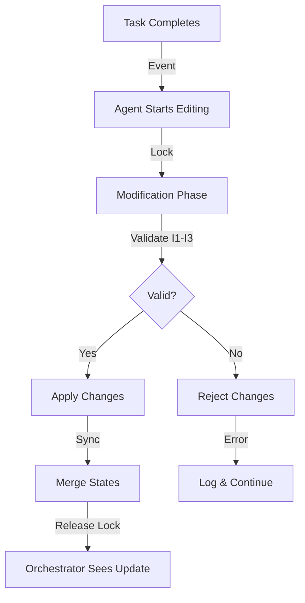
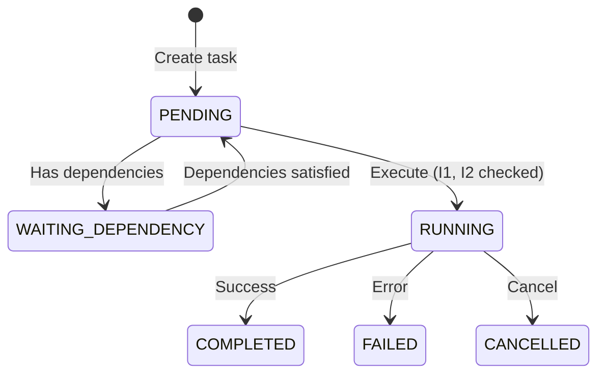

# Consistency and Safety Guarantees

## Overview

Since the TaskConstellation may be dynamically rewritten by an LLM-based agent, the orchestrator must enforce runtime invariants to preserve correctness even under partial or invalid updates. Without these guarantees, the system could execute invalid DAGs, violate dependencies, or enter inconsistent states.

The Constellation Orchestrator enforces three critical invariants (I1-I3) that together ensure safety, consistency, and semantic validity throughout execution.

## The Three Invariants

### I1: Single Assignment

**Invariant**: Each TaskStar has at most one active device assignment at any time.

**Rationale**: A task cannot execute on multiple devices simultaneously - this would lead to duplicate execution, wasted resources, inconsistent results, and ambiguous state (which device's result is authoritative?).

**Enforcement**:

```python
# In TaskStar
@property
def target_device_id(self) -> Optional[str]:
    """Get the target device ID."""
    return self._target_device_id

@target_device_id.setter
def target_device_id(self, value: Optional[str]) -> None:
    """Set the target device ID."""
    if self._status == TaskStatus.RUNNING:
        raise ValueError(
            f"Cannot modify device assignment of running task {self._task_id}"
        )
    self._target_device_id = value
```

**Validation**:

```python
def validate_constellation_assignments(
    self, constellation: TaskConstellation
) -> tuple[bool, List[str]]:
    """Validate that all tasks have valid device assignments."""
    
    errors = []
    for task_id, task in constellation.tasks.items():
        if not task.target_device_id:
            errors.append(f"Task '{task_id}' has no device assignment")
    
    return len(errors) == 0, errors
```

**Warning:** The setter explicitly prevents reassignment of running tasks, ensuring I1 cannot be violated during execution.

### I2: Acyclic Consistency

**Invariant**: Edits must preserve DAG acyclicity - the constellation remains a valid directed acyclic graph after all modifications.

**Rationale**: Cycles in the task graph create deadlocks (tasks wait for each other indefinitely), undefined execution order, and inability to determine ready tasks.

**Enforcement**:

```python
def add_dependency(self, dependency: TaskStarLine) -> None:
    """Add a dependency to the constellation."""
    
    # Validate tasks exist
    if dependency.from_task_id not in self._tasks:
        raise ValueError(f"Source task {dependency.from_task_id} not found")
    if dependency.to_task_id not in self._tasks:
        raise ValueError(f"Target task {dependency.to_task_id} not found")
    
    # Check for cycle BEFORE adding
    if self._would_create_cycle(dependency.from_task_id, dependency.to_task_id):
        raise ValueError(
            f"Adding dependency {dependency.from_task_id} -> {dependency.to_task_id} would create a cycle"
        )
    
    # Safe to add
    self._dependencies[dependency.line_id] = dependency
```

**Cycle Detection Algorithm**:

```python
def _would_create_cycle(self, from_task_id: str, to_task_id: str) -> bool:
    """Check if adding a dependency would create a cycle."""
    
    # Use DFS to check if path exists from to_task_id to from_task_id
    visited = set()
    
    def has_path(current: str, target: str) -> bool:
        if current == target:
            return True
        if current in visited:
            return False
        
        visited.add(current)
        
        # Check all dependencies where current is the source
        for dependency in self._dependencies.values():
            if dependency.from_task_id == current:
                if has_path(dependency.to_task_id, target):
                    return True
        
        return False
    
    # If path exists from to_task → from_task, adding from_task → to_task creates cycle
    return has_path(to_task_id, from_task_id)
```

**Validation**:

```python
def validate_dag(self) -> Tuple[bool, List[str]]:
    """Validate the DAG structure."""
    
    errors = []
    
    # Check for cycles
    if self.has_cycle():
        errors.append("DAG contains cycles")
    
    # Check for invalid dependencies
    for dependency in self._dependencies.values():
        if dependency.from_task_id not in self._tasks:
            errors.append(
                f"Dependency references non-existent source task "
                f"{dependency.from_task_id}"
            )
        if dependency.to_task_id not in self._tasks:
            errors.append(
                f"Dependency references non-existent target task "
                f"{dependency.to_task_id}"
            )
    
    return len(errors) == 0, errors
```

The orchestrator uses `get_topological_order()` which raises `ValueError` if cycles exist, providing an additional check.

### I3: Valid Update

**Invariant**: Only `PENDING` and `WAITING_DEPENDENCY` tasks may be modified; `RUNNING`, `COMPLETED`, and `FAILED` tasks are immutable.

**Rationale**: Modifying tasks that have started or finished execution could invalidate already-collected results, create inconsistencies between device state and constellation state, or violate causal dependencies.

**Enforcement**:

```python
def get_modifiable_tasks(self) -> List[TaskStar]:
    """Get all tasks that can be modified."""
    
    modifiable_statuses = {TaskStatus.PENDING, TaskStatus.WAITING_DEPENDENCY}
    return [
        task for task in self._tasks.values() 
        if task.status in modifiable_statuses
    ]

def is_task_modifiable(self, task_id: str) -> bool:
    """Check if a specific task can be modified."""
    
    task = self._tasks.get(task_id)
    if not task:
        return False
    return task.status in {TaskStatus.PENDING, TaskStatus.WAITING_DEPENDENCY}
```

**Task-Level Protection**:

```python
# In TaskStar
@name.setter
def name(self, value: str) -> None:
    if self._status == TaskStatus.RUNNING:
        raise ValueError(f"Cannot modify name of running task {self._task_id}")
    self._name = value

@description.setter
def description(self, value: str) -> None:
    if self._status == TaskStatus.RUNNING:
        raise ValueError(
            f"Cannot modify description of running task {self._task_id}"
        )
    self._description = value
```

**Dependency Validation**:

```python
def get_modifiable_dependencies(self) -> List[TaskStarLine]:
    """Get all dependencies that can be modified."""
    
    modifiable_deps = []
    modifiable_statuses = {TaskStatus.PENDING, TaskStatus.WAITING_DEPENDENCY}
    
    for dep in self._dependencies.values():
        target_task = self._tasks.get(dep.to_task_id)
        if target_task and target_task.status in modifiable_statuses:
            modifiable_deps.append(dep)
    
    return modifiable_deps
```

Once a task starts execution, its core properties (description, dependencies, device assignment) become immutable, ensuring execution integrity.

## Invariant Verification

### Pre-Execution Validation

Before orchestration begins, the orchestrator validates all invariants:

```python
async def _validate_and_prepare_constellation(
    self, constellation: TaskConstellation, 
    device_assignments: Optional[Dict[str, str]],
    assignment_strategy: Optional[str] = None,
) -> None:
    """Validate DAG structure and prepare device assignments."""
    
    # Validate I2: Acyclic Consistency
    is_valid, errors = constellation.validate_dag()
    if not is_valid:
        raise ValueError(f"Invalid DAG: {errors}")
    
    # Handle device assignments
    await self._assign_devices_to_tasks(
        constellation, device_assignments, assignment_strategy
    )
    
    # Validate I1: Single Assignment
    is_valid, errors = self._constellation_manager \
        .validate_constellation_assignments(constellation)
    if not is_valid:
        raise ValueError(f"Device assignment validation failed: {errors}")
```

### Runtime Validation

During execution, the orchestrator validates before each scheduling iteration:

```python
async def _run_execution_loop(self, constellation: TaskConstellation) -> None:
    """Main execution loop with validation."""
    
    while not constellation.is_complete():
        # Sync and validate after modifications
        constellation = await self._sync_constellation_modifications(constellation)
        
        # Validate I1: Single Assignment
        self._validate_existing_device_assignments(constellation)
        
        # I2 checked implicitly by TaskConstellation.add_dependency()
        # I3 checked by TaskStar property setters
        
        # Schedule ready tasks
        ready_tasks = constellation.get_ready_tasks()
        await self._schedule_ready_tasks(ready_tasks, constellation)
        await self._wait_for_task_completion()
```

### Post-Modification Validation

After the agent modifies the constellation, validation occurs before releasing the lock:

```python
# In safe assignment lock algorithm
while queue not empty:
    e ← dequeue()
    Δ ← invoke(ConstellationAgent, edit(C, e))
    C ← apply(C, Δ)
    validate(C)  # ← Verify I1, I2, I3
    publish(CONSTELLATION_MODIFIED, t)
    C ← synchronize(C, T_C)
end
```

## Consistency Under Concurrent Modification

### The Challenge

Concurrent task execution and constellation editing create multiple consistency challenges:

| Challenge | Without Invariants | With Invariants |
|-----------|-------------------|-----------------|
| **Duplicate execution** | Task assigned to multiple devices | I1 prevents multiple assignments |
| **Cyclic dependencies** | Deadlocked tasks | I2 prevents cycle introduction |
| **Stale modifications** | Running task gets edited | I3 prevents editing running tasks |
| **Lost results** | Completed task gets removed | I3 makes completed tasks immutable |

### Consistency Model

The orchestrator maintains eventual consistency with strong isolation:



**Properties:**

1. **Isolation**: Modifications occur atomically within lock
2. **Validation**: All changes checked against I1-I3 before commit
3. **Rejection**: Invalid modifications are discarded with error logging
4. **Consistency**: Orchestrator only sees valid constellation states

During the lock period (modification + validation + sync), the orchestrator has a strongly consistent view of the constellation. Learn more about [safe assignment locking](safe_assignment_locking.md).

## Formal Invariant Definitions

### Mathematical Formulation

Let C = (T, D) be a constellation with tasks T and dependencies D, where:
- τ ∈ T is a task with status σ(τ) and device assignment δ(τ)
- d = (t₁ → t₂) ∈ D is a dependency from task t₁ to task t₂

**I1 (Single Assignment)**: Each task has at most one device assignment.

**I2 (Acyclic Consistency)**: No cyclic paths exist in the dependency graph.

**I3 (Valid Update)**: If σ(τ) ∈ {RUNNING, COMPLETED, FAILED} then τ is immutable.

### State Transition Rules

Valid state transitions preserve invariants:



**Note:** Tasks become immutable (I3) upon entering RUNNING state. PENDING and WAITING_DEPENDENCY tasks remain modifiable.

## Error Handling

### Invariant Violation Responses

When invariants are violated, the orchestrator takes appropriate action:

#### I1 Violation: Multiple Assignments

```python
# Detected during validation
if not task.target_device_id:
    errors.append(f"Task '{task_id}' has no device assignment")

# Or during reassignment attempt
if self._status == TaskStatus.RUNNING:
    raise ValueError(
        f"Cannot modify device assignment of running task {self._task_id}"
    )
```

**Response**: Reject modification, log error, continue with existing assignment

#### I2 Violation: Cycle Detected

```python
if self._would_create_cycle(dependency.from_task_id, dependency.to_task_id):
    raise ValueError(
        f"Adding dependency {dependency.from_task_id} -> {dependency.to_task_id} would create a cycle"
    )
```

**Response**: Reject dependency addition, log error, constellation remains acyclic

#### I3 Violation: Modifying Running Task

```python
if self._status == TaskStatus.RUNNING:
    raise ValueError(f"Cannot modify name of running task {self._task_id}")
```

**Response**: Reject modification, log error, task properties unchanged

### Graceful Degradation

If the agent produces invalid modifications:

```python
try:
    constellation.add_dependency(new_dependency)
except ValueError as e:
    self.logger.error(f"Invalid dependency rejected: {e}")
    # Continue with existing constellation structure
    # Don't block orchestration on agent errors
```

The orchestrator continues execution with the last valid constellation state.

**Warning:** The orchestrator prioritizes safety (correctness) over liveness (progress). If the agent produces invalid modifications, orchestration may slow or stall, but will never execute an invalid DAG.

## Performance Impact

### Validation Overhead

| Invariant | Check Complexity | Per-Operation Cost | When Checked |
|-----------|-----------------|-------------------|--------------|
| I1 | O(1) | < 1ms | Per task assignment |
| I2 | O(V + E) (DFS) | 1-10ms | Per dependency add |
| I3 | O(1) | < 1ms | Per task modification |

Where V = number of tasks, E = number of dependencies.

### Optimization Strategies

**1. Lazy Validation**:
```python
# Only validate when needed
def validate_dag(self) -> Tuple[bool, List[str]]:
    # Cache validation results if DAG hasn't changed
    if self._last_validation_time == self._updated_at:
        return self._cached_validation
```

**2. Incremental Checking**:
```python
# Check only affected subgraph for cycles
def _would_create_cycle(self, from_task_id: str, to_task_id: str) -> bool:
    # Only traverse from to_task → from_task
    # Don't re-check entire graph
```

**3. Batch Validation**:
```python
# Validate once after applying all modifications in a batch
while queue not empty:
    # Apply all modifications
    pass
validate(C)  # Single validation for entire batch
```

Learn more about [batched editing strategies](batched_editing.md).

## Testing Invariants

### Unit Tests

Each invariant has dedicated test coverage:

```python
def test_single_assignment_invariant():
    """Test I1: Single Assignment."""
    task = TaskStar(task_id="test_task")
    task.target_device_id = "device_1"
    
    # Assignment succeeds
    assert task.target_device_id == "device_1"
    
    # Reassignment before execution succeeds
    task.target_device_id = "device_2"
    assert task.target_device_id == "device_2"
    
    # Start execution
    task.start_execution()
    
    # Reassignment after execution fails
    with pytest.raises(ValueError):
        task.target_device_id = "device_3"

def test_acyclic_consistency_invariant():
    """Test I2: Acyclic Consistency."""
    constellation = TaskConstellation()
    task_a = TaskStar(task_id="A")
    task_b = TaskStar(task_id="B")
    task_c = TaskStar(task_id="C")
    
    constellation.add_task(task_a)
    constellation.add_task(task_b)
    constellation.add_task(task_c)
    
    # Add A → B
    dep_ab = TaskStarLine("dep1", "A", "B")
    constellation.add_dependency(dep_ab)
    
    # Add B → C
    dep_bc = TaskStarLine("dep2", "B", "C")
    constellation.add_dependency(dep_bc)
    
    # Try to add C → A (creates cycle)
    dep_ca = TaskStarLine("dep3", "C", "A")
    with pytest.raises(ValueError, match="would create a cycle"):
        constellation.add_dependency(dep_ca)

def test_valid_update_invariant():
    """Test I3: Valid Update."""
    task = TaskStar(task_id="test_task", description="Original")
    
    # Modification before execution succeeds
    task.description = "Modified"
    assert task.description == "Modified"
    
    # Start execution
    task.start_execution()
    
    # Modification after execution fails
    with pytest.raises(ValueError):
        task.description = "Invalid modification"
```

### Integration Tests

Test invariants during full orchestration:

```python
async def test_invariants_during_orchestration():
    """Test that invariants hold during concurrent orchestration."""
    
    # Create constellation with potential for violations
    constellation = create_complex_constellation()
    
    # Attach synchronizer and validators
    orchestrator = TaskConstellationOrchestrator(device_manager)
    synchronizer = ConstellationModificationSynchronizer(orchestrator)
    orchestrator.set_modification_synchronizer(synchronizer)
    
    # Run orchestration
    results = await orchestrator.orchestrate_constellation(constellation)
    
    # Verify invariants held throughout
    assert results["status"] == "completed"
    
    # Check I1: No duplicate assignments
    assignments = {}
    for task in constellation.get_all_tasks():
        device = task.target_device_id
        assert device not in assignments.values()
        assignments[task.task_id] = device
    
    # Check I2: No cycles
    is_valid, errors = constellation.validate_dag()
    assert is_valid
    
    # Check I3: Terminal tasks are immutable
    for task in constellation.get_completed_tasks() + constellation.get_failed_tasks():
        with pytest.raises(ValueError):
            task.description = "Should fail"
```

## Related Documentation

- [Safe Assignment Locking](safe_assignment_locking.md) - How invariants are enforced during locking
- [Asynchronous Scheduling](asynchronous_scheduling.md) - Concurrent execution preserving invariants
- [Batched Editing](batched_editing.md) - Efficient modification batching while maintaining invariants
- [API Reference](api_reference.md) - API methods for validation
