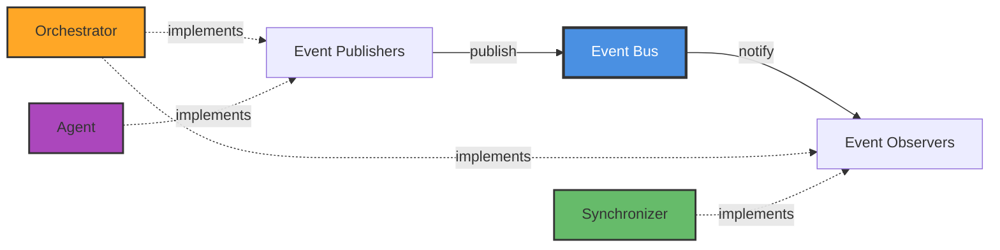
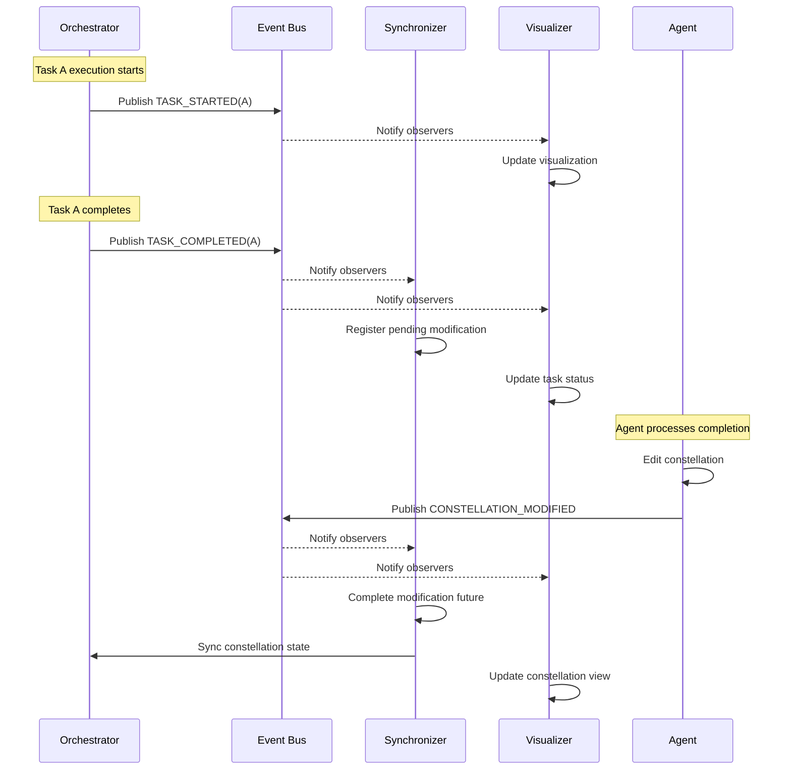

# Event-Driven Coordination

## Overview

Traditional DAG schedulers rely on **polling** or **global checkpoints** to detect task completion, introducing latency and synchronization overhead. In contrast, the Constellation Orchestrator operates as a fully **event-driven** system built on an internal event bus and observer design pattern.

This architecture enables immediate, fine-grained reactions to runtime signals without centralized coordination delays, providing the foundation for adaptive orchestration in UFO. For an overview of how events drive the orchestrator, see the [Orchestrator Overview](overview.md).

## Event System Architecture

The event-driven coordination system consists of three core components:



### Event Bus

The `EventBus` class serves as the central message broker, managing subscriptions and distributing events throughout the system.

**Key Features:**

- **Type-based subscription**: Observers subscribe to specific event types
- **Wildcard subscription**: Observers can subscribe to all events
- **Concurrent notification**: All observers are notified asynchronously in parallel
- **Error isolation**: Exceptions in one observer don't affect others

**Implementation** (`galaxy/core/events.py`):

```python
class EventBus(IEventPublisher):
    """Central event bus for Galaxy framework."""
    
    def subscribe(self, observer: IEventObserver, 
                  event_types: Set[EventType] = None) -> None:
        """Subscribe observer to specific events or all events."""
        if event_types is None:
            self._all_observers.add(observer)
        else:
            for event_type in event_types:
                if event_type not in self._observers:
                    self._observers[event_type] = set()
                self._observers[event_type].add(observer)
    
    async def publish_event(self, event: Event) -> None:
        """Publish event to all relevant subscribers."""
        observers_to_notify = set()
        
        # Add type-specific observers
        if event.event_type in self._observers:
            observers_to_notify.update(self._observers[event.event_type])
        
        # Add wildcard observers
        observers_to_notify.update(self._all_observers)
        
        # Notify all concurrently
        if observers_to_notify:
            tasks = [observer.on_event(event) for observer in observers_to_notify]
            await asyncio.gather(*tasks, return_exceptions=True)
```

!!!tip "Design Pattern"
    The event bus implements the **Observer** (or Publish-Subscribe) pattern, decoupling event producers from consumers and enabling extensible system behavior.

## Event Types

The orchestrator uses four primary event types that capture the complete lifecycle of tasks and constellations:

### Task-Level Events

These events track individual task state transitions during execution:

| Event Type | Trigger | Published By | Data Payload |
|------------|---------|--------------|--------------|
| `TASK_STARTED` | Task assigned to device and execution begins | Orchestrator | `task_id`, `status`, `constellation_id` |
| `TASK_COMPLETED` | Task finishes successfully | Orchestrator | `task_id`, `status`, `result`, `newly_ready_tasks`, `constellation` |
| `TASK_FAILED` | Task execution fails | Orchestrator | `task_id`, `status`, `error`, `newly_ready_tasks` |

**Event Structure:**

```python
@dataclass
class TaskEvent(Event):
    """Task-specific event."""
    task_id: str
    status: str
    result: Any = None
    error: Optional[Exception] = None
```

### Constellation-Level Events

These events track macro-level constellation lifecycle and structural changes:

| Event Type | Trigger | Published By | Data Payload |
|------------|---------|--------------|--------------|
| `CONSTELLATION_STARTED` | Orchestration begins | Orchestrator | `total_tasks`, `assignment_strategy`, `constellation` |
| `CONSTELLATION_COMPLETED` | All tasks finished | Orchestrator | `total_tasks`, `statistics`, `execution_duration` |
| `CONSTELLATION_MODIFIED` | DAG structure updated by agent | Agent | `on_task_id`, `new_constellation`, `modifications` |

**Event Structure:**

```python
@dataclass
class ConstellationEvent(Event):
    """Constellation-specific event."""
    constellation_id: str
    constellation_state: str
    new_ready_tasks: List[str] = None
```

All events inherit from the base `Event` class which provides common fields: `event_type`, `source_id`, `timestamp`, and `data`.

## Observer Pattern Implementation

The orchestrator and related components implement the `IEventObserver` interface to react to events:

```python
class IEventObserver(ABC):
    """Interface for event observers."""
    
    @abstractmethod
    async def on_event(self, event: Event) -> None:
        """Handle an event."""
        pass
```

### Key Observers in the System

#### 1. ConstellationModificationSynchronizer

Ensures proper synchronization between task completion and constellation modifications:

```python
class ConstellationModificationSynchronizer(IEventObserver):
    """Synchronizes constellation modifications with orchestrator execution."""
    
    async def on_event(self, event: Event) -> None:
        if isinstance(event, TaskEvent):
            await self._handle_task_event(event)
        elif isinstance(event, ConstellationEvent):
            await self._handle_constellation_event(event)
```

**Responsibilities:**

- Register pending modifications when tasks complete
- Mark modifications as complete when agent finishes editing
- Provide synchronization point for orchestrator

[Learn more →](safe_assignment_locking.md#modification-synchronizer)

#### 2. Visualization Observers

Handle real-time visualization updates as constellation evolves:

- `DAGVisualizationObserver` - Updates DAG topology visualization
- `TaskVisualizationHandler` - Updates task status displays
- `ConstellationVisualizationHandler` - Updates overall constellation state

!!!example "Observer Subscription"
    ```python
    # Subscribe synchronizer to task and constellation events
    event_bus = get_event_bus()
    synchronizer = ConstellationModificationSynchronizer(orchestrator)
    event_bus.subscribe(synchronizer, {
        EventType.TASK_COMPLETED,
        EventType.TASK_FAILED,
        EventType.CONSTELLATION_MODIFIED
    })
    ```

## Event Flow in Orchestration

The following sequence diagram illustrates how events flow through the system during orchestration:



This flow demonstrates several key aspects:

1. **Immediate notification**: Events are published as soon as state changes occur
2. **Parallel processing**: Multiple observers react concurrently
3. **Decoupled components**: Publishers don't know about subscribers
4. **Asynchronous coordination**: No blocking waits or polling

## Event Publishing in Orchestrator

The orchestrator publishes events at critical execution points:

### Task Execution Events

When executing a task, the orchestrator wraps execution in event publishing:

```python
async def _execute_task_with_events(
    self, task: TaskStar, constellation: TaskConstellation
) -> None:
    """Execute a single task and publish events."""
    
    try:
        # Publish task started event
        start_event = TaskEvent(
            event_type=EventType.TASK_STARTED,
            source_id=f"orchestrator_{id(self)}",
            timestamp=time.time(),
            data={"constellation_id": constellation.constellation_id},
            task_id=task.task_id,
            status=TaskStatus.RUNNING.value,
        )
        await self._event_bus.publish_event(start_event)
        
        # Execute task
        task.start_execution()
        result = await task.execute(self._device_manager)
        
        is_success = result.status == TaskStatus.COMPLETED.value
        
        # Mark as completed and get newly ready tasks
        newly_ready = constellation.mark_task_completed(
            task.task_id, success=is_success, result=result
        )
        
        # Publish task completed or failed event
        completed_event = TaskEvent(
            event_type=(
                EventType.TASK_COMPLETED if is_success 
                else EventType.TASK_FAILED
            ),
            source_id=f"orchestrator_{id(self)}",
            timestamp=time.time(),
            data={
                "constellation_id": constellation.constellation_id,
                "newly_ready_tasks": [t.task_id for t in newly_ready],
                "constellation": constellation,
            },
            task_id=task.task_id,
            status=result.status,
            result=result,
        )
        await self._event_bus.publish_event(completed_event)
        
    except Exception as e:
        # Mark task as failed and get newly ready tasks
        newly_ready = constellation.mark_task_completed(
            task.task_id, success=False, error=e
        )
        
        # Publish task failed event
        failed_event = TaskEvent(
            event_type=EventType.TASK_FAILED,
            source_id=f"orchestrator_{id(self)}",
            timestamp=time.time(),
            data={
                "constellation_id": constellation.constellation_id,
                "newly_ready_tasks": [t.task_id for t in newly_ready],
            },
            task_id=task.task_id,
            status=TaskStatus.FAILED.value,
            error=e,
        )
        await self._event_bus.publish_event(failed_event)
        raise
```

!!!warning "Critical Section"
    Event publishing happens **immediately** after state transitions but **before** any dependent operations, ensuring observers have the latest state.

### Constellation Lifecycle Events

The orchestrator also publishes constellation-level events:

```python
# At orchestration start
start_event = ConstellationEvent(
    event_type=EventType.CONSTELLATION_STARTED,
    source_id=f"orchestrator_{id(self)}",
    timestamp=time.time(),
    data={
        "total_tasks": len(constellation.tasks),
        "assignment_strategy": assignment_strategy,
        "constellation": constellation,
    },
    constellation_id=constellation.constellation_id,
    constellation_state="executing",
)
await self._event_bus.publish_event(start_event)

# At orchestration completion
completion_event = ConstellationEvent(
    event_type=EventType.CONSTELLATION_COMPLETED,
    source_id=f"orchestrator_{id(self)}",
    timestamp=time.time(),
    data={
        "total_tasks": len(constellation.tasks),
        "statistics": constellation.get_statistics(),
        "execution_duration": time.time() - start_event.timestamp,
    },
    constellation_id=constellation.constellation_id,
    constellation_state="completed",
)
await self._event_bus.publish_event(completion_event)
```

## Benefits of Event-Driven Architecture

The event-driven design provides several critical advantages:

### 1. High Responsiveness

Events are processed **immediately** upon publication with no polling delay:

- Task completion → Agent notified instantly
- Constellation modified → Orchestrator syncs immediately
- Failure detected → Recovery triggered without delay

### 2. Loose Coupling

Components interact through events rather than direct calls:

- Orchestrator doesn't know about visualization
- Agent doesn't know about synchronizer
- New observers can be added without modifying publishers

### 3. Extensibility

New functionality can be added by creating new observers:

```python
class MetricsCollector(IEventObserver):
    """Collect orchestration metrics."""
    
    async def on_event(self, event: Event) -> None:
        if event.event_type == EventType.TASK_COMPLETED:
            self._record_task_completion(event)
        elif event.event_type == EventType.CONSTELLATION_COMPLETED:
            self._record_constellation_metrics(event)

# Subscribe to event bus
event_bus.subscribe(MetricsCollector())
```

### 4. Concurrent Processing

Multiple observers process events in parallel:

- Visualization updates don't block synchronization
- Logging doesn't delay task scheduling
- Metrics collection happens asynchronously

### 5. Error Isolation

Exceptions in one observer don't affect others:

```python
# In EventBus.publish_event()
await asyncio.gather(*tasks, return_exceptions=True)
```

If a visualization observer crashes, the synchronizer still processes the event correctly.

## Performance Characteristics

| Aspect | Measurement | Impact |
|--------|-------------|--------|
| **Event Latency** | < 1ms (in-memory) | Negligible overhead |
| **Notification Overhead** | O(N) where N = observers | Scales linearly with observers |
| **Concurrency** | Unlimited parallel observers | No bottleneck from sequential processing |
| **Memory** | Event objects garbage collected | No long-term accumulation |

The event system has been battle-tested in production with up to 50+ concurrent observers, 1000+ events per second, complex multi-device constellations, and long-running orchestration sessions.

## Usage Patterns

### Creating Custom Observers

To create a custom observer for orchestration events:

```python
from galaxy.core.events import IEventObserver, Event, EventType

class CustomOrchestrationObserver(IEventObserver):
    """Custom observer for orchestration events."""
    
    def __init__(self):
        self.task_count = 0
        self.completion_times = []
    
    async def on_event(self, event: Event) -> None:
        """Handle events of interest."""
        
        if event.event_type == EventType.TASK_COMPLETED:
            self.task_count += 1
            duration = event.data.get("result").end_time - \
                       event.data.get("result").start_time
            self.completion_times.append(duration.total_seconds())
            
            print(f"Task {event.task_id} completed in "
                  f"{duration.total_seconds():.2f}s")
        
        elif event.event_type == EventType.CONSTELLATION_COMPLETED:
            avg_time = sum(self.completion_times) / len(self.completion_times)
            print(f"Constellation completed! "
                  f"Average task time: {avg_time:.2f}s")

# Register observer
from galaxy.core.events import get_event_bus

observer = CustomOrchestrationObserver()
event_bus = get_event_bus()
event_bus.subscribe(observer, {
    EventType.TASK_COMPLETED,
    EventType.CONSTELLATION_COMPLETED
})
```

### Event Filtering

Observers can filter events based on custom criteria:

```python
class FailureMonitor(IEventObserver):
    """Monitor and log only failure events."""
    
    async def on_event(self, event: Event) -> None:
        # Only process failure events
        if event.event_type != EventType.TASK_FAILED:
            return
        
        # Log failure details
        self.logger.error(
            f"Task {event.task_id} failed: {event.error}"
        )
        
        # Optionally trigger alerts or recovery
        await self._handle_task_failure(event)
```

## Related Documentation

- **[Asynchronous Scheduling](asynchronous_scheduling.md)** - How events trigger task scheduling
- **[Safe Assignment Locking](safe_assignment_locking.md)** - Event-driven synchronization
- **[API Reference](api_reference.md)** - Event classes and interfaces

---

!!!tip "Next Steps"
    To understand how events drive concurrent task execution, continue to [Asynchronous Scheduling](asynchronous_scheduling.md).
