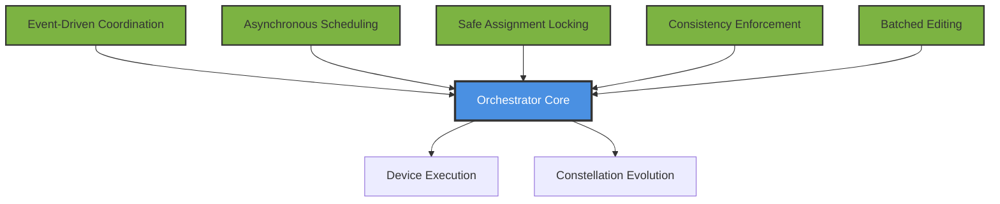
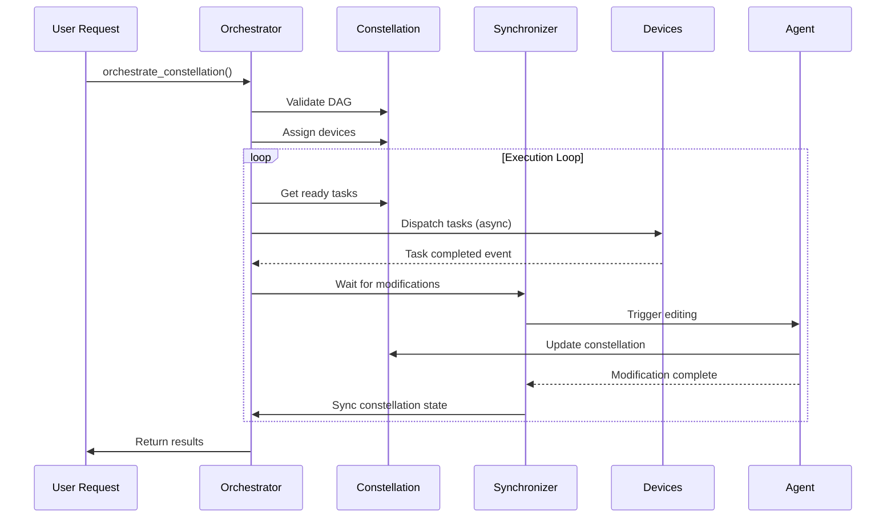

# Constellation Orchestrator Overview

## Introduction

The **Constellation Orchestrator** is the execution engine at the heart of UFO's multi-device orchestration system. While the Constellation Agent handles reasoning and task graph evolution, the orchestrator transforms these declarative plans into concrete execution across heterogeneous devices.

Unlike traditional DAG schedulers that execute static task graphs, the Constellation Orchestrator operates as a **living execution fabric** where tasks evolve concurrently, react to runtime signals, and adapt to new decisions from the reasoning agent in real-time.


*The Constellation Orchestrator bridges TaskConstellation and execution, enabling asynchronous, adaptive task orchestration across devices.*

## Key Capabilities

The orchestrator achieves three critical goals that traditional schedulers struggle to balance:

| Capability | Description | Benefit |
|------------|-------------|---------|
| **Asynchronous Parallelism** | Execute independent tasks concurrently across heterogeneous devices | Maximize device utilization and minimize idle time |
| **Safety & Consistency** | Maintain correctness under concurrent DAG updates from LLM reasoning | Prevent race conditions and invalid execution states |
| **Runtime Adaptivity** | React to feedback from both devices and LLM reasoning dynamically | Enable intelligent re-planning and error recovery |

## Architecture Overview

The Constellation Orchestrator is built on five fundamental design pillars:



### 1. Event-Driven Coordination

The orchestrator operates as a fully event-driven system using an observer pattern and internal event bus. Instead of polling or global checkpoints, it reacts immediately to four primary event types:

- `TASK_STARTED` - Task assigned and execution begins
- `TASK_COMPLETED` - Task finishes successfully
- `TASK_FAILED` - Task execution fails
- `CONSTELLATION_MODIFIED` - DAG structure updated by agent

This design provides **high responsiveness** and eliminates synchronization overhead.

[Learn more →](event_driven_coordination.md)

### 2. Asynchronous Scheduling

A continuous scheduling loop monitors the evolving TaskConstellation, identifies ready tasks (dependencies satisfied), and dispatches them concurrently to available devices. Critically, **task execution and constellation editing proceed in parallel**, overlapping computation with orchestration.

This enables **maximum parallelism** and **minimal latency** in cross-device workflows.

[Learn more →](asynchronous_scheduling.md)

### 3. Safe Assignment Locking

To prevent race conditions when LLM-driven edits overlap with task execution, the orchestrator employs a safe assignment lock protocol. During edit cycles, new task assignments are suspended while modifications are applied atomically and synchronized with runtime progress.

This guarantees **atomicity** and **prevents conflicts** between execution and modification.

[Learn more →](safe_assignment_locking.md)

### 4. Consistency Enforcement

The orchestrator enforces three runtime invariants to preserve correctness even under partial or invalid LLM updates:

- **I1 (Single Assignment)**: Each task has at most one active device assignment
- **I2 (Acyclic Consistency)**: Edits preserve DAG acyclicity (no cycles)
- **I3 (Valid Update)**: Only PENDING tasks and their dependents can be modified

These invariants ensure **structural integrity** and **semantic validity** of the constellation.

[Learn more →](consistency_guarantees.md)

### 5. Batched Constellation Editing

To balance responsiveness with efficiency, the orchestrator batches multiple task completion events and applies their resulting modifications atomically. This amortizes LLM invocation overhead while preserving atomicity and consistency.

This achieves both **efficiency** and **adaptivity** without excessive micro-edits.

[Learn more →](batched_editing.md)

## System Components

The orchestrator consists of two primary components working in tandem:

### TaskConstellationOrchestrator

The main execution orchestrator focused on flow control and coordination. It manages:

- Event-driven task lifecycle (start, complete, fail)
- Asynchronous scheduling loop
- Safe assignment locking protocol
- Integration with modification synchronizer

[API Reference →](api_reference.md)

### ConstellationManager

Handles device assignment, resource management, and constellation lifecycle. It provides:

- Multiple assignment strategies (round-robin, capability-match, load-balance)
- Device validation and status tracking
- Constellation registration and metadata management

[Learn more →](constellation_manager.md)

## Execution Flow

The orchestration workflow follows this sequence:



The orchestrator treats task execution as an **open-world process** - continuously evolving, reacting, and converging toward user intent rather than executing a fixed plan.

## Design Highlights

### Asynchronous by Default

Every operation runs asynchronously using Python's `asyncio`, enabling:

- Concurrent task execution across devices
- Non-blocking event handling
- Parallel constellation editing

### LLM-Aware Orchestration

Unlike traditional schedulers, the orchestrator is designed for **reasoning-aware execution**:

- Expects and handles dynamic graph modifications
- Synchronizes LLM reasoning with runtime execution
- Validates and enforces safety under AI-driven changes

### Production-Ready Safeguards

- Timeout protection for modifications (default: 600s)
- Automatic validation before every execution cycle
- Device assignment verification
- Cycle detection on every edit
- Comprehensive error handling and logging

## Performance Characteristics

| Metric | Description | Implementation |
|--------|-------------|----------------|
| **Latency** | Time from task ready to execution start | Minimized via event-driven dispatch |
| **Throughput** | Tasks completed per unit time | Maximized via async parallelism |
| **Overhead** | Orchestration cost per task | Reduced via batched editing |
| **Scalability** | Performance with increasing tasks/devices | Linear with async coordination |

## Getting Started

### Basic Usage

```python
from galaxy.constellation import TaskConstellationOrchestrator
from galaxy.client.device_manager import ConstellationDeviceManager

# Create orchestrator
device_manager = ConstellationDeviceManager()
orchestrator = TaskConstellationOrchestrator(device_manager)

# Orchestrate constellation
results = await orchestrator.orchestrate_constellation(
    constellation=my_constellation,
    assignment_strategy="capability_match"
)
```

### With Modification Synchronizer

```python
from galaxy.session.observers.constellation_sync_observer import (
    ConstellationModificationSynchronizer
)

# Create synchronizer
synchronizer = ConstellationModificationSynchronizer(orchestrator)
orchestrator.set_modification_synchronizer(synchronizer)

# Subscribe to events
event_bus.subscribe(synchronizer)

# Now orchestrator will wait for LLM edits to complete
```

## Related Documentation

- **[Event-Driven Coordination](event_driven_coordination.md)** - Event system and observer pattern
- **[Asynchronous Scheduling](asynchronous_scheduling.md)** - Concurrent task execution
- **[Safe Assignment Locking](safe_assignment_locking.md)** - Race condition prevention
- **[Consistency Guarantees](consistency_guarantees.md)** - Runtime invariants
- **[Batched Editing](batched_editing.md)** - Efficient constellation updates
- **[Constellation Manager](constellation_manager.md)** - Device and resource management
- **[API Reference](api_reference.md)** - Complete API documentation

## Further Reading

- [TaskConstellation Documentation](../constellation/overview.md) - Understand the DAG structure
- [Constellation Agent](../constellation_agent/overview.md) - LLM-based reasoning
- [Device Manager](../client/device_manager.md) - Device communication layer

---

!!!tip "Next Steps"
    To understand how events drive orchestration, continue to [Event-Driven Coordination](event_driven_coordination.md).
