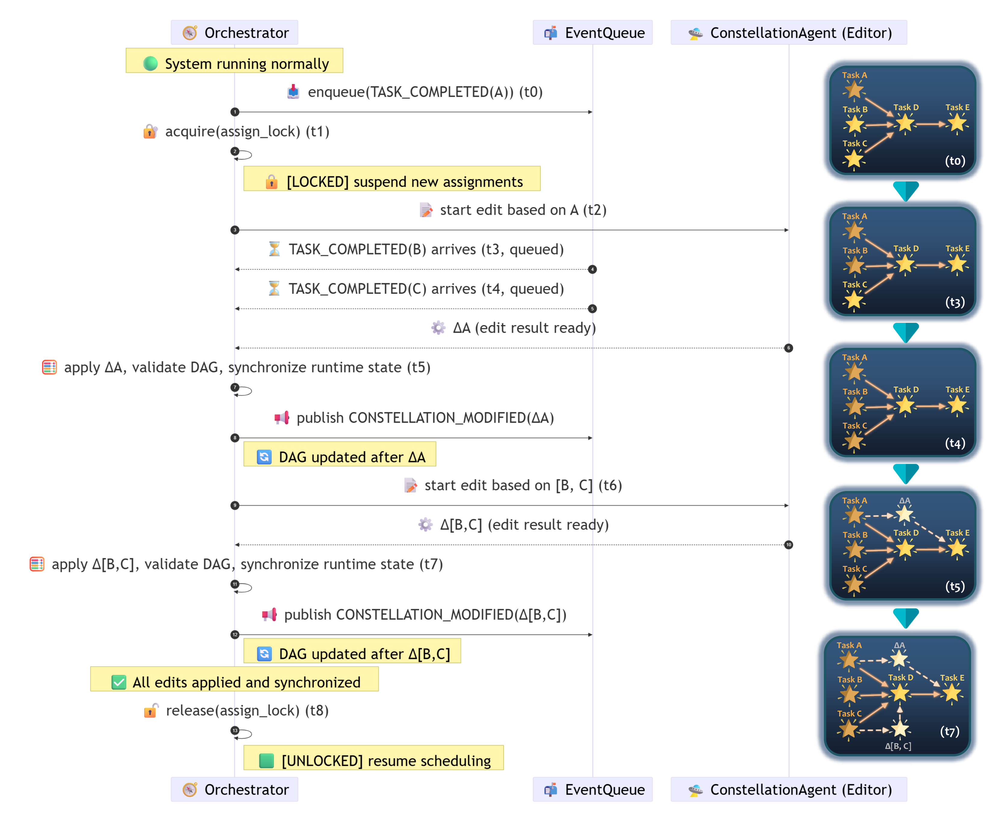
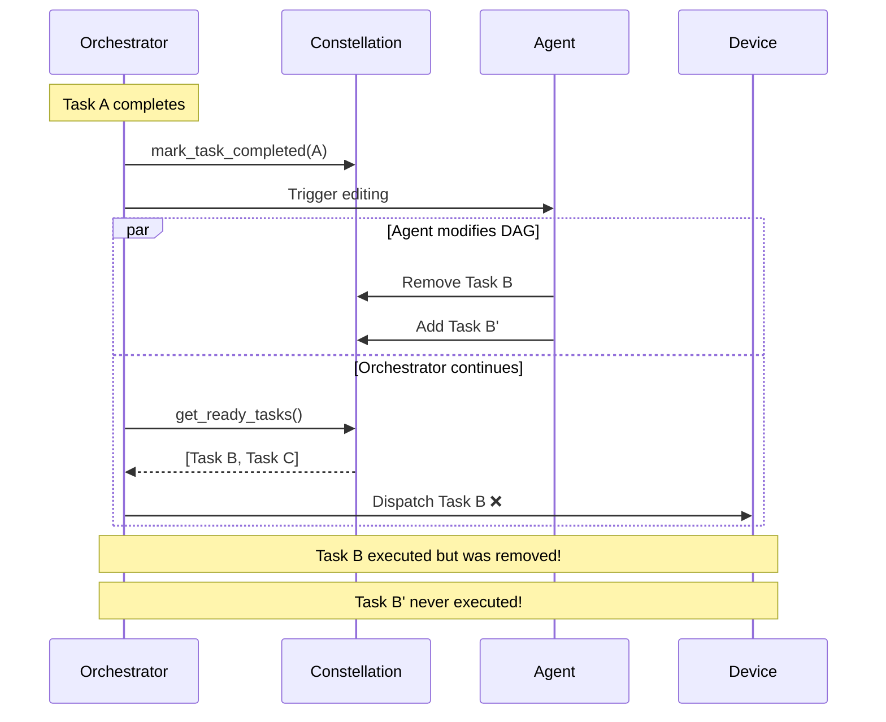
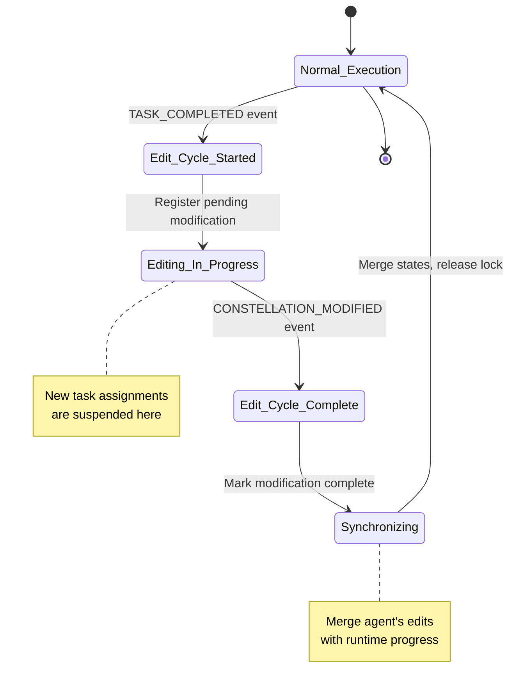
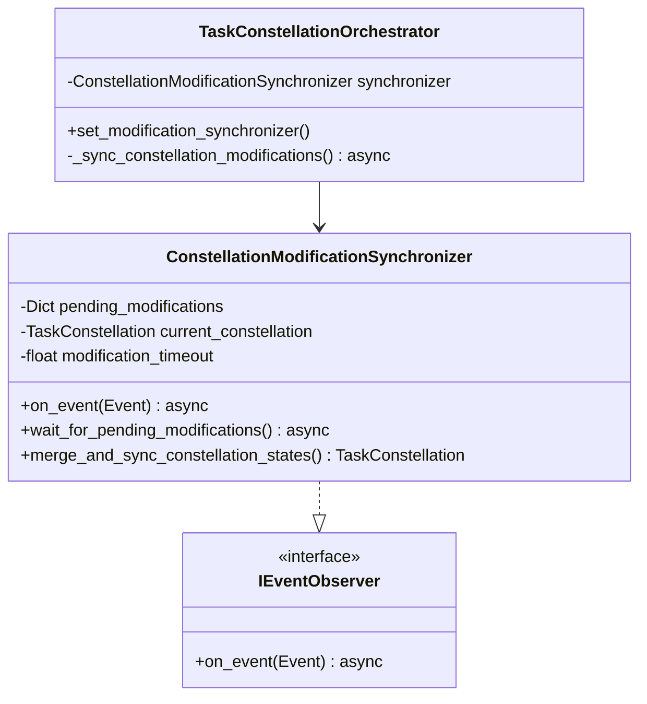
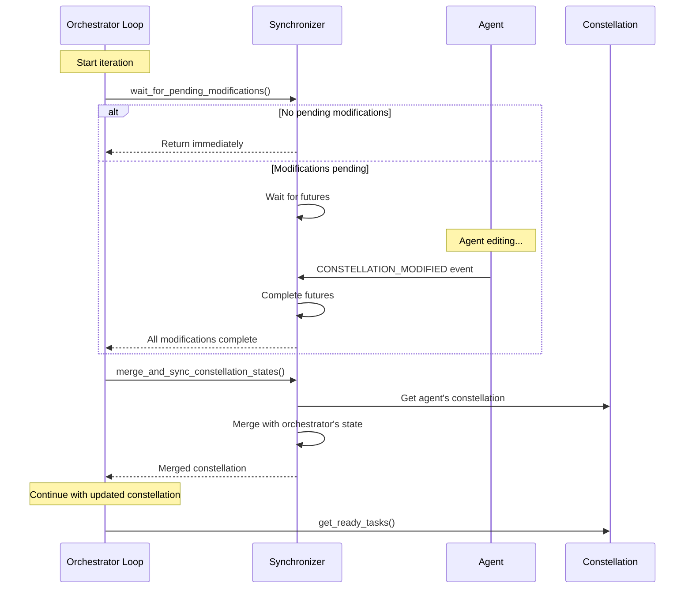

# Safe Assignment Locking

## Overview

While asynchronous execution maximizes efficiency, it introduces **correctness challenges** when task execution overlaps with DAG updates. The orchestrator must prevent race conditions where the Constellation Agent dynamically adds, removes, or rewires tasks during execution.

Without safeguards, a task could be dispatched based on a **stale DAG**, leading to duplicated execution, missed dependencies, or invalid state transitions.

To ensure atomicity, the orchestrator employs a **safe assignment lock protocol** combined with sophisticated **constellation state synchronization**.



*An example of the safe assignment locking and event synchronization workflow. When multiple tasks complete simultaneously, the orchestrator locks assignments, batches modifications, and releases after synchronization.*

## The Race Condition Problem

### Scenario Without Locking

Consider this problematic sequence:



**Problems:**

1. **Stale dispatch**: Task B dispatched after being removed
2. **Missing tasks**: Task B' never identified as ready
3. **Inconsistent state**: Constellation doesn't reflect actual execution

### Root Cause

The orchestrator's scheduling loop and agent's editing process are **concurrent and unsynchronized**:

```python
# Orchestrator loop (simplified)
while not constellation.is_complete():
    ready_tasks = constellation.get_ready_tasks()  # ← May see stale state
    await schedule_ready_tasks(ready_tasks)        # ← Dispatch based on stale view
    await wait_for_task_completion()
```

Meanwhile, the agent modifies the same constellation object concurrently.

## Safe Assignment Lock Protocol

### The Solution

The orchestrator uses a **lock-bounded editing regime**: during edit cycles, new task assignments are suspended until modifications are complete and synchronized.

```python
# In ConstellationModificationSynchronizer
async def wait_for_pending_modifications(self) -> bool:
    """Wait for all pending modifications to complete."""
    
    if not self._pending_modifications:
        return True
    
    # Wait for all pending edits to finish
    while self._pending_modifications:
        pending_tasks = list(self._pending_modifications.keys())
        pending_futures = list(self._pending_modifications.values())
        
        self.logger.info(
            f"⏳ Waiting for {len(pending_tasks)} pending modification(s): "
            f"{pending_tasks}"
        )
        
        # Wait for all current pending modifications
        await asyncio.wait_for(
            asyncio.gather(*pending_futures, return_exceptions=True),
            timeout=self._modification_timeout,
        )
    
    self.logger.info("✅ All pending modifications completed")
    return True
```

### Edit Cycle Lifecycle

An edit cycle is bounded by two events:

1. **Start**: `TASK_COMPLETED` or `TASK_FAILED` event published
2. **End**: `CONSTELLATION_MODIFIED` event published



### Algorithm: Safe Locking and Rescheduling

The complete protocol is formalized in Algorithm 1 from the paper:

```
Algorithm: Safe Assignment Locking and Asynchronous Rescheduling Protocol

Input: Event stream E, current TaskConstellation C
Output: Consistent and updated C with newly scheduled ready tasks

while system is running do
    foreach event e ∈ E do
        if e is TASK_COMPLETED or TASK_FAILED then
            async enqueue(e)  // Record for processing
        end
    end
    
    acquire(assign_lock)  // Suspend new assignments
    
    while queue not empty do
        e ← dequeue()
        Δ ← invoke(ConstellationAgent, edit(C, e))  // Propose DAG edits
        C ← apply(C, Δ)                             // Update structure
        validate(C)                                  // Ensure invariants I1-I3
        publish(CONSTELLATION_MODIFIED, t)
        C ← synchronize(C, T_C)  // Merge completed tasks
    end
    
    release(assign_lock)  // Resume orchestration
    
    // Rescheduling Phase (outside lock)
    T_R ← get_ready_tasks(C)
    foreach t ∈ T_R do
        async dispatch(t)
        async publish(TASK_STARTED, t)
    end
end
```

**Key properties:**

- **Atomicity**: All edits within a queue batch are applied together
- **Validation**: Invariants checked before releasing lock
- **Synchronization**: Runtime progress merged before rescheduling
- **Non-blocking**: Lock only held during modification, not execution

!!!info "Linearization"
    Each edit cycle is **linearized** - from `acquire(lock)` to `release(lock)`, the orchestrator sees a consistent snapshot of the constellation.

## Modification Synchronizer

The `ConstellationModificationSynchronizer` component implements the locking protocol by coordinating between the orchestrator and agent.

### Component Architecture



### Tracking Pending Modifications

When a task completes, the synchronizer registers a pending modification:

```python
async def _handle_task_event(self, event: TaskEvent) -> None:
    """Handle task completion/failure events."""
    
    if event.event_type not in [EventType.TASK_COMPLETED, EventType.TASK_FAILED]:
        return
    
    constellation_id = event.data.get("constellation_id")
    if not constellation_id:
        return
    
    # Register pending modification
    if event.task_id not in self._pending_modifications:
        modification_future = asyncio.Future()
        self._pending_modifications[event.task_id] = modification_future
        self._stats["total_modifications"] += 1
        
        self.logger.info(
            f"🔒 Registered pending modification for task '{event.task_id}'"
        )
        
        # Set timeout to auto-complete if modification takes too long
        asyncio.create_task(
            self._auto_complete_on_timeout(event.task_id, modification_future)
        )
```

**Data structure:**

```python
# task_id -> Future mapping
self._pending_modifications: Dict[str, asyncio.Future] = {}
```

Each future represents an edit cycle that will be completed when `CONSTELLATION_MODIFIED` is received.

### Completing Modifications

When the agent publishes `CONSTELLATION_MODIFIED`, the synchronizer completes the future:

```python
async def _handle_constellation_event(self, event: ConstellationEvent) -> None:
    """Handle constellation modification events."""
    
    if event.event_type != EventType.CONSTELLATION_MODIFIED:
        return
    
    task_ids = event.data.get("on_task_id")
    if not task_ids:
        return
    
    new_constellation = event.data.get("new_constellation")
    if new_constellation:
        self._current_constellation = new_constellation
    
    # Mark modifications as complete
    for task_id in task_ids:
        if task_id in self._pending_modifications:
            future = self._pending_modifications[task_id]
            if not future.done():
                future.set_result(True)  # ← Unblocks wait_for_pending_modifications
                self._stats["completed_modifications"] += 1
                self.logger.info(
                    f"✅ Completed modification for task '{task_id}'"
                )
            del self._pending_modifications[task_id]
```

### Timeout Protection

To prevent deadlocks if the agent fails to publish `CONSTELLATION_MODIFIED`:

```python
async def _auto_complete_on_timeout(
    self, task_id: str, future: asyncio.Future
) -> None:
    """Auto-complete a pending modification if it times out."""
    
    try:
        await asyncio.sleep(self._modification_timeout)  # Default: 600s
        
        if not future.done():
            self._stats["timeout_modifications"] += 1
            self.logger.warning(
                f"⚠️ Modification for task '{task_id}' timed out. "
                f"Auto-completing to prevent deadlock."
            )
            future.set_result(False)
            if task_id in self._pending_modifications:
                del self._pending_modifications[task_id]
    except asyncio.CancelledError:
        raise
```

!!!warning "Safety Mechanism"
    Timeout protection ensures the orchestrator never permanently blocks, even if the agent encounters an error.

## Constellation State Merging

After modifications complete, the synchronizer must **merge** two potentially conflicting views:

1. **Agent's constellation**: Has latest structural changes (new tasks, modified dependencies)
2. **Orchestrator's constellation**: Has latest execution state (task statuses, results)

### The Challenge

During editing, tasks may complete:

```
t0: Task A completes → Agent starts editing
t1: Agent modifies constellation (Task A still RUNNING in agent's copy)
t2: Task B completes (orchestrator marks as COMPLETED)
t3: Agent publishes CONSTELLATION_MODIFIED
t4: Orchestrator syncs...
```

**Problem**: Direct replacement would lose Task B's COMPLETED status!

### State Merging Algorithm

The synchronizer preserves the **most advanced state** for each task:

```python
def merge_and_sync_constellation_states(
    self, orchestrator_constellation: TaskConstellation
) -> TaskConstellation:
    """Merge constellation states: structural changes + execution state."""
    
    if not self._current_constellation:
        return orchestrator_constellation
    
    # Use agent's constellation as base (has structural modifications)
    merged = self._current_constellation
    
    # Preserve execution state from orchestrator for existing tasks
    for task_id, orchestrator_task in orchestrator_constellation.tasks.items():
        if task_id in merged.tasks:
            agent_task = merged.tasks[task_id]
            
            # If orchestrator's state is more advanced, preserve it
            if self._is_state_more_advanced(
                orchestrator_task.status, agent_task.status
            ):
                self.logger.debug(
                    f"📌 Preserving advanced state for task '{task_id}': "
                    f"{orchestrator_task.status} (orchestrator) vs "
                    f"{agent_task.status} (agent)"
                )
                
                # Preserve orchestrator's state and results
                agent_task._status = orchestrator_task.status
                agent_task._result = orchestrator_task.result
                agent_task._error = orchestrator_task.error
                agent_task._execution_start_time = orchestrator_task.execution_start_time
                agent_task._execution_end_time = orchestrator_task.execution_end_time
    
    # Update constellation state
    merged.update_state()
    
    return merged
```

### State Advancement Hierarchy

States are ordered by execution progression:

```python
def _is_state_more_advanced(self, state1, state2) -> bool:
    """Check if state1 is more advanced than state2."""
    
    state_levels = {
        TaskStatus.PENDING: 0,
        TaskStatus.WAITING_DEPENDENCY: 1,
        TaskStatus.RUNNING: 2,
        TaskStatus.COMPLETED: 3,
        TaskStatus.FAILED: 3,      # Terminal states equally advanced
        TaskStatus.CANCELLED: 3,
    }
    
    level1 = state_levels.get(state1, 0)
    level2 = state_levels.get(state2, 0)
    
    return level1 > level2
```

**Examples:**

- `COMPLETED > RUNNING`: Preserve orchestrator's COMPLETED status
- `FAILED > PENDING`: Preserve orchestrator's FAILED status
- `RUNNING > PENDING`: Preserve orchestrator's RUNNING status
- `COMPLETED = FAILED`: Both terminal, don't override

!!!success "Correctness Guarantee"
    State merging ensures **no execution progress is lost** during concurrent editing.

## Synchronization in Orchestration Loop

The orchestrator syncs at the start of each iteration:

```python
async def _sync_constellation_modifications(
    self, constellation: TaskConstellation
) -> TaskConstellation:
    """Synchronize pending constellation modifications."""
    
    if self._modification_synchronizer:
        # Wait for agent to finish any pending edits
        await self._modification_synchronizer.wait_for_pending_modifications()
        
        # Merge agent's structural changes with orchestrator's execution state
        constellation = self._modification_synchronizer \
            .merge_and_sync_constellation_states(
                orchestrator_constellation=constellation,
            )
    
    return constellation
```

**Synchronization flow:**



## Batched Event Processing

When multiple tasks complete simultaneously, their modifications are batched:

```python
# In algorithm: while queue not empty do
while self._pending_modifications:
    # Process ALL pending modifications in one cycle
    ...
```

**Timeline with batching:**

```
t0: Task A completes → enqueue(A)
t3: Task B completes → enqueue(B)
t4: Task C completes → enqueue(C)

t5: acquire(lock)
t6: Process A → Δ_A
t7: Process B → Δ_B
t8: Process C → Δ_C
t9: Apply all Δs atomically
t10: release(lock)
```

**Benefits:**

- **Reduced overhead**: One lock acquisition for multiple edits
- **Atomicity**: All modifications visible together
- **Efficiency**: Amortize validation and synchronization costs

[Learn more about batching →](batched_editing.md)

## Correctness Properties

The safe assignment lock protocol guarantees three critical properties:

### 1. Atomicity

**Property**: Edit cycles are atomic - either all modifications in a batch are applied, or none are.

**Enforcement**: Lock held during entire edit-validate-sync sequence.

### 2. Consistency

**Property**: Constellation always satisfies invariants I1-I3 after edits.

**Enforcement**: Validation performed before releasing lock.

[Learn more about invariants →](consistency_guarantees.md)

### 3. Progress

**Property**: The system never permanently blocks (liveness).

**Enforcement**: 
- Timeout protection (600s default)
- Auto-completion on timeout
- Exception handling in observers

## Performance Impact

### Lock Overhead

| Scenario | Lock Duration | Impact |
|----------|--------------|---------|
| **Single task completion** | 10-50ms | Negligible - concurrent tasks unaffected |
| **Batched completions** | 50-200ms | Amortized over multiple edits |
| **Complex editing** | 200-500ms | Depends on LLM response time |

### Throughput Analysis

The lock does NOT block task execution:

```python
# While lock is held:
acquire(assign_lock)
    ... agent modifies constellation ...
release(assign_lock)

# Meanwhile, already-dispatched tasks continue executing:
Task A: [=========executing=========]
Task B:      [=========executing=========]
Task C:          [=========executing=========]
```

**Impact on throughput**: Minimal - only affects scheduling of **new** tasks, not execution of **running** tasks.

### Latency Analysis

Additional latency per task completion:

- **Without synchronizer**: ~5ms (direct scheduling)
- **With synchronizer**: ~10-50ms (wait for edit + merge)

**Acceptable tradeoff** for correctness in dynamic orchestration.

## Usage Patterns

### Setting Up Synchronization

```python
from galaxy.constellation.orchestrator import TaskConstellationOrchestrator
from galaxy.session.observers.constellation_sync_observer import (
    ConstellationModificationSynchronizer
)

# Create orchestrator
orchestrator = TaskConstellationOrchestrator(device_manager)

# Create and attach synchronizer
synchronizer = ConstellationModificationSynchronizer(orchestrator)
orchestrator.set_modification_synchronizer(synchronizer)

# Subscribe to events
from galaxy.core.events import get_event_bus
event_bus = get_event_bus()
event_bus.subscribe(synchronizer)

# Orchestrate with synchronization
results = await orchestrator.orchestrate_constellation(constellation)
```

### Custom Timeout

```python
# Increase timeout for slow LLM responses
synchronizer.set_modification_timeout(1200.0)  # 20 minutes
```

### Monitoring Synchronization

```python
# Check pending modifications
if synchronizer.has_pending_modifications():
    pending = synchronizer.get_pending_task_ids()
    print(f"Waiting for modifications: {pending}")

# Get statistics
stats = synchronizer.get_statistics()
print(f"Total: {stats['total_modifications']}")
print(f"Completed: {stats['completed_modifications']}")
print(f"Timeouts: {stats['timeout_modifications']}")
```

## Formal Verification

The paper provides formal verification of the locking protocol:

### TLA+ Specification

A TLA+ model specifies the protocol's invariants and progress properties:

```tla
VARIABLES
    constellation,      \* Current DAG structure
    orchestrator_state, \* Orchestrator execution state
    agent_state,        \* Agent editing state
    assign_lock         \* Lock state

TypeInvariant == 
    /\ constellation \in Constellations
    /\ assign_lock \in {LOCKED, UNLOCKED}

SafetyInvariant ==
    assign_lock = LOCKED => 
        \A task \in ReadyTasks(constellation): 
            task \notin ScheduledTasks
```

[See Appendix A.2 in paper for full specification]

### Linearization Proof

**Theorem**: Edit cycles are linearizable - they appear to occur atomically at some point between `acquire(lock)` and `release(lock)`.

**Proof sketch**: 

1. All modifications within lock are invisible to orchestrator
2. Synchronization publishes all changes atomically
3. Orchestrator sees before-state or after-state, never intermediate

[See Appendix A.3 in paper for complete proof]

## Related Documentation

- **[Asynchronous Scheduling](asynchronous_scheduling.md)** - Concurrent execution model
- **[Consistency Guarantees](consistency_guarantees.md)** - Invariants enforced by locking
- **[Batched Editing](batched_editing.md)** - Efficient modification batching
- **[Event-Driven Coordination](event_driven_coordination.md)** - Event system foundation

---

!!!tip "Next Steps"
    To understand the invariants enforced during locking, continue to [Consistency Guarantees](consistency_guarantees.md).
