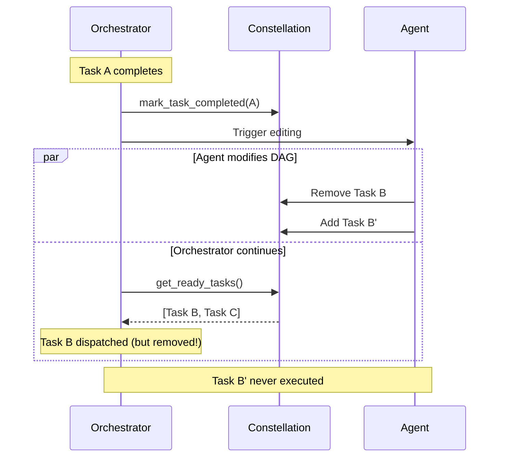
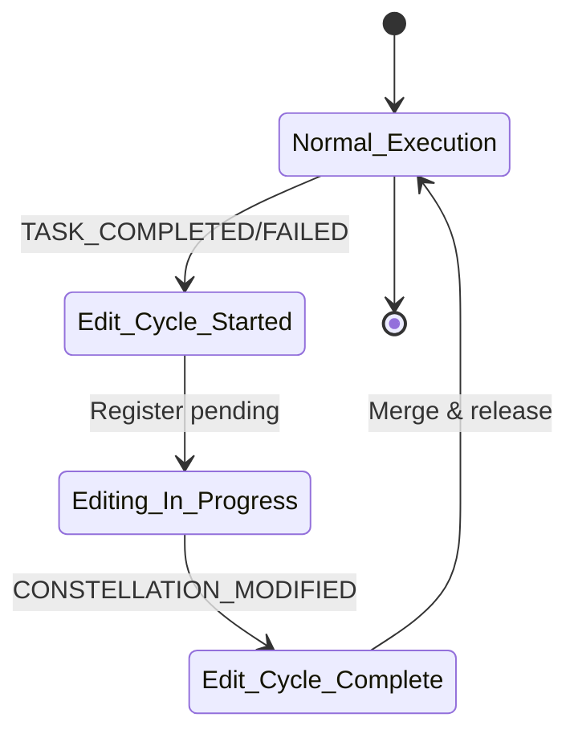

# Safe Assignment Locking

## Overview

While asynchronous execution maximizes efficiency, it introduces correctness challenges when task execution overlaps with DAG updates. The orchestrator must prevent race conditions where the Constellation Agent dynamically adds, removes, or rewires tasks during execution.

Without safeguards, a task could be dispatched based on a stale DAG, leading to duplicated execution, missed dependencies, or invalid state transitions.

To ensure atomicity, the orchestrator employs a safe assignment lock protocol combined with constellation state synchronization.


*An example of the safe assignment locking and event synchronization workflow. When multiple tasks complete simultaneously, the orchestrator locks assignments, batches modifications, and releases after synchronization.*

Learn more about how this integrates with [asynchronous scheduling](asynchronous_scheduling.md) and [batched editing](batched_editing.md).

## The Race Condition Problem

### Scenario Without Locking

Consider this problematic sequence:



**Problems:**

1. **Stale dispatch**: Task B dispatched after being removed
2. **Missing tasks**: Task B' never identified as ready
3. **Inconsistent state**: Constellation doesn't reflect actual execution

### Root Cause

The orchestrator's scheduling loop and agent's editing process are **concurrent and unsynchronized**:

```python
# Orchestrator loop (simplified)
while not constellation.is_complete():
    ready_tasks = constellation.get_ready_tasks()  # ← May see stale state
    await schedule_ready_tasks(ready_tasks)        # ← Dispatch based on stale view
    await wait_for_task_completion()
```

Meanwhile, the agent modifies the same constellation object concurrently.

## Safe Assignment Lock Protocol

### The Solution

The orchestrator uses a lock-bounded editing regime: during edit cycles, new task assignments are suspended until modifications are complete and synchronized.

```python
async def wait_for_pending_modifications(
    self, timeout: Optional[float] = None
) -> bool:
    """Wait for all pending modifications to complete."""
    
    if not self._pending_modifications:
        return True
    
    timeout = timeout or self._modification_timeout
    start_time = asyncio.get_event_loop().time()
    
    try:
        while self._pending_modifications:
            # Get current pending tasks
            pending_tasks = list(self._pending_modifications.keys())
            pending_futures = list(self._pending_modifications.values())
            
            self.logger.info(
                f"⏳ Waiting for {len(pending_tasks)} pending modification(s): {pending_tasks}"
            )
            
            # Calculate remaining timeout
            elapsed = asyncio.get_event_loop().time() - start_time
            remaining_timeout = timeout - elapsed
            
            if remaining_timeout <= 0:
                raise asyncio.TimeoutError()
            
            # Wait for all current pending modifications
            await asyncio.wait_for(
                asyncio.gather(*pending_futures, return_exceptions=True),
                timeout=remaining_timeout,
            )
            
            # Check if new modifications were added during the wait
            if not self._pending_modifications:
                break
            
            # Small delay to allow new registrations to settle
            await asyncio.sleep(0.01)
        
        self.logger.info("✅ All pending modifications completed")
        return True
        
    except asyncio.TimeoutError:
        pending = list(self._pending_modifications.keys())
        self.logger.warning(
            f"⚠️ Timeout waiting for modifications after {timeout}s. "
            f"Proceeding anyway. Pending: {pending}"
        )
        # Clear all pending modifications to prevent permanent deadlock
        self._pending_modifications.clear()
        return False
```

### Edit Cycle Lifecycle

An edit cycle is bounded by two events:

1. **Start**: `TASK_COMPLETED` or `TASK_FAILED` event published
2. **End**: `CONSTELLATION_MODIFIED` event published



During the editing phase, new task assignments are suspended to prevent race conditions.

### Safe Locking Protocol

The complete protocol ensures atomic constellation updates:

```
Algorithm: Safe Assignment Locking and Asynchronous Rescheduling Protocol

Input: Event stream E, current TaskConstellation C
Output: Consistent and updated C with newly scheduled ready tasks

while system is running do
    foreach event e ∈ E do
        if e is TASK_COMPLETED or TASK_FAILED then
            async enqueue(e)  // Record for processing
        end
    end
    
    acquire(assign_lock)  // Suspend new assignments
    
    while queue not empty do
        e ← dequeue()
        Δ ← invoke(ConstellationAgent, edit(C, e))  // Propose DAG edits
        C ← apply(C, Δ)                             // Update structure
        validate(C)                                  // Ensure invariants I1-I3
        publish(CONSTELLATION_MODIFIED, t)
        C ← synchronize(C, T_C)  // Merge completed tasks
    end
    
    release(assign_lock)  // Resume orchestration
    
    // Rescheduling Phase (outside lock)
    T_R ← get_ready_tasks(C)
    foreach t ∈ T_R do
        async dispatch(t)
        async publish(TASK_STARTED, t)
    end
end
```

**Key properties:**

- **Atomicity**: All edits within a queue batch are applied together
- **Validation**: Constellation consistency checked before releasing
- **Synchronization**: Runtime progress merged before rescheduling
- **Non-blocking**: Lock only held during modification, not execution

## Modification Synchronizer

The `ConstellationModificationSynchronizer` component implements the locking protocol by coordinating between the orchestrator and agent.

### Tracking Pending Modifications

When a task completes, the synchronizer registers a pending modification:

```python
async def _handle_task_event(self, event: TaskEvent) -> None:
    """Handle task completion/failure events."""
    
    if event.event_type not in [EventType.TASK_COMPLETED, EventType.TASK_FAILED]:
        return
    
    constellation_id = event.data.get("constellation_id")
    if not constellation_id:
        return
    
    # Register pending modification
    if event.task_id not in self._pending_modifications:
        modification_future = asyncio.Future()
        self._pending_modifications[event.task_id] = modification_future
        self._stats["total_modifications"] += 1
        
        self.logger.info(
            f"🔒 Registered pending modification for task '{event.task_id}'"
        )
        
        # Set timeout to auto-complete if modification takes too long
        asyncio.create_task(
            self._auto_complete_on_timeout(event.task_id, modification_future)
        )
```

**Data structure:**

```python
# task_id -> Future mapping
self._pending_modifications: Dict[str, asyncio.Future] = {}
```

Each future represents an edit cycle that will be completed when `CONSTELLATION_MODIFIED` is received.

### Completing Modifications

When the agent publishes `CONSTELLATION_MODIFIED`, the synchronizer completes the future:

```python
async def _handle_constellation_event(self, event: ConstellationEvent) -> None:
    """Handle constellation modification events."""
    
    if event.event_type != EventType.CONSTELLATION_MODIFIED:
        return
    
    task_ids = event.data.get("on_task_id")
    if not task_ids:
        return
    
    new_constellation = event.data.get("new_constellation")
    if new_constellation:
        self._current_constellation = new_constellation
    
    # Mark modifications as complete
    for task_id in task_ids:
        if task_id in self._pending_modifications:
            future = self._pending_modifications[task_id]
            if not future.done():
                future.set_result(True)  # Unblocks wait_for_pending_modifications
                self._stats["completed_modifications"] += 1
                self.logger.info(
                    f"✅ Completed modification for task '{task_id}'"
                )
            del self._pending_modifications[task_id]
```

### Timeout Protection

To prevent deadlocks if the agent fails to publish `CONSTELLATION_MODIFIED`:

```python
async def _auto_complete_on_timeout(
    self, task_id: str, future: asyncio.Future
) -> None:
    """Auto-complete a pending modification if it times out."""
    
    try:
        await asyncio.sleep(self._modification_timeout)  # Default: 600s
        
        if not future.done():
            self._stats["timeout_modifications"] += 1
            self.logger.warning(
                f"⚠️ Modification for task '{task_id}' timed out. "
                f"Auto-completing to prevent deadlock."
            )
            future.set_result(False)
            if task_id in self._pending_modifications:
                del self._pending_modifications[task_id]
    except asyncio.CancelledError:
        raise
```

**Warning:** Timeout protection ensures the orchestrator never permanently blocks, even if the agent encounters an error.

## Constellation State Merging

After modifications complete, the synchronizer must merge two potentially conflicting views:

1. **Agent's constellation**: Has latest structural changes (new tasks, modified dependencies)
2. **Orchestrator's constellation**: Has latest execution state (task statuses, results)

### The Challenge

During editing, tasks may complete:

```
t0: Task A completes → Agent starts editing
t1: Agent modifies constellation (Task A still RUNNING in agent's copy)
t2: Task B completes (orchestrator marks as COMPLETED)
t3: Agent publishes CONSTELLATION_MODIFIED
t4: Orchestrator syncs...
```

**Problem**: Direct replacement would lose Task B's COMPLETED status!

### State Merging Algorithm

The synchronizer preserves the most advanced state for each task:

```python
def merge_and_sync_constellation_states(
    self, orchestrator_constellation: TaskConstellation
) -> TaskConstellation:
    """Merge constellation states: structural changes + execution state."""
    
    if not self._current_constellation:
        return orchestrator_constellation
    
    # Use agent's constellation as base (has structural modifications)
    merged = self._current_constellation
    
    # Preserve execution state from orchestrator for existing tasks
    for task_id, orchestrator_task in orchestrator_constellation.tasks.items():
        if task_id in merged.tasks:
            agent_task = merged.tasks[task_id]
            
            # If orchestrator's state is more advanced, preserve it
            if self._is_state_more_advanced(
                orchestrator_task.status, agent_task.status
            ):
                # Preserve orchestrator's state and results
                agent_task._status = orchestrator_task.status
                agent_task._result = orchestrator_task.result
                agent_task._error = orchestrator_task.error
                agent_task._execution_start_time = orchestrator_task.execution_start_time
                agent_task._execution_end_time = orchestrator_task.execution_end_time
    
    # Update constellation state
    merged.update_state()
    
    return merged
```

### State Advancement Hierarchy

States are ordered by execution progression:

```python
def _is_state_more_advanced(self, state1, state2) -> bool:
    """Check if state1 is more advanced than state2."""
    
    state_levels = {
        TaskStatus.PENDING: 0,
        TaskStatus.WAITING_DEPENDENCY: 1,
        TaskStatus.RUNNING: 2,
        TaskStatus.COMPLETED: 3,
        TaskStatus.FAILED: 3,      # Terminal states equally advanced
        TaskStatus.CANCELLED: 3,
    }
    
    level1 = state_levels.get(state1, 0)
    level2 = state_levels.get(state2, 0)
    
    return level1 > level2
```

**Examples:**

- `COMPLETED > RUNNING`: Preserve orchestrator's COMPLETED status
- `FAILED > PENDING`: Preserve orchestrator's FAILED status
- `RUNNING > PENDING`: Preserve orchestrator's RUNNING status
- `COMPLETED = FAILED`: Both terminal, don't override

State merging ensures no execution progress is lost during concurrent editing.

## Synchronization in Orchestration Loop

The orchestrator syncs at the start of each iteration:

```python
async def _sync_constellation_modifications(
    self, constellation: TaskConstellation
) -> TaskConstellation:
    """Synchronize pending constellation modifications."""
    
    if self._modification_synchronizer:
        # Wait for agent to finish any pending edits
        await self._modification_synchronizer.wait_for_pending_modifications()
        
        # Merge agent's structural changes with orchestrator's execution state
        constellation = self._modification_synchronizer \
            .merge_and_sync_constellation_states(
                orchestrator_constellation=constellation,
            )
    
    return constellation
```

The synchronization flow ensures the orchestrator always works with the latest merged state that includes both structural changes from the agent and execution progress from the orchestrator.

## Batched Event Processing

When multiple tasks complete simultaneously, their modifications are batched:

```python
# Process ALL pending modifications in one cycle
while self._pending_modifications:
    # Wait for all to complete
    ...
```

**Timeline with batching:**

```
t0: Task A completes → enqueue(A)
t3: Task B completes → enqueue(B)
t4: Task C completes → enqueue(C)

t5: acquire(lock)
t6: Process A → Δ_A
t7: Process B → Δ_B
t8: Process C → Δ_C
t9: Apply all Δs atomically
t10: release(lock)
```

**Benefits:**

- **Reduced overhead**: One lock acquisition for multiple edits
- **Atomicity**: All modifications visible together
- **Efficiency**: Amortize validation and synchronization costs

Learn more about [batched editing strategies](batched_editing.md).

## Correctness Properties

The safe assignment lock protocol guarantees:

**1. Atomicity**: Edit cycles are atomic - either all modifications in a batch are applied, or none are. Lock held during entire edit-validate-sync sequence.

**2. Consistency**: Constellation always satisfies invariants after edits. Validation performed before releasing. See [consistency guarantees](consistency_guarantees.md) for details.

**3. Progress**: The system never permanently blocks (liveness). Ensured by timeout protection (600s default), auto-completion on timeout, and exception handling in observers.

## Performance Impact

### Lock Overhead

| Scenario | Lock Duration | Impact |
|----------|--------------|---------|
| Single task completion | 10-50ms | Negligible - concurrent tasks unaffected |
| Batched completions | 50-200ms | Amortized over multiple edits |
| Complex editing | 200-500ms | Depends on LLM response time |

### Throughput Analysis

The lock does not block task execution - while the lock is held for constellation modification, already-dispatched tasks continue executing concurrently.

**Impact on throughput**: Minimal - only affects scheduling of new tasks, not execution of running tasks.

### Latency Analysis

Additional latency per task completion:

- Without synchronizer: ~5ms (direct scheduling)
- With synchronizer: ~10-50ms (wait for edit + merge)

This is an acceptable tradeoff for correctness in dynamic orchestration.

## Usage Patterns

### Setting Up Synchronization

```python
from galaxy.constellation.orchestrator import TaskConstellationOrchestrator
from galaxy.session.observers.constellation_sync_observer import (
    ConstellationModificationSynchronizer
)

# Create orchestrator
orchestrator = TaskConstellationOrchestrator(device_manager)

# Create and attach synchronizer
synchronizer = ConstellationModificationSynchronizer(orchestrator)
orchestrator.set_modification_synchronizer(synchronizer)

# Subscribe to events
from galaxy.core.events import get_event_bus
event_bus = get_event_bus()
event_bus.subscribe(synchronizer)

# Orchestrate with synchronization
results = await orchestrator.orchestrate_constellation(constellation)
```

### Custom Timeout

```python
# Increase timeout for slow LLM responses
synchronizer.set_modification_timeout(1200.0)  # 20 minutes
```

### Monitoring Synchronization

```python
# Check pending modifications
if synchronizer.has_pending_modifications():
    pending = synchronizer.get_pending_task_ids()
    print(f"Waiting for modifications: {pending}")

# Get statistics
stats = synchronizer.get_statistics()
print(f"Total: {stats['total_modifications']}")
print(f"Completed: {stats['completed_modifications']}")
print(f"Timeouts: {stats['timeout_modifications']}")
```

## Related Documentation

- [Asynchronous Scheduling](asynchronous_scheduling.md) - Concurrent execution model
- [Consistency Guarantees](consistency_guarantees.md) - Invariants enforced by locking
- [Batched Editing](batched_editing.md) - Efficient modification batching
- [Event-Driven Coordination](event_driven_coordination.md) - Event system foundation
