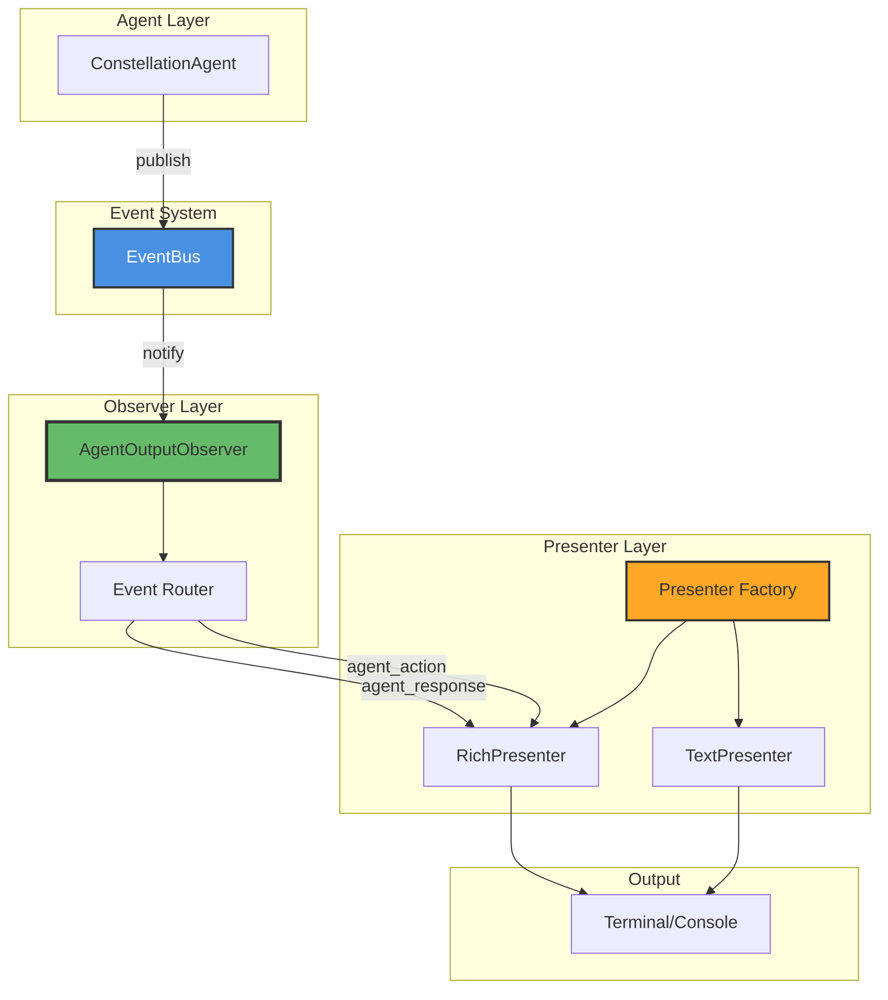
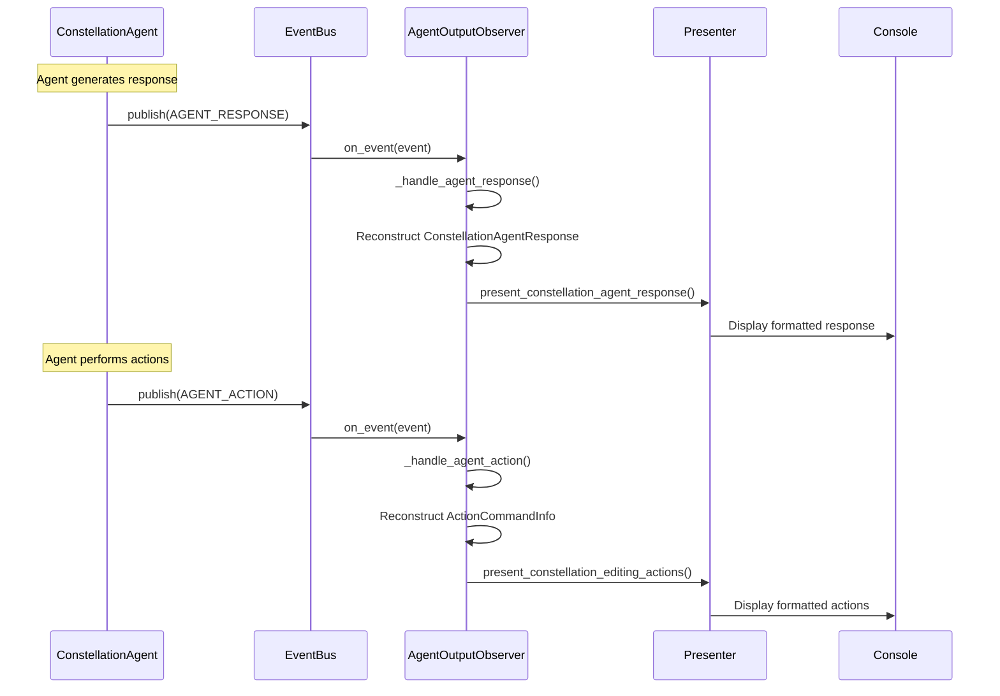

# Agent Output Observer

The **AgentOutputObserver** handles real-time display of agent responses and actions. It listens for agent interaction events and delegates the actual presentation logic to specialized presenters, providing a clean separation between event handling and output formatting.

**Location:** `galaxy/session/observers/agent_output_observer.py`

## Purpose

The Agent Output Observer enables:

- **Real-time Feedback** — Display agent thinking and decision-making process
- **Action Visibility** — Show what actions the agent is taking
- **Debugging** — Understand agent behavior during constellation execution
- **User Engagement** — Keep users informed of progress and decisions

## Architecture

The observer uses a **presenter pattern** for flexible output formatting:



**Component Responsibilities:**

| Component | Role | Description |
|-----------|------|-------------|
| **Agent** | Event publisher | Publishes AGENT_RESPONSE and AGENT_ACTION events |
| **AgentOutputObserver** | Event handler | Receives and routes agent events |
| **Presenter** | Output formatter | Formats and displays agent output |
| **PresenterFactory** | Creator | Creates appropriate presenter based on type |

## Handled Events

The observer handles two types of agent events:

### 1. AGENT_RESPONSE

Triggered when agent generates responses (thoughts, plans, reasoning):

**Event Data Structure:**

```python
{
    "agent_name": "constellation_agent",
    "agent_type": "constellation",
    "output_type": "response",
    "output_data": {
        # ConstellationAgentResponse fields
        "thought": "Task 1 completed successfully...",
        "plan": "Next, I will process the results...",
        "operation": "EDIT",
        "observation": "Task result shows...",
        # ... other fields
    },
    "print_action": False  # Whether to print action details
}
```

### 2. AGENT_ACTION

Triggered when agent executes actions (constellation editing):

**Event Data Structure:**

```python
{
    "agent_name": "constellation_agent",
    "agent_type": "constellation",
    "output_type": "action",
    "output_data": {
        "action_type": "constellation_editing",
        "actions": [
            {
                "name": "add_task",
                "arguments": {
                    "task_id": "new_task_1",
                    "description": "Process attachment",
                    # ...
                }
            },
            # ... more actions
        ]
    }
}
```

## Implementation

### Initialization

```python
from galaxy.session.observers import AgentOutputObserver

# Create agent output observer with default Rich presenter
agent_output_observer = AgentOutputObserver(presenter_type="rich")

# Subscribe to event bus
from galaxy.core.events import get_event_bus
event_bus = get_event_bus()
event_bus.subscribe(agent_output_observer)
```

**Constructor Parameters:**

| Parameter | Type | Default | Description |
|-----------|------|---------|-------------|
| `presenter_type` | `str` | `"rich"` | Type of presenter ("rich", "text", etc.) |

### Presenter Types

The observer supports different presenter types for various output formats:

| Presenter Type | Description | Use Case |
|----------------|-------------|----------|
| `"rich"` | Rich terminal formatting with colors and boxes | Interactive terminal use |
| `"text"` | Plain text output | Log files, CI/CD, simple terminals |

## Output Examples

### Agent Response Display

When the agent generates a response, the Rich presenter displays:

```
╭─────────────────────────────────────────────────────────────╮
│ 🤖 Agent Response                                           │
├─────────────────────────────────────────────────────────────┤
│ Thought:                                                    │
│ Task 'fetch_emails' has completed successfully. I need to  │
│ analyze the results and determine next steps.              │
│                                                             │
│ Plan:                                                       │
│ I will extract the email count from the result and create  │
│ parallel parsing tasks for each email.                     │
│                                                             │
│ Operation: EDIT                                             │
│                                                             │
│ Observation:                                                │
│ Result shows 3 emails were fetched. I will create 3        │
│ parsing tasks with dependencies on the fetch task.         │
╰─────────────────────────────────────────────────────────────╯
```

### Agent Action Display

When the agent performs constellation editing:

```
╭─────────────────────────────────────────────────────────────╮
│ 🛠️ Agent Actions: Constellation Editing                     │
├─────────────────────────────────────────────────────────────┤
│ Action 1: add_task                                          │
│   ├─ task_id: parse_email_1                                │
│   ├─ description: Parse the first email                    │
│   ├─ target_device_id: windows_pc_001                      │
│   └─ priority: MEDIUM                                       │
│                                                             │
│ Action 2: add_task                                          │
│   ├─ task_id: parse_email_2                                │
│   ├─ description: Parse the second email                   │
│   ├─ target_device_id: windows_pc_001                      │
│   └─ priority: MEDIUM                                       │
│                                                             │
│ Action 3: add_dependency                                    │
│   ├─ from_task_id: fetch_emails                            │
│   ├─ to_task_id: parse_email_1                             │
│   └─ dependency_type: SUCCESS_ONLY                         │
│                                                             │
│ Action 4: add_dependency                                    │
│   ├─ from_task_id: fetch_emails                            │
│   ├─ to_task_id: parse_email_2                             │
│   └─ dependency_type: SUCCESS_ONLY                         │
╰─────────────────────────────────────────────────────────────╯
```

## Event Processing Flow



## API Reference

### Constructor

```python
def __init__(self, presenter_type: str = "rich")
```

Initialize the agent output observer with specified presenter type.

**Parameters:**

- `presenter_type` — Type of presenter to use ("rich", "text", etc.)

**Example:**

```python
# Use Rich presenter (default)
rich_observer = AgentOutputObserver(presenter_type="rich")

# Use plain text presenter
text_observer = AgentOutputObserver(presenter_type="text")
```

### Event Handler

```python
async def on_event(self, event: Event) -> None
```

Handle agent output events.

**Parameters:**

- `event` — Event instance (must be AgentEvent)

**Behavior:**

- Filters for `AgentEvent` instances
- Routes to appropriate handler based on event type
- Reconstructs response/action objects from event data
- Delegates display to presenter

## Usage Examples

### Example 1: Basic Setup

```python
from galaxy.core.events import get_event_bus
from galaxy.session.observers import AgentOutputObserver

# Create and subscribe agent output observer
agent_output_observer = AgentOutputObserver(presenter_type="rich")
event_bus = get_event_bus()
event_bus.subscribe(agent_output_observer)

# Agent events will now be displayed automatically
await orchestrator.execute_constellation(constellation)

# Clean up
event_bus.unsubscribe(agent_output_observer)
```

### Example 2: Conditional Display

```python
async def execute_with_agent_feedback(show_agent_output: bool = True):
    """Execute constellation with optional agent output display."""
    
    event_bus = get_event_bus()
    
    if show_agent_output:
        agent_output_observer = AgentOutputObserver(presenter_type="rich")
        event_bus.subscribe(agent_output_observer)
    
    try:
        await orchestrator.execute_constellation(constellation)
    finally:
        if show_agent_output:
            event_bus.unsubscribe(agent_output_observer)
```

### Example 3: Different Presenters for Different Modes

```python
import sys

def create_agent_observer():
    """Create appropriate agent observer based on environment."""
    
    # Use Rich presenter for interactive terminal
    if sys.stdout.isatty():
        return AgentOutputObserver(presenter_type="rich")
    
    # Use text presenter for logs/CI
    else:
        return AgentOutputObserver(presenter_type="text")

# Usage
agent_output_observer = create_agent_observer()
event_bus.subscribe(agent_output_observer)
```

### Example 4: Custom Filtering

```python
from galaxy.core.events import EventType

# Subscribe only to specific agent events
event_bus.subscribe(
    agent_output_observer,
    {EventType.AGENT_ACTION}  # Only show actions, not responses
)
```

## Implementation Details

### Response Handling

The observer reconstructs `ConstellationAgentResponse` from event data:

```python
async def _handle_agent_response(self, event: AgentEvent) -> None:
    """Handle agent response event."""
    
    try:
        output_data = event.output_data
        
        if event.agent_type == "constellation":
            # Reconstruct ConstellationAgentResponse from output data
            response = ConstellationAgentResponse.model_validate(output_data)
            print_action = output_data.get("print_action", False)
            
            # Use presenter to display the response
            self.presenter.present_constellation_agent_response(
                response, 
                print_action=print_action
            )
    
    except Exception as e:
        self.logger.error(f"Error handling agent response: {e}")
```

### Action Handling

The observer reconstructs action command objects:

```python
async def _handle_agent_action(self, event: AgentEvent) -> None:
    """Handle agent action event."""
    
    try:
        output_data = event.output_data
        
        if output_data.get("action_type") == "constellation_editing":
            actions_data = output_data.get("actions", [])
            
            # Convert each action dict to ActionCommandInfo
            action_objects = []
            for action_dict in actions_data:
                action_obj = ActionCommandInfo.model_validate(action_dict)
                action_objects.append(action_obj)
            
            # Create ListActionCommandInfo with reconstructed actions
            actions = ListActionCommandInfo(actions=action_objects)
            
            # Use presenter to display the actions
            self.presenter.present_constellation_editing_actions(actions)
    
    except Exception as e:
        self.logger.error(f"Error handling agent action: {e}")
```

## Best Practices

### 1. Match Presenter to Environment

```python
# ✅ Good: Choose presenter based on context
if running_in_jupyter:
    presenter_type = "rich"  # Good for notebooks
elif running_in_ci:
    presenter_type = "text"  # Good for logs
elif is_interactive_terminal:
    presenter_type = "rich"  # Good for terminal
else:
    presenter_type = "text"  # Safe default
```

### 2. Selective Event Subscription

```python
# Only show actions (skip verbose responses)
event_bus.subscribe(
    agent_output_observer,
    {EventType.AGENT_ACTION}
)

# Show everything (responses + actions)
event_bus.subscribe(agent_output_observer)
```

### 3. Handle Errors Gracefully

The observer includes comprehensive error handling:

```python
try:
    # Process agent event
    await self._handle_agent_response(event)
except Exception as e:
    self.logger.error(f"Error handling agent output event: {e}")
    # Don't re-raise - continue observing other events
```

## Integration with Agent

The observer integrates with the ConstellationAgent's state machine:

### Agent Publishes Events

The agent publishes events at key points:

```python
class ConstellationAgent:
    async def generate_response(self):
        """Generate agent response and publish event."""
        
        # Generate response using LLM
        response = await self._llm_call(...)
        
        # Publish AGENT_RESPONSE event
        await self._publish_agent_response_event(response)
        
        return response
    
    async def execute_actions(self, actions):
        """Execute actions and publish event."""
        
        # Publish AGENT_ACTION event
        await self._publish_agent_action_event(actions)
        
        # Actually execute the actions
        result = await self._execute_constellation_editing(actions)
        
        return result
```

## Performance Considerations

### Display Overhead

The observer adds minimal overhead:

- **Event processing**: < 1ms per event
- **Rich rendering**: 5-10ms per display
- **Text rendering**: < 1ms per display

### Optimization for Large Outputs

```python
# For very verbose agents, consider:

# 1. Use text presenter instead of rich
agent_output_observer = AgentOutputObserver(presenter_type="text")

# 2. Subscribe only to actions
event_bus.subscribe(
    agent_output_observer,
    {EventType.AGENT_ACTION}
)

# 3. Disable in production
if not debug_mode:
    # Don't create or subscribe observer
    pass
```

## Related Documentation

- **[Observer System Overview](overview.md)** — Architecture and design
- **[Progress Observer](progress_observer.md)** — Task completion coordination
- **[Constellation Agent](../constellation_agent/overview.md)** — Agent implementation and state machine

## Summary

The Agent Output Observer:

- **Displays** agent responses and actions in real-time
- **Delegates** to presenters for flexible formatting
- **Supports** multiple output formats (Rich, text)
- **Provides** transparency into agent decision-making
- **Enables** debugging and user engagement

This observer is essential for understanding agent behavior during constellation execution, providing visibility into the AI's thought process and actions.
