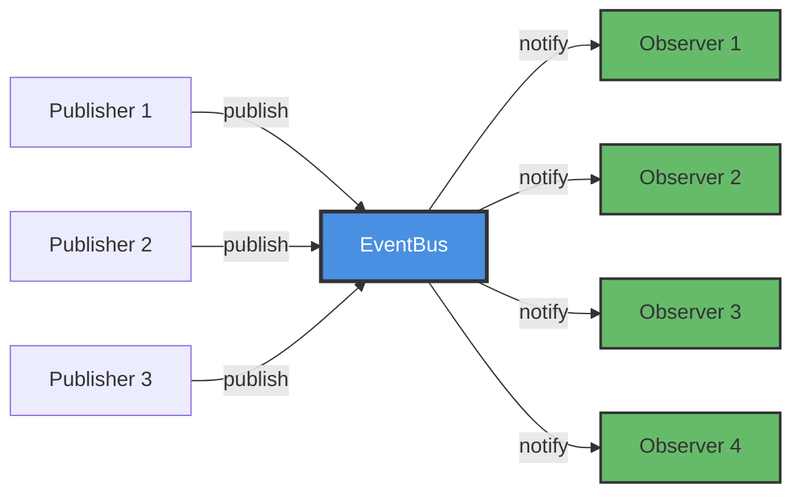
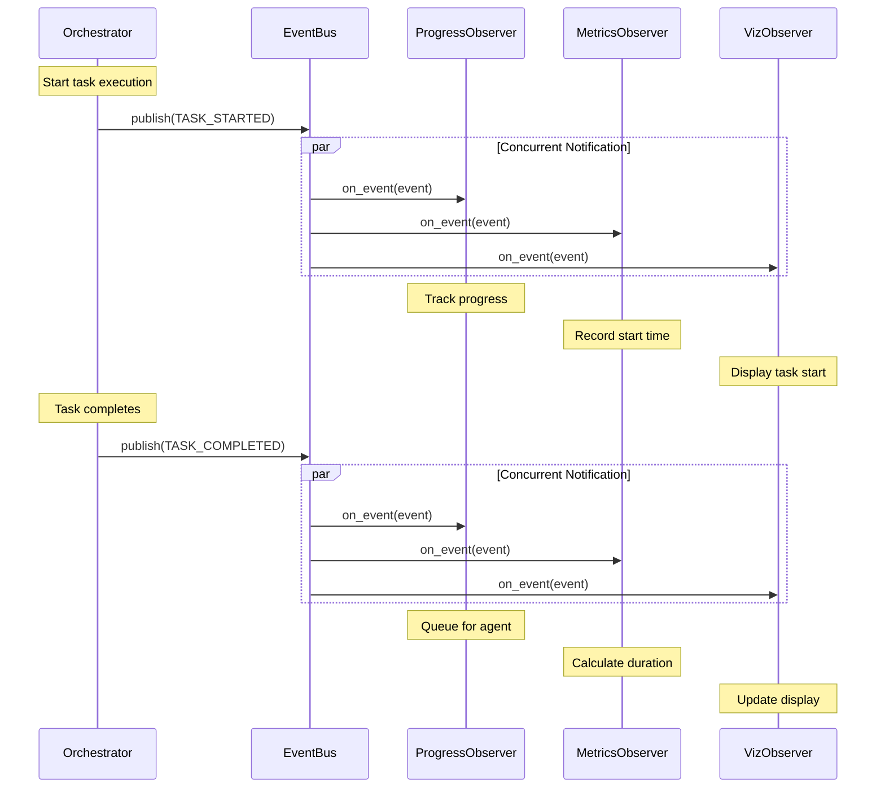
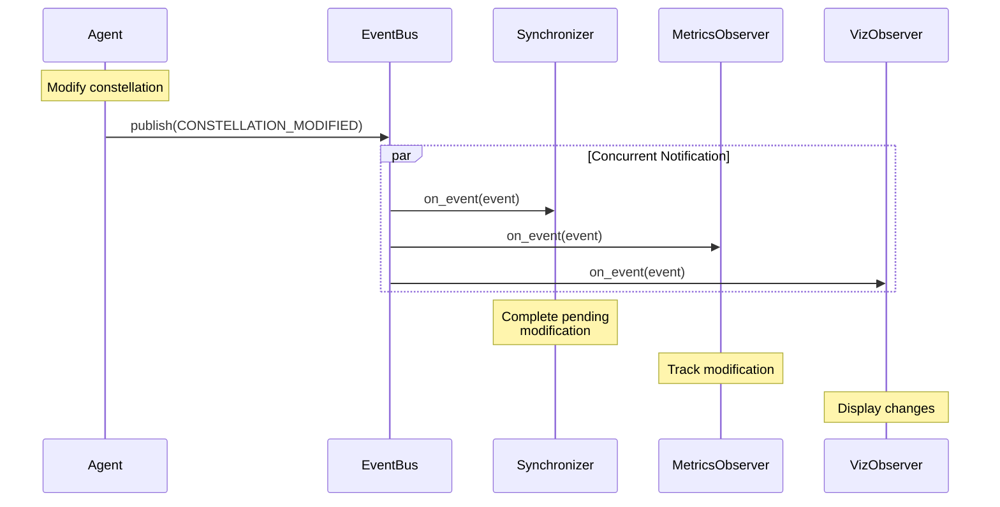

# Event System Core

The Event System Core provides the foundational infrastructure for event-driven communication in the Galaxy framework. It implements the Observer pattern through a central event bus, type-safe event classes, and well-defined interfaces.

**Location:** `galaxy/core/events.py`

---

## 📦 Core Components

### EventBus — Central Message Broker

The `EventBus` class is the heart of the event system, managing subscriptions and distributing events to all registered observers.



**Key Features:**

- **Singleton Pattern**: Single global instance accessed via `get_event_bus()`
- **Type-based Filtering**: Observers can subscribe to specific event types or all events
- **Concurrent Notification**: All observers notified in parallel using `asyncio.gather()`
- **Error Isolation**: Exceptions in one observer don't affect others

### Event Types

`EventType` enumeration defines all possible events in the system:

```python
class EventType(Enum):
    # Task-level events
    TASK_STARTED = "task_started"
    TASK_COMPLETED = "task_completed"
    TASK_FAILED = "task_failed"
    
    # Constellation lifecycle events
    CONSTELLATION_STARTED = "constellation_started"
    CONSTELLATION_COMPLETED = "constellation_completed"
    CONSTELLATION_FAILED = "constellation_failed"
    
    # Structure modification events
    CONSTELLATION_MODIFIED = "constellation_modified"
    
    # Agent output events
    AGENT_RESPONSE = "agent_response"
    AGENT_ACTION = "agent_action"
    
    # Device events
    DEVICE_CONNECTED = "device_connected"
    DEVICE_DISCONNECTED = "device_disconnected"
    DEVICE_STATUS_CHANGED = "device_status_changed"
```

### Event Classes

Five specialized event types provide type-safe event handling:

| Event Class | Extends | Additional Fields | Use Case |
|-------------|---------|-------------------|----------|
| `Event` | (base) | `event_type`, `source_id`, `timestamp`, `data` | Generic events |
| `TaskEvent` | `Event` | `task_id`, `status`, `result`, `error` | Task execution events |
| `ConstellationEvent` | `Event` | `constellation_id`, `constellation_state`, `new_ready_tasks` | Constellation lifecycle events |
| `AgentEvent` | `Event` | `agent_name`, `agent_type`, `output_type`, `output_data` | Agent interaction events |
| `DeviceEvent` | `Event` | `device_id`, `device_status`, `device_info`, `all_devices` | Device management events |

---

## 🔌 Interfaces

### IEventObserver

Defines the contract for all observer implementations:

```python
from abc import ABC, abstractmethod
from galaxy.core.events import Event

class IEventObserver(ABC):
    """Interface for event observers."""
    
    @abstractmethod
    async def on_event(self, event: Event) -> None:
        """
        Handle an event.
        
        :param event: The event object containing type, source, timestamp and data
        """
        pass
```

**Implementation Pattern:**

```python
class MyCustomObserver(IEventObserver):
    """Custom observer implementation."""
    
    async def on_event(self, event: Event) -> None:
        """Handle events of interest."""
        
        # Type-safe handling using isinstance
        if isinstance(event, TaskEvent):
            await self._handle_task_event(event)
        elif isinstance(event, ConstellationEvent):
            await self._handle_constellation_event(event)
    
    async def _handle_task_event(self, event: TaskEvent) -> None:
        """Process task events."""
        if event.event_type == EventType.TASK_COMPLETED:
            print(f"Task {event.task_id} completed with status: {event.status}")
    
    async def _handle_constellation_event(self, event: ConstellationEvent) -> None:
        """Process constellation events."""
        if event.event_type == EventType.CONSTELLATION_STARTED:
            print(f"Constellation {event.constellation_id} started")
```

### IEventPublisher

Defines the contract for event publishing:

```python
class IEventPublisher(ABC):
    """Interface for event publishers."""
    
    @abstractmethod
    def subscribe(self, observer: IEventObserver, 
                  event_types: Set[EventType] = None) -> None:
        """Subscribe an observer to events."""
        pass
    
    @abstractmethod
    def unsubscribe(self, observer: IEventObserver) -> None:
        """Unsubscribe an observer."""
        pass
    
    @abstractmethod
    async def publish_event(self, event: Event) -> None:
        """Publish an event to subscribers."""
        pass
```

---

## 📖 EventBus API Reference

### Subscription Management

#### subscribe()

Subscribe an observer to receive event notifications:

```python
def subscribe(
    self, 
    observer: IEventObserver, 
    event_types: Set[EventType] = None
) -> None
```

**Parameters:**

- `observer`: The observer object implementing `IEventObserver`
- `event_types`: Optional set of event types to subscribe to (None = all events)

**Examples:**

```python
from galaxy.core.events import get_event_bus, EventType

event_bus = get_event_bus()

# Subscribe to all events
event_bus.subscribe(my_observer)

# Subscribe to specific event types
event_bus.subscribe(my_observer, {
    EventType.TASK_COMPLETED,
    EventType.TASK_FAILED
})

# Subscribe to constellation events only
event_bus.subscribe(constellation_observer, {
    EventType.CONSTELLATION_STARTED,
    EventType.CONSTELLATION_COMPLETED,
    EventType.CONSTELLATION_MODIFIED
})
```

#### unsubscribe()

Remove an observer from all event subscriptions:

```python
def unsubscribe(self, observer: IEventObserver) -> None
```

**Parameters:**

- `observer`: The observer object to unsubscribe

**Example:**

```python
# Clean up observer when done
event_bus.unsubscribe(my_observer)
```

### Event Publishing

#### publish_event()

Publish an event to all subscribed observers:

```python
async def publish_event(self, event: Event) -> None
```

**Parameters:**

- `event`: The event object to publish

**Example:**

```python
from galaxy.core.events import TaskEvent, EventType
import time

# Create and publish a task event
event = TaskEvent(
    event_type=EventType.TASK_COMPLETED,
    source_id="orchestrator",
    timestamp=time.time(),
    data={
        "execution_time": 2.5,
        "newly_ready_tasks": ["task_2", "task_3"]
    },
    task_id="task_1",
    status="COMPLETED",
    result={"output": "success"}
)

await event_bus.publish_event(event)
```

**Concurrent Notification**: The event bus notifies all observers concurrently using `asyncio.gather()` with `return_exceptions=True`. This means:

- All observers receive events in parallel
- Slow observers don't block fast ones
- Exceptions in one observer don't affect others
- The `publish_event()` call returns after all observers have processed the event

---

## 🔄 Event Flow Patterns

### Pattern 1: Task Execution Flow

This pattern shows how task events flow through the system:



### Pattern 2: Constellation Modification Flow

This pattern shows how modification events coordinate agent and orchestrator:



---

## 💻 Usage Examples

### Example 1: Basic Event Publishing

```python
import asyncio
import time
from galaxy.core.events import (
    get_event_bus, Event, EventType, IEventObserver
)

class SimpleLogger(IEventObserver):
    """Simple observer that logs all events."""
    
    async def on_event(self, event: Event) -> None:
        print(f"[{event.timestamp}] {event.event_type.value} from {event.source_id}")

async def main():
    # Get event bus and subscribe observer
    event_bus = get_event_bus()
    logger = SimpleLogger()
    event_bus.subscribe(logger)
    
    # Publish some events
    for i in range(3):
        event = Event(
            event_type=EventType.TASK_STARTED,
            source_id="test_publisher",
            timestamp=time.time(),
            data={"iteration": i}
        )
        await event_bus.publish_event(event)
        await asyncio.sleep(0.1)
    
    # Clean up
    event_bus.unsubscribe(logger)

asyncio.run(main())
```

### Example 2: Type-Specific Subscription

```python
from galaxy.core.events import (
    get_event_bus, TaskEvent, ConstellationEvent, 
    EventType, IEventObserver
)

class TaskOnlyObserver(IEventObserver):
    """Observer that only handles task events."""
    
    def __init__(self):
        self.task_count = 0
        self.completed_tasks = []
    
    async def on_event(self, event: Event) -> None:
        if isinstance(event, TaskEvent):
            self.task_count += 1
            
            if event.event_type == EventType.TASK_COMPLETED:
                self.completed_tasks.append(event.task_id)
                print(f"Task {event.task_id} completed. "
                      f"Total: {len(self.completed_tasks)}")

# Subscribe only to task events
observer = TaskOnlyObserver()
event_bus = get_event_bus()
event_bus.subscribe(observer, {
    EventType.TASK_STARTED,
    EventType.TASK_COMPLETED,
    EventType.TASK_FAILED
})
```

### Example 3: Custom Metrics Collection

```python
from typing import Dict, List
from galaxy.core.events import (
    TaskEvent, ConstellationEvent, EventType, IEventObserver
)

class CustomMetricsCollector(IEventObserver):
    """Collect custom domain-specific metrics."""
    
    def __init__(self):
        self.task_durations: Dict[str, float] = {}
        self.task_start_times: Dict[str, float] = {}
        self.constellation_tasks: Dict[str, List[str]] = {}
    
    async def on_event(self, event: Event) -> None:
        if isinstance(event, TaskEvent):
            await self._handle_task_event(event)
        elif isinstance(event, ConstellationEvent):
            await self._handle_constellation_event(event)
    
    async def _handle_task_event(self, event: TaskEvent) -> None:
        if event.event_type == EventType.TASK_STARTED:
            self.task_start_times[event.task_id] = event.timestamp
        
        elif event.event_type == EventType.TASK_COMPLETED:
            if event.task_id in self.task_start_times:
                duration = event.timestamp - self.task_start_times[event.task_id]
                self.task_durations[event.task_id] = duration
    
    async def _handle_constellation_event(self, event: ConstellationEvent) -> None:
        if event.event_type == EventType.CONSTELLATION_STARTED:
            const_id = event.constellation_id
            self.constellation_tasks[const_id] = []
    
    def get_average_duration(self) -> float:
        """Calculate average task duration."""
        if not self.task_durations:
            return 0.0
        return sum(self.task_durations.values()) / len(self.task_durations)
    
    def get_slowest_tasks(self, n: int = 5) -> List[tuple]:
        """Get the n slowest tasks."""
        sorted_tasks = sorted(
            self.task_durations.items(),
            key=lambda x: x[1],
            reverse=True
        )
        return sorted_tasks[:n]
```

---

## ⚙️ Implementation Details

### Internal Observer Storage

The EventBus maintains two internal data structures:

```python
class EventBus(IEventPublisher):
    def __init__(self):
        # Type-specific observers: EventType -> Set[IEventObserver]
        self._observers: Dict[EventType, Set[IEventObserver]] = {}
        
        # Observers subscribed to all events
        self._all_observers: Set[IEventObserver] = set()
```

**Storage Strategy:**

| Subscription Type | Storage | Lookup Time | Use Case |
|-------------------|---------|-------------|----------|
| All events | `_all_observers` set | O(1) | General monitoring |
| Specific types | `_observers` dict | O(1) | Targeted handling |

### Concurrent Notification Logic

When an event is published, the bus:

1. **Collects relevant observers**: Combines type-specific and all-event observers
2. **Creates async tasks**: One task per observer
3. **Executes concurrently**: Uses `asyncio.gather()` with `return_exceptions=True`
4. **Isolates errors**: Exceptions don't propagate to other observers

```python
async def publish_event(self, event: Event) -> None:
    observers_to_notify: Set[IEventObserver] = set()
    
    # Add type-specific observers
    if event.event_type in self._observers:
        observers_to_notify.update(self._observers[event.event_type])
    
    # Add wildcard observers
    observers_to_notify.update(self._all_observers)
    
    # Notify concurrently
    if observers_to_notify:
        tasks = [observer.on_event(event) for observer in observers_to_notify]
        await asyncio.gather(*tasks, return_exceptions=True)
```

---

## 🎯 Best Practices

### 1. Use Type-Specific Subscriptions

Subscribe only to events you care about:

```python
# ❌ Bad: Receives all events, must filter manually
event_bus.subscribe(observer)

# ✅ Good: Receives only relevant events
event_bus.subscribe(observer, {
    EventType.TASK_COMPLETED,
    EventType.CONSTELLATION_MODIFIED
})
```

### 2. Handle Errors Gracefully

Always catch exceptions in observer implementations:

```python
class RobustObserver(IEventObserver):
    async def on_event(self, event: Event) -> None:
        try:
            await self._process_event(event)
        except Exception as e:
            self.logger.error(f"Error processing event: {e}")
            # Don't re-raise - other observers should continue
```

### 3. Clean Up Subscriptions

Unsubscribe observers when done to prevent memory leaks:

```python
class SessionManager:
    def __init__(self):
        self.observers = []
    
    def setup_observers(self):
        # Create and subscribe observers
        observer = MyObserver()
        event_bus.subscribe(observer)
        self.observers.append(observer)
    
    def cleanup(self):
        # Unsubscribe all observers
        event_bus = get_event_bus()
        for observer in self.observers:
            event_bus.unsubscribe(observer)
        self.observers.clear()
```

### 4. Use Type Guards

Leverage Python's type system for safer event handling:

```python
from typing import cast

async def on_event(self, event: Event) -> None:
    if isinstance(event, TaskEvent):
        # Type checker now knows event is TaskEvent
        task_event = cast(TaskEvent, event)
        task_id = task_event.task_id  # Type-safe access
        status = task_event.status
```

---

## 🔗 Related Documentation

- **[Observer System Overview](overview.md)** — High-level architecture and design
- **[Session Metrics Observer](metrics_observer.md)** — Performance metrics collection

!!! note "Additional Observer Documentation"
    For documentation on `ConstellationProgressObserver`, `DAGVisualizationObserver`, `ConstellationModificationSynchronizer`, and `AgentOutputObserver`, refer to their implementation in `galaxy/session/observers/`.

---

## 📋 Summary

The Event System Core provides:

- **EventBus**: Singleton message broker for system-wide communication
- **EventType**: Enumeration of all system events
- **Event Classes**: Type-safe event data structures
- **Interfaces**: Clear contracts for observers and publishers
- **Concurrent Execution**: Efficient parallel event processing
- **Error Isolation**: Robust error handling

This foundation enables the Galaxy framework to implement a loosely coupled, extensible event-driven architecture.
