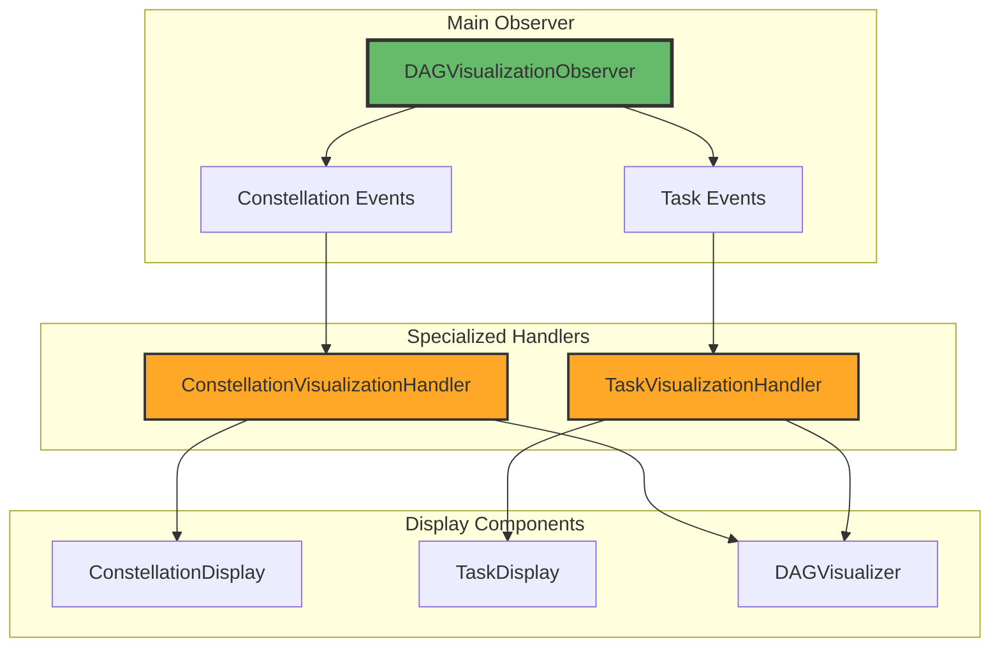
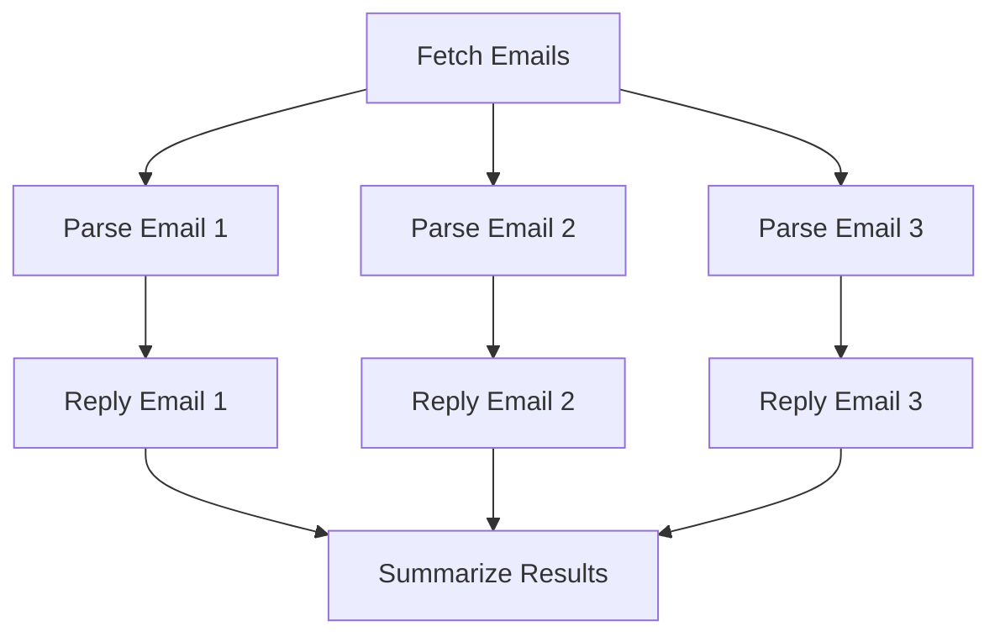
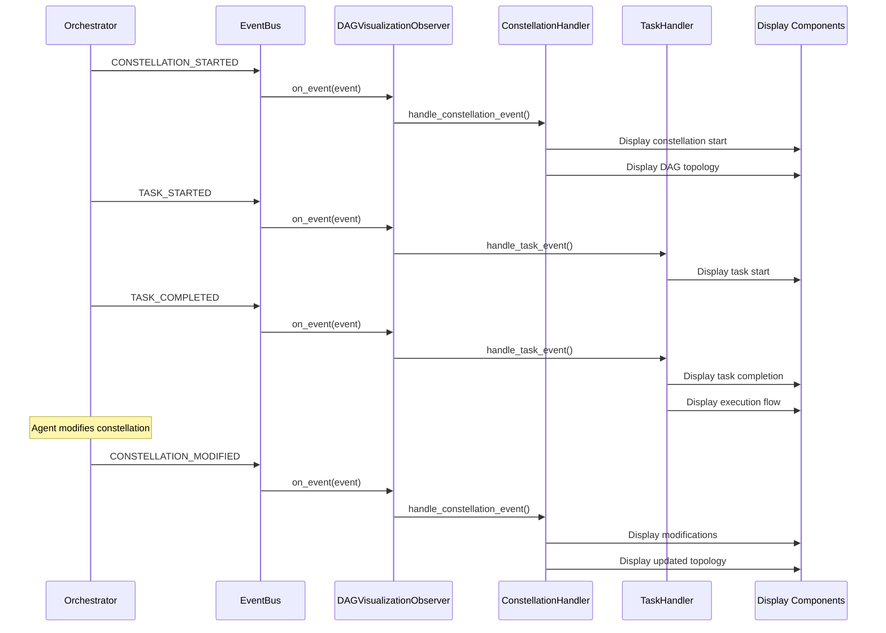

# DAG Visualization Observer

The **DAGVisualizationObserver** provides real-time visual feedback during constellation execution. It displays DAG topology, task progress, and constellation modifications using rich terminal graphics.

**Location:** `galaxy/session/observers/dag_visualization_observer.py`

## Purpose

The Visualization Observer enables developers and users to:

- **See DAG Structure** — View constellation topology and task dependencies
- **Monitor Progress** — Track task execution in real-time
- **Observe Modifications** — Visualize how the constellation changes
- **Debug Issues** — Identify bottlenecks and failed tasks visually

## Architecture

The observer uses a **delegation pattern** with specialized handlers:



**Component Responsibilities:**

| Component | Role | Handled Events |
|-----------|------|----------------|
| **DAGVisualizationObserver** | Main coordinator, routes events | All constellation and task events |
| **ConstellationVisualizationHandler** | Handles constellation-level displays | CONSTELLATION_STARTED, COMPLETED, MODIFIED |
| **TaskVisualizationHandler** | Handles task-level displays | TASK_STARTED, COMPLETED, FAILED |
| **DAGVisualizer** | Renders complex DAG visualizations | Used by handlers for topology |
| **ConstellationDisplay** | Renders constellation information | Used by handler for constellation events |
| **TaskDisplay** | Renders task information | Used by handler for task events |

## Implementation

### Initialization

```python
from galaxy.session.observers import DAGVisualizationObserver
from rich.console import Console

# Create visualization observer
viz_observer = DAGVisualizationObserver(
    enable_visualization=True,
    console=Console()  # Optional: provide custom console
)

# Subscribe to event bus
from galaxy.core.events import get_event_bus
event_bus = get_event_bus()
event_bus.subscribe(viz_observer)
```

**Constructor Parameters:**

| Parameter | Type | Default | Description |
|-----------|------|---------|-------------|
| `enable_visualization` | `bool` | `True` | Whether to enable visualization |
| `console` | `rich.Console` | `None` | Optional rich console for output |

### Disabling Visualization

Visualization can be toggled at runtime:

```python
# Disable visualization temporarily
viz_observer.set_visualization_enabled(False)

# Re-enable
viz_observer.set_visualization_enabled(True)
```

## Visualization Types

The observer produces several types of visualizations:

### 1. Constellation Started

Displays when a constellation begins execution:

```
╭──────────────────────────────────────────────────────────────╮
│ 🌟 Constellation Started: email_batch_constellation          │
├──────────────────────────────────────────────────────────────┤
│ ID: const_abc123                                             │
│ Total Tasks: 8                                               │
│ Status: ACTIVE                                               │
│ Parallel Capacity: 3                                         │
╰──────────────────────────────────────────────────────────────╯
```

Followed by DAG topology:



### 2. Task Progress

Displays task execution events:

**Task Started:**
```
▶ Task Started: parse_email_1
  └─ Type: parse_email
  └─ Device: windows_pc_001
  └─ Priority: MEDIUM
```

**Task Completed:**
```
✅ Task Completed: parse_email_1
   Duration: 2.3s
   Result: Parsed 1 email with 2 attachments
   Newly Ready: [reply_email_1]
```

**Task Failed:**
```
❌ Task Failed: parse_email_2
   Duration: 1.8s
   Error: NetworkTimeout: Failed to connect to email server
   Retry: 1/3
   Newly Ready: []
```

### 3. Constellation Modified

Shows structural changes to the constellation:

```
🔄 Constellation Modified: email_batch_constellation
   Modification Type: add_tasks
   On Task: parse_email_1
   
   Changes:
   ├─ Tasks Added: 2
   │  └─ extract_attachment_1
   │  └─ extract_attachment_2
   ├─ Dependencies Added: 2
   │  └─ parse_email_1 → extract_attachment_1
   │  └─ parse_email_1 → extract_attachment_2
   └─ Tasks Modified: 1
      └─ reply_email_1 (dependencies updated)
```

Followed by updated DAG topology showing new tasks.

### 4. Execution Flow

Shows current execution state (for smaller constellations):

```
Execution Flow:
┏━━━━━━━━━━━━━━━━━┳━━━━━━━━━━━┳━━━━━━━━━┳━━━━━━━━━━┓
┃ Task ID         ┃ Status    ┃ Device  ┃ Duration ┃
┡━━━━━━━━━━━━━━━━━╇━━━━━━━━━━━╇━━━━━━━━━╇━━━━━━━━━━┩
│ fetch_emails    │ COMPLETED │ win_001 │ 1.2s     │
│ parse_email_1   │ RUNNING   │ win_001 │ 0.8s...  │
│ parse_email_2   │ RUNNING   │ mac_002 │ 0.5s...  │
│ parse_email_3   │ PENDING   │ -       │ -        │
│ reply_email_1   │ PENDING   │ -       │ -        │
└─────────────────┴───────────┴─────────┴──────────┘
```

## Event Handling Flow



## API Reference

### Main Observer Methods

#### Constructor

```python
def __init__(
    self, 
    enable_visualization: bool = True, 
    console=None
)
```

**Parameters:**

- `enable_visualization` — Enable/disable visualization output
- `console` — Optional `rich.Console` for output control

#### set_visualization_enabled()

Toggle visualization at runtime:

```python
def set_visualization_enabled(self, enabled: bool) -> None
```

**Example:**

```python
# Disable during bulk operations
viz_observer.set_visualization_enabled(False)
await orchestrator.execute_constellation(constellation)

# Re-enable for interactive use
viz_observer.set_visualization_enabled(True)
```

### Constellation Management

#### register_constellation()

Manually register a constellation for visualization:

```python
def register_constellation(
    self,
    constellation_id: str, 
    constellation: TaskConstellation
) -> None
```

**Use Case:** Pre-register constellations before execution starts.

#### get_constellation()

Retrieve stored constellation reference:

```python
def get_constellation(self, constellation_id: str) -> Optional[TaskConstellation]
```

#### clear_constellations()

Clear all stored constellation references:

```python
def clear_constellations(self) -> None
```

## Customization

### Custom Console

Provide custom Rich console for output control:

```python
from rich.console import Console

# Console with custom width and theme
custom_console = Console(
    width=120,
    theme=my_custom_theme,
    record=True  # Enable recording for export
)

viz_observer = DAGVisualizationObserver(
    enable_visualization=True,
    console=custom_console
)
```

### Selective Visualization

Visualize only specific event types:

```python
from galaxy.core.events import EventType

# Subscribe to specific events only
event_bus.subscribe(viz_observer, {
    EventType.CONSTELLATION_STARTED,
    EventType.CONSTELLATION_MODIFIED,
    EventType.TASK_FAILED  # Only show failures
})
```

## Usage Examples

### Example 1: Basic Visualization

```python
from galaxy.session.observers import DAGVisualizationObserver
from galaxy.core.events import get_event_bus

async def visualize_execution():
    """Execute constellation with visualization."""
    
    # Create and subscribe visualization observer
    viz_observer = DAGVisualizationObserver(enable_visualization=True)
    event_bus = get_event_bus()
    event_bus.subscribe(viz_observer)
    
    # Execute constellation (visualization happens automatically)
    await orchestrator.execute_constellation(constellation)
    
    # Clean up
    event_bus.unsubscribe(viz_observer)
```

### Example 2: Conditional Visualization

```python
async def execute_with_conditional_viz(constellation, verbose: bool = False):
    """Execute with visualization only if verbose mode enabled."""
    
    viz_observer = DAGVisualizationObserver(enable_visualization=verbose)
    event_bus = get_event_bus()
    
    if verbose:
        event_bus.subscribe(viz_observer)
    
    try:
        await orchestrator.execute_constellation(constellation)
    finally:
        if verbose:
            event_bus.unsubscribe(viz_observer)
```

### Example 3: Export Visualization

```python
from rich.console import Console

async def execute_and_export_visualization():
    """Execute constellation and export visualization to HTML."""
    
    # Create console with recording enabled
    console = Console(record=True, width=120)
    viz_observer = DAGVisualizationObserver(
        enable_visualization=True,
        console=console
    )
    
    event_bus = get_event_bus()
    event_bus.subscribe(viz_observer)
    
    try:
        await orchestrator.execute_constellation(constellation)
    finally:
        event_bus.unsubscribe(viz_observer)
    
    # Export recorded output to HTML
    console.save_html("execution_visualization.html")
    print("Visualization saved to execution_visualization.html")
```

### Example 4: Multiple Constellations

```python
async def visualize_multiple_constellations():
    """Visualize multiple constellation executions."""
    
    viz_observer = DAGVisualizationObserver(enable_visualization=True)
    event_bus = get_event_bus()
    event_bus.subscribe(viz_observer)
    
    try:
        for constellation in constellations:
            print(f"\n{'='*60}")
            print(f"Executing: {constellation.name}")
            print(f"{'='*60}\n")
            
            await orchestrator.execute_constellation(constellation)
            
            # Clear constellation references between executions
            viz_observer.clear_constellations()
    finally:
        event_bus.unsubscribe(viz_observer)
```

## Performance Considerations

### Visualization Overhead

Visualization adds minimal overhead:

- **Small DAGs** (< 10 tasks): Negligible impact
- **Medium DAGs** (10-50 tasks): < 1% overhead
- **Large DAGs** (> 50 tasks): Topology rendering may be slow

### Optimization Strategies

```python
# Strategy 1: Disable for large constellations
if constellation.task_count > 50:
    viz_observer.set_visualization_enabled(False)

# Strategy 2: Subscribe to fewer events
event_bus.subscribe(viz_observer, {
    EventType.CONSTELLATION_STARTED,
    EventType.CONSTELLATION_COMPLETED,
    EventType.TASK_FAILED  # Only show problems
})

# Strategy 3: Conditional topology display
# (Handler automatically skips topology for constellations > 10 tasks)
```

## Best Practices

### 1. Enable for Interactive Sessions

```python
# ✅ Good: Interactive development/debugging
if __name__ == "__main__":
    viz_observer = DAGVisualizationObserver(enable_visualization=True)
    # ...

# ✅ Good: Batch processing
if running_in_batch_mode:
    viz_observer = DAGVisualizationObserver(enable_visualization=False)
```

### 2. Clean Up Constellation References

```python
# After processing many constellations
for constellation in constellation_list:
    await orchestrator.execute_constellation(constellation)
    viz_observer.clear_constellations()  # Free memory
```

### 3. Export for Documentation

```python
# Record visualization for documentation/reports
console = Console(record=True)
viz_observer = DAGVisualizationObserver(console=console)

# ... execute constellation ...

# Export
console.save_html("docs/execution_example.html")
console.save_text("logs/execution.txt")
```

## Related Documentation

- **[Observer System Overview](overview.md)** — Architecture and design
- **[Progress Observer](progress_observer.md)** — Task completion tracking

## Summary

The DAG Visualization Observer:

- **Displays** constellation structure and execution progress
- **Delegates** to specialized handlers for clean separation
- **Uses** Rich terminal graphics for beautiful output
- **Supports** conditional enabling/disabling
- **Exports** visualization for documentation

This observer is essential for understanding and debugging constellation execution, providing intuitive visual feedback for complex DAG workflows.
