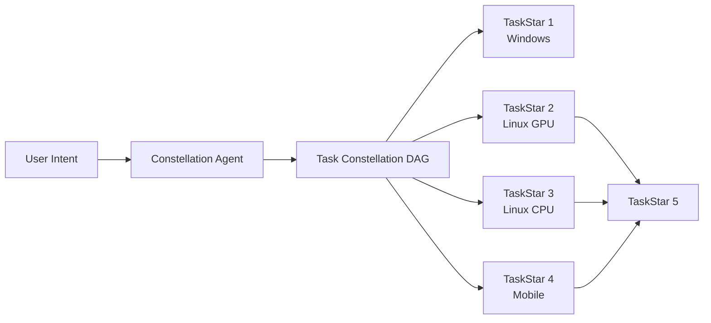
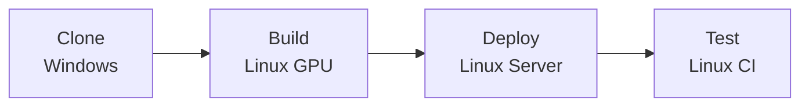
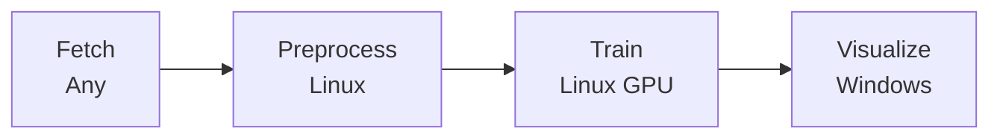
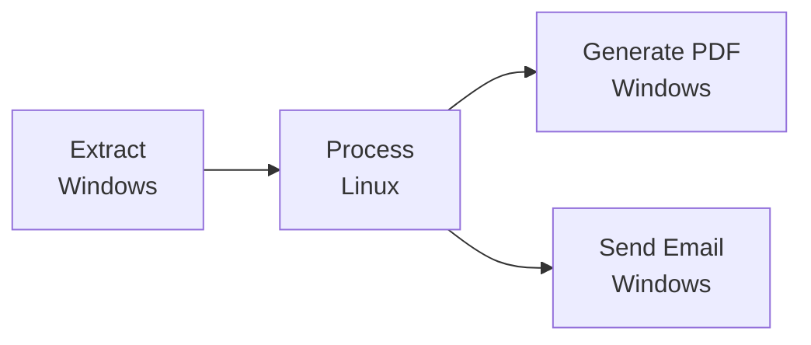
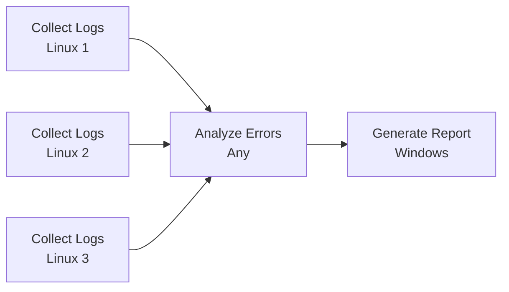
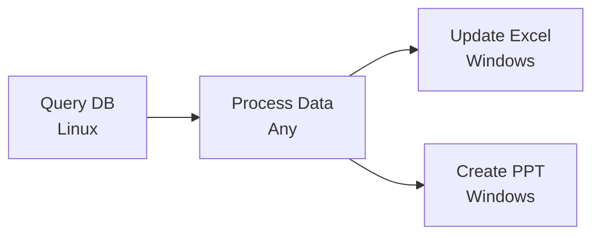

# UFO³ — Weaving the Digital Agent Galaxy

<div align="center">
  
  <p><em>From isolated device agents to interconnected constellations — Building the Digital Agent Galaxy</em></p>
</div>

---

## 🚀 What is UFO³ Galaxy?

**UFO³ Galaxy** is a **cross-device orchestration system** that turns isolated device agents into a unified digital collective. It models each request as a **Task Constellation**—a dynamic distributed DAG (Directed Acyclic Graph) whose nodes represent executable subtasks and whose edges capture data and control dependencies.

### The Challenge

Building truly ubiquitous intelligent agents requires overcoming four interlocking challenges:

1. **Asynchronous Parallelism**: Many subtasks can and should run concurrently across devices, but traditional orchestrators struggle to maintain correctness during parallel execution
2. **Dynamic Adaptation**: Workflows need to evolve based on runtime feedback, requiring safe concurrent modifications to executing DAGs
3. **Distributed Coordination**: Agents need reliable, low-latency communication for task dispatch and result streaming despite network variability
4. **Safety Guarantees**: Concurrent DAG modifications and parallel execution must preserve formal invariants to prevent race conditions and invalid states

### The Solution

UFO³ Galaxy addresses these challenges through a sophisticated orchestration framework with four key innovations:

- **Event-Driven Orchestration**: Asynchronous execution engine with observer pattern enables maximum parallelism while maintaining coordination
- **Dual-Mode Agent Control**: Separate creation and editing modes with finite state machine for controlled, safe DAG evolution
- **Safe Assignment Protocol**: Synchronization mechanisms prevent race conditions when LLM edits overlap with task execution
- **Formal Invariant Enforcement**: Three runtime invariants (I1-I3) guarantee correctness even under partial or invalid updates
- **Persistent WebSocket Protocol**: Reliable communication layer (AIP) with heartbeat monitoring and automatic reconnection

---

## 🏗️ Architecture

<div align="center">
  
  <p><em>UFO³ Galaxy Layered Architecture — From natural language to distributed execution</em></p>
</div>


### Layered Design

UFO³ Galaxy follows a **hierarchical orchestration model** that separates global coordination from local execution. This architecture enables scalable cross-device orchestration while maintaining consistent control and responsiveness across diverse operating systems and network environments.

#### 🎛️ Hierarchical Control Plane

**ConstellationClient** serves as the **global control plane**, maintaining a live registry of all connected device agents with their:
- Capability profiles and system specifications
- Runtime health metrics and availability status
- Current load and resource utilization

This registry enables intelligent task placement based on device capabilities, avoiding mismatches between task requirements and device capacity.

Each device hosts a **device agent server** that manages local orchestration through persistent WebSocket sessions with ConstellationClient. The server:
- Maintains execution contexts on the host
- Provides unified interface to underlying tools via MCP servers
- Handles task execution, telemetry streaming, and resource monitoring

**Clean separation**: Global orchestration policies are decoupled from device-specific heterogeneity, providing consistent abstraction across endpoints with different OS, hardware, or network conditions.

#### 🔄 Orchestration Flow

1. **DAG Synthesis**: ConstellationClient invokes the **Constellation Agent** to construct a TaskConstellation—a dynamic DAG encoding task decomposition, dependencies, and device mappings
2. **Device Assignment**: Each TaskStar (DAG node) is assigned to suitable device agents based on capability profiles and system load
3. **Asynchronous Execution**: The **Constellation Orchestrator** executes the DAG in an event-driven manner:
   - Task completions trigger dependent nodes
   - Failures prompt retry, migration, or partial DAG rewrites
   - Workflows adapt to real-time system dynamics (device churn, network variability)

**Result**: Highly parallel and resilient execution that sustains workflow completion even as subsets of devices fail or reconnect.

#### 🔌 Cross-Agent Communication

The **Agent Interaction Protocol (AIP)** handles all cross-agent interactions:
- Agent registration and capability synchronization
- Task dispatch and progress reporting  
- Result aggregation and telemetry streaming

Built on persistent WebSocket channels, AIP provides:
- **Lightweight**: Minimal overhead for control messages
- **Bidirectional**: Full-duplex communication between client and agents
- **Multiplexed**: Concurrent message streams over single connection
- **Low-latency**: Fast propagation of control signals and state updates
- **Resilient**: Maintains global consistency despite intermittent connectivity

Together, these design elements form a cohesive foundation for orchestrating large-scale, heterogeneous, and adaptive workflows across a resilient multi-device execution fabric.

---

## ✨ Core Design Principles

UFO³ Galaxy is built around **five tightly integrated design principles**:

### 1. 🌟 Declarative Decomposition into Dynamic DAG (Task Constellation)

Natural-language or programmatic requests are decomposed by the **Constellation Agent** into a structured DAG of **TaskStars** (nodes) and **TaskStarLines** (edges) that encode workflow logic and dependencies. This declarative structure enables automated scheduling, introspection, and dynamic modification throughout execution.



[Learn more →](constellation/overview.md)

### 2. 🔄 Continuous, Result-Driven Graph Evolution

The Task Constellation is a **living data structure**. Intermediate outputs, transient failures, and new observations trigger controlled rewrites—adding diagnostic TaskStars, creating fallbacks, rewiring dependencies, or pruning completed nodes—so the system adapts dynamically instead of aborting on errors.

The **Constellation Agent** operates in two modes:
- **Creation Mode**: Synthesizes initial DAG from user request
- **Editing Mode**: Incrementally refines constellation based on task completion events

[Learn more →](constellation_agent/overview.md)

### 3. 🎯 Heterogeneous, Asynchronous, and Safe Orchestration

Each Task Star is matched to the most suitable device agent via rich **Agent Profiles** reflecting OS, hardware, and capabilities. The **Constellation Orchestrator**:

- Executes tasks **asynchronously**, allowing multiple Task Stars to progress in parallel
- Maintains **safe assignment locking** to prevent race conditions during DAG modifications
- Performs **DAG consistency checks** to ensure correctness (acyclicity, valid assignments)
- Uses **event-driven coordination** with observer pattern for efficient resource utilization
- Enforces three formal invariants: **I1** (single assignment), **I2** (acyclic consistency), **I3** (valid update)

**Result**: High efficiency without compromising reliability, with formal safety guarantees.

[Learn more →](constellation_orchestrator/overview.md)

### 4. 🔌 Unified Agent Interaction Protocol (AIP)

Built atop persistent **WebSocket channels**, UFO³ establishes a unified, secure, and extensible communication layer:

- **Device Registration**: `REGISTER` messages establish device identity with Agent Server
- **Heartbeat Monitoring**: Periodic health checks ensure device availability
- **Task Dispatch**: `TASK` messages assign work to appropriate devices
- **Result Streaming**: `TASK_END` and `COMMAND_RESULTS` messages return execution outcomes
- **Connection Resilience**: Automatic reconnection with exponential backoff

This protocol **abstracts OS and network heterogeneity**, enabling seamless collaboration among agents across desktops, servers, and edge devices.

[Learn more →](../aip/overview.md)

### 5. 🛠️ Template-Driven Framework for Device Agents

To **democratize agent creation**, UFO³ provides:

- **Lightweight development templates** for rapid device agent creation
- **Agent Profile system** with declarative capability declarations
- **Device Registry** for centralized device management and discovery
- **MCP (Model Context Protocol)** server integration for tool augmentation
- **Infrastructure modules** (Session, Round, Context) for consistent agent behavior

This modular design accelerates integration while maintaining consistency across the constellation.

**🔌 Extensibility:** UFO³ is designed as a **universal framework** that supports developing new device agents for different platforms (mobile, web, IoT, embedded systems, etc.) and applications. Through the **Agent Interaction Protocol (AIP)**, custom device agents can seamlessly integrate into UFO³ Galaxy for coordinated multi-device automation. **Want to build your own device agent?** See our [Creating Custom Device Agents tutorial](../tutorials/creating_device_agent/overview.md) to learn how to extend UFO³ to new platforms.

[Learn more →](agent_registration/overview.md) | [MCP Integration →](../mcp/overview.md)

---

## 🎯 Key Capabilities

### 🌐 Cross-Device Collaboration
Execute workflows that span Windows desktops, Linux servers, GPU clusters, mobile devices, and edge nodes—all from a single natural language request.

### ⚡ Asynchronous Parallelism
Automatically identify parallelizable subtasks and execute them concurrently across devices through:
- **Event-driven scheduling** that continuously monitors DAG topology for ready tasks
- **Non-blocking execution** with Python `asyncio` for maximum concurrency
- **Dynamic adaptation** that integrates new tasks without interrupting running execution

Result: Dramatically reduced end-to-end latency compared to sequential execution.

### 🛡️ Safety & Consistency
- **Three formal invariants** (I1-I3) enforced at runtime for DAG correctness
- **Safe assignment locking** prevents race conditions during concurrent modifications
- **Acyclicity validation** ensures no circular dependencies
- **State merging** algorithm preserves execution progress during dynamic edits
- **Timeout protection** prevents deadlocks from agent failures

### 🔄 Dynamic Workflow Evolution
- **Dual-mode operation**: Separate creation and editing phases with controlled transitions
- **Feedback-driven adaptation**: Task completion events trigger intelligent constellation refinement
- **LLM-powered reasoning**: ReAct architecture for context-aware DAG modifications
- **Undo/redo support**: ConstellationEditor with command pattern for safe interactive editing

### 👁️ Rich Observability
- Real-time constellation visualization with DAG topology updates
- Event bus with publish-subscribe pattern for monitoring task progress
- Detailed execution logs with markdown trajectory support
- Task status tracking (pending, running, completed, failed, cancelled)
- Dependency graph inspection and validation tools

---

## 🎨 Use Cases

### 🖥️ Software Development & Deployment
*"Clone the repo on my laptop, build the Docker image on the GPU server, deploy to staging, and run the test suite on the CI cluster."*

**Workflow DAG:**


### 📊 Data Science Workflows
*"Fetch the dataset from cloud storage, preprocess on the Linux workstation, train the model on the A100 node, and generate a visualization dashboard on my Windows machine."*

**Workflow DAG:**


### 📝 Cross-Platform Document Processing
*"Extract data from Excel on Windows, process with Python scripts on Linux, generate PDF reports, and send summary emails."*

**Workflow DAG:**


### 🔬 Distributed System Monitoring
*"Collect server logs from all Linux machines, analyze for errors, generate alerts, and create a consolidated report."*

**Workflow DAG:**


### 🏢 Enterprise Automation
*"Query the database on the server, process the results, update Excel spreadsheets on Windows, and generate PowerPoint presentations."*

**Workflow DAG:**


---

## 🗺️ Documentation Structure

### 🚀 [Quick Start](../getting_started/quick_start_galaxy.md)
Get UFO³ Galaxy up and running in minutes with our step-by-step guide

### 👥 [Galaxy Client](client/overview.md)
Device coordination, connection management, and ConstellationClient API

### 🧠 [Constellation Agent](constellation_agent/overview.md)
LLM-driven task decomposition, DAG creation, and dynamic workflow evolution

### ⚙️ [Constellation Orchestrator](constellation_orchestrator/overview.md)
Asynchronous execution engine, event-driven coordination, and safety guarantees

### 📊 [Task Constellation](constellation/overview.md)
DAG structure, TaskStar nodes, TaskStarLine edges, and constellation editor

### 🆔 [Agent Registration](agent_registration/overview.md)
Device registry, agent profiles, and registration flow

### 🌐 [Agent Interaction Protocol](../aip/overview.md)
WebSocket messaging, protocol specification, and communication patterns

### ⚙️ [Configuration](../configuration/system/galaxy_devices.md)
Device pools, capabilities, and orchestration policies

---

## 🚦 Getting Started

Ready to build your Digital Agent Galaxy? Follow these steps:

### 1. Install UFO³
```bash
# Clone the repository
git clone https://github.com/microsoft/UFO.git
cd UFO

# Install dependencies
pip install -r requirements.txt
```

### 2. Configure Device Pool

Create configuration files in `config/galaxy/`:

**`config/galaxy/devices.yaml`** - Define your devices:

```yaml
devices:
  - device_id: "windowsagent"
    server_url: "ws://localhost:5005/ws"
    os: "windows"
    capabilities:
      - "web_browsing"
      - "office_applications"
      - "file_management"
    metadata:
      location: "home_office"
      os: "windows"
      performance: "medium"
    max_retries: 5
    
  - device_id: "linux_agent_1"
    server_url: "ws://localhost:5001/ws"
    os: "linux"
    capabilities:
      - "server"
      - "python"
      - "docker"
    metadata:
      os: "linux"
      performance: "high"
      logs_file_path: "/root/log/log1.txt"
    auto_connect: true
    max_retries: 5
```

**`config/galaxy/constellation.yaml`** - Configure runtime settings:

```yaml
# Constellation Runtime Settings
CONSTELLATION_ID: "my_constellation"
HEARTBEAT_INTERVAL: 30.0  # Heartbeat interval in seconds
RECONNECT_DELAY: 5.0  # Delay before reconnecting in seconds
MAX_CONCURRENT_TASKS: 6  # Maximum concurrent tasks
MAX_STEP: 15  # Maximum steps per session

# Device Configuration
DEVICE_INFO: "config/galaxy/devices.yaml"

# Logging Configuration
LOG_TO_MARKDOWN: true
```

See [Galaxy Configuration](../configuration/system/galaxy_devices.md) for complete documentation.

### 3. Start Device Agents

On each device, launch the Agent Server:

**On Windows:**
```powershell
# Start Agent Server on port 5005
python -m ufo --mode agent-server --port 5005
```

**On Linux:**
```bash
# Start Agent Server on port 5001
python -m ufo --mode agent-server --port 5001
```

### 4. Launch Galaxy Client

**Interactive Mode:**
```bash
python -m galaxy --interactive
```

**Direct Request:**
```bash
python -m galaxy "Your cross-device task here"
```

**Programmatic API:**
```python
from galaxy.galaxy_client import GalaxyClient

async def main():
    client = GalaxyClient(session_name="my_session")
    await client.initialize()
    result = await client.process_request("Your task request")
    await client.shutdown()
```

For detailed instructions, see the [Quick Start Guide](../getting_started/quick_start_galaxy.md).

---

## 🔧 System Components

UFO³ Galaxy consists of several integrated components working together:

### Core Components

| Component | Location | Responsibility |
|-----------|----------|----------------|
| **GalaxyClient** | `galaxy/galaxy_client.py` | Session management, user interaction, orchestration coordination |
| **ConstellationClient** | `galaxy/client/constellation_client.py` | Device management, connection lifecycle, task assignment |
| **ConstellationAgent** | `galaxy/agents/constellation_agent.py` | LLM-driven DAG synthesis and evolution, state machine control |
| **TaskConstellationOrchestrator** | `galaxy/constellation/orchestrator/` | Asynchronous execution, event coordination, safety enforcement |
| **TaskConstellation** | `galaxy/constellation/task_constellation.py` | DAG data structure, validation, and modification APIs |
| **DeviceManager** | `galaxy/client/device_manager.py` | WebSocket connections, heartbeat monitoring, message routing |
| **Agent Server** | `ufo/mode/agent_server.py` | Device-side WebSocket server, AIP protocol handler |

### Supporting Infrastructure

| Component | Purpose |
|-----------|---------|
| **Event Bus** | Publish-subscribe system for constellation events |
| **Observer Pattern** | Event listeners for visualization and synchronization |
| **Device Registry** | Centralized device information and capability tracking |
| **Agent Profile** | Device metadata and capability declarations |
| **MCP Servers** | Tool augmentation via Model Context Protocol |

For detailed component documentation, see the respective sections in [Documentation Structure](#-documentation-structure).

### Technology Stack

| Layer | Technologies |
|-------|-------------|
| **Programming** | Python 3.10+, asyncio, dataclasses |
| **Communication** | WebSockets, JSON-RPC |
| **LLM Integration** | OpenAI API, Azure OpenAI, Gemini, Claude, Custom Models |
| **Tool Augmentation** | Model Context Protocol (MCP) |
| **Configuration** | YAML, Pydantic models |
| **Logging** | Python logging, Rich console, Markdown trajectory |
| **Testing** | pytest, mock agents |

---

## 🌟 From Devices to Constellations to Galaxy

UFO³ represents a paradigm shift in intelligent automation:

- **Single Device** → Isolated agents operating within one OS
- **Task Constellation** → Coordinated multi-device workflows for one task
- **Digital Agent Galaxy** → Interconnected constellations spanning your entire digital estate

Over time, multiple constellations can interconnect, weaving together agents, devices, and capabilities into a self-organizing **Digital Agent Galaxy**. This design elevates cross-device automation from a brittle engineering challenge to a unified orchestration paradigm, where multi-device workflows become naturally expressive, paving the way for large-scale, adaptive, and resilient intelligent ubiquitous computing systems.

---

## 📊 Performance Monitoring & Evaluation

UFO³ Galaxy provides comprehensive performance monitoring and evaluation tools to analyze multi-device workflow execution:

### Automated Metrics Collection

Galaxy automatically collects detailed performance metrics during execution through an event-driven observer pattern:

- **Task Metrics**: Execution times, success rates, bottleneck identification
- **Constellation Metrics**: DAG statistics, parallelism analysis, critical path computation
- **Modification Metrics**: Dynamic editing patterns and adaptation frequency
- **Device Metrics**: Per-device performance and resource utilization

All metrics are captured in real-time without impacting execution performance and saved to structured JSON files for programmatic analysis.

### Trajectory Report

Galaxy automatically generates a comprehensive Markdown trajectory report (`output.md`) documenting the complete execution lifecycle:

```
logs/galaxy/<task_name>/output.md
```

This human-readable report includes:
- Step-by-step execution timeline with agent actions
- Interactive DAG topology visualizations showing constellation evolution
- Detailed task execution logs with results and errors
- Device connection status and coordination events
- Complete before/after constellation states at each step

The trajectory report provides visual debugging and workflow understanding, complementing the quantitative `result.json` metrics.

### Result JSON Format

After each session, Galaxy also generates a comprehensive `result.json` file containing:

```
logs/galaxy/<task_name>/result.json
```

This file includes:
- Complete session metadata and execution timeline
- Task-by-task performance breakdown
- Constellation statistics (parallelism ratio, critical path, max concurrency)
- Modification history showing DAG evolution
- Final results and outcomes

**Example Key Metrics:**

| Metric | Description | Use Case |
|--------|-------------|----------|
| `parallelism_ratio` | Efficiency of parallel execution (total_work / critical_path) | Optimization target |
| `critical_path_length` | Minimum possible execution time | Theoretical performance limit |
| `average_task_duration` | Mean task execution time | Baseline performance |
| `modification_count` | Number of dynamic DAG edits | Adaptability analysis |

### Performance Analysis Tools

```python
import json

# Load session results
with open("logs/galaxy/task_32/result.json", 'r') as f:
    result = json.load(f)

# Extract key metrics
metrics = result["session_results"]["metrics"]
task_stats = metrics["task_statistics"]
const_stats = result["session_results"]["final_constellation_stats"]

print(f"✅ Success Rate: {task_stats['success_rate'] * 100:.1f}%")
print(f"⏱️  Avg Task Duration: {task_stats['average_task_duration']:.2f}s")
print(f"🔀 Parallelism Ratio: {const_stats['parallelism_ratio']:.2f}")
```

**Documentation:**

- **[Trajectory Report Guide](./evaluation/trajectory_report.md)** - Complete guide to the human-readable execution log with DAG visualizations
- **[Performance Metrics Guide](./evaluation/performance_metrics.md)** - Comprehensive metrics documentation with analysis examples
- **[Result JSON Reference](./evaluation/result_json.md)** - Complete schema reference and programmatic access guide

---

## �📚 Learn More

- **Research Paper**: [UFO³: Weaving the Digital Agent Galaxy](https://arxiv.org/) *(Coming Soon)*
- **UFO² (Desktop AgentOS)**: [Documentation](../ufo2/overview.md)
- **UFO (Original)**: [GitHub Repository](https://github.com/microsoft/UFO)

---

## 🤝 Contributing

We welcome contributions! Whether you're building new device agents, improving orchestration algorithms, or enhancing the protocol, check out our Contributing Guide on GitHub.

---

## 📄 License

UFO³ Galaxy is released under the MIT License.

---

<div align="center">
  <p><strong>Transform your distributed devices into a unified digital collective.</strong></p>
  <p><em>UFO³ Galaxy — Where every device is a star, and every task is a constellation.</em></p>
</div>
